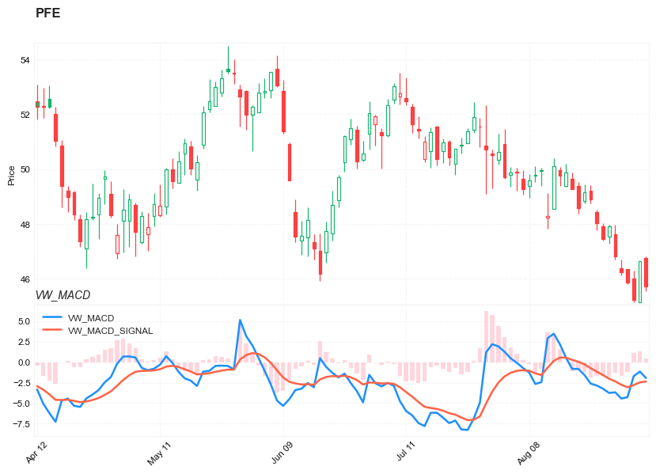

## Volume-Weighted Moving Average Convergence/Divergence (VW_MACD)

**References**

- [traders.com: Traders tips MACD 2009-10](https://traders.com/documentation/feedbk_docs/2009/10/traderstips.html)


**Definition**

The article “Volume-Weighted Macd Histogram” by David Hawkins in this issue suggests a method of incorporating volume data in the moving average convergence/divergence (Macd) histogram.


##### Load basic packages 


```python
import pandas as pd
import numpy as np
import os
import gc
import copy
from pathlib import Path
from datetime import datetime, timedelta, time, date
```


```python
#this package is to download equity price data from yahoo finance
#the source code of this package can be found here: https://github.com/ranaroussi/yfinance/blob/main
import yfinance as yf
```


```python
pd.options.display.max_rows = 100
pd.options.display.max_columns = 100

import warnings
warnings.filterwarnings("ignore")

import pytorch_lightning as pl
random_seed=1234
pl.seed_everything(random_seed)
```

    Global seed set to 1234
    


    1234


```python
#S&P 500 (^GSPC),  Dow Jones Industrial Average (^DJI), NASDAQ Composite (^IXIC)
#Russell 2000 (^RUT), Crude Oil Nov 21 (CL=F), Gold Dec 21 (GC=F)
#Treasury Yield 10 Years (^TNX)

#benchmark_tickers = ['^GSPC', '^DJI', '^IXIC', '^RUT',  'CL=F', 'GC=F', '^TNX']

benchmark_tickers = ['^GSPC']
tickers = benchmark_tickers + ['GSK', 'NVO', 'PFE']
```


```python
#https://github.com/ranaroussi/yfinance/blob/main/yfinance/base.py
#     def history(self, period="1mo", interval="1d",
#                 start=None, end=None, prepost=False, actions=True,
#                 auto_adjust=True, back_adjust=False,
#                 proxy=None, rounding=False, tz=None, timeout=None, **kwargs):

dfs = {}

for ticker in tickers:
    cur_data = yf.Ticker(ticker)
    hist = cur_data.history(period="max", start='2000-01-01')
    print(datetime.now(), ticker, hist.shape, hist.index.min(), hist.index.max())
    dfs[ticker] = hist
```

    2022-09-05 12:13:41.939607 ^GSPC (5706, 7) 1999-12-31 00:00:00 2022-09-02 00:00:00
    2022-09-05 12:13:42.369392 GSK (5706, 7) 1999-12-31 00:00:00 2022-09-02 00:00:00
    2022-09-05 12:13:42.823697 NVO (5706, 7) 1999-12-31 00:00:00 2022-09-02 00:00:00
    2022-09-05 12:13:43.275197 PFE (5706, 7) 1999-12-31 00:00:00 2022-09-02 00:00:00
    


```python
ticker = 'PFE'
dfs[ticker].tail(5)
```


<div>
<style scoped>
    .dataframe tbody tr th:only-of-type {
        vertical-align: middle;
    }

    .dataframe tbody tr th {
        vertical-align: top;
    }

    .dataframe thead th {
        text-align: right;
    }
</style>
<table border="1" class="dataframe">
  <thead>
    <tr style="text-align: right;">
      <th></th>
      <th>Open</th>
      <th>High</th>
      <th>Low</th>
      <th>Close</th>
      <th>Volume</th>
      <th>Dividends</th>
      <th>Stock Splits</th>
    </tr>
    <tr>
      <th>Date</th>
      <th></th>
      <th></th>
      <th></th>
      <th></th>
      <th></th>
      <th></th>
      <th></th>
    </tr>
  </thead>
  <tbody>
    <tr>
      <th>2022-08-29</th>
      <td>46.380001</td>
      <td>46.689999</td>
      <td>46.119999</td>
      <td>46.230000</td>
      <td>13400500</td>
      <td>0.0</td>
      <td>0.0</td>
    </tr>
    <tr>
      <th>2022-08-30</th>
      <td>46.340000</td>
      <td>46.349998</td>
      <td>45.799999</td>
      <td>45.849998</td>
      <td>16303000</td>
      <td>0.0</td>
      <td>0.0</td>
    </tr>
    <tr>
      <th>2022-08-31</th>
      <td>46.009998</td>
      <td>46.290001</td>
      <td>45.130001</td>
      <td>45.230000</td>
      <td>26416800</td>
      <td>0.0</td>
      <td>0.0</td>
    </tr>
    <tr>
      <th>2022-09-01</th>
      <td>45.139999</td>
      <td>46.650002</td>
      <td>45.139999</td>
      <td>46.630001</td>
      <td>19947600</td>
      <td>0.0</td>
      <td>0.0</td>
    </tr>
    <tr>
      <th>2022-09-02</th>
      <td>46.740002</td>
      <td>46.799999</td>
      <td>45.529999</td>
      <td>45.700001</td>
      <td>14662700</td>
      <td>0.0</td>
      <td>0.0</td>
    </tr>
  </tbody>
</table>
</div>


##### Define VW_MACD calculation function


```python
def cal_vw_macd(
        ohlcv: pd.DataFrame,
        fast_period: int = 12,
        slow_period: int = 26,
        signal: int = 9,
        column: str = "close",
        adjust: bool = True,
    ) -> pd.DataFrame:
    
    ohlcv = ohlcv.copy()
    ohlcv.columns = [c.lower() for c in ohlcv.columns]
    
    vp = ohlcv["volume"] * ohlcv[column]
    ema_vpf = vp.ewm(ignore_na=False, span=fast_period, adjust=adjust).mean()
    ema_vpl = vp.ewm(ignore_na=False, span=slow_period, adjust=adjust).mean()
    ema_v = ohlcv["volume"].ewm(ignore_na=False, span=fast_period, adjust=adjust).mean()
    
    vw_fast = ema_vpf/ema_v
    vw_slow = ema_vpl/ema_v

    vw_macd = vw_fast - vw_slow
    vw_macd_signal = vw_macd.ewm(ignore_na=False, span=signal, adjust=adjust).mean()
    
    return pd.DataFrame(data = {'VW_MACD': vw_macd.values, 
                                'VW_MACD_SIGNAL': vw_macd_signal.values },
                        index = ohlcv.index                        
                       )
       
```

##### Calculate VW_MACD


```python
df = dfs[ticker][['Open', 'High', 'Low', 'Close', 'Volume']]
```


```python
df = df.round(2)
```


```python
cal_vw_macd
```


    <function __main__.cal_vw_macd(ohlcv: pandas.core.frame.DataFrame, fast_period: int = 12, slow_period: int = 26, signal: int = 9, column: str = 'close', adjust: bool = True) -> pandas.core.frame.DataFrame>


```python
df_ta = cal_vw_macd(df, fast_period = 12, slow_period = 26, signal = 9, column = 'close')
df = df.merge(df_ta, left_index = True, right_index = True, how='inner' )

del df_ta
gc.collect()
```


    16005


```python
display(df.head(5))
display(df.tail(5))
```


<div>
<style scoped>
    .dataframe tbody tr th:only-of-type {
        vertical-align: middle;
    }

    .dataframe tbody tr th {
        vertical-align: top;
    }

    .dataframe thead th {
        text-align: right;
    }
</style>
<table border="1" class="dataframe">
  <thead>
    <tr style="text-align: right;">
      <th></th>
      <th>Open</th>
      <th>High</th>
      <th>Low</th>
      <th>Close</th>
      <th>Volume</th>
      <th>VW_MACD</th>
      <th>VW_MACD_SIGNAL</th>
    </tr>
    <tr>
      <th>Date</th>
      <th></th>
      <th></th>
      <th></th>
      <th></th>
      <th></th>
      <th></th>
      <th></th>
    </tr>
  </thead>
  <tbody>
    <tr>
      <th>1999-12-31</th>
      <td>14.25</td>
      <td>14.31</td>
      <td>14.11</td>
      <td>14.22</td>
      <td>5939817</td>
      <td>0.000000</td>
      <td>0.000000</td>
    </tr>
    <tr>
      <th>2000-01-03</th>
      <td>14.06</td>
      <td>14.20</td>
      <td>13.87</td>
      <td>13.98</td>
      <td>12873345</td>
      <td>0.221004</td>
      <td>0.122780</td>
    </tr>
    <tr>
      <th>2000-01-04</th>
      <td>13.70</td>
      <td>13.81</td>
      <td>13.16</td>
      <td>13.46</td>
      <td>14208974</td>
      <td>0.268845</td>
      <td>0.182643</td>
    </tr>
    <tr>
      <th>2000-01-05</th>
      <td>13.54</td>
      <td>13.98</td>
      <td>13.51</td>
      <td>13.68</td>
      <td>12981591</td>
      <td>0.246073</td>
      <td>0.204130</td>
    </tr>
    <tr>
      <th>2000-01-06</th>
      <td>13.70</td>
      <td>14.36</td>
      <td>13.68</td>
      <td>14.17</td>
      <td>11115273</td>
      <td>0.170659</td>
      <td>0.194173</td>
    </tr>
  </tbody>
</table>
</div>


<div>
<style scoped>
    .dataframe tbody tr th:only-of-type {
        vertical-align: middle;
    }

    .dataframe tbody tr th {
        vertical-align: top;
    }

    .dataframe thead th {
        text-align: right;
    }
</style>
<table border="1" class="dataframe">
  <thead>
    <tr style="text-align: right;">
      <th></th>
      <th>Open</th>
      <th>High</th>
      <th>Low</th>
      <th>Close</th>
      <th>Volume</th>
      <th>VW_MACD</th>
      <th>VW_MACD_SIGNAL</th>
    </tr>
    <tr>
      <th>Date</th>
      <th></th>
      <th></th>
      <th></th>
      <th></th>
      <th></th>
      <th></th>
      <th></th>
    </tr>
  </thead>
  <tbody>
    <tr>
      <th>2022-08-29</th>
      <td>46.38</td>
      <td>46.69</td>
      <td>46.12</td>
      <td>46.23</td>
      <td>13400500</td>
      <td>-4.444657</td>
      <td>-2.767550</td>
    </tr>
    <tr>
      <th>2022-08-30</th>
      <td>46.34</td>
      <td>46.35</td>
      <td>45.80</td>
      <td>45.85</td>
      <td>16303000</td>
      <td>-4.268517</td>
      <td>-3.067744</td>
    </tr>
    <tr>
      <th>2022-08-31</th>
      <td>46.01</td>
      <td>46.29</td>
      <td>45.13</td>
      <td>45.23</td>
      <td>26416800</td>
      <td>-1.715713</td>
      <td>-2.797338</td>
    </tr>
    <tr>
      <th>2022-09-01</th>
      <td>45.14</td>
      <td>46.65</td>
      <td>45.14</td>
      <td>46.63</td>
      <td>19947600</td>
      <td>-1.158779</td>
      <td>-2.469626</td>
    </tr>
    <tr>
      <th>2022-09-02</th>
      <td>46.74</td>
      <td>46.80</td>
      <td>45.53</td>
      <td>45.70</td>
      <td>14662700</td>
      <td>-1.936900</td>
      <td>-2.363081</td>
    </tr>
  </tbody>
</table>
</div>


```python
#https://github.com/matplotlib/mplfinance
#this package help visualize financial data
import mplfinance as mpf
import matplotlib.colors as mcolors

# all_colors = list(mcolors.CSS4_COLORS.keys())#"CSS Colors"
all_colors = list(mcolors.TABLEAU_COLORS.keys()) # "Tableau Palette",
# all_colors = list(mcolors.BASE_COLORS.keys()) #"Base Colors",


#https://github.com/matplotlib/mplfinance/issues/181#issuecomment-667252575
#list of colors: https://matplotlib.org/stable/gallery/color/named_colors.html
#https://github.com/matplotlib/mplfinance/blob/master/examples/styles.ipynb

def plot_macd(main_data, mid_panel, chart_type='candle', names=None, 
                  figratio=(14,9)):


    style = mpf.make_mpf_style(base_mpf_style='yahoo',  #charles
                               base_mpl_style = 'seaborn-whitegrid',
#                                marketcolors=mpf.make_marketcolors(up="r", down="#0000CC",inherit=True),
                               gridcolor="whitesmoke", 
                               gridstyle="--", #or None, or - for solid
                               gridaxis="both", 
                               edgecolor = 'whitesmoke',
                               facecolor = 'white', #background color within the graph edge
                               figcolor = 'white', #background color outside of the graph edge
                               y_on_right = False,
                               rc =  {'legend.fontsize': 'small',#or number
                                      #'figure.figsize': (14, 9),
                                     'axes.labelsize': 'small',
                                     'axes.titlesize':'small',
                                     'xtick.labelsize':'small',#'x-small', 'small','medium','large'
                                     'ytick.labelsize':'small'
                                     }, 
                              )   

    if (chart_type is None) or (chart_type not in ['ohlc', 'line', 'candle', 'hollow_and_filled']):
        chart_type = 'candle'
    len_dict = {'candle':2, 'ohlc':3, 'line':1, 'hollow_and_filled':2}    
        
    kwargs = dict(type=chart_type, figratio=figratio, volume=False,
                  panel_ratios=(4,2), tight_layout=True, style=style, returnfig=True)
    
    if names is None:
        names = {'main_title': '', 'sub_tile': ''}
    


    added_plots = { 
        'VW_MACD': mpf.make_addplot(mid_panel['VW_MACD'], panel=1, color='dodgerblue', secondary_y=False), 
        'VW_MACD_SIGNAL': mpf.make_addplot(mid_panel['VW_MACD_SIGNAL'], panel=1, color='tomato', secondary_y=False), 
        'MACD-SIGNAL': mpf.make_addplot(mid_panel['VW_MACD']-mid_panel['VW_MACD_SIGNAL'], type='bar',width=0.7,panel=1, color="pink",alpha=0.65,secondary_y=False),
    }

                         

    fig, axes = mpf.plot(main_data,  **kwargs,
                         addplot=list(added_plots.values()),
                        )
    # add a new suptitle
    fig.suptitle(names['main_title'], y=1.05, fontsize=12, x=0.128)

    axes[0].set_title(names['sub_tile'], fontsize=10, style='italic',  loc='left')
    
    axes[2].set_title('VW_MACD', fontsize=10, style='italic',  loc='left')

    
    #set legend

    axes[2].legend([None]*2)
    handles = axes[2].get_legend().legendHandles
#     print(handles)
    axes[2].legend(handles=handles,labels=['VW_MACD', 'VW_MACD_SIGNAL'])
    
    

#     axes[0].set_ylabel(names['y_tiles'][0])
#     axes[2].set_ylabel(names['y_tiles'][1])
    return fig, axes
   
```


```python

start = -100
end = df.shape[0]

names = {'main_title': f'{ticker}', 
         'sub_tile': ''}


aa_, bb_ = plot_macd(df.iloc[start:end][['Open', 'High', 'Low', 'Close', 'Volume']], 
             df.iloc[start:end][['VW_MACD', 'VW_MACD_SIGNAL']], 
             chart_type='hollow_and_filled',names = names)
```


    

    

