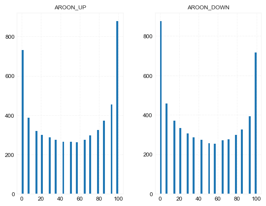
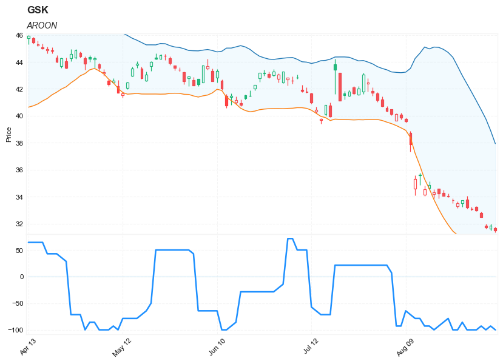

## Aroon

**References**

- [github.com: aroon_ulcer](https://github.com/LukasJur/technical_analysis_indicators_python/blob/master/aroon_ulcer.py)
- [github.com: pandas_ta: aroon](https://github.com/twopirllc/pandas-ta/blob/bc3b292bf1cc1d5f2aba50bb750a75209d655b37/pandas_ta/trend/aroon.py)
- [github.com: Aroon_Indicator_Backtest](https://github.com/guiregueira/Aroon_Oscilator_Backtest/blob/main/Aroon_Indicator_Backtest.ipynb)

**Definition**

The Aroon indicators 

>measure the number of periods since price recorded an x-day high or low. AroonUp is based on price highs, while Aroon-Down is based on price lows. The Aroon indicators are shown
in percentage terms and fluctuate between 0 and 100. View on a particular stock is bullish Aroon-Up
is above 50 and Aroon-Down is below 50. This indicates a greater propensity for new x-day highs than
lows. The converse is true for a downtrend. The view on a stock is bearish when Aroon-Up is below
50 and Aroon-Down is above 50. The calculation of the Aroon indicator is mentioned in the link in
the bibliography.


##### Load basic packages 


```python
import pandas as pd
import numpy as np
import os
import gc
import copy
from pathlib import Path
from datetime import datetime, timedelta, time, date
```


```python
#this package is to download equity price data from yahoo finance
#the source code of this package can be found here: https://github.com/ranaroussi/yfinance/blob/main
import yfinance as yf
```


```python
pd.options.display.max_rows = 100
pd.options.display.max_columns = 100

import warnings
warnings.filterwarnings("ignore")

import pytorch_lightning as pl
random_seed=1234
pl.seed_everything(random_seed)
```

    Global seed set to 1234
    


    1234


```python
#S&P 500 (^GSPC),  Dow Jones Industrial Average (^DJI), NASDAQ Composite (^IXIC)
#Russell 2000 (^RUT), Crude Oil Nov 21 (CL=F), Gold Dec 21 (GC=F)
#Treasury Yield 10 Years (^TNX)

#benchmark_tickers = ['^GSPC', '^DJI', '^IXIC', '^RUT',  'CL=F', 'GC=F', '^TNX']

benchmark_tickers = ['^GSPC']
tickers = benchmark_tickers + ['GSK', 'NVO', 'PFE']
```


```python
#https://github.com/ranaroussi/yfinance/blob/main/yfinance/base.py
#     def history(self, period="1mo", interval="1d",
#                 start=None, end=None, prepost=False, actions=True,
#                 auto_adjust=True, back_adjust=False,
#                 proxy=None, rounding=False, tz=None, timeout=None, **kwargs):

dfs = {}

for ticker in tickers:
    cur_data = yf.Ticker(ticker)
    hist = cur_data.history(period="max", start='2000-01-01')
    print(datetime.now(), ticker, hist.shape, hist.index.min(), hist.index.max())
    dfs[ticker] = hist
```

    2022-09-07 09:41:17.067982 ^GSPC (5707, 7) 1999-12-31 00:00:00 2022-09-06 00:00:00
    2022-09-07 09:41:17.398588 GSK (5707, 7) 1999-12-31 00:00:00 2022-09-06 00:00:00
    2022-09-07 09:41:17.789028 NVO (5707, 7) 1999-12-31 00:00:00 2022-09-06 00:00:00
    2022-09-07 09:41:18.193807 PFE (5707, 7) 1999-12-31 00:00:00 2022-09-06 00:00:00
    


```python
ticker = 'GSK'
dfs[ticker].tail(5)
```


<div>
<style scoped>
    .dataframe tbody tr th:only-of-type {
        vertical-align: middle;
    }

    .dataframe tbody tr th {
        vertical-align: top;
    }

    .dataframe thead th {
        text-align: right;
    }
</style>
<table border="1" class="dataframe">
  <thead>
    <tr style="text-align: right;">
      <th></th>
      <th>Open</th>
      <th>High</th>
      <th>Low</th>
      <th>Close</th>
      <th>Volume</th>
      <th>Dividends</th>
      <th>Stock Splits</th>
    </tr>
    <tr>
      <th>Date</th>
      <th></th>
      <th></th>
      <th></th>
      <th></th>
      <th></th>
      <th></th>
      <th></th>
    </tr>
  </thead>
  <tbody>
    <tr>
      <th>2022-08-30</th>
      <td>33.230000</td>
      <td>33.290001</td>
      <td>32.919998</td>
      <td>32.959999</td>
      <td>3994500</td>
      <td>0.0</td>
      <td>0.0</td>
    </tr>
    <tr>
      <th>2022-08-31</th>
      <td>32.790001</td>
      <td>32.880001</td>
      <td>32.459999</td>
      <td>32.480000</td>
      <td>4291800</td>
      <td>0.0</td>
      <td>0.0</td>
    </tr>
    <tr>
      <th>2022-09-01</th>
      <td>31.830000</td>
      <td>31.990000</td>
      <td>31.610001</td>
      <td>31.690001</td>
      <td>12390900</td>
      <td>0.0</td>
      <td>0.0</td>
    </tr>
    <tr>
      <th>2022-09-02</th>
      <td>31.600000</td>
      <td>31.969999</td>
      <td>31.469999</td>
      <td>31.850000</td>
      <td>8152600</td>
      <td>0.0</td>
      <td>0.0</td>
    </tr>
    <tr>
      <th>2022-09-06</th>
      <td>31.650000</td>
      <td>31.760000</td>
      <td>31.370001</td>
      <td>31.469999</td>
      <td>5613900</td>
      <td>0.0</td>
      <td>0.0</td>
    </tr>
  </tbody>
</table>
</div>


##### Define Aroon calculation function

    


```python
def cal_aroon(ohlc: pd.DataFrame, period: int = 10) -> pd.DataFrame:
    """
    The Aroon indicators measure the number of periods since price recorded an x-day high or low. AroonUp is based on price highs, while Aroon-Down is based on price lows. The Aroon indicators are shown
    in percentage terms and fluctuate between 0 and 100. View on a particular stock is bullish Aroon-Up
    is above 50 and Aroon-Down is below 50. This indicates a greater propensity for new x-day highs than
    lows. The converse is true for a downtrend. The view on a stock is bearish when Aroon-Up is below
    50 and Aroon-Down is above 50. The calculation of the Aroon indicator is mentioned in the link in
    the bibliography.
    
    the ohlc datafrome is sorted by 'Date' ascending
    
    Note the following calculation is wrong in that if there are more than 1 max in the rolling period, 
        it will get the first (i.e. the earlies in date) max instead of most recent (i.e. the last) max
        periods = 10
        aroon_up = df['High'].rolling(periods+1).apply(lambda x: x.argmax(), raw=True) / periods * 100
        aroon_down = df['Low'].rolling(periods+1).apply(lambda x: x.argmin(), raw=True) / periods * 100
    """
    ohlc = ohlc.copy()
    ohlc.columns = [c.lower() for c in ohlc.columns]
    
    high = ohlc["high"]
    low = ohlc["low"]
    
    hh_loc = high.rolling(period + 1).apply(lambda x: np.argmax(x[::-1]), raw=True)
    ll_loc = low.rolling(period + 1).apply(lambda x: np.argmin(x[::-1]), raw=True)
    aroon_up = 100*(1 - hh_loc/period)
    aroon_down = 100*(1 - ll_loc/period)
    aroon = aroon_up - aroon_down

    return pd.DataFrame(data={'AROON_UP': aroon_up, 
                              'AROON_DOWN': aroon_down,
                              'AROON': aroon,
                             }, 
                        index = ohlc.index)
```

##### Calculate AROON


```python
df = dfs[ticker][['Open', 'High', 'Low', 'Close', 'Volume']]
```


```python
df = df.round(2)
```


```python
help(cal_aroon)
```

    Help on function cal_aroon in module __main__:
    
    cal_aroon(ohlc: pandas.core.frame.DataFrame, period: int = 10) -> pandas.core.frame.DataFrame
        The Aroon indicators measure the number of periods since price recorded an x-day high or low. AroonUp is based on price highs, while Aroon-Down is based on price lows. The Aroon indicators are shown
        in percentage terms and fluctuate between 0 and 100. View on a particular stock is bullish Aroon-Up
        is above 50 and Aroon-Down is below 50. This indicates a greater propensity for new x-day highs than
        lows. The converse is true for a downtrend. The view on a stock is bearish when Aroon-Up is below
        50 and Aroon-Down is above 50. The calculation of the Aroon indicator is mentioned in the link in
        the bibliography.
        
        the ohlc datafrome is sorted by 'Date' ascending
        
        Note the following calculation is wrong in that if there are more than 1 max in the rolling period, 
            it will get the first (i.e. the earlies in date) max instead of most recent (i.e. the last) max
            periods = 10
            aroon_up = df['High'].rolling(periods+1).apply(lambda x: x.argmax(), raw=True) / periods * 100
            aroon_down = df['Low'].rolling(periods+1).apply(lambda x: x.argmin(), raw=True) / periods * 100
    
    


```python
df_ta = cal_aroon(df, period = 14)
df = df.merge(df_ta, left_index = True, right_index = True, how='inner' )

del df_ta
gc.collect()
```


    11055


```python
from core.finta import TA
```


```python
help(TA.BBANDS)
```

    Help on function BBANDS in module core.finta:
    
    BBANDS(ohlc: pandas.core.frame.DataFrame, period: int = 20, MA: pandas.core.series.Series = None, column: str = 'close', std_multiplier: float = 2) -> pandas.core.frame.DataFrame
        Developed by John Bollinger, Bollinger Bands® are volatility bands placed above and below a moving average.
        Volatility is based on the standard deviation, which changes as volatility increases and decreases.
        The bands automatically widen when volatility increases and narrow when volatility decreases.
        
        This method allows input of some other form of moving average like EMA or KAMA around which BBAND will be formed.
        Pass desired moving average as <MA> argument. For example BBANDS(MA=TA.KAMA(20)).
    
    


```python
df_ta = TA.BBANDS(df,  period = 20, column="close", std_multiplier=1.95)
df = df.merge(df_ta, left_index = True, right_index = True, how='inner' )

del df_ta
gc.collect()
```


    63


```python
display(df.head(5))
display(df.tail(5))
```


<div>
<style scoped>
    .dataframe tbody tr th:only-of-type {
        vertical-align: middle;
    }

    .dataframe tbody tr th {
        vertical-align: top;
    }

    .dataframe thead th {
        text-align: right;
    }
</style>
<table border="1" class="dataframe">
  <thead>
    <tr style="text-align: right;">
      <th></th>
      <th>Open</th>
      <th>High</th>
      <th>Low</th>
      <th>Close</th>
      <th>Volume</th>
      <th>AROON_UP</th>
      <th>AROON_DOWN</th>
      <th>AROON</th>
      <th>BB_UPPER</th>
      <th>BB_MIDDLE</th>
      <th>BB_LOWER</th>
    </tr>
    <tr>
      <th>Date</th>
      <th></th>
      <th></th>
      <th></th>
      <th></th>
      <th></th>
      <th></th>
      <th></th>
      <th></th>
      <th></th>
      <th></th>
      <th></th>
    </tr>
  </thead>
  <tbody>
    <tr>
      <th>1999-12-31</th>
      <td>19.60</td>
      <td>19.67</td>
      <td>19.52</td>
      <td>19.56</td>
      <td>139400</td>
      <td>NaN</td>
      <td>NaN</td>
      <td>NaN</td>
      <td>NaN</td>
      <td>NaN</td>
      <td>NaN</td>
    </tr>
    <tr>
      <th>2000-01-03</th>
      <td>19.58</td>
      <td>19.71</td>
      <td>19.25</td>
      <td>19.45</td>
      <td>556100</td>
      <td>NaN</td>
      <td>NaN</td>
      <td>NaN</td>
      <td>NaN</td>
      <td>NaN</td>
      <td>NaN</td>
    </tr>
    <tr>
      <th>2000-01-04</th>
      <td>19.45</td>
      <td>19.45</td>
      <td>18.90</td>
      <td>18.95</td>
      <td>367200</td>
      <td>NaN</td>
      <td>NaN</td>
      <td>NaN</td>
      <td>NaN</td>
      <td>NaN</td>
      <td>NaN</td>
    </tr>
    <tr>
      <th>2000-01-05</th>
      <td>19.21</td>
      <td>19.58</td>
      <td>19.08</td>
      <td>19.58</td>
      <td>481700</td>
      <td>NaN</td>
      <td>NaN</td>
      <td>NaN</td>
      <td>NaN</td>
      <td>NaN</td>
      <td>NaN</td>
    </tr>
    <tr>
      <th>2000-01-06</th>
      <td>19.38</td>
      <td>19.43</td>
      <td>18.90</td>
      <td>19.30</td>
      <td>853800</td>
      <td>NaN</td>
      <td>NaN</td>
      <td>NaN</td>
      <td>NaN</td>
      <td>NaN</td>
      <td>NaN</td>
    </tr>
  </tbody>
</table>
</div>


<div>
<style scoped>
    .dataframe tbody tr th:only-of-type {
        vertical-align: middle;
    }

    .dataframe tbody tr th {
        vertical-align: top;
    }

    .dataframe thead th {
        text-align: right;
    }
</style>
<table border="1" class="dataframe">
  <thead>
    <tr style="text-align: right;">
      <th></th>
      <th>Open</th>
      <th>High</th>
      <th>Low</th>
      <th>Close</th>
      <th>Volume</th>
      <th>AROON_UP</th>
      <th>AROON_DOWN</th>
      <th>AROON</th>
      <th>BB_UPPER</th>
      <th>BB_MIDDLE</th>
      <th>BB_LOWER</th>
    </tr>
    <tr>
      <th>Date</th>
      <th></th>
      <th></th>
      <th></th>
      <th></th>
      <th></th>
      <th></th>
      <th></th>
      <th></th>
      <th></th>
      <th></th>
      <th></th>
    </tr>
  </thead>
  <tbody>
    <tr>
      <th>2022-08-30</th>
      <td>33.23</td>
      <td>33.29</td>
      <td>32.92</td>
      <td>32.96</td>
      <td>3994500</td>
      <td>0.000000</td>
      <td>100.0</td>
      <td>-100.000000</td>
      <td>41.099946</td>
      <td>35.7605</td>
      <td>30.421054</td>
    </tr>
    <tr>
      <th>2022-08-31</th>
      <td>32.79</td>
      <td>32.88</td>
      <td>32.46</td>
      <td>32.48</td>
      <td>4291800</td>
      <td>7.142857</td>
      <td>100.0</td>
      <td>-92.857143</td>
      <td>40.446679</td>
      <td>35.3665</td>
      <td>30.286321</td>
    </tr>
    <tr>
      <th>2022-09-01</th>
      <td>31.83</td>
      <td>31.99</td>
      <td>31.61</td>
      <td>31.69</td>
      <td>12390900</td>
      <td>0.000000</td>
      <td>100.0</td>
      <td>-100.000000</td>
      <td>39.764640</td>
      <td>34.9440</td>
      <td>30.123360</td>
    </tr>
    <tr>
      <th>2022-09-02</th>
      <td>31.60</td>
      <td>31.97</td>
      <td>31.47</td>
      <td>31.85</td>
      <td>8152600</td>
      <td>7.142857</td>
      <td>100.0</td>
      <td>-92.857143</td>
      <td>38.904860</td>
      <td>34.5310</td>
      <td>30.157140</td>
    </tr>
    <tr>
      <th>2022-09-06</th>
      <td>31.65</td>
      <td>31.76</td>
      <td>31.37</td>
      <td>31.47</td>
      <td>5613900</td>
      <td>0.000000</td>
      <td>100.0</td>
      <td>-100.000000</td>
      <td>37.934857</td>
      <td>34.1115</td>
      <td>30.288143</td>
    </tr>
  </tbody>
</table>
</div>


```python
df[['AROON_UP', 'AROON_DOWN']].hist(bins=50)
```


    array([[<AxesSubplot:title={'center':'AROON_UP'}>,
            <AxesSubplot:title={'center':'AROON_DOWN'}>]], dtype=object)


    

    


```python
#https://github.com/matplotlib/mplfinance
#this package help visualize financial data
import mplfinance as mpf
import matplotlib.colors as mcolors

# all_colors = list(mcolors.CSS4_COLORS.keys())#"CSS Colors"
# all_colors = list(mcolors.TABLEAU_COLORS.keys()) # "Tableau Palette",
# all_colors = list(mcolors.BASE_COLORS.keys()) #"Base Colors",
all_colors = ['dodgerblue', 'firebrick','limegreen','skyblue','lightgreen',  'navy','yellow','plum',  'yellowgreen']
#https://github.com/matplotlib/mplfinance/issues/181#issuecomment-667252575
#list of colors: https://matplotlib.org/stable/gallery/color/named_colors.html
#https://github.com/matplotlib/mplfinance/blob/master/examples/styles.ipynb

def make_3panels2(main_data, add_data, mid_panel=None, chart_type='candle', names=None, figratio=(14,9)):
    """
    main chart type: default is candle. alternatives: ohlc, line

    example:
    start = 200

    names = {'main_title': 'MAMA: MESA Adaptive Moving Average', 
             'sub_tile': 'S&P 500 (^GSPC)', 'y_tiles': ['price', 'Volume [$10^{6}$]']}


    make_candle(df.iloc[-start:, :5], df.iloc[-start:][['MAMA', 'FAMA']], names = names)
    
    """

    style = mpf.make_mpf_style(base_mpf_style='yahoo',  #charles
                               base_mpl_style = 'seaborn-whitegrid',
#                                marketcolors=mpf.make_marketcolors(up="r", down="#0000CC",inherit=True),
                               gridcolor="whitesmoke", 
                               gridstyle="--", #or None, or - for solid
                               gridaxis="both", 
                               edgecolor = 'whitesmoke',
                               facecolor = 'white', #background color within the graph edge
                               figcolor = 'white', #background color outside of the graph edge
                               y_on_right = False,
                               rc =  {'legend.fontsize': 'small',#or number
                                      #'figure.figsize': (14, 9),
                                     'axes.labelsize': 'small',
                                     'axes.titlesize':'small',
                                     'xtick.labelsize':'small',#'x-small', 'small','medium','large'
                                     'ytick.labelsize':'small'
                                     }, 
                              )   

    if (chart_type is None) or (chart_type not in ['ohlc', 'line', 'candle', 'hollow_and_filled']):
        chart_type = 'candle'
    len_dict = {'candle':2, 'ohlc':3, 'line':1, 'hollow_and_filled':2}    
        
    kwargs = dict(type=chart_type, figratio=figratio, volume=False, volume_panel=1, 
                  panel_ratios=(4,2), tight_layout=True, style=style, returnfig=True)
    
    if names is None:
        names = {'main_title': '', 'sub_tile': ''}
    


    added_plots = { }
    for name_, data_ in add_data.iteritems():
        added_plots[name_] = mpf.make_addplot(data_, panel=0, width=1, secondary_y=False)
    
    fb_bbands_ = dict(y1=add_data.iloc[:, 0].values,
                      y2=add_data.iloc[:, 1].values,color="lightskyblue",alpha=0.1,interpolate=True)
    fb_bbands_['panel'] = 0
    

    fb_bbands= [fb_bbands_]
    
    
    if mid_panel is not None:
        i = 0
        for name_, data_ in mid_panel.iteritems():
            added_plots[name_] = mpf.make_addplot(data_, panel=1, color=all_colors[i])
            i = i + 1
        fb_bbands2_ = dict(y1=np.zeros(mid_panel.shape[0]),
                      y2=0.8+np.zeros(mid_panel.shape[0]),color="lightskyblue",alpha=0.1,interpolate=True)
        fb_bbands2_['panel'] = 1
        fb_bbands.append(fb_bbands2_)


    fig, axes = mpf.plot(main_data,  **kwargs,
                         addplot=list(added_plots.values()), 
                         fill_between=fb_bbands)
    # add a new suptitle
    fig.suptitle(names['main_title'], y=1.05, fontsize=12, x=0.1285)

#     axes[0].legend([None]*5)
#     handles = axes[0].get_legend().legendHandles
#     axes[0].legend(handles=handles[2:],labels=list(added_plots.keys()))
    axes[0].set_title(names['sub_tile'], fontsize=10, style='italic',  loc='left')
    

#     axes[0].set_ylabel(names['y_tiles'][0])
#     axes[2].set_ylabel(names['y_tiles'][1])
    return fig, axes
   
```


```python

start = -200
end = df.shape[0]

names = {'main_title': f'{ticker}', 
         'sub_tile': 'AROON'}


aa_, bb_ = make_3panels2(df.iloc[start:end][['Open', 'High', 'Low', 'Close', 'Volume']], 
            df.iloc[start:end][['BB_UPPER', 'BB_LOWER' ]],
            df.iloc[start:end][['AROON_UP', 'AROON_DOWN']],
             chart_type='hollow_and_filled',names = names)
```


    

    


```python

start = -100
end = df.shape[0]

names = {'main_title': f'{ticker}', 
         'sub_tile': 'AROON'}


aa_, bb_ = make_3panels2(df.iloc[start:end][['Open', 'High', 'Low', 'Close', 'Volume']], 
            df.iloc[start:end][['BB_UPPER', 'BB_LOWER' ]],
            df.iloc[start:end][['AROON',]],
             chart_type='hollow_and_filled',names = names)
```


    

    

