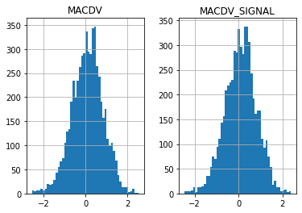
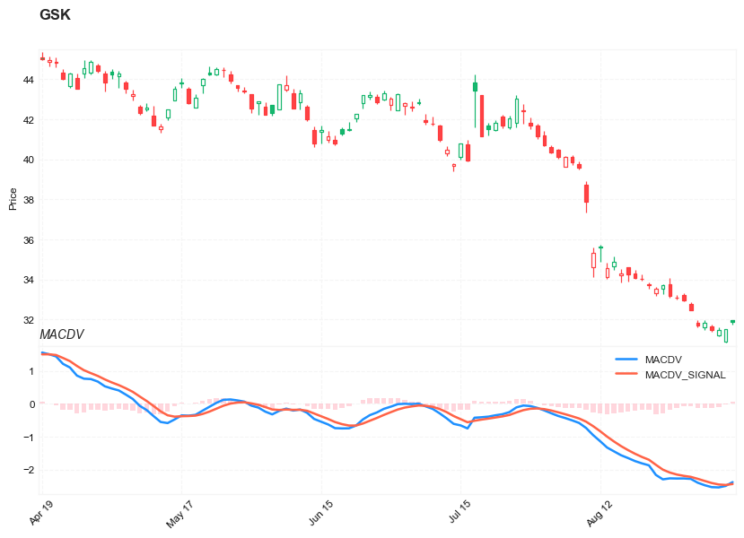

## MACD-V: Volatility Normalised Momentum

**References**

- [ssrn: MACD-V: Volatility Normalised Momentum](https://deliverypdf.ssrn.com/delivery.php?ID=170124119105005027104126126004078077122024024079020086078022113005121116108105115081017021040022038009060121025111086114005024055090056092048092112101007100026118067066009020083099022078096086092115031100000086016102112001120066111006115121099070127006&EXT=pdf&INDEX=TRUE)
    - [local copy](../pdf/b_51_SSRN-id4099617.pdf)


**Definition**

 [( 12 bar EMA - 26 bar EMA) / ATR(26) ] * 100

##### Load basic packages 


```python
import pandas as pd
import numpy as np
import os
import gc
import copy
from pathlib import Path
from datetime import datetime, timedelta, time, date
```


```python
#this package is to download equity price data from yahoo finance
#the source code of this package can be found here: https://github.com/ranaroussi/yfinance/blob/main
import yfinance as yf
```


```python
pd.options.display.max_rows = 100
pd.options.display.max_columns = 100

import warnings
warnings.filterwarnings("ignore")

import pytorch_lightning as pl
random_seed=1234
pl.seed_everything(random_seed)
```

    Global seed set to 1234
    


    1234


```python
#S&P 500 (^GSPC),  Dow Jones Industrial Average (^DJI), NASDAQ Composite (^IXIC)
#Russell 2000 (^RUT), Crude Oil Nov 21 (CL=F), Gold Dec 21 (GC=F)
#Treasury Yield 10 Years (^TNX)

#benchmark_tickers = ['^GSPC', '^DJI', '^IXIC', '^RUT',  'CL=F', 'GC=F', '^TNX']

benchmark_tickers = ['^GSPC']
tickers = benchmark_tickers + ['GSK', 'NVO', 'PFE']
```


```python
#https://github.com/ranaroussi/yfinance/blob/main/yfinance/base.py
#     def history(self, period="1mo", interval="1d",
#                 start=None, end=None, prepost=False, actions=True,
#                 auto_adjust=True, back_adjust=False,
#                 proxy=None, rounding=False, tz=None, timeout=None, **kwargs):

dfs = {}

for ticker in tickers:
    cur_data = yf.Ticker(ticker)
    hist = cur_data.history(period="max", start='2000-01-01')
    print(datetime.now(), ticker, hist.shape, hist.index.min(), hist.index.max())
    dfs[ticker] = hist
```

    2022-09-10 20:35:00.873657 ^GSPC (5710, 7) 1999-12-31 00:00:00 2022-09-09 00:00:00
    2022-09-10 20:35:01.197137 GSK (5710, 7) 1999-12-31 00:00:00 2022-09-09 00:00:00
    2022-09-10 20:35:01.547694 NVO (5710, 7) 1999-12-31 00:00:00 2022-09-09 00:00:00
    2022-09-10 20:35:01.920743 PFE (5710, 7) 1999-12-31 00:00:00 2022-09-09 00:00:00
    


```python
ticker = 'GSK'
dfs[ticker].tail(5)
```


<div>
<style scoped>
    .dataframe tbody tr th:only-of-type {
        vertical-align: middle;
    }

    .dataframe tbody tr th {
        vertical-align: top;
    }

    .dataframe thead th {
        text-align: right;
    }
</style>
<table border="1" class="dataframe">
  <thead>
    <tr style="text-align: right;">
      <th></th>
      <th>Open</th>
      <th>High</th>
      <th>Low</th>
      <th>Close</th>
      <th>Volume</th>
      <th>Dividends</th>
      <th>Stock Splits</th>
    </tr>
    <tr>
      <th>Date</th>
      <th></th>
      <th></th>
      <th></th>
      <th></th>
      <th></th>
      <th></th>
      <th></th>
    </tr>
  </thead>
  <tbody>
    <tr>
      <th>2022-09-02</th>
      <td>31.600000</td>
      <td>31.969999</td>
      <td>31.469999</td>
      <td>31.850000</td>
      <td>8152600</td>
      <td>0.0</td>
      <td>0.0</td>
    </tr>
    <tr>
      <th>2022-09-06</th>
      <td>31.650000</td>
      <td>31.760000</td>
      <td>31.370001</td>
      <td>31.469999</td>
      <td>5613900</td>
      <td>0.0</td>
      <td>0.0</td>
    </tr>
    <tr>
      <th>2022-09-07</th>
      <td>31.209999</td>
      <td>31.590000</td>
      <td>31.160000</td>
      <td>31.490000</td>
      <td>4822000</td>
      <td>0.0</td>
      <td>0.0</td>
    </tr>
    <tr>
      <th>2022-09-08</th>
      <td>30.910000</td>
      <td>31.540001</td>
      <td>30.830000</td>
      <td>31.510000</td>
      <td>6620900</td>
      <td>0.0</td>
      <td>0.0</td>
    </tr>
    <tr>
      <th>2022-09-09</th>
      <td>31.950001</td>
      <td>31.969999</td>
      <td>31.730000</td>
      <td>31.889999</td>
      <td>3556800</td>
      <td>0.0</td>
      <td>0.0</td>
    </tr>
  </tbody>
</table>
</div>


##### Define MACD-V calculation function


```python
def cal_atr(ohlc: pd.DataFrame, period: int = 14) -> pd.Series:
    """Average True Range is moving average of True Range."""
    ohlc = ohlc.copy()
    ohlc.columns = [c.lower() for c in ohlc.columns]
    
    
    TR1 = (ohlc["high"] - ohlc["low"]).abs()  # True Range = High less Low
    TR2 = (ohlc["high"] - ohlc["close"].shift()).abs()  # True Range = High less Previous Close
    TR3 = (ohlc["close"].shift() - ohlc["low"]).abs()  # True Range = Previous Close less Low

    _TR = pd.concat([TR1, TR2, TR3], axis=1)

    tr = _TR.max(axis=1)
    atr = tr.rolling(center=False, window=period).mean()
    
    return pd.Series(data=atr, name=f"ATR{period}")
```


```python
def cal_macdv(
        ohlc: pd.DataFrame,
        fast_period: int = 12,
        slow_period: int = 26,
        atr_period: int = 26,
        signal: int = 9,
        column: str = "close",
        adjust: bool = True,
    ) -> pd.DataFrame:
    """
    [( 12 bar EMA - 26 bar EMA) / ATR(26) ] * 100 
    """
    
    ohlc = ohlc.copy()
    ohlc.columns = [c.lower() for c in ohlc.columns]
    
    EMA_fast = pd.Series(
        ohlc[column].ewm(ignore_na=False, span=fast_period, adjust=adjust).mean(),
        name="EMA_fast",
    )
    EMA_slow = pd.Series(
        ohlc[column].ewm(ignore_na=False, span=slow_period, adjust=adjust).mean(),
        name="EMA_slow",
    )
    atr = cal_atr(ohlc, period = atr_period)
    MACDV = pd.Series((EMA_fast - EMA_slow)/atr, name="MACDV")
    MACDV_signal = pd.Series(
        MACDV.ewm(ignore_na=False, span=signal, adjust=adjust).mean(), name="MACDV_SIGNAL"
    )

    return pd.DataFrame(data = {'MACDV': MACDV.values, 
                                'MACDV_SIGNAL': MACDV_signal.values },
                        index = ohlc.index                        
                       )
       
```

##### Calculate MACD-V


```python
df = dfs[ticker][['Open', 'High', 'Low', 'Close', 'Volume']]
```


```python
df = df.round(2)
```


```python
cal_macdv
```


    <function __main__.cal_macdv(ohlc: pandas.core.frame.DataFrame, fast_period: int = 12, slow_period: int = 26, atr_period: int = 26, signal: int = 9, column: str = 'close', adjust: bool = True) -> pandas.core.frame.DataFrame>


```python
df_ta = cal_macdv(df, fast_period = 12, slow_period = 26, atr_period = 26, signal = 5,column = 'close')
df = df.merge(df_ta, left_index = True, right_index = True, how='inner' )

del df_ta
gc.collect()
```


    38


```python
display(df.head(5))
display(df.tail(5))
```


<div>
<style scoped>
    .dataframe tbody tr th:only-of-type {
        vertical-align: middle;
    }

    .dataframe tbody tr th {
        vertical-align: top;
    }

    .dataframe thead th {
        text-align: right;
    }
</style>
<table border="1" class="dataframe">
  <thead>
    <tr style="text-align: right;">
      <th></th>
      <th>Open</th>
      <th>High</th>
      <th>Low</th>
      <th>Close</th>
      <th>Volume</th>
      <th>MACDV</th>
      <th>MACDV_SIGNAL</th>
    </tr>
    <tr>
      <th>Date</th>
      <th></th>
      <th></th>
      <th></th>
      <th></th>
      <th></th>
      <th></th>
      <th></th>
    </tr>
  </thead>
  <tbody>
    <tr>
      <th>1999-12-31</th>
      <td>19.60</td>
      <td>19.67</td>
      <td>19.52</td>
      <td>19.56</td>
      <td>139400</td>
      <td>NaN</td>
      <td>NaN</td>
    </tr>
    <tr>
      <th>2000-01-03</th>
      <td>19.58</td>
      <td>19.71</td>
      <td>19.25</td>
      <td>19.45</td>
      <td>556100</td>
      <td>NaN</td>
      <td>NaN</td>
    </tr>
    <tr>
      <th>2000-01-04</th>
      <td>19.45</td>
      <td>19.45</td>
      <td>18.90</td>
      <td>18.95</td>
      <td>367200</td>
      <td>NaN</td>
      <td>NaN</td>
    </tr>
    <tr>
      <th>2000-01-05</th>
      <td>19.21</td>
      <td>19.58</td>
      <td>19.08</td>
      <td>19.58</td>
      <td>481700</td>
      <td>NaN</td>
      <td>NaN</td>
    </tr>
    <tr>
      <th>2000-01-06</th>
      <td>19.38</td>
      <td>19.43</td>
      <td>18.90</td>
      <td>19.30</td>
      <td>853800</td>
      <td>NaN</td>
      <td>NaN</td>
    </tr>
  </tbody>
</table>
</div>


<div>
<style scoped>
    .dataframe tbody tr th:only-of-type {
        vertical-align: middle;
    }

    .dataframe tbody tr th {
        vertical-align: top;
    }

    .dataframe thead th {
        text-align: right;
    }
</style>
<table border="1" class="dataframe">
  <thead>
    <tr style="text-align: right;">
      <th></th>
      <th>Open</th>
      <th>High</th>
      <th>Low</th>
      <th>Close</th>
      <th>Volume</th>
      <th>MACDV</th>
      <th>MACDV_SIGNAL</th>
    </tr>
    <tr>
      <th>Date</th>
      <th></th>
      <th></th>
      <th></th>
      <th></th>
      <th></th>
      <th></th>
      <th></th>
    </tr>
  </thead>
  <tbody>
    <tr>
      <th>2022-09-02</th>
      <td>31.60</td>
      <td>31.97</td>
      <td>31.47</td>
      <td>31.85</td>
      <td>8152600</td>
      <td>-2.473269</td>
      <td>-2.343325</td>
    </tr>
    <tr>
      <th>2022-09-06</th>
      <td>31.65</td>
      <td>31.76</td>
      <td>31.37</td>
      <td>31.47</td>
      <td>5613900</td>
      <td>-2.530882</td>
      <td>-2.405844</td>
    </tr>
    <tr>
      <th>2022-09-07</th>
      <td>31.21</td>
      <td>31.59</td>
      <td>31.16</td>
      <td>31.49</td>
      <td>4822000</td>
      <td>-2.539585</td>
      <td>-2.450424</td>
    </tr>
    <tr>
      <th>2022-09-08</th>
      <td>30.91</td>
      <td>31.54</td>
      <td>30.83</td>
      <td>31.51</td>
      <td>6620900</td>
      <td>-2.494345</td>
      <td>-2.465065</td>
    </tr>
    <tr>
      <th>2022-09-09</th>
      <td>31.95</td>
      <td>31.97</td>
      <td>31.73</td>
      <td>31.89</td>
      <td>3556800</td>
      <td>-2.378538</td>
      <td>-2.436222</td>
    </tr>
  </tbody>
</table>
</div>


```python
df[['MACDV', 'MACDV_SIGNAL']].hist(bins=50)
```


    array([[<AxesSubplot:title={'center':'MACDV'}>,
            <AxesSubplot:title={'center':'MACDV_SIGNAL'}>]], dtype=object)


    

    


```python
#https://github.com/matplotlib/mplfinance
#this package help visualize financial data
import mplfinance as mpf
import matplotlib.colors as mcolors

# all_colors = list(mcolors.CSS4_COLORS.keys())#"CSS Colors"
all_colors = list(mcolors.TABLEAU_COLORS.keys()) # "Tableau Palette",
# all_colors = list(mcolors.BASE_COLORS.keys()) #"Base Colors",


#https://github.com/matplotlib/mplfinance/issues/181#issuecomment-667252575
#list of colors: https://matplotlib.org/stable/gallery/color/named_colors.html
#https://github.com/matplotlib/mplfinance/blob/master/examples/styles.ipynb

def plot_macd(main_data, mid_panel, chart_type='candle', names=None, 
                  figratio=(14,9)):


    style = mpf.make_mpf_style(base_mpf_style='yahoo',  #charles
                               base_mpl_style = 'seaborn-whitegrid',
#                                marketcolors=mpf.make_marketcolors(up="r", down="#0000CC",inherit=True),
                               gridcolor="whitesmoke", 
                               gridstyle="--", #or None, or - for solid
                               gridaxis="both", 
                               edgecolor = 'whitesmoke',
                               facecolor = 'white', #background color within the graph edge
                               figcolor = 'white', #background color outside of the graph edge
                               y_on_right = False,
                               rc =  {'legend.fontsize': 'small',#or number
                                      #'figure.figsize': (14, 9),
                                     'axes.labelsize': 'small',
                                     'axes.titlesize':'small',
                                     'xtick.labelsize':'small',#'x-small', 'small','medium','large'
                                     'ytick.labelsize':'small'
                                     }, 
                              )   

    if (chart_type is None) or (chart_type not in ['ohlc', 'line', 'candle', 'hollow_and_filled']):
        chart_type = 'candle'
    len_dict = {'candle':2, 'ohlc':3, 'line':1, 'hollow_and_filled':2}    
        
    kwargs = dict(type=chart_type, figratio=figratio, volume=False,
                  panel_ratios=(4,2), tight_layout=True, style=style, returnfig=True)
    
    if names is None:
        names = {'main_title': '', 'sub_tile': ''}
    


    added_plots = { 
        'MACDV': mpf.make_addplot(mid_panel['MACDV'], panel=1, color='dodgerblue', secondary_y=False), 
        'MACDV_SIGNAL': mpf.make_addplot(mid_panel['MACDV_SIGNAL'], panel=1, color='tomato', secondary_y=False), 
        'MACD-SIGNAL': mpf.make_addplot(mid_panel['MACDV']-mid_panel['MACDV_SIGNAL'], type='bar',width=0.7,panel=1, color="pink",alpha=0.65,secondary_y=False),
    }

                         

    fig, axes = mpf.plot(main_data,  **kwargs,
                         addplot=list(added_plots.values()),
                        )
    # add a new suptitle
    fig.suptitle(names['main_title'], y=1.05, fontsize=12, x=0.128)

    axes[0].set_title(names['sub_tile'], fontsize=10, style='italic',  loc='left')
    
    axes[2].set_title('MACDV', fontsize=10, style='italic',  loc='left')

    
    #set legend

    axes[2].legend([None]*2)
    handles = axes[2].get_legend().legendHandles
#     print(handles)
    axes[2].legend(handles=handles,labels=['MACDV', 'MACDV_SIGNAL'])
    
    

#     axes[0].set_ylabel(names['y_tiles'][0])
#     axes[2].set_ylabel(names['y_tiles'][1])
    return fig, axes
   
```


```python

start = -100
end = df.shape[0]

names = {'main_title': f'{ticker}', 
         'sub_tile': ''}


aa_, bb_ = plot_macd(df.iloc[start:end][['Open', 'High', 'Low', 'Close', 'Volume']], 
             df.iloc[start:end][['MACDV', 'MACDV_SIGNAL']], 
             chart_type='hollow_and_filled',names = names)
```


    

    

