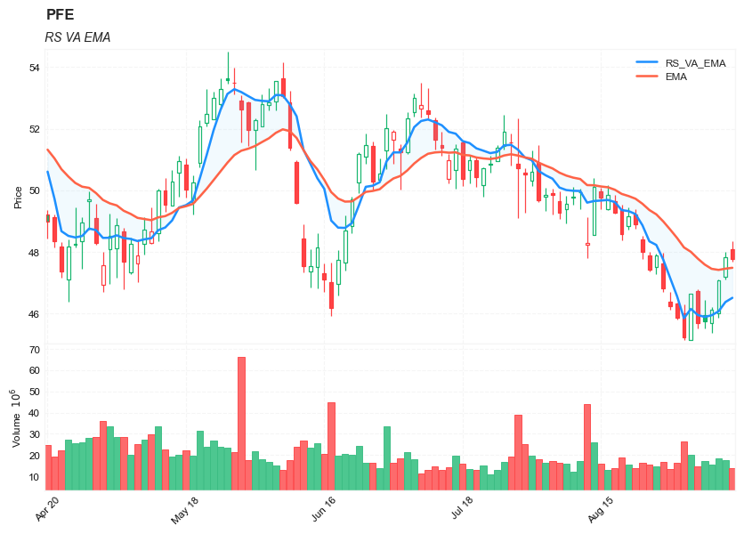

## The Relative Strength Volume-Adjusted Exponential Moving Average (RS VA EMA)

**References**


- [traders.com: TradersTips 2022-10](https://traders.com/Documentation/FEEDbk_docs/2022/10/TradersTips.html)


**█ OVERVIEW**

The focus of October 2022 Traders’ Tips is Vitali Apirine’s article in the February 2022 issue, “Relative Strength Moving Averages, Part 2 (RS VA EMA).”

Vitali Apirine’s 2022 three-part article series examines moving averages based on relative strength. The indicators he presents are designed to reduce the lag of traditional EMAs, making them more responsive. In part 2 of his article series, which appeared in the February 2022 issue of S&C, he explores the relative strength volume-adjusted exponential moving average (RS VA EMA).

The indicator is designed to account for relative strength of volume and as part of the calculation incorporates a measurement between the positive and negative volume flow. Volume is considered positive when the close is above the prior close and considered negative when the close is below the prior close. The indicator can be used to help establish trends and define turning points.

##### Load basic packages 


```python
import pandas as pd
import numpy as np
import os
import gc
import copy
from pathlib import Path
from datetime import datetime, timedelta, time, date
```


```python
#this package is to download equity price data from yahoo finance
#the source code of this package can be found here: https://github.com/ranaroussi/yfinance/blob/main
import yfinance as yf
```


```python
pd.options.display.max_rows = 100
pd.options.display.max_columns = 100

import warnings
warnings.filterwarnings("ignore")

import pytorch_lightning as pl
random_seed=1234
pl.seed_everything(random_seed)
```

    Global seed set to 1234
    


    1234


```python
#S&P 500 (^GSPC),  Dow Jones Industrial Average (^DJI), NASDAQ Composite (^IXIC)
#Russell 2000 (^RUT), Crude Oil Nov 21 (CL=F), Gold Dec 21 (GC=F)
#Treasury Yield 10 Years (^TNX)
#CBOE Volatility Index (^VIX) Chicago Options - Chicago Options Delayed Price. Currency in USD

#benchmark_tickers = ['^GSPC', '^DJI', '^IXIC', '^RUT',  'CL=F', 'GC=F', '^TNX']

benchmark_tickers = ['^GSPC', '^VIX']
tickers = benchmark_tickers + ['GSK', 'BST', 'PFE']
```


```python
#https://github.com/ranaroussi/yfinance/blob/main/yfinance/base.py
#     def history(self, period="1mo", interval="1d",
#                 start=None, end=None, prepost=False, actions=True,
#                 auto_adjust=True, back_adjust=False,
#                 proxy=None, rounding=False, tz=None, timeout=None, **kwargs):

dfs = {}

for ticker in tickers:
    cur_data = yf.Ticker(ticker)
    hist = cur_data.history(period="max", start='2000-01-01')
    print(datetime.now(), ticker, hist.shape, hist.index.min(), hist.index.max())
    dfs[ticker] = hist
```

    2022-09-13 13:11:29.631908 ^GSPC (5711, 7) 1999-12-31 00:00:00 2022-09-12 00:00:00
    2022-09-13 13:11:29.882149 ^VIX (5711, 7) 1999-12-31 00:00:00 2022-09-12 00:00:00
    2022-09-13 13:11:30.272582 GSK (5711, 7) 1999-12-31 00:00:00 2022-09-12 00:00:00
    2022-09-13 13:11:30.431355 BST (1981, 7) 2014-10-29 00:00:00 2022-09-12 00:00:00
    2022-09-13 13:11:30.835396 PFE (5711, 7) 1999-12-31 00:00:00 2022-09-12 00:00:00
    


```python
ticker = 'PFE'
dfs[ticker].tail(5)
```


<div>
<style scoped>
    .dataframe tbody tr th:only-of-type {
        vertical-align: middle;
    }

    .dataframe tbody tr th {
        vertical-align: top;
    }

    .dataframe thead th {
        text-align: right;
    }
</style>
<table border="1" class="dataframe">
  <thead>
    <tr style="text-align: right;">
      <th></th>
      <th>Open</th>
      <th>High</th>
      <th>Low</th>
      <th>Close</th>
      <th>Volume</th>
      <th>Dividends</th>
      <th>Stock Splits</th>
    </tr>
    <tr>
      <th>Date</th>
      <th></th>
      <th></th>
      <th></th>
      <th></th>
      <th></th>
      <th></th>
      <th></th>
    </tr>
  </thead>
  <tbody>
    <tr>
      <th>2022-09-06</th>
      <td>45.959999</td>
      <td>46.439999</td>
      <td>45.529999</td>
      <td>45.759998</td>
      <td>17153500</td>
      <td>0.0</td>
      <td>0.0</td>
    </tr>
    <tr>
      <th>2022-09-07</th>
      <td>45.700001</td>
      <td>46.209999</td>
      <td>45.380001</td>
      <td>46.130001</td>
      <td>15378900</td>
      <td>0.0</td>
      <td>0.0</td>
    </tr>
    <tr>
      <th>2022-09-08</th>
      <td>46.020000</td>
      <td>47.119999</td>
      <td>45.869999</td>
      <td>47.080002</td>
      <td>18271000</td>
      <td>0.0</td>
      <td>0.0</td>
    </tr>
    <tr>
      <th>2022-09-09</th>
      <td>47.200001</td>
      <td>47.990002</td>
      <td>47.099998</td>
      <td>47.840000</td>
      <td>17501700</td>
      <td>0.0</td>
      <td>0.0</td>
    </tr>
    <tr>
      <th>2022-09-12</th>
      <td>48.080002</td>
      <td>48.349998</td>
      <td>47.689999</td>
      <td>47.759998</td>
      <td>13738200</td>
      <td>0.0</td>
      <td>0.0</td>
    </tr>
  </tbody>
</table>
</div>


##### Define The Relative Strength Volume-Adjusted Exponential Moving Average (RS VA EMA) calculation function


```python
def cal_rs_va_ema(ohlcv: pd.DataFrame,
            ema_period: int = 10,
            vs_period: int = 10,
            multiplier: float = 10.0,
            column: str = "close") -> pd.Series:
    """
    source: https://traders.com/Documentation/FEEDbk_docs/2022/10/TradersTips.html
    
    //  TASC Issue: October 2022 - Vol. 40, Issue 11
    //     Article: Relative Strength Moving Averages
    //              Part 2: The Relative Strength Volume-Adjusted Exponential Moving Average (RS VA EMA)
    //  Article By: Vitali Apirine
    //    Language: TradingView's Pine Script v5
    // Provided By: PineCoders, for tradingview.com

    //@version=5
    indicator('TASC 2022.10 RS VA EMA', overlay=true)

    float   src = input.source(close,  'Source:')
    int periods = input.int(10,    'EMA Length:', minval=1)
    int     pds = input.int(10,     'VS Length:', minval=1)
    float  mltp = input.int(10, 'VS Multiplier:', minval=0)

    rsvaema(float    source = close, 
      simple int  emaPeriod = 50, 
      simple int   vsPeriod = 50, 
           float multiplier = 10.0
           ) =>
        var float mltp1 = 2.0 / (emaPeriod + 1.0)
        var float coef1 = 2.0 /  (vsPeriod + 1.0)
        var float coef2 = 1.0 - coef1
        float pv   = source > source[1] ? volume : 0.0
        float nv   = source < source[1] ? volume : 0.0
        float apv  = na, apv := coef1 * pv + coef2 * nz(apv[1])
        float anv  = na, anv := coef1 * nv + coef2 * nz(anv[1])
        float vs   = math.abs(apv - anv) / (apv + anv)
        float rate = mltp1 * (1.0 + nz(vs, 0.00001) * multiplier)
        float rsma = na
        rsma := rate * source + (1.0 - rate) * nz(rsma[1],source)
        rsma

    float rsvaema = rsvaema(src, periods, pds, mltp)

    plot(rsvaema, title='RS VA EMA', color=#B21BD8, linewidth=2)    

    """
    ohlcv = ohlcv.copy()
    ohlcv.columns = [c.lower() for c in ohlcv.columns]
    
    close = ohlcv[column].copy()
    volume = ohlcv["volume"]
    
    mltp1 = 2.0 / (ema_period + 1.0)
    coef1 = 2.0 / (vs_period + 1.0)
    coef2 = 1.0 - coef1
    
    pv = (close>close.shift(1)).astype(int)*volume
    nv = (close<close.shift(1)).astype(int)*volume
    
    apv = np.zeros(len(close))
    apv[0] = close[0]
    
    anv = np.zeros(len(close))
    anv[0] = close[0]
    
    for i in range(1, len(close)):
        apv[i] = pv[i]*coef1 + apv[i-1]*coef2
        anv[i] = nv[i]*coef1 + anv[i-1]*coef2
        
    vs = np.abs(apv - anv)/(apv + anv)
    rate = mltp1 * (1.0 + np.nan_to_num(vs, nan=0.00001) * multiplier)  
    rsma = close.copy()
    for i in range(1, len(close)):
        rsma[i] = rate[i]*close[i] + (1.0 - rate[i])*rsma[i-1]
        
    

    return pd.Series(rsma,index=ohlcv.index, name=f"RS_VA_EMA")    

```


```python
def cal_rs_va_ema(ohlcv: pd.DataFrame, 
            ema_period: int = 10,
            vs_period: int = 10,
            multiplier: float = 10.0,
            column: str = "close",
        adjust: bool = True,) -> pd.Series:
    """
    source: https://traders.com/Documentation/FEEDbk_docs/2022/10/TradersTips.html
    Series Function: RSVAEMA
    // TASC OCT 2022
    // RSVAEMA - Relative Strength Volume-Adjusted 
    // Exponential Moving Average (RS VA EMA)
    // Series Function
    // 2022 Vitali Apirine

    inputs:
        Periods( NumericSimple ),Pds( NumericSimple ),Mltp( NumericSimple );

    variables:
        Mltp1( 0 ),Vup( 0 ),Vdwn( 0 ),RS( 0 ),Rate( 0 ),MyVol( 0 );

    Mltp1 = 2 / (Periods + 1);

    { Daily, Weekly, or Monthly bars }
    if BarType >= 2 and BarType < 5 then 
        MyVol = Volume
    else
        MyVol = Ticks;

    Vup = IFF(Close > Close[1], MyVol, 0);
    Vdwn = IFF(Close < Close[1], MyVol, 0);

    RS = AbsValue( XAverage(Vup, Pds) -
    XAverage(Vdwn, Pds)) / (XAverage(Vup, Pds) + 
    XAverage(Vdwn, Pds) + 0.00001);

    RS = RS * Mltp;
    Rate = Mltp1 * (1 + RS);

    if CurrentBar = 1 then
        RSVAEMA = Close
    else
        RSVAEMA = RSVAEMA[1] + Rate * 
         (Close - RSVAEMA[1]);


    Indicator: TASC OCT 2022 RS VA EMA
    // TASC OCT 2022
    // RSVAEMA - Relative Strength Volume-Adjusted 
    // Exponential Moving Average (RS VA EMA)
    // 2022 Vitali Apirine

    inputs:
        Periods( 10 ),
        Pds( 10 ),
        Mltp( 10 );

    variables:
        RSVAEMAValue( 0 );

    RSVAEMAValue = RSVAEMA( Periods, Pds, Mltp );

    Plot1( RSVAEMAValue, "RS VA EMA" );
    """
    ohlcv = ohlcv.copy()
    ohlcv.columns = [c.lower() for c in ohlcv.columns]
    
    close = ohlcv[column].copy()
    volume = ohlcv["volume"]
    
    mltp1 = 2.0 / (ema_period + 1.0)
    volat_up = (close>close.shift(1)).astype(int)*volume
    volat_down = (close<close.shift(1)).astype(int)*volume
    
    # EMAs of ups and downs
    _gain = volat_up.ewm(span= vs_period, adjust=adjust).mean()
    _loss = volat_down.ewm(span= vs_period, adjust=adjust).mean()
    
    rs = (_gain - _loss)/(_gain + _loss + 0.00001 )
    rs = rs.abs()*multiplier
    rate = mltp1 * (1.0 + rs)    
    
    _rsma =  close
    for i in range(1, len(close)):
        _rsma[i] = _rsma[i-1] + rate[i]*(close[i] - _rsma[i-1])
            

    return pd.Series(_rsma,index=ohlcv.index, name=f"RS_VA_EMA")    

```

##### Calculate The Relative Strength Volume-Adjusted Exponential Moving Average (RS VA EMA) 

note: the above 2 functions render same results


```python
df = dfs[ticker][['Open', 'High', 'Low', 'Close', 'Volume']]
```


```python
df = df.round(2)
```


```python
cal_rs_va_ema
```


    <function __main__.cal_rs_va_ema(ohlcv: pandas.core.frame.DataFrame, ema_period: int = 10, vs_period: int = 10, multiplier: float = 10.0, column: str = 'close', adjust: bool = True) -> pandas.core.series.Series>


```python
df_ta = cal_rs_va_ema(df, ema_period=20, vs_period=20, multiplier=10, column="close")
df = df.merge(df_ta, left_index = True, right_index = True, how='inner' )

del df_ta
gc.collect()
```


    210


```python
from core.finta import TA
```


```python
TA.EMA
```


    <function core.finta.TA.EMA(ohlc: pandas.core.frame.DataFrame, period: int = 9, column: str = 'close', adjust: bool = True) -> pandas.core.series.Series>


```python
df['EMA'] = TA.EMA(df, period = 20, column="close")
```
TA.RS_VA_EMAdf['RS_VA_EMA2'] = TA.RS_VA_EMA(df, ema_period=20, vs_period=20, multiplier=10, column="close")

```python
display(df.head(5))
display(df.tail(5))
```


<div>
<style scoped>
    .dataframe tbody tr th:only-of-type {
        vertical-align: middle;
    }

    .dataframe tbody tr th {
        vertical-align: top;
    }

    .dataframe thead th {
        text-align: right;
    }
</style>
<table border="1" class="dataframe">
  <thead>
    <tr style="text-align: right;">
      <th></th>
      <th>Open</th>
      <th>High</th>
      <th>Low</th>
      <th>Close</th>
      <th>Volume</th>
      <th>RS_VA_EMA</th>
      <th>EMA</th>
    </tr>
    <tr>
      <th>Date</th>
      <th></th>
      <th></th>
      <th></th>
      <th></th>
      <th></th>
      <th></th>
      <th></th>
    </tr>
  </thead>
  <tbody>
    <tr>
      <th>1999-12-31</th>
      <td>14.25</td>
      <td>14.31</td>
      <td>14.11</td>
      <td>14.22</td>
      <td>5939817</td>
      <td>14.220000</td>
      <td>14.220000</td>
    </tr>
    <tr>
      <th>2000-01-03</th>
      <td>14.06</td>
      <td>14.20</td>
      <td>13.87</td>
      <td>13.98</td>
      <td>12873345</td>
      <td>13.968571</td>
      <td>14.094000</td>
    </tr>
    <tr>
      <th>2000-01-04</th>
      <td>13.70</td>
      <td>13.81</td>
      <td>13.16</td>
      <td>13.46</td>
      <td>14208974</td>
      <td>13.435782</td>
      <td>13.861199</td>
    </tr>
    <tr>
      <th>2000-01-05</th>
      <td>13.54</td>
      <td>13.98</td>
      <td>13.51</td>
      <td>13.68</td>
      <td>12981591</td>
      <td>13.525618</td>
      <td>13.808890</td>
    </tr>
    <tr>
      <th>2000-01-06</th>
      <td>13.70</td>
      <td>14.36</td>
      <td>13.68</td>
      <td>14.17</td>
      <td>11115273</td>
      <td>13.610611</td>
      <td>13.896239</td>
    </tr>
  </tbody>
</table>
</div>


<div>
<style scoped>
    .dataframe tbody tr th:only-of-type {
        vertical-align: middle;
    }

    .dataframe tbody tr th {
        vertical-align: top;
    }

    .dataframe thead th {
        text-align: right;
    }
</style>
<table border="1" class="dataframe">
  <thead>
    <tr style="text-align: right;">
      <th></th>
      <th>Open</th>
      <th>High</th>
      <th>Low</th>
      <th>Close</th>
      <th>Volume</th>
      <th>RS_VA_EMA</th>
      <th>EMA</th>
    </tr>
    <tr>
      <th>Date</th>
      <th></th>
      <th></th>
      <th></th>
      <th></th>
      <th></th>
      <th></th>
      <th></th>
    </tr>
  </thead>
  <tbody>
    <tr>
      <th>2022-09-06</th>
      <td>45.96</td>
      <td>46.44</td>
      <td>45.53</td>
      <td>45.76</td>
      <td>17153500</td>
      <td>45.890672</td>
      <td>47.590930</td>
    </tr>
    <tr>
      <th>2022-09-07</th>
      <td>45.70</td>
      <td>46.21</td>
      <td>45.38</td>
      <td>46.13</td>
      <td>15378900</td>
      <td>45.943344</td>
      <td>47.451794</td>
    </tr>
    <tr>
      <th>2022-09-08</th>
      <td>46.02</td>
      <td>47.12</td>
      <td>45.87</td>
      <td>47.08</td>
      <td>18271000</td>
      <td>46.070740</td>
      <td>47.416385</td>
    </tr>
    <tr>
      <th>2022-09-09</th>
      <td>47.20</td>
      <td>47.99</td>
      <td>47.10</td>
      <td>47.84</td>
      <td>17501700</td>
      <td>46.374000</td>
      <td>47.456729</td>
    </tr>
    <tr>
      <th>2022-09-12</th>
      <td>48.08</td>
      <td>48.35</td>
      <td>47.69</td>
      <td>47.76</td>
      <td>13738200</td>
      <td>46.509998</td>
      <td>47.485612</td>
    </tr>
  </tbody>
</table>
</div>


```python
df[['RS_VA_EMA']].hist(bins=50)
```


    array([[<AxesSubplot:title={'center':'RS_VA_EMA'}>]], dtype=object)


    

    


```python
#https://github.com/matplotlib/mplfinance
#this package help visualize financial data
import mplfinance as mpf
import matplotlib.colors as mcolors

# all_colors = list(mcolors.CSS4_COLORS.keys())#"CSS Colors"
# all_colors = list(mcolors.TABLEAU_COLORS.keys()) # "Tableau Palette",
# all_colors = list(mcolors.BASE_COLORS.keys()) #"Base Colors",
all_colors = ['dodgerblue', 'firebrick','limegreen','skyblue','lightgreen',  'navy','yellow','plum',  'yellowgreen']
#https://github.com/matplotlib/mplfinance/issues/181#issuecomment-667252575
#list of colors: https://matplotlib.org/stable/gallery/color/named_colors.html
#https://github.com/matplotlib/mplfinance/blob/master/examples/styles.ipynb

def make_3panels2(main_data, add_data, mid_panel=None, chart_type='candle', names=None, figratio=(14,9)):

    style = mpf.make_mpf_style(base_mpf_style='yahoo',  #charles
                               base_mpl_style = 'seaborn-whitegrid',
#                                marketcolors=mpf.make_marketcolors(up="r", down="#0000CC",inherit=True),
                               gridcolor="whitesmoke", 
                               gridstyle="--", #or None, or - for solid
                               gridaxis="both", 
                               edgecolor = 'whitesmoke',
                               facecolor = 'white', #background color within the graph edge
                               figcolor = 'white', #background color outside of the graph edge
                               y_on_right = False,
                               rc =  {'legend.fontsize': 'small',#or number
                                      #'figure.figsize': (14, 9),
                                     'axes.labelsize': 'small',
                                     'axes.titlesize':'small',
                                     'xtick.labelsize':'small',#'x-small', 'small','medium','large'
                                     'ytick.labelsize':'small'
                                     }, 
                              )   

    if (chart_type is None) or (chart_type not in ['ohlc', 'line', 'candle', 'hollow_and_filled']):
        chart_type = 'candle'
    len_dict = {'candle':2, 'ohlc':3, 'line':1, 'hollow_and_filled':2}    
        
    kwargs = dict(type=chart_type, figratio=figratio, volume=True, volume_panel=1, 
                  panel_ratios=(4,2), tight_layout=True, style=style, returnfig=True)
    
    if names is None:
        names = {'main_title': '', 'sub_tile': ''}
    
    added_plots = { 
#         'S':  mpf.make_addplot(add_data['S'], panel=0, color='blue', type='scatter', marker=r'${S}$' , markersize=100, secondary_y=False),   
#         'B':  mpf.make_addplot(add_data['B'], panel=0, color='blue', type='scatter', marker=r'${B}$' , markersize=100, secondary_y=False), 
        
        'RS_VA_EMA': mpf.make_addplot(add_data['RS_VA_EMA'], panel=0, color='dodgerblue', secondary_y=False), 
        'EMA': mpf.make_addplot(add_data['EMA'], panel=0, color='tomato', secondary_y=False), 
    }

        
      
    fb_bbands_ = dict(y1=add_data.iloc[:, 0].values,
                      y2=add_data.iloc[:, 1].values,color="lightskyblue",alpha=0.1,interpolate=True)
    fb_bbands_['panel'] = 0
    

    fb_bbands= [fb_bbands_]
    
    
    if mid_panel is not None:
        i = 0
        for name_, data_ in mid_panel.iteritems():
            added_plots[name_] = mpf.make_addplot(data_, panel=1, color=all_colors[i])
            i = i + 1
        fb_bbands2_ = dict(y1=np.zeros(mid_panel.shape[0]),
                      y2=0.8+np.zeros(mid_panel.shape[0]),color="lightskyblue",alpha=0.1,interpolate=True)
        fb_bbands2_['panel'] = 1
        fb_bbands.append(fb_bbands2_)


    fig, axes = mpf.plot(main_data,  **kwargs,
                         addplot=list(added_plots.values()), 
                         fill_between=fb_bbands)
    # add a new suptitle
    fig.suptitle(names['main_title'], y=1.05, fontsize=12, x=0.1285)

    axes[0].legend([None]*4)
    handles = axes[0].get_legend().legendHandles
    axes[0].legend(handles=handles[2:],labels=['RS_VA_EMA', 'EMA'])
    axes[0].set_title(names['sub_tile'], fontsize=10, style='italic',  loc='left')
    

#     axes[0].set_ylabel(names['y_tiles'][0])
#     axes[2].set_ylabel(names['y_tiles'][1])
    return fig, axes
   
```


```python

start = -100
end = df.shape[0]

names = {'main_title': f'{ticker}', 
         'sub_tile': 'RS VA EMA'}


aa_, bb_ = make_3panels2(df.iloc[start:end][['Open', 'High', 'Low', 'Close', 'Volume']], 
            df.iloc[start:end][['RS_VA_EMA', 'EMA']],
             chart_type='hollow_and_filled',names = names)
```


    

    

