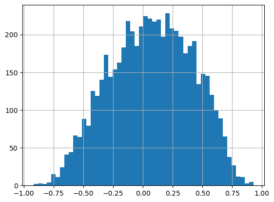
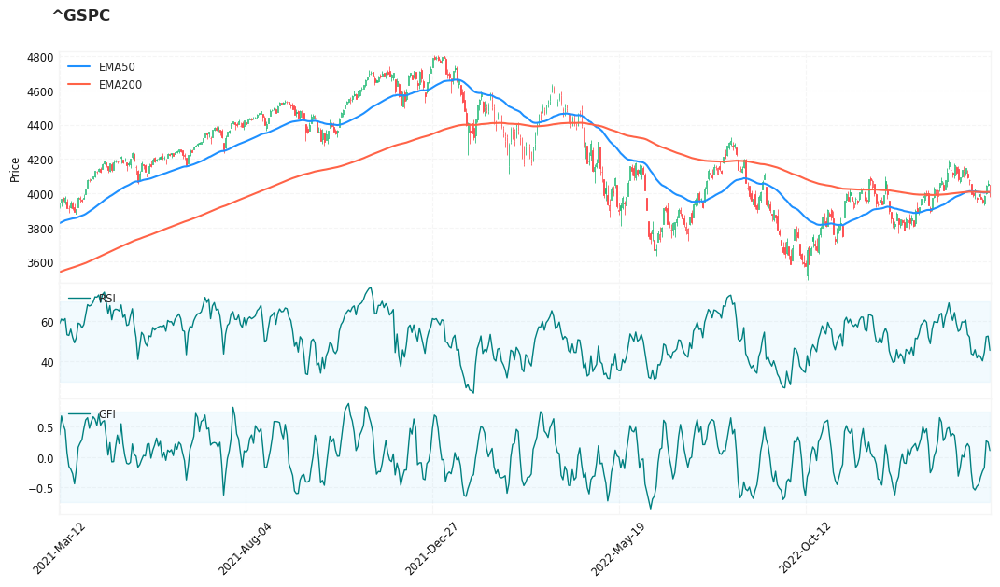

## Measuring Overbought And Oversold: Greed And Fear Index (GFI)

**References**


- [Technical Analysis of Stocks and Commodities Oct 2022 issue](https://traders.com)


**█ OVERVIEW**

In his article in Oct 2022 issue of Technical Analysis of Stocks and Commodities, “Measuring Overbought And Oversold: Greed And Fear Index” author Howard Wang describes the construction of greed and fear index (GFI).

In simple terms, the GFI helps to detect selling and buying earlier in the trend rather than later in the trend: 

- A high GFI implies that there is overheated buying sentiment and that traders may have overbought. A high GFI may be a good time to sell ahead of the crowd and ahead of a possible reversal.
- A very low GFI may indicate a good time to buy in advance of the crowd.


**█ CALCULATION**

As with the BRSI, calculation of the GFI is according to the breakout candlestick. “BOK” stands for “breakout candlestick” and is formed from five original candles:

- BOKH (BOK candles high) (BOKH is the 5 highest candles)
- BOKL (BOK candles low) (BOKL is the 5 lowest candles)
- BOKC (BOK candles close) (BOKC is the 5 last closes)
- BOKO (BOK candles open) (BOKO is the 5 last opens)

The formula for the GFI is: GFI = B⁄A

- B = Mean of (BOKC−BOKO) for 5 periods
- A = Mean of (BOKH−BOKL) for 5 periods

**█ EXPLANATION**

GFI ranges between +1 and −1:

- If GFI is close to +1, it indicates there is overheated buying sentiment and traders may have overbought by this point. This may be a good time to sell in advance of the crowd, in order to sell close to a top.
- If GFI is close to −1, it indicates that stop losses are being hit, indicating selling, and the market may be reaching an oversold condition. This may be a good time to buy in advance of the crowd (that is, buy the dip).
- If GFI = 0, it indicates we are at an inflection point, which means a change may be about to occur in the current buy sell activity.


#### Load basic packages 


```python
import pandas as pd
import numpy as np
import os
import gc
import copy
from pathlib import Path
from datetime import datetime, timedelta, time, date
```


```python
!pip install yfinance
!pip install mplfinance
```

    Collecting yfinance
      Downloading yfinance-0.2.12-py2.py3-none-any.whl (59 kB)
         ━━━━━━━━━━━━━━━━━━━━━━━━━━━━━━━━━━━━━━━━ 59.2/59.2 kB 2.1 MB/s eta 0:00:00
    [?25hRequirement already satisfied: html5lib>=1.1 in /opt/conda/lib/python3.7/site-packages (from yfinance) (1.1)
    Requirement already satisfied: requests>=2.26 in /opt/conda/lib/python3.7/site-packages (from yfinance) (2.28.2)
    Requirement already satisfied: beautifulsoup4>=4.11.1 in /opt/conda/lib/python3.7/site-packages (from yfinance) (4.11.1)
    Requirement already satisfied: pandas>=1.3.0 in /opt/conda/lib/python3.7/site-packages (from yfinance) (1.3.5)
    Requirement already satisfied: frozendict>=2.3.4 in /opt/conda/lib/python3.7/site-packages (from yfinance) (2.3.5)
    Requirement already satisfied: lxml>=4.9.1 in /opt/conda/lib/python3.7/site-packages (from yfinance) (4.9.2)
    Requirement already satisfied: appdirs>=1.4.4 in /opt/conda/lib/python3.7/site-packages (from yfinance) (1.4.4)
    Requirement already satisfied: cryptography>=3.3.2 in /opt/conda/lib/python3.7/site-packages (from yfinance) (38.0.2)
    Requirement already satisfied: pytz>=2022.5 in /opt/conda/lib/python3.7/site-packages (from yfinance) (2022.7.1)
    Collecting multitasking>=0.0.7
      Downloading multitasking-0.0.11-py3-none-any.whl (8.5 kB)
    Requirement already satisfied: numpy>=1.16.5 in /opt/conda/lib/python3.7/site-packages (from yfinance) (1.21.6)
    Requirement already satisfied: soupsieve>1.2 in /opt/conda/lib/python3.7/site-packages (from beautifulsoup4>=4.11.1->yfinance) (2.3.2.post1)
    Requirement already satisfied: cffi>=1.12 in /opt/conda/lib/python3.7/site-packages (from cryptography>=3.3.2->yfinance) (1.15.1)
    Requirement already satisfied: six>=1.9 in /opt/conda/lib/python3.7/site-packages (from html5lib>=1.1->yfinance) (1.16.0)
    Requirement already satisfied: webencodings in /opt/conda/lib/python3.7/site-packages (from html5lib>=1.1->yfinance) (0.5.1)
    Requirement already satisfied: python-dateutil>=2.7.3 in /opt/conda/lib/python3.7/site-packages (from pandas>=1.3.0->yfinance) (2.8.2)
    Requirement already satisfied: charset-normalizer<4,>=2 in /opt/conda/lib/python3.7/site-packages (from requests>=2.26->yfinance) (2.1.1)
    Requirement already satisfied: urllib3<1.27,>=1.21.1 in /opt/conda/lib/python3.7/site-packages (from requests>=2.26->yfinance) (1.26.14)
    Requirement already satisfied: idna<4,>=2.5 in /opt/conda/lib/python3.7/site-packages (from requests>=2.26->yfinance) (3.4)
    Requirement already satisfied: certifi>=2017.4.17 in /opt/conda/lib/python3.7/site-packages (from requests>=2.26->yfinance) (2022.12.7)
    Requirement already satisfied: pycparser in /opt/conda/lib/python3.7/site-packages (from cffi>=1.12->cryptography>=3.3.2->yfinance) (2.21)
    Installing collected packages: multitasking, yfinance
    Successfully installed multitasking-0.0.11 yfinance-0.2.12
    WARNING: Running pip as the 'root' user can result in broken permissions and conflicting behaviour with the system package manager. It is recommended to use a virtual environment instead: https://pip.pypa.io/warnings/venv
    Collecting mplfinance
      Downloading mplfinance-0.12.9b7-py3-none-any.whl (73 kB)
         ━━━━━━━━━━━━━━━━━━━━━━━━━━━━━━━━━━━━━━━━ 73.1/73.1 kB 1.7 MB/s eta 0:00:0000:01
    [?25hRequirement already satisfied: matplotlib in /opt/conda/lib/python3.7/site-packages (from mplfinance) (3.5.3)
    Requirement already satisfied: pandas in /opt/conda/lib/python3.7/site-packages (from mplfinance) (1.3.5)
    Requirement already satisfied: python-dateutil>=2.7 in /opt/conda/lib/python3.7/site-packages (from matplotlib->mplfinance) (2.8.2)
    Requirement already satisfied: cycler>=0.10 in /opt/conda/lib/python3.7/site-packages (from matplotlib->mplfinance) (0.11.0)
    Requirement already satisfied: packaging>=20.0 in /opt/conda/lib/python3.7/site-packages (from matplotlib->mplfinance) (23.0)
    Requirement already satisfied: pyparsing>=2.2.1 in /opt/conda/lib/python3.7/site-packages (from matplotlib->mplfinance) (3.0.9)
    Requirement already satisfied: kiwisolver>=1.0.1 in /opt/conda/lib/python3.7/site-packages (from matplotlib->mplfinance) (1.4.4)
    Requirement already satisfied: pillow>=6.2.0 in /opt/conda/lib/python3.7/site-packages (from matplotlib->mplfinance) (9.4.0)
    Requirement already satisfied: numpy>=1.17 in /opt/conda/lib/python3.7/site-packages (from matplotlib->mplfinance) (1.21.6)
    Requirement already satisfied: fonttools>=4.22.0 in /opt/conda/lib/python3.7/site-packages (from matplotlib->mplfinance) (4.38.0)
    Requirement already satisfied: pytz>=2017.3 in /opt/conda/lib/python3.7/site-packages (from pandas->mplfinance) (2022.7.1)
    Requirement already satisfied: typing-extensions in /opt/conda/lib/python3.7/site-packages (from kiwisolver>=1.0.1->matplotlib->mplfinance) (4.4.0)
    Requirement already satisfied: six>=1.5 in /opt/conda/lib/python3.7/site-packages (from python-dateutil>=2.7->matplotlib->mplfinance) (1.16.0)
    Installing collected packages: mplfinance
    Successfully installed mplfinance-0.12.9b7
    WARNING: Running pip as the 'root' user can result in broken permissions and conflicting behaviour with the system package manager. It is recommended to use a virtual environment instead: https://pip.pypa.io/warnings/venv
    


```python
#this package is to download equity price data from yahoo finance
#the source code of this package can be found here: https://github.com/ranaroussi/yfinance/blob/main
import yfinance as yf
```


```python
pd.options.display.max_rows = 100
pd.options.display.max_columns = 100

import warnings
warnings.filterwarnings("ignore")

import pytorch_lightning as pl
random_seed=1234
pl.seed_everything(random_seed)
```


    1234


#### Download data


```python
#S&P 500 (^GSPC),  Dow Jones Industrial Average (^DJI), NASDAQ Composite (^IXIC)
#Russell 2000 (^RUT), Crude Oil Nov 21 (CL=F), Gold Dec 21 (GC=F)
#Treasury Yield 10 Years (^TNX)
#CBOE Volatility Index (^VIX) Chicago Options - Chicago Options Delayed Price. Currency in USD

#benchmark_tickers = ['^GSPC', '^DJI', '^IXIC', '^RUT',  'CL=F', 'GC=F', '^TNX']

benchmark_tickers = ['^GSPC', '^VIX']
tickers = benchmark_tickers + ['GSK', 'BST', 'PFE', 'AZN', 'BSX', 'NUVA', 'MDT']
```


```python
#https://github.com/ranaroussi/yfinance/blob/main/yfinance/base.py
#     def history(self, period="1mo", interval="1d",
#                 start=None, end=None, prepost=False, actions=True,
#                 auto_adjust=True, back_adjust=False,
#                 proxy=None, rounding=False, tz=None, timeout=None, **kwargs):

dfs = {}

for ticker in tickers:
    cur_data = yf.Ticker(ticker)
    hist = cur_data.history(period="max", start='2000-01-01')
    print(f"{datetime.now()}\t {ticker}\t {hist.shape}\t {hist.index.min()}\t {hist.index.max()}")
    dfs[ticker] = hist
```

    2023-03-08 13:50:01.144419	 ^GSPC	 (5831, 7)	 2000-01-03 00:00:00-05:00	 2023-03-07 00:00:00-05:00
    2023-03-08 13:50:02.185163	 ^VIX	 (5832, 7)	 2000-01-03 00:00:00-05:00	 2023-03-08 00:00:00-05:00
    2023-03-08 13:50:03.568624	 GSK	 (5831, 7)	 2000-01-03 00:00:00-05:00	 2023-03-07 00:00:00-05:00
    2023-03-08 13:50:04.503930	 BST	 (2102, 7)	 2014-10-29 00:00:00-04:00	 2023-03-07 00:00:00-05:00
    2023-03-08 13:50:05.765909	 PFE	 (5831, 7)	 2000-01-03 00:00:00-05:00	 2023-03-07 00:00:00-05:00
    2023-03-08 13:50:07.133366	 AZN	 (5831, 7)	 2000-01-03 00:00:00-05:00	 2023-03-07 00:00:00-05:00
    2023-03-08 13:50:08.237812	 BSX	 (5831, 7)	 2000-01-03 00:00:00-05:00	 2023-03-07 00:00:00-05:00
    2023-03-08 13:50:09.634396	 NUVA	 (4736, 7)	 2004-05-13 00:00:00-04:00	 2023-03-07 00:00:00-05:00
    2023-03-08 13:50:11.039413	 MDT	 (5831, 7)	 2000-01-03 00:00:00-05:00	 2023-03-07 00:00:00-05:00


```python
ticker = '^GSPC'
dfs[ticker].tail(5)
```


<div>
<style scoped>
    .dataframe tbody tr th:only-of-type {
        vertical-align: middle;
    }

    .dataframe tbody tr th {
        vertical-align: top;
    }

    .dataframe thead th {
        text-align: right;
    }
</style>
<table border="1" class="dataframe">
  <thead>
    <tr style="text-align: right;">
      <th></th>
      <th>Open</th>
      <th>High</th>
      <th>Low</th>
      <th>Close</th>
      <th>Volume</th>
      <th>Dividends</th>
      <th>Stock Splits</th>
    </tr>
    <tr>
      <th>Date</th>
      <th></th>
      <th></th>
      <th></th>
      <th></th>
      <th></th>
      <th></th>
      <th></th>
    </tr>
  </thead>
  <tbody>
    <tr>
      <th>2023-03-01 00:00:00-05:00</th>
      <td>3963.340088</td>
      <td>3971.729980</td>
      <td>3939.050049</td>
      <td>3951.389893</td>
      <td>4249480000</td>
      <td>0.0</td>
      <td>0.0</td>
    </tr>
    <tr>
      <th>2023-03-02 00:00:00-05:00</th>
      <td>3938.679932</td>
      <td>3990.840088</td>
      <td>3928.159912</td>
      <td>3981.350098</td>
      <td>4244900000</td>
      <td>0.0</td>
      <td>0.0</td>
    </tr>
    <tr>
      <th>2023-03-03 00:00:00-05:00</th>
      <td>3998.020020</td>
      <td>4048.290039</td>
      <td>3995.169922</td>
      <td>4045.639893</td>
      <td>4084730000</td>
      <td>0.0</td>
      <td>0.0</td>
    </tr>
    <tr>
      <th>2023-03-06 00:00:00-05:00</th>
      <td>4055.149902</td>
      <td>4078.489990</td>
      <td>4044.610107</td>
      <td>4048.419922</td>
      <td>4000870000</td>
      <td>0.0</td>
      <td>0.0</td>
    </tr>
    <tr>
      <th>2023-03-07 00:00:00-05:00</th>
      <td>4048.260010</td>
      <td>4050.000000</td>
      <td>3980.310059</td>
      <td>3986.370117</td>
      <td>3922500000</td>
      <td>0.0</td>
      <td>0.0</td>
    </tr>
  </tbody>
</table>
</div>


#### Define Greed And Fear Index (GFI) calculation function


```python
import sys
sys.path.append(r"/kaggle/input/technical-indicators-core")

#from core.finta import TA
from finta import TA
```


```python
df = dfs[ticker][['Open', 'High', 'Low', 'Close', 'Volume']]
df = df.round(2)
```


```python
def cal_gfi(ohlc: pd.DataFrame, 
                  period: int = 5, 
                 ) -> pd.Series:
    """
    // TASC Oct 2022: Measuring Overbought And Oversold: Greed And Fear Index by Howard Wang

    """
 
    ohlc = ohlc.copy(deep=True)
    ohlc.columns = [c.lower() for c in ohlc.columns]
    
    #step 1: get the breakout candlesticks
 
    break_high = ohlc["high"].rolling(window=2).max()
    break_low = ohlc["low"].rolling(window=2).min()
    two_signs = np.sign(ohlc["close"]-ohlc["open"]).rolling(window=2).apply(np.prod)
    break_open = ohlc["close"].shift(1)
    break_open[two_signs>0] = (ohlc["open"].shift(1))[two_signs>0]
    break_close = ohlc["close"]

    df_break = pd.concat([break_open,break_high, break_low,  break_close], axis=1)
    df_break.columns = ['open', 'high', 'low', 'close']
    
    #step 2: calculate the GFI
    
    B = (df_break["close"] - df_break["open"]).rolling(window=period).mean()
    A = (df_break["high"] - df_break["low"]).rolling(window=period).mean()

   

    return pd.Series(B/A, index=ohlc.index, name=f"GFI{period}")   
```

#### Calculate Greed And Fear Index (GFI)


```python
df['GFI']=cal_gfi(df)
df['RSI']=TA.RSI(df, period = 14, column="close")
df['EMA50']=TA.EMA(df, period = 50, column="close")
df['EMA200']=TA.EMA(df, period = 200, column="close")
```


```python
display(df.head(5))
display(df.tail(5))
```


<div>
<style scoped>
    .dataframe tbody tr th:only-of-type {
        vertical-align: middle;
    }

    .dataframe tbody tr th {
        vertical-align: top;
    }

    .dataframe thead th {
        text-align: right;
    }
</style>
<table border="1" class="dataframe">
  <thead>
    <tr style="text-align: right;">
      <th></th>
      <th>Open</th>
      <th>High</th>
      <th>Low</th>
      <th>Close</th>
      <th>Volume</th>
      <th>GFI</th>
      <th>RSI</th>
      <th>EMA50</th>
      <th>EMA200</th>
    </tr>
    <tr>
      <th>Date</th>
      <th></th>
      <th></th>
      <th></th>
      <th></th>
      <th></th>
      <th></th>
      <th></th>
      <th></th>
      <th></th>
    </tr>
  </thead>
  <tbody>
    <tr>
      <th>2000-01-03 00:00:00-05:00</th>
      <td>1469.25</td>
      <td>1478.00</td>
      <td>1438.36</td>
      <td>1455.22</td>
      <td>931800000</td>
      <td>NaN</td>
      <td>NaN</td>
      <td>1455.220000</td>
      <td>1455.220000</td>
    </tr>
    <tr>
      <th>2000-01-04 00:00:00-05:00</th>
      <td>1455.22</td>
      <td>1455.22</td>
      <td>1397.43</td>
      <td>1399.42</td>
      <td>1009000000</td>
      <td>NaN</td>
      <td>0.000000</td>
      <td>1426.762000</td>
      <td>1427.180500</td>
    </tr>
    <tr>
      <th>2000-01-05 00:00:00-05:00</th>
      <td>1399.42</td>
      <td>1413.27</td>
      <td>1377.68</td>
      <td>1402.11</td>
      <td>1085500000</td>
      <td>NaN</td>
      <td>4.935392</td>
      <td>1418.213826</td>
      <td>1418.739960</td>
    </tr>
    <tr>
      <th>2000-01-06 00:00:00-05:00</th>
      <td>1402.11</td>
      <td>1411.90</td>
      <td>1392.10</td>
      <td>1403.45</td>
      <td>1092300000</td>
      <td>NaN</td>
      <td>7.387438</td>
      <td>1414.298520</td>
      <td>1414.859942</td>
    </tr>
    <tr>
      <th>2000-01-07 00:00:00-05:00</th>
      <td>1403.45</td>
      <td>1441.47</td>
      <td>1400.73</td>
      <td>1441.47</td>
      <td>1225200000</td>
      <td>NaN</td>
      <td>48.207241</td>
      <td>1420.176074</td>
      <td>1420.288924</td>
    </tr>
  </tbody>
</table>
</div>


<div>
<style scoped>
    .dataframe tbody tr th:only-of-type {
        vertical-align: middle;
    }

    .dataframe tbody tr th {
        vertical-align: top;
    }

    .dataframe thead th {
        text-align: right;
    }
</style>
<table border="1" class="dataframe">
  <thead>
    <tr style="text-align: right;">
      <th></th>
      <th>Open</th>
      <th>High</th>
      <th>Low</th>
      <th>Close</th>
      <th>Volume</th>
      <th>GFI</th>
      <th>RSI</th>
      <th>EMA50</th>
      <th>EMA200</th>
    </tr>
    <tr>
      <th>Date</th>
      <th></th>
      <th></th>
      <th></th>
      <th></th>
      <th></th>
      <th></th>
      <th></th>
      <th></th>
      <th></th>
    </tr>
  </thead>
  <tbody>
    <tr>
      <th>2023-03-01 00:00:00-05:00</th>
      <td>3963.34</td>
      <td>3971.73</td>
      <td>3939.05</td>
      <td>3951.39</td>
      <td>4249480000</td>
      <td>-0.235848</td>
      <td>40.292240</td>
      <td>4004.483349</td>
      <td>4007.101141</td>
    </tr>
    <tr>
      <th>2023-03-02 00:00:00-05:00</th>
      <td>3938.68</td>
      <td>3990.84</td>
      <td>3928.16</td>
      <td>3981.35</td>
      <td>4244900000</td>
      <td>-0.174370</td>
      <td>44.519159</td>
      <td>4003.576159</td>
      <td>4006.844911</td>
    </tr>
    <tr>
      <th>2023-03-03 00:00:00-05:00</th>
      <td>3998.02</td>
      <td>4048.29</td>
      <td>3995.17</td>
      <td>4045.64</td>
      <td>4084730000</td>
      <td>0.268026</td>
      <td>52.319603</td>
      <td>4005.225721</td>
      <td>4007.230932</td>
    </tr>
    <tr>
      <th>2023-03-06 00:00:00-05:00</th>
      <td>4055.15</td>
      <td>4078.49</td>
      <td>4044.61</td>
      <td>4048.42</td>
      <td>4000870000</td>
      <td>0.245390</td>
      <td>52.629750</td>
      <td>4006.919615</td>
      <td>4007.640773</td>
    </tr>
    <tr>
      <th>2023-03-07 00:00:00-05:00</th>
      <td>4048.26</td>
      <td>4050.00</td>
      <td>3980.31</td>
      <td>3986.37</td>
      <td>3922500000</td>
      <td>0.106727</td>
      <td>45.513517</td>
      <td>4006.113747</td>
      <td>4007.429124</td>
    </tr>
  </tbody>
</table>
</div>


```python
df['GFI'].hist(bins=50)
```


    <AxesSubplot:>





#### Visualize Greed And Fear Index (GFI)


```python
#from core.visuals import *
from visuals import *
```


```python
start = -500
end = df.shape[0]
df_sub = df.iloc[start:end]
# df_sub = df[(df.index<='2019-04-01') & (df.index>='2019-01-24')]
#names = {'main_title': f'{ticker}'}
```


```python
names = {'main_title': f'{ticker} - Greed And Fear Index (GFI)'}

lines0,  ax_cfg0 = plot_overlay_lines(data = df_sub, overlay_columns = ['EMA50', 'EMA200'])

#lines1, ax_cfg1 = plot_macd(data = df_sub, macd= 'DI_PLUS', macd_signal = 'DI_MINUS', panel =1)

lines1, shadows1, ax_cfg1 = plot_add_lines(data = df_sub, line_columns=['RSI', ], 
                                           panel =1, bands = [30, 70])
lines2, shadows2, ax_cfg2 = plot_add_lines(data = df_sub, line_columns=['GFI'], 
                                           panel =2, bands = [-0.75, 0.75])
#b_s_ = plot_buy_sell(data=df_sub, buy_column='DMI_BUY_Close', sell_column='DMI_SELL_Close')
lines_ = dict(**lines0, **lines1)
lines_.update(lines2)
#lines_.update(b_s_)

shadows_ =    shadows1 + shadows2


fig_config_ = dict(figratio=(18,9), volume=False, volume_panel=2,panel_ratios=(4,2,2), tight_layout=True, returnfig=True,)

ax_cfg_ = ax_cfg0
ax_cfg_.update(ax_cfg1)
ax_cfg_.update(ax_cfg2)


names = {'main_title': f'{ticker}'}

aa_, bb_ = make_panels(main_data = df_sub[['Open', 'High', 'Low', 'Close', 'Volume']], 
                       added_plots = lines_,
                       fill_betweens = shadows_, 
                       fig_config = fig_config_, 
                       axes_config = ax_cfg_,  
                       names = names)    
```





#### Call the function from finta.py


```python
df_list = []
for ticker, df in dfs.items():
    df = df[['Open', 'High', 'Low', 'Close', 'Volume']].round(2)
    #df['GFI']=cal_gfi(df)
    df['GFI']=TA.GFI(df, period = 5)
    df['RSI']=TA.RSI(df, period = 14, column="close")
    df['EMA50']=TA.EMA(df, period = 50, column="close")
    df['EMA200']=TA.EMA(df, period = 200, column="close")
    df['ticker'] = ticker
    
    df_list.append(df)

```


```python
df_all = pd.concat(df_list)
print(df_all.shape)
del df_list
gc.collect()
```

    (47656, 10)


    5507


```python
dd = df_all.index
df_all.index = dd.date
df_all.index.name='Date'
```


```python
df_all.tail(5)
```


<div>
<style scoped>
    .dataframe tbody tr th:only-of-type {
        vertical-align: middle;
    }

    .dataframe tbody tr th {
        vertical-align: top;
    }

    .dataframe thead th {
        text-align: right;
    }
</style>
<table border="1" class="dataframe">
  <thead>
    <tr style="text-align: right;">
      <th></th>
      <th>Open</th>
      <th>High</th>
      <th>Low</th>
      <th>Close</th>
      <th>Volume</th>
      <th>GFI</th>
      <th>RSI</th>
      <th>EMA50</th>
      <th>EMA200</th>
      <th>ticker</th>
    </tr>
    <tr>
      <th>Date</th>
      <th></th>
      <th></th>
      <th></th>
      <th></th>
      <th></th>
      <th></th>
      <th></th>
      <th></th>
      <th></th>
      <th></th>
    </tr>
  </thead>
  <tbody>
    <tr>
      <th>2023-03-01</th>
      <td>82.40</td>
      <td>82.53</td>
      <td>81.67</td>
      <td>82.08</td>
      <td>5249100</td>
      <td>-0.449129</td>
      <td>44.022248</td>
      <td>82.552691</td>
      <td>86.762242</td>
      <td>MDT</td>
    </tr>
    <tr>
      <th>2023-03-02</th>
      <td>81.49</td>
      <td>82.56</td>
      <td>81.20</td>
      <td>82.26</td>
      <td>4985100</td>
      <td>-0.268898</td>
      <td>44.950352</td>
      <td>82.541213</td>
      <td>86.717444</td>
      <td>MDT</td>
    </tr>
    <tr>
      <th>2023-03-03</th>
      <td>82.79</td>
      <td>83.63</td>
      <td>82.44</td>
      <td>83.41</td>
      <td>4771600</td>
      <td>-0.007821</td>
      <td>50.587132</td>
      <td>82.575283</td>
      <td>86.684534</td>
      <td>MDT</td>
    </tr>
    <tr>
      <th>2023-03-06</th>
      <td>83.49</td>
      <td>83.83</td>
      <td>81.45</td>
      <td>81.93</td>
      <td>6845500</td>
      <td>-0.151832</td>
      <td>44.300301</td>
      <td>82.549978</td>
      <td>86.637225</td>
      <td>MDT</td>
    </tr>
    <tr>
      <th>2023-03-07</th>
      <td>82.09</td>
      <td>82.15</td>
      <td>79.51</td>
      <td>79.74</td>
      <td>6876000</td>
      <td>-0.349321</td>
      <td>36.977231</td>
      <td>82.439782</td>
      <td>86.568596</td>
      <td>MDT</td>
    </tr>
  </tbody>
</table>
</div>


```python
df_all.to_csv('b_055_1_gfi_tasc202210.csv', index=True)
```
