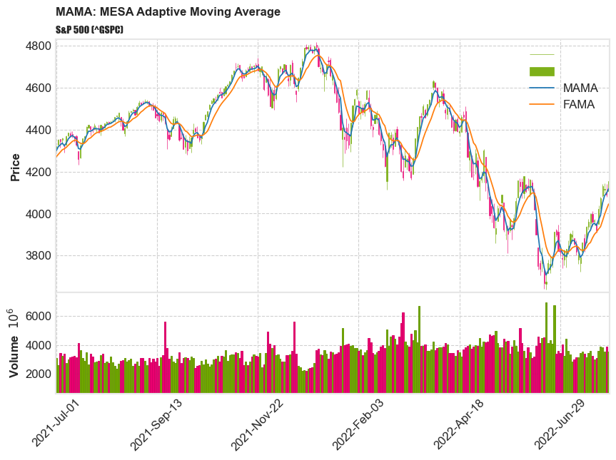
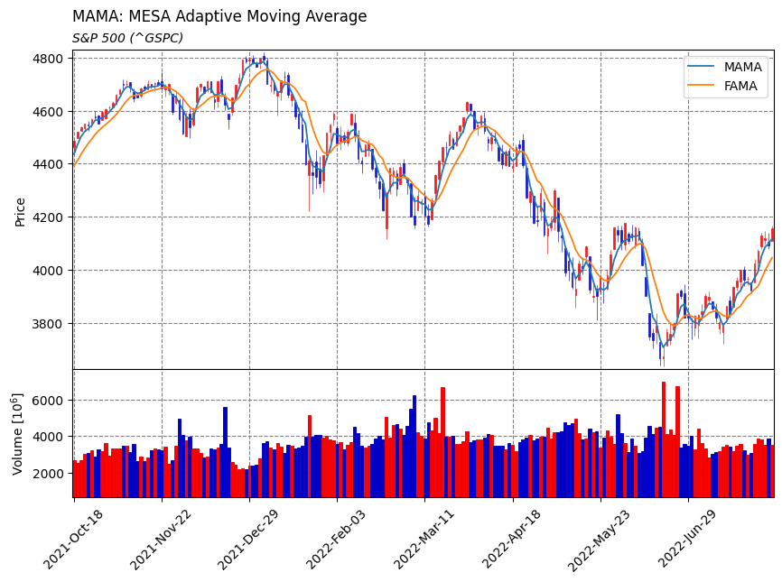

## MAMA: MESA Adaptive Moving Average


#### Reference: 
- [John Ehlers: MESA Adaptive Moving Average](https://www.mesasoftware.com/papers/MAMA.pdf)


#### MAMA: MESA Adaptive Moving Average


    The MESA Adaptive Moving Average (MAMA) adapts to price movement based on the rate change of phase as 
    measured by the Hilbert Transform Discriminator.  

    The advantage of this method of adaptation is that it features a fast attack average and a slow decay 
    average so that composite average rapidly ratchets behind price changes and holds the average value 
    until the next ratchet occurs.


#### Implementation of MAMA in python

##### Load basic packages 


```python
import pandas as pd
import numpy as np
import os
import gc
import copy
from pathlib import Path
from datetime import datetime, timedelta, time, date
```


```python
#this package is to download equity price data from yahoo finance
#the source code of this package can be found here: https://github.com/ranaroussi/yfinance/blob/main
import yfinance as yf
```


```python
pd.options.display.max_rows = 100
pd.options.display.max_columns = 100

import warnings
warnings.filterwarnings("ignore")

import pytorch_lightning as pl
random_seed=1234
pl.seed_everything(random_seed)
```

    Global seed set to 1234
    


    1234


```python
#S&P 500 (^GSPC),  Dow Jones Industrial Average (^DJI), NASDAQ Composite (^IXIC)
#Russell 2000 (^RUT), Crude Oil Nov 21 (CL=F), Gold Dec 21 (GC=F)
#Treasury Yield 10 Years (^TNX)

#benchmark_tickers = ['^GSPC', '^DJI', '^IXIC', '^RUT',  'CL=F', 'GC=F', '^TNX']

benchmark_tickers = ['^GSPC']
```


```python
#https://github.com/ranaroussi/yfinance/blob/main/yfinance/base.py
#     def history(self, period="1mo", interval="1d",
#                 start=None, end=None, prepost=False, actions=True,
#                 auto_adjust=True, back_adjust=False,
#                 proxy=None, rounding=False, tz=None, timeout=None, **kwargs):

dfs = {}

for ticker in benchmark_tickers:
    cur_data = yf.Ticker(ticker)
    hist = cur_data.history(period="max", start='2000-01-01')
    print(datetime.now(), ticker, hist.shape, hist.index.min(), hist.index.max())
    dfs[ticker] = hist
```

    2022-08-04 13:37:02.093508 ^GSPC (5684, 7) 1999-12-31 00:00:00 2022-08-03 00:00:00
    


```python
dfs['^GSPC'].tail(5)
```


<div>
<style scoped>
    .dataframe tbody tr th:only-of-type {
        vertical-align: middle;
    }

    .dataframe tbody tr th {
        vertical-align: top;
    }

    .dataframe thead th {
        text-align: right;
    }
</style>
<table border="1" class="dataframe">
  <thead>
    <tr style="text-align: right;">
      <th></th>
      <th>Open</th>
      <th>High</th>
      <th>Low</th>
      <th>Close</th>
      <th>Volume</th>
      <th>Dividends</th>
      <th>Stock Splits</th>
    </tr>
    <tr>
      <th>Date</th>
      <th></th>
      <th></th>
      <th></th>
      <th></th>
      <th></th>
      <th></th>
      <th></th>
    </tr>
  </thead>
  <tbody>
    <tr>
      <th>2022-07-28</th>
      <td>4026.129883</td>
      <td>4078.949951</td>
      <td>3992.969971</td>
      <td>4072.429932</td>
      <td>3882850000</td>
      <td>0</td>
      <td>0</td>
    </tr>
    <tr>
      <th>2022-07-29</th>
      <td>4087.330078</td>
      <td>4140.149902</td>
      <td>4079.219971</td>
      <td>4130.290039</td>
      <td>3817740000</td>
      <td>0</td>
      <td>0</td>
    </tr>
    <tr>
      <th>2022-08-01</th>
      <td>4112.379883</td>
      <td>4144.950195</td>
      <td>4096.020020</td>
      <td>4118.629883</td>
      <td>3540960000</td>
      <td>0</td>
      <td>0</td>
    </tr>
    <tr>
      <th>2022-08-02</th>
      <td>4104.209961</td>
      <td>4140.470215</td>
      <td>4079.810059</td>
      <td>4091.189941</td>
      <td>3880790000</td>
      <td>0</td>
      <td>0</td>
    </tr>
    <tr>
      <th>2022-08-03</th>
      <td>4107.959961</td>
      <td>4167.660156</td>
      <td>4107.959961</td>
      <td>4155.169922</td>
      <td>3544410000</td>
      <td>0</td>
      <td>0</td>
    </tr>
  </tbody>
</table>
</div>


##### Define MAMA calculation function


```python

def cal_mama(series: pd.Series, fast_limit = 0.5, slow_limit = 0.05) -> pd.DataFrame:
    """
    MESA Adaptive Moving Average

    The MESA Adaptive Moving Average (MAMA) adapts to price movement based on the rate change of phase as 
    measured by the Hilbert Transform Discriminator.  

    The advantage of this method of adaptation is that it features a fast attack average and a slow decay 
    average so that composite average rapidly ratchets behind price changes and holds the average value 
    until the next ratchet occurs.


    source: https://www.mesasoftware.com/papers/MAMA.pdf

    adapted from: https://github.com/mathiswellmann/go_ehlers_indicators/blob/bdc7bd10003c/mama.go#L110


    """

    smooth = np.zeros(len(series))
    period = np.zeros(len(series))
    detrender = np.zeros(len(series))
    i1 = np.zeros(len(series))
    q1 = np.zeros(len(series))
    ji = np.zeros(len(series))
    jq = np.zeros(len(series))
    i2 = np.zeros(len(series))
    q2 = np.zeros(len(series))
    re = np.zeros(len(series))
    im = np.zeros(len(series))

    smooth_period = np.zeros(len(series))
    phase = np.zeros(len(series))
    fama = np.zeros(len(series))
    mama = np.zeros(len(series))

    delta_phase = np.zeros(len(series))    
    alpha = np.zeros(len(series))

    vals = series.values

    for i in range(len(vals)):
        if i<6:
            mama[i] = vals[i]
            fama[i] = vals[i]
            continue

        smooth[i] = (4*vals[i] + 3*vals[i-1] + 2*vals[i-2] + vals[i-3]) / 10
        detrender[i] = (0.0962*smooth[i] + 0.5769*smooth[i-2] - 0.5769*smooth[i-4] - 0.0962*smooth[i-6]) * (0.075*period[i-1] + 0.54)

        ## compute InPhase and Quadrature components
        q1[i] = (0.0962*detrender[i] + 0.5769*detrender[i-2] - 0.5769*detrender[i-4] - 0.0962*detrender[i-6]) * (0.075*period[i-1] + 0.54)
        i1[i] = detrender[i-3]


        ##Advance the phase of detrender and q1 by 90 Degrees
        ji[i] = (0.0962*i1[i] + 0.05769*i1[i-2] - 0.5769*i1[i-4] - 0.0962*i1[i-6]) * (0.075*period[i-1] + 0.54)
        jq[i] = (0.0962*q1[i] + 0.5769*q1[i-2] - 0.5769*q1[i-4] - 0.0962*q1[i-6]) * (0.075*period[i-1] + 0.54)

        ##Phasor addition for 3 bar averaging
        i2[i] = i1[i] - jq[i]
        q2[i] = q1[i] + ji[i]

        ##smooth the I and Q components befor applying the discriminator
        i2[i] = 0.2*i2[i] + 0.8*i2[i-1]
        q2[i] = 0.2*q2[i] + 0.8*q2[i-1]

        ##Homodyne Discriminator
        re[i] = i2[i]*i2[i-1] + q2[i]*q2[i-1]
        im[i] = i2[i]*q2[i-1] - q2[i]*i2[i-1]

        re[i] = 0.2*re[i] + 0.8*re[i-1]
        im[i] = 0.2*im[i] + 0.8*im[i-1]

        if (im[i] != 0)& (re[i] != 0):
            period[i] = 360 / np.arctan(im[i]/re[i])

        if (period[i] > 1.5*period[i-1]):
            period[i] = 1.5 * period[i-1]

        if (period[i] < 0.67*period[i-1]):
            period[i] = 0.67 * period[i-1]

        if (period[i] < 6):
            period[i] = 6

        if (period[i] > 50):
            period[i] = 50

        period[i] = 0.2*period[i] + 0.8*period[i-1]
        smooth_period[i] = 0.33*period[i] + 0.67*smooth_period[i-1]

        if (i1[i]!= 0):
            phase[i] = np.arctan(q1[i] / i1[i])

        delta_phase[i] = phase[i-1] - phase[i]
        if (delta_phase[i] < 1):
            delta_phase[i] = 1

        alpha[i] = fast_limit / delta_phase[i]
        if alpha[i] < slow_limit:
            alpha[i] = slow_limit

        mama[i] = alpha[i]*vals[i] + (1-alpha[i])*mama[i-1]
        fama[i] = 0.5*alpha[i]*mama[i] + (1-0.5*alpha[i])*fama[i-1]

    mama_ = pd.Series(index=series.index, data=mama, name="MAMA")
    fama_ = pd.Series(index=series.index, data=fama, name="FAMA")


    return pd.concat([mama_, fama_], axis=1)

```

##### Calculate MAMA


```python
df = dfs['^GSPC'][['Open', 'High', 'Low', 'Close', 'Volume']]
```


```python
df_mama = cal_mama((df['High']+df['Low'])/2)
```


```python
df_mama['mama_fama'] = df_mama['MAMA']-df_mama['FAMA']
```


```python
df.shape, df_mama.shape
```


    ((5684, 5), (5684, 3))


```python
df = df.merge(df_mama, left_index = True, right_index = True, how='inner' )

del df_mama
gc.collect()
```


    131


```python
display(df.head(5))
display(df.tail(5))
```


<div>
<style scoped>
    .dataframe tbody tr th:only-of-type {
        vertical-align: middle;
    }

    .dataframe tbody tr th {
        vertical-align: top;
    }

    .dataframe thead th {
        text-align: right;
    }
</style>
<table border="1" class="dataframe">
  <thead>
    <tr style="text-align: right;">
      <th></th>
      <th>Open</th>
      <th>High</th>
      <th>Low</th>
      <th>Close</th>
      <th>Volume</th>
      <th>MAMA</th>
      <th>FAMA</th>
      <th>mama_fama</th>
    </tr>
    <tr>
      <th>Date</th>
      <th></th>
      <th></th>
      <th></th>
      <th></th>
      <th></th>
      <th></th>
      <th></th>
      <th></th>
    </tr>
  </thead>
  <tbody>
    <tr>
      <th>1999-12-31</th>
      <td>1464.469971</td>
      <td>1472.420044</td>
      <td>1458.189941</td>
      <td>1469.250000</td>
      <td>374050000</td>
      <td>1465.304993</td>
      <td>1465.304993</td>
      <td>0.0</td>
    </tr>
    <tr>
      <th>2000-01-03</th>
      <td>1469.250000</td>
      <td>1478.000000</td>
      <td>1438.359985</td>
      <td>1455.219971</td>
      <td>931800000</td>
      <td>1458.179993</td>
      <td>1458.179993</td>
      <td>0.0</td>
    </tr>
    <tr>
      <th>2000-01-04</th>
      <td>1455.219971</td>
      <td>1455.219971</td>
      <td>1397.430054</td>
      <td>1399.420044</td>
      <td>1009000000</td>
      <td>1426.325012</td>
      <td>1426.325012</td>
      <td>0.0</td>
    </tr>
    <tr>
      <th>2000-01-05</th>
      <td>1399.420044</td>
      <td>1413.270020</td>
      <td>1377.680054</td>
      <td>1402.109985</td>
      <td>1085500000</td>
      <td>1395.475037</td>
      <td>1395.475037</td>
      <td>0.0</td>
    </tr>
    <tr>
      <th>2000-01-06</th>
      <td>1402.109985</td>
      <td>1411.900024</td>
      <td>1392.099976</td>
      <td>1403.449951</td>
      <td>1092300000</td>
      <td>1402.000000</td>
      <td>1402.000000</td>
      <td>0.0</td>
    </tr>
  </tbody>
</table>
</div>


<div>
<style scoped>
    .dataframe tbody tr th:only-of-type {
        vertical-align: middle;
    }

    .dataframe tbody tr th {
        vertical-align: top;
    }

    .dataframe thead th {
        text-align: right;
    }
</style>
<table border="1" class="dataframe">
  <thead>
    <tr style="text-align: right;">
      <th></th>
      <th>Open</th>
      <th>High</th>
      <th>Low</th>
      <th>Close</th>
      <th>Volume</th>
      <th>MAMA</th>
      <th>FAMA</th>
      <th>mama_fama</th>
    </tr>
    <tr>
      <th>Date</th>
      <th></th>
      <th></th>
      <th></th>
      <th></th>
      <th></th>
      <th></th>
      <th></th>
      <th></th>
    </tr>
  </thead>
  <tbody>
    <tr>
      <th>2022-07-28</th>
      <td>4026.129883</td>
      <td>4078.949951</td>
      <td>3992.969971</td>
      <td>4072.429932</td>
      <td>3882850000</td>
      <td>3991.940633</td>
      <td>3937.319306</td>
      <td>54.621327</td>
    </tr>
    <tr>
      <th>2022-07-29</th>
      <td>4087.330078</td>
      <td>4140.149902</td>
      <td>4079.219971</td>
      <td>4130.290039</td>
      <td>3817740000</td>
      <td>4050.812785</td>
      <td>3965.692676</td>
      <td>85.120109</td>
    </tr>
    <tr>
      <th>2022-08-01</th>
      <td>4112.379883</td>
      <td>4144.950195</td>
      <td>4096.020020</td>
      <td>4118.629883</td>
      <td>3540960000</td>
      <td>4085.648946</td>
      <td>3995.681743</td>
      <td>89.967203</td>
    </tr>
    <tr>
      <th>2022-08-02</th>
      <td>4104.209961</td>
      <td>4140.470215</td>
      <td>4079.810059</td>
      <td>4091.189941</td>
      <td>3880790000</td>
      <td>4097.894541</td>
      <td>4021.234943</td>
      <td>76.659599</td>
    </tr>
    <tr>
      <th>2022-08-03</th>
      <td>4107.959961</td>
      <td>4167.660156</td>
      <td>4107.959961</td>
      <td>4155.169922</td>
      <td>3544410000</td>
      <td>4117.852300</td>
      <td>4045.389282</td>
      <td>72.463018</td>
    </tr>
  </tbody>
</table>
</div>


```python
df = df[df.index>='2021-07-01'].copy(deep=True)
```


```python
#https://github.com/matplotlib/mplfinance
#this package help visualize financial data
import mplfinance as mpf
```


```python
kwargs = dict(type='candle',figratio=(14,9), volume=True, tight_layout=True, style="binance", returnfig=True)

apd  = mpf.make_addplot(df[['MAMA', 'FAMA']])
fig, axes = mpf.plot(df[['Open', 'High', 'Low', 'Close', 'Volume']],**kwargs,addplot=apd)

# add a new suptitle
fig.suptitle('MAMA: MESA Adaptive Moving Average', y=1.05, fontsize=12, x=0.285)

# add a title the the correct axes
axes[0].legend(['', '', 'MAMA', 'FAMA'])
axes[0].set_title('S&P 500 (^GSPC)', fontsize=10, style='italic', fontfamily='fantasy', loc='left')

```


    Text(0.0, 1.0, 'S&P 500 (^GSPC)')


    

    


```python
#https://github.com/matplotlib/mplfinance/issues/181#issuecomment-667252575
start = -200
style = mpf.make_mpf_style(marketcolors=mpf.make_marketcolors(up="r", down="#0000CC",inherit=True),
                           gridcolor="gray", gridstyle="--", gridaxis="both")   

kwargs = dict(type='candle',figratio=(14,9), volume=True, tight_layout=True, style=style, returnfig=True)


added_plots = {"MAMA" : mpf.make_addplot(df['MAMA'].iloc[start:]),
               "FAMA" : mpf.make_addplot(df['FAMA'].iloc[start:]),
}

fig, axes = mpf.plot(df.iloc[start:, 0:5],  **kwargs,
                     addplot=list(added_plots.values()))
# add a new suptitle
fig.suptitle('MAMA: MESA Adaptive Moving Average', y=1.05, fontsize=12, x=0.29)
                     
axes[0].legend([None]*(len(added_plots)+2))
handles = axes[0].get_legend().legendHandles
axes[0].legend(handles=handles[2:],labels=list(added_plots.keys()))
axes[0].set_title('S&P 500 (^GSPC)', fontsize=10, style='italic',  loc='left')

axes[0].set_ylabel("Price")
axes[2].set_ylabel("Volume [$10^{6}$]")


```


    Text(0, 0.5, 'Volume [$10^{6}$]')


    

    


```python
dir(fig)
```


    ['_PROPERTIES_EXCLUDED_FROM_SET',
     '__class__',
     '__delattr__',
     '__dict__',
     '__dir__',
     '__doc__',
     '__eq__',
     '__format__',
     '__ge__',
     '__getattribute__',
     '__getstate__',
     '__gt__',
     '__hash__',
     '__init__',
     '__init_subclass__',
     '__le__',
     '__lt__',
     '__module__',
     '__ne__',
     '__new__',
     '__reduce__',
     '__reduce_ex__',
     '__repr__',
     '__setattr__',
     '__setstate__',
     '__sizeof__',
     '__str__',
     '__subclasshook__',
     '__weakref__',
     '_add_axes_internal',
     '_agg_filter',
     '_align_label_groups',
     '_alpha',
     '_animated',
     '_axobservers',
     '_axstack',
     '_button_pick_id',
     '_cachedRenderer',
     '_callbacks',
     '_canvas_callbacks',
     '_clipon',
     '_clippath',
     '_cm_set',
     '_constrained',
     '_constrained_layout_pads',
     '_default_contains',
     '_dpi',
     '_gci',
     '_get_clipping_extent_bbox',
     '_get_dpi',
     '_get_draw_artists',
     '_gid',
     '_gridspecs',
     '_in_layout',
     '_label',
     '_localaxes',
     '_mouseover',
     '_normalize_grid_string',
     '_original_dpi',
     '_path_effects',
     '_picker',
     '_process_projection_requirements',
     '_rasterized',
     '_remove_method',
     '_repr_html_',
     '_scroll_pick_id',
     '_set_alpha_for_array',
     '_set_artist_props',
     '_set_dpi',
     '_set_gc_clip',
     '_sketch',
     '_snap',
     '_stale',
     '_sticky_edges',
     '_suplabels',
     '_suptitle',
     '_supxlabel',
     '_supylabel',
     '_tight',
     '_tight_parameters',
     '_transform',
     '_transformSet',
     '_update_set_signature_and_docstring',
     '_url',
     '_visible',
     'add_artist',
     'add_axes',
     'add_axobserver',
     'add_callback',
     'add_gridspec',
     'add_subfigure',
     'add_subplot',
     'align_labels',
     'align_xlabels',
     'align_ylabels',
     'artists',
     'autofmt_xdate',
     'axes',
     'bbox',
     'bbox_inches',
     'callbacks',
     'canvas',
     'clear',
     'clf',
     'clipbox',
     'colorbar',
     'contains',
     'convert_xunits',
     'convert_yunits',
     'delaxes',
     'dpi',
     'dpi_scale_trans',
     'draw',
     'draw_artist',
     'draw_without_rendering',
     'execute_constrained_layout',
     'figbbox',
     'figimage',
     'figure',
     'findobj',
     'format_cursor_data',
     'frameon',
     'gca',
     'get_agg_filter',
     'get_alpha',
     'get_animated',
     'get_axes',
     'get_children',
     'get_clip_box',
     'get_clip_on',
     'get_clip_path',
     'get_constrained_layout',
     'get_constrained_layout_pads',
     'get_cursor_data',
     'get_default_bbox_extra_artists',
     'get_dpi',
     'get_edgecolor',
     'get_facecolor',
     'get_figheight',
     'get_figure',
     'get_figwidth',
     'get_frameon',
     'get_gid',
     'get_in_layout',
     'get_label',
     'get_linewidth',
     'get_path_effects',
     'get_picker',
     'get_rasterized',
     'get_size_inches',
     'get_sketch_params',
     'get_snap',
     'get_tight_layout',
     'get_tightbbox',
     'get_transform',
     'get_transformed_clip_path_and_affine',
     'get_url',
     'get_visible',
     'get_window_extent',
     'get_zorder',
     'ginput',
     'have_units',
     'images',
     'is_transform_set',
     'legend',
     'legends',
     'lines',
     'mouseover',
     'number',
     'patch',
     'patches',
     'pchanged',
     'pick',
     'pickable',
     'properties',
     'remove',
     'remove_callback',
     'savefig',
     'sca',
     'set',
     'set_agg_filter',
     'set_alpha',
     'set_animated',
     'set_canvas',
     'set_clip_box',
     'set_clip_on',
     'set_clip_path',
     'set_constrained_layout',
     'set_constrained_layout_pads',
     'set_dpi',
     'set_edgecolor',
     'set_facecolor',
     'set_figheight',
     'set_figure',
     'set_figwidth',
     'set_frameon',
     'set_gid',
     'set_in_layout',
     'set_label',
     'set_linewidth',
     'set_path_effects',
     'set_picker',
     'set_rasterized',
     'set_size_inches',
     'set_sketch_params',
     'set_snap',
     'set_tight_layout',
     'set_transform',
     'set_url',
     'set_visible',
     'set_zorder',
     'show',
     'stale',
     'stale_callback',
     'sticky_edges',
     'subfigs',
     'subfigures',
     'subplot_mosaic',
     'subplotpars',
     'subplots',
     'subplots_adjust',
     'suppressComposite',
     'suptitle',
     'supxlabel',
     'supylabel',
     'text',
     'texts',
     'tight_layout',
     'transFigure',
     'transSubfigure',
     'update',
     'update_from',
     'waitforbuttonpress',
     'zorder']


```python
axes
```


    [<Axes:title={'left':'S&P 500 (^GSPC)'}, ylabel='Price'>,
     <Axes:>,
     <Axes:ylabel='Volume [$10^{6}$]'>,
     <Axes:>]


