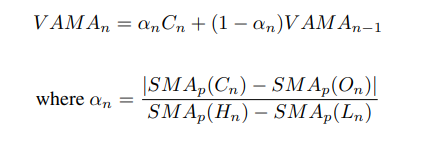
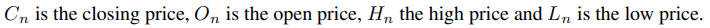
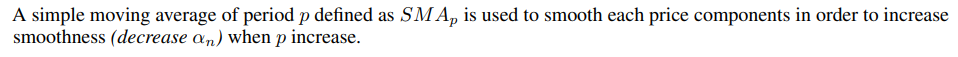
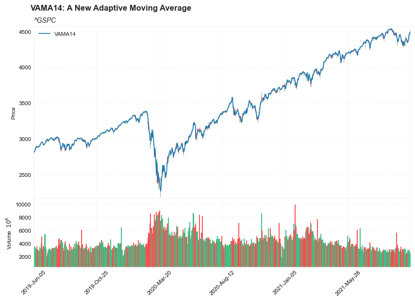
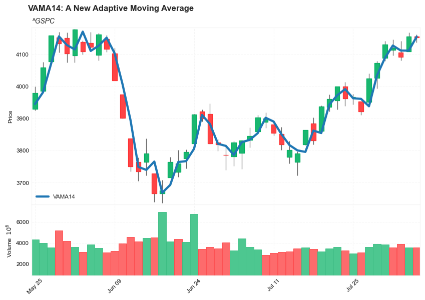
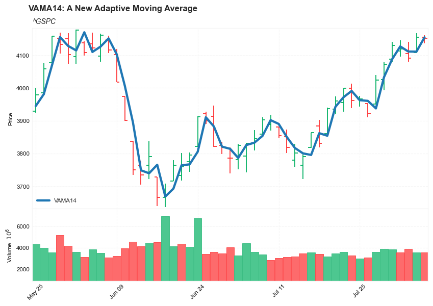

## VAMA: A New Adaptive Moving Average - Introduction


#### Reference: 

- [a New Adaptive Moving Average](https://mpra.ub.uni-muenchen.de/94323/1/MPRA_paper_94323.pdf) 
    - [backup link](pdf/MPRA_paper_94323.pdf)


#### VAMA: A New Adaptive Moving Average


    - The separation of the trend from random fluctuations (noise) is a major objective in technical analysis
    - the simple moving average and the exponential moving average are the two most used filters used to achieve this goal
    - those two filters use one parameter to control this degree of separation, higher degree of separation involve smoother results but also more lag. 
    - Lag is defined as the effect of a moving average to show past trends instead of new ones, this effect his unavoidable with causal filters and is a major drawback in decision timing . 
    - a new adaptive moving average technical indicator (VAMA) aims to provide smooth results as well as providing fast decision timing.
    
---

#### Calculation:





---

##### Load basic packages 


```python
import pandas as pd
import numpy as np
import os
import gc
import copy
from pathlib import Path
from datetime import datetime, timedelta, time, date
```


```python
#this package is to download equity price data from yahoo finance
#the source code of this package can be found here: https://github.com/ranaroussi/yfinance/blob/main
import yfinance as yf
```


```python
pd.options.display.max_rows = 100
pd.options.display.max_columns = 100

import warnings
warnings.filterwarnings("ignore")

import pytorch_lightning as pl
random_seed=1234
pl.seed_everything(random_seed)
```

    Global seed set to 1234
    


    1234


```python
#S&P 500 (^GSPC),  Dow Jones Industrial Average (^DJI), NASDAQ Composite (^IXIC)
#Russell 2000 (^RUT), Crude Oil Nov 21 (CL=F), Gold Dec 21 (GC=F)
#Treasury Yield 10 Years (^TNX)

#benchmark_tickers = ['^GSPC', '^DJI', '^IXIC', '^RUT',  'CL=F', 'GC=F', '^TNX']

benchmark_tickers = ['^GSPC']
```


```python
#https://github.com/ranaroussi/yfinance/blob/main/yfinance/base.py
#     def history(self, period="1mo", interval="1d",
#                 start=None, end=None, prepost=False, actions=True,
#                 auto_adjust=True, back_adjust=False,
#                 proxy=None, rounding=False, tz=None, timeout=None, **kwargs):

dfs = {}

for ticker in benchmark_tickers:
    cur_data = yf.Ticker(ticker)
    hist = cur_data.history(period="max", start='2000-01-01')
    print(datetime.now(), ticker, hist.shape, hist.index.min(), hist.index.max())
    dfs[ticker] = hist
```

    2022-08-06 20:05:41.835444 ^GSPC (5686, 7) 1999-12-31 00:00:00 2022-08-05 00:00:00
    


```python
dfs['^GSPC'].tail(5)
```


<div>
<style scoped>
    .dataframe tbody tr th:only-of-type {
        vertical-align: middle;
    }

    .dataframe tbody tr th {
        vertical-align: top;
    }

    .dataframe thead th {
        text-align: right;
    }
</style>
<table border="1" class="dataframe">
  <thead>
    <tr style="text-align: right;">
      <th></th>
      <th>Open</th>
      <th>High</th>
      <th>Low</th>
      <th>Close</th>
      <th>Volume</th>
      <th>Dividends</th>
      <th>Stock Splits</th>
    </tr>
    <tr>
      <th>Date</th>
      <th></th>
      <th></th>
      <th></th>
      <th></th>
      <th></th>
      <th></th>
      <th></th>
    </tr>
  </thead>
  <tbody>
    <tr>
      <th>2022-08-01</th>
      <td>4112.379883</td>
      <td>4144.950195</td>
      <td>4096.020020</td>
      <td>4118.629883</td>
      <td>3540960000</td>
      <td>0</td>
      <td>0</td>
    </tr>
    <tr>
      <th>2022-08-02</th>
      <td>4104.209961</td>
      <td>4140.470215</td>
      <td>4079.810059</td>
      <td>4091.189941</td>
      <td>3880790000</td>
      <td>0</td>
      <td>0</td>
    </tr>
    <tr>
      <th>2022-08-03</th>
      <td>4107.959961</td>
      <td>4167.660156</td>
      <td>4107.959961</td>
      <td>4155.169922</td>
      <td>3544410000</td>
      <td>0</td>
      <td>0</td>
    </tr>
    <tr>
      <th>2022-08-04</th>
      <td>4154.850098</td>
      <td>4161.290039</td>
      <td>4135.419922</td>
      <td>4151.939941</td>
      <td>3565810000</td>
      <td>0</td>
      <td>0</td>
    </tr>
    <tr>
      <th>2022-08-05</th>
      <td>4115.870117</td>
      <td>4151.580078</td>
      <td>4107.310059</td>
      <td>4145.189941</td>
      <td>3540260000</td>
      <td>0</td>
      <td>0</td>
    </tr>
  </tbody>
</table>
</div>


##### Define VAMA calculation function

    //@version=2
    study("VAMA",overlay=true)
    length = input(14)
    //----
    c = sma(close,length)
    o = sma(open,length)
    h = sma(high,length)
    l = sma(low,length)
    lv = abs(c-o)/(h - l)
    //----
    ma = lv*close+(1-lv)*nz(ma[1],close)
    plot(ma,color=#FF0000,transp=0)


```python

def cal_vama(ohlc: pd.DataFrame, period: int = 14) -> pd.Series:
        """
        A New Adaptive Moving Average: VAMA
        :period: Specifies the number of periods used for VAMA calculation
        
        based on: https://mpra.ub.uni-muenchen.de/94323/1/MPRA_paper_94323.pdf
        
        """
        ohlc = ohlc.copy(deep=True)
        ohlc.columns = [col_name.lower() for col_name in ohlc.columns]
        c = ohlc.close.rolling(period).mean()
        o = ohlc.open.rolling(period).mean()
        h = ohlc.high.rolling(period).mean()
        l = ohlc.low.rolling(period).mean()
        
        lv = abs(c - o)/(h - l)
        ma = lv*ohlc.close + (1 - lv)*ohlc.close.shift(1)


        return pd.Series(ma, index=ohlc.index, name=f"VAMA{period}")
```

##### Calculate MAMA


```python
df = dfs['^GSPC'][['Open', 'High', 'Low', 'Close', 'Volume']]
```


```python
df = df.round(2)
```


```python
df.shift(1)
```


<div>
<style scoped>
    .dataframe tbody tr th:only-of-type {
        vertical-align: middle;
    }

    .dataframe tbody tr th {
        vertical-align: top;
    }

    .dataframe thead th {
        text-align: right;
    }
</style>
<table border="1" class="dataframe">
  <thead>
    <tr style="text-align: right;">
      <th></th>
      <th>Open</th>
      <th>High</th>
      <th>Low</th>
      <th>Close</th>
      <th>Volume</th>
    </tr>
    <tr>
      <th>Date</th>
      <th></th>
      <th></th>
      <th></th>
      <th></th>
      <th></th>
    </tr>
  </thead>
  <tbody>
    <tr>
      <th>1999-12-31</th>
      <td>NaN</td>
      <td>NaN</td>
      <td>NaN</td>
      <td>NaN</td>
      <td>NaN</td>
    </tr>
    <tr>
      <th>2000-01-03</th>
      <td>1464.47</td>
      <td>1472.42</td>
      <td>1458.19</td>
      <td>1469.25</td>
      <td>3.740500e+08</td>
    </tr>
    <tr>
      <th>2000-01-04</th>
      <td>1469.25</td>
      <td>1478.00</td>
      <td>1438.36</td>
      <td>1455.22</td>
      <td>9.318000e+08</td>
    </tr>
    <tr>
      <th>2000-01-05</th>
      <td>1455.22</td>
      <td>1455.22</td>
      <td>1397.43</td>
      <td>1399.42</td>
      <td>1.009000e+09</td>
    </tr>
    <tr>
      <th>2000-01-06</th>
      <td>1399.42</td>
      <td>1413.27</td>
      <td>1377.68</td>
      <td>1402.11</td>
      <td>1.085500e+09</td>
    </tr>
    <tr>
      <th>...</th>
      <td>...</td>
      <td>...</td>
      <td>...</td>
      <td>...</td>
      <td>...</td>
    </tr>
    <tr>
      <th>2022-08-01</th>
      <td>4087.33</td>
      <td>4140.15</td>
      <td>4079.22</td>
      <td>4130.29</td>
      <td>3.817740e+09</td>
    </tr>
    <tr>
      <th>2022-08-02</th>
      <td>4112.38</td>
      <td>4144.95</td>
      <td>4096.02</td>
      <td>4118.63</td>
      <td>3.540960e+09</td>
    </tr>
    <tr>
      <th>2022-08-03</th>
      <td>4104.21</td>
      <td>4140.47</td>
      <td>4079.81</td>
      <td>4091.19</td>
      <td>3.880790e+09</td>
    </tr>
    <tr>
      <th>2022-08-04</th>
      <td>4107.96</td>
      <td>4167.66</td>
      <td>4107.96</td>
      <td>4155.17</td>
      <td>3.544410e+09</td>
    </tr>
    <tr>
      <th>2022-08-05</th>
      <td>4154.85</td>
      <td>4161.29</td>
      <td>4135.42</td>
      <td>4151.94</td>
      <td>3.565810e+09</td>
    </tr>
  </tbody>
</table>
<p>5686 rows × 5 columns</p>
</div>


```python
df_vama = cal_vama(df, period = 14)
```


```python
df.shape, df_vama.shape
```


    ((5686, 5), (5686,))


```python
df = df.merge(df_vama, left_index = True, right_index = True, how='inner' )

del df_vama
gc.collect()
```


    155


```python
display(df.head(5))
display(df.tail(5))
```


<div>
<style scoped>
    .dataframe tbody tr th:only-of-type {
        vertical-align: middle;
    }

    .dataframe tbody tr th {
        vertical-align: top;
    }

    .dataframe thead th {
        text-align: right;
    }
</style>
<table border="1" class="dataframe">
  <thead>
    <tr style="text-align: right;">
      <th></th>
      <th>Open</th>
      <th>High</th>
      <th>Low</th>
      <th>Close</th>
      <th>Volume</th>
      <th>VAMA14</th>
    </tr>
    <tr>
      <th>Date</th>
      <th></th>
      <th></th>
      <th></th>
      <th></th>
      <th></th>
      <th></th>
    </tr>
  </thead>
  <tbody>
    <tr>
      <th>1999-12-31</th>
      <td>1464.47</td>
      <td>1472.42</td>
      <td>1458.19</td>
      <td>1469.25</td>
      <td>374050000</td>
      <td>NaN</td>
    </tr>
    <tr>
      <th>2000-01-03</th>
      <td>1469.25</td>
      <td>1478.00</td>
      <td>1438.36</td>
      <td>1455.22</td>
      <td>931800000</td>
      <td>NaN</td>
    </tr>
    <tr>
      <th>2000-01-04</th>
      <td>1455.22</td>
      <td>1455.22</td>
      <td>1397.43</td>
      <td>1399.42</td>
      <td>1009000000</td>
      <td>NaN</td>
    </tr>
    <tr>
      <th>2000-01-05</th>
      <td>1399.42</td>
      <td>1413.27</td>
      <td>1377.68</td>
      <td>1402.11</td>
      <td>1085500000</td>
      <td>NaN</td>
    </tr>
    <tr>
      <th>2000-01-06</th>
      <td>1402.11</td>
      <td>1411.90</td>
      <td>1392.10</td>
      <td>1403.45</td>
      <td>1092300000</td>
      <td>NaN</td>
    </tr>
  </tbody>
</table>
</div>


<div>
<style scoped>
    .dataframe tbody tr th:only-of-type {
        vertical-align: middle;
    }

    .dataframe tbody tr th {
        vertical-align: top;
    }

    .dataframe thead th {
        text-align: right;
    }
</style>
<table border="1" class="dataframe">
  <thead>
    <tr style="text-align: right;">
      <th></th>
      <th>Open</th>
      <th>High</th>
      <th>Low</th>
      <th>Close</th>
      <th>Volume</th>
      <th>VAMA14</th>
    </tr>
    <tr>
      <th>Date</th>
      <th></th>
      <th></th>
      <th></th>
      <th></th>
      <th></th>
      <th></th>
    </tr>
  </thead>
  <tbody>
    <tr>
      <th>2022-08-01</th>
      <td>4112.38</td>
      <td>4144.95</td>
      <td>4096.02</td>
      <td>4118.63</td>
      <td>3540960000</td>
      <td>4126.644304</td>
    </tr>
    <tr>
      <th>2022-08-02</th>
      <td>4104.21</td>
      <td>4140.47</td>
      <td>4079.81</td>
      <td>4091.19</td>
      <td>3880790000</td>
      <td>4111.028432</td>
    </tr>
    <tr>
      <th>2022-08-03</th>
      <td>4107.96</td>
      <td>4167.66</td>
      <td>4107.96</td>
      <td>4155.17</td>
      <td>3544410000</td>
      <td>4110.722000</td>
    </tr>
    <tr>
      <th>2022-08-04</th>
      <td>4154.85</td>
      <td>4161.29</td>
      <td>4135.42</td>
      <td>4151.94</td>
      <td>3565810000</td>
      <td>4154.340033</td>
    </tr>
    <tr>
      <th>2022-08-05</th>
      <td>4115.87</td>
      <td>4151.58</td>
      <td>4107.31</td>
      <td>4145.19</td>
      <td>3540260000</td>
      <td>4149.449567</td>
    </tr>
  </tbody>
</table>
</div>


```python
from core.ta import cal_mama
from core.visuals import make_candle
```


```python

start = -800
end = -200

names = {'main_title': 'VAMA14: A New Adaptive Moving Average', 
         'sub_tile': f'{ticker}'}


make_candle(df.iloc[start:end][['Open', 'High', 'Low', 'Close', 'Volume']], 
            df.iloc[start:end][['VAMA14']], names = names)
```


    

    


```python

start = -50
end = -1

names = {'main_title': 'VAMA14: A New Adaptive Moving Average', 
         'sub_tile': f'{ticker}'}


make_candle(df.iloc[start:end][['Open', 'High', 'Low', 'Close', 'Volume']], 
            df.iloc[start:end][['VAMA14']], names = names)
```


    

    


```python

start = -50
end = -1

names = {'main_title': 'VAMA14: A New Adaptive Moving Average', 
         'sub_tile': f'{ticker}'}


make_candle(df.iloc[start:end][['Open', 'High', 'Low', 'Close', 'Volume']], 
            df.iloc[start:end][['VAMA14']],  chart_type='ohlc', names = names)
```


    

    


```python

```
