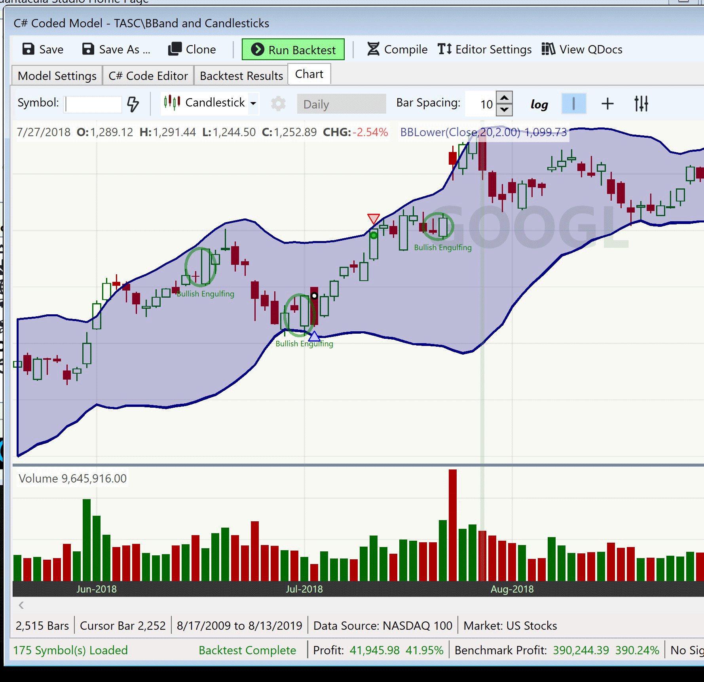
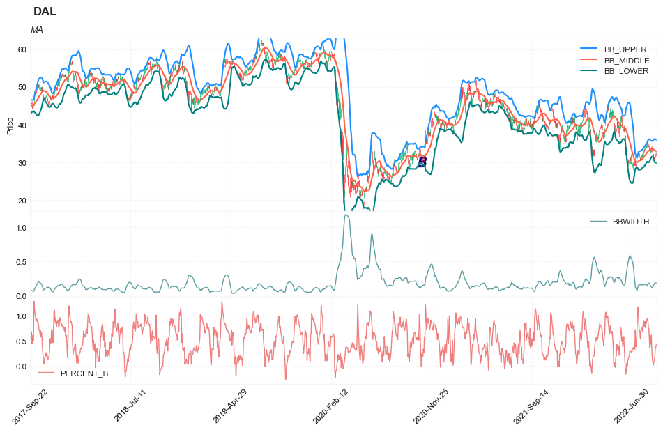

## Combining Bollinger Bands With Candlesticks

**References**


- [traders.com: TradersTips 2019-10](https://traders.com/documentation/feedbk_docs/2019/10/traderstips.html)


**█ OVERVIEW**


In “Combining Bollinger Bands With Candlesticks” in this issue, author Pawel Kosinski introduces us to a trading strategy that combines standard Bollinger Bands with the bullish engulfing candlestick pattern. Along the way we get a glimpse into the author’s process for trading strategy design and testing. 

The strategy uses 20-period Bollinger Bands set at 2.2 standard deviations from the center average and four times a 14-period average true range for a maximum loss stop. 


Quantacula Studio’s candlesticks extension can automatically flag all common candlestick patterns. We used the extension to create a model based on Pawel Kosinski’s concepts described in his article in this issue. Our model buys after the price touches the lower Bollinger Band, and a Bullish Engulfing candlestick pattern has also occurred. Performing a quick backtest on the Nasdaq 100 yielded modest profits of 21.7% over a 10-year period.

We decided to tweak the entry based on a simple technique we like to use. **Instead of buying the next day at market open, we buy using a limit order set to the closing price of the signal bar. Most of the time, when prices gap up, they eventually retest the previous day’s close during the trading day. This technique does cause some trades to “get away from you” when they never retest, but overall the value proposition is positive.** Applying this simple change doubled the net profit to 42% in our backtest.


**█ STRATEGY**


    Buy Order tab:
    Formula:
    stop:= Ref(C, -1) - (4 * ATR(14));
    RR:= (BBandTop(C, 20, S, 2.2)-H)/ (H-RR);
    el:= C > Ref(H, -1) AND Ref( EngulfingBull(), -1) AND
    Ref( Alert( L < BBandBot(C, 20, S, 2.2), 2), -1) AND RR > 1.0;
    xl:= H > BBandTop(C, 20, S, 2.2);
    trade:= If( PREV<=0, If(el, stop, 0),
    If( L<= PREV, -1, If( xl, -2, PREV)));
    trade > 0 AND Ref(trade <= 0, -1)

    Sell Order tab:
    Formula:
    stop:= Ref(C, -1) - (4 * ATR(14));
    RR:= (BBandTop(C, 20, S, 2.2)-H)/ (H-RR);
    el:= C > Ref(H, -1) AND Ref( EngulfingBull(), -1) AND
    Ref( Alert( L < BBandBot(C, 20, S, 2.2), 2), -1) AND RR > 1.0;
    xl:= H > BBandTop(C, 20, S, 2.2);
    trade:= If( PREV<=0, If(el, stop, 0),
    If( L<= PREV, -1, If( xl, -2, PREV)));
    trade < 0

    Order Type: Stop Limit
    Stop or Limit Price:
    stop:= Ref(C, -1) - (4 * ATR(14));
    RR:= (BBandTop(C, 20, S, 2.2)-H)/ (H-RR);
    el:= C > Ref(H, -1) AND Ref( EngulfingBull(), -1) AND
    Ref( Alert( L < BBandBot(C, 20, S, 2.2), 2), -1) AND RR > 1.0;
    xl:= H > BBandTop(C, 20, S, 2.2);
    trade:= If( PREV<=0, If(el, stop, 0),
    If( L<= PREV, -1, If( xl, -2, PREV)));
    If( trade = -1, Ref(trade, -1), C)
    
    
    

##### Load basic packages 


```python
import pandas as pd
import numpy as np
import os
import gc
import copy
from pathlib import Path
from datetime import datetime, timedelta, time, date
```


```python
#this package is to download equity price data from yahoo finance
#the source code of this package can be found here: https://github.com/ranaroussi/yfinance/blob/main
import yfinance as yf
```


```python
pd.options.display.max_rows = 100
pd.options.display.max_columns = 100

import warnings
warnings.filterwarnings("ignore")

import pytorch_lightning as pl
random_seed=1234
pl.seed_everything(random_seed)
```

    Global seed set to 1234
    


    1234


##### Download data


```python
##### Download data#S&P 500 (^GSPC),  Dow Jones Industrial Average (^DJI), NASDAQ Composite (^IXIC)
#Russell 2000 (^RUT), Crude Oil Nov 21 (CL=F), Gold Dec 21 (GC=F)
#Treasury Yield 10 Years (^TNX)
#CBOE Volatility Index (^VIX) Chicago Options - Chicago Options Delayed Price. Currency in USD

#benchmark_tickers = ['^GSPC', '^DJI', '^IXIC', '^RUT',  'CL=F', 'GC=F', '^TNX']

benchmark_tickers = ['^GSPC', '^VIX']
tickers = benchmark_tickers + ['GSK', 'BST', 'PFE','DAL']
```


```python
#https://github.com/ranaroussi/yfinance/blob/main/yfinance/base.py
#     def history(self, period="1mo", interval="1d",
#                 start=None, end=None, prepost=False, actions=True,
#                 auto_adjust=True, back_adjust=False,
#                 proxy=None, rounding=False, tz=None, timeout=None, **kwargs):

dfs = {}

for ticker in tickers:
    cur_data = yf.Ticker(ticker)
    hist = cur_data.history(period="max", start='2000-01-01')
    print(datetime.now(), ticker, hist.shape, hist.index.min(), hist.index.max())
    dfs[ticker] = hist
```

    2022-09-10 01:06:11.715775 ^GSPC (5710, 7) 1999-12-31 00:00:00 2022-09-09 00:00:00
    2022-09-10 01:06:12.011806 ^VIX (5710, 7) 1999-12-31 00:00:00 2022-09-09 00:00:00
    2022-09-10 01:06:12.412567 GSK (5710, 7) 1999-12-31 00:00:00 2022-09-09 00:00:00
    2022-09-10 01:06:12.663710 BST (1980, 7) 2014-10-29 00:00:00 2022-09-09 00:00:00
    2022-09-10 01:06:13.052159 PFE (5710, 7) 1999-12-31 00:00:00 2022-09-09 00:00:00
    2022-09-10 01:06:13.314652 DAL (3867, 7) 2007-05-03 00:00:00 2022-09-09 00:00:00
    


```python
ticker = 'DAL'
dfs[ticker].tail(5)
```


<div>
<style scoped>
    .dataframe tbody tr th:only-of-type {
        vertical-align: middle;
    }

    .dataframe tbody tr th {
        vertical-align: top;
    }

    .dataframe thead th {
        text-align: right;
    }
</style>
<table border="1" class="dataframe">
  <thead>
    <tr style="text-align: right;">
      <th></th>
      <th>Open</th>
      <th>High</th>
      <th>Low</th>
      <th>Close</th>
      <th>Volume</th>
      <th>Dividends</th>
      <th>Stock Splits</th>
    </tr>
    <tr>
      <th>Date</th>
      <th></th>
      <th></th>
      <th></th>
      <th></th>
      <th></th>
      <th></th>
      <th></th>
    </tr>
  </thead>
  <tbody>
    <tr>
      <th>2022-09-02</th>
      <td>31.440001</td>
      <td>31.830000</td>
      <td>30.700001</td>
      <td>30.940001</td>
      <td>8626500</td>
      <td>0.0</td>
      <td>0</td>
    </tr>
    <tr>
      <th>2022-09-06</th>
      <td>31.340000</td>
      <td>31.650000</td>
      <td>30.660000</td>
      <td>31.190001</td>
      <td>7630800</td>
      <td>0.0</td>
      <td>0</td>
    </tr>
    <tr>
      <th>2022-09-07</th>
      <td>31.290001</td>
      <td>32.340000</td>
      <td>31.270000</td>
      <td>32.230000</td>
      <td>9035900</td>
      <td>0.0</td>
      <td>0</td>
    </tr>
    <tr>
      <th>2022-09-08</th>
      <td>31.719999</td>
      <td>32.490002</td>
      <td>31.549999</td>
      <td>32.119999</td>
      <td>11074800</td>
      <td>0.0</td>
      <td>0</td>
    </tr>
    <tr>
      <th>2022-09-09</th>
      <td>32.430000</td>
      <td>32.759998</td>
      <td>32.240002</td>
      <td>32.435001</td>
      <td>4745097</td>
      <td>0.0</td>
      <td>0</td>
    </tr>
  </tbody>
</table>
</div>


##### Calculate the technical indicators and  Find signals


```python
def bull_engulfing(c: pd.Series, o: pd.Series)-> pd.Series:
    """
    c: pd.Series. close price
    o: pd.Series. open price
    
    BULL ENGULFING: meet all of the following
        current OPEN > current CLOSE
        pre CLOSE > pre OPEN
        current CLOSE > pre OPEN
        current OPEN > pre CLOSE
    """
    be = (c>o) & (c.shift(1)<o.shift(1)) & (c>o.shift(1)) & (o<c.shift(1))
    return pd.Series(be, name='BULL_ENGULF')


def bbands_trigger(c:pd.Series, l:pd.Series, bb_lower:pd.Series) -> pd.Series:
    """
    c: pd.Series. close price
    l: pd.Series. low price
    bb_lower: lower band of Bollinger bands
    
    Bollinger Bands Trigger: meet all of the following
        pre CLOSE < pre BBANDS lower band
        current CLOSE > current BBANDS lower band
        current LOW < current BBANDS lower band
    """
    bt = (c.shift(1)<bb_lower.shift(1)) & (c > bb_lower) & (l < bb_lower)
    
    return pd.Series(bt, name='BBANDS_TRIGGER')
```


```python
from core.finta import TA
```


```python
df = dfs[ticker][['Open', 'High', 'Low', 'Close', 'Volume']]
df = df.round(2)
```


```python
TA.BBANDS
```


    <function core.finta.TA.BBANDS(ohlc: pandas.core.frame.DataFrame, period: int = 20, MA: pandas.core.series.Series = None, column: str = 'close', std_multiplier: float = 2) -> pandas.core.frame.DataFrame>


```python
df_ta = TA.BBANDS(df, period = 20, std_multiplier=2.2, column="close")
df = df.merge(df_ta, left_index = True, right_index = True, how='inner' )


del df_ta
gc.collect()
```


    15467


```python
df['BULL_ENGULF'] = bull_engulfing(df["Close"], df["Open"])
df['BBANDS_TRIGGER'] = bbands_trigger(df["Close"], df["Low"], df["BB_LOWER"])
```


```python
df['SIGNAL'] = (df['BULL_ENGULF'] & df['BBANDS_TRIGGER']).astype(int)
```


```python
df['B'] = df['SIGNAL']*(df["High"] + df["Low"])/2
```


```python
display(df.head(5))
display(df.tail(5))
```


<div>
<style scoped>
    .dataframe tbody tr th:only-of-type {
        vertical-align: middle;
    }

    .dataframe tbody tr th {
        vertical-align: top;
    }

    .dataframe thead th {
        text-align: right;
    }
</style>
<table border="1" class="dataframe">
  <thead>
    <tr style="text-align: right;">
      <th></th>
      <th>Open</th>
      <th>High</th>
      <th>Low</th>
      <th>Close</th>
      <th>Volume</th>
      <th>BB_UPPER</th>
      <th>BB_MIDDLE</th>
      <th>BB_LOWER</th>
      <th>BBWIDTH</th>
      <th>PERCENT_B</th>
      <th>BULL_ENGULF</th>
      <th>BBANDS_TRIGGER</th>
      <th>SIGNAL</th>
      <th>B</th>
    </tr>
    <tr>
      <th>Date</th>
      <th></th>
      <th></th>
      <th></th>
      <th></th>
      <th></th>
      <th></th>
      <th></th>
      <th></th>
      <th></th>
      <th></th>
      <th></th>
      <th></th>
      <th></th>
      <th></th>
    </tr>
  </thead>
  <tbody>
    <tr>
      <th>2007-05-03</th>
      <td>19.32</td>
      <td>19.50</td>
      <td>18.25</td>
      <td>18.40</td>
      <td>8052800</td>
      <td>NaN</td>
      <td>NaN</td>
      <td>NaN</td>
      <td>NaN</td>
      <td>NaN</td>
      <td>False</td>
      <td>False</td>
      <td>0</td>
      <td>0.0</td>
    </tr>
    <tr>
      <th>2007-05-04</th>
      <td>18.88</td>
      <td>18.96</td>
      <td>18.39</td>
      <td>18.64</td>
      <td>5437300</td>
      <td>NaN</td>
      <td>NaN</td>
      <td>NaN</td>
      <td>NaN</td>
      <td>NaN</td>
      <td>False</td>
      <td>False</td>
      <td>0</td>
      <td>0.0</td>
    </tr>
    <tr>
      <th>2007-05-07</th>
      <td>18.83</td>
      <td>18.91</td>
      <td>17.94</td>
      <td>18.08</td>
      <td>2646300</td>
      <td>NaN</td>
      <td>NaN</td>
      <td>NaN</td>
      <td>NaN</td>
      <td>NaN</td>
      <td>False</td>
      <td>False</td>
      <td>0</td>
      <td>0.0</td>
    </tr>
    <tr>
      <th>2007-05-08</th>
      <td>17.76</td>
      <td>17.76</td>
      <td>17.14</td>
      <td>17.44</td>
      <td>4166100</td>
      <td>NaN</td>
      <td>NaN</td>
      <td>NaN</td>
      <td>NaN</td>
      <td>NaN</td>
      <td>False</td>
      <td>False</td>
      <td>0</td>
      <td>0.0</td>
    </tr>
    <tr>
      <th>2007-05-09</th>
      <td>17.54</td>
      <td>17.94</td>
      <td>17.44</td>
      <td>17.58</td>
      <td>7541100</td>
      <td>NaN</td>
      <td>NaN</td>
      <td>NaN</td>
      <td>NaN</td>
      <td>NaN</td>
      <td>False</td>
      <td>False</td>
      <td>0</td>
      <td>0.0</td>
    </tr>
  </tbody>
</table>
</div>


<div>
<style scoped>
    .dataframe tbody tr th:only-of-type {
        vertical-align: middle;
    }

    .dataframe tbody tr th {
        vertical-align: top;
    }

    .dataframe thead th {
        text-align: right;
    }
</style>
<table border="1" class="dataframe">
  <thead>
    <tr style="text-align: right;">
      <th></th>
      <th>Open</th>
      <th>High</th>
      <th>Low</th>
      <th>Close</th>
      <th>Volume</th>
      <th>BB_UPPER</th>
      <th>BB_MIDDLE</th>
      <th>BB_LOWER</th>
      <th>BBWIDTH</th>
      <th>PERCENT_B</th>
      <th>BULL_ENGULF</th>
      <th>BBANDS_TRIGGER</th>
      <th>SIGNAL</th>
      <th>B</th>
    </tr>
    <tr>
      <th>Date</th>
      <th></th>
      <th></th>
      <th></th>
      <th></th>
      <th></th>
      <th></th>
      <th></th>
      <th></th>
      <th></th>
      <th></th>
      <th></th>
      <th></th>
      <th></th>
      <th></th>
    </tr>
  </thead>
  <tbody>
    <tr>
      <th>2022-09-02</th>
      <td>31.44</td>
      <td>31.83</td>
      <td>30.70</td>
      <td>30.94</td>
      <td>8626500</td>
      <td>36.133696</td>
      <td>33.2025</td>
      <td>30.271304</td>
      <td>0.176565</td>
      <td>0.114065</td>
      <td>False</td>
      <td>False</td>
      <td>0</td>
      <td>0.0</td>
    </tr>
    <tr>
      <th>2022-09-06</th>
      <td>31.34</td>
      <td>31.65</td>
      <td>30.66</td>
      <td>31.19</td>
      <td>7630800</td>
      <td>36.150830</td>
      <td>33.0745</td>
      <td>29.998170</td>
      <td>0.186024</td>
      <td>0.193710</td>
      <td>False</td>
      <td>False</td>
      <td>0</td>
      <td>0.0</td>
    </tr>
    <tr>
      <th>2022-09-07</th>
      <td>31.29</td>
      <td>32.34</td>
      <td>31.27</td>
      <td>32.23</td>
      <td>9035900</td>
      <td>36.128493</td>
      <td>33.0255</td>
      <td>29.922507</td>
      <td>0.187915</td>
      <td>0.371817</td>
      <td>False</td>
      <td>False</td>
      <td>0</td>
      <td>0.0</td>
    </tr>
    <tr>
      <th>2022-09-08</th>
      <td>31.72</td>
      <td>32.49</td>
      <td>31.55</td>
      <td>32.12</td>
      <td>11074800</td>
      <td>36.031337</td>
      <td>32.9350</td>
      <td>29.838663</td>
      <td>0.188027</td>
      <td>0.368393</td>
      <td>False</td>
      <td>False</td>
      <td>0</td>
      <td>0.0</td>
    </tr>
    <tr>
      <th>2022-09-09</th>
      <td>32.43</td>
      <td>32.76</td>
      <td>32.24</td>
      <td>32.44</td>
      <td>4745097</td>
      <td>35.917212</td>
      <td>32.8590</td>
      <td>29.800788</td>
      <td>0.186141</td>
      <td>0.431496</td>
      <td>False</td>
      <td>False</td>
      <td>0</td>
      <td>0.0</td>
    </tr>
  </tbody>
</table>
</div>


```python
df['SIGNAL'].value_counts()
```


    0    3864
    1       3
    Name: SIGNAL, dtype: int64


##### Visual


```python
from core.visuals import *
```


```python
start = -1250
end = df.shape[0]
df_sub = df.iloc[start:end]
# df_sub = df[(df.index<='2019-04-01') & (df.index>='2019-01-24')]
names = {'main_title': f'{ticker}'}
```


```python
lines0 = basic_lines(df_sub[['BB_UPPER', 'BB_MIDDLE', 'BB_LOWER']], 
                     colors = [], 
                     **dict(panel=0, width=1.5, secondary_y=False))

lines1 = basic_lines(df_sub[['BBWIDTH']], 
                     colors = ['cadetblue'], 
                     **dict(panel=1, width=1))
lines3 = basic_lines(df_sub[['PERCENT_B']], 
                     colors = ['lightcoral'], 
                     **dict(panel=2, width=1))

lines2 = basic_lines(df_sub[[ 'B']],
                     colors = ['navy'], 
                     **dict(panel=0, type='scatter', marker=r'${B}$' , markersize=100, secondary_y=False))


lines_ = dict(**lines0, **lines1)
lines_.update(lines2)
lines_.update(lines3)

#shadows_ = basic_shadows(bands=[-0.01, 0.01], nsamples=df.iloc[start:end].shape[0], **dict(panel=1, color="lightskyblue",alpha=0.1,interpolate=True))
shadows_ = []
fig_config_ = dict(figratio=(18,10), volume=False, volume_panel=2,panel_ratios=(4,2, 2), tight_layout=True, returnfig=True,)

ax_cfg_ = {0:dict(basic=[5, 2, ['BB_UPPER', 'BB_MIDDLE', 'BB_LOWER']], 
                 title=dict(label = 'MA', fontsize=9, style='italic',  loc='left'), 
                ),
           2:dict(basic=[1, 0, ['BBWIDTH']]
                ),
           4:dict(basic=[1, 0, ['PERCENT_B']]
                ),
          }


names = {'main_title': f'{ticker}'}

aa_, bb_ = make_panels(main_data = df_sub[['Open', 'High', 'Low', 'Close', 'Volume']], 
                       added_plots = lines_,
                       fill_betweens = shadows_, 
                       fig_config = fig_config_, 
                       axes_config = ax_cfg_,  
                       names = names)
```


    

    


##### Simulate


```python
TRADE_CONFIG = dict(INIT_CAPITAL = 10000 ,
                    MIN_TRADE_SIZE = 100 ,
                    MAX_TRADE_SIZE = 1000 ,
                    HOLD_DAYS = 40, #max hold days
                    STOP_LOSS = 0.085, #10% drop
                    KEEP_PROFIT = 0.065, 
                    MAX_OPEN = 1, #allow only 1 open position
                    COST = 0.0035,
                   ) 
```


```python
df['SIGNAL'].value_counts()
```


    0    3864
    1       3
    Name: SIGNAL, dtype: int64


```python
trades = []
for i in range(df.shape[0]-5):
    row = df.iloc[i]
    if row['SIGNAL']>0:
        print('enter: ', i)
        row_j = df.iloc[i+1]
        item = dict(signal_date = row.name,
                    enter_date = row_j.name, 
                    enter_price = row_j['High']
                   )
        for j in range(i+2, min(i+TRADE_CONFIG['HOLD_DAYS'], df.shape[0])):
            row_j = df.iloc[j]
            price_ = row_j['Low']
            pct_chg = price_/item['enter_price']
            if (pct_chg<= (1 - TRADE_CONFIG['STOP_LOSS'])) | (pct_chg >= (1 + TRADE_CONFIG['KEEP_PROFIT'])):
                break
                
        item['exit_date'] = row_j.name
        item['exit_price'] = price_
        item['hold_days'] = j - i
        i = j 
        print('exit:', i)
        trades.append(item)
        
```

    enter:  960
    exit: 965
    enter:  2208
    exit: 2216
    enter:  3398
    exit: 3405
    


```python
df_trades = pd.DataFrame(data = trades)
df_trades.shape
```


    (3, 6)


```python
def cal_pnl(trade):
    shares = int(TRADE_CONFIG['INIT_CAPITAL']/trade['enter_price'])
    if shares < TRADE_CONFIG['MIN_TRADE_SIZE']:
        shares = 0
    elif shares > TRADE_CONFIG['MAX_TRADE_SIZE']:
        shares = TRADE_CONFIG['MAX_TRADE_SIZE']
    pnl = shares*(trade['exit_price'] - trade['enter_price']) - shares*trade['enter_price']*TRADE_CONFIG['COST']
    return pnl
```


```python
df_trades['pnl'] = df_trades.apply(lambda x: cal_pnl(x), axis=1)
```


```python
df_trades
```


<div>
<style scoped>
    .dataframe tbody tr th:only-of-type {
        vertical-align: middle;
    }

    .dataframe tbody tr th {
        vertical-align: top;
    }

    .dataframe thead th {
        text-align: right;
    }
</style>
<table border="1" class="dataframe">
  <thead>
    <tr style="text-align: right;">
      <th></th>
      <th>signal_date</th>
      <th>enter_date</th>
      <th>enter_price</th>
      <th>exit_date</th>
      <th>exit_price</th>
      <th>hold_days</th>
      <th>pnl</th>
    </tr>
  </thead>
  <tbody>
    <tr>
      <th>0</th>
      <td>2011-02-23</td>
      <td>2011-02-24</td>
      <td>10.05</td>
      <td>2011-03-02</td>
      <td>8.99</td>
      <td>5</td>
      <td>-1089.699125</td>
    </tr>
    <tr>
      <th>1</th>
      <td>2016-02-09</td>
      <td>2016-02-10</td>
      <td>39.79</td>
      <td>2016-02-22</td>
      <td>42.59</td>
      <td>8</td>
      <td>667.844485</td>
    </tr>
    <tr>
      <th>2</th>
      <td>2020-10-29</td>
      <td>2020-10-30</td>
      <td>30.99</td>
      <td>2020-11-09</td>
      <td>34.68</td>
      <td>7</td>
      <td>1153.254270</td>
    </tr>
  </tbody>
</table>
</div>


