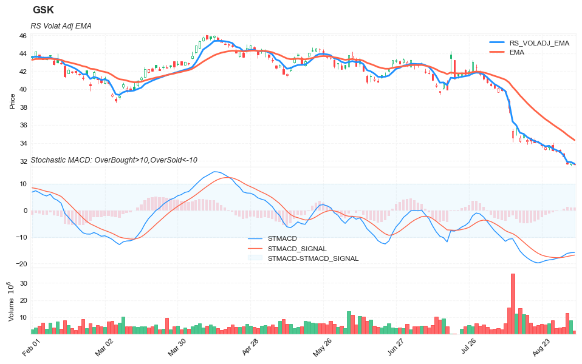
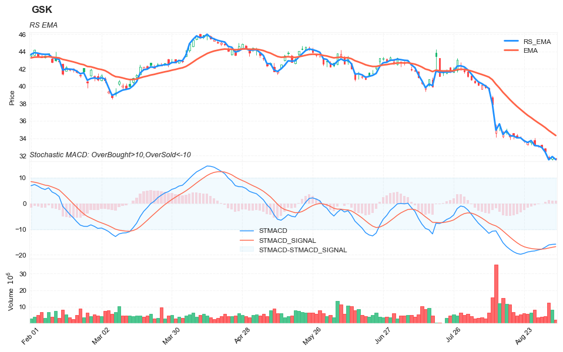
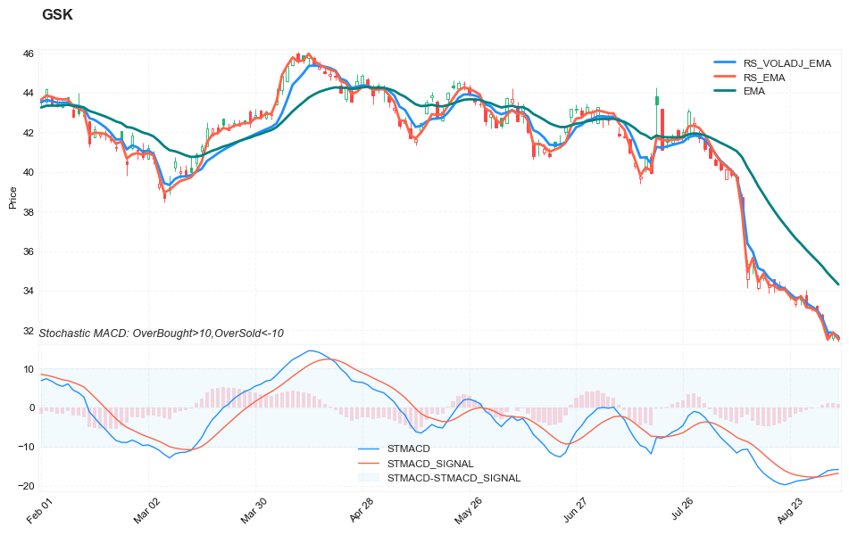

## Combine Stochastic MACD, RS EMA, and RS VolatAdj EMA


**References**

- Stochastic Moving Average Convergence/Divergence (MACD) [traders.com: TradersTips 2019-11](https://traders.com/Documentation/FEEDbk_docs/2019/11/TradersTips.html)
- Relative Strength Exponential Moving Averages (RS EMA)[traders.com: TradersTips 2022-03](https://traders.com/Documentation/FEEDbk_docs/2022/03/TradersTips.html)
- Relative Strength Volatility-Adjusted Exponential Moving Averages (RS VolatAdj EMA)[traders.com: TradersTips 2022-05](https://traders.com/Documentation/FEEDbk_docs/2022/05/TradersTips.html)


### TASC 2019-11: Combine Stochastic Moving Average Convergence/Divergence (MACD)

In “The Stochastic MACD Oscillator” in this issue, author Vitali Apirine introduces a new indicator created by combining the stochastic oscillator and the MACD. He describes the new indicator as a momentum oscillator and explains that it allows the trader to define overbought and oversold levels similar to the classic stochastic but based on the MACD.

### TASC 2022-03: relative strength volatility-adjusted exponential moving average (RS VolatAdj EMA)

For this month’s Traders’ Tips, the focus is Vitali Apirine’s article in this issue, “Relative Strength Moving Averages, Part 3.” Here, we present the March 2022 Traders’ Tips code with possible implementations in various software.

The current article series “Relative Strength Moving Averages” by Vitali Apirine focuses on differences between traditional exponential moving averages (EMAs) and relative strength-based EMA indicators. In this issue's article, Apirine describes the relative strength volatility-adjusted exponential moving average (RS VolatAdj EMA).

The indicator is designed to account for relative strength of volatility, and it requires a second, corresponding volatility index. For example, if charting the S&P 500 ETF (SPY), one can use the CBOE Volatility Index ($VIX.X). The indicator compared to itself of varying lengths, or the indicator compared to a traditional EMA with the same length, can be used to help to identify trends and turning points. During an uptrend, RS VolatAdj EMA crossovers can be used to help identify entry points for long trades.


### TASC 2022-05: Relative Strength Moving Averages (RS_EMA)


For this month’s Traders’ Tips, the focus is Vitali Apirine’s article in the January 2022 issue, “Relative Strength Moving Averages, Part 1: The Relative Strength Exponential Moving Average (RS EMA).” Here, we present the May 2022 Traders’ Tips code with possible implementations in various software.

In part 1 of a three-part series focused on differences between traditional EMAs and relative strength-based EMA indicators, author Vitali Apirine introduces the relative strength exponential moving average (RS EMA). The study is designed to account for relative strength of price and is considered a trend-following indicator that can be used in combination with an EMA of the same length to identify the overall trend. RS EMAs with different lengths can define turning points and filter price movements.


##### Load basic packages 


```python
import pandas as pd
import numpy as np
import os
import gc
import copy
from pathlib import Path
from datetime import datetime, timedelta, time, date
```


```python
#this package is to download equity price data from yahoo finance
#the source code of this package can be found here: https://github.com/ranaroussi/yfinance/blob/main
import yfinance as yf
```


```python
pd.options.display.max_rows = 100
pd.options.display.max_columns = 100

import warnings
warnings.filterwarnings("ignore")

import pytorch_lightning as pl
random_seed=1234
pl.seed_everything(random_seed)
```

    Global seed set to 1234
    


    1234


##### Download data via yfinance package


```python
#S&P 500 (^GSPC),  Dow Jones Industrial Average (^DJI), NASDAQ Composite (^IXIC)
#Russell 2000 (^RUT), Crude Oil Nov 21 (CL=F), Gold Dec 21 (GC=F)
#Treasury Yield 10 Years (^TNX)

#benchmark_tickers = ['^GSPC', '^DJI', '^IXIC', '^RUT',  'CL=F', 'GC=F', '^TNX']

benchmark_tickers = ['^GSPC', '^VIX']
tickers = benchmark_tickers + ['GSK', 'NVO', 'PFE']
```


```python
#https://github.com/ranaroussi/yfinance/blob/main/yfinance/base.py
#     def history(self, period="1mo", interval="1d",
#                 start=None, end=None, prepost=False, actions=True,
#                 auto_adjust=True, back_adjust=False,
#                 proxy=None, rounding=False, tz=None, timeout=None, **kwargs):

dfs = {}

for ticker in tickers:
    cur_data = yf.Ticker(ticker)
    hist = cur_data.history(period="max", start='2000-01-01')
    print(datetime.now(), ticker, hist.shape, hist.index.min(), hist.index.max())
    dfs[ticker] = hist
```

    2022-09-06 23:55:59.571501 ^GSPC (5707, 7) 1999-12-31 00:00:00 2022-09-06 00:00:00
    2022-09-06 23:56:00.382183 ^VIX (5707, 7) 1999-12-31 00:00:00 2022-09-06 00:00:00
    2022-09-06 23:56:00.652416 GSK (5707, 7) 1999-12-31 00:00:00 2022-09-06 00:00:00
    2022-09-06 23:56:01.023093 NVO (5707, 7) 1999-12-31 00:00:00 2022-09-06 00:00:00
    2022-09-06 23:56:01.369962 PFE (5707, 7) 1999-12-31 00:00:00 2022-09-06 00:00:00
    


```python
ticker = 'GSK'
dfs[ticker].tail(5)
```


<div>
<style scoped>
    .dataframe tbody tr th:only-of-type {
        vertical-align: middle;
    }

    .dataframe tbody tr th {
        vertical-align: top;
    }

    .dataframe thead th {
        text-align: right;
    }
</style>
<table border="1" class="dataframe">
  <thead>
    <tr style="text-align: right;">
      <th></th>
      <th>Open</th>
      <th>High</th>
      <th>Low</th>
      <th>Close</th>
      <th>Volume</th>
      <th>Dividends</th>
      <th>Stock Splits</th>
    </tr>
    <tr>
      <th>Date</th>
      <th></th>
      <th></th>
      <th></th>
      <th></th>
      <th></th>
      <th></th>
      <th></th>
    </tr>
  </thead>
  <tbody>
    <tr>
      <th>2022-08-30</th>
      <td>33.230000</td>
      <td>33.290001</td>
      <td>32.919998</td>
      <td>32.959999</td>
      <td>3994500</td>
      <td>0.0</td>
      <td>0.0</td>
    </tr>
    <tr>
      <th>2022-08-31</th>
      <td>32.790001</td>
      <td>32.880001</td>
      <td>32.459999</td>
      <td>32.480000</td>
      <td>4291800</td>
      <td>0.0</td>
      <td>0.0</td>
    </tr>
    <tr>
      <th>2022-09-01</th>
      <td>31.830000</td>
      <td>31.990000</td>
      <td>31.610001</td>
      <td>31.690001</td>
      <td>12390900</td>
      <td>0.0</td>
      <td>0.0</td>
    </tr>
    <tr>
      <th>2022-09-02</th>
      <td>31.600000</td>
      <td>31.969999</td>
      <td>31.469999</td>
      <td>31.850000</td>
      <td>8152600</td>
      <td>0.0</td>
      <td>0.0</td>
    </tr>
    <tr>
      <th>2022-09-06</th>
      <td>31.650000</td>
      <td>31.760000</td>
      <td>31.450001</td>
      <td>31.580000</td>
      <td>2253660</td>
      <td>0.0</td>
      <td>0.0</td>
    </tr>
  </tbody>
</table>
</div>


##### Calculate


```python
df = dfs[ticker][['Open', 'High', 'Low', 'Close', 'Volume']]
df = df.round(2)
```


```python
df_vix = dfs[ '^VIX'][['Open', 'High', 'Low', 'Close', 'Volume']]
```


```python
from core.finta import TA
```


```python
TA.RS_EMA, TA.RS_VOLADJ_EMA, TA.STOCH_MACD
```


    (<function core.finta.TA.RS_EMA(ohlc: pandas.core.frame.DataFrame, ema_period: int = 50, rs_period: int = 50, multiplier: float = 10.0, column: str = 'close', adjust: bool = True) -> pandas.core.series.Series>,
     <function core.finta.TA.RS_VOLADJ_EMA(ohlc: pandas.core.frame.DataFrame, vix: pandas.core.series.Series, ema_period: int = 50, rs_period: int = 50, multiplier: float = 10.0, column: str = 'close', adjust: bool = True) -> pandas.core.series.Series>,
     <function core.finta.TA.STOCH_MACD(ohlc: pandas.core.frame.DataFrame, period: int = 45, fast_period: int = 12, slow_period: int = 26, signal: int = 9, adjust: bool = True) -> pandas.core.frame.DataFrame>)


```python
df_ta = TA.STOCH_MACD(df, period=45, fast_period = 12, slow_period = 26, signal = 9)
df = df.merge(df_ta, left_index = True, right_index = True, how='inner' )

df_ta = TA.RS_EMA(df, ema_period=14, rs_period=14, multiplier=10, column="close")
df = df.merge(df_ta, left_index = True, right_index = True, how='inner' )

df_ta = TA.RS_VOLADJ_EMA(df, vix = df_vix["Close"], ema_period=20, rs_period=20, multiplier=10, column="close")
df = df.merge(df_ta, left_index = True, right_index = True, how='inner' )

df_ta = TA.EMA(df, period = 20, column="close")
df_ta.name='EMA'
df = df.merge(df_ta, left_index = True, right_index = True, how='inner' )

del df_ta
gc.collect()
```


    66307


```python
display(df.head(5))
display(df.tail(5))
```


<div>
<style scoped>
    .dataframe tbody tr th:only-of-type {
        vertical-align: middle;
    }

    .dataframe tbody tr th {
        vertical-align: top;
    }

    .dataframe thead th {
        text-align: right;
    }
</style>
<table border="1" class="dataframe">
  <thead>
    <tr style="text-align: right;">
      <th></th>
      <th>Open</th>
      <th>High</th>
      <th>Low</th>
      <th>Close</th>
      <th>Volume</th>
      <th>STMACD</th>
      <th>STMACD_SIGNAL</th>
      <th>RS_EMA</th>
      <th>RS_VOLADJ_EMA</th>
      <th>EMA</th>
    </tr>
    <tr>
      <th>Date</th>
      <th></th>
      <th></th>
      <th></th>
      <th></th>
      <th></th>
      <th></th>
      <th></th>
      <th></th>
      <th></th>
      <th></th>
    </tr>
  </thead>
  <tbody>
    <tr>
      <th>1999-12-31</th>
      <td>19.60</td>
      <td>19.67</td>
      <td>19.52</td>
      <td>19.56</td>
      <td>139400</td>
      <td>NaN</td>
      <td>NaN</td>
      <td>19.560000</td>
      <td>19.560000</td>
      <td>19.560000</td>
    </tr>
    <tr>
      <th>2000-01-03</th>
      <td>19.58</td>
      <td>19.71</td>
      <td>19.25</td>
      <td>19.45</td>
      <td>556100</td>
      <td>NaN</td>
      <td>NaN</td>
      <td>19.398692</td>
      <td>19.444762</td>
      <td>19.502250</td>
    </tr>
    <tr>
      <th>2000-01-04</th>
      <td>19.45</td>
      <td>19.45</td>
      <td>18.90</td>
      <td>18.95</td>
      <td>367200</td>
      <td>NaN</td>
      <td>NaN</td>
      <td>18.740637</td>
      <td>18.926440</td>
      <td>19.299467</td>
    </tr>
    <tr>
      <th>2000-01-05</th>
      <td>19.21</td>
      <td>19.58</td>
      <td>19.08</td>
      <td>19.58</td>
      <td>481700</td>
      <td>NaN</td>
      <td>NaN</td>
      <td>18.963926</td>
      <td>19.145873</td>
      <td>19.380453</td>
    </tr>
    <tr>
      <th>2000-01-06</th>
      <td>19.38</td>
      <td>19.43</td>
      <td>18.90</td>
      <td>19.30</td>
      <td>853800</td>
      <td>NaN</td>
      <td>NaN</td>
      <td>19.072495</td>
      <td>19.229105</td>
      <td>19.360992</td>
    </tr>
  </tbody>
</table>
</div>


<div>
<style scoped>
    .dataframe tbody tr th:only-of-type {
        vertical-align: middle;
    }

    .dataframe tbody tr th {
        vertical-align: top;
    }

    .dataframe thead th {
        text-align: right;
    }
</style>
<table border="1" class="dataframe">
  <thead>
    <tr style="text-align: right;">
      <th></th>
      <th>Open</th>
      <th>High</th>
      <th>Low</th>
      <th>Close</th>
      <th>Volume</th>
      <th>STMACD</th>
      <th>STMACD_SIGNAL</th>
      <th>RS_EMA</th>
      <th>RS_VOLADJ_EMA</th>
      <th>EMA</th>
    </tr>
    <tr>
      <th>Date</th>
      <th></th>
      <th></th>
      <th></th>
      <th></th>
      <th></th>
      <th></th>
      <th></th>
      <th></th>
      <th></th>
      <th></th>
    </tr>
  </thead>
  <tbody>
    <tr>
      <th>2022-08-30</th>
      <td>33.23</td>
      <td>33.29</td>
      <td>32.92</td>
      <td>32.96</td>
      <td>3994500</td>
      <td>-17.783726</td>
      <td>-17.798241</td>
      <td>32.946965</td>
      <td>33.026347</td>
      <td>35.514463</td>
    </tr>
    <tr>
      <th>2022-08-31</th>
      <td>32.79</td>
      <td>32.88</td>
      <td>32.46</td>
      <td>32.48</td>
      <td>4291800</td>
      <td>-17.041234</td>
      <td>-17.646840</td>
      <td>32.407926</td>
      <td>32.615475</td>
      <td>35.225467</td>
    </tr>
    <tr>
      <th>2022-09-01</th>
      <td>31.83</td>
      <td>31.99</td>
      <td>31.61</td>
      <td>31.69</td>
      <td>12390900</td>
      <td>-16.177153</td>
      <td>-17.352902</td>
      <td>31.523679</td>
      <td>31.891145</td>
      <td>34.888756</td>
    </tr>
    <tr>
      <th>2022-09-02</th>
      <td>31.60</td>
      <td>31.97</td>
      <td>31.47</td>
      <td>31.85</td>
      <td>8152600</td>
      <td>-15.936165</td>
      <td>-17.069555</td>
      <td>31.882197</td>
      <td>31.865853</td>
      <td>34.599350</td>
    </tr>
    <tr>
      <th>2022-09-06</th>
      <td>31.65</td>
      <td>31.76</td>
      <td>31.45</td>
      <td>31.58</td>
      <td>2253660</td>
      <td>-15.848321</td>
      <td>-16.825308</td>
      <td>31.539481</td>
      <td>31.677276</td>
      <td>34.311793</td>
    </tr>
  </tbody>
</table>
</div>


```python
from core.visuals import *
```


```python
start = -150
end = df.shape[0]

names = {'main_title': f'{ticker}'}
```


```python
lines0 = basic_lines(df.iloc[start:end][['RS_VOLADJ_EMA', 'EMA']], 
                     colors = [], 
                     **dict(panel=0, width=2, secondary_y=False))

lines1 = basic_lines(df.iloc[start:end][['STMACD', 'STMACD_SIGNAL']], 
                     colors = ['dodgerblue', 'tomato'], 
                     **dict(panel=1, width=1, secondary_y=False))

lines2 = basic_lines(df.iloc[start:end]['STMACD']-df.iloc[start:end]['STMACD_SIGNAL'], 
                     colors = ['pink'], 
                     **dict(type='bar',width=0.7,panel=1, alpha=0.65,secondary_y=False))

lines_ = dict(**lines0, **lines1)
lines_.update(lines2)

shadows_ = basic_shadows(bands=[-10, 10], nsamples=df.iloc[start:end].shape[0], **dict(panel=1, color="lightskyblue",alpha=0.1,interpolate=True))

fig_config_ = dict(figratio=(18,10), volume=True, volume_panel=2,panel_ratios=(4,3,2), tight_layout=True, returnfig=True,)

ax_cfg_ = {0:dict(basic=[4, 2, ['RS_VOLADJ_EMA', 'EMA']], 
                 title=dict(label = 'RS Volat Adj EMA', fontsize=9, style='italic',  loc='left'), 
                ),
           2:dict(basic=[3, 0, ['STMACD', 'STMACD_SIGNAL', 'STMACD-STMACD_SIGNAL']], 
                 title=dict(label = 'Stochastic MACD: OverBought>10,OverSold<-10', fontsize=9, style='italic',  loc='left'), 
                ),
          }


names = {'main_title': f'{ticker}'}

aa_, bb_ = make_panels(main_data = df.iloc[start:end][['Open', 'High', 'Low', 'Close', 'Volume']], 
                       added_plots = lines_,
                       fill_betweens = shadows_, 
                       fig_config = fig_config_, 
                       axes_config = ax_cfg_,  
                       names = names)
```


    

    


```python
lines0 = basic_lines(df.iloc[start:end][['RS_EMA', 'EMA']], 
                     colors = [], 
                     **dict(panel=0, width=2, secondary_y=False))

lines1 = basic_lines(df.iloc[start:end][['STMACD', 'STMACD_SIGNAL']], 
                     colors = ['dodgerblue', 'tomato'], 
                     **dict(panel=1, width=1, secondary_y=False))

lines2 = basic_lines(df.iloc[start:end]['STMACD']-df.iloc[start:end]['STMACD_SIGNAL'], 
                     colors = ['pink'], 
                     **dict(type='bar',width=0.7,panel=1, alpha=0.65,secondary_y=False))

lines_ = dict(**lines0, **lines1)
lines_.update(lines2)

shadows_ = basic_shadows(bands=[-10, 10], nsamples=df.iloc[start:end].shape[0], **dict(panel=1, color="lightskyblue",alpha=0.1,interpolate=True))

fig_config_ = dict(figratio=(18,10), volume=True, volume_panel=2,panel_ratios=(4,3,2), tight_layout=True, returnfig=True,)

ax_cfg_ = {0:dict(basic=[4, 2, ['RS_EMA', 'EMA']], 
                 title=dict(label = 'RS EMA', fontsize=9, style='italic',  loc='left'), 
                ),
           2:dict(basic=[3, 0, ['STMACD', 'STMACD_SIGNAL', 'STMACD-STMACD_SIGNAL']], 
                 title=dict(label = 'Stochastic MACD: OverBought>10,OverSold<-10', fontsize=9, style='italic',  loc='left'), 
                ),
          }


names = {'main_title': f'{ticker}'}

aa_, bb_ = make_panels(main_data = df.iloc[start:end][['Open', 'High', 'Low', 'Close', 'Volume']], 
                       added_plots = lines_,
                       fill_betweens = shadows_, 
                       fig_config = fig_config_, 
                       axes_config = ax_cfg_,  
                       names = names)
```


    

    


```python
start = -150
end = df.shape[0]

names = {'main_title': f'{ticker}'}

lines0 = basic_lines(df.iloc[start:end][['RS_VOLADJ_EMA', 'RS_EMA', 'EMA']], 
                     colors = [], 
                     **dict(panel=0, width=2, secondary_y=False))

lines1 = basic_lines(df.iloc[start:end][['STMACD', 'STMACD_SIGNAL']], 
                     colors = ['dodgerblue', 'tomato'], 
                     **dict(panel=1, width=1, secondary_y=False))

lines2 = basic_lines(df.iloc[start:end]['STMACD']-df.iloc[start:end]['STMACD_SIGNAL'], 
                     colors = ['pink'], 
                     **dict(type='bar',width=0.7,panel=1, alpha=0.65,secondary_y=False))

lines_ = dict(**lines0, **lines1)
lines_.update(lines2)

shadows_ = basic_shadows(bands=[-10, 10], nsamples=df.iloc[start:end].shape[0], **dict(panel=1, color="lightskyblue",alpha=0.1,interpolate=True))

fig_config_ = dict(figratio=(18,10), volume=False, volume_panel=2,panel_ratios=(4,2), tight_layout=True, returnfig=True,)

ax_cfg_ = {0:dict(basic=[5, 2, ['RS_VOLADJ_EMA', 'RS_EMA','EMA']], 
                ),
           2:dict(basic=[3, 0, ['STMACD', 'STMACD_SIGNAL', 'STMACD-STMACD_SIGNAL']], 
                 title=dict(label = 'Stochastic MACD: OverBought>10,OverSold<-10', fontsize=9, style='italic',  loc='left'), 
                ),
          }


names = {'main_title': f'{ticker}'}

aa_, bb_ = make_panels(main_data = df.iloc[start:end][['Open', 'High', 'Low', 'Close', 'Volume']], 
                       added_plots = lines_,
                       fill_betweens = shadows_, 
                       fig_config = fig_config_, 
                       axes_config = ax_cfg_,  
                       names = names)
```


    

    

