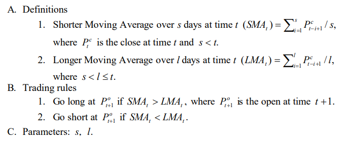
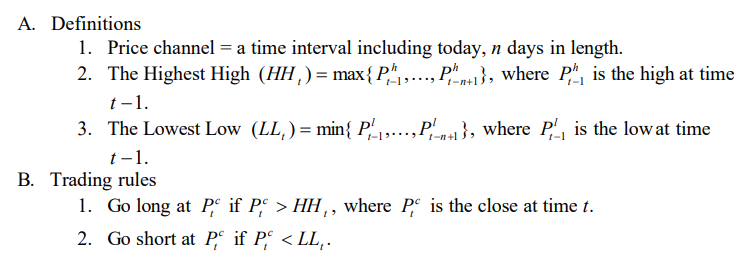
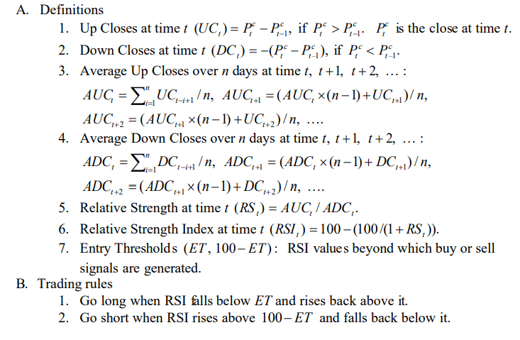
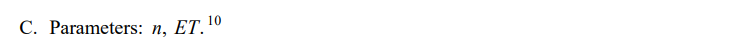
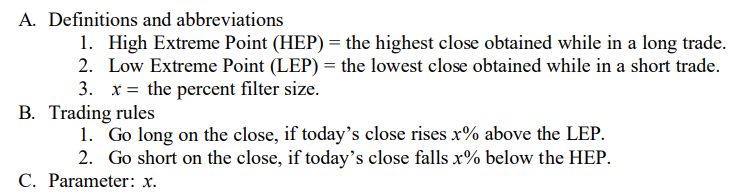

## Cheol-Ho Park and Scott H. Irwin. The Profitability of Technical Analysis: A Review (Part I)

[Cheol-Ho Park and Scott H. Irwin. The Profitability of Technical Analysis: A Review](https://deliverypdf.ssrn.com/delivery.php?ID=375091000096115105070123065070065124060087060080003065108005066109064099104072085073057037122017121015000004066065002084096107033086048020111118010016086071091030044127105024025064076092109009086127096065122093073030119024072012068121002002093&EXT=pdf&INDEX=TRUE)

**Technical Trading Systems**

- Dual Moving Average Crossover

>  Moving average based trading systems are the simplest and most popular trend-following systems among practitioners (Taylor and Allen 1992; Lui and Mole 1998). According to Neftci (1991), the (dual) moving average method is one of the few technical trading procedures that is statistically well defined. The Dual Moving Average Crossover system generates trading signals by identifying when the short-term trend rises above or below the long-term trend.
Specifications of the system are as follows:

- Outside Price Channel 

> Next to moving averages, price channels are also extensively used technical trading methods. The price channel is sometimes referred to as “trading range breakout” or “support and resistance.” The fundamental characteristic underlying price channel systems is that market movement to a new high or low suggests a continued trend in the direction established. Thus, all price channels generate trading signals based on a comparison between today’s price level with price levels of some specified number of days in the past. The Outside Price Channel system is analogous to a trading system introduced by Donchian (1960), who used only two preceding calendar week’s ranges as a channel length. More specifically, this system generates a buy signal anytime the closing price is outside (greater than) the highest price in a channel length (specified time interval), and generates a sell signal anytime the closing price breaks outside (lower than) the lowest price in the price channel. Specifications of the system are as follows:

- Relative Strength Index

> The Relative Strength Index, introduced by Wilder (1978), is one of the most well-known momentum oscillator systems. Momentum oscillator techniques derive their name from the fact that trading signals are obtained from values which “oscillate” above and below a neutral point, usually given a zero value. In a simple form, the momentum oscillator compares today’s price with the price of n-days ago. Wilder (1978, p. 63) explains the momentum oscillator as follows:

> The momentum oscillator measures the velocity of directional price movement. When the price moves up very rapidly, as some point it is considered to be overbought; when it moves down very rapidly, at some point it is considered to be oversold. In either case, a reaction or reversal is imminent.

> Momentum values are similar to standard moving averages, in that they can be regarded as smoothed price movements. However, since the momentum values generally decrease before a reverse in trend has taken place, momentum oscillators may identify a change in trend in advance, while moving averages usually cannot. 

> The Relative Strength Index was designed to overcome two problems encountered in developing meaningful momentum oscillators: (1) erroneous erratic movement, and (2) the need for an objective scale for the amplitude of oscillators.Specifications of the system are as follows:

- Alexander’s Filter Rule

> This system was first introduced by Alexander (1961, 1964) and exhaustively tested by numerous academics until the early 1990s. Since then, its popularity among academics has been replaced by moving average methods. This system generates a buy (sell) signal when today’s closing price rises (falls) by x% above (below) its most recent low (high). Moves less than x% in
either direction are ignored. Thus, all price movements smaller than a specified size are filtered out and the remaining movements are examined. Alexander (1961, p. 23) argued that “If stock price movements were generated by a trendless random walk, these filters could be expected to yield zero profits, or to vary from zero profits, both positively and negatively, in a random manner.” Specifications of the system are as follows:

