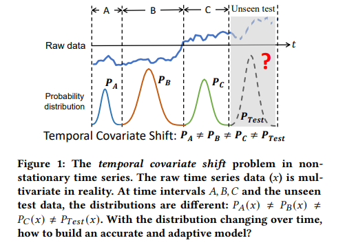

***

### Temporal covariate shift

10 Aug 2021 Yuntao Du, et al.[AdaRNN: Adaptive Learning and Forecasting of Time Series](https://paperswithcode.com/method/adarnn){:target="_blank"}

the statistical properties of a time series can vary with time, causing the distribution to change temporally, which is known as the distribution shift problem. ... Adaptive RNNs (AdaRNN) to tackle the Temporal Covariate Shift (TCS) problem. AdaRNN is sequentially composed of two modules. 

{:height="50%" width="50%"}

  -  The first module is referred to as Temporal Distribution Characterization, which aims to better characterize the distribution information in a time series. 
  -  The second module is termed as Temporal Distribution Matching, which aims to reduce the distribution mismatch in the time series to learnan RNN-based adaptive time series prediction model.
  
{:height="90%" width="90%"}

[PDF](https://arxiv.org/pdf/2108.04443v2.pdf){:target="_blank"}

