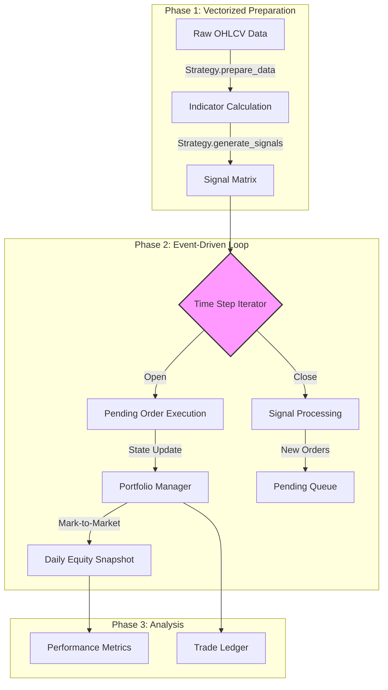

# Backtest Engine Architecture
{: .fs-7 }

A hybrid simulation environment combining vectorized signal generation with event-driven execution.
{: .fs-5 .fw-300 }

---

## System Abstract

The backtesting framework is designed to balance the computational efficiency of vectorized operations with the granular accuracy of event-driven systems. Unlike pure vectorized backtesters (which often suffer from look-ahead bias) or pure event-driven systems (which are computationally expensive), this engine separates **Signal Generation** from **Trade Execution**.

The core architecture adheres to **Functional Programming (FP)** principles:
*   **Immutability:** Core data structures (`Signal`, `Trade`, `Position`) are frozen dataclasses.
*   **Pure Functions:** Metric calculations and portfolio logic are stateless.
*   **Strict Causality:** The execution loop processes data sequentially to prevent future data leakage.

---

## Architectural Data Flow

The simulation pipeline proceeds in three distinct phases: **Preparation**, **Generation**, and **Execution**.



---

## Core Components

### 1. The Engine Kernel (`BacktestEngine`)
The engine serves as the orchestrator. It ingests a dictionary of DataFrames and a Strategy configuration.
*   **Data Ingestion:** Automatically handles multi-ticker alignment and empty datasets.
*   **Signal Processing:** Aggregates signals from all tickers into a single time-ordered queue.
*   **Execution Loop:** Iterates through unique timestamps. Crucially, it processes **Exits** before **Entries** within the same time step to manage capital recycling correctly.

### 2. Portfolio Management (`PortfolioManager`)
Capital allocation and state management are handled via functional logic rather than object-oriented mutation where possible.
*   **Allocation:** Supports equal-weight capital distribution across the ticker universe.
*   **Position Sizing:** Enforces constraints on maximum trade size and minimum viable capital.
*   **State:** The portfolio state is a dictionary containing `ticker_accounts`, `trades`, and `daily_values`, maintained dynamically during the loop.

### 3. Trade Executor (`TradeExecutor`)
This module handles the transition from **Signal** to **Trade**, applying realistic market frictions.
*   **Slippage Model:** Implements a dual-factor cost model:
    *   *Percentage:* Volatility-based cost ($$ P \times \text{pct} $$).
    *   *Fixed:* Square-root impact law ($$ \text{fixed} \times \sqrt{\text{quantity}} $$).
*   **Commission:** Applies percentage-based commission structures.
*   **Guardrails:** Prevents negative balances and rejects trades if costs exceed available capital.

### 4. Strategy Interface (`StrategyBase`)
Strategies are implemented as Abstract Base Classes (ABC) requiring two pure methods:
*   `prepare_data(df)`: Returns a new DataFrame with technical indicators appended.
*   `generate_signals(df)`: Returns a list of `Signal` objects based on vector logic (e.g., crossovers, threshold breaches).

---

## Data Models & Type Safety

To ensure simulation integrity, the system uses strictly typed `dataclasses`.

| Model | Mutability | Description |
| :--- | :--- | :--- |
| **Signal** | `frozen=True` | A directive to Buy/Sell generated by the strategy. Contains Ticker, Date, Type, and Price. |
| **Position** | `frozen=True` | A snapshot of current holding, including Entry Price and Size. |
| **Trade** | `frozen=True` | A permanent record of a completed transaction, including realized PnL and transaction costs. |
| **TradeConfig** | `mutable` | Global configuration defining Initial Capital, Slippage, and Commission rates. |

---

## Performance Metrics

The `metrics.py` module computes performance statistics post-simulation. These are calculated from the `daily_values` and `trades` ledger.

### Risk-Adjusted Returns
*   **Sharpe Ratio:** Annualized excess return normalized by standard deviation.
*   **Sortino Ratio:** Penalizes only downside volatility.
*   **Calmar Ratio:** Ratio of Total Return to Maximum Drawdown.

### Trade Statistics
*   **Expectancy:** Mathematical expected value per trade based on win rate and avg win/loss.
*   **Profit Factor:** Ratio of Gross Profit to Gross Loss.
*   **Volatility:** Annualized standard deviation of returns.

---

## Friction Modeling Specification

The engine simulates a "worse-than-reality" execution environment to ensure robustness.

$$
\text{Execution Price}_{Buy} = P_{market} + (P_{market} \times S_{pct}) + (S_{fixed} \times \sqrt{Q})
$$

$$
\text{Net PnL} = (N_{shares} \times \Delta P) - \text{Commission} - \text{Slippage Cost}
$$

*   **Slippage:** Applied to *both* entries and exits to penalize high-turnover strategies.
*   **Timing:** Entries are typically executed on the bar following the signal (Open execution) to strictly prevent look-ahead bias.
```