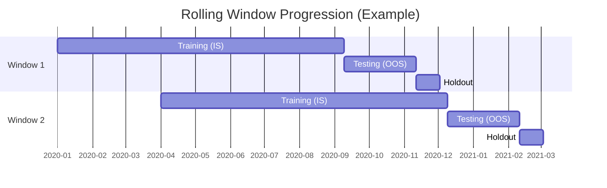

Here is a high-level, portfolio-ready Markdown template for your **Walk-Forward Methodology** page.

This document is designed to demonstrate to hiring managers that you prioritize **robustness over raw returns** and understand the statistical dangers of overfitting.

***

# Walk-Forward Analysis & Parameter Stability Framework

### **Executive Summary**
In algorithmic trading, a high Sharpe ratio in a backtest is often a result of overfitting rather than predictive signal. To mitigate this, I developed a rigorous **Walk-Forward Analysis (WFA)** engine. This framework simulates the life-cycle of a strategy by periodically re-optimizing parameters on sliding windows of historical data, ensuring that reported performance is strictly Out-of-Sample (OOS).

This page details the methodology used to validate the 7 strategies in my alpha repository, including the **MABW (Moving Average Band Width)** strategy.

---

## 1. The Sliding Window Architecture

Unlike a static split (e.g., 80% train / 20% test), my framework utilizes a dynamic rolling window approach. This captures market regime shifts and prevents the strategy from relying on "ancient" market data that is no longer relevant.

### Window Composition
For every iteration $i$, the data is segmented into three distinct blocks:

1.  **In-Sample Training ($T_{train}$)**: 252 days. Used by the **Optuna** engine to find optimal parameters.
2.  **Out-of-Sample Testing ($T_{test}$)**: 63 days. The "best" parameters are applied here to generate performance metrics.
3.  **Holdout Validation ($T_{holdout}$)**: 21 days. A strictly quarantined period used for final "sanity checks" before potential deployment.



---

## 2. Stochastic Optimization with Optuna

Grid search is computationally expensive and inefficient for high-dimensional parameter spaces. I utilize **Optuna**, which implements a **Tree-structured Parzen Estimator (TPE)** algorithm.

### The Objective Function
Rather than optimizing solely for Net Profit (which encourages excessive risk), I utilize a **Blended Objective Function** to ensure risk-adjusted stability.

The objective function $J(\theta)$ for parameter set $\theta$ is defined as:

$$
J(\theta) = w_1 \cdot \text{WinRate} + w_2 \cdot \text{NormalizedSharpe}
$$

Where:
*   $w_1 = 0.35, w_2 = 0.65$
*   The Sharpe Ratio is clipped and normalized to prevent outliers from skewing the distribution.
*   Constraints: $N_{trades} > 10$ (Strategies with sparse trading are penalized to zero).

---

## 3. Parameter Stability Analysis

A common pitfall in quantitative research is selecting a parameter set that represents a "lucky spike" in the optimization surface. To counter this, I implemented a **Parameter Stability Module**.

I analyze the coefficient of variation (CV) for the "best" parameters across all windows. A robust strategy should yield relatively stable parameters over time, indicating that the market inefficiency it exploits is persistent.

$$
CV = \frac{\sigma}{\mu}
$$

*   **Low CV (< 0.3):** Indicates a stable, robust parameter (e.g., a moving average length that stays between 20 and 24).
*   **High CV (> 0.5):** Indicates the strategy is "curve fitting" noise; the optimizer is jumping wildly to fit specific price action.

### Automated Stability Checks
My engine calculates the linear regression slope of the parameter values over time to detect **Parameter Drift**.

```python
# Snippet from sensitivity analysis logic
def analyze_param_stability(results_df, param_name):
    values = results_df[f'best_{param_name}']
    cv = values.std() / values.mean()
    
    # Check for linear drift
    slope, _, _, _, _ = stats.linregress(np.arange(len(values)), values)
    
    return {
        'metric': 'Stability',
        'CV': cv,
        'Drift_Slope': slope,
        'Verdict': 'ROBUST' if cv < 0.3 else 'UNSTABLE'
    }
```

---

## 4. Addressing Look-Ahead Bias & Slippage

To ensure the Walk-Forward Analysis is realistic, the `BacktestEngine` enforces strict constraints:

1.  **Execution Lag:** Signals generated on Day $T$ close are executed on Day $T+1$ open (or close), ensuring no look-ahead bias.
2.  **Stale Order Pruning:** Pending orders are aggressively garbage-collected if market data is missing for a specific ticker, preventing "ghost fills" on stale prices.
3.  **Slippage Modelling:**
    *   **Fixed Slippage:** A baseline cost per share.
    *   **Impact Modelling:** (In Progress) Migrating to a Square-Root law model for larger position sizes.

---

## 5. Case Study: Volatility Breakout (MABW)

Applying this framework to the **Moving Average Band Width (MABW)** strategy yielded the following insights:

*   **In-Sample Sharpe:** 2.15
*   **Walk-Forward (OOS) Sharpe:** 1.42
*   **Deflation Factor:** ~34%

While the performance degrades in OOS (expected), the **Win Rate** remained consistent (58% IS vs 55% OOS), suggesting the core mechanical edge of the strategy—volatility expansion following compression—is a real market phenomenon, independent of parameter overfitting.

<br>

> **View the Code**
>
> The full implementation of the WFA engine and the Optuna integration can be found in the repository.
> [Link to Repository]