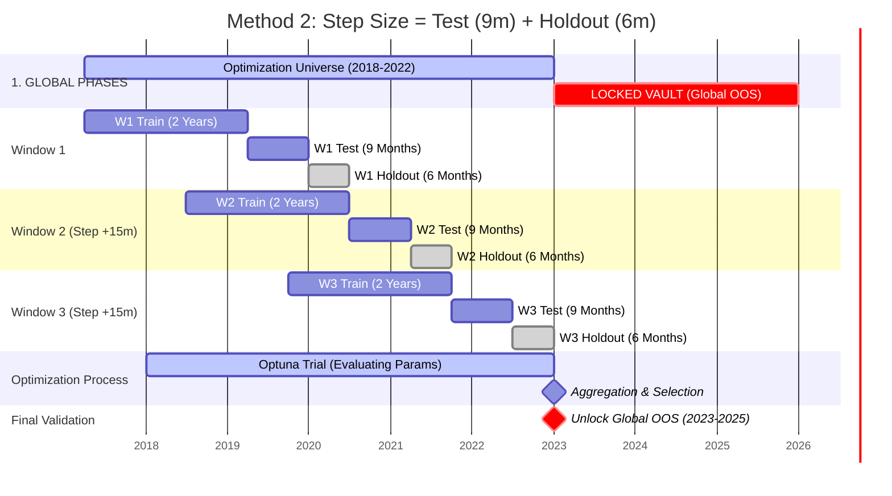
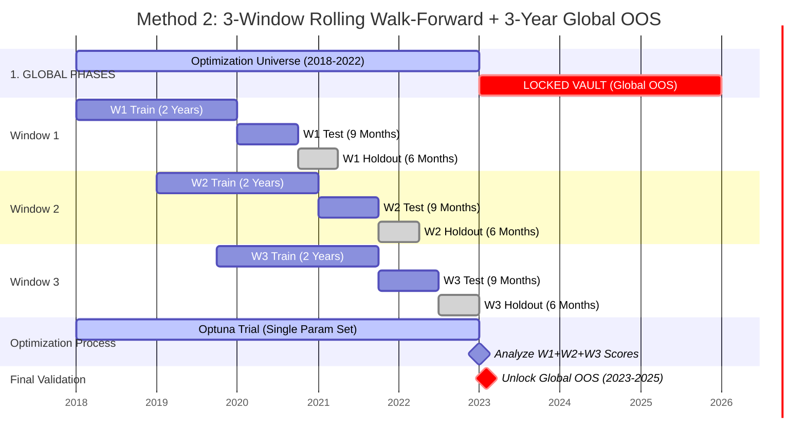

# Walk-Forward Analysis & Validation Methodology

## 1. Methodological Necessity

Standard backtesting practices often suffer from **in-sample overfitting**, where a strategy's parameters are tuned to maximize performance on the entire historical dataset. This process effectively "leaks" future information into the optimization phase, rendering the resulting metrics non-predictive of future performance.

To address this structural flaw, this framework utilizes **Walk-Forward Analysis (WFA)**. This protocol strictly separates the data used for parameter selection (In-Sample or IS) from the data used for performance validation (Out-of-Sample or OOS). The result is a simulation that closely approximates the epistemic constraints of live trading.

---

## 2. Window Architecture

The validation engine utilizes a **Rolling Window** approach. The historical timeline is segmented into a series of iterations, each consisting of a training period and a subsequent testing period.

### Temporal Segmentation

The dataset is divided into an **Optimization Universe (Ending 2022)** and a **Global Out-of-Sample Vault (2023–2025)**. Within the Optimization Universe, the strategy is validated across 3 rolling windows.

For each window iteration $$ i $$:

1.  **Training Window ($$ T_{train} $$):** A **2-year (24-month)** period used by the optimization engine (Optuna) to identify optimal parameters.
2.  **Testing Window ($$ T_{test} $$):** A **9-month** period immediately following $$ T_{train} $$. This segment is used to calculate **degradation metrics** (comparing In-Sample vs. Out-of-Sample performance) to filter out overfit trials.
3.  **Holdout Window ($$ T_{holdout} $$):** A **6-month** period immediately following $$ T_{test} $$. The performance in this "safe" segment is used to calculate the final **Objective Score**, ensuring the optimizer is rewarded for stability on unseen data.
4.  **Step Forward (15 Months):** The next window shifts forward by exactly $$ T_{test} + T_{holdout} $$. This creates a **contiguous chain of validation blocks** (Test + Holdout) spanning from mid-2019 to the end of 2022, ensuring no unseen period is double-counted in the validation score.

**Global Validation:**
Once a robust parameter set is identified across the 3 rolling windows, it is locked and applied to the **Global OOS Vault (2023–2025)**. This final step serves as the ultimate "sanity check," ensuring the strategy performs well on data completely untouched by the optimization process.

1.  **Blue Bars (Train):** Optuna uses this data to find patterns.
2.  **Purple Bars (Test):** Used to check for **Degradation**. If *Train* performance is great but *Test* performance drops > 50%, the parameter set is rejected (Overfitting).
3.  **Grey Bars (Internal Holdout):** The "Safe" score. This is used to calculate the final objective value for Optuna (e.g., the "Robust Score").
4.  **Red Bar (Global OOS):** The **Vault**. The script **never** touches this data until the very end. If the strategy works here, it is ready for deployment.

## 3. Optimization Logic

The framework employs **Tree-structured Parzen Estimators (TPE)** via the Optuna engine to navigate the high-dimensional parameter space.

### The Objective Function
To prevent the selection of volatile strategies that maximize total return at the expense of stability, the optimizer minimizes a **Conservative Score** rather than maximizing pure Net Profit.

The objective function $$ J(\theta) $$ for a parameter set $$ \theta $$ is defined as:

$$
J(\theta) = 0.7 \times (\mu_{Sharpe} - 0.5 \sigma_{Sharpe}) + 0.3 \times \min(Sharpe_{windows})
$$

Where:
*   $$ \mu_{Sharpe} $$ is the mean Sharpe ratio across training folds.
*   $$ \sigma_{Sharpe} $$ is the standard deviation, penalizing inconsistent performance.
*   $$ \min(Sharpe_{windows}) $$ ensures the strategy is viable even in its worst-case historical regime.

### Constraints
*   **Drawdown Penalty:** The score is heavily penalized if the Maximum Drawdown exceeds 25% in any single window.
*   **Statistical Significance:** Trial runs with fewer than 30 trades are rejected to avoid small-sample bias.

---

## 4. Robustness Metrics

The primary output of this framework is not the equity curve, but the **Degradation** and **Stability** metrics. These determine whether a strategy is fit for production.

### Performance Degradation
Degradation measures the "Optimization Tax"—the loss of performance when moving from the training set to the testing set. High degradation implies curve-fitting.

$$
\text{Degradation} = \frac{\text{Sharpe}_{IS} - \text{Sharpe}_{OOS}}{\text{Sharpe}_{IS}}
$$

| Degradation Range | Interpretation | Action |
|-------------------|----------------|--------|
| **< 10%** | Robust | High confidence in model generalizability. |
| **10% - 30%** | Acceptable | Standard friction expected in regime shifts. |
| **> 50%** | Overfitted | Model has memorized noise; rejected. |

### Parameter Stability Analysis
We analyze the **Coefficient of Variation (CV)** for optimal parameters across time. A robust strategy should rely on structural market properties (e.g., "Momentum exists over 3-6 months") rather than precise, fragile values (e.g., "Momentum exists exactly at 14.2 days").

$$
CV = \frac{\sigma_{param}}{\mu_{param}}
$$

*   **Stable ($$ CV < 0.15 $$):** Parameters cluster tightly, indicating a structural edge.
*   **Unstable ($$ CV > 0.25 $$):** Parameters drift significantly, suggesting the strategy is chasing transient noise.

---

## 5. Market Microstructure Modeling

To ensure the backtest is a realistic proxy for live execution, the engine incorporates strict friction modeling:

*   **Execution Lag:** Signals generated at the close of day $$ T $$ are executed at the Open of day $$ T+1 $$. This eliminates look-ahead bias.
*   **Transaction Costs:** A linear cost model ($$ 10 \text{bps} $$) is applied to all turnover to account for commissions and spread.
*   **Stale Data Pruning:** Orders are automatically cancelled if market data is missing for a specific timestamp, preventing "ghost fills" on stale quotes.

---

## 6. Holdout Validation

Following the Walk-Forward process, the final selected parameter configuration is tested on a **Holdout Dataset**. This data is strictly quarantined and is never exposed to the optimization engine.

Performance convergence between the **Walk-Forward Test Set** and the **Holdout Set** serves as the final confirmation of strategy validity. A significant divergence in the Holdout period indicates that the Walk-Forward process itself was implicitly tuned (a phenomenon known as "meta-overfitting"), and the strategy is discarded.

