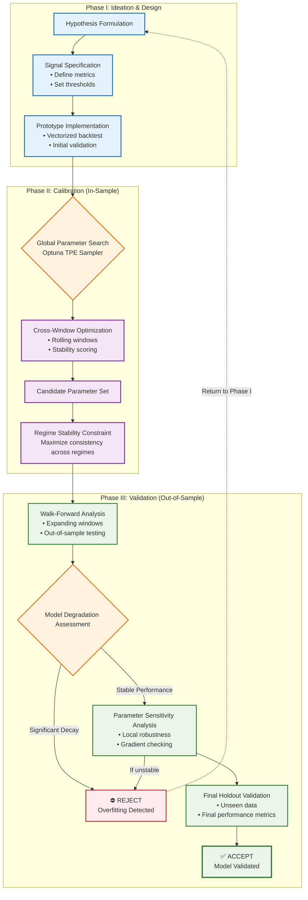

# Systematic Alpha Research Framework
{: .fs-7 }

A rigorous pipeline for the engineering, calibration, and stress-testing of systematic trading strategies.
{: .fs-5 .fw-300 }

[Github Repository](https://github.com/xxxxyyyy80008/systematic-trading-strategies){: .btn .btn-primary .fs-3 .mb-2 .mb-md-0}{:target="_blank" rel="noopener noreferrer"}
---

## Overview

This section documents the quantitative methodologies used to develop tradeable systematic strategies: constructing robust execution systems that can capture theoretical edges while withstanding market friction and regime shifts.

The research framework prioritizes **generalization** over raw performance. It employs a **Global Optimization** protocol designed to identify a single, stable parameter configuration that functions effectively across diverse historical periods, rather than overfitting parameters to specific market cycles.

---

## Infrastructure & Methodology

The reliability of these strategies relies on the integrity of the underlying validation engine.

### 1. [Walk-Forward Methodology](./framework/walkforward-analysis)
A detailed breakdown of the validation protocol.
*   **Global Robustness:** Searching for parameter sets that survive diverse market conditions.
*   **Degradation Analysis:** A quantitative check to reject strategies where $$ \text{Sharpe}_{IS} \gg \text{Sharpe}_{OOS} $$.

### 2. [Parameter Stability Analysis](./framework/parameter-stability)
Ensuring the strategy is not poised on a "knife-edge" of optimization.
*   **Sensitivity Mapping:** Verifying that small changes in inputs do not cause catastrophic failures in outputs.
*   **Convexity Check:** Prioritizing broad, flat regions of the solution space over narrow, high peaks.

### 3. [Backtest Engine Architecture](./framework/backtest-engine)
Technical documentation of the Python-based simulation engine.
*   **Hybrid Architecture:** Vectorized signal calculation for throughput ($$ O(1) $$) + Event-driven execution for path-dependent accuracy.
*   **Friction Modeling:** Implementation of slippage, commission, and stale-data pruning.

---

## Strategy Universe

The current portfolio of strategies, categorized by logic class and their validation status in the Walk-Forward framework.

### Adaptive & Momentum

| Strategy ID | Logic Class | Validation Status |Risk Profile |Script|
| :--- | :--- | :--- | :--- |:--- | 
| **[SMI Momentum](./strategies/smi/)** | Mean Reversion / Oscillator |  Very Robust (-19.4% Degradation)|  Moderate (High Win Rate) |[View Script](/notebooks/alpha-research/strategies/02-strategy-smi.html){:target="_blank" rel="noopener noreferrer"}|
| **[AMA-KAMA](./strategies/ama-kama/)** | Dual Adaptive Trend / Mean Reversion | Robust (35.66% Degradation) | Conservative  |[View Script](/notebooks/alpha-research/strategies/05-strategy-ama-kama.html){:target="_blank" rel="noopener noreferrer"}|

### Volatility Breakout

| Strategy ID | Logic Class | Validation Status |Risk Profile |Script|
| :--- | :--- | :--- | :--- |:--- |
| **[MABW](./strategies/mabw/)** | Volatility Expansion / Breakout | Rejected (100% Degradation) | Aggressive / Unstable |[View Script](/notebooks/alpha-research/strategies/01-strategy-mabw.html){:target="_blank" rel="noopener noreferrer"}|

---

## Strategy Research Pipeline

The development lifecycle adheres to an institutional-grade workflow, strictly separating the **Calibration Phase** (Signal Design & Optimization) from the **Validation Phase** (Walk-Forward & Stress Testing).

### Phase Details

1.  **Hypothesis & Design:** Strategies begin with a structural market premise (e.g., volatility clustering, mean reversion constraints). Signals are implemented using pure functions to ensure stateless reproducibility.
2.  **Global Parameter Search:** Instead of optimizing each window individually (which leads to curve-fitting), we search for a **single parameter set** that maximizes the robust objective function across *all* training windows simultaneously.
3.  **Walk-Forward Validation:** The candidate parameters are applied to unseen data. We measure **Performance Degradation**—the gap between In-Sample training results and Out-of-Sample test results—to quantify the strategy's "optimism bias."

---

### Tech Stack

*   **Language:** Python 3.10+
*   **Core Libraries:** Pandas, NumPy (Vectorization)
*   **Optimization:** Optuna (Tree-structured Parzen Estimator)
*   **Validation:** Custom Walk-Forward Engine
*   **Visualization:** Matplotlib, Seaborn
