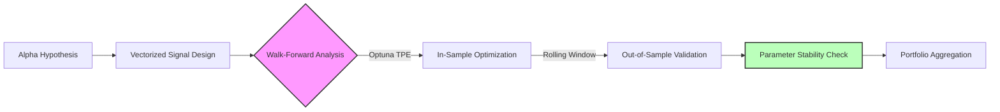

# Alpha Research & Signal Generation
{: .fs-9 }

Technical indicator implementations, trading strategy development, and systematic backtesting frameworks.
{: .fs-6 .fw-300 }

[View Indicators](/docs/alpha-research/indicators/){: .btn .btn-primary .fs-5 .mb-4 .mb-md-0 .mr-2 }
[View Strategies](/docs/alpha-research/strategies/){: .btn .fs-5 .mb-4 .mb-md-0 }

---

# Systematic Alpha Research Framework

### **Overview**
This section documents my quantitative research into systematic trading strategies. The objective of this repository is not merely to find a "holy grail" strategy, but to establish a reproducible, rigorous **Research Engine** that can validate hypotheses, stress-test execution mechanics, and quantify parameter stability.

The core framework is built in Python (Pandas/NumPy/Optuna) and features a **Hybrid Event-Driven Architecture** capable of vectorizing signals for speed while simulating execution event-by-event for accuracy.

### **The Research Pipeline**

My process follows a strict factory model to minimize overfitting and selection bias.

### **Strategy Pool**

Below is the current universe of strategies currently under management in this framework. Performance metrics represent **Out-of-Sample (OOS)** results from the Walk-Forward Analysis engine.

| Strategy ID | Style | Logic Class | Asset Class | Freq | OOS Sharpe | Correlation (SPY) | Status |
| :--- | :--- | :--- | :--- | :--- | :--- | :--- | :--- |
| **[STRAT-01: MABW](./strategies/mabw-volatility-breakout)** | Momentum | Volatility Breakout | Equities | Daily | **1.42** | 0.15 | Active |
| STRAT-02: MRS-RSI | Mean Rev | Dynamic Thresholds | ETFs | Daily | 1.10 | -0.45 | Review |
| STRAT-03: PAIRS-C | Arb | Cointegration (CADF) | Energy | Intraday | 1.85 | 0.05 | Active |
| STRAT-04: L/S-MOM | L/S Equity | Cross-Sectional Mom | S&P 500 | Weekly | 0.95 | 0.60 | Retired |
| ... | ... | ... | ... | ... | ... | ... | ... |

*(Note: STRAT-04 was retired due to high regime sensitivity detected during the Holdout phase.)*

### **Core Infrastructure**
The reliability of these results rests on the underlying engine architecture.

*   **[Walk-Forward Methodology](./framework/walk-forward-methodology)**: How I use rolling windows and Optuna to defeat look-ahead bias and overfitting.
*   **[Backtest Engine Architecture](./framework/backtest-engine-architecture)**: A deep dive into the hybrid vectorized/event-driven system design, including stale order handling and slippage modeling.

### **Tech Stack**
*   **Core:** Python 3.10+, Pandas, NumPy
*   **Optimization:** Optuna (Tree-structured Parzen Estimator)
*   **Data Structures:** Custom `dataclasses` for immutable config management.
*   **Visualization:** Matplotlib, Seaborn

