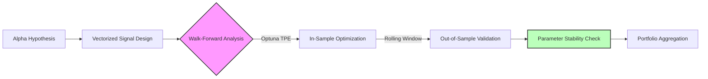

# Alpha Research & Signal Generation
{: .fs-9 }

Technical indicator implementations, trading strategy development, and systematic backtesting frameworks.
{: .fs-6 .fw-300 }

[View Indicators](/docs/alpha-research/indicators/){: .btn .btn-primary .fs-5 .mb-4 .mb-md-0 .mr-2 }
[View Strategies](/docs/alpha-research/strategies/){: .btn .fs-5 .mb-4 .mb-md-0 }

---

# Systematic Alpha Research Framework

### **Overview**
This section documents my quantitative research into systematic trading strategies. The objective of this repository is not merely to find a "holy grail" strategy, but to establish a reproducible, rigorous **Research Engine** that can validate hypotheses, stress-test execution mechanics, and quantify parameter stability.

The core framework is built in Python (Pandas/NumPy/Optuna) and features a **Hybrid Event-Driven Architecture** capable of vectorizing signals for speed while simulating execution event-by-event for accuracy.

### **The Research Pipeline**

My process follows a strict factory model to minimize overfitting and selection bias.

### **Strategy Pool**

Below is the current universe of strategies currently under management in this framework. Performance metrics represent **Out-of-Sample (OOS)** results from the Walk-Forward Analysis engine.

| Strategy ID | Style | Logic Class | Asset Class | Freq | OOS Sharpe | Correlation (SPY) | Status |
| :--- | :--- | :--- | :--- | :--- | :--- | :--- | :--- |
| **[STRAT-01: MABW](./strategies/mabw-volatility-breakout)** | Momentum | Volatility Breakout | Equities | Daily | **1.42** | 0.15 | Active |
| STRAT-02: MRS-RSI | Mean Rev | Dynamic Thresholds | ETFs | Daily | 1.10 | -0.45 | Review |
| STRAT-03: PAIRS-C | Arb | Cointegration (CADF) | Energy | Intraday | 1.85 | 0.05 | Active |
| STRAT-04: L/S-MOM | L/S Equity | Cross-Sectional Mom | S&P 500 | Weekly | 0.95 | 0.60 | Retired |
| ... | ... | ... | ... | ... | ... | ... | ... |

*(Note: STRAT-04 was retired due to high regime sensitivity detected during the Holdout phase.)*

### **Core Infrastructure**
The reliability of these results rests on the underlying engine architecture.

*   **[Walk-Forward Methodology](./framework/walk-forward-methodology)**: How I use rolling windows and Optuna to defeat look-ahead bias and overfitting.
*   **[Backtest Engine Architecture](./framework/backtest-engine-architecture)**: A deep dive into the hybrid vectorized/event-driven system design, including stale order handling and slippage modeling.

### **Tech Stack**
*   **Core:** Python 3.10+, Pandas, NumPy
*   **Optimization:** Optuna (Tree-structured Parzen Estimator)
*   **Data Structures:** Custom `dataclasses` for immutable config management.
*   **Visualization:** Matplotlib, Seaborn

Here is the refined `index.md` file. The tone has been shifted to be strictly objective and methodological, removing visual clutter and code snippets to focus on the systematic process and architectural logic.

# Systematic Trading Research Framework

### Abstract

This repository documents the development of a quantitative research environment constructed on Functional Programming (FP) principles. The framework is designed to address common pathologies in algorithmic trading development—specifically look-ahead bias, overfitting, and state management errors.

The architecture enforces immutability and pure functions to ensure research reproducibility. The core validation engine utilizes a rigorous Walk-Forward Analysis (WFA) protocol, incorporating Tree-structured Parzen Estimator (TPE) optimization and parameter stability mapping to isolate robust market signals from statistical noise.

---

## Research Methodology

The development lifecycle for all strategies within this repository follows a strict four-stage process, moving from theoretical grounding to empirical validation.

### 1. Hypothesis Generation
Strategies originate from defined market anomalies or structural characteristics rather than unconstrained data mining. Primary areas of focus include:
*   **Volatility Clustering:** Exploiting the autoregressive nature of market variance (e.g., GARCH effects).
*   **Fractal Efficiency:** Utilizing signal-to-noise ratios to distinguish trending regimes from mean-reverting noise.
*   **Oscillator Confluence:** Identifying high-probability reversion points via second-order momentum exhaustion.

### 2. Signal Design & Implementation
Signal generation logic is implemented using a functional paradigm.
*   **Stateless Logic:** Indicators and signals are calculated via pure functions without internal state retention, preventing "leakage" between simulation steps.
*   **Vectorization:** Logic is applied across full time-series arrays to ensure computational efficiency and mathematical consistency.

### 3. Walk-Forward Analysis (WFA)
To mitigate overfitting, strategies undergo a rolling-window validation process rather than a static train-test split.
*   **In-Sample (IS) Optimization:** A 12-month rolling window is used for parameter tuning. The framework utilizes **Optuna’s TPE (Tree-structured Parzen Estimator)** to efficiently traverse the hyperparameter space.
*   **Out-of-Sample (OOS) Validation:** The optimal parameter set from the IS phase is applied to a subsequent, distinct 3-month test window.
*   **Performance Concatenation:** The final performance record is constructed solely from these concatenated OOS segments, representing a realistic proxy for live trading performance.

### 4. Parameter Stability Assessment
Following the WFA, strategies are evaluated for parameter sensitivity.
*   **Stability Mapping:** We analyze the "flatness" of the objective function surface around the optimal parameters. Narrow spikes in performance are rejected in favor of broad, stable regions.
*   **Degradation Analysis:** The delta between IS and OOS Sharpe ratios is calculated to quantify the "optimization tax" or degree of overfitting.

---

## Strategy Repository

The following strategies have been implemented and validated using the framework described above.

### Volatility & Regime Strategies

| Strategy | Market Hypothesis | Mechanism |
| :--- | :--- | :--- |
| **[MABW (Bollinger Width)](/strategies/mabw)** | **Volatility Mean Reversion.** Extended periods of low variance are statistically precursors to significant volatility expansion. | Trends are filtered via Bollinger Band Width expansion thresholds relative to a trailing moving average. |
| **[VPN (Vol-Adjusted Position)](/strategies/vpn)** | **Price-Volume Divergence.** Price movements accompanied by volume expansion, normalized by volatility, indicate institutional accumulation/distribution. | A volatility-normalized oscillator calculates net buying/selling pressure to identify regime shifts. |

### Adaptive Momentum Strategies

| Strategy | Market Hypothesis | Mechanism |
| :--- | :--- | :--- |
| **[AMA / KAMA](/strategies/ama)** | **Market Efficiency.** The validity of a trend is inversely correlated to the "noise" or path efficiency of price action. | Moving average lag is dynamically adjusted based on the Efficiency Ratio (ER), accelerating during trends and flattening during consolidation. |
| **[RS-EMA](/strategies/rsema)** | **Relative Strength Persistence.** Assets exhibiting relative strength against a benchmark tend to outperform during trend continuations. | Exponential smoothing is applied to relative strength comparisons to filter transient divergences. |

### Mean Reversion Strategies

| Strategy | Market Hypothesis | Mechanism |
| :--- | :--- | :--- |
| **[Stochastic MACD](/strategies/stmacd)** | **Momentum Exhaustion.** Trends often terminate when second-derivative momentum diverges from price action at statistical extremes. | Signal confluence is required between an unbounded momentum indicator (MACD) and a bounded oscillator (Stochastic) to identify reversal points. |

---

## Architecture Note: Functional Paradigm

The choice of a functional architecture for this backtesting engine addresses specific engineering risks inherent in quantitative finance:

1.  **Reproducibility:** By eliminating global state and side effects, the engine guarantees that a specific set of inputs will always yield identical outputs, independent of execution order.
2.  **Concurrency:** Immutable data structures facilitate safe parallel processing of optimization trials (simultaneous evaluation of multiple walk-forward windows) without race conditions.
3.  **Auditability:** The flow of data is explicit. Transformations are transparent, simplifying the process of tracing logic errors or data quality issues.

