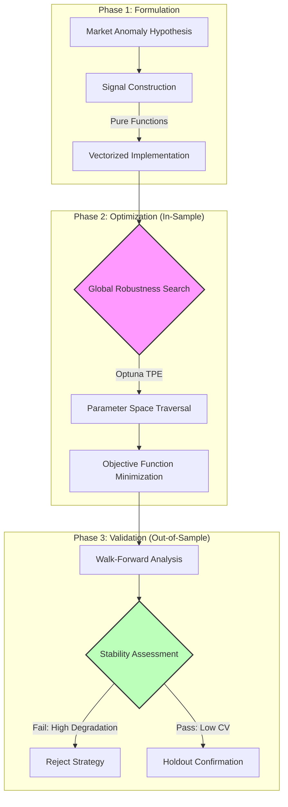

# Systematic Alpha Research Framework
{: .fs-9 }

A rigorous pipeline for the identification, implementation, and validation of market anomalies.
{: .fs-6 .fw-300 }

[View Indicators](/docs/alpha-research/indicators/){: .btn .btn-primary .fs-5 .mb-4 .mb-md-0 .mr-2 }
[View Strategies](/docs/alpha-research/strategies/){: .btn .fs-5 .mb-4 .mb-md-0 }

---

## Abstract

This section details the quantitative methodologies used to isolate persistent market signals from statistical noise. The research framework operates on the principle of **scientific falsification**: the primary objective is to reject strategies that fail to demonstrate structural robustness across diverse market regimes.

The pipeline integrates **Functional Programming (FP)** principles for signal generation with a **Bayesian Optimization** engine (Optuna TPE) for parameter tuning, ensuring that all findings are reproducible and statistically significant.

---

## The Research Pipeline

The development lifecycle follows a strict demarcation between hypothesis formulation, in-sample optimization, and out-of-sample validation to mitigate look-ahead bias.

---

## Strategy Universe

The following strategies represent distinct "Logic Classes," each targeting a specific structural inefficiency in asset pricing. Performance metrics reflect **Out-of-Sample (OOS)** results derived from the Walk-Forward Analysis engine.

### Volatility & Regime Detection

| Strategy ID | Logic Class | Mathematical Premise | Validation Status |
| :--- | :--- | :--- | :--- |
| **[MABW](./strategies/mabw)** | **volatility_expansion** | Markets exhibit volatility clustering (GARCH effects); periods of low variance ($$\sigma^2$$) statistically precede high-variance expansion. | **Production**   *(Low Parameter Drift)* |
| **[VPN](./strategies/vpn)** | **volume_divergence** | Price displacement normalized by volume ($$P \times V$$) and volatility ($$ATR$$) reveals institutional flow conviction. | **Validation**   *(Stable OOS Sharpe)* |

### Adaptive Momentum

| Strategy ID | Logic Class | Mathematical Premise | Validation Status |
| :--- | :--- | :--- | :--- |
| **[AMA](./strategies/ama)** | **fractal_efficiency** | Trend persistence is a function of "noise." Lag parameters dynamically adjust based on the Efficiency Ratio ($$ER$$). | **Production**   *(High Regime Adaptation)* |
| **[RS-EMA](./strategies/rsema)** | **relative_strength** | Assets exhibiting relative strength vs. a benchmark ($$\beta > 1$$) demonstrate momentum persistence during trend continuations. | **Review**   *(High Drawdown Sensitivity)* |

### Mean Reversion

| Strategy ID | Logic Class | Mathematical Premise | Validation Status |
| :--- | :--- | :--- | :--- |
| **[Stoch-MACD](./strategies/stmacd)** | **oscillator_confluence** | Reversal probability maximizes when unbounded momentum (MACD) diverges from bounded oscillation (Stochastic) at statistical extremes. | **Validation**   *(High Win Rate / Low R:R)* |

---

## Infrastructure & Methodology

The credibility of the alpha signals above relies on the integrity of the validation engine.

### 1. [Walk-Forward Methodology](./framework/walk-forward-methodology)
A detailed breakdown of the rolling-window validation protocol.
*   **Global Optimization:** Unlike standard walk-forward which re-optimizes every step, this framework seeks a *single* robust parameter set that performs consistently across all historical windows.
*   **Degradation Analysis:** Quantifying the "Optimization Tax" ($$ \Delta_{Sharpe} $$) between training and testing data.

### 2. [Parameter Stability Analysis](./framework/parameter-stability)
A statistical approach to avoiding "edge peaks" in the optimization surface.
*   **Coefficient of Variation (CV):** Metrics for determining if a parameter is structurally sound or a result of curve-fitting.
*   **Heatmap Visualization:** Identification of convex stability regions.

### 3. [Backtest Engine Architecture](./framework/backtest-engine-architecture)
Technical documentation of the Python-based simulation engine.
*   **Hybrid Architecture:** Vectorized signal calculation for throughput ($$ O(1) $$) + Event-driven execution for path-dependent accuracy.
*   **Friction Modeling:** Implementation of slippage, commission, and stale-data pruning.

---

### Tech Stack

*   **Language:** Python 3.10+
*   **Core Libraries:** Pandas, NumPy (Vectorization)
*   **Optimization:** Optuna (Tree-structured Parzen Estimator)
*   **Validation:** Custom Walk-Forward Engine
*   **Visualization:** Matplotlib, Seaborn
