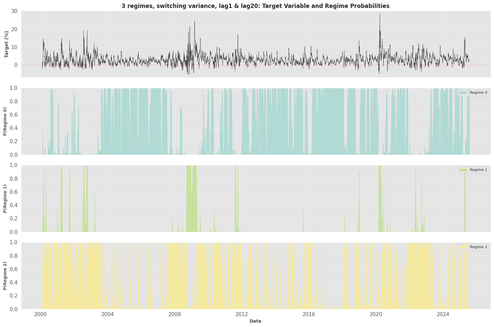
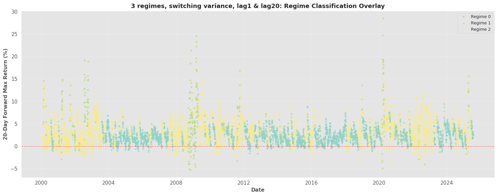

# Markov-Switching Regime Detection 

**Markov-switching dynamic regression** (Statsmodels `MarkovRegression`) models are fitted to detect **latent regimes** in a market-derived target series (S&P 500). 

Multiple specifications (different number of regimes, lag features, switching variance) are compared, and the best model is selected by **BIC**. From this model, insights are derived regarding the regimes persistence, transition dynamics, and regime-conditional behavior.

[View](/notebooks/regime-analysis/time-series/markov-switching.html){:target="_blank" rel="noopener noreferrer"} -  [Github](https://github.com/xxxxyyyy80008/time-series-analysis/tree/main/notebooks){:target="_blank" rel="noopener noreferrer"}

---

## Data & target construction

- Universe: S&P 500 index (`^GSPC`)
- Source: `yfinance`
- Sample downloaded: **6546** daily records from **2000-01-03** to **2026-01-12**
- Forward window: **20** trading days

### Forward 20-day max return target
For each date $$t$$ with close $$C_t$$:

$$
target_t = 100 \times \frac{\max(C_{t+1}, \dots, C_{t+20}) - C_t}{C_t}
$$

**Observed target statistics (after dropping tail NaNs):**
- Mean: **2.92%**
- Std: **2.73%**
- Range: **[-5.27%, 28.48%]**

### Lagged features
We build autoregressive inputs from the target:
- `lag1 = target_{t-1}`
- `lag20 = target_{t-20}`

Final modeling dataset: **6506** observations.

### Train/test split (time-based)
- Train: **6406** samples (**2000-02-01 → 2025-07-22**)
- Test: **100** samples (**2025-07-23 → 2025-12-11**)

---

## Model zoo (what we fit)

All models are estimated using `statsmodels.tsa.MarkovRegression` on the **training** set:

1. `2_regime`: 2 regimes, switching intercept  
2. `5_regime`: 5 regimes, switching intercept  
3. `3_regime_exog`: 3 regimes, switching intercept + exog (`lag1`, `lag20`)  
4. `3_regime_var`: 3 regimes, switching variance + exog (`lag20`)  
5. `3_regime_full`: 3 regimes, switching variance + exog (`lag1`, `lag20`)  

---

## Model comparison 

Lower AIC/BIC indicates better fit (with BIC penalizing complexity more strongly).

| Model | Description | K | Params | LogLik | AIC | BIC |
|---|---|---:|---:|---:|---:|---:|
| `3_regime_full` | 3 regimes, switching variance, lag1 & lag20 | 3 | 18 | -9137.95 | **18311.89** | **18433.66** |
| `3_regime_exog` | 3 regimes, switching intercept & exog (lag1, lag20) | 3 | 16 | -10240.30 | 20512.60 | 20620.84 |
| `5_regime` | 5 regimes, switching intercept | 5 | 26 | -11358.68 | 22769.37 | 22945.26 |
| `3_regime_var` | 3 regimes, switching variance, lag20 | 3 | 15 | -11771.77 | 23573.55 | 23675.02 |
| `2_regime` | 2 regimes, switching intercept | 2 | 5 | -13831.51 | 27673.02 | 27706.85 |

**Selected best model (lowest BIC):** `3_regime_full`

---

## Best model: `3_regime_full` 

**Specification**
- 3 regimes
- switching variance enabled
- exogenous regressors: `lag1`, `lag20`
- trend/intercept included

### Regime persistence (expected durations)
- Regime 0: **40.55 days**
- Regime 1: **16.11 days**
- Regime 2: **25.15 days**

### Transition probability matrix (smoothed estimates)

| From \ To | 0 | 1 | 2 |
|---:|---:|---:|---:|
| **0** | 0.9753 | 0.0003 | 0.0315 |
| **1** | 0.0000 | 0.9379 | 0.0083 |
| **2** | 0.0247 | 0.0617 | 0.9602 |

Interpretation (high level):
- Regime 0 and Regime 2 are **highly persistent** (diagonal near 0.96–0.98).
- Regime 1 is **rarer and shorter-lived**, with persistence ~0.94 and more frequent transitions out.

---

## Regime period statistics (training set)

Regimes are assigned via $$\arg\max_i P(S_t=i)$$ using smoothed marginal probabilities.

### Regime 0 (dominant, “low dispersion”)
- Frequency: **3428 days (53.5%)**
- Mean target: **2.248%**
- Std: **1.572%**
- Min/Max: **-1.706% / 9.420%**
- Longest streak: **343** consecutive days

### Regime 1 (rare, “high opportunity / high dispersion”)
- Frequency: **320 days (5.0%)**
- Mean target: **6.948%**
- Std: **5.925%**
- Min/Max: **-5.268% / 28.478%**
- Longest streak: **74** consecutive days

### Regime 2 (common, “medium dispersion”)
- Frequency: **2658 days (41.5%)**
- Mean target: **3.322%**
- Std: **2.837%**
- Min/Max: **-3.513% / 14.941%**
- Longest streak: **131** consecutive days

---

    
    ======================================================================
    MARKOV SWITCHING DYNAMIC REGRESSION ANALYSIS
    ======================================================================
    Downloading data for ^GSPC...
    Downloaded 6546 records from 2000-01-03 to 2026-01-12
    Calculated forward 20-day max return
    Target stats: mean=2.92%, std=2.73%
    Range: [-5.27%, 28.48%]
    Created lagged features: ['lag1', 'lag20']
    Final dataset size: 6506 observations
    Data Split:
    Training: 6406 samples (2000-02-01 to 2025-07-22)
    Testing: 100 samples (2025-07-23 to 2025-12-11)
    
    ======================================================================
    FITTING MARKOV SWITCHING MODELS
    ======================================================================
    
    [1/5] Fitting 2-regime model (switching intercept)...
    AIC: 27673.02, BIC: 27706.85
    
    [2/5] Fitting 5-regime model (switching intercept)...
    AIC: 22769.37, BIC: 22945.26
    
    [3/5] Fitting 3-regime model with lag features...
    AIC: 20512.60, BIC: 20620.84
    
    [4/5] Fitting 3-regime model with switching variance...
    AIC: 23573.55, BIC: 23675.02
    
    [5/5] Fitting comprehensive 3-regime model...
    AIC: 18311.89, BIC: 18433.66
    
    ======================================================================
    MODEL COMPARISON
    ======================================================================
            Model                                         Description  K_Regimes  N_Params  Log_Likelihood          AIC          BIC         HQIC
    3_regime_full         3 regimes, switching variance, lag1 & lag20          3        18    -9137.947100 18311.894201 18433.664027 18354.041756
    3_regime_exog 3 regimes, switching intercept & exog (lag1, lag20)          3        16   -10240.298946 20512.597891 20620.837737 20550.062385
         5_regime                      5 regimes, switching intercept          5        26   -11358.683365 22769.366730 22945.256478 22830.246531
     3_regime_var                3 regimes, switching variance, lag20          3        15   -11771.772696 23573.545393 23675.020248 23608.668355
         2_regime                      2 regimes, switching intercept          2         5   -13831.511662 27673.023324 27706.848275 27684.730978
    
    Lower AIC/BIC indicates better model fit
    
    ======================================================================
    BEST MODEL: 3_regime_full
    ======================================================================
                            Markov Switching Model Results                        
    ==============================================================================
    Dep. Variable:                 target   No. Observations:                 6406
    Model:               MarkovRegression   Log Likelihood               -9137.947
    Date:                Tue, 13 Jan 2026   AIC                          18311.894
    Time:                        08:01:47   BIC                          18433.664
    Sample:                             0   HQIC                         18354.042
                                   - 6406                                         
    Covariance Type:               approx                                         
                                 Regime 0 parameters                              
    ==============================================================================
                     coef    std err          z      P>|z|      [0.025      0.975]
    ------------------------------------------------------------------------------
    const          0.1733      0.027      6.438      0.000       0.121       0.226
    x1             0.8986      0.008    111.822      0.000       0.883       0.914
    x2            -0.0019      0.006     -0.290      0.772      -0.014       0.011
    sigma2         0.3700      0.017     21.965      0.000       0.337       0.403
                                 Regime 1 parameters                              
    ==============================================================================
                     coef    std err          z      P>|z|      [0.025      0.975]
    ------------------------------------------------------------------------------
    const          1.6765      0.462      3.629      0.000       0.771       2.582
    x1             0.7863      0.041     19.089      0.000       0.706       0.867
    x2            -0.0150      0.039     -0.387      0.699      -0.091       0.061
    sigma2        12.9299      1.883      6.868      0.000       9.240      16.620
                                 Regime 2 parameters                              
    ==============================================================================
                     coef    std err          z      P>|z|      [0.025      0.975]
    ------------------------------------------------------------------------------
    const          0.5306      0.053      9.986      0.000       0.426       0.635
    x1             0.8607      0.011     78.397      0.000       0.839       0.882
    x2            -0.0106      0.010     -1.098      0.272      -0.030       0.008
    sigma2         1.8866      0.165     11.414      0.000       1.563       2.211
                             Regime transition parameters                         
    ==============================================================================
                     coef    std err          z      P>|z|      [0.025      0.975]
    ------------------------------------------------------------------------------
    p[0->0]        0.9753      0.004    252.383      0.000       0.968       0.983
    p[1->0]        0.0003      0.034      0.009      0.992      -0.067       0.068
    p[2->0]        0.0315      0.005      6.662      0.000       0.022       0.041
    p[0->1]     1.933e-06      0.003      0.001      0.999      -0.005       0.005
    p[1->1]        0.9379      0.027     35.374      0.000       0.886       0.990
    p[2->1]        0.0083      0.003      3.074      0.002       0.003       0.014
    ==============================================================================
    
    Warnings:
    [1] Covariance matrix calculated using numerical (complex-step) differentiation.
    
    ======================================================================
    REGIME ANALYSIS: 3 regimes, switching variance, lag1 & lag20
    ======================================================================
    
    Expected Regime Durations:
    Regime 0: 40.55 days (0.16 years)
    Regime 1: 16.11 days (0.06 years)
    Regime 2: 25.15 days (0.10 years)
    
    Regime Mean Returns:
    
    Transition Probability Matrix:
              To_0    To_1    To_2
    From_0  0.9753  0.0003  0.0315
    From_1  0.0000  0.9379  0.0083
    From_2  0.0247  0.0617  0.9602
    
    ======================================================================
    REGIME PERIOD STATISTICS
    ======================================================================
    
    Regime 0:
    Frequency: 3428 days (53.5%)
    Mean return: 2.248%
    Std dev: 1.572%
    Min: -1.706%
    Max: 9.420%
    Longest period: 343 consecutive days
    
    Regime 1:
    Frequency: 320 days (5.0%)
    Mean return: 6.948%
    Std dev: 5.925%
    Min: -5.268%
    Max: 28.478%
    Longest period: 74 consecutive days
    
    Regime 2:
    Frequency: 2658 days (41.5%)
    Mean return: 3.322%
    Std dev: 2.837%
    Min: -3.513%
    Max: 14.941%
    Longest period: 131 consecutive days
    
    Generating visualizations...
    Saved: markov_regime_probabilities.png
    Saved: markov_regime_overlay.png

## Caveats
- This pipeline fits regimes on a **forward-looking** target (20-day forward max return).
- Score/regime labels are **model-dependent**: “Regime 1” here means the regime with the estimated characteristics above (rare + high dispersion), not a universal mapping.
- The best model was selected by **in-sample BIC** on the training period.

---

