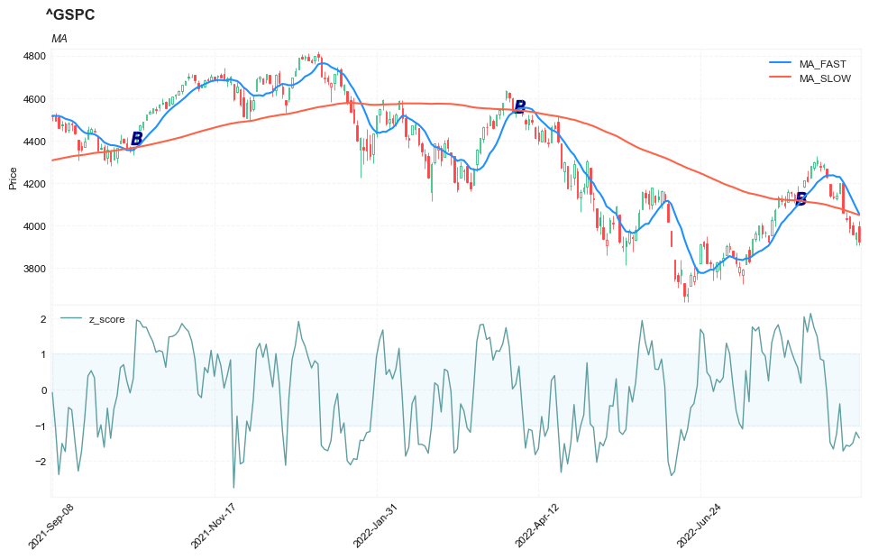

## Backtesting A Mean-Reversion Strategy In Python

**References**


- [traders.com: TradersTips 2019-05](https://traders.com/documentation/feedbk_docs/2019/05/traderstips.html)


**█ OVERVIEW**


For this month’s Traders’ Tips, the focus is Anthony Garner’s article in this issue, “Backtesting A Mean-Reversion Strategy In Python.” Here, we present the May 2019 Traders’ Tips code with possible implementations in various software.

In “Backtesting A Mean-Reversion Strategy In Python” in this issue, author Anthony Garner introduces a strategy based on the concept of buying an oversold asset and selling an overbought asset. To quantify this, he uses the classic z-score calculation. In addition, he adds a component to evaluate the existing trend as well as position sizing to allow for reinvestment.

Here is TradeStation EasyLanguage code for an indicator and strategy based on the author’s concepts. We also included a function for calculating the z-score that can be used in your own code.

**█ STRATEGY**

- trade setup
    - starting pricinpal: 10000
    - min trade size: 100
    - max trade size: 10000
- signal setup
    - calculate the z-score of period = 10
    - calculate ma_fast of period = 10
    - calculate ma_slow of period = 100
    - Trade at the next day of ENTER/EXIT signal    
    - BUY signal: z-score < -1 AND ma_fast > ma_slow
        - SELL: z-score > -0.5
    - SELL SHORT signal: z-score > 1 AND ma_fast < ma_slow
        - BUY to COVER: z-score < 0.5
    - ma_fast crosses over ma_slow: BUY to COVER
    - ma_fast crosses under ma)slow: SELL


##### Load basic packages 


```python
import pandas as pd
import numpy as np
import os
import gc
import copy
from pathlib import Path
from datetime import datetime, timedelta, time, date
```


```python
#this package is to download equity price data from yahoo finance
#the source code of this package can be found here: https://github.com/ranaroussi/yfinance/blob/main
import yfinance as yf
```


```python
pd.options.display.max_rows = 100
pd.options.display.max_columns = 100

import warnings
warnings.filterwarnings("ignore")

import pytorch_lightning as pl
random_seed=1234
pl.seed_everything(random_seed)
```

    Global seed set to 1234
    


    1234


##### Download data


```python
#S&P 500 (^GSPC),  Dow Jones Industrial Average (^DJI), NASDAQ Composite (^IXIC)
#Russell 2000 (^RUT), Crude Oil Nov 21 (CL=F), Gold Dec 21 (GC=F)
#Treasury Yield 10 Years (^TNX)
#CBOE Volatility Index (^VIX) Chicago Options - Chicago Options Delayed Price. Currency in USD

#benchmark_tickers = ['^GSPC', '^DJI', '^IXIC', '^RUT',  'CL=F', 'GC=F', '^TNX']

benchmark_tickers = ['^GSPC', '^VIX']
tickers = benchmark_tickers + ['GSK', 'BST', 'PFE']
```


```python
#https://github.com/ranaroussi/yfinance/blob/main/yfinance/base.py
#     def history(self, period="1mo", interval="1d",
#                 start=None, end=None, prepost=False, actions=True,
#                 auto_adjust=True, back_adjust=False,
#                 proxy=None, rounding=False, tz=None, timeout=None, **kwargs):

dfs = {}

for ticker in tickers:
    cur_data = yf.Ticker(ticker)
    hist = cur_data.history(period="max", start='2000-01-01')
    print(datetime.now(), ticker, hist.shape, hist.index.min(), hist.index.max())
    dfs[ticker] = hist
```

    2022-09-04 18:54:52.134508 ^GSPC (5706, 7) 1999-12-31 00:00:00 2022-09-02 00:00:00
    2022-09-04 18:54:52.509531 ^VIX (5706, 7) 1999-12-31 00:00:00 2022-09-02 00:00:00
    2022-09-04 18:54:52.889206 GSK (5706, 7) 1999-12-31 00:00:00 2022-09-02 00:00:00
    2022-09-04 18:54:53.195667 BST (1976, 7) 2014-10-29 00:00:00 2022-09-02 00:00:00
    2022-09-04 18:54:53.639234 PFE (5706, 7) 1999-12-31 00:00:00 2022-09-02 00:00:00
    


```python
ticker = '^GSPC'
# ticker = 'PFE'
dfs[ticker].tail(5)
```


<div>
<style scoped>
    .dataframe tbody tr th:only-of-type {
        vertical-align: middle;
    }

    .dataframe tbody tr th {
        vertical-align: top;
    }

    .dataframe thead th {
        text-align: right;
    }
</style>
<table border="1" class="dataframe">
  <thead>
    <tr style="text-align: right;">
      <th></th>
      <th>Open</th>
      <th>High</th>
      <th>Low</th>
      <th>Close</th>
      <th>Volume</th>
      <th>Dividends</th>
      <th>Stock Splits</th>
    </tr>
    <tr>
      <th>Date</th>
      <th></th>
      <th></th>
      <th></th>
      <th></th>
      <th></th>
      <th></th>
      <th></th>
    </tr>
  </thead>
  <tbody>
    <tr>
      <th>2022-08-29</th>
      <td>4034.580078</td>
      <td>4062.989990</td>
      <td>4017.419922</td>
      <td>4030.610107</td>
      <td>2963020000</td>
      <td>0</td>
      <td>0</td>
    </tr>
    <tr>
      <th>2022-08-30</th>
      <td>4041.250000</td>
      <td>4044.979980</td>
      <td>3965.209961</td>
      <td>3986.159912</td>
      <td>3190580000</td>
      <td>0</td>
      <td>0</td>
    </tr>
    <tr>
      <th>2022-08-31</th>
      <td>4000.669922</td>
      <td>4015.370117</td>
      <td>3954.530029</td>
      <td>3955.000000</td>
      <td>3797860000</td>
      <td>0</td>
      <td>0</td>
    </tr>
    <tr>
      <th>2022-09-01</th>
      <td>3936.729980</td>
      <td>3970.229980</td>
      <td>3903.649902</td>
      <td>3966.850098</td>
      <td>3754570000</td>
      <td>0</td>
      <td>0</td>
    </tr>
    <tr>
      <th>2022-09-02</th>
      <td>3994.659912</td>
      <td>4018.429932</td>
      <td>3906.209961</td>
      <td>3924.260010</td>
      <td>4134920000</td>
      <td>0</td>
      <td>0</td>
    </tr>
  </tbody>
</table>
</div>


##### Calculate the technical indicators


```python
def _zscore(_data, _len):
    roll_ = _data.rolling(window=_len, min_periods = _len)
    z_ = (_data - roll_.mean())/roll_.std()
    return z_
```


```python
from core.finta import TA
```


```python
z_period = 10
fast_period = 10
slow_period = 100
```


```python
help(TA.SMA)
```

    Help on function SMA in module core.finta:
    
    SMA(ohlc: pandas.core.frame.DataFrame, period: int = 41, column: str = 'close') -> pandas.core.series.Series
        Simple moving average - rolling mean in pandas lingo. Also known as 'MA'.
        The simple moving average (SMA) is the most basic of the moving averages used for trading.
    
    


```python
df = dfs[ticker][['Open', 'High', 'Low', 'Close', 'Volume']]
df = df.round(2)
```


```python
df_ta = TA.SMA(df, period = fast_period, column="close")
df_ta.name='MA_FAST'
df = df.merge(df_ta, left_index = True, right_index = True, how='inner' )

df_ta = TA.SMA(df, period = slow_period, column="close")
df_ta.name='MA_SLOW'
df = df.merge(df_ta, left_index = True, right_index = True, how='inner' )

del df_ta
gc.collect()
```


    38


```python
df['z_score'] = _zscore(df['Close'], z_period)
```


```python
display(df.head(5))
display(df.tail(5))
```


<div>
<style scoped>
    .dataframe tbody tr th:only-of-type {
        vertical-align: middle;
    }

    .dataframe tbody tr th {
        vertical-align: top;
    }

    .dataframe thead th {
        text-align: right;
    }
</style>
<table border="1" class="dataframe">
  <thead>
    <tr style="text-align: right;">
      <th></th>
      <th>Open</th>
      <th>High</th>
      <th>Low</th>
      <th>Close</th>
      <th>Volume</th>
      <th>MA_FAST</th>
      <th>MA_SLOW</th>
      <th>z_score</th>
    </tr>
    <tr>
      <th>Date</th>
      <th></th>
      <th></th>
      <th></th>
      <th></th>
      <th></th>
      <th></th>
      <th></th>
      <th></th>
    </tr>
  </thead>
  <tbody>
    <tr>
      <th>1999-12-31</th>
      <td>1464.47</td>
      <td>1472.42</td>
      <td>1458.19</td>
      <td>1469.25</td>
      <td>374050000</td>
      <td>NaN</td>
      <td>NaN</td>
      <td>NaN</td>
    </tr>
    <tr>
      <th>2000-01-03</th>
      <td>1469.25</td>
      <td>1478.00</td>
      <td>1438.36</td>
      <td>1455.22</td>
      <td>931800000</td>
      <td>NaN</td>
      <td>NaN</td>
      <td>NaN</td>
    </tr>
    <tr>
      <th>2000-01-04</th>
      <td>1455.22</td>
      <td>1455.22</td>
      <td>1397.43</td>
      <td>1399.42</td>
      <td>1009000000</td>
      <td>NaN</td>
      <td>NaN</td>
      <td>NaN</td>
    </tr>
    <tr>
      <th>2000-01-05</th>
      <td>1399.42</td>
      <td>1413.27</td>
      <td>1377.68</td>
      <td>1402.11</td>
      <td>1085500000</td>
      <td>NaN</td>
      <td>NaN</td>
      <td>NaN</td>
    </tr>
    <tr>
      <th>2000-01-06</th>
      <td>1402.11</td>
      <td>1411.90</td>
      <td>1392.10</td>
      <td>1403.45</td>
      <td>1092300000</td>
      <td>NaN</td>
      <td>NaN</td>
      <td>NaN</td>
    </tr>
  </tbody>
</table>
</div>


<div>
<style scoped>
    .dataframe tbody tr th:only-of-type {
        vertical-align: middle;
    }

    .dataframe tbody tr th {
        vertical-align: top;
    }

    .dataframe thead th {
        text-align: right;
    }
</style>
<table border="1" class="dataframe">
  <thead>
    <tr style="text-align: right;">
      <th></th>
      <th>Open</th>
      <th>High</th>
      <th>Low</th>
      <th>Close</th>
      <th>Volume</th>
      <th>MA_FAST</th>
      <th>MA_SLOW</th>
      <th>z_score</th>
    </tr>
    <tr>
      <th>Date</th>
      <th></th>
      <th></th>
      <th></th>
      <th></th>
      <th></th>
      <th></th>
      <th></th>
      <th></th>
    </tr>
  </thead>
  <tbody>
    <tr>
      <th>2022-08-29</th>
      <td>4034.58</td>
      <td>4062.99</td>
      <td>4017.42</td>
      <td>4030.61</td>
      <td>2963020000</td>
      <td>4178.634</td>
      <td>4068.3812</td>
      <td>-1.558438</td>
    </tr>
    <tr>
      <th>2022-08-30</th>
      <td>4041.25</td>
      <td>4044.98</td>
      <td>3965.21</td>
      <td>3986.16</td>
      <td>3190580000</td>
      <td>4146.730</td>
      <td>4063.4313</td>
      <td>-1.587777</td>
    </tr>
    <tr>
      <th>2022-08-31</th>
      <td>4000.67</td>
      <td>4015.37</td>
      <td>3954.53</td>
      <td>3955.00</td>
      <td>3797860000</td>
      <td>4114.826</td>
      <td>4057.9792</td>
      <td>-1.498243</td>
    </tr>
    <tr>
      <th>2022-09-01</th>
      <td>3936.73</td>
      <td>3970.23</td>
      <td>3903.65</td>
      <td>3966.85</td>
      <td>3754570000</td>
      <td>4083.137</td>
      <td>4052.7649</td>
      <td>-1.191407</td>
    </tr>
    <tr>
      <th>2022-09-02</th>
      <td>3994.66</td>
      <td>4018.43</td>
      <td>3906.21</td>
      <td>3924.26</td>
      <td>4134920000</td>
      <td>4052.715</td>
      <td>4047.8822</td>
      <td>-1.357369</td>
    </tr>
  </tbody>
</table>
</div>


##### Find signals

    - BUY signal: z-score < -1 AND ma_fast > ma_slow
        - SELL: z-score > -0.5
    - SELL SHORT signal: z-score > 1 AND ma_fast < ma_slow
        - BUY to COVER: z-score < 0.5
    - ma_fast crosses over ma_slow: BUY to COVER
    - ma_fast crosses under ma_slow: SELL


```python
df.dropna(how='any', inplace=True)
```


```python
#1: BUY signal: z-score < -1 AND ma_fast > ma_slow
#2: ma_fast crosses over ma_slow: BUY to COVER
#-1: SELL SHORT signal: z-score > 1 AND ma_fast < ma_slow
#-2: ma_fast crosses under ma_slow: SELL
enter_zscore = 1
exit_zscore = 0.5

signals = [0]
for i in range(1, df.shape[0]):
    row = df.iloc[i]
    z_ = row['z_score']
    ma_f = row['MA_FAST']
    ma_s = row['MA_SLOW']
    
    row_j = df.iloc[i-1]
    pre_ma_f = row_j['MA_FAST']
    pre_ma_s = row_j['MA_SLOW']
     
    s_ = 0
    if (z_ < -enter_zscore) & (ma_f > ma_s):
        s_ = 1
    elif (z_ > enter_zscore) & (ma_f < ma_s):
        s_ = -1
    elif (pre_ma_f < pre_ma_s) & (ma_f >= ma_s):
        s_ = 2
    elif (pre_ma_f > pre_ma_s) & (ma_f <= ma_s):
        s_ = -2
    
    signals.append(s_)
    
df['SIGNAL'] = signals
```

##### Visual


```python
df['SIGNAL'].value_counts()
```


     0    4380
     1     690
    -1     460
     2      39
    -2      38
    Name: SIGNAL, dtype: int64


```python
df['B1'] = (df['SIGNAL']==1).astype(int)*(df['High'] + df['Low'])/2
df['B2'] = (df['SIGNAL']==2).astype(int)*(df['High'] + df['Low'])/2
df['S1'] = (df['SIGNAL']==-1).astype(int)*(df['High'] + df['Low'])/2
df['S2'] = (df['SIGNAL']==-2).astype(int)*(df['High'] + df['Low'])/2
```


```python
from core.visuals import *
```


```python
start = -250
end = df.shape[0]

names = {'main_title': f'{ticker}'}
```


```python
lines0 = basic_lines(df.iloc[start:end][['MA_FAST', 'MA_SLOW']], 
                     colors = [], 
                     **dict(panel=0, width=1.5, secondary_y=False))

lines1 = basic_lines(df.iloc[start:end][['z_score']], 
                     colors = ['cadetblue'], 
                     **dict(panel=1, width=1, secondary_y=False))

lines2 = basic_lines(df.iloc[start:end][[ 'B2']],
                     colors = ['navy'], 
                     **dict(panel=0, type='scatter', marker=r'${B}$' , markersize=100, secondary_y=False))


lines_ = dict(**lines0, **lines1)
lines_.update(lines2)

shadows_ = basic_shadows(bands=[-1, 1], nsamples=df.iloc[start:end].shape[0], **dict(panel=1, color="lightskyblue",alpha=0.1,interpolate=True))

fig_config_ = dict(figratio=(18,10), volume=False, volume_panel=2,panel_ratios=(4,3), tight_layout=True, returnfig=True,)

ax_cfg_ = {0:dict(basic=[4, 2, ['MA_FAST', 'MA_SLOW']], 
                 title=dict(label = 'MA', fontsize=9, style='italic',  loc='left'), 
                ),
           2:dict(basic=[1, 0, ['z_score',]]
                ),
          }


names = {'main_title': f'{ticker}'}

aa_, bb_ = make_panels(main_data = df.iloc[start:end][['Open', 'High', 'Low', 'Close', 'Volume']], 
                       added_plots = lines_,
                       fill_betweens = shadows_, 
                       fig_config = fig_config_, 
                       axes_config = ax_cfg_,  
                       names = names)
```


    

    


##### Simulate


```python
TRADE_CONFIG = dict(InitialCapital = 10000 ,
                    LeverageToUse =  2 ,
                    MinTradeSize = 100 ,
                    MaxTradeSize = 1000 
                   ) 
```
