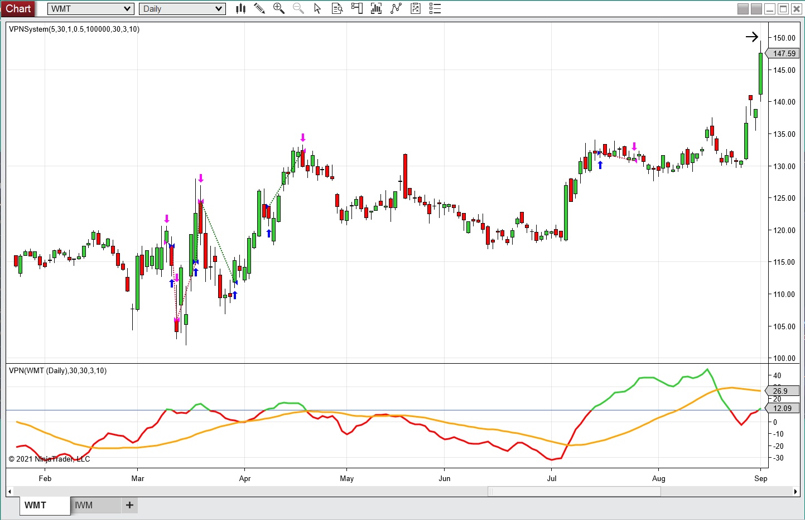
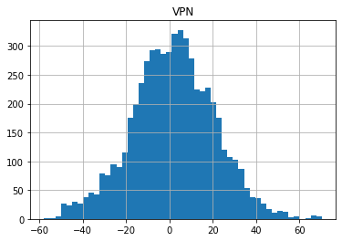
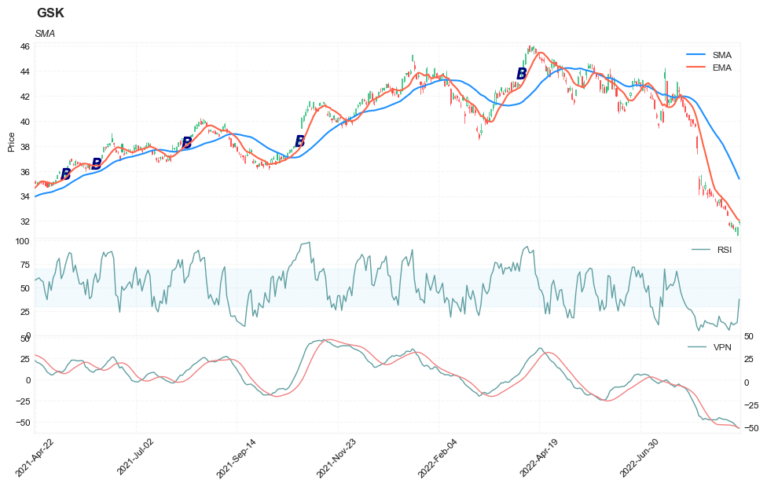
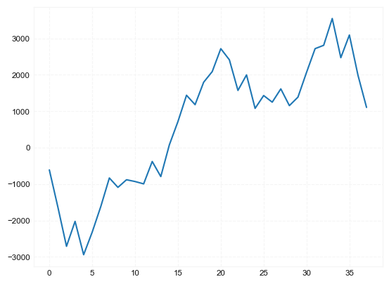

## Detecting High-Volume Breakouts: volume positive negative (VPN)

**References**


- [traders.com: TradersTips 2021-04](https://traders.com/Documentation/FEEDbk_docs/2021/04/TradersTips.html)


**█ OVERVIEW**

For this month’s Traders’ Tips, the focus is Markos Katsanos’ article in this issue, “Detecting High-Volume Breakouts.” Here, we present the April 2021 Traders’ Tips code with possible implementations in various software.


In his article in this issue, “Detecting High-Volume Breakouts,” author Markos Katsanos introduces an indicator called volume positive negative (VPN) that attempts to minimize entries in false breakouts. The indicator compares volume on “up” days versus the volume on “down” days and is normalized to oscillate between 100 and -100. 


**█ STRATEGY**


The trading strategy:

setups:
- calculate VPN using period = 30, ema_period = 3
- calculate RSI using close price and period = 5

- BUY at the next day open when:
    - VPN > 10 AND
    - RSI < max RSI AND
    - close > average of close in period = 
    
- SELL at the next day open when:
    - VPN crosses under MA_VPN AND
    - Close < Highest( Close, 5 )- 3 * AvgTrueRange( Period ) 


---
    Strategy:  TASC APR 2021 Strategy
    // TASC APR 2021
    // Detecting High-Volume Breakouts
    // Markos Katsanos

    inputs:
        Period( 30 ),
        Smooth( 3 ),
        VPNCrit( 10 ),
        MAB( 30 ),
        RSILen( 5 ),
        MinC( 1 ),
        MinVol( 100000 ),
        MinVolAvgLen( 5 ),
        VolAvgLen( 50 ),
        MinVC( 0.5 ),
        BarToExitOn( 15 ),
        VolDivisor( 1000000 ),
        RSIMaxVal( 90 );

    variables:
        VPN( 0 ),
        MAVPN( 0 ),
        RSIVal( 0 ),
        LQD( false ),
        BuyCond1( false );

    VPN = XAverage( _TASC_2021_APR_Fx( Period ), Smooth );
    MAVPN = Average( VPN, MAB );
    RSIVal = RSI( Close, RSILen );

    switch ( BarType )
    begin
        case 2,3,4: { Daily, Weekly, or Monthly bars }
            // Price, Volume and Liquidity Filter
            LQD = Close > MinC 
             and Average( Volume, MinVolAvgLen ) > MinVol 
             and Average( Close * Volume, MinVolAvgLen ) 
              / VolDivisor > MinVC;

            // buy conditions
            BuyCond1 = LQD and 
             Average( Volume, VolAvgLen ) > 
              Average( Volume, VolAvgLen )[50];

        default: { all other bars }
            // Price, Volume and Liquidity Filter
            LQD = Close > MinC 
             and Average( Ticks, MinVolAvgLen ) > MinVol 
             and Average( Close * Ticks, MinVolAvgLen )
              / VolDivisor > MinVC;

            // buy conditions
            BuyCond1 = LQD and 
             Average( Ticks, VolAvgLen ) > 
              Average( Ticks, VolAvgLen )[50];
    end;

    // buy
    if BuyCond1 
        and VPN crosses above VPNCrit
        and RSIVal < RSIMaxVal 
        and Close > Average( Close, Period ) then
    begin
        Buy next bar market;
    end;

    // sell
    if VPN crosses under MAVPN
        and Close < Highest( Close, 5 ) 
         - 3 * AvgTrueRange( Period ) then
    begin
        Sell next bar at market;
    end;

    // time exit
    if BarsSinceEntry = BarToExitOn then
        Sell ( "Time LX" ) next bar at market;
---





##### Load basic packages 


```python
import pandas as pd
import numpy as np
import os
import gc
import copy
from pathlib import Path
from datetime import datetime, timedelta, time, date
```


```python
#this package is to download equity price data from yahoo finance
#the source code of this package can be found here: https://github.com/ranaroussi/yfinance/blob/main
import yfinance as yf
```


```python
pd.options.display.max_rows = 100
pd.options.display.max_columns = 100

import warnings
warnings.filterwarnings("ignore")

import pytorch_lightning as pl
random_seed=1234
pl.seed_everything(random_seed)
```

    Global seed set to 1234
    


    1234


##### Download data


```python
#S&P 500 (^GSPC),  Dow Jones Industrial Average (^DJI), NASDAQ Composite (^IXIC)
#Russell 2000 (^RUT), Crude Oil Nov 21 (CL=F), Gold Dec 21 (GC=F)
#Treasury Yield 10 Years (^TNX)
#CBOE Volatility Index (^VIX) Chicago Options - Chicago Options Delayed Price. Currency in USD

#benchmark_tickers = ['^GSPC', '^DJI', '^IXIC', '^RUT',  'CL=F', 'GC=F', '^TNX']

benchmark_tickers = ['^GSPC', '^VIX']
tickers = benchmark_tickers + ['GSK', 'BST', 'PFE']
```


```python
#https://github.com/ranaroussi/yfinance/blob/main/yfinance/base.py
#     def history(self, period="1mo", interval="1d",
#                 start=None, end=None, prepost=False, actions=True,
#                 auto_adjust=True, back_adjust=False,
#                 proxy=None, rounding=False, tz=None, timeout=None, **kwargs):

dfs = {}

for ticker in tickers:
    cur_data = yf.Ticker(ticker)
    hist = cur_data.history(period="max", start='2000-01-01')
    print(datetime.now(), ticker, hist.shape, hist.index.min(), hist.index.max())
    dfs[ticker] = hist
```

    2022-09-10 20:13:22.879724 ^GSPC (5710, 7) 1999-12-31 00:00:00 2022-09-09 00:00:00
    2022-09-10 20:13:23.187752 ^VIX (5710, 7) 1999-12-31 00:00:00 2022-09-09 00:00:00
    2022-09-10 20:13:23.452504 GSK (5710, 7) 1999-12-31 00:00:00 2022-09-09 00:00:00
    2022-09-10 20:13:23.567257 BST (1980, 7) 2014-10-29 00:00:00 2022-09-09 00:00:00
    2022-09-10 20:13:23.813840 PFE (5710, 7) 1999-12-31 00:00:00 2022-09-09 00:00:00
    


```python
ticker = 'GSK'
dfs[ticker].tail(5)
```


<div>
<style scoped>
    .dataframe tbody tr th:only-of-type {
        vertical-align: middle;
    }

    .dataframe tbody tr th {
        vertical-align: top;
    }

    .dataframe thead th {
        text-align: right;
    }
</style>
<table border="1" class="dataframe">
  <thead>
    <tr style="text-align: right;">
      <th></th>
      <th>Open</th>
      <th>High</th>
      <th>Low</th>
      <th>Close</th>
      <th>Volume</th>
      <th>Dividends</th>
      <th>Stock Splits</th>
    </tr>
    <tr>
      <th>Date</th>
      <th></th>
      <th></th>
      <th></th>
      <th></th>
      <th></th>
      <th></th>
      <th></th>
    </tr>
  </thead>
  <tbody>
    <tr>
      <th>2022-09-02</th>
      <td>31.600000</td>
      <td>31.969999</td>
      <td>31.469999</td>
      <td>31.850000</td>
      <td>8152600</td>
      <td>0.0</td>
      <td>0.0</td>
    </tr>
    <tr>
      <th>2022-09-06</th>
      <td>31.650000</td>
      <td>31.760000</td>
      <td>31.370001</td>
      <td>31.469999</td>
      <td>5613900</td>
      <td>0.0</td>
      <td>0.0</td>
    </tr>
    <tr>
      <th>2022-09-07</th>
      <td>31.209999</td>
      <td>31.590000</td>
      <td>31.160000</td>
      <td>31.490000</td>
      <td>4822000</td>
      <td>0.0</td>
      <td>0.0</td>
    </tr>
    <tr>
      <th>2022-09-08</th>
      <td>30.910000</td>
      <td>31.540001</td>
      <td>30.830000</td>
      <td>31.510000</td>
      <td>6620900</td>
      <td>0.0</td>
      <td>0.0</td>
    </tr>
    <tr>
      <th>2022-09-09</th>
      <td>31.950001</td>
      <td>31.969999</td>
      <td>31.730000</td>
      <td>31.889999</td>
      <td>3556800</td>
      <td>0.0</td>
      <td>0.0</td>
    </tr>
  </tbody>
</table>
</div>


##### Calculate volume positive negative (VPN)


```python
from core.finta import TA
```


```python
df = dfs[ticker][['Open', 'High', 'Low', 'Close', 'Volume']]
df = df.round(2)
```


```python
df_ta = TA.VPN(df,  period=30, ema_period=5, mav_period=10)
df = df.merge(df_ta, left_index = True, right_index = True, how='inner' )

del df_ta
gc.collect()
```


    59


```python
df['RSI'] = TA.RSI(df, period = 5, column='close')
df['SMA'] = TA.SMA(df, period = 30, column='close')
df['EMA'] = TA.SMA(df, period = 9, column='close')
```


```python
#entry1
# 30-period VPN crosses over 10 AND 5-period RSI < 90 AND close > 30-period SMA
df['SIGNAL'] = ((df['VPN']>10) & (df['VPN'].shift(1)<=10) & (df['RSI']<90) & (df["Close"]>df["SMA"])).astype(int)
df['B'] = df['SIGNAL']*(df["High"] + df["Low"])/2
df['SIGNAL'].value_counts()
```


    0    5636
    1      74
    Name: SIGNAL, dtype: int64


```python
display(df.head(5))
display(df.tail(5))
```


<div>
<style scoped>
    .dataframe tbody tr th:only-of-type {
        vertical-align: middle;
    }

    .dataframe tbody tr th {
        vertical-align: top;
    }

    .dataframe thead th {
        text-align: right;
    }
</style>
<table border="1" class="dataframe">
  <thead>
    <tr style="text-align: right;">
      <th></th>
      <th>Open</th>
      <th>High</th>
      <th>Low</th>
      <th>Close</th>
      <th>Volume</th>
      <th>VPN</th>
      <th>MA_VPN</th>
      <th>RSI</th>
      <th>SMA</th>
      <th>EMA</th>
      <th>SIGNAL</th>
      <th>B</th>
    </tr>
    <tr>
      <th>Date</th>
      <th></th>
      <th></th>
      <th></th>
      <th></th>
      <th></th>
      <th></th>
      <th></th>
      <th></th>
      <th></th>
      <th></th>
      <th></th>
      <th></th>
    </tr>
  </thead>
  <tbody>
    <tr>
      <th>1999-12-31</th>
      <td>19.60</td>
      <td>19.67</td>
      <td>19.52</td>
      <td>19.56</td>
      <td>139400</td>
      <td>NaN</td>
      <td>NaN</td>
      <td>NaN</td>
      <td>NaN</td>
      <td>NaN</td>
      <td>0</td>
      <td>0.0</td>
    </tr>
    <tr>
      <th>2000-01-03</th>
      <td>19.58</td>
      <td>19.71</td>
      <td>19.25</td>
      <td>19.45</td>
      <td>556100</td>
      <td>NaN</td>
      <td>NaN</td>
      <td>0.000000</td>
      <td>NaN</td>
      <td>NaN</td>
      <td>0</td>
      <td>0.0</td>
    </tr>
    <tr>
      <th>2000-01-04</th>
      <td>19.45</td>
      <td>19.45</td>
      <td>18.90</td>
      <td>18.95</td>
      <td>367200</td>
      <td>NaN</td>
      <td>NaN</td>
      <td>0.000000</td>
      <td>NaN</td>
      <td>NaN</td>
      <td>0</td>
      <td>0.0</td>
    </tr>
    <tr>
      <th>2000-01-05</th>
      <td>19.21</td>
      <td>19.58</td>
      <td>19.08</td>
      <td>19.58</td>
      <td>481700</td>
      <td>NaN</td>
      <td>NaN</td>
      <td>57.251908</td>
      <td>NaN</td>
      <td>NaN</td>
      <td>0</td>
      <td>0.0</td>
    </tr>
    <tr>
      <th>2000-01-06</th>
      <td>19.38</td>
      <td>19.43</td>
      <td>18.90</td>
      <td>19.30</td>
      <td>853800</td>
      <td>NaN</td>
      <td>NaN</td>
      <td>43.436293</td>
      <td>NaN</td>
      <td>NaN</td>
      <td>0</td>
      <td>0.0</td>
    </tr>
  </tbody>
</table>
</div>


<div>
<style scoped>
    .dataframe tbody tr th:only-of-type {
        vertical-align: middle;
    }

    .dataframe tbody tr th {
        vertical-align: top;
    }

    .dataframe thead th {
        text-align: right;
    }
</style>
<table border="1" class="dataframe">
  <thead>
    <tr style="text-align: right;">
      <th></th>
      <th>Open</th>
      <th>High</th>
      <th>Low</th>
      <th>Close</th>
      <th>Volume</th>
      <th>VPN</th>
      <th>MA_VPN</th>
      <th>RSI</th>
      <th>SMA</th>
      <th>EMA</th>
      <th>SIGNAL</th>
      <th>B</th>
    </tr>
    <tr>
      <th>Date</th>
      <th></th>
      <th></th>
      <th></th>
      <th></th>
      <th></th>
      <th></th>
      <th></th>
      <th></th>
      <th></th>
      <th></th>
      <th></th>
      <th></th>
    </tr>
  </thead>
  <tbody>
    <tr>
      <th>2022-09-02</th>
      <td>31.60</td>
      <td>31.97</td>
      <td>31.47</td>
      <td>31.85</td>
      <td>8152600</td>
      <td>-50.125580</td>
      <td>-47.664866</td>
      <td>13.537814</td>
      <td>36.800667</td>
      <td>32.918889</td>
      <td>0</td>
      <td>0.0</td>
    </tr>
    <tr>
      <th>2022-09-06</th>
      <td>31.65</td>
      <td>31.76</td>
      <td>31.37</td>
      <td>31.47</td>
      <td>5613900</td>
      <td>-51.498332</td>
      <td>-48.032324</td>
      <td>10.729787</td>
      <td>36.460333</td>
      <td>32.667778</td>
      <td>0</td>
      <td>0.0</td>
    </tr>
    <tr>
      <th>2022-09-07</th>
      <td>31.21</td>
      <td>31.59</td>
      <td>31.16</td>
      <td>31.49</td>
      <td>4822000</td>
      <td>-53.880278</td>
      <td>-48.631443</td>
      <td>11.931579</td>
      <td>36.108667</td>
      <td>32.441111</td>
      <td>0</td>
      <td>0.0</td>
    </tr>
    <tr>
      <th>2022-09-08</th>
      <td>30.91</td>
      <td>31.54</td>
      <td>30.83</td>
      <td>31.51</td>
      <td>6620900</td>
      <td>-56.951026</td>
      <td>-49.569456</td>
      <td>13.389069</td>
      <td>35.724000</td>
      <td>32.194444</td>
      <td>0</td>
      <td>0.0</td>
    </tr>
    <tr>
      <th>2022-09-09</th>
      <td>31.95</td>
      <td>31.97</td>
      <td>31.73</td>
      <td>31.89</td>
      <td>3556800</td>
      <td>-57.834300</td>
      <td>-50.835813</td>
      <td>37.826446</td>
      <td>35.372000</td>
      <td>32.050000</td>
      <td>0</td>
      <td>0.0</td>
    </tr>
  </tbody>
</table>
</div>


```python
df[['VPN']].hist(bins=50)
```


    array([[<AxesSubplot:title={'center':'VPN'}>]], dtype=object)


    

    


```python
from core.visuals import *
```


```python
start = -350
end = df.shape[0]
df_sub = df.iloc[start:end]
# df_sub = df[(df.index<='2019-04-01') & (df.index>='2019-01-24')]
names = {'main_title': f'{ticker}'}
```


```python
lines0 = basic_lines(df_sub[['SMA', 'EMA']], 
                     colors = [], 
                     **dict(panel=0, width=1.5, secondary_y=False))

lines1 = basic_lines(df_sub[['RSI']], 
                     colors = ['cadetblue'], 
                     **dict(panel=1, width=1))

lines3 = basic_lines(df_sub[['VPN', 'MA_VPN']], 
                     colors = ['cadetblue', 'lightcoral'], 
                     **dict(panel=2, width=1))

lines2 = basic_lines(df_sub[[ 'B']],
                     colors = ['navy'], 
                     **dict(panel=0, type='scatter', marker=r'${B}$' , markersize=100, secondary_y=False))


lines_ = dict(**lines0, **lines1)
lines_.update(lines2)
lines_.update(lines3)

shadows_ = basic_shadows(bands=[30, 70], nsamples=df_sub.shape[0], **dict(panel=1, color="lightskyblue",alpha=0.1,interpolate=True))
#shadows_ = []
fig_config_ = dict(figratio=(18,10), volume=False, volume_panel=2,panel_ratios=(4,2, 2), tight_layout=True, returnfig=True,)

ax_cfg_ = {0:dict(basic=[4, 2, ['SMA', 'EMA']], 
                 title=dict(label = 'SMA', fontsize=9, style='italic',  loc='left'), 
                ),
           2:dict(basic=[1, 0, ['RSI']]
                ),
           4:dict(basic=[2, 0, ['VPN', 'MA_VPN']]
                ),
          }


names = {'main_title': f'{ticker}'}

aa_, bb_ = make_panels(main_data = df_sub[['Open', 'High', 'Low', 'Close', 'Volume']], 
                       added_plots = lines_,
                       fill_betweens = shadows_, 
                       fig_config = fig_config_, 
                       axes_config = ax_cfg_,  
                       names = names)
```


    

    


##### Simulate


```python
TRADE_CONFIG = dict(INIT_CAPITAL = 10000 ,
                    MIN_TRADE_SIZE = 100 ,
                    MAX_TRADE_SIZE = 1000 ,
                    HOLD_DAYS = 40, #max hold days
                    STOP_LOSS = 0.085, #10% drop
                    KEEP_PROFIT = 0.065, 
                    MAX_OPEN = 1, #allow only 1 open position
                    COST = 0.0035,
                   ) 
```

###### Entry 1:

30-period VPN crosses over 10 AND 5-period RSI < 90 AND close > 30-period SMA


```python
df['SIGNAL'].value_counts()
```


    0    5636
    1      74
    Name: SIGNAL, dtype: int64


```python
trades = []
for i in range(df.shape[0]-5):
    row = df.iloc[i]
    if row['SIGNAL']>0:
        print('enter: ', i)
        row_j = df.iloc[i+1]
        item = dict(signal_date = row.name,
                    enter_date = row_j.name, 
                    enter_price = row_j['High']
                   )
        for j in range(i+2, min(i+TRADE_CONFIG['HOLD_DAYS'], df.shape[0])):
            row_j = df.iloc[j]
            price_ = row_j['Low']
            pct_chg = price_/item['enter_price']
            if (pct_chg<= (1 - TRADE_CONFIG['STOP_LOSS'])) | (pct_chg >= (1 + TRADE_CONFIG['KEEP_PROFIT'])):
                break
                
        item['exit_date'] = row_j.name
        item['exit_price'] = price_
        item['hold_days'] = j - i
        i = j 
        print('exit:', i)
        trades.append(item)
        
```

    enter:  209
    exit: 236
    enter:  287
    exit: 302
    enter:  330
    exit: 369
    enter:  370
    exit: 409
    enter:  441
    exit: 476
    enter:  460
    exit: 477
    enter:  827
    exit: 837
    enter:  860
    exit: 886
    enter:  870
    exit: 883
    enter:  917
    exit: 931
    enter:  1081
    exit: 1120
    enter:  1185
    exit: 1224
    enter:  1226
    exit: 1265
    enter:  1342
    exit: 1381
    enter:  1364
    exit: 1403
    enter:  1425
    exit: 1464
    enter:  1512
    exit: 1551
    enter:  1538
    exit: 1577
    enter:  1551
    exit: 1589
    enter:  1591
    exit: 1630
    enter:  1771
    exit: 1810
    enter:  1933
    exit: 1972
    enter:  1945
    exit: 1982
    enter:  2016
    exit: 2024
    enter:  2088
    exit: 2127
    enter:  2134
    exit: 2141
    enter:  2265
    exit: 2276
    enter:  2336
    exit: 2358
    enter:  2345
    exit: 2359
    enter:  2446
    exit: 2484
    enter:  2504
    exit: 2534
    enter:  2569
    exit: 2601
    enter:  2583
    exit: 2601
    enter:  2648
    exit: 2687
    enter:  2666
    exit: 2695
    enter:  2688
    exit: 2727
    enter:  2971
    exit: 3010
    enter:  3023
    exit: 3062
    enter:  3097
    exit: 3136
    enter:  3100
    exit: 3139
    enter:  3104
    exit: 3143
    enter:  3277
    exit: 3316
    enter:  3285
    exit: 3324
    enter:  3297
    exit: 3336
    enter:  3385
    exit: 3424
    enter:  3421
    exit: 3460
    enter:  3480
    exit: 3519
    enter:  3534
    exit: 3573
    enter:  3555
    exit: 3587
    enter:  3614
    exit: 3653
    enter:  3751
    exit: 3761
    enter:  3790
    exit: 3826
    enter:  3919
    exit: 3935
    enter:  3971
    exit: 4010
    enter:  3986
    exit: 4025
    enter:  3990
    exit: 4029
    enter:  4098
    exit: 4137
    enter:  4161
    exit: 4200
    enter:  4303
    exit: 4335
    enter:  4461
    exit: 4484
    enter:  4528
    exit: 4567
    enter:  4587
    exit: 4626
    enter:  4634
    exit: 4673
    enter:  4637
    exit: 4676
    enter:  4787
    exit: 4826
    enter:  4791
    exit: 4830
    enter:  4923
    exit: 4962
    enter:  5112
    exit: 5151
    enter:  5270
    exit: 5309
    enter:  5375
    exit: 5414
    enter:  5390
    exit: 5429
    enter:  5435
    exit: 5474
    enter:  5491
    exit: 5530
    enter:  5601
    exit: 5640
    


```python
df_trades = pd.DataFrame(data = trades)
df_trades.shape
```


    (74, 6)


```python
def cal_pnl(trade):
    shares = int(TRADE_CONFIG['INIT_CAPITAL']/trade['enter_price'])
    if shares < TRADE_CONFIG['MIN_TRADE_SIZE']:
        shares = 0
    elif shares > TRADE_CONFIG['MAX_TRADE_SIZE']:
        shares = TRADE_CONFIG['MAX_TRADE_SIZE']
    pnl = shares*(trade['exit_price'] - trade['enter_price']) - shares*trade['enter_price']*TRADE_CONFIG['COST']
    return pnl
```


```python
df_trades['pnl'] = df_trades.apply(lambda x: cal_pnl(x), axis=1)
```


```python
df_trades['pnl'].sum(), (df_trades['pnl']>0).mean()
```


    (-14886.980070000005, 0.44594594594594594)


```python
df_trades
```


<div>
<style scoped>
    .dataframe tbody tr th:only-of-type {
        vertical-align: middle;
    }

    .dataframe tbody tr th {
        vertical-align: top;
    }

    .dataframe thead th {
        text-align: right;
    }
</style>
<table border="1" class="dataframe">
  <thead>
    <tr style="text-align: right;">
      <th></th>
      <th>signal_date</th>
      <th>enter_date</th>
      <th>enter_price</th>
      <th>exit_date</th>
      <th>exit_price</th>
      <th>hold_days</th>
      <th>pnl</th>
    </tr>
  </thead>
  <tbody>
    <tr>
      <th>0</th>
      <td>2000-10-27</td>
      <td>2000-10-30</td>
      <td>21.62</td>
      <td>2000-12-06</td>
      <td>19.58</td>
      <td>27</td>
      <td>-977.439540</td>
    </tr>
    <tr>
      <th>1</th>
      <td>2001-02-21</td>
      <td>2001-02-22</td>
      <td>20.67</td>
      <td>2001-03-14</td>
      <td>18.56</td>
      <td>15</td>
      <td>-1054.072635</td>
    </tr>
    <tr>
      <th>2</th>
      <td>2001-04-24</td>
      <td>2001-04-25</td>
      <td>19.46</td>
      <td>2001-06-19</td>
      <td>19.83</td>
      <td>39</td>
      <td>154.869570</td>
    </tr>
    <tr>
      <th>3</th>
      <td>2001-06-20</td>
      <td>2001-06-21</td>
      <td>20.81</td>
      <td>2001-08-15</td>
      <td>19.98</td>
      <td>39</td>
      <td>-433.360800</td>
    </tr>
    <tr>
      <th>4</th>
      <td>2001-10-05</td>
      <td>2001-10-08</td>
      <td>20.95</td>
      <td>2001-11-26</td>
      <td>18.95</td>
      <td>35</td>
      <td>-988.976025</td>
    </tr>
    <tr>
      <th>5</th>
      <td>2001-11-01</td>
      <td>2001-11-02</td>
      <td>20.51</td>
      <td>2001-11-27</td>
      <td>18.70</td>
      <td>17</td>
      <td>-916.429295</td>
    </tr>
    <tr>
      <th>6</th>
      <td>2003-04-21</td>
      <td>2003-04-22</td>
      <td>15.59</td>
      <td>2003-05-05</td>
      <td>16.82</td>
      <td>10</td>
      <td>753.453835</td>
    </tr>
    <tr>
      <th>7</th>
      <td>2003-06-06</td>
      <td>2003-06-09</td>
      <td>16.43</td>
      <td>2003-07-15</td>
      <td>14.76</td>
      <td>26</td>
      <td>-1050.323040</td>
    </tr>
    <tr>
      <th>8</th>
      <td>2003-06-20</td>
      <td>2003-06-23</td>
      <td>16.71</td>
      <td>2003-07-10</td>
      <td>15.21</td>
      <td>13</td>
      <td>-931.974030</td>
    </tr>
    <tr>
      <th>9</th>
      <td>2003-08-27</td>
      <td>2003-08-28</td>
      <td>15.54</td>
      <td>2003-09-17</td>
      <td>16.57</td>
      <td>14</td>
      <td>627.317230</td>
    </tr>
    <tr>
      <th>10</th>
      <td>2004-04-22</td>
      <td>2004-04-23</td>
      <td>17.03</td>
      <td>2004-06-18</td>
      <td>17.35</td>
      <td>39</td>
      <td>152.851865</td>
    </tr>
    <tr>
      <th>11</th>
      <td>2004-09-21</td>
      <td>2004-09-22</td>
      <td>17.71</td>
      <td>2004-11-15</td>
      <td>18.49</td>
      <td>39</td>
      <td>404.960460</td>
    </tr>
    <tr>
      <th>12</th>
      <td>2004-11-17</td>
      <td>2004-11-18</td>
      <td>18.45</td>
      <td>2005-01-13</td>
      <td>18.82</td>
      <td>39</td>
      <td>165.540350</td>
    </tr>
    <tr>
      <th>13</th>
      <td>2005-05-05</td>
      <td>2005-05-06</td>
      <td>21.26</td>
      <td>2005-06-30</td>
      <td>20.40</td>
      <td>39</td>
      <td>-439.172700</td>
    </tr>
    <tr>
      <th>14</th>
      <td>2005-06-07</td>
      <td>2005-06-08</td>
      <td>21.22</td>
      <td>2005-08-02</td>
      <td>20.04</td>
      <td>39</td>
      <td>-590.761170</td>
    </tr>
    <tr>
      <th>15</th>
      <td>2005-09-01</td>
      <td>2005-09-02</td>
      <td>21.13</td>
      <td>2005-10-27</td>
      <td>21.72</td>
      <td>39</td>
      <td>244.089285</td>
    </tr>
    <tr>
      <th>16</th>
      <td>2006-01-06</td>
      <td>2006-01-09</td>
      <td>22.66</td>
      <td>2006-03-06</td>
      <td>22.38</td>
      <td>39</td>
      <td>-158.455710</td>
    </tr>
    <tr>
      <th>17</th>
      <td>2006-02-14</td>
      <td>2006-02-15</td>
      <td>22.15</td>
      <td>2006-04-11</td>
      <td>22.31</td>
      <td>39</td>
      <td>37.196225</td>
    </tr>
    <tr>
      <th>18</th>
      <td>2006-03-06</td>
      <td>2006-03-07</td>
      <td>22.63</td>
      <td>2006-04-28</td>
      <td>24.32</td>
      <td>38</td>
      <td>710.360595</td>
    </tr>
    <tr>
      <th>19</th>
      <td>2006-05-02</td>
      <td>2006-05-03</td>
      <td>24.64</td>
      <td>2006-06-27</td>
      <td>23.03</td>
      <td>39</td>
      <td>-686.977200</td>
    </tr>
    <tr>
      <th>20</th>
      <td>2007-01-19</td>
      <td>2007-01-22</td>
      <td>24.70</td>
      <td>2007-03-16</td>
      <td>24.25</td>
      <td>39</td>
      <td>-216.725800</td>
    </tr>
    <tr>
      <th>21</th>
      <td>2007-09-11</td>
      <td>2007-09-12</td>
      <td>24.67</td>
      <td>2007-11-05</td>
      <td>23.07</td>
      <td>39</td>
      <td>-682.969725</td>
    </tr>
    <tr>
      <th>22</th>
      <td>2007-09-27</td>
      <td>2007-09-28</td>
      <td>24.17</td>
      <td>2007-11-19</td>
      <td>21.93</td>
      <td>37</td>
      <td>-960.057735</td>
    </tr>
    <tr>
      <th>23</th>
      <td>2008-01-09</td>
      <td>2008-01-10</td>
      <td>24.97</td>
      <td>2008-01-22</td>
      <td>21.70</td>
      <td>8</td>
      <td>-1342.958000</td>
    </tr>
    <tr>
      <th>24</th>
      <td>2008-04-23</td>
      <td>2008-04-24</td>
      <td>20.65</td>
      <td>2008-06-18</td>
      <td>20.17</td>
      <td>39</td>
      <td>-267.301100</td>
    </tr>
    <tr>
      <th>25</th>
      <td>2008-06-27</td>
      <td>2008-06-30</td>
      <td>20.92</td>
      <td>2008-07-09</td>
      <td>22.77</td>
      <td>7</td>
      <td>849.300840</td>
    </tr>
    <tr>
      <th>26</th>
      <td>2009-01-05</td>
      <td>2009-01-06</td>
      <td>18.31</td>
      <td>2009-01-21</td>
      <td>16.26</td>
      <td>11</td>
      <td>-1154.290410</td>
    </tr>
    <tr>
      <th>27</th>
      <td>2009-04-17</td>
      <td>2009-04-20</td>
      <td>14.91</td>
      <td>2009-05-19</td>
      <td>16.07</td>
      <td>22</td>
      <td>742.236050</td>
    </tr>
    <tr>
      <th>28</th>
      <td>2009-04-30</td>
      <td>2009-05-01</td>
      <td>15.25</td>
      <td>2009-05-20</td>
      <td>16.25</td>
      <td>14</td>
      <td>620.039375</td>
    </tr>
    <tr>
      <th>29</th>
      <td>2009-09-23</td>
      <td>2009-09-24</td>
      <td>19.78</td>
      <td>2009-11-16</td>
      <td>21.10</td>
      <td>38</td>
      <td>631.638850</td>
    </tr>
    <tr>
      <th>30</th>
      <td>2009-12-15</td>
      <td>2009-12-16</td>
      <td>21.93</td>
      <td>2010-01-29</td>
      <td>19.75</td>
      <td>30</td>
      <td>-1026.823525</td>
    </tr>
    <tr>
      <th>31</th>
      <td>2010-03-22</td>
      <td>2010-03-23</td>
      <td>20.09</td>
      <td>2010-05-06</td>
      <td>17.33</td>
      <td>32</td>
      <td>-1406.666555</td>
    </tr>
    <tr>
      <th>32</th>
      <td>2010-04-12</td>
      <td>2010-04-13</td>
      <td>20.35</td>
      <td>2010-05-06</td>
      <td>17.33</td>
      <td>18</td>
      <td>-1517.791475</td>
    </tr>
    <tr>
      <th>33</th>
      <td>2010-07-14</td>
      <td>2010-07-15</td>
      <td>19.45</td>
      <td>2010-09-08</td>
      <td>20.61</td>
      <td>39</td>
      <td>561.249450</td>
    </tr>
    <tr>
      <th>34</th>
      <td>2010-08-09</td>
      <td>2010-08-10</td>
      <td>19.83</td>
      <td>2010-09-20</td>
      <td>21.13</td>
      <td>29</td>
      <td>620.219880</td>
    </tr>
    <tr>
      <th>35</th>
      <td>2010-09-09</td>
      <td>2010-09-10</td>
      <td>20.86</td>
      <td>2010-11-03</td>
      <td>20.75</td>
      <td>39</td>
      <td>-87.661790</td>
    </tr>
    <tr>
      <th>36</th>
      <td>2011-10-21</td>
      <td>2011-10-24</td>
      <td>24.92</td>
      <td>2011-12-16</td>
      <td>25.24</td>
      <td>39</td>
      <td>93.344780</td>
    </tr>
    <tr>
      <th>37</th>
      <td>2012-01-06</td>
      <td>2012-01-09</td>
      <td>25.10</td>
      <td>2012-03-05</td>
      <td>25.61</td>
      <td>39</td>
      <td>168.015700</td>
    </tr>
    <tr>
      <th>38</th>
      <td>2012-04-24</td>
      <td>2012-04-25</td>
      <td>26.40</td>
      <td>2012-06-19</td>
      <td>26.68</td>
      <td>39</td>
      <td>70.912800</td>
    </tr>
    <tr>
      <th>39</th>
      <td>2012-04-27</td>
      <td>2012-04-30</td>
      <td>26.75</td>
      <td>2012-06-22</td>
      <td>26.63</td>
      <td>39</td>
      <td>-79.682125</td>
    </tr>
    <tr>
      <th>40</th>
      <td>2012-05-03</td>
      <td>2012-05-04</td>
      <td>26.82</td>
      <td>2012-06-28</td>
      <td>25.88</td>
      <td>39</td>
      <td>-384.599640</td>
    </tr>
    <tr>
      <th>41</th>
      <td>2013-01-11</td>
      <td>2013-01-14</td>
      <td>26.37</td>
      <td>2013-03-11</td>
      <td>26.88</td>
      <td>39</td>
      <td>158.310195</td>
    </tr>
    <tr>
      <th>42</th>
      <td>2013-01-24</td>
      <td>2013-01-25</td>
      <td>26.79</td>
      <td>2013-03-21</td>
      <td>27.70</td>
      <td>39</td>
      <td>304.455655</td>
    </tr>
    <tr>
      <th>43</th>
      <td>2013-02-11</td>
      <td>2013-02-12</td>
      <td>27.19</td>
      <td>2013-04-09</td>
      <td>28.41</td>
      <td>39</td>
      <td>412.814445</td>
    </tr>
    <tr>
      <th>44</th>
      <td>2013-06-18</td>
      <td>2013-06-19</td>
      <td>32.07</td>
      <td>2013-08-13</td>
      <td>31.75</td>
      <td>39</td>
      <td>-134.428195</td>
    </tr>
    <tr>
      <th>45</th>
      <td>2013-08-08</td>
      <td>2013-08-09</td>
      <td>31.98</td>
      <td>2013-10-03</td>
      <td>31.29</td>
      <td>39</td>
      <td>-250.202160</td>
    </tr>
    <tr>
      <th>46</th>
      <td>2013-10-31</td>
      <td>2013-11-01</td>
      <td>32.87</td>
      <td>2013-12-27</td>
      <td>32.95</td>
      <td>39</td>
      <td>-10.653680</td>
    </tr>
    <tr>
      <th>47</th>
      <td>2014-01-21</td>
      <td>2014-01-22</td>
      <td>34.37</td>
      <td>2014-03-18</td>
      <td>34.56</td>
      <td>39</td>
      <td>20.214450</td>
    </tr>
    <tr>
      <th>48</th>
      <td>2014-02-20</td>
      <td>2014-02-21</td>
      <td>35.64</td>
      <td>2014-04-07</td>
      <td>32.55</td>
      <td>32</td>
      <td>-900.127200</td>
    </tr>
    <tr>
      <th>49</th>
      <td>2014-05-15</td>
      <td>2014-05-16</td>
      <td>35.62</td>
      <td>2014-07-11</td>
      <td>34.28</td>
      <td>39</td>
      <td>-410.107600</td>
    </tr>
    <tr>
      <th>50</th>
      <td>2014-11-28</td>
      <td>2014-12-01</td>
      <td>30.99</td>
      <td>2014-12-12</td>
      <td>27.91</td>
      <td>10</td>
      <td>-1026.685730</td>
    </tr>
    <tr>
      <th>51</th>
      <td>2015-01-27</td>
      <td>2015-01-28</td>
      <td>29.99</td>
      <td>2015-03-19</td>
      <td>31.95</td>
      <td>36</td>
      <td>617.726655</td>
    </tr>
    <tr>
      <th>52</th>
      <td>2015-07-31</td>
      <td>2015-08-03</td>
      <td>29.56</td>
      <td>2015-08-24</td>
      <td>26.98</td>
      <td>16</td>
      <td>-907.009480</td>
    </tr>
    <tr>
      <th>53</th>
      <td>2015-10-14</td>
      <td>2015-10-15</td>
      <td>28.48</td>
      <td>2015-12-09</td>
      <td>27.45</td>
      <td>39</td>
      <td>-396.517680</td>
    </tr>
    <tr>
      <th>54</th>
      <td>2015-11-04</td>
      <td>2015-11-05</td>
      <td>29.16</td>
      <td>2015-12-31</td>
      <td>28.05</td>
      <td>39</td>
      <td>-414.524520</td>
    </tr>
    <tr>
      <th>55</th>
      <td>2015-11-10</td>
      <td>2015-11-11</td>
      <td>28.75</td>
      <td>2016-01-07</td>
      <td>27.07</td>
      <td>39</td>
      <td>-617.876875</td>
    </tr>
    <tr>
      <th>56</th>
      <td>2016-04-18</td>
      <td>2016-04-19</td>
      <td>31.13</td>
      <td>2016-06-13</td>
      <td>29.65</td>
      <td>39</td>
      <td>-510.054555</td>
    </tr>
    <tr>
      <th>57</th>
      <td>2016-07-18</td>
      <td>2016-07-19</td>
      <td>32.00</td>
      <td>2016-09-12</td>
      <td>31.23</td>
      <td>39</td>
      <td>-275.184000</td>
    </tr>
    <tr>
      <th>58</th>
      <td>2017-02-08</td>
      <td>2017-02-09</td>
      <td>29.99</td>
      <td>2017-03-27</td>
      <td>32.03</td>
      <td>32</td>
      <td>644.366655</td>
    </tr>
    <tr>
      <th>59</th>
      <td>2017-09-25</td>
      <td>2017-09-26</td>
      <td>31.40</td>
      <td>2017-10-26</td>
      <td>28.21</td>
      <td>23</td>
      <td>-1049.368200</td>
    </tr>
    <tr>
      <th>60</th>
      <td>2017-12-29</td>
      <td>2018-01-02</td>
      <td>28.98</td>
      <td>2018-02-27</td>
      <td>29.11</td>
      <td>39</td>
      <td>9.856650</td>
    </tr>
    <tr>
      <th>61</th>
      <td>2018-03-27</td>
      <td>2018-03-28</td>
      <td>31.74</td>
      <td>2018-05-22</td>
      <td>32.56</td>
      <td>39</td>
      <td>223.306650</td>
    </tr>
    <tr>
      <th>62</th>
      <td>2018-06-04</td>
      <td>2018-06-05</td>
      <td>32.79</td>
      <td>2018-07-30</td>
      <td>33.01</td>
      <td>39</td>
      <td>31.991440</td>
    </tr>
    <tr>
      <th>63</th>
      <td>2018-06-07</td>
      <td>2018-06-08</td>
      <td>33.19</td>
      <td>2018-08-02</td>
      <td>32.33</td>
      <td>39</td>
      <td>-293.825665</td>
    </tr>
    <tr>
      <th>64</th>
      <td>2019-01-11</td>
      <td>2019-01-14</td>
      <td>32.09</td>
      <td>2019-03-11</td>
      <td>33.51</td>
      <td>39</td>
      <td>406.690035</td>
    </tr>
    <tr>
      <th>65</th>
      <td>2019-01-17</td>
      <td>2019-01-18</td>
      <td>32.46</td>
      <td>2019-03-15</td>
      <td>33.88</td>
      <td>39</td>
      <td>402.368120</td>
    </tr>
    <tr>
      <th>66</th>
      <td>2019-07-29</td>
      <td>2019-07-30</td>
      <td>35.84</td>
      <td>2019-09-23</td>
      <td>36.00</td>
      <td>39</td>
      <td>9.642240</td>
    </tr>
    <tr>
      <th>67</th>
      <td>2020-04-28</td>
      <td>2020-04-29</td>
      <td>37.46</td>
      <td>2020-06-23</td>
      <td>36.98</td>
      <td>39</td>
      <td>-162.555260</td>
    </tr>
    <tr>
      <th>68</th>
      <td>2020-12-10</td>
      <td>2020-12-11</td>
      <td>34.59</td>
      <td>2021-02-08</td>
      <td>32.11</td>
      <td>39</td>
      <td>-751.707785</td>
    </tr>
    <tr>
      <th>69</th>
      <td>2021-05-13</td>
      <td>2021-05-14</td>
      <td>36.49</td>
      <td>2021-07-09</td>
      <td>37.71</td>
      <td>39</td>
      <td>299.286090</td>
    </tr>
    <tr>
      <th>70</th>
      <td>2021-06-04</td>
      <td>2021-06-07</td>
      <td>36.76</td>
      <td>2021-07-30</td>
      <td>37.65</td>
      <td>39</td>
      <td>207.084480</td>
    </tr>
    <tr>
      <th>71</th>
      <td>2021-08-09</td>
      <td>2021-08-10</td>
      <td>38.41</td>
      <td>2021-10-04</td>
      <td>36.48</td>
      <td>39</td>
      <td>-536.753100</td>
    </tr>
    <tr>
      <th>72</th>
      <td>2021-10-27</td>
      <td>2021-10-28</td>
      <td>40.28</td>
      <td>2021-12-22</td>
      <td>41.86</td>
      <td>39</td>
      <td>356.876960</td>
    </tr>
    <tr>
      <th>73</th>
      <td>2022-04-05</td>
      <td>2022-04-06</td>
      <td>44.86</td>
      <td>2022-06-01</td>
      <td>42.33</td>
      <td>39</td>
      <td>-596.516220</td>
    </tr>
  </tbody>
</table>
</div>


```python
df_trades['pnl'].cumsum().plot()
```


    <AxesSubplot:>


    

    


###### Entry 2:


- BUY when all the following criteria are met
    - 30-period SMA above 9-period EMA 
    - 5-period RSI < 50
    - 30-period VPN crosses over 30-period moving average of 30-period VPN


```python
#entry2:
#(df['VPN']>10) & (df['VPN'].shift(1)<=10) & 
df['SIGNAL'] = (df['EMA']<df['SMA']) & (df['RSI']<50)  & (df['VPN'] >= df['MA_VPN']) & (df['VPN'].shift(1) < df['MA_VPN'].shift(1))
df['B'] = df['SIGNAL']*(df["High"] + df["Low"])/2
df['SIGNAL'].value_counts()
```


    False    5672
    True       38
    Name: SIGNAL, dtype: int64


```python
trades = []
for i in range(df.shape[0]-5):
    row = df.iloc[i]
    if row['SIGNAL']>0:
        print('enter: ', i)
        row_j = df.iloc[i+1]
        item = dict(signal_date = row.name,
                    enter_date = row_j.name, 
                    enter_price = row_j['High']
                   )
        for j in range(i+2, min(i+TRADE_CONFIG['HOLD_DAYS'], df.shape[0])):
            row_j = df.iloc[j]
            price_ = row_j['Low']
            pct_chg = price_/item['enter_price']
            if (pct_chg<= (1 - TRADE_CONFIG['STOP_LOSS'])) | (pct_chg >= (1 + TRADE_CONFIG['KEEP_PROFIT'])):
                break
                
        item['exit_date'] = row_j.name
        item['exit_price'] = price_
        item['hold_days'] = j - i
        i = j 
        print('exit:', i)
        trades.append(item)
        
```

    enter:  103
    exit: 142
    enter:  416
    exit: 431
    enter:  638
    exit: 640
    enter:  796
    exit: 807
    enter:  1039
    exit: 1052
    enter:  1055
    exit: 1077
    enter:  1058
    exit: 1090
    enter:  1161
    exit: 1180
    enter:  1379
    exit: 1418
    enter:  1387
    exit: 1426
    enter:  1492
    exit: 1531
    enter:  1721
    exit: 1760
    enter:  1976
    exit: 1991
    enter:  2041
    exit: 2080
    enter:  2236
    exit: 2247
    enter:  2309
    exit: 2321
    enter:  2621
    exit: 2649
    enter:  2766
    exit: 2805
    enter:  2825
    exit: 2839
    enter:  2931
    exit: 2970
    enter:  3466
    exit: 3496
    enter:  3671
    exit: 3710
    enter:  3862
    exit: 3901
    enter:  3886
    exit: 3925
    enter:  3944
    exit: 3959
    enter:  4037
    exit: 4076
    enter:  4240
    exit: 4279
    enter:  4260
    exit: 4299
    enter:  4417
    exit: 4456
    enter:  4434
    exit: 4473
    enter:  4510
    exit: 4538
    enter:  4767
    exit: 4806
    enter:  4858
    exit: 4897
    enter:  5088
    exit: 5100
    enter:  5222
    exit: 5240
    enter:  5479
    exit: 5493
    enter:  5673
    exit: 5688
    enter:  5699
    exit: 5707
    


```python
df_trades = pd.DataFrame(data = trades)
df_trades.shape
```


    (38, 6)


```python
df_trades['pnl'] = df_trades.apply(lambda x: cal_pnl(x), axis=1)
```


```python
df_trades['pnl'].sum(), (df_trades['pnl']>0).mean()
```


    (1103.5304500000034, 0.5526315789473685)


```python
df_trades
```


<div>
<style scoped>
    .dataframe tbody tr th:only-of-type {
        vertical-align: middle;
    }

    .dataframe tbody tr th {
        vertical-align: top;
    }

    .dataframe thead th {
        text-align: right;
    }
</style>
<table border="1" class="dataframe">
  <thead>
    <tr style="text-align: right;">
      <th></th>
      <th>signal_date</th>
      <th>enter_date</th>
      <th>enter_price</th>
      <th>exit_date</th>
      <th>exit_price</th>
      <th>hold_days</th>
      <th>pnl</th>
    </tr>
  </thead>
  <tbody>
    <tr>
      <th>0</th>
      <td>2000-05-30</td>
      <td>2000-05-31</td>
      <td>20.39</td>
      <td>2000-07-25</td>
      <td>19.21</td>
      <td>39</td>
      <td>-613.168850</td>
    </tr>
    <tr>
      <th>1</th>
      <td>2001-08-24</td>
      <td>2001-08-27</td>
      <td>19.75</td>
      <td>2001-09-21</td>
      <td>17.79</td>
      <td>15</td>
      <td>-1026.737250</td>
    </tr>
    <tr>
      <th>2</th>
      <td>2002-07-19</td>
      <td>2002-07-22</td>
      <td>13.50</td>
      <td>2002-07-23</td>
      <td>12.10</td>
      <td>2</td>
      <td>-1070.965000</td>
    </tr>
    <tr>
      <th>3</th>
      <td>2003-03-06</td>
      <td>2003-03-07</td>
      <td>13.47</td>
      <td>2003-03-21</td>
      <td>14.44</td>
      <td>11</td>
      <td>684.758410</td>
    </tr>
    <tr>
      <th>4</th>
      <td>2004-02-23</td>
      <td>2004-02-24</td>
      <td>17.48</td>
      <td>2004-03-11</td>
      <td>15.94</td>
      <td>13</td>
      <td>-915.874960</td>
    </tr>
    <tr>
      <th>5</th>
      <td>2004-03-16</td>
      <td>2004-03-17</td>
      <td>15.98</td>
      <td>2004-04-16</td>
      <td>17.03</td>
      <td>22</td>
      <td>621.293750</td>
    </tr>
    <tr>
      <th>6</th>
      <td>2004-03-19</td>
      <td>2004-03-22</td>
      <td>16.13</td>
      <td>2004-05-05</td>
      <td>17.32</td>
      <td>32</td>
      <td>701.664355</td>
    </tr>
    <tr>
      <th>7</th>
      <td>2004-08-17</td>
      <td>2004-08-18</td>
      <td>16.23</td>
      <td>2004-09-14</td>
      <td>17.56</td>
      <td>19</td>
      <td>784.288120</td>
    </tr>
    <tr>
      <th>8</th>
      <td>2005-06-28</td>
      <td>2005-06-29</td>
      <td>20.65</td>
      <td>2005-08-23</td>
      <td>20.19</td>
      <td>39</td>
      <td>-257.621100</td>
    </tr>
    <tr>
      <th>9</th>
      <td>2005-07-11</td>
      <td>2005-07-12</td>
      <td>20.47</td>
      <td>2005-09-02</td>
      <td>20.97</td>
      <td>39</td>
      <td>209.037240</td>
    </tr>
    <tr>
      <th>10</th>
      <td>2005-12-07</td>
      <td>2005-12-08</td>
      <td>21.77</td>
      <td>2006-02-03</td>
      <td>21.74</td>
      <td>39</td>
      <td>-48.743505</td>
    </tr>
    <tr>
      <th>11</th>
      <td>2006-11-03</td>
      <td>2006-11-06</td>
      <td>23.74</td>
      <td>2007-01-03</td>
      <td>23.67</td>
      <td>39</td>
      <td>-64.450890</td>
    </tr>
    <tr>
      <th>12</th>
      <td>2007-11-09</td>
      <td>2007-11-12</td>
      <td>22.75</td>
      <td>2007-12-03</td>
      <td>24.23</td>
      <td>15</td>
      <td>614.764625</td>
    </tr>
    <tr>
      <th>13</th>
      <td>2008-02-14</td>
      <td>2008-02-15</td>
      <td>20.57</td>
      <td>2008-04-11</td>
      <td>19.79</td>
      <td>39</td>
      <td>-414.069570</td>
    </tr>
    <tr>
      <th>14</th>
      <td>2008-11-20</td>
      <td>2008-11-21</td>
      <td>15.87</td>
      <td>2008-12-08</td>
      <td>17.31</td>
      <td>11</td>
      <td>872.206650</td>
    </tr>
    <tr>
      <th>15</th>
      <td>2009-03-10</td>
      <td>2009-03-11</td>
      <td>13.81</td>
      <td>2009-03-26</td>
      <td>14.74</td>
      <td>12</td>
      <td>638.325460</td>
    </tr>
    <tr>
      <th>16</th>
      <td>2010-06-04</td>
      <td>2010-06-07</td>
      <td>17.82</td>
      <td>2010-07-15</td>
      <td>19.17</td>
      <td>28</td>
      <td>722.360430</td>
    </tr>
    <tr>
      <th>17</th>
      <td>2010-12-30</td>
      <td>2010-12-31</td>
      <td>21.05</td>
      <td>2011-02-25</td>
      <td>20.58</td>
      <td>39</td>
      <td>-258.245625</td>
    </tr>
    <tr>
      <th>18</th>
      <td>2011-03-25</td>
      <td>2011-03-28</td>
      <td>20.72</td>
      <td>2011-04-14</td>
      <td>22.07</td>
      <td>14</td>
      <td>615.745360</td>
    </tr>
    <tr>
      <th>19</th>
      <td>2011-08-25</td>
      <td>2011-08-26</td>
      <td>23.49</td>
      <td>2011-10-20</td>
      <td>24.26</td>
      <td>39</td>
      <td>292.308625</td>
    </tr>
    <tr>
      <th>20</th>
      <td>2013-10-11</td>
      <td>2013-10-14</td>
      <td>31.09</td>
      <td>2013-11-22</td>
      <td>33.16</td>
      <td>30</td>
      <td>629.540385</td>
    </tr>
    <tr>
      <th>21</th>
      <td>2014-08-06</td>
      <td>2014-08-07</td>
      <td>30.60</td>
      <td>2014-10-01</td>
      <td>29.77</td>
      <td>39</td>
      <td>-305.494600</td>
    </tr>
    <tr>
      <th>22</th>
      <td>2015-05-11</td>
      <td>2015-05-12</td>
      <td>30.32</td>
      <td>2015-07-07</td>
      <td>27.87</td>
      <td>39</td>
      <td>-840.963480</td>
    </tr>
    <tr>
      <th>23</th>
      <td>2015-06-15</td>
      <td>2015-06-16</td>
      <td>29.04</td>
      <td>2015-08-10</td>
      <td>30.38</td>
      <td>39</td>
      <td>425.995840</td>
    </tr>
    <tr>
      <th>24</th>
      <td>2015-09-04</td>
      <td>2015-09-08</td>
      <td>28.16</td>
      <td>2015-09-28</td>
      <td>25.67</td>
      <td>15</td>
      <td>-918.938800</td>
    </tr>
    <tr>
      <th>25</th>
      <td>2016-01-20</td>
      <td>2016-01-21</td>
      <td>27.34</td>
      <td>2016-03-16</td>
      <td>28.40</td>
      <td>39</td>
      <td>351.973150</td>
    </tr>
    <tr>
      <th>26</th>
      <td>2016-11-07</td>
      <td>2016-11-08</td>
      <td>29.31</td>
      <td>2017-01-04</td>
      <td>28.88</td>
      <td>39</td>
      <td>-181.611485</td>
    </tr>
    <tr>
      <th>27</th>
      <td>2016-12-06</td>
      <td>2016-12-07</td>
      <td>27.99</td>
      <td>2017-02-02</td>
      <td>29.11</td>
      <td>39</td>
      <td>364.866495</td>
    </tr>
    <tr>
      <th>28</th>
      <td>2017-07-24</td>
      <td>2017-07-25</td>
      <td>32.21</td>
      <td>2017-09-18</td>
      <td>30.84</td>
      <td>39</td>
      <td>-459.647850</td>
    </tr>
    <tr>
      <th>29</th>
      <td>2017-08-16</td>
      <td>2017-08-17</td>
      <td>30.54</td>
      <td>2017-10-11</td>
      <td>31.36</td>
      <td>39</td>
      <td>233.186970</td>
    </tr>
    <tr>
      <th>30</th>
      <td>2017-12-04</td>
      <td>2017-12-05</td>
      <td>27.56</td>
      <td>2018-01-16</td>
      <td>29.53</td>
      <td>28</td>
      <td>678.221480</td>
    </tr>
    <tr>
      <th>31</th>
      <td>2018-12-12</td>
      <td>2018-12-13</td>
      <td>31.53</td>
      <td>2019-02-08</td>
      <td>33.70</td>
      <td>39</td>
      <td>652.907465</td>
    </tr>
    <tr>
      <th>32</th>
      <td>2019-04-25</td>
      <td>2019-04-26</td>
      <td>33.93</td>
      <td>2019-06-20</td>
      <td>34.36</td>
      <td>39</td>
      <td>91.506030</td>
    </tr>
    <tr>
      <th>33</th>
      <td>2020-03-24</td>
      <td>2020-03-25</td>
      <td>31.63</td>
      <td>2020-04-09</td>
      <td>34.07</td>
      <td>12</td>
      <td>736.057220</td>
    </tr>
    <tr>
      <th>34</th>
      <td>2020-10-02</td>
      <td>2020-10-05</td>
      <td>34.11</td>
      <td>2020-10-28</td>
      <td>30.56</td>
      <td>18</td>
      <td>-1075.129805</td>
    </tr>
    <tr>
      <th>35</th>
      <td>2021-10-11</td>
      <td>2021-10-12</td>
      <td>37.48</td>
      <td>2021-10-29</td>
      <td>39.95</td>
      <td>14</td>
      <td>622.126120</td>
    </tr>
    <tr>
      <th>36</th>
      <td>2022-07-20</td>
      <td>2022-07-21</td>
      <td>41.82</td>
      <td>2022-08-10</td>
      <td>37.35</td>
      <td>15</td>
      <td>-1103.312430</td>
    </tr>
    <tr>
      <th>37</th>
      <td>2022-08-25</td>
      <td>2022-08-26</td>
      <td>34.06</td>
      <td>2022-09-07</td>
      <td>31.16</td>
      <td>8</td>
      <td>-884.628530</td>
    </tr>
  </tbody>
</table>
</div>


```python
df_trades['pnl'].cumsum().plot()
```


    <AxesSubplot:>


    

    

