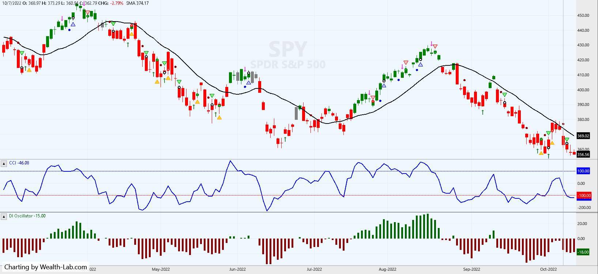
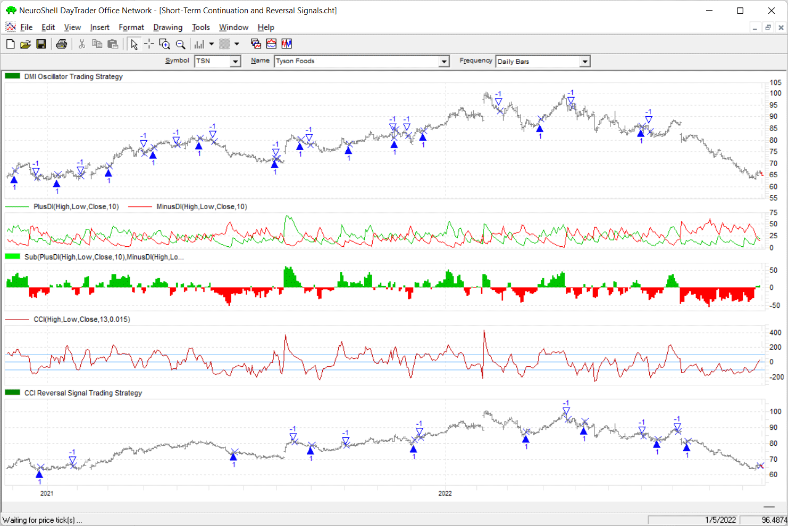

## Short-Term Continuation And Reversal Signals: DMI Continuation Signals and CCI Reversal Signals

**References**


- [traders.com: TradersTips 2022-12](https://traders.com/Documentation/FEEDbk_docs/2022/12/TradersTips.html)


**█ OVERVIEW**

In her article in December 2022 Traders’ Tips, “Short-Term Continuation And Reversal Signals,” author Barbara Star describes modifications to the classic directional movement indicator (DMI) and commodity channel index (CCI) that can aid in more easily identifying price reversals and continuations in a trend. Traditionally, the DMI is comprised of two lines: a plus line (+DI) and negative line (−DI).

In her article, Star creates a DMI oscillator by subtracting −DI from +DI. Historically, the DMI uses a default length of 14. In the article, this has been shortened to 10. The CCI has also been adjusted in the article to use a length of 13 instead of the usual 14 or 20. The DMI oscillator PaintBar colors the price bars so they match the color of the DMI oscillator. Here, CCI reversal signals are plotted with crosses (plus signs) as opposed to the diamond shapes used by the author.


**█ STRATEGY**

#### DMI oscillator continuation signals:
    
    BUY LONG CONDITIONS: [All of which must be true]
    
         A>B(Close,Avg(Close,18))
         A>B(PlusDI(High,Low,Close,10),MinusDI(High,Low,Close,10))
         A>B(Low,Lag(Low,1))
         A<B(Lag(Low,1),Lag(Low,2))
         
         
    SELL LONG CONDITIONS: [All of which must be true]
    
         A<B(Close,Avg(Close,18))
         A<B(PlusDI(High,Low,Close,10),MinusDI(High,Low,Close,10))
         A<B(High,Lag(High,1))
         A>B(Lag(High,1),Lag(High,2))
         
    
#### CCI reversal signals:

    BUY LONG CONDITIONS: [All of which must be true]
    
         A>=B(CCI(High,Low,Close,13,0.015),-100)
         A<B(Lag(CCI(High,Low,Close,13,0.015),1),-100)
         A<B(Lag(CCI(High,Low,Close,13,0.015),2),-100)
         
    SELL LONG CONDITIONS: [All of which must be true]
    
         A<=B(CCI(High,Low,Close,13,0.015),100)
         A>B(Lag(CCI(High,Low,Close,13,0.015),1),100)
         A>B(Lag(CCI(High,Low,Close,13,0.015),2),100)
         







#### Load basic packages 


```python
import pandas as pd
import numpy as np
import os
import gc
import copy
from pathlib import Path
from datetime import datetime, timedelta, time, date
```


```python
#!pip install yfinance
#!pip install mplfinance
```


```python
#this package is to download equity price data from yahoo finance
#the source code of this package can be found here: https://github.com/ranaroussi/yfinance/blob/main
import yfinance as yf
```


```python
pd.options.display.max_rows = 100
pd.options.display.max_columns = 100

import warnings
warnings.filterwarnings("ignore")

import pytorch_lightning as pl
random_seed=1234
pl.seed_everything(random_seed)
```


    1234


#### Download data


```python
#S&P 500 (^GSPC),  Dow Jones Industrial Average (^DJI), NASDAQ Composite (^IXIC)
#Russell 2000 (^RUT), Crude Oil Nov 21 (CL=F), Gold Dec 21 (GC=F)
#Treasury Yield 10 Years (^TNX)
#CBOE Volatility Index (^VIX) Chicago Options - Chicago Options Delayed Price. Currency in USD

#benchmark_tickers = ['^GSPC', '^DJI', '^IXIC', '^RUT',  'CL=F', 'GC=F', '^TNX']

benchmark_tickers = ['^GSPC', '^VIX']
tickers = benchmark_tickers + ['GSK', 'BST', 'PFE']
```


```python
#https://github.com/ranaroussi/yfinance/blob/main/yfinance/base.py
#     def history(self, period="1mo", interval="1d",
#                 start=None, end=None, prepost=False, actions=True,
#                 auto_adjust=True, back_adjust=False,
#                 proxy=None, rounding=False, tz=None, timeout=None, **kwargs):

dfs = {}

for ticker in tickers:
    cur_data = yf.Ticker(ticker)
    hist = cur_data.history(period="max", start='2000-01-01')
    print(f"{datetime.now()}\t {ticker}\t {hist.shape}\t {hist.index.min()}\t {hist.index.max()}")
    dfs[ticker] = hist
```

    2023-03-05 11:37:13.415477	 ^GSPC	 (5829, 7)	 2000-01-03 00:00:00-05:00	 2023-03-03 00:00:00-05:00
    2023-03-05 11:37:14.331050	 ^VIX	 (5829, 7)	 2000-01-03 00:00:00-05:00	 2023-03-03 00:00:00-05:00
    2023-03-05 11:37:15.334950	 GSK	 (5829, 7)	 2000-01-03 00:00:00-05:00	 2023-03-03 00:00:00-05:00
    2023-03-05 11:37:16.169901	 BST	 (2100, 7)	 2014-10-29 00:00:00-04:00	 2023-03-03 00:00:00-05:00
    2023-03-05 11:37:17.207059	 PFE	 (5829, 7)	 2000-01-03 00:00:00-05:00	 2023-03-03 00:00:00-05:00


```python
ticker = '^GSPC'
dfs[ticker].tail(5)
```


<div>
<table border="1">
  <thead>
    <tr style="text-align: right;">
      <th></th>
      <th>Open</th>
      <th>High</th>
      <th>Low</th>
      <th>Close</th>
      <th>Volume</th>
      <th>Dividends</th>
      <th>Stock Splits</th>
    </tr>
    <tr>
      <th>Date</th>
      <th></th>
      <th></th>
      <th></th>
      <th></th>
      <th></th>
      <th></th>
      <th></th>
    </tr>
  </thead>
  <tbody>
    <tr>
      <th>2023-02-27 00:00:00-05:00</th>
      <td>3992.360107</td>
      <td>4018.050049</td>
      <td>3973.550049</td>
      <td>3982.239990</td>
      <td>3836950000</td>
      <td>0.0</td>
      <td>0.0</td>
    </tr>
    <tr>
      <th>2023-02-28 00:00:00-05:00</th>
      <td>3977.189941</td>
      <td>3997.500000</td>
      <td>3968.979980</td>
      <td>3970.149902</td>
      <td>5043400000</td>
      <td>0.0</td>
      <td>0.0</td>
    </tr>
    <tr>
      <th>2023-03-01 00:00:00-05:00</th>
      <td>3963.340088</td>
      <td>3971.729980</td>
      <td>3939.050049</td>
      <td>3951.389893</td>
      <td>4249480000</td>
      <td>0.0</td>
      <td>0.0</td>
    </tr>
    <tr>
      <th>2023-03-02 00:00:00-05:00</th>
      <td>3938.679932</td>
      <td>3990.840088</td>
      <td>3928.159912</td>
      <td>3981.350098</td>
      <td>4244900000</td>
      <td>0.0</td>
      <td>0.0</td>
    </tr>
    <tr>
      <th>2023-03-03 00:00:00-05:00</th>
      <td>3998.020020</td>
      <td>4048.290039</td>
      <td>3995.169922</td>
      <td>4045.639893</td>
      <td>4084730000</td>
      <td>0.0</td>
      <td>0.0</td>
    </tr>
  </tbody>
</table>
</div>


#### Calculate


```python
import sys
sys.path.append(r"/kaggle/input/technical-indicators-core")
#from core.finta import TA
from finta import TA
```


```python
df = dfs[ticker][['Open', 'High', 'Low', 'Close', 'Volume']]
df = df.round(2)
```


```python
#help(TA.DMI)
```


```python
df_ta = TA.DMI(df, period = 10)
df = df.merge(df_ta, left_index = True, right_index = True, how='inner' )

del df_ta
gc.collect()
```


    5689


```python
df.tail(5)
```


<div>
<table border="1" >
  <thead>
    <tr style="text-align: right;">
      <th></th>
      <th>Open</th>
      <th>High</th>
      <th>Low</th>
      <th>Close</th>
      <th>Volume</th>
      <th>DI_PLUS</th>
      <th>DI_MINUS</th>
    </tr>
    <tr>
      <th>Date</th>
      <th></th>
      <th></th>
      <th></th>
      <th></th>
      <th></th>
      <th></th>
      <th></th>
    </tr>
  </thead>
  <tbody>
    <tr>
      <th>2023-02-27 00:00:00-05:00</th>
      <td>3992.36</td>
      <td>4018.05</td>
      <td>3973.55</td>
      <td>3982.24</td>
      <td>3836950000</td>
      <td>22.890861</td>
      <td>25.460095</td>
    </tr>
    <tr>
      <th>2023-02-28 00:00:00-05:00</th>
      <td>3977.19</td>
      <td>3997.50</td>
      <td>3968.98</td>
      <td>3970.15</td>
      <td>5043400000</td>
      <td>20.601775</td>
      <td>23.762409</td>
    </tr>
    <tr>
      <th>2023-03-01 00:00:00-05:00</th>
      <td>3963.34</td>
      <td>3971.73</td>
      <td>3939.05</td>
      <td>3951.39</td>
      <td>4249480000</td>
      <td>18.541597</td>
      <td>27.293832</td>
    </tr>
    <tr>
      <th>2023-03-02 00:00:00-05:00</th>
      <td>3938.68</td>
      <td>3990.84</td>
      <td>3928.16</td>
      <td>3981.35</td>
      <td>4244900000</td>
      <td>20.326190</td>
      <td>24.564449</td>
    </tr>
    <tr>
      <th>2023-03-03 00:00:00-05:00</th>
      <td>3998.02</td>
      <td>4048.29</td>
      <td>3995.17</td>
      <td>4045.64</td>
      <td>4084730000</td>
      <td>29.051796</td>
      <td>22.108004</td>
    </tr>
  </tbody>
</table>
</div>


```python
#help(TA.SMA)
```


```python
df['SMA'] = TA.SMA(df, period=18, column='close')
```


```python
df.tail(5)
```


<div>
<table border="1" >
  <thead>
    <tr style="text-align: right;">
      <th></th>
      <th>Open</th>
      <th>High</th>
      <th>Low</th>
      <th>Close</th>
      <th>Volume</th>
      <th>DI_PLUS</th>
      <th>DI_MINUS</th>
      <th>SMA</th>
    </tr>
    <tr>
      <th>Date</th>
      <th></th>
      <th></th>
      <th></th>
      <th></th>
      <th></th>
      <th></th>
      <th></th>
      <th></th>
    </tr>
  </thead>
  <tbody>
    <tr>
      <th>2023-02-27 00:00:00-05:00</th>
      <td>3992.36</td>
      <td>4018.05</td>
      <td>3973.55</td>
      <td>3982.24</td>
      <td>3836950000</td>
      <td>22.890861</td>
      <td>25.460095</td>
      <td>4085.770000</td>
    </tr>
    <tr>
      <th>2023-02-28 00:00:00-05:00</th>
      <td>3977.19</td>
      <td>3997.50</td>
      <td>3968.98</td>
      <td>3970.15</td>
      <td>5043400000</td>
      <td>20.601775</td>
      <td>23.762409</td>
      <td>4077.488889</td>
    </tr>
    <tr>
      <th>2023-03-01 00:00:00-05:00</th>
      <td>3963.34</td>
      <td>3971.73</td>
      <td>3939.05</td>
      <td>3951.39</td>
      <td>4249480000</td>
      <td>18.541597</td>
      <td>27.293832</td>
      <td>4064.801667</td>
    </tr>
    <tr>
      <th>2023-03-02 00:00:00-05:00</th>
      <td>3938.68</td>
      <td>3990.84</td>
      <td>3928.16</td>
      <td>3981.35</td>
      <td>4244900000</td>
      <td>20.326190</td>
      <td>24.564449</td>
      <td>4056.183333</td>
    </tr>
    <tr>
      <th>2023-03-03 00:00:00-05:00</th>
      <td>3998.02</td>
      <td>4048.29</td>
      <td>3995.17</td>
      <td>4045.64</td>
      <td>4084730000</td>
      <td>29.051796</td>
      <td>22.108004</td>
      <td>4052.547778</td>
    </tr>
  </tbody>
</table>
</div>


```python
#help(TA.CCI)
```


```python
df['CCI'] = TA.CCI(df, period=13)
```


```python
#DMIOsc = oDMIPlus - oDMIMinus;
df['DMI_OSC']  = df['DI_PLUS'] - df['DI_MINUS']
#df['PRE_CLOSE'] = df['Close'].shift(1)
# df['PRE_Low'] = df['Low'].shift(1)
# df['PRE_Low2'] = df['Low'].shift(2)
# df['PRE_High'] = df['High'].shift(1)
# df['PRE_High2'] = df['High'].shift(2)

# df['PRE_CCI'] = df['CCI'].shift(1)
# df['PRE_CCI2'] = df['CCI'].shift(2)

```


```python
df.tail(5)
```


<div>
<table border="1" >
  <thead>
    <tr style="text-align: right;">
      <th></th>
      <th>Open</th>
      <th>High</th>
      <th>Low</th>
      <th>Close</th>
      <th>Volume</th>
      <th>DI_PLUS</th>
      <th>DI_MINUS</th>
      <th>SMA</th>
      <th>CCI</th>
      <th>DMI_OSC</th>
    </tr>
    <tr>
      <th>Date</th>
      <th></th>
      <th></th>
      <th></th>
      <th></th>
      <th></th>
      <th></th>
      <th></th>
      <th></th>
      <th></th>
      <th></th>
    </tr>
  </thead>
  <tbody>
    <tr>
      <th>2023-02-27 00:00:00-05:00</th>
      <td>3992.36</td>
      <td>4018.05</td>
      <td>3973.55</td>
      <td>3982.24</td>
      <td>3836950000</td>
      <td>22.890861</td>
      <td>25.460095</td>
      <td>4085.770000</td>
      <td>-89.591020</td>
      <td>-2.569235</td>
    </tr>
    <tr>
      <th>2023-02-28 00:00:00-05:00</th>
      <td>3977.19</td>
      <td>3997.50</td>
      <td>3968.98</td>
      <td>3970.15</td>
      <td>5043400000</td>
      <td>20.601775</td>
      <td>23.762409</td>
      <td>4077.488889</td>
      <td>-86.569991</td>
      <td>-3.160634</td>
    </tr>
    <tr>
      <th>2023-03-01 00:00:00-05:00</th>
      <td>3963.34</td>
      <td>3971.73</td>
      <td>3939.05</td>
      <td>3951.39</td>
      <td>4249480000</td>
      <td>18.541597</td>
      <td>27.293832</td>
      <td>4064.801667</td>
      <td>-97.115958</td>
      <td>-8.752235</td>
    </tr>
    <tr>
      <th>2023-03-02 00:00:00-05:00</th>
      <td>3938.68</td>
      <td>3990.84</td>
      <td>3928.16</td>
      <td>3981.35</td>
      <td>4244900000</td>
      <td>20.326190</td>
      <td>24.564449</td>
      <td>4056.183333</td>
      <td>-72.464634</td>
      <td>-4.238259</td>
    </tr>
    <tr>
      <th>2023-03-03 00:00:00-05:00</th>
      <td>3998.02</td>
      <td>4048.29</td>
      <td>3995.17</td>
      <td>4045.64</td>
      <td>4084730000</td>
      <td>29.051796</td>
      <td>22.108004</td>
      <td>4052.547778</td>
      <td>4.893484</td>
      <td>6.943792</td>
    </tr>
  </tbody>
</table>
</div>


#### DMI oscillator continuation signals:
    
    BUY LONG CONDITIONS: [All of which must be true]
    
         A>B(Close,Avg(Close,18))
         A>B(PlusDI(High,Low,Close,10),MinusDI(High,Low,Close,10))
         A>B(Low,Lag(Low,1))
         A<B(Lag(Low,1),Lag(Low,2))
         


```python
df['DMI_BUY'] = 0
buy_cond = (df['Close']>df['SMA']) 
buy_cond = buy_cond & (df['DI_PLUS'] > df['DI_MINUS'])
buy_cond = buy_cond & (df['Low'] > (df['Low'].shift(1)))
buy_cond = buy_cond & ((df['Low'].shift(1)) < (df['Low'].shift(2)))
df.loc[buy_cond, 'DMI_BUY'] = 1
```

#### DMI oscillator continuation signals:
           
    SELL LONG CONDITIONS: [All of which must be true]
    
         A<B(Close,Avg(Close,18))
         A<B(PlusDI(High,Low,Close,10),MinusDI(High,Low,Close,10))
         A<B(High,Lag(High,1))
         A>B(Lag(High,1),Lag(High,2))
         


```python
df['DMI_SELL'] = 0
sell_cond = (df['Close']<df['SMA']) 
sell_cond = sell_cond & (df['DI_PLUS'] < df['DI_MINUS'])
sell_cond = sell_cond & (df['High'] < (df['High'].shift(1)))
sell_cond = sell_cond & ((df['High'].shift(1)) > (df['High'].shift(2)))
df.loc[sell_cond, 'DMI_SELL'] = 1
```


```python
df.tail(5)
```


<div>
<table border="1" >
  <thead>
    <tr style="text-align: right;">
      <th></th>
      <th>Open</th>
      <th>High</th>
      <th>Low</th>
      <th>Close</th>
      <th>Volume</th>
      <th>DI_PLUS</th>
      <th>DI_MINUS</th>
      <th>SMA</th>
      <th>CCI</th>
      <th>DMI_OSC</th>
      <th>DMI_BUY</th>
      <th>DMI_SELL</th>
    </tr>
    <tr>
      <th>Date</th>
      <th></th>
      <th></th>
      <th></th>
      <th></th>
      <th></th>
      <th></th>
      <th></th>
      <th></th>
      <th></th>
      <th></th>
      <th></th>
      <th></th>
    </tr>
  </thead>
  <tbody>
    <tr>
      <th>2023-02-27 00:00:00-05:00</th>
      <td>3992.36</td>
      <td>4018.05</td>
      <td>3973.55</td>
      <td>3982.24</td>
      <td>3836950000</td>
      <td>22.890861</td>
      <td>25.460095</td>
      <td>4085.770000</td>
      <td>-89.591020</td>
      <td>-2.569235</td>
      <td>0</td>
      <td>0</td>
    </tr>
    <tr>
      <th>2023-02-28 00:00:00-05:00</th>
      <td>3977.19</td>
      <td>3997.50</td>
      <td>3968.98</td>
      <td>3970.15</td>
      <td>5043400000</td>
      <td>20.601775</td>
      <td>23.762409</td>
      <td>4077.488889</td>
      <td>-86.569991</td>
      <td>-3.160634</td>
      <td>0</td>
      <td>1</td>
    </tr>
    <tr>
      <th>2023-03-01 00:00:00-05:00</th>
      <td>3963.34</td>
      <td>3971.73</td>
      <td>3939.05</td>
      <td>3951.39</td>
      <td>4249480000</td>
      <td>18.541597</td>
      <td>27.293832</td>
      <td>4064.801667</td>
      <td>-97.115958</td>
      <td>-8.752235</td>
      <td>0</td>
      <td>0</td>
    </tr>
    <tr>
      <th>2023-03-02 00:00:00-05:00</th>
      <td>3938.68</td>
      <td>3990.84</td>
      <td>3928.16</td>
      <td>3981.35</td>
      <td>4244900000</td>
      <td>20.326190</td>
      <td>24.564449</td>
      <td>4056.183333</td>
      <td>-72.464634</td>
      <td>-4.238259</td>
      <td>0</td>
      <td>0</td>
    </tr>
    <tr>
      <th>2023-03-03 00:00:00-05:00</th>
      <td>3998.02</td>
      <td>4048.29</td>
      <td>3995.17</td>
      <td>4045.64</td>
      <td>4084730000</td>
      <td>29.051796</td>
      <td>22.108004</td>
      <td>4052.547778</td>
      <td>4.893484</td>
      <td>6.943792</td>
      <td>0</td>
      <td>0</td>
    </tr>
  </tbody>
</table>
</div>


#### CCI reversal signals:

    BUY LONG CONDITIONS: [All of which must be true]
    
         A>=B(CCI(High,Low,Close,13,0.015),-100)
         A<B(Lag(CCI(High,Low,Close,13,0.015),1),-100)
         A<B(Lag(CCI(High,Low,Close,13,0.015),2),-100)


```python
df['CCI_BUY'] = 0
buy_cond = (df['CCI']>=-100) 
buy_cond = buy_cond & (df['CCI'].shift(1) < -100)
buy_cond = buy_cond & (df['CCI'].shift(2) < -100)
df.loc[buy_cond, 'CCI_BUY'] = 1
```

#### CCI reversal signals:

    SELL LONG CONDITIONS: [All of which must be true]
    
         A<=B(CCI(High,Low,Close,13,0.015),100)
         A>B(Lag(CCI(High,Low,Close,13,0.015),1),100)
         A>B(Lag(CCI(High,Low,Close,13,0.015),2),100)


```python
df['CCI_SELL'] = 0
sell_cond = (df['CCI']<=100) 
sell_cond = sell_cond & (df['CCI'].shift(1) > 100)
sell_cond = sell_cond & (df['CCI'].shift(2) > 100)
df.loc[sell_cond, 'CCI_SELL'] = 1
```


```python
display(df.head(5))
display(df.tail(5))
```


<div>
<table border="1" >
  <thead>
    <tr style="text-align: right;">
      <th></th>
      <th>Open</th>
      <th>High</th>
      <th>Low</th>
      <th>Close</th>
      <th>Volume</th>
      <th>DI_PLUS</th>
      <th>DI_MINUS</th>
      <th>SMA</th>
      <th>CCI</th>
      <th>DMI_OSC</th>
      <th>DMI_BUY</th>
      <th>DMI_SELL</th>
      <th>CCI_BUY</th>
      <th>CCI_SELL</th>
    </tr>
    <tr>
      <th>Date</th>
      <th></th>
      <th></th>
      <th></th>
      <th></th>
      <th></th>
      <th></th>
      <th></th>
      <th></th>
      <th></th>
      <th></th>
      <th></th>
      <th></th>
      <th></th>
      <th></th>
    </tr>
  </thead>
  <tbody>
    <tr>
      <th>2000-01-03 00:00:00-05:00</th>
      <td>1469.25</td>
      <td>1478.00</td>
      <td>1438.36</td>
      <td>1455.22</td>
      <td>931800000</td>
      <td>NaN</td>
      <td>NaN</td>
      <td>NaN</td>
      <td>NaN</td>
      <td>NaN</td>
      <td>0</td>
      <td>0</td>
      <td>0</td>
      <td>0</td>
    </tr>
    <tr>
      <th>2000-01-04 00:00:00-05:00</th>
      <td>1455.22</td>
      <td>1455.22</td>
      <td>1397.43</td>
      <td>1399.42</td>
      <td>1009000000</td>
      <td>NaN</td>
      <td>NaN</td>
      <td>NaN</td>
      <td>-66.666667</td>
      <td>NaN</td>
      <td>0</td>
      <td>0</td>
      <td>0</td>
      <td>0</td>
    </tr>
    <tr>
      <th>2000-01-05 00:00:00-05:00</th>
      <td>1399.42</td>
      <td>1413.27</td>
      <td>1377.68</td>
      <td>1402.11</td>
      <td>1085500000</td>
      <td>NaN</td>
      <td>NaN</td>
      <td>NaN</td>
      <td>-79.700030</td>
      <td>NaN</td>
      <td>0</td>
      <td>0</td>
      <td>0</td>
      <td>0</td>
    </tr>
    <tr>
      <th>2000-01-06 00:00:00-05:00</th>
      <td>1402.11</td>
      <td>1411.90</td>
      <td>1392.10</td>
      <td>1403.45</td>
      <td>1092300000</td>
      <td>NaN</td>
      <td>NaN</td>
      <td>NaN</td>
      <td>-56.072933</td>
      <td>NaN</td>
      <td>0</td>
      <td>0</td>
      <td>0</td>
      <td>0</td>
    </tr>
    <tr>
      <th>2000-01-07 00:00:00-05:00</th>
      <td>1403.45</td>
      <td>1441.47</td>
      <td>1400.73</td>
      <td>1441.47</td>
      <td>1225200000</td>
      <td>NaN</td>
      <td>NaN</td>
      <td>NaN</td>
      <td>27.884164</td>
      <td>NaN</td>
      <td>0</td>
      <td>0</td>
      <td>0</td>
      <td>0</td>
    </tr>
  </tbody>
</table>
</div>


<div>
<table border="1" >
  <thead>
    <tr style="text-align: right;">
      <th></th>
      <th>Open</th>
      <th>High</th>
      <th>Low</th>
      <th>Close</th>
      <th>Volume</th>
      <th>DI_PLUS</th>
      <th>DI_MINUS</th>
      <th>SMA</th>
      <th>CCI</th>
      <th>DMI_OSC</th>
      <th>DMI_BUY</th>
      <th>DMI_SELL</th>
      <th>CCI_BUY</th>
      <th>CCI_SELL</th>
    </tr>
    <tr>
      <th>Date</th>
      <th></th>
      <th></th>
      <th></th>
      <th></th>
      <th></th>
      <th></th>
      <th></th>
      <th></th>
      <th></th>
      <th></th>
      <th></th>
      <th></th>
      <th></th>
      <th></th>
    </tr>
  </thead>
  <tbody>
    <tr>
      <th>2023-02-27 00:00:00-05:00</th>
      <td>3992.36</td>
      <td>4018.05</td>
      <td>3973.55</td>
      <td>3982.24</td>
      <td>3836950000</td>
      <td>22.890861</td>
      <td>25.460095</td>
      <td>4085.770000</td>
      <td>-89.591020</td>
      <td>-2.569235</td>
      <td>0</td>
      <td>0</td>
      <td>1</td>
      <td>0</td>
    </tr>
    <tr>
      <th>2023-02-28 00:00:00-05:00</th>
      <td>3977.19</td>
      <td>3997.50</td>
      <td>3968.98</td>
      <td>3970.15</td>
      <td>5043400000</td>
      <td>20.601775</td>
      <td>23.762409</td>
      <td>4077.488889</td>
      <td>-86.569991</td>
      <td>-3.160634</td>
      <td>0</td>
      <td>1</td>
      <td>0</td>
      <td>0</td>
    </tr>
    <tr>
      <th>2023-03-01 00:00:00-05:00</th>
      <td>3963.34</td>
      <td>3971.73</td>
      <td>3939.05</td>
      <td>3951.39</td>
      <td>4249480000</td>
      <td>18.541597</td>
      <td>27.293832</td>
      <td>4064.801667</td>
      <td>-97.115958</td>
      <td>-8.752235</td>
      <td>0</td>
      <td>0</td>
      <td>0</td>
      <td>0</td>
    </tr>
    <tr>
      <th>2023-03-02 00:00:00-05:00</th>
      <td>3938.68</td>
      <td>3990.84</td>
      <td>3928.16</td>
      <td>3981.35</td>
      <td>4244900000</td>
      <td>20.326190</td>
      <td>24.564449</td>
      <td>4056.183333</td>
      <td>-72.464634</td>
      <td>-4.238259</td>
      <td>0</td>
      <td>0</td>
      <td>0</td>
      <td>0</td>
    </tr>
    <tr>
      <th>2023-03-03 00:00:00-05:00</th>
      <td>3998.02</td>
      <td>4048.29</td>
      <td>3995.17</td>
      <td>4045.64</td>
      <td>4084730000</td>
      <td>29.051796</td>
      <td>22.108004</td>
      <td>4052.547778</td>
      <td>4.893484</td>
      <td>6.943792</td>
      <td>0</td>
      <td>0</td>
      <td>0</td>
      <td>0</td>
    </tr>
  </tbody>
</table>
</div>


```python
df['DMI_BUY_Close'] = df['Close']*df['DMI_BUY']
df['DMI_SELL_Close'] = df['Close']*df['DMI_SELL']
df['CCI_BUY_Close'] = df['Close']*df['CCI_BUY']
df['CCI_SELL_Close'] = df['Close']*df['CCI_SELL']
```


```python
display(df.tail(5))
```


<div>
<table border="1" >
  <thead>
    <tr style="text-align: right;">
      <th></th>
      <th>Open</th>
      <th>High</th>
      <th>Low</th>
      <th>Close</th>
      <th>Volume</th>
      <th>DI_PLUS</th>
      <th>DI_MINUS</th>
      <th>SMA</th>
      <th>CCI</th>
      <th>DMI_OSC</th>
      <th>DMI_BUY</th>
      <th>DMI_SELL</th>
      <th>CCI_BUY</th>
      <th>CCI_SELL</th>
      <th>DMI_BUY_Close</th>
      <th>DMI_SELL_Close</th>
      <th>CCI_BUY_Close</th>
      <th>CCI_SELL_Close</th>
    </tr>
    <tr>
      <th>Date</th>
      <th></th>
      <th></th>
      <th></th>
      <th></th>
      <th></th>
      <th></th>
      <th></th>
      <th></th>
      <th></th>
      <th></th>
      <th></th>
      <th></th>
      <th></th>
      <th></th>
      <th></th>
      <th></th>
      <th></th>
      <th></th>
    </tr>
  </thead>
  <tbody>
    <tr>
      <th>2023-02-27 00:00:00-05:00</th>
      <td>3992.36</td>
      <td>4018.05</td>
      <td>3973.55</td>
      <td>3982.24</td>
      <td>3836950000</td>
      <td>22.890861</td>
      <td>25.460095</td>
      <td>4085.770000</td>
      <td>-89.591020</td>
      <td>-2.569235</td>
      <td>0</td>
      <td>0</td>
      <td>1</td>
      <td>0</td>
      <td>0.0</td>
      <td>0.00</td>
      <td>3982.24</td>
      <td>0.0</td>
    </tr>
    <tr>
      <th>2023-02-28 00:00:00-05:00</th>
      <td>3977.19</td>
      <td>3997.50</td>
      <td>3968.98</td>
      <td>3970.15</td>
      <td>5043400000</td>
      <td>20.601775</td>
      <td>23.762409</td>
      <td>4077.488889</td>
      <td>-86.569991</td>
      <td>-3.160634</td>
      <td>0</td>
      <td>1</td>
      <td>0</td>
      <td>0</td>
      <td>0.0</td>
      <td>3970.15</td>
      <td>0.00</td>
      <td>0.0</td>
    </tr>
    <tr>
      <th>2023-03-01 00:00:00-05:00</th>
      <td>3963.34</td>
      <td>3971.73</td>
      <td>3939.05</td>
      <td>3951.39</td>
      <td>4249480000</td>
      <td>18.541597</td>
      <td>27.293832</td>
      <td>4064.801667</td>
      <td>-97.115958</td>
      <td>-8.752235</td>
      <td>0</td>
      <td>0</td>
      <td>0</td>
      <td>0</td>
      <td>0.0</td>
      <td>0.00</td>
      <td>0.00</td>
      <td>0.0</td>
    </tr>
    <tr>
      <th>2023-03-02 00:00:00-05:00</th>
      <td>3938.68</td>
      <td>3990.84</td>
      <td>3928.16</td>
      <td>3981.35</td>
      <td>4244900000</td>
      <td>20.326190</td>
      <td>24.564449</td>
      <td>4056.183333</td>
      <td>-72.464634</td>
      <td>-4.238259</td>
      <td>0</td>
      <td>0</td>
      <td>0</td>
      <td>0</td>
      <td>0.0</td>
      <td>0.00</td>
      <td>0.00</td>
      <td>0.0</td>
    </tr>
    <tr>
      <th>2023-03-03 00:00:00-05:00</th>
      <td>3998.02</td>
      <td>4048.29</td>
      <td>3995.17</td>
      <td>4045.64</td>
      <td>4084730000</td>
      <td>29.051796</td>
      <td>22.108004</td>
      <td>4052.547778</td>
      <td>4.893484</td>
      <td>6.943792</td>
      <td>0</td>
      <td>0</td>
      <td>0</td>
      <td>0</td>
      <td>0.0</td>
      <td>0.00</td>
      <td>0.00</td>
      <td>0.0</td>
    </tr>
  </tbody>
</table>
</div>


#### Visualize Signals


```python
#from core.visuals import *
from visuals import *
```


```python
start = -100
end = df.shape[0]
df_sub = df.iloc[start:end]
# df_sub = df[(df.index<='2019-04-01') & (df.index>='2019-01-24')]
#names = {'main_title': f'{ticker}'}
```


```python
names = {'main_title': f'{ticker} - DMI oscillator continuation signals'}

lines0,  ax_cfg0 = plot_overlay_lines(data = df_sub, overlay_columns = ['SMA'])

lines1, ax_cfg1 = plot_macd(data = df_sub, macd= 'DI_PLUS', macd_signal = 'DI_MINUS', panel =1)

lines2, shadows2, ax_cfg2 = plot_add_lines(data = df_sub, line_columns=['CCI'], 
                                           panel =2, bands = [-100, 100])
b_s_ = plot_buy_sell(data=df_sub, buy_column='DMI_BUY_Close', sell_column='DMI_SELL_Close')
lines_ = dict(**lines0, **lines1)
lines_.update(lines2)
lines_.update(b_s_)

shadows_ =    shadows2


fig_config_ = dict(figratio=(18,9), volume=False, volume_panel=2,panel_ratios=(4,2,2), tight_layout=True, returnfig=True,)

ax_cfg_ = ax_cfg0
ax_cfg_.update(ax_cfg1)
ax_cfg_.update(ax_cfg2)


names = {'main_title': f'{ticker}'}

aa_, bb_ = make_panels(main_data = df_sub[['Open', 'High', 'Low', 'Close', 'Volume']], 
                       added_plots = lines_,
                       fill_betweens = shadows_, 
                       fig_config = fig_config_, 
                       axes_config = ax_cfg_,  
                       names = names)    
```


```python
names = {'main_title': f'{ticker} - CCI reversal signals'}

lines0,  ax_cfg0 = plot_overlay_lines(data = df_sub, overlay_columns = ['SMA'])

lines1, ax_cfg1 = plot_macd(data = df_sub, macd= 'DI_PLUS', macd_signal = 'DI_MINUS', panel =1)

lines2, shadows2, ax_cfg2 = plot_add_lines(data = df_sub, line_columns=['CCI'], 
                                           panel =2, bands = [-100, 100])
b_s_ = plot_buy_sell(data=df_sub, buy_column='CCI_BUY_Close', sell_column='CCI_SELL_Close')
lines_ = dict(**lines0, **lines1)
lines_.update(lines2)
lines_.update(b_s_)

shadows_ =    shadows2


fig_config_ = dict(figratio=(18,9), volume=False, volume_panel=2,panel_ratios=(4,2,2), tight_layout=True, returnfig=True,)

ax_cfg_ = ax_cfg0
ax_cfg_.update(ax_cfg1)
ax_cfg_.update(ax_cfg2)


names = {'main_title': f'{ticker}'}

aa_, bb_ = make_panels(main_data = df_sub[['Open', 'High', 'Low', 'Close', 'Volume']], 
                       added_plots = lines_,
                       fill_betweens = shadows_, 
                       fig_config = fig_config_, 
                       axes_config = ax_cfg_,  
                       names = names)    
```


#### Combine a few


```python
df_list = []
for ticker, df in dfs.items():
    df = df[['Open', 'High', 'Low', 'Close', 'Volume']].round(2)

    df_ta = TA.DMI(df, period = 10)
    df = df.merge(df_ta, left_index = True, right_index = True, how='inner' )

    del df_ta
    gc.collect()

    df['SMA'] = TA.SMA(df, period=18, column='close')
    df['CCI'] = TA.CCI(df, period=13)
    df['DMI_OSC']  = df['DI_PLUS'] - df['DI_MINUS']

    df['DMI_BUY'] = 0
    buy_cond = (df['Close']>df['SMA']) 
    buy_cond = buy_cond & (df['DI_PLUS'] > df['DI_MINUS'])
    buy_cond = buy_cond & (df['Low'] > (df['Low'].shift(1)))
    buy_cond = buy_cond & ((df['Low'].shift(1)) < (df['Low'].shift(2)))
    df.loc[buy_cond, 'DMI_BUY'] = 1

    df['DMI_SELL'] = 0
    sell_cond = (df['Close']<df['SMA']) 
    sell_cond = sell_cond & (df['DI_PLUS'] < df['DI_MINUS'])
    sell_cond = sell_cond & (df['High'] < (df['High'].shift(1)))
    sell_cond = sell_cond & ((df['High'].shift(1)) > (df['High'].shift(2)))
    df.loc[sell_cond, 'DMI_SELL'] = 1

    df['CCI_BUY'] = 0
    buy_cond = (df['CCI']>=-100) 
    buy_cond = buy_cond & (df['CCI'].shift(1) < -100)
    buy_cond = buy_cond & (df['CCI'].shift(2) < -100)
    df.loc[buy_cond, 'CCI_BUY'] = 1

    df['CCI_SELL'] = 0
    sell_cond = (df['CCI']<=100) 
    sell_cond = sell_cond & (df['CCI'].shift(1) > 100)
    sell_cond = sell_cond & (df['CCI'].shift(2) > 100)
    df.loc[sell_cond, 'CCI_SELL'] = 1
    
    df['ticker'] = ticker
    df_list.append(df)
```


```python
df_all = pd.concat(df_list, axis=0)
print(df_all.shape)
df_all.tail(5)
```

    (25416, 15)


<div>
<table border="1" >
  <thead>
    <tr style="text-align: right;">
      <th></th>
      <th>Open</th>
      <th>High</th>
      <th>Low</th>
      <th>Close</th>
      <th>Volume</th>
      <th>DI_PLUS</th>
      <th>DI_MINUS</th>
      <th>SMA</th>
      <th>CCI</th>
      <th>DMI_OSC</th>
      <th>DMI_BUY</th>
      <th>DMI_SELL</th>
      <th>CCI_BUY</th>
      <th>CCI_SELL</th>
      <th>ticker</th>
    </tr>
    <tr>
      <th>Date</th>
      <th></th>
      <th></th>
      <th></th>
      <th></th>
      <th></th>
      <th></th>
      <th></th>
      <th></th>
      <th></th>
      <th></th>
      <th></th>
      <th></th>
      <th></th>
      <th></th>
      <th></th>
    </tr>
  </thead>
  <tbody>
    <tr>
      <th>2023-02-27 00:00:00-05:00</th>
      <td>41.44</td>
      <td>41.73</td>
      <td>40.73</td>
      <td>40.78</td>
      <td>26370300</td>
      <td>3.973934</td>
      <td>43.421312</td>
      <td>43.223333</td>
      <td>-187.959124</td>
      <td>-39.447378</td>
      <td>0</td>
      <td>0</td>
      <td>0</td>
      <td>0</td>
      <td>^GSPC</td>
    </tr>
    <tr>
      <th>2023-02-28 00:00:00-05:00</th>
      <td>40.50</td>
      <td>40.71</td>
      <td>40.09</td>
      <td>40.57</td>
      <td>31086900</td>
      <td>3.576541</td>
      <td>48.532652</td>
      <td>43.034444</td>
      <td>-183.366062</td>
      <td>-44.956111</td>
      <td>0</td>
      <td>0</td>
      <td>0</td>
      <td>0</td>
      <td>^GSPC</td>
    </tr>
    <tr>
      <th>2023-03-01 00:00:00-05:00</th>
      <td>40.56</td>
      <td>40.76</td>
      <td>40.14</td>
      <td>40.18</td>
      <td>21104400</td>
      <td>3.957439</td>
      <td>43.679387</td>
      <td>42.803333</td>
      <td>-146.059638</td>
      <td>-39.721947</td>
      <td>0</td>
      <td>0</td>
      <td>0</td>
      <td>0</td>
      <td>^GSPC</td>
    </tr>
    <tr>
      <th>2023-03-02 00:00:00-05:00</th>
      <td>40.06</td>
      <td>40.78</td>
      <td>39.81</td>
      <td>40.62</td>
      <td>19110600</td>
      <td>3.561695</td>
      <td>43.939779</td>
      <td>42.612222</td>
      <td>-112.054480</td>
      <td>-40.378084</td>
      <td>0</td>
      <td>0</td>
      <td>0</td>
      <td>0</td>
      <td>^GSPC</td>
    </tr>
    <tr>
      <th>2023-03-03 00:00:00-05:00</th>
      <td>40.91</td>
      <td>41.18</td>
      <td>40.74</td>
      <td>41.15</td>
      <td>20910700</td>
      <td>8.807767</td>
      <td>39.545801</td>
      <td>42.467222</td>
      <td>-61.272471</td>
      <td>-30.738034</td>
      <td>0</td>
      <td>0</td>
      <td>1</td>
      <td>0</td>
      <td>^GSPC</td>
    </tr>
  </tbody>
</table>
</div>


```python
dd = df_all.index
df_all.index = dd.date
df_all.index.name='Date'
```


```python
df_all.to_csv('c_011_tasc202212.csv', index=True)
```

