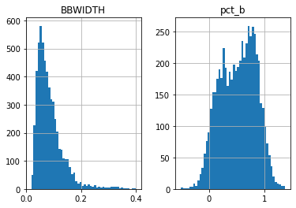

## Bollinger Bands Introduction

**References**

- [tradingview: Bollinger Bands (BB)](https://www.tradingview.com/support/solutions/43000501971-bollinger-bands-b-b/)
- [tradingview: Bollinger Bands %B](https://www.tradingview.com/support/solutions/43000501971-bollinger-bands-b-b/)
- [tradingview: Bollinger Bands Width (BBW)](https://www.tradingview.com/support/solutions/43000501972-bollinger-bands-width-bbw/)


### Bollinger Bands (BB)
 

**Definition**


- Bollinger Bands (BB) were created by John Bollinger in the early 1980’s to fill the need to visualize changes in volatility. 
- Bollinger Bands consist of three lines:
    - the middle line is 20-day Simple Moving Average (SMA). (20 days can be replaced by other periods, such as 10 days)
    - the upper line is several - typically 2 - standard deviations above the middle line
    - the lower line is same number of standard deviations below the middle line
       

**Calculation**

---
- Middle Band – 20 Day Simple Moving Average
- Upper Band – 20 Day Simple Moving Average + (Standard Deviation x 2)
- Lower Band – 20 Day Simple Moving Average - (Standard Deviation x 2)
        
---

        
- MOBO bands are based on a zone of 0.80 standard deviation with a 10 period look-back. If the price breaks out of the MOBO band it can signify a trend move or price spike contains 42% of price movements(noise) within bands.

### Bollinger Bands %B 

Percent Bandwidth (%B)

**Definition**

- Bollinger Bands %B or Percent Bandwidth (%B) is an indicator derived from the standard Bollinger Bands (BB). 
- John Bollinger introduced %B in 2010.


**Calculation**

`%B = (Current Price - Lower Band) / (Upper Band - Lower Band)`
        
**Read the indicator**     

-  %B Above 1 = Price is Above the Upper Band
-  %B Equal to 1 = Price is at the Upper Band
-  %B Above .50 = Price is Above the Middle Line
-  %B Below .50 = Price is Below the Middle Line
-  %B Equal to 0 = Price is at the Lower Band
-  %B Below 0 = Price is Below the Lower Band
    
### Bollinger Bands Width (BBW)

**Definition**

- Bollinger Bands Width (BBW) is derived from the standard Bollinger Bands.
    - John Bollinger introduced Bollinger Bands Width in 2010.


**Calculation**
    - Bollinger Bands Width = (Upper Band - Lower Band) / Middle Band
    


##### Load basic packages 


```python
import pandas as pd
import numpy as np
import os
import gc
import copy
from pathlib import Path
from datetime import datetime, timedelta, time, date
```


```python
#this package is to download equity price data from yahoo finance
#the source code of this package can be found here: https://github.com/ranaroussi/yfinance/blob/main
import yfinance as yf
```


```python
pd.options.display.max_rows = 100
pd.options.display.max_columns = 100

import warnings
warnings.filterwarnings("ignore")

import pytorch_lightning as pl
random_seed=1234
pl.seed_everything(random_seed)
```

    Global seed set to 1234
    


    1234


```python
#S&P 500 (^GSPC),  Dow Jones Industrial Average (^DJI), NASDAQ Composite (^IXIC)
#Russell 2000 (^RUT), Crude Oil Nov 21 (CL=F), Gold Dec 21 (GC=F)
#Treasury Yield 10 Years (^TNX)

#benchmark_tickers = ['^GSPC', '^DJI', '^IXIC', '^RUT',  'CL=F', 'GC=F', '^TNX']

benchmark_tickers = ['^GSPC']
tickers = benchmark_tickers + ['GSK', 'NVO', 'GKOS']
```


```python
#https://github.com/ranaroussi/yfinance/blob/main/yfinance/base.py
#     def history(self, period="1mo", interval="1d",
#                 start=None, end=None, prepost=False, actions=True,
#                 auto_adjust=True, back_adjust=False,
#                 proxy=None, rounding=False, tz=None, timeout=None, **kwargs):

dfs = {}

for ticker in tickers:
    cur_data = yf.Ticker(ticker)
    hist = cur_data.history(period="max", start='2000-01-01')
    print(datetime.now(), ticker, hist.shape, hist.index.min(), hist.index.max())
    dfs[ticker] = hist
```

    2022-09-09 18:47:27.422799 ^GSPC (5709, 7) 1999-12-31 00:00:00 2022-09-08 00:00:00
    2022-09-09 18:47:27.705493 GSK (5709, 7) 1999-12-31 00:00:00 2022-09-08 00:00:00
    2022-09-09 18:47:28.061476 NVO (5709, 7) 1999-12-31 00:00:00 2022-09-08 00:00:00
    2022-09-09 18:47:28.263999 GKOS (1815, 7) 2015-06-25 00:00:00 2022-09-08 00:00:00
    


```python
ticker = 'GSK'
dfs[ticker].tail(5)
```


<div>
<style scoped>
    .dataframe tbody tr th:only-of-type {
        vertical-align: middle;
    }

    .dataframe tbody tr th {
        vertical-align: top;
    }

    .dataframe thead th {
        text-align: right;
    }
</style>
<table border="1" class="dataframe">
  <thead>
    <tr style="text-align: right;">
      <th></th>
      <th>Open</th>
      <th>High</th>
      <th>Low</th>
      <th>Close</th>
      <th>Volume</th>
      <th>Dividends</th>
      <th>Stock Splits</th>
    </tr>
    <tr>
      <th>Date</th>
      <th></th>
      <th></th>
      <th></th>
      <th></th>
      <th></th>
      <th></th>
      <th></th>
    </tr>
  </thead>
  <tbody>
    <tr>
      <th>2022-09-01</th>
      <td>31.830000</td>
      <td>31.990000</td>
      <td>31.610001</td>
      <td>31.690001</td>
      <td>12390900</td>
      <td>0.0</td>
      <td>0.0</td>
    </tr>
    <tr>
      <th>2022-09-02</th>
      <td>31.600000</td>
      <td>31.969999</td>
      <td>31.469999</td>
      <td>31.850000</td>
      <td>8152600</td>
      <td>0.0</td>
      <td>0.0</td>
    </tr>
    <tr>
      <th>2022-09-06</th>
      <td>31.650000</td>
      <td>31.760000</td>
      <td>31.370001</td>
      <td>31.469999</td>
      <td>5613900</td>
      <td>0.0</td>
      <td>0.0</td>
    </tr>
    <tr>
      <th>2022-09-07</th>
      <td>31.209999</td>
      <td>31.590000</td>
      <td>31.160000</td>
      <td>31.490000</td>
      <td>4822000</td>
      <td>0.0</td>
      <td>0.0</td>
    </tr>
    <tr>
      <th>2022-09-08</th>
      <td>30.910000</td>
      <td>31.540001</td>
      <td>30.830000</td>
      <td>31.510000</td>
      <td>6619300</td>
      <td>0.0</td>
      <td>0.0</td>
    </tr>
  </tbody>
</table>
</div>


##### Define Bollinger Bands calculation function


```python
#https://github.com/peerchemist/finta/blob/af01fa594995de78f5ada5c336e61cd87c46b151/finta/finta.py#L935
def cal_bbands(ohlc: pd.DataFrame, period: int = 20, column: str = "close", 
               MA: pd.Series = None, std_multiplier: float = 2) -> pd.DataFrame:
    
    """
     Developed by John Bollinger, Bollinger Bands® are volatility bands placed above and below a moving average.
     Volatility is based on the standard deviation, which changes as volatility increases and decreases.
     The bands automatically widen when volatility increases and narrow when volatility decreases.
     This method allows input of some other form of moving average like EMA or KAMA around which BBAND will be formed.
     Pass desired moving average as <MA> argument. For example BBANDS(MA=TA.KAMA(20)).
    

    "MOBO bands are based on a zone of 0.80 standard deviation with a 10 period look-back"
    If the price breaks out of the MOBO band it can signify a trend move or price spike
    Contains 42% of price movements(noise) within bands.
    
    BBANDS(ohlc, period=10, std_multiplier=0.8, column=column)
    
    BBWIDTH: Bandwidth tells how wide the Bollinger Bands are on a normalized basis.
    %b (pronounced 'percent b') is derived from the formula for Stochastics and shows where price is in relation to the bands.
    %b equals 1 at the upper band and 0 at the lower band.
     
     """
    
    ohlc = ohlc.copy(deep=True)
    ohlc.columns = [c.lower() for c in ohlc.columns]
    
    std = ohlc[column].rolling(window=period).std()

    if not isinstance(MA, pd.Series):
        middle_band = pd.Series( ohlc[column].rolling(window=period).mean(), name="BB_MIDDLE")
    else:
        middle_band = pd.Series(MA, name="BB_MIDDLE")

    upper_bb = pd.Series(middle_band + (std_multiplier * std), name="BB_UPPER")
    lower_bb = pd.Series(middle_band - (std_multiplier * std), name="BB_LOWER")
    
    width_bb = pd.Series((upper_bb - lower_bb)/middle_band, name='BBWIDTH')
    
    percent_b = pd.Series(
            (ohlc["close"] - lower_bb) / (upper_bb - lower_bb),
            name="pct_b",
        )
    

    return pd.concat([upper_bb, middle_band, lower_bb, width_bb, percent_b], axis=1)

```

##### Calculate Bollinger Bands 


```python
df = dfs[ticker][['Open', 'High', 'Low', 'Close', 'Volume']]
```


```python
df = df.round(2)
```


```python
cal_bbands
```


    <function __main__.cal_bbands(ohlc: pandas.core.frame.DataFrame, period: int = 20, column: str = 'close', MA: pandas.core.series.Series = None, std_multiplier: float = 2) -> pandas.core.frame.DataFrame>


```python
df_ta = cal_bbands(df, period = 20, column = 'close', std_multiplier=2)
df = df.merge(df_ta, left_index = True, right_index = True, how='inner' )

del df_ta
gc.collect()
```


    122


```python
df_ta = cal_bbands(df, period = 10, column = 'close', std_multiplier=0.8)
df_ta.columns=[f'MOBO_{c}' for c in df_ta.columns]
df = df.merge(df_ta, left_index = True, right_index = True, how='inner' )

del df_ta
gc.collect()
```


    21


```python
display(df.head(5))
display(df.tail(5))
```


<div>
<style scoped>
    .dataframe tbody tr th:only-of-type {
        vertical-align: middle;
    }

    .dataframe tbody tr th {
        vertical-align: top;
    }

    .dataframe thead th {
        text-align: right;
    }
</style>
<table border="1" class="dataframe">
  <thead>
    <tr style="text-align: right;">
      <th></th>
      <th>Open</th>
      <th>High</th>
      <th>Low</th>
      <th>Close</th>
      <th>Volume</th>
      <th>BB_UPPER</th>
      <th>BB_MIDDLE</th>
      <th>BB_LOWER</th>
      <th>BBWIDTH</th>
      <th>pct_b</th>
      <th>MOBO_BB_UPPER</th>
      <th>MOBO_BB_MIDDLE</th>
      <th>MOBO_BB_LOWER</th>
      <th>MOBO_BBWIDTH</th>
      <th>MOBO_pct_b</th>
    </tr>
    <tr>
      <th>Date</th>
      <th></th>
      <th></th>
      <th></th>
      <th></th>
      <th></th>
      <th></th>
      <th></th>
      <th></th>
      <th></th>
      <th></th>
      <th></th>
      <th></th>
      <th></th>
      <th></th>
      <th></th>
    </tr>
  </thead>
  <tbody>
    <tr>
      <th>1999-12-31</th>
      <td>19.60</td>
      <td>19.67</td>
      <td>19.52</td>
      <td>19.56</td>
      <td>139400</td>
      <td>NaN</td>
      <td>NaN</td>
      <td>NaN</td>
      <td>NaN</td>
      <td>NaN</td>
      <td>NaN</td>
      <td>NaN</td>
      <td>NaN</td>
      <td>NaN</td>
      <td>NaN</td>
    </tr>
    <tr>
      <th>2000-01-03</th>
      <td>19.58</td>
      <td>19.71</td>
      <td>19.25</td>
      <td>19.45</td>
      <td>556100</td>
      <td>NaN</td>
      <td>NaN</td>
      <td>NaN</td>
      <td>NaN</td>
      <td>NaN</td>
      <td>NaN</td>
      <td>NaN</td>
      <td>NaN</td>
      <td>NaN</td>
      <td>NaN</td>
    </tr>
    <tr>
      <th>2000-01-04</th>
      <td>19.45</td>
      <td>19.45</td>
      <td>18.90</td>
      <td>18.95</td>
      <td>367200</td>
      <td>NaN</td>
      <td>NaN</td>
      <td>NaN</td>
      <td>NaN</td>
      <td>NaN</td>
      <td>NaN</td>
      <td>NaN</td>
      <td>NaN</td>
      <td>NaN</td>
      <td>NaN</td>
    </tr>
    <tr>
      <th>2000-01-05</th>
      <td>19.21</td>
      <td>19.58</td>
      <td>19.08</td>
      <td>19.58</td>
      <td>481700</td>
      <td>NaN</td>
      <td>NaN</td>
      <td>NaN</td>
      <td>NaN</td>
      <td>NaN</td>
      <td>NaN</td>
      <td>NaN</td>
      <td>NaN</td>
      <td>NaN</td>
      <td>NaN</td>
    </tr>
    <tr>
      <th>2000-01-06</th>
      <td>19.38</td>
      <td>19.43</td>
      <td>18.90</td>
      <td>19.30</td>
      <td>853800</td>
      <td>NaN</td>
      <td>NaN</td>
      <td>NaN</td>
      <td>NaN</td>
      <td>NaN</td>
      <td>NaN</td>
      <td>NaN</td>
      <td>NaN</td>
      <td>NaN</td>
      <td>NaN</td>
    </tr>
  </tbody>
</table>
</div>


<div>
<style scoped>
    .dataframe tbody tr th:only-of-type {
        vertical-align: middle;
    }

    .dataframe tbody tr th {
        vertical-align: top;
    }

    .dataframe thead th {
        text-align: right;
    }
</style>
<table border="1" class="dataframe">
  <thead>
    <tr style="text-align: right;">
      <th></th>
      <th>Open</th>
      <th>High</th>
      <th>Low</th>
      <th>Close</th>
      <th>Volume</th>
      <th>BB_UPPER</th>
      <th>BB_MIDDLE</th>
      <th>BB_LOWER</th>
      <th>BBWIDTH</th>
      <th>pct_b</th>
      <th>MOBO_BB_UPPER</th>
      <th>MOBO_BB_MIDDLE</th>
      <th>MOBO_BB_LOWER</th>
      <th>MOBO_BBWIDTH</th>
      <th>MOBO_pct_b</th>
    </tr>
    <tr>
      <th>Date</th>
      <th></th>
      <th></th>
      <th></th>
      <th></th>
      <th></th>
      <th></th>
      <th></th>
      <th></th>
      <th></th>
      <th></th>
      <th></th>
      <th></th>
      <th></th>
      <th></th>
      <th></th>
    </tr>
  </thead>
  <tbody>
    <tr>
      <th>2022-09-01</th>
      <td>31.83</td>
      <td>31.99</td>
      <td>31.61</td>
      <td>31.69</td>
      <td>12390900</td>
      <td>39.888247</td>
      <td>34.9440</td>
      <td>29.999753</td>
      <td>0.282981</td>
      <td>0.170931</td>
      <td>33.847434</td>
      <td>33.253</td>
      <td>32.658566</td>
      <td>0.035752</td>
      <td>-0.814696</td>
    </tr>
    <tr>
      <th>2022-09-02</th>
      <td>31.60</td>
      <td>31.97</td>
      <td>31.47</td>
      <td>31.85</td>
      <td>8152600</td>
      <td>39.017011</td>
      <td>34.5310</td>
      <td>30.044989</td>
      <td>0.259825</td>
      <td>0.201182</td>
      <td>33.674094</td>
      <td>33.032</td>
      <td>32.389906</td>
      <td>0.038877</td>
      <td>-0.420425</td>
    </tr>
    <tr>
      <th>2022-09-06</th>
      <td>31.65</td>
      <td>31.76</td>
      <td>31.37</td>
      <td>31.47</td>
      <td>5613900</td>
      <td>38.032892</td>
      <td>34.1115</td>
      <td>30.190108</td>
      <td>0.229916</td>
      <td>0.163194</td>
      <td>33.455731</td>
      <td>32.774</td>
      <td>32.092269</td>
      <td>0.041602</td>
      <td>-0.456390</td>
    </tr>
    <tr>
      <th>2022-09-07</th>
      <td>31.21</td>
      <td>31.59</td>
      <td>31.16</td>
      <td>31.49</td>
      <td>4822000</td>
      <td>36.843798</td>
      <td>33.7070</td>
      <td>30.570202</td>
      <td>0.186121</td>
      <td>0.146614</td>
      <td>33.243774</td>
      <td>32.550</td>
      <td>31.856226</td>
      <td>0.042628</td>
      <td>-0.263937</td>
    </tr>
    <tr>
      <th>2022-09-08</th>
      <td>30.91</td>
      <td>31.54</td>
      <td>30.83</td>
      <td>31.51</td>
      <td>6619300</td>
      <td>35.993101</td>
      <td>33.3890</td>
      <td>30.784899</td>
      <td>0.155986</td>
      <td>0.139223</td>
      <td>33.026915</td>
      <td>32.348</td>
      <td>31.669085</td>
      <td>0.041976</td>
      <td>-0.117161</td>
    </tr>
  </tbody>
</table>
</div>


```python
df[['BBWIDTH', 'pct_b']].hist(bins=50)
```


    array([[<AxesSubplot:title={'center':'BBWIDTH'}>,
            <AxesSubplot:title={'center':'pct_b'}>]], dtype=object)


    

    


```python
df.columns
```


    Index(['Open', 'High', 'Low', 'Close', 'Volume', 'BB_UPPER', 'BB_MIDDLE',
           'BB_LOWER', 'BBWIDTH', 'pct_b', 'MOBO_BB_UPPER', 'MOBO_BB_MIDDLE',
           'MOBO_BB_LOWER', 'MOBO_BBWIDTH', 'MOBO_pct_b'],
          dtype='object')


```python
import pandas as pd
import numpy as np
import copy
import os
import json

#https://github.com/matplotlib/mplfinance
#this package help visualize financial data
import mplfinance as mpf
import matplotlib.colors as mcolors

all_colors = list(mcolors.CSS4_COLORS.keys())#"CSS Colors"
# all_colors = list(mcolors.TABLEAU_COLORS.keys()) # "Tableau Palette",
# all_colors = list(mcolors.BASE_COLORS.keys()) #"Base Colors",


#https://github.com/matplotlib/mplfinance/issues/181#issuecomment-667252575
#list of colors: https://matplotlib.org/stable/gallery/color/named_colors.html
#https://github.com/matplotlib/mplfinance/blob/master/examples/styles.ipynb
#https://matplotlib.org/stable/gallery/lines_bars_and_markers/marker_reference.html


def make_bbands(main_data, add_data, mid_panel, 
                       chart_type='candle', names=None, 
                       figratio=(14,9), 
                       fill_weights = (0, 0)  ):


    style = mpf.make_mpf_style(base_mpf_style='yahoo',  #charles
                               base_mpl_style = 'seaborn-whitegrid',
#                                marketcolors=mpf.make_marketcolors(up="r", down="#0000CC",inherit=True),
                               gridcolor="whitesmoke", 
                               gridstyle="--", #or None, or - for solid
                               gridaxis="both", 
                               edgecolor = 'whitesmoke',
                               facecolor = 'white', #background color within the graph edge
                               figcolor = 'white', #background color outside of the graph edge
                               y_on_right = False,
                               rc =  {'legend.fontsize': 'small',#or number
                                      'figure.figsize': (16, 16),
                                     'axes.labelsize': 'small',
                                     'axes.titlesize':'small',
                                     'xtick.labelsize':'small',#'x-small', 'small','medium','large'
                                     'ytick.labelsize':'small'
                                     }, 
                              )   

    if (chart_type is None) or (chart_type not in ['ohlc', 'line', 'candle', 'hollow_and_filled']):
        chart_type = 'candle'
    len_dict = {'candle':2, 'ohlc':3, 'line':1, 'hollow_and_filled':2}    
        
    kwargs = dict(type=chart_type, figratio=figratio, volume=False, 
                  panel_ratios=(6, 2, 2), tight_layout=True, style=style, returnfig=True)
    
    if names is None:
        names = {'main_title': '', 'sub_tile': ''}


    added_plots = { 
        'BB_UPPER':  mpf.make_addplot(add_data['BB_UPPER'], panel=0, color='dodgerblue', width=1, secondary_y=False),
        'BB_LOWER':  mpf.make_addplot(add_data['BB_LOWER'], panel=0, color='green', width=1, secondary_y=False), 
        'BB_MIDDLE':  mpf.make_addplot(add_data['BB_MIDDLE'], panel=0, color='tomato', width=1, secondary_y=False), 

        'BBWIDTH':  mpf.make_addplot(mid_panel['BBWIDTH'], panel=1, color='dodgerblue', width=1, secondary_y=False), 
        
        '%B':  mpf.make_addplot(mid_panel['pct_b'], panel=2, color='dodgerblue', width=1, secondary_y=False), 
        
    }
    
    fb_1 = dict(y1=add_data['BB_UPPER'].values,
                      y2=add_data['BB_LOWER'].values,color="lightskyblue",alpha=0.1,interpolate=True)
    fb_1['panel'] = 0
    
        
    fb_2 = dict(y1=fill_weights[0]*np.ones(mid_panel.shape[0]),
                      y2=fill_weights[1]*np.ones(mid_panel.shape[0]),color="lightskyblue",alpha=0.1,interpolate=True)
    fb_2['panel'] = 1
    
        
    fb_3 = dict(y1=0*np.ones(mid_panel.shape[0]),
                      y2=1*np.ones(mid_panel.shape[0]),color="lightskyblue",alpha=0.1,interpolate=True)
    fb_3['panel'] = 2
    
    fb_bbands= [fb_1, fb_2, fb_3 ]
 

    fig, axes = mpf.plot(main_data,  **kwargs,
                         addplot=list(added_plots.values()), 
                         fill_between=fb_bbands, 
                         )
    # add a new suptitle
    fig.suptitle(names['main_title'], y=1.05, fontsize=12, x=0.1295)

    axes[0].set_title(names['sub_tile'], fontsize=9, style='italic',  loc='left')
    axes[0].legend([None]*5)
    handles = axes[0].get_legend().legendHandles
    axes[0].legend(handles=handles[2:],labels=['BB_UPPER', 'BB_LOWER', 'BB_MIDDLE'])
    
    axes[2].set_title('BBWIDTH', fontsize=9, style='italic',  loc='left')
    #axes[2].set_ylabel('CCI') 
    axes[2].legend([None]*1)
    handles = axes[2].get_legend().legendHandles
    axes[2].legend(handles=handles,labels=['BBWIDTH'])
    
    axes[4].set_title('%B', fontsize=9, style='italic',  loc='left')
    #axes[4].set_ylabel('Decycler oscillator')
    axes[4].legend([None]*3)
    handles = axes[4].get_legend().legendHandles
    axes[4].legend(handles=handles,labels=['%B'])   
     
    
    return fig, axes
```


```python

start = -300
end = df.shape[0]

names = {'main_title': f'{ticker}', 
         'sub_tile': 'Bollinger Bands'}


aa_, bb_ = make_bbands(df.iloc[start:end][['Open', 'High', 'Low', 'Close', 'Volume']], 
                         df.iloc[start:end][['BB_UPPER', 'BB_MIDDLE','BB_LOWER']], 
                         df.iloc[start:end][['BBWIDTH', 'pct_b']], 
                         chart_type='hollow_and_filled',
                         names = names, 
                           figratio=(18,10), 
                           fill_weights = (0.25, 0.4) 
                        
                        )
```


    

    

