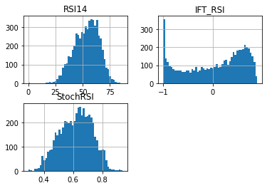
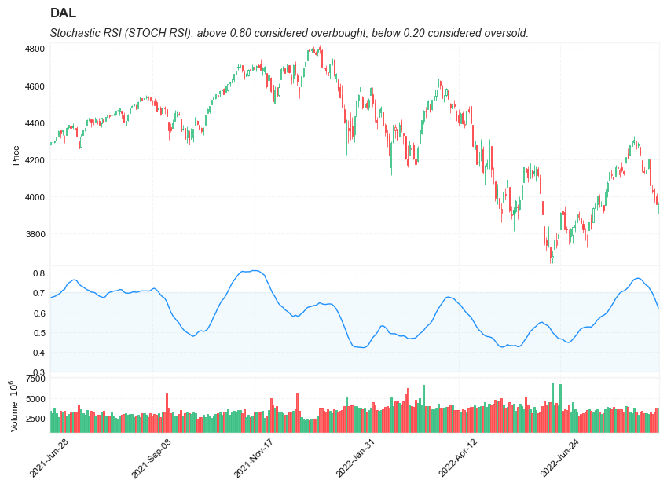
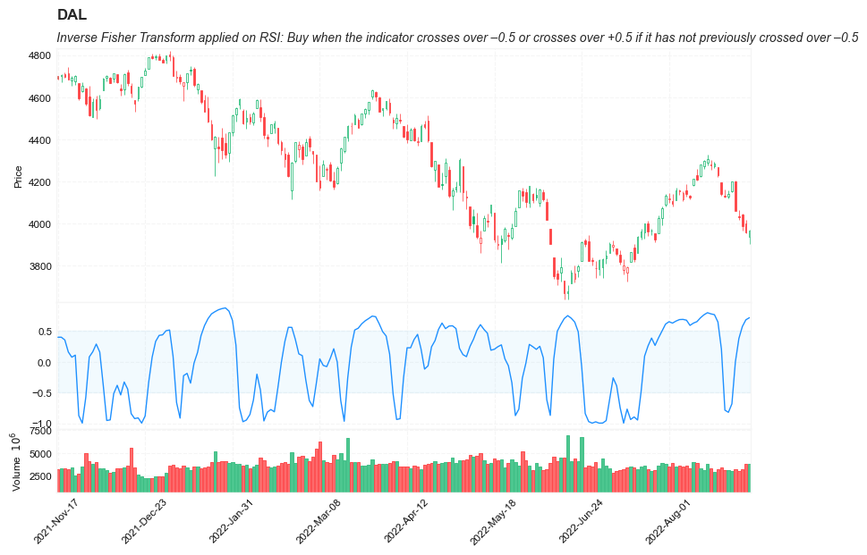

## Relative Strength Index (RSI),  Stochastic RSI (STOCH RSI), Inverse Fisher Transform applied on RSI (IFT RSI)


**References**

- [fidelity: Relative Strength Index (RSI)](https://www.fidelity.com/learning-center/trading-investing/technical-analysis/technical-indicator-guide/RSI)
- [tradingview: Relative Strength Index (RSI)](https://www.tradingview.com/support/solutions/43000502338-relative-strength-index-rsi/)
- [tradingview: Stochastic RSI (STOCH RSI)](https://www.tradingview.com/support/solutions/43000502333-stochastic-rsi-stoch-rsi/)
- [finta](https://github.com/peerchemist/finta/blob/master/finta/finta.py)
- [THE INVERSE FISHER TRANSFORM](https://www.mesasoftware.com/papers/TheInverseFisherTransform.pdf)


**Definition**

#### *Relative Strength Index (RSI)*

- The Relative Strength Index (RSI) is a momentum based oscillator used to measure the speed (velocity) and the change (magnitude) of directional price movements. 
- RSI provides a visual mean to monitor both the current and historical strength and weakness of a particular market. 
    - The strength or weakness is based on closing prices over the duration of a specified trading period creating a reliable metric of price and momentum changes.


#### *Stochastic RSI (Stoch RSI)*

- The Stochastic RSI indicator (Stoch RSI) is an indicator of an indicator. it is a measure of RSI relative to its own high/low range over a user defined period of time. 
- The Stochastic RSI is an oscillator that calculates a value between 0 and 1 which is then plotted as a line. This indicator is primarily used for identifying overbought and oversold conditions.


#### *Inverse Fisher Transform RSI (IFT RSI)*

- Modified Inverse Fisher Transform applied on RSI (IFT RSI).
    - The result of using the Inverse Fisher Transform is that the output has a very high probability of being either +1 or –1. This bipolar probability distribution makes the Inverse Fisher Transform ideal for generating an indicator that provides clear buy and sell signals
- The trading rules. 
    -  Buy when the indicator crosses over –0.5 or crosses over +0.5 if it has not previously crossed over –0.5.  
    -  sell short when the indicators crosses under +0.5 or crosses under –0.5 if it has not previously crossed under +0.5. 

   

**Calculation**

---

 `RSI = 100 – 100/ (1 + RS)`
 
  - RS = Average Gain of n days UP  / Average Loss of n days DOWN
  
  
 `Stoch RSI = (RSI - Lowest Low RSI) / (Highest High RSI - Lowest Low RSI)`


---


**Read the indicator**

#### *Relative Strength Index (RSI)*

- RSI is a momentum based oscillator that operates between a scale of 0 and 100. 
    - The closer RSI is to 0, the weaker the momentum is for price movements.
    - the closer RSI is to 100, the stronger the momentum.
- 14 days is the most popular period, however traders have been known to use a wide variety of numbers of days.


- Overbought/Oversold
    - RSI above 70 should be considered overbought 
    - RSI below 30 should be considered oversold.
    - RSI between 30 and 70 should be considered neutral
    - RSI around 50 signified “no trend”.
    - Some traders believe that Wilder’s overbought/oversold ranges are too wide and choose to alter those ranges. For example, someone might consider any number above 80 as overbought and anything below 20 as oversold. This is entirely at the trader’s discretion.
- Divergence: RSI Divergence occurs when there is a difference between what the price action is indicating and what RSI is indicating. These differences can be interpreted as an impending reversal. Specifically there are two types of divergences, bearish and bullish.
    - Bullish RSI Divergence – When price makes a new low but RSI makes a higher low.
    - Bearish RSI Divergence – When price makes a new high but RSI makes a lower high.
    - Wilder believed that Bearish Divergence creates a selling opportunity while Bullish Divergence creates a buying opportunity.
    
#### *Stochastic RSI (Stoch RSI)*

- Overbought/Oversold
    - Stoch RSI above 0.80 considered overbought  
    - Stoch RSI below 0.20 considered oversold.
    - overbought and oversold work best when trading along with the underlying trend.


 

##### Load basic packages 


```python
import pandas as pd
import numpy as np
import os
import gc
import copy
from pathlib import Path
from datetime import datetime, timedelta, time, date
```


```python
#this package is to download equity price data from yahoo finance
#the source code of this package can be found here: https://github.com/ranaroussi/yfinance/blob/main
import yfinance as yf
```


```python
pd.options.display.max_rows = 100
pd.options.display.max_columns = 100

import warnings
warnings.filterwarnings("ignore")

import pytorch_lightning as pl
random_seed=1234
pl.seed_everything(random_seed)
```

    Global seed set to 1234
    


    1234


```python
#S&P 500 (^GSPC),  Dow Jones Industrial Average (^DJI), NASDAQ Composite (^IXIC)
#Russell 2000 (^RUT), Crude Oil Nov 21 (CL=F), Gold Dec 21 (GC=F)
#Treasury Yield 10 Years (^TNX)

#benchmark_tickers = ['^GSPC', '^DJI', '^IXIC', '^RUT',  'CL=F', 'GC=F', '^TNX']

benchmark_tickers = ['^GSPC']
tickers = benchmark_tickers + ['GSK', 'NVO', 'PFE', 'DAL']
```


```python
#https://github.com/ranaroussi/yfinance/blob/main/yfinance/base.py
#     def history(self, period="1mo", interval="1d",
#                 start=None, end=None, prepost=False, actions=True,
#                 auto_adjust=True, back_adjust=False,
#                 proxy=None, rounding=False, tz=None, timeout=None, **kwargs):

dfs = {}

for ticker in tickers:
    cur_data = yf.Ticker(ticker)
    hist = cur_data.history(period="max", start='2000-01-01')
    print(datetime.now(), ticker, hist.shape, hist.index.min(), hist.index.max())
    dfs[ticker] = hist
```

    2022-09-05 18:06:57.670458 ^GSPC (5706, 7) 1999-12-31 00:00:00 2022-09-02 00:00:00
    2022-09-05 18:06:58.039240 GSK (5706, 7) 1999-12-31 00:00:00 2022-09-02 00:00:00
    2022-09-05 18:06:58.351049 NVO (5706, 7) 1999-12-31 00:00:00 2022-09-02 00:00:00
    2022-09-05 18:06:58.648695 PFE (5706, 7) 1999-12-31 00:00:00 2022-09-02 00:00:00
    2022-09-05 18:06:58.879943 DAL (3863, 7) 2007-05-03 00:00:00 2022-09-02 00:00:00
    


```python
ticker = 'DAL'
dfs[ticker].tail(5)
```


<div>
<style scoped>
    .dataframe tbody tr th:only-of-type {
        vertical-align: middle;
    }

    .dataframe tbody tr th {
        vertical-align: top;
    }

    .dataframe thead th {
        text-align: right;
    }
</style>
<table border="1" class="dataframe">
  <thead>
    <tr style="text-align: right;">
      <th></th>
      <th>Open</th>
      <th>High</th>
      <th>Low</th>
      <th>Close</th>
      <th>Volume</th>
      <th>Dividends</th>
      <th>Stock Splits</th>
    </tr>
    <tr>
      <th>Date</th>
      <th></th>
      <th></th>
      <th></th>
      <th></th>
      <th></th>
      <th></th>
      <th></th>
    </tr>
  </thead>
  <tbody>
    <tr>
      <th>2022-08-29</th>
      <td>32.200001</td>
      <td>32.349998</td>
      <td>31.850000</td>
      <td>32.029999</td>
      <td>8758400</td>
      <td>0.0</td>
      <td>0</td>
    </tr>
    <tr>
      <th>2022-08-30</th>
      <td>32.250000</td>
      <td>32.450001</td>
      <td>31.469999</td>
      <td>31.719999</td>
      <td>7506400</td>
      <td>0.0</td>
      <td>0</td>
    </tr>
    <tr>
      <th>2022-08-31</th>
      <td>31.969999</td>
      <td>32.020000</td>
      <td>31.059999</td>
      <td>31.070000</td>
      <td>7450000</td>
      <td>0.0</td>
      <td>0</td>
    </tr>
    <tr>
      <th>2022-09-01</th>
      <td>30.650000</td>
      <td>31.139999</td>
      <td>29.940001</td>
      <td>31.090000</td>
      <td>8572700</td>
      <td>0.0</td>
      <td>0</td>
    </tr>
    <tr>
      <th>2022-09-02</th>
      <td>31.440001</td>
      <td>31.830000</td>
      <td>30.700001</td>
      <td>30.940001</td>
      <td>8626500</td>
      <td>0.0</td>
      <td>0</td>
    </tr>
  </tbody>
</table>
</div>


##### Define Bollinger Bands calculation function


```python

#https://github.com/peerchemist/finta/blob/af01fa594995de78f5ada5c336e61cd87c46b151/finta/finta.py


def cal_rsi(ohlc: pd.DataFrame, period: int = 14, column: str = "close", adjust: bool = True) -> pd.Series:
    """
    
    Relative Strength Index (RSI) is a momentum oscillator that measures the speed and change of price movements.
    RSI oscillates between zero and 100. Traditionally, and according to Wilder, RSI is considered overbought when above 70 and oversold when below 30.
    Signals can also be generated by looking for divergences, failure swings and centerline crossovers.
    RSI can also be used to identify the general trend.
    
    """
    
    ## get the price diff
    delta = ohlc[column].diff()

    ## positive gains (up) and negative gains (down) Series
    up, down = delta.copy(), delta.copy()
    up[up < 0] = 0
    down[down > 0] = 0

    # EMAs of ups and downs
    _gain = up.ewm(alpha=1.0 / period, adjust=adjust).mean()
    _loss = down.abs().ewm(alpha=1.0 / period, adjust=adjust).mean()

    RS = _gain / _loss
    return pd.Series(100 - (100 / (1 + RS)), name=f"RSI{period}")

```


```python
def cal_ift_rsi(ohlc: pd.DataFrame, column: str = "close", rsi_period: int = 5, wma_period: int = 9) -> pd.Series:
    """
    Modified Inverse Fisher Transform applied on RSI.
    Suggested method to use any IFT indicator is to buy when the indicator crosses over –0.5 or crosses over +0.5
    if it has not previously crossed over –0.5 and to sell short when the indicators crosses under +0.5 or crosses under –0.5
    if it has not previously crossed under +0.5.
    
    """
    
    rsi = cal_rsi(ohlc, period=rsi_period,  column=column)
    v1 = .1 * (rsi - 50)

    # v2 = WMA(wma_period) of v1
    d = (wma_period * (wma_period + 1)) / 2  # denominator
    weights = np.arange(1, wma_period + 1)

    def linear(w):
        def _compute(x):
            return (w * x).sum() / d

        return _compute

    _wma = v1.rolling(wma_period, min_periods=wma_period)
    v2 = _wma.apply(linear(weights), raw=True)

    ift = pd.Series(((v2 ** 2 - 1) / (v2 ** 2 + 1)), name="IFT_RSI")

    return ift

def cal_stoch_rsi(ohlc: pd.DataFrame, column: str = "close", rsi_period: int = 14, stoch_period: int = 14) -> pd.Series:
    
        """
        stochastic RSI (StochRSI) is an oscillator that measures the level of RSI relative to its high-low range over a set time period.
        StochRSI applies the Stochastics formula to RSI values, instead of price values. This makes it an indicator of an indicator.
        The result is an oscillator that fluctuates between 0 and 1.
        
        """

        rsi = cal_rsi(ohlc, column=column,  period=rsi_period)
        stoch_rsi = ((rsi - rsi.min()) / (rsi.max() - rsi.min())).rolling(window=stoch_period).mean()
        
        return pd.Series(stoch_rsi, name="StochRSI")
```

##### Calculate MAMA


```python
df = dfs['^GSPC'][['Open', 'High', 'Low', 'Close', 'Volume']]
```


```python
df = df.round(2)
```


```python
cal_rsi
```


    <function __main__.cal_rsi(ohlc: pandas.core.frame.DataFrame, period: int = 14, column: str = 'close', adjust: bool = True) -> pandas.core.series.Series>


```python
df_ta = cal_rsi(df, period = 14, column = 'Close')
df = df.merge(df_ta, left_index = True, right_index = True, how='inner' )

del df_ta
gc.collect()
```


    122


```python
cal_ift_rsi
```


    <function __main__.cal_ift_rsi(ohlc: pandas.core.frame.DataFrame, column: str = 'close', rsi_period: int = 5, wma_period: int = 9) -> pandas.core.series.Series>


```python
df_ta = cal_ift_rsi(df, column = 'Close')
df = df.merge(df_ta, left_index = True, right_index = True, how='inner' )

del df_ta
gc.collect()
```


    42


```python
cal_stoch_rsi
```


    <function __main__.cal_stoch_rsi(ohlc: pandas.core.frame.DataFrame, column: str = 'close', rsi_period: int = 14, stoch_period: int = 14) -> pandas.core.series.Series>


```python
df_ta = cal_stoch_rsi(df, column = 'Close', rsi_period = 14, stoch_period = 14)
df = df.merge(df_ta, left_index = True, right_index = True, how='inner' )

del df_ta
gc.collect()
```


    42


```python
display(df.head(5))
display(df.tail(5))
```


<div>
<style scoped>
    .dataframe tbody tr th:only-of-type {
        vertical-align: middle;
    }

    .dataframe tbody tr th {
        vertical-align: top;
    }

    .dataframe thead th {
        text-align: right;
    }
</style>
<table border="1" class="dataframe">
  <thead>
    <tr style="text-align: right;">
      <th></th>
      <th>Open</th>
      <th>High</th>
      <th>Low</th>
      <th>Close</th>
      <th>Volume</th>
      <th>RSI14</th>
      <th>IFT_RSI</th>
      <th>StochRSI</th>
    </tr>
    <tr>
      <th>Date</th>
      <th></th>
      <th></th>
      <th></th>
      <th></th>
      <th></th>
      <th></th>
      <th></th>
      <th></th>
    </tr>
  </thead>
  <tbody>
    <tr>
      <th>1999-12-31</th>
      <td>1464.47</td>
      <td>1472.42</td>
      <td>1458.19</td>
      <td>1469.25</td>
      <td>374050000</td>
      <td>NaN</td>
      <td>NaN</td>
      <td>NaN</td>
    </tr>
    <tr>
      <th>2000-01-03</th>
      <td>1469.25</td>
      <td>1478.00</td>
      <td>1438.36</td>
      <td>1455.22</td>
      <td>931800000</td>
      <td>0.000000</td>
      <td>NaN</td>
      <td>NaN</td>
    </tr>
    <tr>
      <th>2000-01-04</th>
      <td>1455.22</td>
      <td>1455.22</td>
      <td>1397.43</td>
      <td>1399.42</td>
      <td>1009000000</td>
      <td>0.000000</td>
      <td>NaN</td>
      <td>NaN</td>
    </tr>
    <tr>
      <th>2000-01-05</th>
      <td>1399.42</td>
      <td>1413.27</td>
      <td>1377.68</td>
      <td>1402.11</td>
      <td>1085500000</td>
      <td>4.038943</td>
      <td>NaN</td>
      <td>NaN</td>
    </tr>
    <tr>
      <th>2000-01-06</th>
      <td>1402.11</td>
      <td>1411.90</td>
      <td>1392.10</td>
      <td>1403.45</td>
      <td>1092300000</td>
      <td>6.074065</td>
      <td>NaN</td>
      <td>NaN</td>
    </tr>
  </tbody>
</table>
</div>


<div>
<style scoped>
    .dataframe tbody tr th:only-of-type {
        vertical-align: middle;
    }

    .dataframe tbody tr th {
        vertical-align: top;
    }

    .dataframe thead th {
        text-align: right;
    }
</style>
<table border="1" class="dataframe">
  <thead>
    <tr style="text-align: right;">
      <th></th>
      <th>Open</th>
      <th>High</th>
      <th>Low</th>
      <th>Close</th>
      <th>Volume</th>
      <th>RSI14</th>
      <th>IFT_RSI</th>
      <th>StochRSI</th>
    </tr>
    <tr>
      <th>Date</th>
      <th></th>
      <th></th>
      <th></th>
      <th></th>
      <th></th>
      <th></th>
      <th></th>
      <th></th>
    </tr>
  </thead>
  <tbody>
    <tr>
      <th>2022-08-29</th>
      <td>4034.58</td>
      <td>4062.99</td>
      <td>4017.42</td>
      <td>4030.61</td>
      <td>2963020000</td>
      <td>41.911634</td>
      <td>0.378028</td>
      <td>0.697439</td>
    </tr>
    <tr>
      <th>2022-08-30</th>
      <td>4041.25</td>
      <td>4044.98</td>
      <td>3965.21</td>
      <td>3986.16</td>
      <td>3190580000</td>
      <td>38.820090</td>
      <td>0.574336</td>
      <td>0.673621</td>
    </tr>
    <tr>
      <th>2022-08-31</th>
      <td>4000.67</td>
      <td>4015.37</td>
      <td>3954.53</td>
      <td>3955.00</td>
      <td>3797860000</td>
      <td>36.772360</td>
      <td>0.682515</td>
      <td>0.648440</td>
    </tr>
    <tr>
      <th>2022-09-01</th>
      <td>3936.73</td>
      <td>3970.23</td>
      <td>3903.65</td>
      <td>3966.85</td>
      <td>3754570000</td>
      <td>38.109406</td>
      <td>0.716614</td>
      <td>0.620783</td>
    </tr>
    <tr>
      <th>2022-09-02</th>
      <td>3994.66</td>
      <td>4018.43</td>
      <td>3906.21</td>
      <td>3924.26</td>
      <td>4134920000</td>
      <td>35.226179</td>
      <td>0.752521</td>
      <td>0.589997</td>
    </tr>
  </tbody>
</table>
</div>


```python
df[['RSI14', 'IFT_RSI', 'StochRSI']].hist(bins=50)
```


    array([[<AxesSubplot:title={'center':'RSI14'}>,
            <AxesSubplot:title={'center':'IFT_RSI'}>],
           [<AxesSubplot:title={'center':'StochRSI'}>, <AxesSubplot:>]],
          dtype=object)


    

    


```python
#https://github.com/matplotlib/mplfinance
#this package help visualize financial data
import mplfinance as mpf
import matplotlib.colors as mcolors

# all_colors = list(mcolors.CSS4_COLORS.keys())#"CSS Colors"
# all_colors = list(mcolors.TABLEAU_COLORS.keys()) # "Tableau Palette",
all_colors = ['dodgerblue', 'firebrick','limegreen','skyblue','lightgreen',  'navy','yellow','plum',  'yellowgreen']
# all_colors = list(mcolors.BASE_COLORS.keys()) #"Base Colors",


#https://github.com/matplotlib/mplfinance/issues/181#issuecomment-667252575
#list of colors: https://matplotlib.org/stable/gallery/color/named_colors.html
#https://github.com/matplotlib/mplfinance/blob/master/examples/styles.ipynb

def make_3panels2(main_data, mid_panel, chart_type='candle', names=None, 
                  figratio=(14,9), fill_weights = (0, 0)):
    """
    main chart type: default is candle. alternatives: ohlc, line

    example:
    start = 200

    names = {'main_title': 'MAMA: MESA Adaptive Moving Average', 
             'sub_tile': 'S&P 500 (^GSPC)', 'y_tiles': ['price', 'Volume [$10^{6}$]']}


    make_candle(df.iloc[-start:, :5], df.iloc[-start:][['MAMA', 'FAMA']], names = names)
    
    """

    style = mpf.make_mpf_style(base_mpf_style='yahoo',  #charles
                               base_mpl_style = 'seaborn-whitegrid',
#                                marketcolors=mpf.make_marketcolors(up="r", down="#0000CC",inherit=True),
                               gridcolor="whitesmoke", 
                               gridstyle="--", #or None, or - for solid
                               gridaxis="both", 
                               edgecolor = 'whitesmoke',
                               facecolor = 'white', #background color within the graph edge
                               figcolor = 'white', #background color outside of the graph edge
                               y_on_right = False,
                               rc =  {'legend.fontsize': 'small',#or number
                                      #'figure.figsize': (14, 9),
                                     'axes.labelsize': 'small',
                                     'axes.titlesize':'small',
                                     'xtick.labelsize':'small',#'x-small', 'small','medium','large'
                                     'ytick.labelsize':'small'
                                     }, 
                              )   

    if (chart_type is None) or (chart_type not in ['ohlc', 'line', 'candle', 'hollow_and_filled']):
        chart_type = 'candle'
    len_dict = {'candle':2, 'ohlc':3, 'line':1, 'hollow_and_filled':2}    
        
    kwargs = dict(type=chart_type, figratio=figratio, volume=True, volume_panel=2, 
                  panel_ratios=(4,2,1), tight_layout=True, style=style, returnfig=True)
    
    if names is None:
        names = {'main_title': '', 'sub_tile': ''}
    


    added_plots = { }
  
    fb_bbands2_ = dict(y1=fill_weights[0]*np.ones(mid_panel.shape[0]),
                      y2=fill_weights[1]*np.ones(mid_panel.shape[0]),color="lightskyblue",alpha=0.1,interpolate=True)
    fb_bbands2_['panel'] = 1

    fb_bbands= [fb_bbands2_]
    
    
    i = 0
    for name_, data_ in mid_panel.iteritems():
        added_plots[name_] = mpf.make_addplot(data_, panel=1, width=1, color=all_colors[i], secondary_y=False)
        i = i + 1
    

    fig, axes = mpf.plot(main_data,  **kwargs,
                         addplot=list(added_plots.values()), 
                         fill_between=fb_bbands)
    # add a new suptitle
    fig.suptitle(names['main_title'], y=1.05, fontsize=12, x=0.1285)

    axes[0].set_title(names['sub_tile'], fontsize=10, style='italic',  loc='left')
#     axes[2].set_ylabel('WAVEPM10')

#     axes[0].set_ylabel(names['y_tiles'][0])
#     axes[2].set_ylabel(names['y_tiles'][1])
    return fig, axes
   
```


```python
w
```


    

    


```python

start = -300
end = -1

names = {'main_title': f'{ticker}', 
         'sub_tile': 'Stochastic RSI (STOCH RSI): above 0.80 considered overbought; below 0.20 considered oversold.'}


aa_, bb_ = make_3panels2(df.iloc[start:end][['Open', 'High', 'Low', 'Close', 'Volume']], 
             df.iloc[start:end][['StochRSI']], 
             chart_type='hollow_and_filled',names = names, 
                         fill_weights = (0.3, 0.7))
```


    

    


```python

start = -200
end = -1

names = {'main_title': f'{ticker}', 
         'sub_tile': 'Inverse Fisher Transform applied on RSI: Buy when the indicator crosses over –0.5 or crosses over +0.5 if it has not previously crossed over –0.5'}


aa_, bb_ = make_3panels2(df.iloc[start:end][['Open', 'High', 'Low', 'Close', 'Volume']], 
             df.iloc[start:end][['IFT_RSI']], 
             chart_type='hollow_and_filled',names = names, 
                         fill_weights = (-0.5, 0.5))
```


    

    

