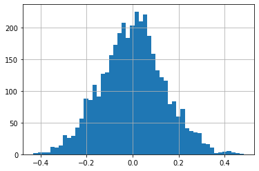
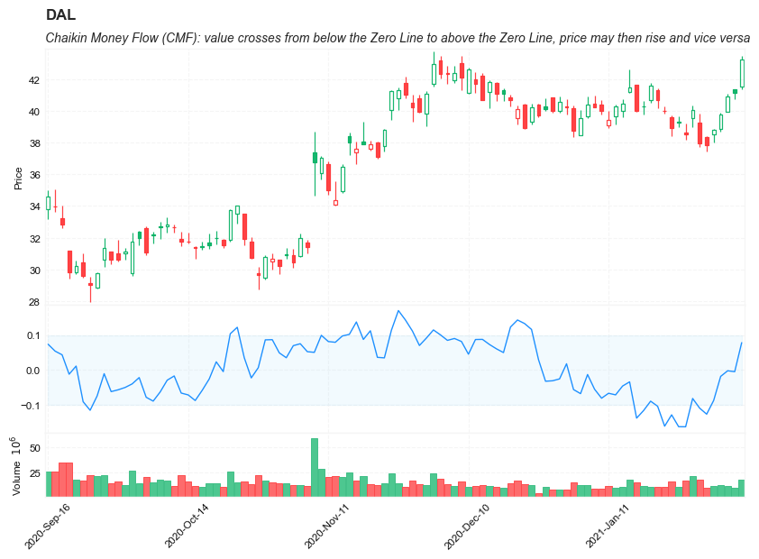

## Chaikin Money Flow (CMF)

**References**


- [fidelity: Chaikin Money Flow (CMF)](https://www.fidelity.com/learning-center/trading-investing/technical-analysis/technical-indicator-guide/cmf)
- [tradingview: Chaikin Money Flow (CMF)](https://www.tradingview.com/support/solutions/43000501974-chaikin-money-flow-cmf/)


**Definition**

- Chaikin Money Flow (CMF) was developed by *Marc Chaikin*.
- CMF is a volume-weighted average of accumulation and distribution over a specified period. 
- CMF can be used as a way to further quantify changes in buying and selling pressure and can help to anticipate future changes and therefore trading opportunities.
- The standard CMF period is 21 days. 
- The principle behind the Chaikin Money Flow is the nearer the closing price is to the high, the more accumulation has taken place. Conversely, the nearer the closing price is to the low, the more distribution has taken place. 
- Chaikin Money Flow's Value fluctuates between 1 and -1. 
    - If the price action consistently closes above the bar's midpoint on increasing volume, the Chaikin Money Flow will be positive. 
    - if the price action consistently closes below the bar's midpoint on increasing volume, the Chaikin Money Flow will be a negative value.
    

**Calculation**

---

The calculation for Chaikin Money Flow (CMF) has three distinct steps, the following example is for a 21 Period CMF:


1. Find the Money Flow Multiplier

    `Money Flow Multiplier = [(Close  -  Low) - (High - Close)] /(High - Low)`

2. Calculate Money Flow Volume

    `Money Flow Volume = Money Flow Multiplier x Volume for the Period`

3. Calculate The CMF

    `21 Period CMF = 21 Period Sum of Money Flow Volume / 21 Period Sum of Volume`

---

**Read the indicator**


- Chaikin's Money Flow's value fluctuates between 1 and -1. The basic interpretation is:
    - When CMF is closer to 1, buying pressure is higher.
    - When CMF is closer to -1, selling pressure is higher.

- **Trend Confirmation**
    - Buying and Selling Pressure can be a good way to confirm an ongoing trend. This can give the trader an added level of confidence that the current trend is likely to continue.
        - During a Bullish Trend, continuous Buying Pressure (Chaikin Money Flow values above 0) can indicate that prices will continue to rise.
        - During a Bearish Trend, continuous Selling Pressure (Chaikin Money Flow values below 0) can indicate that prices will continue to fall.

- **Crosses**
    - When Chaikin Money Flow crosses the Zero Line, this can be an indication that there is an impending trend reversal.
        - Bullish Crosses occur when Chaikin Money Flow crosses from below the Zero Line to above the Zero Line. Price then rises.
        - Bearish Crosses occur when Chaikin Money Flow crosses from above the Zero Line to below the Zero Line. Price then falls.
   

##### Load basic packages 


```python
import pandas as pd
import numpy as np
import os
import gc
import copy
from pathlib import Path
from datetime import datetime, timedelta, time, date
```


```python
#this package is to download equity price data from yahoo finance
#the source code of this package can be found here: https://github.com/ranaroussi/yfinance/blob/main
import yfinance as yf
```


```python
pd.options.display.max_rows = 100
pd.options.display.max_columns = 100

import warnings
warnings.filterwarnings("ignore")

import pytorch_lightning as pl
random_seed=1234
pl.seed_everything(random_seed)
```

    Global seed set to 1234
    


    1234


```python
#S&P 500 (^GSPC),  Dow Jones Industrial Average (^DJI), NASDAQ Composite (^IXIC)
#Russell 2000 (^RUT), Crude Oil Nov 21 (CL=F), Gold Dec 21 (GC=F)
#Treasury Yield 10 Years (^TNX)

#benchmark_tickers = ['^GSPC', '^DJI', '^IXIC', '^RUT',  'CL=F', 'GC=F', '^TNX']

benchmark_tickers = ['^GSPC']
tickers = benchmark_tickers + ['GSK', 'NVO', 'PFE', 'DAL']
```


```python
#https://github.com/ranaroussi/yfinance/blob/main/yfinance/base.py
#     def history(self, period="1mo", interval="1d",
#                 start=None, end=None, prepost=False, actions=True,
#                 auto_adjust=True, back_adjust=False,
#                 proxy=None, rounding=False, tz=None, timeout=None, **kwargs):

dfs = {}

for ticker in tickers:
    cur_data = yf.Ticker(ticker)
    hist = cur_data.history(period="max", start='2000-01-01')
    print(datetime.now(), ticker, hist.shape, hist.index.min(), hist.index.max())
    dfs[ticker] = hist
```

    2022-09-10 21:48:05.868523 ^GSPC (5710, 7) 1999-12-31 00:00:00 2022-09-09 00:00:00
    2022-09-10 21:48:06.229646 GSK (5710, 7) 1999-12-31 00:00:00 2022-09-09 00:00:00
    2022-09-10 21:48:06.603306 NVO (5710, 7) 1999-12-31 00:00:00 2022-09-09 00:00:00
    2022-09-10 21:48:07.087354 PFE (5710, 7) 1999-12-31 00:00:00 2022-09-09 00:00:00
    2022-09-10 21:48:07.410292 DAL (3867, 7) 2007-05-03 00:00:00 2022-09-09 00:00:00
    


```python
ticker = 'DAL'
dfs[ticker].tail(5)
```


<div>
<style scoped>
    .dataframe tbody tr th:only-of-type {
        vertical-align: middle;
    }

    .dataframe tbody tr th {
        vertical-align: top;
    }

    .dataframe thead th {
        text-align: right;
    }
</style>
<table border="1" class="dataframe">
  <thead>
    <tr style="text-align: right;">
      <th></th>
      <th>Open</th>
      <th>High</th>
      <th>Low</th>
      <th>Close</th>
      <th>Volume</th>
      <th>Dividends</th>
      <th>Stock Splits</th>
    </tr>
    <tr>
      <th>Date</th>
      <th></th>
      <th></th>
      <th></th>
      <th></th>
      <th></th>
      <th></th>
      <th></th>
    </tr>
  </thead>
  <tbody>
    <tr>
      <th>2022-09-02</th>
      <td>31.440001</td>
      <td>31.830000</td>
      <td>30.700001</td>
      <td>30.940001</td>
      <td>8626500</td>
      <td>0.0</td>
      <td>0</td>
    </tr>
    <tr>
      <th>2022-09-06</th>
      <td>31.340000</td>
      <td>31.650000</td>
      <td>30.660000</td>
      <td>31.190001</td>
      <td>7630800</td>
      <td>0.0</td>
      <td>0</td>
    </tr>
    <tr>
      <th>2022-09-07</th>
      <td>31.290001</td>
      <td>32.340000</td>
      <td>31.270000</td>
      <td>32.230000</td>
      <td>9035900</td>
      <td>0.0</td>
      <td>0</td>
    </tr>
    <tr>
      <th>2022-09-08</th>
      <td>31.719999</td>
      <td>32.490002</td>
      <td>31.549999</td>
      <td>32.119999</td>
      <td>11085400</td>
      <td>0.0</td>
      <td>0</td>
    </tr>
    <tr>
      <th>2022-09-09</th>
      <td>32.430000</td>
      <td>32.759998</td>
      <td>32.240002</td>
      <td>32.660000</td>
      <td>10958900</td>
      <td>0.0</td>
      <td>0</td>
    </tr>
  </tbody>
</table>
</div>


##### Define Chaikin Money Flow (CMF) calculation function


```python
#https://github.com/peerchemist/finta/blob/af01fa594995de78f5ada5c336e61cd87c46b151/finta/finta.py
#https://www.tradingview.com/support/solutions/43000501974-chaikin-money-flow-cmf/


def cal_cmf(ohlc: pd.DataFrame, period: int = 21) -> pd.Series:
    
    """
    1. Find the Money Flow Multiplier
    Money Flow Multiplier = [(Close  -  Low) - (High - Close)] /(High - Low)
    2. Calculate Money Flow Volume
    Money Flow Volume = Money Flow Multiplier x Volume for the Period
    3. Calculate The CMF
    21 Period CMF = 21 Period Sum of Money Flow Volume / 21 Period Sum of Volume
    
    """
    
    ohlc = ohlc.copy()
    ohlc.columns = [c.lower() for c in ohlc.columns]
    
    MFM = pd.Series(
        ((ohlc["close"] - ohlc["low"])
        - (ohlc["high"] - ohlc["close"])) / (ohlc["high"] - ohlc["low"]),
        name="MFM",
    )  # Money flow multiplier
    
    MFV = pd.Series(MFM * ohlc["volume"], name="MFV")
    CMF = MFV.rolling(window=period).sum()/ohlc["volume"].rolling(window=period).sum()
    
    return pd.Series(CMF, name=f"CMF{period}")

```

##### Calculate CMF


```python
df = dfs[ticker][['Open', 'High', 'Low', 'Close', 'Volume']]
```


```python
df = df.round(2)
```


```python
cal_cmf
```


    <function __main__.cal_cmf(ohlc: pandas.core.frame.DataFrame, period: int = 21) -> pandas.core.series.Series>


```python
df_ta = cal_cmf(df, period = 21)
df = df.merge(df_ta, left_index = True, right_index = True, how='inner' )

del df_ta
gc.collect()
```


    122


```python
display(df.head(5))
display(df.tail(5))
```


<div>
<style scoped>
    .dataframe tbody tr th:only-of-type {
        vertical-align: middle;
    }

    .dataframe tbody tr th {
        vertical-align: top;
    }

    .dataframe thead th {
        text-align: right;
    }
</style>
<table border="1" class="dataframe">
  <thead>
    <tr style="text-align: right;">
      <th></th>
      <th>Open</th>
      <th>High</th>
      <th>Low</th>
      <th>Close</th>
      <th>Volume</th>
      <th>CMF21</th>
    </tr>
    <tr>
      <th>Date</th>
      <th></th>
      <th></th>
      <th></th>
      <th></th>
      <th></th>
      <th></th>
    </tr>
  </thead>
  <tbody>
    <tr>
      <th>2007-05-03</th>
      <td>19.32</td>
      <td>19.50</td>
      <td>18.25</td>
      <td>18.40</td>
      <td>8052800</td>
      <td>NaN</td>
    </tr>
    <tr>
      <th>2007-05-04</th>
      <td>18.88</td>
      <td>18.96</td>
      <td>18.39</td>
      <td>18.64</td>
      <td>5437300</td>
      <td>NaN</td>
    </tr>
    <tr>
      <th>2007-05-07</th>
      <td>18.83</td>
      <td>18.91</td>
      <td>17.94</td>
      <td>18.08</td>
      <td>2646300</td>
      <td>NaN</td>
    </tr>
    <tr>
      <th>2007-05-08</th>
      <td>17.76</td>
      <td>17.76</td>
      <td>17.14</td>
      <td>17.44</td>
      <td>4166100</td>
      <td>NaN</td>
    </tr>
    <tr>
      <th>2007-05-09</th>
      <td>17.54</td>
      <td>17.94</td>
      <td>17.44</td>
      <td>17.58</td>
      <td>7541100</td>
      <td>NaN</td>
    </tr>
  </tbody>
</table>
</div>


<div>
<style scoped>
    .dataframe tbody tr th:only-of-type {
        vertical-align: middle;
    }

    .dataframe tbody tr th {
        vertical-align: top;
    }

    .dataframe thead th {
        text-align: right;
    }
</style>
<table border="1" class="dataframe">
  <thead>
    <tr style="text-align: right;">
      <th></th>
      <th>Open</th>
      <th>High</th>
      <th>Low</th>
      <th>Close</th>
      <th>Volume</th>
      <th>CMF21</th>
    </tr>
    <tr>
      <th>Date</th>
      <th></th>
      <th></th>
      <th></th>
      <th></th>
      <th></th>
      <th></th>
    </tr>
  </thead>
  <tbody>
    <tr>
      <th>2022-09-02</th>
      <td>31.44</td>
      <td>31.83</td>
      <td>30.70</td>
      <td>30.94</td>
      <td>8626500</td>
      <td>-0.068544</td>
    </tr>
    <tr>
      <th>2022-09-06</th>
      <td>31.34</td>
      <td>31.65</td>
      <td>30.66</td>
      <td>31.19</td>
      <td>7630800</td>
      <td>-0.043196</td>
    </tr>
    <tr>
      <th>2022-09-07</th>
      <td>31.29</td>
      <td>32.34</td>
      <td>31.27</td>
      <td>32.23</td>
      <td>9035900</td>
      <td>-0.008105</td>
    </tr>
    <tr>
      <th>2022-09-08</th>
      <td>31.72</td>
      <td>32.49</td>
      <td>31.55</td>
      <td>32.12</td>
      <td>11085400</td>
      <td>0.001481</td>
    </tr>
    <tr>
      <th>2022-09-09</th>
      <td>32.43</td>
      <td>32.76</td>
      <td>32.24</td>
      <td>32.66</td>
      <td>10958900</td>
      <td>0.093729</td>
    </tr>
  </tbody>
</table>
</div>


```python
df['CMF21'].hist(bins=50)
```


    <AxesSubplot:>


    

    


```python
#https://github.com/matplotlib/mplfinance
#this package help visualize financial data
import mplfinance as mpf
import matplotlib.colors as mcolors

# all_colors = list(mcolors.CSS4_COLORS.keys())#"CSS Colors"
# all_colors = list(mcolors.TABLEAU_COLORS.keys()) # "Tableau Palette",
all_colors = ['dodgerblue', 'firebrick','limegreen','skyblue','lightgreen',  'navy','yellow','plum',  'yellowgreen']
# all_colors = list(mcolors.BASE_COLORS.keys()) #"Base Colors",


#https://github.com/matplotlib/mplfinance/issues/181#issuecomment-667252575
#list of colors: https://matplotlib.org/stable/gallery/color/named_colors.html
#https://github.com/matplotlib/mplfinance/blob/master/examples/styles.ipynb

def make_3panels2(main_data, mid_panel, chart_type='candle', names=None, 
                  figratio=(14,9), fill_weights = (0, 0)):
    """
    main chart type: default is candle. alternatives: ohlc, line

    example:
    start = 200

    names = {'main_title': 'MAMA: MESA Adaptive Moving Average', 
             'sub_tile': 'S&P 500 (^GSPC)', 'y_tiles': ['price', 'Volume [$10^{6}$]']}


    make_candle(df.iloc[-start:, :5], df.iloc[-start:][['MAMA', 'FAMA']], names = names)
    
    """

    style = mpf.make_mpf_style(base_mpf_style='yahoo',  #charles
                               base_mpl_style = 'seaborn-whitegrid',
#                                marketcolors=mpf.make_marketcolors(up="r", down="#0000CC",inherit=True),
                               gridcolor="whitesmoke", 
                               gridstyle="--", #or None, or - for solid
                               gridaxis="both", 
                               edgecolor = 'whitesmoke',
                               facecolor = 'white', #background color within the graph edge
                               figcolor = 'white', #background color outside of the graph edge
                               y_on_right = False,
                               rc =  {'legend.fontsize': 'small',#or number
                                      #'figure.figsize': (14, 9),
                                     'axes.labelsize': 'small',
                                     'axes.titlesize':'small',
                                     'xtick.labelsize':'small',#'x-small', 'small','medium','large'
                                     'ytick.labelsize':'small'
                                     }, 
                              )   

    if (chart_type is None) or (chart_type not in ['ohlc', 'line', 'candle', 'hollow_and_filled']):
        chart_type = 'candle'
    len_dict = {'candle':2, 'ohlc':3, 'line':1, 'hollow_and_filled':2}    
        
    kwargs = dict(type=chart_type, figratio=figratio, volume=True, volume_panel=2, 
                  panel_ratios=(4,2,1), tight_layout=True, style=style, returnfig=True)
    
    if names is None:
        names = {'main_title': '', 'sub_tile': ''}
    


    added_plots = { }
  
    fb_bbands2_ = dict(y1=fill_weights[0]*np.ones(mid_panel.shape[0]),
                      y2=fill_weights[1]*np.ones(mid_panel.shape[0]),color="lightskyblue",alpha=0.1,interpolate=True)
    fb_bbands2_['panel'] = 1

    fb_bbands= [fb_bbands2_]
    
    
    i = 0
    for name_, data_ in mid_panel.iteritems():
        added_plots[name_] = mpf.make_addplot(data_, panel=1, width=1, color=all_colors[i], secondary_y=False)
        i = i + 1
    

    fig, axes = mpf.plot(main_data,  **kwargs,
                         addplot=list(added_plots.values()), 
                         fill_between=fb_bbands)
    # add a new suptitle
    fig.suptitle(names['main_title'], y=1.05, fontsize=12, x=0.1285)

    axes[0].set_title(names['sub_tile'], fontsize=10, style='italic',  loc='left')
#     axes[2].set_ylabel('WAVEPM10')

#     axes[0].set_ylabel(names['y_tiles'][0])
#     axes[2].set_ylabel(names['y_tiles'][1])
    return fig, axes
   
```


```python

start = -500
end = -400

names = {'main_title': f'{ticker}', 
         'sub_tile': 'Chaikin Money Flow (CMF): value crosses from below the Zero Line to above the Zero Line, price may then rise and vice versa'}


aa_, bb_ = make_3panels2(df.iloc[start:end][['Open', 'High', 'Low', 'Close', 'Volume']], 
             df.iloc[start:end][['CMF21']], 
             chart_type='hollow_and_filled',names = names, 
                         fill_weights = (-0.1, 0.1))
```


    

    

