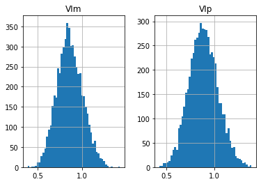

## The Vortex Indicator 

**References**

- [tradingview: Vortex](https://www.tradingview.com/support/solutions/43000591352-vortex-indicator/)
- [traders.com: TradersTips Vortex Indicator 2010-01](https://traders.com/Documentation/FEEDbk_docs/2010/01/TradersTips.html)

**Definition**

Etienne Botes and Douglas Siepman’s article in this issue, “The Vortex Indicator,” describes an indicator intended to identify price trends. The authors include some trading rules. Code for the indicator and for a strategy based on the trading rules is shown here.

Both the indicator and strategy use a parameter named length to define the number of price bars over which to perform certain calculations. The strategy also uses a trailing stop factor, which is the number of average true ranges at which to trail an exit stop order.

##### Load basic packages 


```python
import pandas as pd
import numpy as np
import os
import gc
import copy
from pathlib import Path
from datetime import datetime, timedelta, time, date
```


```python
#this package is to download equity price data from yahoo finance
#the source code of this package can be found here: https://github.com/ranaroussi/yfinance/blob/main
import yfinance as yf
```


```python
pd.options.display.max_rows = 100
pd.options.display.max_columns = 100

import warnings
warnings.filterwarnings("ignore")

import pytorch_lightning as pl
random_seed=1234
pl.seed_everything(random_seed)
```

    Global seed set to 1234
    


    1234


```python
#S&P 500 (^GSPC),  Dow Jones Industrial Average (^DJI), NASDAQ Composite (^IXIC)
#Russell 2000 (^RUT), Crude Oil Nov 21 (CL=F), Gold Dec 21 (GC=F)
#Treasury Yield 10 Years (^TNX)

#benchmark_tickers = ['^GSPC', '^DJI', '^IXIC', '^RUT',  'CL=F', 'GC=F', '^TNX']

benchmark_tickers = ['^GSPC']
tickers = benchmark_tickers + ['GSK', 'NVO', 'PFE', 'DAL']
```


```python
#https://github.com/ranaroussi/yfinance/blob/main/yfinance/base.py
#     def history(self, period="1mo", interval="1d",
#                 start=None, end=None, prepost=False, actions=True,
#                 auto_adjust=True, back_adjust=False,
#                 proxy=None, rounding=False, tz=None, timeout=None, **kwargs):

dfs = {}

for ticker in tickers:
    cur_data = yf.Ticker(ticker)
    hist = cur_data.history(period="max", start='2000-01-01')
    print(datetime.now(), ticker, hist.shape, hist.index.min(), hist.index.max())
    dfs[ticker] = hist
```

    2022-09-05 18:17:14.099705 ^GSPC (5706, 7) 1999-12-31 00:00:00 2022-09-02 00:00:00
    2022-09-05 18:17:14.388874 GSK (5706, 7) 1999-12-31 00:00:00 2022-09-02 00:00:00
    2022-09-05 18:17:14.750370 NVO (5706, 7) 1999-12-31 00:00:00 2022-09-02 00:00:00
    2022-09-05 18:17:15.098310 PFE (5706, 7) 1999-12-31 00:00:00 2022-09-02 00:00:00
    2022-09-05 18:17:15.405611 DAL (3863, 7) 2007-05-03 00:00:00 2022-09-02 00:00:00
    


```python
ticker = 'GSK'
dfs[ticker].tail(5)
```


<div>
<style scoped>
    .dataframe tbody tr th:only-of-type {
        vertical-align: middle;
    }

    .dataframe tbody tr th {
        vertical-align: top;
    }

    .dataframe thead th {
        text-align: right;
    }
</style>
<table border="1" class="dataframe">
  <thead>
    <tr style="text-align: right;">
      <th></th>
      <th>Open</th>
      <th>High</th>
      <th>Low</th>
      <th>Close</th>
      <th>Volume</th>
      <th>Dividends</th>
      <th>Stock Splits</th>
    </tr>
    <tr>
      <th>Date</th>
      <th></th>
      <th></th>
      <th></th>
      <th></th>
      <th></th>
      <th></th>
      <th></th>
    </tr>
  </thead>
  <tbody>
    <tr>
      <th>2022-08-29</th>
      <td>33.080002</td>
      <td>33.230000</td>
      <td>32.980000</td>
      <td>33.110001</td>
      <td>3794600</td>
      <td>0.0</td>
      <td>0.0</td>
    </tr>
    <tr>
      <th>2022-08-30</th>
      <td>33.230000</td>
      <td>33.290001</td>
      <td>32.919998</td>
      <td>32.959999</td>
      <td>3994500</td>
      <td>0.0</td>
      <td>0.0</td>
    </tr>
    <tr>
      <th>2022-08-31</th>
      <td>32.790001</td>
      <td>32.880001</td>
      <td>32.459999</td>
      <td>32.480000</td>
      <td>4291800</td>
      <td>0.0</td>
      <td>0.0</td>
    </tr>
    <tr>
      <th>2022-09-01</th>
      <td>31.830000</td>
      <td>31.990000</td>
      <td>31.610001</td>
      <td>31.690001</td>
      <td>12390900</td>
      <td>0.0</td>
      <td>0.0</td>
    </tr>
    <tr>
      <th>2022-09-02</th>
      <td>31.600000</td>
      <td>31.969999</td>
      <td>31.469999</td>
      <td>31.850000</td>
      <td>8152600</td>
      <td>0.0</td>
      <td>0.0</td>
    </tr>
  </tbody>
</table>
</div>


##### Define Vortex Indicator calculation function


```python

#https://github.com/peerchemist/finta/blob/af01fa594995de78f5ada5c336e61cd87c46b151/finta/finta.py

def cal_tr(ohlc: pd.DataFrame) -> pd.Series:
    """True Range is the maximum of three price ranges.
    Most recent period's high minus the most recent period's low.
    Absolute value of the most recent period's high minus the previous close.
    Absolute value of the most recent period's low minus the previous close."""

    TR1 = pd.Series(ohlc["high"] - ohlc["low"]).abs()  # True Range = High less Low

    TR2 = pd.Series(
        ohlc["high"] - ohlc["close"].shift()
    ).abs()  # True Range = High less Previous Close

    TR3 = pd.Series(
        ohlc["close"].shift() - ohlc["low"]
    ).abs()  # True Range = Previous Close less Low

    _TR = pd.concat([TR1, TR2, TR3], axis=1)

    _TR["TR"] = _TR.max(axis=1)

    return pd.Series(_TR["TR"], name="TR")


def cal_vortex(ohlc: pd.DataFrame, period: int = 14) -> pd.DataFrame:
    """The Vortex indicator plots two oscillating lines, one to identify positive trend movement and the other
     to identify negative price movement.
     Indicator construction revolves around the highs and lows of the last two days or periods.
     The distance from the current high to the prior low designates positive trend movement while the
     distance between the current low and the prior high designates negative trend movement.
     Strongly positive or negative trend movements will show a longer length between the two numbers while
     weaker positive or negative trend movement will show a shorter length."""
    
    ohlc = ohlc.copy(deep=True)
    ohlc.columns = [c.lower() for c in ohlc.columns]
    
    VMP = pd.Series((ohlc["high"] - ohlc["low"].shift()).abs())
    VMM = pd.Series((ohlc["low"] - ohlc["high"].shift()).abs())

    VMPx = VMP.rolling(window=period).sum()
    VMMx = VMM.rolling(window=period).sum()
    TR = cal_tr(ohlc).rolling(window=period).sum()

    VIp = pd.Series(VMPx / TR, name="VIp").interpolate(method="index")
    VIm = pd.Series(VMMx / TR, name="VIm").interpolate(method="index")

    return pd.concat([VIm, VIp], axis=1)

```

##### Calculate Vortex Indicator 


```python
df = dfs[ticker][['Open', 'High', 'Low', 'Close', 'Volume']]
```


```python
df = df.round(2)
```


```python
cal_vortex
```


    <function __main__.cal_vortex(ohlc: pandas.core.frame.DataFrame, period: int = 14) -> pandas.core.frame.DataFrame>


```python
df_ta = cal_vortex(df, period=14)
df = df.merge(df_ta, left_index = True, right_index = True, how='inner' )

del df_ta
gc.collect()
```


    122


```python
display(df.head(5))
display(df.tail(5))
```


<div>
<style scoped>
    .dataframe tbody tr th:only-of-type {
        vertical-align: middle;
    }

    .dataframe tbody tr th {
        vertical-align: top;
    }

    .dataframe thead th {
        text-align: right;
    }
</style>
<table border="1" class="dataframe">
  <thead>
    <tr style="text-align: right;">
      <th></th>
      <th>Open</th>
      <th>High</th>
      <th>Low</th>
      <th>Close</th>
      <th>Volume</th>
      <th>VIm</th>
      <th>VIp</th>
    </tr>
    <tr>
      <th>Date</th>
      <th></th>
      <th></th>
      <th></th>
      <th></th>
      <th></th>
      <th></th>
      <th></th>
    </tr>
  </thead>
  <tbody>
    <tr>
      <th>1999-12-31</th>
      <td>20.39</td>
      <td>20.46</td>
      <td>20.30</td>
      <td>20.35</td>
      <td>136724</td>
      <td>NaN</td>
      <td>NaN</td>
    </tr>
    <tr>
      <th>2000-01-03</th>
      <td>20.37</td>
      <td>20.51</td>
      <td>20.03</td>
      <td>20.23</td>
      <td>545423</td>
      <td>NaN</td>
      <td>NaN</td>
    </tr>
    <tr>
      <th>2000-01-04</th>
      <td>20.23</td>
      <td>20.23</td>
      <td>19.66</td>
      <td>19.71</td>
      <td>360150</td>
      <td>NaN</td>
      <td>NaN</td>
    </tr>
    <tr>
      <th>2000-01-05</th>
      <td>19.98</td>
      <td>20.37</td>
      <td>19.85</td>
      <td>20.37</td>
      <td>472451</td>
      <td>NaN</td>
      <td>NaN</td>
    </tr>
    <tr>
      <th>2000-01-06</th>
      <td>20.16</td>
      <td>20.21</td>
      <td>19.66</td>
      <td>20.07</td>
      <td>837407</td>
      <td>NaN</td>
      <td>NaN</td>
    </tr>
  </tbody>
</table>
</div>


<div>
<style scoped>
    .dataframe tbody tr th:only-of-type {
        vertical-align: middle;
    }

    .dataframe tbody tr th {
        vertical-align: top;
    }

    .dataframe thead th {
        text-align: right;
    }
</style>
<table border="1" class="dataframe">
  <thead>
    <tr style="text-align: right;">
      <th></th>
      <th>Open</th>
      <th>High</th>
      <th>Low</th>
      <th>Close</th>
      <th>Volume</th>
      <th>VIm</th>
      <th>VIp</th>
    </tr>
    <tr>
      <th>Date</th>
      <th></th>
      <th></th>
      <th></th>
      <th></th>
      <th></th>
      <th></th>
      <th></th>
    </tr>
  </thead>
  <tbody>
    <tr>
      <th>2022-08-29</th>
      <td>33.08</td>
      <td>33.23</td>
      <td>32.98</td>
      <td>33.11</td>
      <td>3794600</td>
      <td>1.157272</td>
      <td>0.588727</td>
    </tr>
    <tr>
      <th>2022-08-30</th>
      <td>33.23</td>
      <td>33.29</td>
      <td>32.92</td>
      <td>32.96</td>
      <td>3994500</td>
      <td>1.151878</td>
      <td>0.652278</td>
    </tr>
    <tr>
      <th>2022-08-31</th>
      <td>32.79</td>
      <td>32.88</td>
      <td>32.46</td>
      <td>32.48</td>
      <td>4291800</td>
      <td>1.130811</td>
      <td>0.695135</td>
    </tr>
    <tr>
      <th>2022-09-01</th>
      <td>31.83</td>
      <td>31.99</td>
      <td>31.61</td>
      <td>31.69</td>
      <td>12390900</td>
      <td>1.191558</td>
      <td>0.570346</td>
    </tr>
    <tr>
      <th>2022-09-02</th>
      <td>31.60</td>
      <td>31.97</td>
      <td>31.47</td>
      <td>31.85</td>
      <td>8152600</td>
      <td>1.204908</td>
      <td>0.687117</td>
    </tr>
  </tbody>
</table>
</div>


```python
df[['VIm', 'VIp']].hist(bins=50)
```


    array([[<AxesSubplot:title={'center':'VIm'}>,
            <AxesSubplot:title={'center':'VIp'}>]], dtype=object)


    

    


```python
#https://github.com/matplotlib/mplfinance
#this package help visualize financial data
import mplfinance as mpf
import matplotlib.colors as mcolors

# all_colors = list(mcolors.CSS4_COLORS.keys())#"CSS Colors"
# all_colors = list(mcolors.TABLEAU_COLORS.keys()) # "Tableau Palette",
all_colors = ['dodgerblue', 'firebrick','limegreen','skyblue','lightgreen',  'navy','yellow','plum',  'yellowgreen']
# all_colors = list(mcolors.BASE_COLORS.keys()) #"Base Colors",


#https://github.com/matplotlib/mplfinance/issues/181#issuecomment-667252575
#list of colors: https://matplotlib.org/stable/gallery/color/named_colors.html
#https://github.com/matplotlib/mplfinance/blob/master/examples/styles.ipynb

def make_3panels2(main_data, mid_panel, chart_type='candle', names=None, 
                  figratio=(14,9), fill_weights = (0, 0)):
    """
    main chart type: default is candle. alternatives: ohlc, line

    example:
    start = 200

    names = {'main_title': 'MAMA: MESA Adaptive Moving Average', 
             'sub_tile': 'S&P 500 (^GSPC)', 'y_tiles': ['price', 'Volume [$10^{6}$]']}


    make_candle(df.iloc[-start:, :5], df.iloc[-start:][['MAMA', 'FAMA']], names = names)
    
    """

    style = mpf.make_mpf_style(base_mpf_style='yahoo',  #charles
                               base_mpl_style = 'seaborn-whitegrid',
#                                marketcolors=mpf.make_marketcolors(up="r", down="#0000CC",inherit=True),
                               gridcolor="whitesmoke", 
                               gridstyle="--", #or None, or - for solid
                               gridaxis="both", 
                               edgecolor = 'whitesmoke',
                               facecolor = 'white', #background color within the graph edge
                               figcolor = 'white', #background color outside of the graph edge
                               y_on_right = False,
                               rc =  {'legend.fontsize': 'small',#or number
                                      #'figure.figsize': (14, 9),
                                     'axes.labelsize': 'small',
                                     'axes.titlesize':'small',
                                     'xtick.labelsize':'small',#'x-small', 'small','medium','large'
                                     'ytick.labelsize':'small'
                                     }, 
                              )   

    if (chart_type is None) or (chart_type not in ['ohlc', 'line', 'candle', 'hollow_and_filled']):
        chart_type = 'candle'
    len_dict = {'candle':2, 'ohlc':3, 'line':1, 'hollow_and_filled':2}    
        
    kwargs = dict(type=chart_type, figratio=figratio, volume=True, volume_panel=2, 
                  panel_ratios=(4,2,1), tight_layout=True, style=style, returnfig=True)
    
    if names is None:
        names = {'main_title': '', 'sub_tile': ''}
    


    added_plots = { }
  
    fb_bbands2_ = dict(y1=fill_weights[0]*np.ones(mid_panel.shape[0]),
                      y2=fill_weights[1]*np.ones(mid_panel.shape[0]),color="lightskyblue",alpha=0.1,interpolate=True)
    fb_bbands2_['panel'] = 1

    fb_bbands= [fb_bbands2_]
    
    
    i = 0
    for name_, data_ in mid_panel.iteritems():
        added_plots[name_] = mpf.make_addplot(data_, panel=1, width=1, color=all_colors[i], secondary_y=False)
        i = i + 1
    

    fig, axes = mpf.plot(main_data,  **kwargs,
                         addplot=list(added_plots.values()), 
                         fill_between=fb_bbands)
    # add a new suptitle
    fig.suptitle(names['main_title'], y=1.05, fontsize=12, x=0.1285)

    axes[0].set_title(names['sub_tile'], fontsize=10, style='italic',  loc='left')
#     axes[2].set_ylabel('WAVEPM10')

#     axes[0].set_ylabel(names['y_tiles'][0])
#     axes[2].set_ylabel(names['y_tiles'][1])
    return fig, axes
   
```


```python

start = -100
end = df.shape[0]

names = {'main_title': f'{ticker}', 
         'sub_tile': 'Buy/Sell when 2 lines cross over'}


aa_, bb_ = make_3panels2(df.iloc[start:end][['Open', 'High', 'Low', 'Close', 'Volume']], 
             df.iloc[start:end][['VIm', 'VIp']], 
             chart_type='hollow_and_filled',names = names, 
                         fill_weights = (0.8, 1.2))
```


    

    

