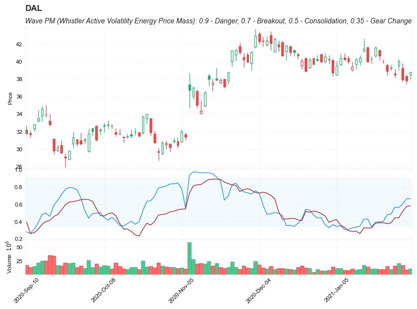

## Wave PM (Whistler Active Volatility Energy Price Mass)

**References**

- [Mark Whistler’s Wave PM](https://www.prorealcode.com/prorealtime-indicators/mark-whistlers-wave-pm/)
- [finta](https://github.com/peerchemist/finta/blob/af01fa594995de78f5ada5c336e61cd87c46b151/finta/finta.py#L788)
- [Wave-PM](https://www.tradingview.com/script/l9Oqp36g-Wave-PM/)

**Definition**

- The Wave PM (Whistler Active Volatility Energy Price Mass) indicator is an oscillator described in the Mark Whistler's book "Volatility Illuminated".
- it was designed to help read cycles of volatility. Read when a strong trend is about to start and end, along with the potential duration of lateral chop.
- it is not a directional oscillator 


##### Load basic packages 


```python
import pandas as pd
import numpy as np
import os
import gc
import copy
from pathlib import Path
from datetime import datetime, timedelta, time, date
```


```python
#this package is to download equity price data from yahoo finance
#the source code of this package can be found here: https://github.com/ranaroussi/yfinance/blob/main
import yfinance as yf
```


```python
pd.options.display.max_rows = 100
pd.options.display.max_columns = 100

import warnings
warnings.filterwarnings("ignore")

import pytorch_lightning as pl
random_seed=1234
pl.seed_everything(random_seed)
```

    Global seed set to 1234
    


    1234


```python
#S&P 500 (^GSPC),  Dow Jones Industrial Average (^DJI), NASDAQ Composite (^IXIC)
#Russell 2000 (^RUT), Crude Oil Nov 21 (CL=F), Gold Dec 21 (GC=F)
#Treasury Yield 10 Years (^TNX)

#benchmark_tickers = ['^GSPC', '^DJI', '^IXIC', '^RUT',  'CL=F', 'GC=F', '^TNX']

benchmark_tickers = ['^GSPC']
tickers = benchmark_tickers + ['GSK', 'NVO', 'PFE', 'DAL']
```


```python
#https://github.com/ranaroussi/yfinance/blob/main/yfinance/base.py
#     def history(self, period="1mo", interval="1d",
#                 start=None, end=None, prepost=False, actions=True,
#                 auto_adjust=True, back_adjust=False,
#                 proxy=None, rounding=False, tz=None, timeout=None, **kwargs):

dfs = {}

for ticker in tickers:
    cur_data = yf.Ticker(ticker)
    hist = cur_data.history(period="max", start='2000-01-01')
    print(datetime.now(), ticker, hist.shape, hist.index.min(), hist.index.max())
    dfs[ticker] = hist
```

    2022-09-05 18:05:09.006954 ^GSPC (5706, 7) 1999-12-31 00:00:00 2022-09-02 00:00:00
    2022-09-05 18:05:09.398440 GSK (5706, 7) 1999-12-31 00:00:00 2022-09-02 00:00:00
    2022-09-05 18:05:09.787225 NVO (5706, 7) 1999-12-31 00:00:00 2022-09-02 00:00:00
    2022-09-05 18:05:10.271711 PFE (5706, 7) 1999-12-31 00:00:00 2022-09-02 00:00:00
    2022-09-05 18:05:10.547051 DAL (3863, 7) 2007-05-03 00:00:00 2022-09-02 00:00:00
    


```python
ticker = 'DAL'
dfs[ticker].tail(5)
```


<div>
<style scoped>
    .dataframe tbody tr th:only-of-type {
        vertical-align: middle;
    }

    .dataframe tbody tr th {
        vertical-align: top;
    }

    .dataframe thead th {
        text-align: right;
    }
</style>
<table border="1" class="dataframe">
  <thead>
    <tr style="text-align: right;">
      <th></th>
      <th>Open</th>
      <th>High</th>
      <th>Low</th>
      <th>Close</th>
      <th>Volume</th>
      <th>Dividends</th>
      <th>Stock Splits</th>
    </tr>
    <tr>
      <th>Date</th>
      <th></th>
      <th></th>
      <th></th>
      <th></th>
      <th></th>
      <th></th>
      <th></th>
    </tr>
  </thead>
  <tbody>
    <tr>
      <th>2022-08-29</th>
      <td>32.200001</td>
      <td>32.349998</td>
      <td>31.850000</td>
      <td>32.029999</td>
      <td>8758400</td>
      <td>0.0</td>
      <td>0</td>
    </tr>
    <tr>
      <th>2022-08-30</th>
      <td>32.250000</td>
      <td>32.450001</td>
      <td>31.469999</td>
      <td>31.719999</td>
      <td>7506400</td>
      <td>0.0</td>
      <td>0</td>
    </tr>
    <tr>
      <th>2022-08-31</th>
      <td>31.969999</td>
      <td>32.020000</td>
      <td>31.059999</td>
      <td>31.070000</td>
      <td>7450000</td>
      <td>0.0</td>
      <td>0</td>
    </tr>
    <tr>
      <th>2022-09-01</th>
      <td>30.650000</td>
      <td>31.139999</td>
      <td>29.940001</td>
      <td>31.090000</td>
      <td>8572700</td>
      <td>0.0</td>
      <td>0</td>
    </tr>
    <tr>
      <th>2022-09-02</th>
      <td>31.440001</td>
      <td>31.830000</td>
      <td>30.700001</td>
      <td>30.940001</td>
      <td>8626500</td>
      <td>0.0</td>
      <td>0</td>
    </tr>
  </tbody>
</table>
</div>


##### Define Wave PM calculation function


```python
def cal_wavepm(ohlc: pd.DataFrame, period: int = 14, lookback_period: int = 100, column: str = "close") -> pd.Series:
    """
    The Wave PM (Whistler Active Volatility Energy Price Mass) indicator is an oscillator described in the Mark
    Whistler’s book “Volatility Illuminated”.
    :param DataFrame ohlc: data
    :param int period: period for moving average
    :param int lookback_period: period for oscillator lookback
    :return Series: WAVE PM
    """

    ma = ohlc[column].rolling(window=period).mean()
    std = ohlc[column].rolling(window=period).std(ddof=0)

    def tanh(x):
        two = np.where(x > 0, -2, 2)
        what = two * x
        ex = np.exp(what)
        j = 1 - ex
        k = ex - 1
        l = np.where(x > 0, j, k)
        output = l / (1 + ex)
        return output

    def osc(input_dev, mean, power):
        variance = pd.Series(power).rolling(window=lookback_period).sum() / lookback_period
        calc_dev = np.sqrt(variance) * mean
        y = (input_dev / calc_dev)
        oscLine = tanh(y)
        return oscLine

    dev = 3.2 * std
    power = np.power(dev / ma, 2)
    wavepm = osc(dev, ma, power)

    return pd.Series(wavepm, name=f"WAVEPM{period}")

```

##### Calculate Wave PM


```python
df = dfs[ticker][['Open', 'High', 'Low', 'Close', 'Volume']]
```


```python
df = df.round(2)
```


```python
cal_wavepm
```


    <function __main__.cal_wavepm(ohlc: pandas.core.frame.DataFrame, period: int = 14, lookback_period: int = 100, column: str = 'close') -> pandas.core.series.Series>


```python
df_ta = cal_wavepm(df, period=10, lookback_period=90, column='Close')
df = df.merge(df_ta, left_index = True, right_index = True, how='inner' )

del df_ta
gc.collect()
```


    610


```python
df_ta = cal_wavepm(df, period=14, lookback_period=120, column='Close')
df = df.merge(df_ta, left_index = True, right_index = True, how='inner' )

del df_ta
gc.collect()
```


    21


```python
display(df.head(5))
display(df.tail(5))
```


<div>
<style scoped>
    .dataframe tbody tr th:only-of-type {
        vertical-align: middle;
    }

    .dataframe tbody tr th {
        vertical-align: top;
    }

    .dataframe thead th {
        text-align: right;
    }
</style>
<table border="1" class="dataframe">
  <thead>
    <tr style="text-align: right;">
      <th></th>
      <th>Open</th>
      <th>High</th>
      <th>Low</th>
      <th>Close</th>
      <th>Volume</th>
      <th>WAVEPM10</th>
      <th>WAVEPM14</th>
    </tr>
    <tr>
      <th>Date</th>
      <th></th>
      <th></th>
      <th></th>
      <th></th>
      <th></th>
      <th></th>
      <th></th>
    </tr>
  </thead>
  <tbody>
    <tr>
      <th>2007-05-03</th>
      <td>19.32</td>
      <td>19.50</td>
      <td>18.25</td>
      <td>18.40</td>
      <td>8052800</td>
      <td>NaN</td>
      <td>NaN</td>
    </tr>
    <tr>
      <th>2007-05-04</th>
      <td>18.88</td>
      <td>18.96</td>
      <td>18.39</td>
      <td>18.64</td>
      <td>5437300</td>
      <td>NaN</td>
      <td>NaN</td>
    </tr>
    <tr>
      <th>2007-05-07</th>
      <td>18.83</td>
      <td>18.91</td>
      <td>17.94</td>
      <td>18.08</td>
      <td>2646300</td>
      <td>NaN</td>
      <td>NaN</td>
    </tr>
    <tr>
      <th>2007-05-08</th>
      <td>17.76</td>
      <td>17.76</td>
      <td>17.14</td>
      <td>17.44</td>
      <td>4166100</td>
      <td>NaN</td>
      <td>NaN</td>
    </tr>
    <tr>
      <th>2007-05-09</th>
      <td>17.54</td>
      <td>17.94</td>
      <td>17.44</td>
      <td>17.58</td>
      <td>7541100</td>
      <td>NaN</td>
      <td>NaN</td>
    </tr>
  </tbody>
</table>
</div>


<div>
<style scoped>
    .dataframe tbody tr th:only-of-type {
        vertical-align: middle;
    }

    .dataframe tbody tr th {
        vertical-align: top;
    }

    .dataframe thead th {
        text-align: right;
    }
</style>
<table border="1" class="dataframe">
  <thead>
    <tr style="text-align: right;">
      <th></th>
      <th>Open</th>
      <th>High</th>
      <th>Low</th>
      <th>Close</th>
      <th>Volume</th>
      <th>WAVEPM10</th>
      <th>WAVEPM14</th>
    </tr>
    <tr>
      <th>Date</th>
      <th></th>
      <th></th>
      <th></th>
      <th></th>
      <th></th>
      <th></th>
      <th></th>
    </tr>
  </thead>
  <tbody>
    <tr>
      <th>2022-08-29</th>
      <td>32.20</td>
      <td>32.35</td>
      <td>31.85</td>
      <td>32.03</td>
      <td>8758400</td>
      <td>0.626965</td>
      <td>0.479660</td>
    </tr>
    <tr>
      <th>2022-08-30</th>
      <td>32.25</td>
      <td>32.45</td>
      <td>31.47</td>
      <td>31.72</td>
      <td>7506400</td>
      <td>0.599117</td>
      <td>0.539114</td>
    </tr>
    <tr>
      <th>2022-08-31</th>
      <td>31.97</td>
      <td>32.02</td>
      <td>31.06</td>
      <td>31.07</td>
      <td>7450000</td>
      <td>0.633094</td>
      <td>0.610828</td>
    </tr>
    <tr>
      <th>2022-09-01</th>
      <td>30.65</td>
      <td>31.14</td>
      <td>29.94</td>
      <td>31.09</td>
      <td>8572700</td>
      <td>0.609835</td>
      <td>0.649787</td>
    </tr>
    <tr>
      <th>2022-09-02</th>
      <td>31.44</td>
      <td>31.83</td>
      <td>30.70</td>
      <td>30.94</td>
      <td>8626500</td>
      <td>0.640151</td>
      <td>0.661071</td>
    </tr>
  </tbody>
</table>
</div>


```python
df[['WAVEPM10', 'WAVEPM14']].hist(bins=50, figsize=(10, 4))
```


    array([[<AxesSubplot:title={'center':'WAVEPM10'}>,
            <AxesSubplot:title={'center':'WAVEPM14'}>]], dtype=object)


    

    


```python
#https://github.com/matplotlib/mplfinance
#this package help visualize financial data
import mplfinance as mpf
import matplotlib.colors as mcolors

# all_colors = list(mcolors.CSS4_COLORS.keys())#"CSS Colors"
# all_colors = list(mcolors.TABLEAU_COLORS.keys()) # "Tableau Palette",
all_colors = ['dodgerblue', 'firebrick','limegreen','skyblue','lightgreen',  'navy','yellow','plum',  'yellowgreen']
# all_colors = list(mcolors.BASE_COLORS.keys()) #"Base Colors",


#https://github.com/matplotlib/mplfinance/issues/181#issuecomment-667252575
#list of colors: https://matplotlib.org/stable/gallery/color/named_colors.html
#https://github.com/matplotlib/mplfinance/blob/master/examples/styles.ipynb

def make_3panels2(main_data, mid_panel, chart_type='candle', names=None, 
                  figratio=(14,9), fill_weights = (0, 0)):
    """
    main chart type: default is candle. alternatives: ohlc, line

    example:
    start = 200

    names = {'main_title': 'MAMA: MESA Adaptive Moving Average', 
             'sub_tile': 'S&P 500 (^GSPC)', 'y_tiles': ['price', 'Volume [$10^{6}$]']}


    make_candle(df.iloc[-start:, :5], df.iloc[-start:][['MAMA', 'FAMA']], names = names)
    
    """

    style = mpf.make_mpf_style(base_mpf_style='yahoo',  #charles
                               base_mpl_style = 'seaborn-whitegrid',
#                                marketcolors=mpf.make_marketcolors(up="r", down="#0000CC",inherit=True),
                               gridcolor="whitesmoke", 
                               gridstyle="--", #or None, or - for solid
                               gridaxis="both", 
                               edgecolor = 'whitesmoke',
                               facecolor = 'white', #background color within the graph edge
                               figcolor = 'white', #background color outside of the graph edge
                               y_on_right = False,
                               rc =  {'legend.fontsize': 'small',#or number
                                      #'figure.figsize': (14, 9),
                                     'axes.labelsize': 'small',
                                     'axes.titlesize':'small',
                                     'xtick.labelsize':'small',#'x-small', 'small','medium','large'
                                     'ytick.labelsize':'small'
                                     }, 
                              )   

    if (chart_type is None) or (chart_type not in ['ohlc', 'line', 'candle', 'hollow_and_filled']):
        chart_type = 'candle'
    len_dict = {'candle':2, 'ohlc':3, 'line':1, 'hollow_and_filled':2}    
        
    kwargs = dict(type=chart_type, figratio=figratio, volume=True, volume_panel=2, 
                  panel_ratios=(4,2,1), tight_layout=True, style=style, returnfig=True)
    
    if names is None:
        names = {'main_title': '', 'sub_tile': ''}
    


    added_plots = { }
  
    fb_bbands2_ = dict(y1=fill_weights[0]*np.ones(mid_panel.shape[0]),
                      y2=fill_weights[1]*np.ones(mid_panel.shape[0]),color="lightskyblue",alpha=0.1,interpolate=True)
    fb_bbands2_['panel'] = 1

    fb_bbands= [fb_bbands2_]
    
    
    i = 0
    for name_, data_ in mid_panel.iteritems():
        added_plots[name_] = mpf.make_addplot(data_, panel=1, width=1, color=all_colors[i], secondary_y=False)
        i = i + 1
    

    fig, axes = mpf.plot(main_data,  **kwargs,
                         addplot=list(added_plots.values()), 
                         fill_between=fb_bbands)
    # add a new suptitle
    fig.suptitle(names['main_title'], y=1.05, fontsize=12, x=0.1285)

    axes[0].set_title(names['sub_tile'], fontsize=10, style='italic',  loc='left')
#     axes[2].set_ylabel('WAVEPM10')

#     axes[0].set_ylabel(names['y_tiles'][0])
#     axes[2].set_ylabel(names['y_tiles'][1])
    return fig, axes
   
```


```python

start = -500
end = -400

names = {'main_title': f'{ticker}', 
         'sub_tile': 'Wave PM (Whistler Active Volatility Energy Price Mass): 0.9 - Danger, 0.7 - Breakout, 0.5 - Consolidation, 0.35 - Gear Change'}


aa_, bb_ = make_3panels2(df.iloc[start:end][['Open', 'High', 'Low', 'Close', 'Volume']], 
             df.iloc[start:end][['WAVEPM10', 'WAVEPM14']], 
             chart_type='hollow_and_filled',names = names, 
                         fill_weights = (0.35, .9))
```


    

    

