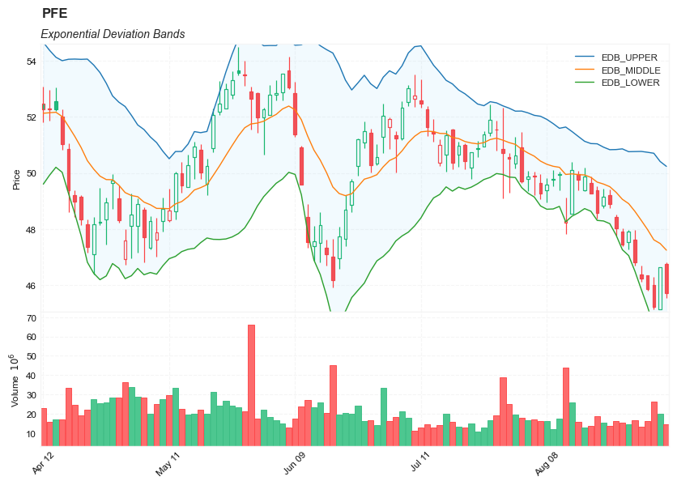
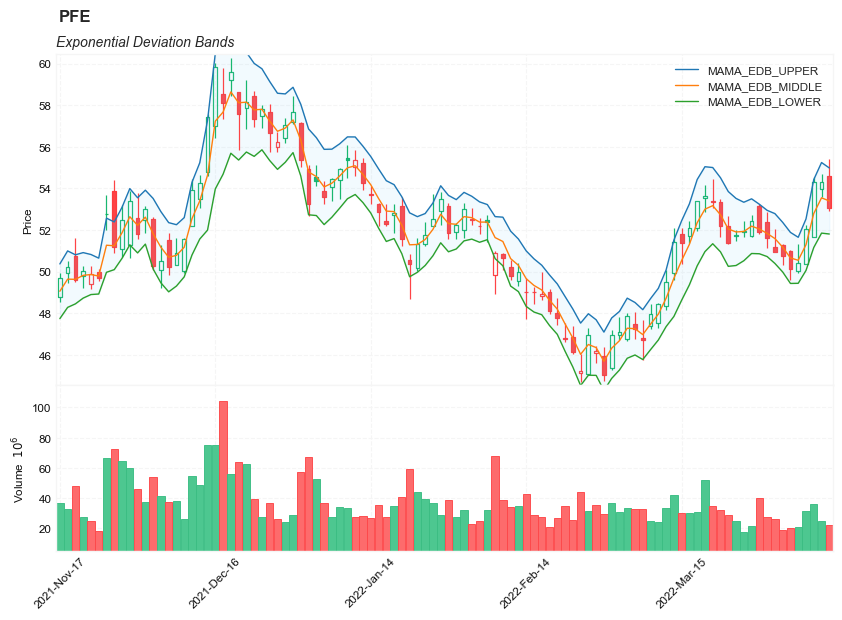

## Exponential Deviation Bands

**References**

- [traders.com: TradersTips 2019-07](https://traders.com/documentation/feedbk_docs/2019/07/traderstips.html)


**Definition**


In “Exponential Deviation Bands” in this issue, author Vitali Apirine introduces a price band indicator based on exponential deviation rather than the more traditional standard deviation, such as is used in the well-known Bollinger Bands. As compared to standard deviation bands, the author’s exponential deviation bands apply more weight to recent data and generate fewer breakouts. Apirine describes using the bands as a tool to assist in identifying trends.


##### Load basic packages 


```python
import pandas as pd
import numpy as np
import os
import gc
import copy
from pathlib import Path
from datetime import datetime, timedelta, time, date
```


```python
#this package is to download equity price data from yahoo finance
#the source code of this package can be found here: https://github.com/ranaroussi/yfinance/blob/main
import yfinance as yf
```


```python
pd.options.display.max_rows = 100
pd.options.display.max_columns = 100

import warnings
warnings.filterwarnings("ignore")

import pytorch_lightning as pl
random_seed=1234
pl.seed_everything(random_seed)
```

    Global seed set to 1234
    


    1234


```python
#S&P 500 (^GSPC),  Dow Jones Industrial Average (^DJI), NASDAQ Composite (^IXIC)
#Russell 2000 (^RUT), Crude Oil Nov 21 (CL=F), Gold Dec 21 (GC=F)
#Treasury Yield 10 Years (^TNX)

#benchmark_tickers = ['^GSPC', '^DJI', '^IXIC', '^RUT',  'CL=F', 'GC=F', '^TNX']

benchmark_tickers = ['^GSPC']
tickers = benchmark_tickers + ['GSK', 'NVO', 'PFE', 'DAL']
```


```python
#https://github.com/ranaroussi/yfinance/blob/main/yfinance/base.py
#     def history(self, period="1mo", interval="1d",
#                 start=None, end=None, prepost=False, actions=True,
#                 auto_adjust=True, back_adjust=False,
#                 proxy=None, rounding=False, tz=None, timeout=None, **kwargs):

dfs = {}

for ticker in tickers:
    cur_data = yf.Ticker(ticker)
    hist = cur_data.history(period="max", start='2000-01-01')
    print(datetime.now(), ticker, hist.shape, hist.index.min(), hist.index.max())
    dfs[ticker] = hist
```

    2022-09-03 23:58:01.097312 ^GSPC (5706, 7) 1999-12-31 00:00:00 2022-09-02 00:00:00
    2022-09-03 23:58:01.476056 GSK (5706, 7) 1999-12-31 00:00:00 2022-09-02 00:00:00
    2022-09-03 23:58:01.758862 NVO (5706, 7) 1999-12-31 00:00:00 2022-09-02 00:00:00
    2022-09-03 23:58:02.150113 PFE (5706, 7) 1999-12-31 00:00:00 2022-09-02 00:00:00
    2022-09-03 23:58:02.460730 DAL (3863, 7) 2007-05-03 00:00:00 2022-09-02 00:00:00
    


```python
ticker = 'PFE'
dfs[ticker].tail(5)
```


<div>
<style scoped>
    .dataframe tbody tr th:only-of-type {
        vertical-align: middle;
    }

    .dataframe tbody tr th {
        vertical-align: top;
    }

    .dataframe thead th {
        text-align: right;
    }
</style>
<table border="1" class="dataframe">
  <thead>
    <tr style="text-align: right;">
      <th></th>
      <th>Open</th>
      <th>High</th>
      <th>Low</th>
      <th>Close</th>
      <th>Volume</th>
      <th>Dividends</th>
      <th>Stock Splits</th>
    </tr>
    <tr>
      <th>Date</th>
      <th></th>
      <th></th>
      <th></th>
      <th></th>
      <th></th>
      <th></th>
      <th></th>
    </tr>
  </thead>
  <tbody>
    <tr>
      <th>2022-08-29</th>
      <td>46.380001</td>
      <td>46.689999</td>
      <td>46.119999</td>
      <td>46.230000</td>
      <td>13400500</td>
      <td>0.0</td>
      <td>0.0</td>
    </tr>
    <tr>
      <th>2022-08-30</th>
      <td>46.340000</td>
      <td>46.349998</td>
      <td>45.799999</td>
      <td>45.849998</td>
      <td>16303000</td>
      <td>0.0</td>
      <td>0.0</td>
    </tr>
    <tr>
      <th>2022-08-31</th>
      <td>46.009998</td>
      <td>46.290001</td>
      <td>45.130001</td>
      <td>45.230000</td>
      <td>26416800</td>
      <td>0.0</td>
      <td>0.0</td>
    </tr>
    <tr>
      <th>2022-09-01</th>
      <td>45.139999</td>
      <td>46.650002</td>
      <td>45.139999</td>
      <td>46.630001</td>
      <td>19947600</td>
      <td>0.0</td>
      <td>0.0</td>
    </tr>
    <tr>
      <th>2022-09-02</th>
      <td>46.740002</td>
      <td>46.799999</td>
      <td>45.529999</td>
      <td>45.700001</td>
      <td>14662700</td>
      <td>0.0</td>
      <td>0.0</td>
    </tr>
  </tbody>
</table>
</div>


##### Define Exponential Deviation Bands calculation function


```python
def cal_edb(
        ohlc: pd.DataFrame,
        period: int = 20,
        MA: pd.Series = None,
        std_multiplier: float = 2.0,
        column: str = "close",
    ) -> pd.DataFrame:
    
    """
    source: https://traders.com/documentation/feedbk_docs/2019/07/traderstips.html#item1
    // TASC JUL 2019, Exponential Deviation Bands, Vitali Apirine

    inputs:
        Periods( 20 ), DevMult( 2 ), UseSMA( false ) ;

    MLTP = 2 / ( Periods + 1 ) ;

    XAvgValue = XAverage( Close, Periods ) ;
    SAvgValue = Average( Close, Periods ) ;

    if UseSMA then
    begin
        AvgValue = SAvgValue ;
    end
    else
        AvgValue = XAvgValue ;

    PD = AbsValue( AvgValue - Close ) ;
    ED = PD * MLTP + ED[1] * ( 1 - MLTP ) ;
    UpperBand = AvgValue + ED * DevMult ;
    LowerBAnd = AvgValue - ED * DevMult ;
    
    """
    
    if not isinstance(MA, pd.Series):
        middle_band = ohlc[column].ewm(span=period, adjust=True).mean()
    else:
        middle_band = MA

    mltp = 2 / ( period + 1 )
    diff_abs = np.abs(middle_band - ohlc[column])
    
    def _ed(s, m):
        ed_ = np.zeros(len(s))
        for i in range(1, len(s)):
            ed_[i] = s[i]*m + ed_[i-1]*(1-m)
        return ed_
    

    ed = pd.Series(data=_ed(diff_abs, mltp), index=ohlc.index)
    
    upper_band = middle_band + (ed*std_multiplier)
    lower_band = middle_band - (ed*std_multiplier)
    

    return pd.DataFrame(data={'EDB_UPPER': upper_band.values, 
                              'EDB_MIDDLE': middle_band.values, 
                              'EDB_LOWER': lower_band.values 
                             }, 
                        index=ohlc.index
                       )

```


```python
def cal_edb(
        ohlc: pd.DataFrame,
        period: int = 20,
        MA: pd.Series = None,
        std_multiplier: float = 2.0,
        column: str = "close",
    ) -> pd.DataFrame:
    
    """
    source: https://traders.com/documentation/feedbk_docs/2019/07/traderstips.html#item1
    // TASC JUL 2019, Exponential Deviation Bands, Vitali Apirine

    inputs:
        Periods( 20 ), DevMult( 2 ), UseSMA( false ) ;

    MLTP = 2 / ( Periods + 1 ) ;
    XAvgValue = XAverage( Close, Periods ) ;
    SAvgValue = Average( Close, Periods ) ;

    if UseSMA then
    begin
        AvgValue = SAvgValue ;
    end
    else
        AvgValue = XAvgValue ;

    PD = AbsValue( AvgValue - Close ) ;
    ED = PD * MLTP + ED[1] * ( 1 - MLTP ) ;
    UpperBand = AvgValue + ED * DevMult ;
    LowerBAnd = AvgValue - ED * DevMult ;
    """
    
    if not isinstance(MA, pd.Series):
        middle_band = ohlc[column].ewm(span=period, adjust=True).mean()
    else:
        middle_band = MA

    diff_abs = (middle_band - ohlc[column]).abs()
    
    ed = diff_abs.ewm(span=period, adjust=True).mean()
    
    upper_band = middle_band + (ed*std_multiplier)
    lower_band = middle_band - (ed*std_multiplier)
    

    return pd.DataFrame(data={'EDB_UPPER': upper_band.values, 
                              'EDB_MIDDLE': middle_band.values, 
                              'EDB_LOWER': lower_band.values 
                             }, 
                        index=ohlc.index
                       )

```

##### Calculate Exponential Deviation Bands

Note: the 2 functions defined in the above cells render exactly same results except the few data points, but the difference in the first few data points are minor.


```python
df = dfs[ticker][['Open', 'High', 'Low', 'Close', 'Volume']]
df = df.round(2)
df.shape
```


    (5706, 5)


```python
cal_edb
```


    <function __main__.cal_edb(ohlc: pandas.core.frame.DataFrame, period: int = 20, MA: pandas.core.series.Series = None, std_multiplier: float = 2.0, column: str = 'close') -> pandas.core.frame.DataFrame>


```python
df_ta = cal_edb(df, period=14, MA=None, std_multiplier=2.2, column="Close")
df = df.merge(df_ta, left_index = True, right_index = True, how='inner' )

del df_ta
gc.collect()
```


    122


```python
from core.finta import TA
```


```python
TA.MAMA
```


    <function core.finta.TA.MAMA(ohlc: pandas.core.frame.DataFrame, fast_limit: float = 0.5, slow_limit: float = 0.05, column: str = 'close') -> pandas.core.frame.DataFrame>


```python
df_ta = TA.MAMA(df, column='close')
df = df.merge(df_ta, left_index = True, right_index = True, how='inner' )

del df_ta
gc.collect()
```


    42


```python
df_ta = cal_edb(df, period=14, MA=df['MAMA'],  std_multiplier=2.8, column="Close")
df_ta.columns = [f'MAMA_{c}' for c in df_ta.columns]
df = df.merge(df_ta, left_index = True, right_index = True, how='inner' )

df_ta = cal_edb(df, period=14, MA=df['FAMA'],  std_multiplier=2.1, column="Close")
df_ta.columns = [f'FAMA_{c}' for c in df_ta.columns]
df = df.merge(df_ta, left_index = True, right_index = True, how='inner' )

del df_ta
gc.collect()
```


    21


```python
display(df.head(5))
display(df.tail(5))
```


<div>
<style scoped>
    .dataframe tbody tr th:only-of-type {
        vertical-align: middle;
    }

    .dataframe tbody tr th {
        vertical-align: top;
    }

    .dataframe thead th {
        text-align: right;
    }
</style>
<table border="1" class="dataframe">
  <thead>
    <tr style="text-align: right;">
      <th></th>
      <th>Open</th>
      <th>High</th>
      <th>Low</th>
      <th>Close</th>
      <th>Volume</th>
      <th>EDB_UPPER</th>
      <th>EDB_MIDDLE</th>
      <th>EDB_LOWER</th>
      <th>MAMA</th>
      <th>FAMA</th>
      <th>MAMA_EDB_UPPER</th>
      <th>MAMA_EDB_MIDDLE</th>
      <th>MAMA_EDB_LOWER</th>
      <th>FAMA_EDB_UPPER</th>
      <th>FAMA_EDB_MIDDLE</th>
      <th>FAMA_EDB_LOWER</th>
    </tr>
    <tr>
      <th>Date</th>
      <th></th>
      <th></th>
      <th></th>
      <th></th>
      <th></th>
      <th></th>
      <th></th>
      <th></th>
      <th></th>
      <th></th>
      <th></th>
      <th></th>
      <th></th>
      <th></th>
      <th></th>
      <th></th>
    </tr>
  </thead>
  <tbody>
    <tr>
      <th>1999-12-31</th>
      <td>14.25</td>
      <td>14.31</td>
      <td>14.11</td>
      <td>14.22</td>
      <td>5939817</td>
      <td>14.220000</td>
      <td>14.220000</td>
      <td>14.220000</td>
      <td>14.22</td>
      <td>14.22</td>
      <td>14.22</td>
      <td>14.22</td>
      <td>14.22</td>
      <td>14.22</td>
      <td>14.22</td>
      <td>14.22</td>
    </tr>
    <tr>
      <th>2000-01-03</th>
      <td>14.06</td>
      <td>14.20</td>
      <td>13.87</td>
      <td>13.98</td>
      <td>12873345</td>
      <td>14.222755</td>
      <td>14.091429</td>
      <td>13.960102</td>
      <td>13.98</td>
      <td>13.98</td>
      <td>13.98</td>
      <td>13.98</td>
      <td>13.98</td>
      <td>13.98</td>
      <td>13.98</td>
      <td>13.98</td>
    </tr>
    <tr>
      <th>2000-01-04</th>
      <td>13.70</td>
      <td>13.81</td>
      <td>13.16</td>
      <td>13.46</td>
      <td>14208974</td>
      <td>14.259324</td>
      <td>13.850221</td>
      <td>13.441117</td>
      <td>13.46</td>
      <td>13.46</td>
      <td>13.46</td>
      <td>13.46</td>
      <td>13.46</td>
      <td>13.46</td>
      <td>13.46</td>
      <td>13.46</td>
    </tr>
    <tr>
      <th>2000-01-05</th>
      <td>13.54</td>
      <td>13.98</td>
      <td>13.51</td>
      <td>13.68</td>
      <td>12981591</td>
      <td>14.161610</td>
      <td>13.798145</td>
      <td>13.434681</td>
      <td>13.68</td>
      <td>13.68</td>
      <td>13.68</td>
      <td>13.68</td>
      <td>13.68</td>
      <td>13.68</td>
      <td>13.68</td>
      <td>13.68</td>
    </tr>
    <tr>
      <th>2000-01-06</th>
      <td>13.70</td>
      <td>14.36</td>
      <td>13.68</td>
      <td>14.17</td>
      <td>11115273</td>
      <td>14.321549</td>
      <td>13.895162</td>
      <td>13.468774</td>
      <td>14.17</td>
      <td>14.17</td>
      <td>14.17</td>
      <td>14.17</td>
      <td>14.17</td>
      <td>14.17</td>
      <td>14.17</td>
      <td>14.17</td>
    </tr>
  </tbody>
</table>
</div>


<div>
<style scoped>
    .dataframe tbody tr th:only-of-type {
        vertical-align: middle;
    }

    .dataframe tbody tr th {
        vertical-align: top;
    }

    .dataframe thead th {
        text-align: right;
    }
</style>
<table border="1" class="dataframe">
  <thead>
    <tr style="text-align: right;">
      <th></th>
      <th>Open</th>
      <th>High</th>
      <th>Low</th>
      <th>Close</th>
      <th>Volume</th>
      <th>EDB_UPPER</th>
      <th>EDB_MIDDLE</th>
      <th>EDB_LOWER</th>
      <th>MAMA</th>
      <th>FAMA</th>
      <th>MAMA_EDB_UPPER</th>
      <th>MAMA_EDB_MIDDLE</th>
      <th>MAMA_EDB_LOWER</th>
      <th>FAMA_EDB_UPPER</th>
      <th>FAMA_EDB_MIDDLE</th>
      <th>FAMA_EDB_LOWER</th>
    </tr>
    <tr>
      <th>Date</th>
      <th></th>
      <th></th>
      <th></th>
      <th></th>
      <th></th>
      <th></th>
      <th></th>
      <th></th>
      <th></th>
      <th></th>
      <th></th>
      <th></th>
      <th></th>
      <th></th>
      <th></th>
      <th></th>
    </tr>
  </thead>
  <tbody>
    <tr>
      <th>2022-08-29</th>
      <td>46.38</td>
      <td>46.69</td>
      <td>46.12</td>
      <td>46.23</td>
      <td>13400500</td>
      <td>50.766699</td>
      <td>48.306377</td>
      <td>45.846054</td>
      <td>46.853278</td>
      <td>48.059619</td>
      <td>47.980750</td>
      <td>46.853278</td>
      <td>45.725806</td>
      <td>50.157056</td>
      <td>48.059619</td>
      <td>45.962182</td>
    </tr>
    <tr>
      <th>2022-08-30</th>
      <td>46.34</td>
      <td>46.35</td>
      <td>45.80</td>
      <td>45.85</td>
      <td>16303000</td>
      <td>50.735605</td>
      <td>47.978860</td>
      <td>45.222114</td>
      <td>46.351639</td>
      <td>47.632624</td>
      <td>47.516060</td>
      <td>46.351639</td>
      <td>45.187218</td>
      <td>49.949537</td>
      <td>47.632624</td>
      <td>45.315711</td>
    </tr>
    <tr>
      <th>2022-08-31</th>
      <td>46.01</td>
      <td>46.29</td>
      <td>45.13</td>
      <td>45.23</td>
      <td>26416800</td>
      <td>50.700345</td>
      <td>47.612345</td>
      <td>44.524345</td>
      <td>45.790820</td>
      <td>47.172173</td>
      <td>47.009357</td>
      <td>45.790820</td>
      <td>44.572282</td>
      <td>49.723973</td>
      <td>47.172173</td>
      <td>44.620373</td>
    </tr>
    <tr>
      <th>2022-09-01</th>
      <td>45.14</td>
      <td>46.65</td>
      <td>45.14</td>
      <td>46.63</td>
      <td>19947600</td>
      <td>50.407367</td>
      <td>47.481366</td>
      <td>44.555365</td>
      <td>46.210410</td>
      <td>46.931732</td>
      <td>47.423122</td>
      <td>46.210410</td>
      <td>44.997697</td>
      <td>49.227777</td>
      <td>46.931732</td>
      <td>44.635687</td>
    </tr>
    <tr>
      <th>2022-09-02</th>
      <td>46.74</td>
      <td>46.80</td>
      <td>45.53</td>
      <td>45.70</td>
      <td>14662700</td>
      <td>50.232581</td>
      <td>47.243850</td>
      <td>44.255120</td>
      <td>45.955205</td>
      <td>46.687600</td>
      <td>47.101499</td>
      <td>45.955205</td>
      <td>44.808911</td>
      <td>48.954034</td>
      <td>46.687600</td>
      <td>44.421167</td>
    </tr>
  </tbody>
</table>
</div>


```python
df.columns
```


    Index(['Open', 'High', 'Low', 'Close', 'Volume', 'EDB_UPPER', 'EDB_MIDDLE',
           'EDB_LOWER', 'MAMA', 'FAMA', 'MAMA_EDB_UPPER', 'MAMA_EDB_MIDDLE',
           'MAMA_EDB_LOWER', 'FAMA_EDB_UPPER', 'FAMA_EDB_MIDDLE',
           'FAMA_EDB_LOWER'],
          dtype='object')


```python
#https://github.com/matplotlib/mplfinance
#this package help visualize financial data
import mplfinance as mpf
import matplotlib.colors as mcolors

# all_colors = list(mcolors.CSS4_COLORS.keys())#"CSS Colors"
# all_colors = list(mcolors.TABLEAU_COLORS.keys()) # "Tableau Palette",
# all_colors = list(mcolors.BASE_COLORS.keys()) #"Base Colors",
all_colors = ['dodgerblue', 'firebrick','limegreen','skyblue','lightgreen',  'navy','yellow','plum',  'yellowgreen']
#https://github.com/matplotlib/mplfinance/issues/181#issuecomment-667252575
#list of colors: https://matplotlib.org/stable/gallery/color/named_colors.html
#https://github.com/matplotlib/mplfinance/blob/master/examples/styles.ipynb

def make_3panels2(main_data, add_data, mid_panel=None, chart_type='candle', names=None, figratio=(14,9)):
    """
    main chart type: default is candle. alternatives: ohlc, line

    example:
    start = 200

    names = {'main_title': 'MAMA: MESA Adaptive Moving Average', 
             'sub_tile': 'S&P 500 (^GSPC)', 'y_tiles': ['price', 'Volume [$10^{6}$]']}


    make_candle(df.iloc[-start:, :5], df.iloc[-start:][['MAMA', 'FAMA']], names = names)
    
    """

    style = mpf.make_mpf_style(base_mpf_style='yahoo',  #charles
                               base_mpl_style = 'seaborn-whitegrid',
#                                marketcolors=mpf.make_marketcolors(up="r", down="#0000CC",inherit=True),
                               gridcolor="whitesmoke", 
                               gridstyle="--", #or None, or - for solid
                               gridaxis="both", 
                               edgecolor = 'whitesmoke',
                               facecolor = 'white', #background color within the graph edge
                               figcolor = 'white', #background color outside of the graph edge
                               y_on_right = False,
                               rc =  {'legend.fontsize': 'small',#or number
                                      #'figure.figsize': (14, 9),
                                     'axes.labelsize': 'small',
                                     'axes.titlesize':'small',
                                     'xtick.labelsize':'small',#'x-small', 'small','medium','large'
                                     'ytick.labelsize':'small'
                                     }, 
                              )   

    if (chart_type is None) or (chart_type not in ['ohlc', 'line', 'candle', 'hollow_and_filled']):
        chart_type = 'candle'
    len_dict = {'candle':2, 'ohlc':3, 'line':1, 'hollow_and_filled':2}    
        
    kwargs = dict(type=chart_type, figratio=figratio, volume=True, volume_panel=1, 
                  panel_ratios=(4,2), tight_layout=True, style=style, returnfig=True)
    
    if names is None:
        names = {'main_title': '', 'sub_tile': ''}
    


    added_plots = { }
    for name_, data_ in add_data.iteritems():
        added_plots[name_] = mpf.make_addplot(data_, panel=0, width=1, secondary_y=False)
    
    fb_bbands_ = dict(y1=add_data.iloc[:, 0].values,
                      y2=add_data.iloc[:, 2].values,color="lightskyblue",alpha=0.1,interpolate=True)
    fb_bbands_['panel'] = 0
    

    fb_bbands= [fb_bbands_]
    
    
    if mid_panel is not None:
        i = 0
        for name_, data_ in mid_panel.iteritems():
            added_plots[name_] = mpf.make_addplot(data_, panel=1, color=all_colors[i])
            i = i + 1
        fb_bbands2_ = dict(y1=np.zeros(mid_panel.shape[0]),
                      y2=0.8+np.zeros(mid_panel.shape[0]),color="lightskyblue",alpha=0.1,interpolate=True)
        fb_bbands2_['panel'] = 1
        fb_bbands.append(fb_bbands2_)


    fig, axes = mpf.plot(main_data,  **kwargs,
                         addplot=list(added_plots.values()), 
                         fill_between=fb_bbands)
    # add a new suptitle
    fig.suptitle(names['main_title'], y=1.05, fontsize=12, x=0.1285)

    axes[0].legend([None]*5)
    handles = axes[0].get_legend().legendHandles
    axes[0].legend(handles=handles[2:],labels=list(added_plots.keys()))
    axes[0].set_title(names['sub_tile'], fontsize=10, style='italic',  loc='left')
    

#     axes[0].set_ylabel(names['y_tiles'][0])
#     axes[2].set_ylabel(names['y_tiles'][1])
    return fig, axes
   
```


```python

start = -100
end = df.shape[0]

names = {'main_title': f'{ticker}', 
         'sub_tile': 'Exponential Deviation Bands'}


aa_, bb_ = make_3panels2(df.iloc[start:end][['Open', 'High', 'Low', 'Close', 'Volume']], 
            df.iloc[start:end][['EDB_UPPER', 'EDB_MIDDLE','EDB_LOWER']],
             chart_type='hollow_and_filled',names = names)
```


    

    


```python

start = -200
end = -100#df.shape[0]

names = {'main_title': f'{ticker}', 
         'sub_tile': 'Exponential Deviation Bands'}


aa_, bb_ = make_3panels2(df.iloc[start:end][['Open', 'High', 'Low', 'Close', 'Volume']], 
            df.iloc[start:end][['MAMA_EDB_UPPER', 'MAMA_EDB_MIDDLE','MAMA_EDB_LOWER']],
             chart_type='hollow_and_filled',names = names)
```


    

    


```python

start = -100
end = df.shape[0]

names = {'main_title': f'{ticker}', 
         'sub_tile': 'Exponential Deviation Bands'}


aa_, bb_ = make_3panels2(df.iloc[start:end][['Open', 'High', 'Low', 'Close', 'Volume']], 
            df.iloc[start:end][['FAMA_EDB_UPPER', 'FAMA_EDB_MIDDLE', 'FAMA_EDB_LOWER']],
             chart_type='hollow_and_filled',names = names)
```


    

    

