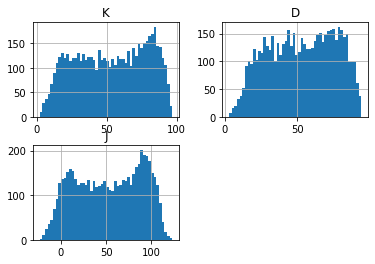

## KDJ

**References**

- [futunn: KDJ](https://www.futunn.com/en/learn/detail-what-is-kdj-64858-0)


**Definition**

- KDJ, also known as random index, is a technical index widely used in short-term trend analysis of futures and stock markets.
- KDJ is calculated on the basis of the highest price, the lowest price and the closing price. It can reflect the intensity of price fluctuations, overbought and oversold, and give trading signals before prices rise or fall. 
- KDJ is sensitive to price changes, which may generate wrong trading signals in very volatile markets, causing prices not to rise or fall with the signals, thus causing traders to make misjudgments.

**Calculation**

---


step 1: calculate the immature random value (RSV)


-  *Hn denotes the highest price, Ln denotes the lowest price, C denotes the closing price*

step 2: calculate the %K line:


step 3: calculate the %D line:


step 4: calculate the %J line:


---

**Read the indicator**


- KDJ values range from 0 to 100 (J values sometimes exceed). Generally speaking, an overbought signal occurs when the D value is more than 70 and an oversell signal occurs when the D value is less than 30.

- Gold fork
    - When the K line breaks through the D line on the graph, it is commonly known as the golden fork, which is a buy signal. In addition, when the K-line and D-line cross upward below 20, the short-term buy signal is more accurate; if the K value is below 50 and crosses twice above D value to form a higher golden fork "W" shape, then the stock price may rise considerably and the market prospect is promising.

- Dead fork
    - When the K value gets smaller and smaller, and then falls below the D line from above, it is often called a dead fork and is regarded as a sell signal. In addition, when K-line and D-line cross downward at gate 80, the short-term sell signal is more accurate. If the K value is above 50, crossing below the D line twice in the trend, and from the low dead cross "M" shape, the market outlook may have a considerable decline in stock prices.

- Bottom and top
    - J-line is a sensitive line of direction. When the J value is greater than 90, especially for more than 5 consecutive days, the stock price will form at least a short-term peak. On the contrary, when the J value is less than 10:00, especially for several consecutive days, the stock price will form at least a short-term bottom.


##### Load basic packages 


```python
import pandas as pd
import numpy as np
import os
import gc
import copy
from pathlib import Path
from datetime import datetime, timedelta, time, date
```


```python
#this package is to download equity price data from yahoo finance
#the source code of this package can be found here: https://github.com/ranaroussi/yfinance/blob/main
import yfinance as yf
```


```python
pd.options.display.max_rows = 100
pd.options.display.max_columns = 100

import warnings
warnings.filterwarnings("ignore")

import pytorch_lightning as pl
random_seed=1234
pl.seed_everything(random_seed)
```

    Global seed set to 1234
    


    1234


```python
#S&P 500 (^GSPC),  Dow Jones Industrial Average (^DJI), NASDAQ Composite (^IXIC)
#Russell 2000 (^RUT), Crude Oil Nov 21 (CL=F), Gold Dec 21 (GC=F)
#Treasury Yield 10 Years (^TNX)

#benchmark_tickers = ['^GSPC', '^DJI', '^IXIC', '^RUT',  'CL=F', 'GC=F', '^TNX']

benchmark_tickers = ['^GSPC']
tickers = benchmark_tickers + ['GSK', 'NVO', 'AROC']
```


```python
#https://github.com/ranaroussi/yfinance/blob/main/yfinance/base.py
#     def history(self, period="1mo", interval="1d",
#                 start=None, end=None, prepost=False, actions=True,
#                 auto_adjust=True, back_adjust=False,
#                 proxy=None, rounding=False, tz=None, timeout=None, **kwargs):

dfs = {}

for ticker in tickers:
    cur_data = yf.Ticker(ticker)
    hist = cur_data.history(period="max", start='2000-01-01')
    print(datetime.now(), ticker, hist.shape, hist.index.min(), hist.index.max())
    dfs[ticker] = hist
```

    2022-09-10 21:20:33.417662 ^GSPC (5710, 7) 1999-12-31 00:00:00 2022-09-09 00:00:00
    2022-09-10 21:20:33.761677 GSK (5710, 7) 1999-12-31 00:00:00 2022-09-09 00:00:00
    2022-09-10 21:20:34.092952 NVO (5710, 7) 1999-12-31 00:00:00 2022-09-09 00:00:00
    2022-09-10 21:20:34.340454 AROC (3791, 7) 2007-08-21 00:00:00 2022-09-09 00:00:00
    


```python
ticker = 'GSK'
dfs[ticker].tail(5)
```


<div>
<style scoped>
    .dataframe tbody tr th:only-of-type {
        vertical-align: middle;
    }

    .dataframe tbody tr th {
        vertical-align: top;
    }

    .dataframe thead th {
        text-align: right;
    }
</style>
<table border="1" class="dataframe">
  <thead>
    <tr style="text-align: right;">
      <th></th>
      <th>Open</th>
      <th>High</th>
      <th>Low</th>
      <th>Close</th>
      <th>Volume</th>
      <th>Dividends</th>
      <th>Stock Splits</th>
    </tr>
    <tr>
      <th>Date</th>
      <th></th>
      <th></th>
      <th></th>
      <th></th>
      <th></th>
      <th></th>
      <th></th>
    </tr>
  </thead>
  <tbody>
    <tr>
      <th>2022-09-02</th>
      <td>31.600000</td>
      <td>31.969999</td>
      <td>31.469999</td>
      <td>31.850000</td>
      <td>8152600</td>
      <td>0.0</td>
      <td>0.0</td>
    </tr>
    <tr>
      <th>2022-09-06</th>
      <td>31.650000</td>
      <td>31.760000</td>
      <td>31.370001</td>
      <td>31.469999</td>
      <td>5613900</td>
      <td>0.0</td>
      <td>0.0</td>
    </tr>
    <tr>
      <th>2022-09-07</th>
      <td>31.209999</td>
      <td>31.590000</td>
      <td>31.160000</td>
      <td>31.490000</td>
      <td>4822000</td>
      <td>0.0</td>
      <td>0.0</td>
    </tr>
    <tr>
      <th>2022-09-08</th>
      <td>30.910000</td>
      <td>31.540001</td>
      <td>30.830000</td>
      <td>31.510000</td>
      <td>6620900</td>
      <td>0.0</td>
      <td>0.0</td>
    </tr>
    <tr>
      <th>2022-09-09</th>
      <td>31.950001</td>
      <td>31.969999</td>
      <td>31.730000</td>
      <td>31.889999</td>
      <td>3556800</td>
      <td>0.0</td>
      <td>0.0</td>
    </tr>
  </tbody>
</table>
</div>


##### Define KDJ calculation function


```python
def cal_kdj(ohlc: pd.DataFrame, period: int = 14) -> pd.DataFrame:
    """
    KDJ
    reference:  https://www.futunn.com/en/learn/detail-what-is-kdj-64858-0

    """
    ohlc = ohlc.copy(deep=True)
    ohlc.columns = [c.lower() for c in ohlc.columns]

    highest_high = ohlc["high"].rolling(center=False, window=period).max()
    lowest_low = ohlc["low"].rolling(center=False, window=period).min()
    rsv = (ohlc["close"] - lowest_low) / (highest_high - lowest_low) * 100
    rsv = rsv.values

    k_ = np.zeros(len(ohlc))
    d_ = np.zeros(len(ohlc))

    for i in range(len(ohlc)):
        if i < period:
            k_[i] = 0
            d_[i] = 0
        else:
            k_[i] = (2/3)*k_[i-1] + (1/3)*rsv[i]
            d_[i] = (2/3)*d_[i-1] + (1/3)*k_[i]
    j_ = 3*k_ - 2*d_


    return pd.DataFrame(data={'K': k_, 'D': d_, 'J': j_}, index=ohlc.index)

```


```python
def cal_kdj2(ohlc: pd.DataFrame, period: int = 14, m1: int = 3, m2: int = 3) -> pd.DataFrame:
    """
    KDJ
    reference:  
    - https://www.futunn.com/en/learn/detail-what-is-kdj-64858-0
    - https://github.com/mpquant/MyTT/blob/ea4f14857ecc46a3739a75ce2e6974b9057a6102/MyTT.py#L145

    """
    ohlc = ohlc.copy(deep=True)
    ohlc.columns = [c.lower() for c in ohlc.columns]

    highest_high = ohlc["high"].rolling(center=False, window=period).max()
    lowest_low = ohlc["low"].rolling(center=False, window=period).min()
    rsv = (ohlc["close"] - lowest_low) / (highest_high - lowest_low) * 100
    
    k_ = rsv.ewm(span=m1*2-1, adjust=False).mean()
    d_ = k_.ewm(span=m2*2-1, adjust=False).mean()

    j_ = 3*k_ - 2*d_


    return pd.DataFrame(data={'K': k_, 'D': d_, 'J': j_})

```

##### Calculate KDJ


```python
df = dfs[ticker][['Open', 'High', 'Low', 'Close', 'Volume']]
```


```python
df = df.round(2)
```
cal_kdjdf_ta = cal_kdj(df, period = 14)
df = df.merge(df_ta, left_index = True, right_index = True, how='inner' )

del df_ta
gc.collect()

```python
cal_kdj2
```


    <function __main__.cal_kdj2(ohlc: pandas.core.frame.DataFrame, period: int = 14, m1: int = 3, m2: int = 3) -> pandas.core.frame.DataFrame>


```python
df_ta = cal_kdj2(df, period = 14, m1 = 3, m2 = 3)
df = df.merge(df_ta, left_index = True, right_index = True, how='inner' )

del df_ta
gc.collect()
```


    143


df_ta = cal_kdj2(df, period = 9, m1 = 5, m2 = 3)
df = df.merge(df_ta, left_index = True, right_index = True, how='inner' )

del df_ta
gc.collect()

```python
display(df.head(5))
display(df.tail(5))
```


<div>
<style scoped>
    .dataframe tbody tr th:only-of-type {
        vertical-align: middle;
    }

    .dataframe tbody tr th {
        vertical-align: top;
    }

    .dataframe thead th {
        text-align: right;
    }
</style>
<table border="1" class="dataframe">
  <thead>
    <tr style="text-align: right;">
      <th></th>
      <th>Open</th>
      <th>High</th>
      <th>Low</th>
      <th>Close</th>
      <th>Volume</th>
      <th>K</th>
      <th>D</th>
      <th>J</th>
    </tr>
    <tr>
      <th>Date</th>
      <th></th>
      <th></th>
      <th></th>
      <th></th>
      <th></th>
      <th></th>
      <th></th>
      <th></th>
    </tr>
  </thead>
  <tbody>
    <tr>
      <th>1999-12-31</th>
      <td>19.60</td>
      <td>19.67</td>
      <td>19.52</td>
      <td>19.56</td>
      <td>139400</td>
      <td>NaN</td>
      <td>NaN</td>
      <td>NaN</td>
    </tr>
    <tr>
      <th>2000-01-03</th>
      <td>19.58</td>
      <td>19.71</td>
      <td>19.25</td>
      <td>19.45</td>
      <td>556100</td>
      <td>NaN</td>
      <td>NaN</td>
      <td>NaN</td>
    </tr>
    <tr>
      <th>2000-01-04</th>
      <td>19.45</td>
      <td>19.45</td>
      <td>18.90</td>
      <td>18.95</td>
      <td>367200</td>
      <td>NaN</td>
      <td>NaN</td>
      <td>NaN</td>
    </tr>
    <tr>
      <th>2000-01-05</th>
      <td>19.21</td>
      <td>19.58</td>
      <td>19.08</td>
      <td>19.58</td>
      <td>481700</td>
      <td>NaN</td>
      <td>NaN</td>
      <td>NaN</td>
    </tr>
    <tr>
      <th>2000-01-06</th>
      <td>19.38</td>
      <td>19.43</td>
      <td>18.90</td>
      <td>19.30</td>
      <td>853800</td>
      <td>NaN</td>
      <td>NaN</td>
      <td>NaN</td>
    </tr>
  </tbody>
</table>
</div>


<div>
<style scoped>
    .dataframe tbody tr th:only-of-type {
        vertical-align: middle;
    }

    .dataframe tbody tr th {
        vertical-align: top;
    }

    .dataframe thead th {
        text-align: right;
    }
</style>
<table border="1" class="dataframe">
  <thead>
    <tr style="text-align: right;">
      <th></th>
      <th>Open</th>
      <th>High</th>
      <th>Low</th>
      <th>Close</th>
      <th>Volume</th>
      <th>K</th>
      <th>D</th>
      <th>J</th>
    </tr>
    <tr>
      <th>Date</th>
      <th></th>
      <th></th>
      <th></th>
      <th></th>
      <th></th>
      <th></th>
      <th></th>
      <th></th>
    </tr>
  </thead>
  <tbody>
    <tr>
      <th>2022-09-02</th>
      <td>31.60</td>
      <td>31.97</td>
      <td>31.47</td>
      <td>31.85</td>
      <td>8152600</td>
      <td>4.883618</td>
      <td>3.605564</td>
      <td>7.439726</td>
    </tr>
    <tr>
      <th>2022-09-06</th>
      <td>31.65</td>
      <td>31.76</td>
      <td>31.37</td>
      <td>31.47</td>
      <td>5613900</td>
      <td>4.287737</td>
      <td>3.832955</td>
      <td>5.197301</td>
    </tr>
    <tr>
      <th>2022-09-07</th>
      <td>31.21</td>
      <td>31.59</td>
      <td>31.16</td>
      <td>31.49</td>
      <td>4822000</td>
      <td>6.056166</td>
      <td>4.574025</td>
      <td>9.020447</td>
    </tr>
    <tr>
      <th>2022-09-08</th>
      <td>30.91</td>
      <td>31.54</td>
      <td>30.83</td>
      <td>31.51</td>
      <td>6620900</td>
      <td>10.230522</td>
      <td>6.459524</td>
      <td>17.772518</td>
    </tr>
    <tr>
      <th>2022-09-09</th>
      <td>31.95</td>
      <td>31.97</td>
      <td>31.73</td>
      <td>31.89</td>
      <td>3556800</td>
      <td>17.151732</td>
      <td>10.023594</td>
      <td>31.408009</td>
    </tr>
  </tbody>
</table>
</div>


```python
df[['K', 'D', 'J']].hist(bins=50)
```


    array([[<AxesSubplot:title={'center':'K'}>,
            <AxesSubplot:title={'center':'D'}>],
           [<AxesSubplot:title={'center':'J'}>, <AxesSubplot:>]], dtype=object)


    

    


```python
#https://github.com/matplotlib/mplfinance
#this package help visualize financial data
import mplfinance as mpf
import matplotlib.colors as mcolors

# all_colors = list(mcolors.CSS4_COLORS.keys())#"CSS Colors"
all_colors = list(mcolors.TABLEAU_COLORS.keys()) # "Tableau Palette",
# all_colors = list(mcolors.BASE_COLORS.keys()) #"Base Colors",


#https://github.com/matplotlib/mplfinance/issues/181#issuecomment-667252575
#list of colors: https://matplotlib.org/stable/gallery/color/named_colors.html
#https://github.com/matplotlib/mplfinance/blob/master/examples/styles.ipynb

def make_3panels2(main_data, mid_panel, chart_type='candle', names=None, 
                  figratio=(14,9), fill_weights = (0, 0)):


    style = mpf.make_mpf_style(base_mpf_style='yahoo',  #charles
                               base_mpl_style = 'seaborn-whitegrid',
#                                marketcolors=mpf.make_marketcolors(up="r", down="#0000CC",inherit=True),
                               gridcolor="whitesmoke", 
                               gridstyle="--", #or None, or - for solid
                               gridaxis="both", 
                               edgecolor = 'whitesmoke',
                               facecolor = 'white', #background color within the graph edge
                               figcolor = 'white', #background color outside of the graph edge
                               y_on_right = False,
                               rc =  {'legend.fontsize': 'small',#or number
                                      #'figure.figsize': (14, 9),
                                     'axes.labelsize': 'small',
                                     'axes.titlesize':'small',
                                     'xtick.labelsize':'small',#'x-small', 'small','medium','large'
                                     'ytick.labelsize':'small'
                                     }, 
                              )   

    if (chart_type is None) or (chart_type not in ['ohlc', 'line', 'candle', 'hollow_and_filled']):
        chart_type = 'candle'
    len_dict = {'candle':2, 'ohlc':3, 'line':1, 'hollow_and_filled':2}    
        
    kwargs = dict(type=chart_type, figratio=figratio, volume=True, volume_panel=2, 
                  panel_ratios=(4,2,1), tight_layout=True, style=style, returnfig=True)
    
    if names is None:
        names = {'main_title': '', 'sub_tile': ''}
    


    added_plots = { 
        'K':  mpf.make_addplot(mid_panel['K'], panel=1, color='orange', width=1, secondary_y=False), 
        'D':  mpf.make_addplot(mid_panel['D'], panel=1, color='dodgerblue', width=1, secondary_y=False), 
        'J':  mpf.make_addplot(mid_panel['J'], panel=1, color='darkviolet', width=1, secondary_y=False), 
    }
    
    fb_bbands2_ = dict(y1=fill_weights[0]*np.ones(mid_panel.shape[0]),
                      y2=fill_weights[1]*np.ones(mid_panel.shape[0]),color="lightskyblue",alpha=0.1,interpolate=True)
    fb_bbands2_['panel'] = 1

    fb_bbands= [fb_bbands2_]
    

    fig, axes = mpf.plot(main_data,  **kwargs,
                         addplot=list(added_plots.values()),
                         fill_between=fb_bbands
                        )
    # add a new suptitle
    fig.suptitle(names['main_title'], y=1.05, fontsize=12, x=0.1375)

    axes[0].set_title(names['sub_tile'], fontsize=10, style='italic',  loc='left')
    axes[2].set_ylabel('KDJ')
    
    axes[2].legend([None]*3)
    handles = axes[2].get_legend().legendHandles
    axes[2].legend(handles=handles,labels=list(added_plots.keys()))
    

    return fig, axes
   
```


```python

start = -200
end = df.shape[0]

names = {'main_title': f'{ticker}', 
         'sub_tile': 'KDJ: an overbought signal occurs when the D value is more than 70 and an oversell signal occurs when the D value is less than 30'}


aa_, bb_ = make_3panels2(df.iloc[start:end][['Open', 'High', 'Low', 'Close', 'Volume']], 
                         df.iloc[start:end][['K', 'D', 'J']], 
                         chart_type='hollow_and_filled',
                         names = names,
                         fill_weights = (30, 70)
                        
                        )
```


    

    

