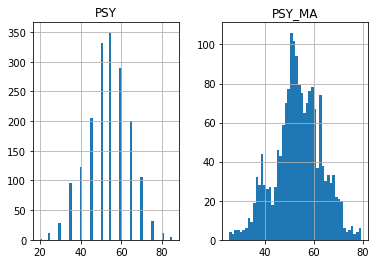

## Psychological Line (PSY) 

**References**

- [tradingview: PSY](https://www.tradingview.com/script/iSa5IoN4-Psychological-line/)


**Definition**

Psychological line (PSY), as an indicator, is the ratio of the number of rising periods over the total number of periods. It reflects the buying power in relation to the selling power.

If PSY is above 50%, it indicates that buyers are in control. Likewise, if it is below 50%, it indicates the sellers are in control. If the PSY moves along the 50% area, it indicates balance between the buyers and sellers and therefore there is no direction movement for the market.


##### Load basic packages 


```python
import pandas as pd
import numpy as np
import os
import gc
import copy
from pathlib import Path
from datetime import datetime, timedelta, time, date
```


```python
#this package is to download equity price data from yahoo finance
#the source code of this package can be found here: https://github.com/ranaroussi/yfinance/blob/main
import yfinance as yf
```


```python
pd.options.display.max_rows = 100
pd.options.display.max_columns = 100

import warnings
warnings.filterwarnings("ignore")

import pytorch_lightning as pl
random_seed=1234
pl.seed_everything(random_seed)
```

    Global seed set to 1234
    


    1234


```python
#S&P 500 (^GSPC),  Dow Jones Industrial Average (^DJI), NASDAQ Composite (^IXIC)
#Russell 2000 (^RUT), Crude Oil Nov 21 (CL=F), Gold Dec 21 (GC=F)
#Treasury Yield 10 Years (^TNX)

#benchmark_tickers = ['^GSPC', '^DJI', '^IXIC', '^RUT',  'CL=F', 'GC=F', '^TNX']

benchmark_tickers = ['^GSPC']
tickers = benchmark_tickers + ['GSK', 'NVO', 'GKOS']
```


```python
#https://github.com/ranaroussi/yfinance/blob/main/yfinance/base.py
#     def history(self, period="1mo", interval="1d",
#                 start=None, end=None, prepost=False, actions=True,
#                 auto_adjust=True, back_adjust=False,
#                 proxy=None, rounding=False, tz=None, timeout=None, **kwargs):

dfs = {}

for ticker in tickers:
    cur_data = yf.Ticker(ticker)
    hist = cur_data.history(period="max", start='2000-01-01')
    print(datetime.now(), ticker, hist.shape, hist.index.min(), hist.index.max())
    dfs[ticker] = hist
```

    2022-08-27 19:18:31.874246 ^GSPC (5701, 7) 1999-12-31 00:00:00 2022-08-26 00:00:00
    2022-08-27 19:18:32.234071 GSK (5701, 7) 1999-12-31 00:00:00 2022-08-26 00:00:00
    2022-08-27 19:18:32.579770 NVO (5701, 7) 1999-12-31 00:00:00 2022-08-26 00:00:00
    2022-08-27 19:18:32.733716 GKOS (1807, 7) 2015-06-25 00:00:00 2022-08-26 00:00:00
    


```python
ticker = 'GKOS'
dfs[ticker].tail(5)
```


<div>
<style scoped>
    .dataframe tbody tr th:only-of-type {
        vertical-align: middle;
    }

    .dataframe tbody tr th {
        vertical-align: top;
    }

    .dataframe thead th {
        text-align: right;
    }
</style>
<table border="1" class="dataframe">
  <thead>
    <tr style="text-align: right;">
      <th></th>
      <th>Open</th>
      <th>High</th>
      <th>Low</th>
      <th>Close</th>
      <th>Volume</th>
      <th>Dividends</th>
      <th>Stock Splits</th>
    </tr>
    <tr>
      <th>Date</th>
      <th></th>
      <th></th>
      <th></th>
      <th></th>
      <th></th>
      <th></th>
      <th></th>
    </tr>
  </thead>
  <tbody>
    <tr>
      <th>2022-08-22</th>
      <td>49.290001</td>
      <td>50.110001</td>
      <td>48.810001</td>
      <td>49.049999</td>
      <td>243200</td>
      <td>0</td>
      <td>0</td>
    </tr>
    <tr>
      <th>2022-08-23</th>
      <td>49.509998</td>
      <td>49.759998</td>
      <td>48.439999</td>
      <td>49.410000</td>
      <td>260300</td>
      <td>0</td>
      <td>0</td>
    </tr>
    <tr>
      <th>2022-08-24</th>
      <td>50.290001</td>
      <td>52.680000</td>
      <td>49.269001</td>
      <td>52.000000</td>
      <td>628200</td>
      <td>0</td>
      <td>0</td>
    </tr>
    <tr>
      <th>2022-08-25</th>
      <td>52.820000</td>
      <td>52.840000</td>
      <td>52.040001</td>
      <td>52.590000</td>
      <td>349400</td>
      <td>0</td>
      <td>0</td>
    </tr>
    <tr>
      <th>2022-08-26</th>
      <td>52.310001</td>
      <td>52.580002</td>
      <td>49.480000</td>
      <td>49.889999</td>
      <td>550400</td>
      <td>0</td>
      <td>0</td>
    </tr>
  </tbody>
</table>
</div>


##### Define PSY calculation function


```python
def cal_psy(ohlc: pd.DataFrame, period: int = 12, ma_period: int = 6, column: str = "close") -> pd.DataFrame:
    """
    PSY
    reference:  
    - https://github.com/mpquant/MyTT/blob/ea4f14857ecc46a3739a75ce2e6974b9057a6102/MyTT.py#L71

    def PSY(CLOSE,N=12, M=6):  
        PSY=COUNT(CLOSE>REF(CLOSE,1),N)/N*100
        PSYMA=MA(PSY,M)
        return RD(PSY),RD(PSYMA)


    """
    
    psy = (ohlc[column]>ohlc[column].shift(1)).rolling(period).sum()/period*100
    psy_ma =  psy.rolling(ma_period).mean()


    return pd.DataFrame(data={'PSY': psy.values, 'PSY_MA': psy_ma.values, }, index=ohlc.index)

```

##### Calculate PSY


```python
df = dfs[ticker][['Open', 'High', 'Low', 'Close', 'Volume']]
```


```python
df = df.round(2)
```


```python
cal_psy
```


    <function __main__.cal_psy(ohlc: pandas.core.frame.DataFrame, period: int = 12, ma_period: int = 6, column: str = 'close') -> pandas.core.frame.DataFrame>


```python
df_ta = cal_psy(df, period = 20, ma_period = 9, column = "Close")
df = df.merge(df_ta, left_index = True, right_index = True, how='inner' )

del df_ta
gc.collect()
```


    80


```python
display(df.head(5))
display(df.tail(5))
```


<div>
<style scoped>
    .dataframe tbody tr th:only-of-type {
        vertical-align: middle;
    }

    .dataframe tbody tr th {
        vertical-align: top;
    }

    .dataframe thead th {
        text-align: right;
    }
</style>
<table border="1" class="dataframe">
  <thead>
    <tr style="text-align: right;">
      <th></th>
      <th>Open</th>
      <th>High</th>
      <th>Low</th>
      <th>Close</th>
      <th>Volume</th>
      <th>PSY</th>
      <th>PSY_MA</th>
    </tr>
    <tr>
      <th>Date</th>
      <th></th>
      <th></th>
      <th></th>
      <th></th>
      <th></th>
      <th></th>
      <th></th>
    </tr>
  </thead>
  <tbody>
    <tr>
      <th>2015-06-25</th>
      <td>29.11</td>
      <td>31.95</td>
      <td>28.00</td>
      <td>31.22</td>
      <td>7554700</td>
      <td>NaN</td>
      <td>NaN</td>
    </tr>
    <tr>
      <th>2015-06-26</th>
      <td>30.39</td>
      <td>30.39</td>
      <td>27.51</td>
      <td>28.00</td>
      <td>1116500</td>
      <td>NaN</td>
      <td>NaN</td>
    </tr>
    <tr>
      <th>2015-06-29</th>
      <td>27.70</td>
      <td>28.48</td>
      <td>27.51</td>
      <td>28.00</td>
      <td>386900</td>
      <td>NaN</td>
      <td>NaN</td>
    </tr>
    <tr>
      <th>2015-06-30</th>
      <td>27.39</td>
      <td>29.89</td>
      <td>27.39</td>
      <td>28.98</td>
      <td>223900</td>
      <td>NaN</td>
      <td>NaN</td>
    </tr>
    <tr>
      <th>2015-07-01</th>
      <td>28.83</td>
      <td>29.00</td>
      <td>27.87</td>
      <td>28.00</td>
      <td>150000</td>
      <td>NaN</td>
      <td>NaN</td>
    </tr>
  </tbody>
</table>
</div>


<div>
<style scoped>
    .dataframe tbody tr th:only-of-type {
        vertical-align: middle;
    }

    .dataframe tbody tr th {
        vertical-align: top;
    }

    .dataframe thead th {
        text-align: right;
    }
</style>
<table border="1" class="dataframe">
  <thead>
    <tr style="text-align: right;">
      <th></th>
      <th>Open</th>
      <th>High</th>
      <th>Low</th>
      <th>Close</th>
      <th>Volume</th>
      <th>PSY</th>
      <th>PSY_MA</th>
    </tr>
    <tr>
      <th>Date</th>
      <th></th>
      <th></th>
      <th></th>
      <th></th>
      <th></th>
      <th></th>
      <th></th>
    </tr>
  </thead>
  <tbody>
    <tr>
      <th>2022-08-22</th>
      <td>49.29</td>
      <td>50.11</td>
      <td>48.81</td>
      <td>49.05</td>
      <td>243200</td>
      <td>55.0</td>
      <td>58.333333</td>
    </tr>
    <tr>
      <th>2022-08-23</th>
      <td>49.51</td>
      <td>49.76</td>
      <td>48.44</td>
      <td>49.41</td>
      <td>260300</td>
      <td>60.0</td>
      <td>58.333333</td>
    </tr>
    <tr>
      <th>2022-08-24</th>
      <td>50.29</td>
      <td>52.68</td>
      <td>49.27</td>
      <td>52.00</td>
      <td>628200</td>
      <td>60.0</td>
      <td>58.888889</td>
    </tr>
    <tr>
      <th>2022-08-25</th>
      <td>52.82</td>
      <td>52.84</td>
      <td>52.04</td>
      <td>52.59</td>
      <td>349400</td>
      <td>60.0</td>
      <td>59.444444</td>
    </tr>
    <tr>
      <th>2022-08-26</th>
      <td>52.31</td>
      <td>52.58</td>
      <td>49.48</td>
      <td>49.89</td>
      <td>550400</td>
      <td>55.0</td>
      <td>58.888889</td>
    </tr>
  </tbody>
</table>
</div>


```python
df[['PSY', 'PSY_MA']].hist(bins=50)
```


    array([[<AxesSubplot:title={'center':'PSY'}>,
            <AxesSubplot:title={'center':'PSY_MA'}>]], dtype=object)


    

    


```python
#https://github.com/matplotlib/mplfinance
#this package help visualize financial data
import mplfinance as mpf
import matplotlib.colors as mcolors

# all_colors = list(mcolors.CSS4_COLORS.keys())#"CSS Colors"
all_colors = list(mcolors.TABLEAU_COLORS.keys()) # "Tableau Palette",
# all_colors = list(mcolors.BASE_COLORS.keys()) #"Base Colors",


#https://github.com/matplotlib/mplfinance/issues/181#issuecomment-667252575
#list of colors: https://matplotlib.org/stable/gallery/color/named_colors.html
#https://github.com/matplotlib/mplfinance/blob/master/examples/styles.ipynb

def make_3panels2(main_data, mid_panel, chart_type='candle', names=None, 
                  figratio=(14,9)):


    style = mpf.make_mpf_style(base_mpf_style='yahoo',  #charles
                               base_mpl_style = 'seaborn-whitegrid',
#                                marketcolors=mpf.make_marketcolors(up="r", down="#0000CC",inherit=True),
                               gridcolor="whitesmoke", 
                               gridstyle="--", #or None, or - for solid
                               gridaxis="both", 
                               edgecolor = 'whitesmoke',
                               facecolor = 'white', #background color within the graph edge
                               figcolor = 'white', #background color outside of the graph edge
                               y_on_right = False,
                               rc =  {'legend.fontsize': 'small',#or number
                                      #'figure.figsize': (14, 9),
                                     'axes.labelsize': 'small',
                                     'axes.titlesize':'small',
                                     'xtick.labelsize':'small',#'x-small', 'small','medium','large'
                                     'ytick.labelsize':'small'
                                     }, 
                              )   

    if (chart_type is None) or (chart_type not in ['ohlc', 'line', 'candle', 'hollow_and_filled']):
        chart_type = 'candle'
    len_dict = {'candle':2, 'ohlc':3, 'line':1, 'hollow_and_filled':2}    
        
    kwargs = dict(type=chart_type, figratio=figratio, volume=True, volume_panel=2, 
                  panel_ratios=(4,2,1), tight_layout=True, style=style, returnfig=True)
    
    if names is None:
        names = {'main_title': '', 'sub_tile': ''}
    


    added_plots = { 
        'PSY':  mpf.make_addplot(mid_panel['PSY'], panel=1, color='dodgerblue', width=1, secondary_y=False), 
        'PSY_MA':  mpf.make_addplot(mid_panel['PSY_MA'], panel=1, color='orange', width=1, secondary_y=False), 
    }
    
    fb_psy_up = dict(y1=50*np.ones(mid_panel.shape[0]),y2=mid_panel['PSY'].values,where=mid_panel['PSY'].values<50,color="#93c47d",alpha=0.6,interpolate=True)
    fb_psy_dn = dict(y1=50*np.ones(mid_panel.shape[0]),y2=mid_panel['PSY'].values,where=mid_panel['PSY'].values>50,color="#e06666",alpha=0.6,interpolate=True)


    fb_psy_up['panel'] = 1
    fb_psy_dn['panel'] = 1

    fb_bbands= [fb_psy_up, fb_psy_dn]
    

    fig, axes = mpf.plot(main_data,  **kwargs,
                         addplot=list(added_plots.values()),
                         fill_between=fb_bbands
                        )
    # add a new suptitle
    fig.suptitle(names['main_title'], y=1.05, fontsize=12, x=0.135)

    axes[0].set_title(names['sub_tile'], fontsize=10, style='italic',  loc='left')
    axes[2].set_ylabel('PSY')
    
    axes[2].legend([None]*3)
    handles = axes[2].get_legend().legendHandles
    axes[2].legend(handles=handles,labels=list(added_plots.keys()))
    

    return fig, axes
   
```


```python

start = -200
end = -100#df.shape[0]

names = {'main_title': f'{ticker}', 
         'sub_tile': 'PSY: buy when PSY line cross to below 50; sell whey PSY line cross to above 50'}


aa_, bb_ = make_3panels2(df.iloc[start:end][['Open', 'High', 'Low', 'Close', 'Volume']], 
                         df.iloc[start:end][['PSY', 'PSY_MA']], 
                         chart_type='hollow_and_filled',
                         names = names,
                        
                        )
```


    

    

