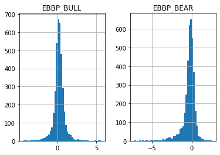

## Bull Power and Bear Power (Elder-Ray Index)

**References**

- [fbs.eu: bulls-power-and-bears-power](https://fbs.eu/en/analytics/guidebooks/bulls-power-and-bears-power-224)


**Definition**

The Bull Power and Bear Power are the oscillators developed by Dr Alexander Elder. They measure the power of buyers (bulls) and sellers (bears) to push the price in their favor, i.e. above or below a baseline. The two indicators combined are known as Elder-Ray Index. The function of a baseline is often performed by a 13-period Exponential Moving Average (EMA) of closing prices.  

The logic is simple: the market situation is constantly changing as bears turn into bulls and vice versa. The indicators help to track this conversion and trade on it. 


**Read the indicator**

You can use the indicators individually but there’s much more sense to use them together as was planned by Elder. 

In addition to both indicators, plot the 13 EMA itself on the chart as well. This way you will combine the oscillators with a trend-following tool and increase the quality of the entry signals. The exponential moving average acts as a filter: it shows a trend, so that a trader could pick only those signals which are in the direction of this trend.


- A setup for a buy trade occurs when the following conditions are met:
    - EMA is increasing.
    - Bears Power is negative but increases.
    
- There are also other optional cut desirable conditions:
    - The last peak of the Bulls Power oscillator is higher than the previous one.
    - There’s a bullish divergence between the Bears Power and the price (the price is setting lower lows, but the Bears Power fails to do so).
    - It is better not to go long if the Bears Power is positive.


- A setup for a sell occurs when the following conditions are met:
    - EMA is decreasing.
    - Bulls Power is positive but decreases.
- There are also other optional cut desirable conditions:
    - The last low of the Bears Power oscillator is lower than the previous one.
    - There’s a bearish divergence between the Bulls Power and the price (the price is setting higher highs, but the Bulls Power only manages to form only lower highs).
    - It is better not to go short if the Bulls Power is negative.

##### Load basic packages 


```python
import pandas as pd
import numpy as np
import os
import gc
import copy
from pathlib import Path
from datetime import datetime, timedelta, time, date
```


```python
#this package is to download equity price data from yahoo finance
#the source code of this package can be found here: https://github.com/ranaroussi/yfinance/blob/main
import yfinance as yf
```


```python
pd.options.display.max_rows = 100
pd.options.display.max_columns = 100

import warnings
warnings.filterwarnings("ignore")

import pytorch_lightning as pl
random_seed=1234
pl.seed_everything(random_seed)
```

    Global seed set to 1234
    


    1234


```python
#S&P 500 (^GSPC),  Dow Jones Industrial Average (^DJI), NASDAQ Composite (^IXIC)
#Russell 2000 (^RUT), Crude Oil Nov 21 (CL=F), Gold Dec 21 (GC=F)
#Treasury Yield 10 Years (^TNX)

#benchmark_tickers = ['^GSPC', '^DJI', '^IXIC', '^RUT',  'CL=F', 'GC=F', '^TNX']

benchmark_tickers = ['^GSPC']
tickers = benchmark_tickers + ['GSK', 'NVO', 'AROC']
```


```python
#https://github.com/ranaroussi/yfinance/blob/main/yfinance/base.py
#     def history(self, period="1mo", interval="1d",
#                 start=None, end=None, prepost=False, actions=True,
#                 auto_adjust=True, back_adjust=False,
#                 proxy=None, rounding=False, tz=None, timeout=None, **kwargs):

dfs = {}

for ticker in tickers:
    cur_data = yf.Ticker(ticker)
    hist = cur_data.history(period="max", start='2000-01-01')
    print(datetime.now(), ticker, hist.shape, hist.index.min(), hist.index.max())
    dfs[ticker] = hist
```

    2022-08-27 14:41:18.845259 ^GSPC (5701, 7) 1999-12-31 00:00:00 2022-08-26 00:00:00
    2022-08-27 14:41:19.190848 GSK (5701, 7) 1999-12-31 00:00:00 2022-08-26 00:00:00
    2022-08-27 14:41:19.593140 NVO (5701, 7) 1999-12-31 00:00:00 2022-08-26 00:00:00
    2022-08-27 14:41:19.870476 AROC (3782, 7) 2007-08-21 00:00:00 2022-08-26 00:00:00
    


```python
ticker = 'AROC'
dfs[ticker].tail(5)
```


<div>
<style scoped>
    .dataframe tbody tr th:only-of-type {
        vertical-align: middle;
    }

    .dataframe tbody tr th {
        vertical-align: top;
    }

    .dataframe thead th {
        text-align: right;
    }
</style>
<table border="1" class="dataframe">
  <thead>
    <tr style="text-align: right;">
      <th></th>
      <th>Open</th>
      <th>High</th>
      <th>Low</th>
      <th>Close</th>
      <th>Volume</th>
      <th>Dividends</th>
      <th>Stock Splits</th>
    </tr>
    <tr>
      <th>Date</th>
      <th></th>
      <th></th>
      <th></th>
      <th></th>
      <th></th>
      <th></th>
      <th></th>
    </tr>
  </thead>
  <tbody>
    <tr>
      <th>2022-08-22</th>
      <td>7.59</td>
      <td>7.68</td>
      <td>7.50</td>
      <td>7.62</td>
      <td>753700</td>
      <td>0.0</td>
      <td>0</td>
    </tr>
    <tr>
      <th>2022-08-23</th>
      <td>7.74</td>
      <td>7.90</td>
      <td>7.71</td>
      <td>7.80</td>
      <td>732200</td>
      <td>0.0</td>
      <td>0</td>
    </tr>
    <tr>
      <th>2022-08-24</th>
      <td>7.78</td>
      <td>7.95</td>
      <td>7.74</td>
      <td>7.92</td>
      <td>673800</td>
      <td>0.0</td>
      <td>0</td>
    </tr>
    <tr>
      <th>2022-08-25</th>
      <td>7.95</td>
      <td>8.00</td>
      <td>7.84</td>
      <td>7.92</td>
      <td>857000</td>
      <td>0.0</td>
      <td>0</td>
    </tr>
    <tr>
      <th>2022-08-26</th>
      <td>7.85</td>
      <td>7.93</td>
      <td>7.76</td>
      <td>7.79</td>
      <td>962900</td>
      <td>0.0</td>
      <td>0</td>
    </tr>
  </tbody>
</table>
</div>


##### Define Bull Power and Bear Power (Elder-Ray Index) calculation function


```python
def cal_ebbp(ohlc: pd.DataFrame) -> pd.DataFrame:
    """Bull power and bear power by Dr. Alexander Elder show where today’s high and low lie relative to the a 13-day EMA"""
    ohlc = ohlc.copy()
    ohlc.columns = [c.lower() for c in ohlc.columns]
    
    bull_power = pd.Series(ohlc["high"] - ohlc["close"].ewm(span=13).mean(), name="EBBP_BULL")
    bear_power = pd.Series(ohlc["low"] - ohlc["close"].ewm(span=13).mean(), name="EBBP_BEAR")

    return pd.concat([bull_power, bear_power], axis=1)
```

##### Calculate Bull Power and Bear Power (Elder-Ray Index)


```python
df = dfs[ticker][['Open', 'High', 'Low', 'Close', 'Volume']]
```


```python
df = df.round(2)
```


```python
cal_ebbp
```


    <function __main__.cal_ebbp(ohlc: pandas.core.frame.DataFrame) -> pandas.core.frame.DataFrame>


```python
df_ta = cal_ebbp(df)
df = df.merge(df_ta, left_index = True, right_index = True, how='inner' )

del df_ta
gc.collect()
```


    80


```python
from core.finta import TA
```


```python
help(TA.EMA)
```

    Help on function EMA in module core.finta:
    
    EMA(ohlc: pandas.core.frame.DataFrame, period: int = 9, column: str = 'close', adjust: bool = True) -> pandas.core.series.Series
        Exponential Weighted Moving Average - Like all moving average indicators, they are much better suited for trending markets.
        When the market is in a strong and sustained uptrend, the EMA indicator line will also show an uptrend and vice-versa for a down trend.
        EMAs are commonly used in conjunction with other indicators to confirm significant market moves and to gauge their validity.
    
    


```python
df_ta = TA.EMA(df, period = 13, column = "close")
df = df.merge(df_ta, left_index = True, right_index = True, how='inner' )

del df_ta
gc.collect()
```


    42


```python
display(df.head(5))
display(df.tail(5))
```


<div>
<style scoped>
    .dataframe tbody tr th:only-of-type {
        vertical-align: middle;
    }

    .dataframe tbody tr th {
        vertical-align: top;
    }

    .dataframe thead th {
        text-align: right;
    }
</style>
<table border="1" class="dataframe">
  <thead>
    <tr style="text-align: right;">
      <th></th>
      <th>Open</th>
      <th>High</th>
      <th>Low</th>
      <th>Close</th>
      <th>Volume</th>
      <th>EBBP_BULL</th>
      <th>EBBP_BEAR</th>
      <th>EMA13</th>
    </tr>
    <tr>
      <th>Date</th>
      <th></th>
      <th></th>
      <th></th>
      <th></th>
      <th></th>
      <th></th>
      <th></th>
      <th></th>
    </tr>
  </thead>
  <tbody>
    <tr>
      <th>2007-08-21</th>
      <td>50.01</td>
      <td>50.86</td>
      <td>49.13</td>
      <td>49.44</td>
      <td>1029100</td>
      <td>1.420000</td>
      <td>-0.310000</td>
      <td>49.440000</td>
    </tr>
    <tr>
      <th>2007-08-22</th>
      <td>48.50</td>
      <td>50.70</td>
      <td>47.78</td>
      <td>49.29</td>
      <td>996500</td>
      <td>1.340769</td>
      <td>-1.579231</td>
      <td>49.359231</td>
    </tr>
    <tr>
      <th>2007-08-23</th>
      <td>49.76</td>
      <td>49.82</td>
      <td>47.56</td>
      <td>48.03</td>
      <td>742700</td>
      <td>0.973622</td>
      <td>-1.286378</td>
      <td>48.846378</td>
    </tr>
    <tr>
      <th>2007-08-24</th>
      <td>47.93</td>
      <td>48.77</td>
      <td>47.87</td>
      <td>48.58</td>
      <td>416000</td>
      <td>0.006308</td>
      <td>-0.893692</td>
      <td>48.763692</td>
    </tr>
    <tr>
      <th>2007-08-27</th>
      <td>48.56</td>
      <td>48.81</td>
      <td>46.85</td>
      <td>47.47</td>
      <td>447000</td>
      <td>0.390251</td>
      <td>-1.569749</td>
      <td>48.419749</td>
    </tr>
  </tbody>
</table>
</div>


<div>
<style scoped>
    .dataframe tbody tr th:only-of-type {
        vertical-align: middle;
    }

    .dataframe tbody tr th {
        vertical-align: top;
    }

    .dataframe thead th {
        text-align: right;
    }
</style>
<table border="1" class="dataframe">
  <thead>
    <tr style="text-align: right;">
      <th></th>
      <th>Open</th>
      <th>High</th>
      <th>Low</th>
      <th>Close</th>
      <th>Volume</th>
      <th>EBBP_BULL</th>
      <th>EBBP_BEAR</th>
      <th>EMA13</th>
    </tr>
    <tr>
      <th>Date</th>
      <th></th>
      <th></th>
      <th></th>
      <th></th>
      <th></th>
      <th></th>
      <th></th>
      <th></th>
    </tr>
  </thead>
  <tbody>
    <tr>
      <th>2022-08-22</th>
      <td>7.59</td>
      <td>7.68</td>
      <td>7.50</td>
      <td>7.62</td>
      <td>753700</td>
      <td>-0.046064</td>
      <td>-0.226064</td>
      <td>7.726064</td>
    </tr>
    <tr>
      <th>2022-08-23</th>
      <td>7.74</td>
      <td>7.90</td>
      <td>7.71</td>
      <td>7.80</td>
      <td>732200</td>
      <td>0.163374</td>
      <td>-0.026626</td>
      <td>7.736626</td>
    </tr>
    <tr>
      <th>2022-08-24</th>
      <td>7.78</td>
      <td>7.95</td>
      <td>7.74</td>
      <td>7.92</td>
      <td>673800</td>
      <td>0.187178</td>
      <td>-0.022822</td>
      <td>7.762822</td>
    </tr>
    <tr>
      <th>2022-08-25</th>
      <td>7.95</td>
      <td>8.00</td>
      <td>7.84</td>
      <td>7.92</td>
      <td>857000</td>
      <td>0.214724</td>
      <td>0.054724</td>
      <td>7.785276</td>
    </tr>
    <tr>
      <th>2022-08-26</th>
      <td>7.85</td>
      <td>7.93</td>
      <td>7.76</td>
      <td>7.79</td>
      <td>962900</td>
      <td>0.144049</td>
      <td>-0.025951</td>
      <td>7.785951</td>
    </tr>
  </tbody>
</table>
</div>


```python
df[['EBBP_BULL', 'EBBP_BEAR']].hist(bins=50)
```


    array([[<AxesSubplot:title={'center':'EBBP_BULL'}>,
            <AxesSubplot:title={'center':'EBBP_BEAR'}>]], dtype=object)


    

    


```python
#https://github.com/matplotlib/mplfinance
#this package help visualize financial data
import mplfinance as mpf
import matplotlib.colors as mcolors

# all_colors = list(mcolors.CSS4_COLORS.keys())#"CSS Colors"
all_colors = list(mcolors.TABLEAU_COLORS.keys()) # "Tableau Palette",
# all_colors = list(mcolors.BASE_COLORS.keys()) #"Base Colors",


#https://github.com/matplotlib/mplfinance/issues/181#issuecomment-667252575
#list of colors: https://matplotlib.org/stable/gallery/color/named_colors.html
#https://github.com/matplotlib/mplfinance/blob/master/examples/styles.ipynb

def plot_ebbp(main_data, add_data=None, mid_panel=None, chart_type='candle', names=None, 
                  figratio=(14,9)):


    style = mpf.make_mpf_style(base_mpf_style='yahoo',  #charles
                               base_mpl_style = 'seaborn-whitegrid',
#                                marketcolors=mpf.make_marketcolors(up="r", down="#0000CC",inherit=True),
                               gridcolor="whitesmoke", 
                               gridstyle="--", #or None, or - for solid
                               gridaxis="both", 
                               edgecolor = 'whitesmoke',
                               facecolor = 'white', #background color within the graph edge
                               figcolor = 'white', #background color outside of the graph edge
                               y_on_right = False,
                               rc =  {'legend.fontsize': 'small',#or number
                                      #'figure.figsize': (14, 9),
                                     'axes.labelsize': 'small',
                                     'axes.titlesize':'small',
                                     'xtick.labelsize':'small',#'x-small', 'small','medium','large'
                                     'ytick.labelsize':'small'
                                     }, 
                              )   

    if (chart_type is None) or (chart_type not in ['ohlc', 'line', 'candle', 'hollow_and_filled']):
        chart_type = 'candle'
    len_dict = {'candle':2, 'ohlc':3, 'line':1, 'hollow_and_filled':2}    
        
    kwargs = dict(type=chart_type, figratio=figratio, volume=False,
                  panel_ratios=(4,2,2), tight_layout=True, style=style, returnfig=True)
    
    if names is None:
        names = {'main_title': '', 'sub_tile': ''}
    


    added_plots = { 
#         'S':  mpf.make_addplot(add_data['S'], panel=0, color='blue', type='scatter', marker=r'${S}$' , markersize=100, secondary_y=False),   
#         'B':  mpf.make_addplot(add_data['B'], panel=0, color='blue', type='scatter', marker=r'${B}$' , markersize=100, secondary_y=False), 

        'EMA13': mpf.make_addplot(add_data['EMA13'], panel=0, color='dodgerblue', secondary_y=False),         
        'EBBP_BULL': mpf.make_addplot(mid_panel['EBBP_BULL'], type='bar',width=0.7, panel=1, color='tan',alpha=0.65, secondary_y=False), 
        'EBBP_BEAR': mpf.make_addplot(mid_panel['EBBP_BEAR'], type='bar',width=0.7, panel=2, color='tomato',alpha=0.65, secondary_y=False), 
#         'AO-SIGNAL': mpf.make_addplot(mid_panel['AO']-mid_panel['SIGNAL'], type='bar',width=0.7,panel=1, color="pink",alpha=0.65,secondary_y=False),
    }

                         

    fig, axes = mpf.plot(main_data,  **kwargs,
                         addplot=list(added_plots.values()),
                        )
    # add a new suptitle
    fig.suptitle(names['main_title'], y=1.05, fontsize=12, x=0.128)

    axes[0].set_title(names['sub_tile'], fontsize=10, style='italic',  loc='left')
    
    

    
    #set legend
    for i, l in zip([2, 4], ['BULL Power', 'BEAR Power']):
#         axes[i].legend([None]*1)
#         handles = axes[i].get_legend().legendHandles
#         axes[i].legend(handles=handles,labels=[l])
        axes[i].set_title(l, fontsize=9, style='italic',  loc='left')
#         axes[2].set_ylabel('EBBP')
    
    

#     axes[0].set_ylabel(names['y_tiles'][0])
    return fig, axes
   
```


```python

start = -100
end = df.shape[0]

names = {'main_title': f'{ticker}', 
         'sub_tile': 'EBBP(Elder-Ray Index): EMA is increasing and Bears Power is negative but increases.'}


aa_, bb_ = plot_ebbp(df.iloc[start:end][['Open', 'High', 'Low', 'Close', 'Volume']], 
             df.iloc[start:end][['EMA13']], 
             df.iloc[start:end][['EBBP_BEAR', 'EBBP_BULL']], 
             chart_type='hollow_and_filled',
                     names = names, 
                    )
```


    

    

