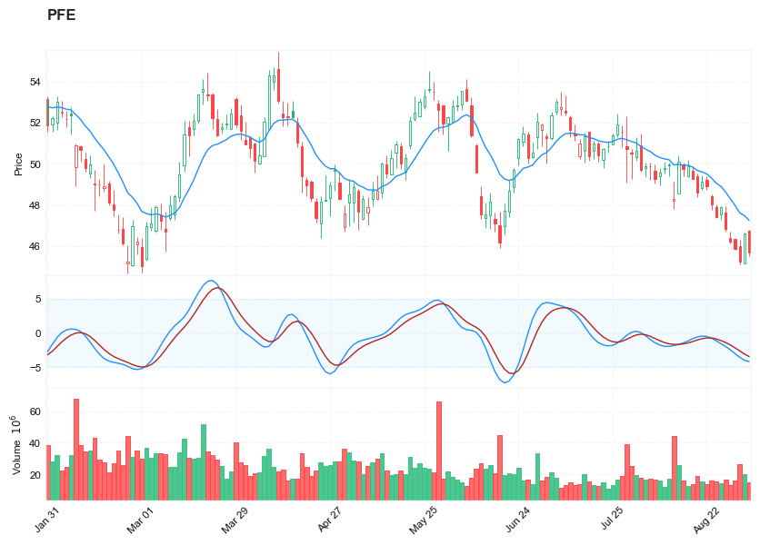

## MADH (moving average difference with Hann) by John Ehlers

**References**

- [traders.com: TradersTips 2021-11](https://traders.com/Documentation/FEEDbk_docs/2021/11/TradersTips.html)


**█ OVERVIEW**


In his October 2021 article in S&C, “Cycle/Trend Analytics And The MAD Indicator,” John Ehlers presented the MAD (moving average difference) indicator, an oscillator developed out of his research into understanding cycles data better. The MAD indicator effectively took the difference between two simple moving averages. While the MAD is said to offer an improvement over the classic, well-known MACD, the MADH (moving average difference with Hann) that Ehlers presents in his article in this issue, “The MADH: The MAD Indicator, Enhanced,” is said to offer an improvement over the MAD indicator. The enhancement comes from the utilization of the Hann windowing technique and takes the difference of two finite impulse response filters. Ehlers explains that excellent buy and sell indications can be seen in the indicator’s valleys and peaks, respectively.

##### Load basic packages 


```python
import pandas as pd
import numpy as np
import os
import gc
import copy
from pathlib import Path
from datetime import datetime, timedelta, time, date
```


```python
#this package is to download equity price data from yahoo finance
#the source code of this package can be found here: https://github.com/ranaroussi/yfinance/blob/main
import yfinance as yf
```


```python
pd.options.display.max_rows = 100
pd.options.display.max_columns = 100

import warnings
warnings.filterwarnings("ignore")

import pytorch_lightning as pl
random_seed=1234
pl.seed_everything(random_seed)
```

    Global seed set to 1234
    


    1234


```python
#S&P 500 (^GSPC),  Dow Jones Industrial Average (^DJI), NASDAQ Composite (^IXIC)
#Russell 2000 (^RUT), Crude Oil Nov 21 (CL=F), Gold Dec 21 (GC=F)
#Treasury Yield 10 Years (^TNX)

#benchmark_tickers = ['^GSPC', '^DJI', '^IXIC', '^RUT',  'CL=F', 'GC=F', '^TNX']

benchmark_tickers = ['^GSPC']
tickers = benchmark_tickers + ['GSK', 'BST', 'PFE']
```


```python
#https://github.com/ranaroussi/yfinance/blob/main/yfinance/base.py
#     def history(self, period="1mo", interval="1d",
#                 start=None, end=None, prepost=False, actions=True,
#                 auto_adjust=True, back_adjust=False,
#                 proxy=None, rounding=False, tz=None, timeout=None, **kwargs):

dfs = {}

for ticker in tickers:
    cur_data = yf.Ticker(ticker)
    hist = cur_data.history(period="max", start='2000-01-01')
    print(datetime.now(), ticker, hist.shape, hist.index.min(), hist.index.max())
    dfs[ticker] = hist
```

    2022-09-04 22:18:34.517672 ^GSPC (5706, 7) 1999-12-31 00:00:00 2022-09-02 00:00:00
    2022-09-04 22:18:34.795366 GSK (5706, 7) 1999-12-31 00:00:00 2022-09-02 00:00:00
    2022-09-04 22:18:35.060961 BST (1976, 7) 2014-10-29 00:00:00 2022-09-02 00:00:00
    2022-09-04 22:18:35.427402 PFE (5706, 7) 1999-12-31 00:00:00 2022-09-02 00:00:00
    


```python
ticker = 'PFE'
dfs[ticker].tail(5)
```


<div>
<style scoped>
    .dataframe tbody tr th:only-of-type {
        vertical-align: middle;
    }

    .dataframe tbody tr th {
        vertical-align: top;
    }

    .dataframe thead th {
        text-align: right;
    }
</style>
<table border="1" class="dataframe">
  <thead>
    <tr style="text-align: right;">
      <th></th>
      <th>Open</th>
      <th>High</th>
      <th>Low</th>
      <th>Close</th>
      <th>Volume</th>
      <th>Dividends</th>
      <th>Stock Splits</th>
    </tr>
    <tr>
      <th>Date</th>
      <th></th>
      <th></th>
      <th></th>
      <th></th>
      <th></th>
      <th></th>
      <th></th>
    </tr>
  </thead>
  <tbody>
    <tr>
      <th>2022-08-29</th>
      <td>46.380001</td>
      <td>46.689999</td>
      <td>46.119999</td>
      <td>46.230000</td>
      <td>13400500</td>
      <td>0.0</td>
      <td>0.0</td>
    </tr>
    <tr>
      <th>2022-08-30</th>
      <td>46.340000</td>
      <td>46.349998</td>
      <td>45.799999</td>
      <td>45.849998</td>
      <td>16303000</td>
      <td>0.0</td>
      <td>0.0</td>
    </tr>
    <tr>
      <th>2022-08-31</th>
      <td>46.009998</td>
      <td>46.290001</td>
      <td>45.130001</td>
      <td>45.230000</td>
      <td>26416800</td>
      <td>0.0</td>
      <td>0.0</td>
    </tr>
    <tr>
      <th>2022-09-01</th>
      <td>45.139999</td>
      <td>46.650002</td>
      <td>45.139999</td>
      <td>46.630001</td>
      <td>19947600</td>
      <td>0.0</td>
      <td>0.0</td>
    </tr>
    <tr>
      <th>2022-09-02</th>
      <td>46.740002</td>
      <td>46.799999</td>
      <td>45.529999</td>
      <td>45.700001</td>
      <td>14662700</td>
      <td>0.0</td>
      <td>0.0</td>
    </tr>
  </tbody>
</table>
</div>


##### Define MADH (moving average difference with Hann) calculation function


```python
import math
def cal_madh(ohlc: pd.DataFrame, 
               period: int = 8,
               dominant_cycle: int = 27,
               signal: int = 5, 
               column: str = "close",
               adjust: bool = True,
              ) -> pd.DataFrame:
    """
    Last month in his October 2021 article in S&C, “Cycle/Trend Analytics And The MAD Indicator,” John Ehlers presented the MAD (moving average difference) indicator, an oscillator developed out of his research into understanding cycles data better. The MAD indicator effectively took the difference between two simple moving averages. While the MAD is said to offer an improvement over the classic, well-known MACD, the MADH (moving average difference with Hann) that Ehlers presents in his article in this issue, “The MADH: The MAD Indicator, Enhanced,” is said to offer an improvement over the MAD indicator. The enhancement comes from the utilization of the Hann windowing technique and takes the difference of two finite impulse response filters. Ehlers explains that excellent buy and sell indications can be seen in the indicator’s valleys and peaks, respectively.
    
    source: https://traders.com/Documentation/FEEDbk_docs/2021/11/TradersTips.html
    
    
    Indicator:  TASC NOV 2021 MADH
    // TASC NOV 2021
    // MADH (Moving Average Difference - Hann) Indicator
    // (C) 2021 John F. Ehlers

    inputs:
        ShortLength(8),
        DominantCycle(27);

    variables:
        LongLength(20),
        Filt1(0),
        Filt2(0), 
        coef(0),
        count(0),
        MADH(0);

    LongLength = IntPortion(ShortLength + DominantCycle / 2);
    Filt1 = 0;
    coef = 0;

    for count = 1 to ShortLength 
    begin
        Filt1 = Filt1 + (1 - Cosine(360*count / (ShortLength + 
         1)))*Close[count - 1];
        coef = coef + (1 - Cosine(360*count / (ShortLength + 1)));
    end;

    If coef <> 0 then Filt1 = Filt1 / coef;

    Filt2 = 0;
    coef = 0;

    for count = 1 to LongLength 
    begin
        Filt2 = Filt2 + (1 - Cosine(360*count / (LongLength + 
         1)))*Close[count - 1];
        coef = coef + (1 - Cosine(360*count / (LongLength + 1)));
    end;

    If coef <> 0 Then Filt2 = Filt2 / coef;

    // Computed as percentage of price
    If Filt2 <> 0 then MADH = 100*(Filt1 - Filt2) / Filt2;

    Plot1(MADH, "MADH");
    Plot2(0, "Zero");    
    
    
    """
 
    #Smooth Directional Movements with Hann Windowed FIR filter
    def _hann(_data, _len):
        pi_ = 2.0*math.pi/(_len + 1)
        dm_sum = 0.0
        coef_sum = 0.0

        for i in range(_len):
            j = i + 1
            coef = 1 - math.cos(pi_*j)
            dm_sum = dm_sum + coef*_data[i]
            coef_sum = coef_sum + coef 

        _dmh = 0 
        if coef_sum != 0:
            _dmh = dm_sum / coef_sum
        return _dmh      
    
    slow_period = int(period + dominant_cycle/2)
    c = ohlc[column]
    hann_fast = c.rolling(window=period, min_periods=period).apply(lambda x: _hann(x, period)) 
    hann_slow = c.rolling(window=slow_period, min_periods=slow_period).apply(lambda x: _hann(x, slow_period)) 
    madh = 100*(hann_fast - hann_slow)/hann_slow
    madh_signal = madh.ewm(ignore_na=False, span=signal, adjust=adjust).mean()
    
    return pd.DataFrame(data = {'MADH': madh.values, 
                                'MADH_SIGNAL': madh_signal.values, 
                               }, 
                        index = ohlc.index
                       )
```

##### Calculate MADH (moving average difference with Hann)


```python
df = dfs[ticker][['Open', 'High', 'Low', 'Close', 'Volume']]
```


```python
df = df.round(2)
```


```python
cal_madh
```


    <function __main__.cal_madh(ohlc: pandas.core.frame.DataFrame, period: int = 8, dominant_cycle: int = 27, signal: int = 5, column: str = 'close', adjust: bool = True) -> pandas.core.frame.DataFrame>


```python
df_ta = cal_madh(df, period = 8, dominant_cycle = 23, signal = 5, column = 'Close')
df = df.merge(df_ta, left_index = True, right_index = True, how='inner' )

del df_ta
gc.collect()
```


    122


```python
from core.finta import TA
```


```python
df_ta = TA.EMA(df, period = 14, column="close")
df_ta.name='EMA'
df = df.merge(df_ta, left_index = True, right_index = True, how='inner' )

del df_ta
gc.collect()
```


    0


```python
display(df.head(5))
display(df.tail(5))
```


<div>
<style scoped>
    .dataframe tbody tr th:only-of-type {
        vertical-align: middle;
    }

    .dataframe tbody tr th {
        vertical-align: top;
    }

    .dataframe thead th {
        text-align: right;
    }
</style>
<table border="1" class="dataframe">
  <thead>
    <tr style="text-align: right;">
      <th></th>
      <th>Open</th>
      <th>High</th>
      <th>Low</th>
      <th>Close</th>
      <th>Volume</th>
      <th>MADH</th>
      <th>MADH_SIGNAL</th>
      <th>EMA</th>
    </tr>
    <tr>
      <th>Date</th>
      <th></th>
      <th></th>
      <th></th>
      <th></th>
      <th></th>
      <th></th>
      <th></th>
      <th></th>
    </tr>
  </thead>
  <tbody>
    <tr>
      <th>1999-12-31</th>
      <td>14.25</td>
      <td>14.31</td>
      <td>14.11</td>
      <td>14.22</td>
      <td>5939817</td>
      <td>NaN</td>
      <td>NaN</td>
      <td>14.220000</td>
    </tr>
    <tr>
      <th>2000-01-03</th>
      <td>14.06</td>
      <td>14.20</td>
      <td>13.87</td>
      <td>13.98</td>
      <td>12873345</td>
      <td>NaN</td>
      <td>NaN</td>
      <td>14.091429</td>
    </tr>
    <tr>
      <th>2000-01-04</th>
      <td>13.70</td>
      <td>13.81</td>
      <td>13.16</td>
      <td>13.46</td>
      <td>14208974</td>
      <td>NaN</td>
      <td>NaN</td>
      <td>13.850221</td>
    </tr>
    <tr>
      <th>2000-01-05</th>
      <td>13.54</td>
      <td>13.98</td>
      <td>13.51</td>
      <td>13.68</td>
      <td>12981591</td>
      <td>NaN</td>
      <td>NaN</td>
      <td>13.798145</td>
    </tr>
    <tr>
      <th>2000-01-06</th>
      <td>13.70</td>
      <td>14.36</td>
      <td>13.68</td>
      <td>14.17</td>
      <td>11115273</td>
      <td>NaN</td>
      <td>NaN</td>
      <td>13.895162</td>
    </tr>
  </tbody>
</table>
</div>


<div>
<style scoped>
    .dataframe tbody tr th:only-of-type {
        vertical-align: middle;
    }

    .dataframe tbody tr th {
        vertical-align: top;
    }

    .dataframe thead th {
        text-align: right;
    }
</style>
<table border="1" class="dataframe">
  <thead>
    <tr style="text-align: right;">
      <th></th>
      <th>Open</th>
      <th>High</th>
      <th>Low</th>
      <th>Close</th>
      <th>Volume</th>
      <th>MADH</th>
      <th>MADH_SIGNAL</th>
      <th>EMA</th>
    </tr>
    <tr>
      <th>Date</th>
      <th></th>
      <th></th>
      <th></th>
      <th></th>
      <th></th>
      <th></th>
      <th></th>
      <th></th>
    </tr>
  </thead>
  <tbody>
    <tr>
      <th>2022-08-29</th>
      <td>46.38</td>
      <td>46.69</td>
      <td>46.12</td>
      <td>46.23</td>
      <td>13400500</td>
      <td>-2.441462</td>
      <td>-1.730902</td>
      <td>48.306377</td>
    </tr>
    <tr>
      <th>2022-08-30</th>
      <td>46.34</td>
      <td>46.35</td>
      <td>45.80</td>
      <td>45.85</td>
      <td>16303000</td>
      <td>-2.980290</td>
      <td>-2.147365</td>
      <td>47.978860</td>
    </tr>
    <tr>
      <th>2022-08-31</th>
      <td>46.01</td>
      <td>46.29</td>
      <td>45.13</td>
      <td>45.23</td>
      <td>26416800</td>
      <td>-3.528499</td>
      <td>-2.607743</td>
      <td>47.612345</td>
    </tr>
    <tr>
      <th>2022-09-01</th>
      <td>45.14</td>
      <td>46.65</td>
      <td>45.14</td>
      <td>46.63</td>
      <td>19947600</td>
      <td>-3.954575</td>
      <td>-3.056687</td>
      <td>47.481366</td>
    </tr>
    <tr>
      <th>2022-09-02</th>
      <td>46.74</td>
      <td>46.80</td>
      <td>45.53</td>
      <td>45.70</td>
      <td>14662700</td>
      <td>-4.151768</td>
      <td>-3.421714</td>
      <td>47.243850</td>
    </tr>
  </tbody>
</table>
</div>


```python
df[['MADH', 'MADH_SIGNAL']].hist(bins=50)
```


    array([[<AxesSubplot:title={'center':'MADH'}>,
            <AxesSubplot:title={'center':'MADH_SIGNAL'}>]], dtype=object)


    

    


```python
#https://github.com/matplotlib/mplfinance
#this package help visualize financial data
import mplfinance as mpf
import matplotlib.colors as mcolors

# all_colors = list(mcolors.CSS4_COLORS.keys())#"CSS Colors"
# all_colors = list(mcolors.TABLEAU_COLORS.keys()) # "Tableau Palette",
# all_colors = list(mcolors.BASE_COLORS.keys()) #"Base Colors",
all_colors = ['dodgerblue', 'firebrick','limegreen','skyblue','lightgreen',  'navy','yellow','plum',  'yellowgreen']
#https://github.com/matplotlib/mplfinance/issues/181#issuecomment-667252575
#list of colors: https://matplotlib.org/stable/gallery/color/named_colors.html
#https://github.com/matplotlib/mplfinance/blob/master/examples/styles.ipynb

def make_3panels2(main_data, add_data, mid_panel=None, chart_type='candle', names=None, figratio=(14,9)):

    style = mpf.make_mpf_style(base_mpf_style='yahoo',  #charles
                               base_mpl_style = 'seaborn-whitegrid',
#                                marketcolors=mpf.make_marketcolors(up="r", down="#0000CC",inherit=True),
                               gridcolor="whitesmoke", 
                               gridstyle="--", #or None, or - for solid
                               gridaxis="both", 
                               edgecolor = 'whitesmoke',
                               facecolor = 'white', #background color within the graph edge
                               figcolor = 'white', #background color outside of the graph edge
                               y_on_right = False,
                               rc =  {'legend.fontsize': 'small',#or number
                                      #'figure.figsize': (14, 9),
                                     'axes.labelsize': 'small',
                                     'axes.titlesize':'small',
                                     'xtick.labelsize':'small',#'x-small', 'small','medium','large'
                                     'ytick.labelsize':'small'
                                     }, 
                              )   

    if (chart_type is None) or (chart_type not in ['ohlc', 'line', 'candle', 'hollow_and_filled']):
        chart_type = 'candle'
    len_dict = {'candle':2, 'ohlc':3, 'line':1, 'hollow_and_filled':2}    
        
    kwargs = dict(type=chart_type, figratio=figratio, volume=True, volume_panel=2, 
                  panel_ratios=(4,2, 2), tight_layout=True, style=style, returnfig=True)
    
    if names is None:
        names = {'main_title': '', 'sub_tile': ''}
    
    added_plots = { 
#         'S':  mpf.make_addplot(add_data['S'], panel=0, color='blue', type='scatter', marker=r'${S}$' , markersize=100, secondary_y=False),   
#         'B':  mpf.make_addplot(add_data['B'], panel=0, color='blue', type='scatter', marker=r'${B}$' , markersize=100, secondary_y=False), 
        
        'EMA': mpf.make_addplot(add_data['EMA'], panel=0, color='dodgerblue', width=1 ,secondary_y=False), 
    }

        
    
    fb_bbands = []
    if mid_panel is not None:
        i = 0
        for name_, data_ in mid_panel.iteritems():
            added_plots[name_] = mpf.make_addplot(data_, panel=1, width=1, color=all_colors[i],secondary_y=False)
            i = i + 1
        fb_bbands2_ = dict(y1=-5*np.ones(mid_panel.shape[0]),
                      y2=5*np.ones(mid_panel.shape[0]),color="lightskyblue",alpha=0.1,interpolate=True)
        fb_bbands2_['panel'] = 1
        fb_bbands.append(fb_bbands2_)


    fig, axes = mpf.plot(main_data,  **kwargs,
                         addplot=list(added_plots.values()), 
                         fill_between = fb_bbands,
                        )
    # add a new suptitle
    fig.suptitle(names['main_title'], y=1.05, fontsize=12, x=0.1285)

#     axes[0].legend([None]*4)
#     handles = axes[0].get_legend().legendHandles
#     axes[0].legend(handles=handles[2:],labels=['RS_EMA', 'EMA'])
#     axes[0].set_title(names['sub_tile'], fontsize=10, style='italic',  loc='left')
    

#     axes[0].set_ylabel(names['y_tiles'][0])
#     axes[2].set_ylabel(names['y_tiles'][1])
    return fig, axes
   
```


```python

start = -150
end = df.shape[0]

names = {'main_title': f'{ticker}', 
         'sub_tile': 'MADH'}


aa_, bb_ = make_3panels2(df.iloc[start:end][['Open', 'High', 'Low', 'Close', 'Volume']], 
            df.iloc[start:end][['EMA']],
            df.iloc[start:end][[ 'MADH', 'MADH_SIGNAL']],
             chart_type='hollow_and_filled',names = names)
```


    

    

