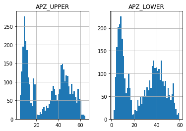
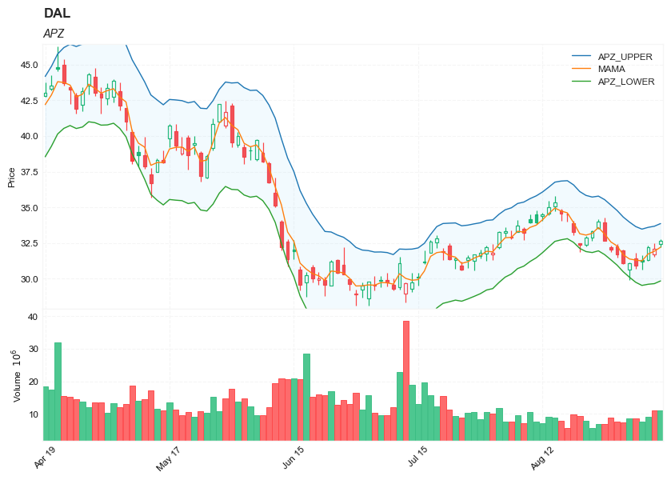
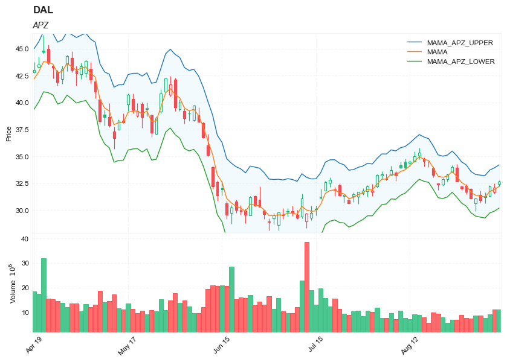

## Adaptive price zone (APZ)


##### Load basic packages 


```python
import pandas as pd
import numpy as np
import os
import gc
import copy
from pathlib import Path
from datetime import datetime, timedelta, time, date
```


```python
#this package is to download equity price data from yahoo finance
#the source code of this package can be found here: https://github.com/ranaroussi/yfinance/blob/main
import yfinance as yf
```


```python
pd.options.display.max_rows = 100
pd.options.display.max_columns = 100

import warnings
warnings.filterwarnings("ignore")

import pytorch_lightning as pl
random_seed=1234
pl.seed_everything(random_seed)
```

    Global seed set to 1234
    


    1234


```python
#S&P 500 (^GSPC),  Dow Jones Industrial Average (^DJI), NASDAQ Composite (^IXIC)
#Russell 2000 (^RUT), Crude Oil Nov 21 (CL=F), Gold Dec 21 (GC=F)
#Treasury Yield 10 Years (^TNX)

#benchmark_tickers = ['^GSPC', '^DJI', '^IXIC', '^RUT',  'CL=F', 'GC=F', '^TNX']

benchmark_tickers = ['^GSPC']
tickers = benchmark_tickers + ['GSK', 'NVO', 'PFE', 'DAL']
```


```python
#https://github.com/ranaroussi/yfinance/blob/main/yfinance/base.py
#     def history(self, period="1mo", interval="1d",
#                 start=None, end=None, prepost=False, actions=True,
#                 auto_adjust=True, back_adjust=False,
#                 proxy=None, rounding=False, tz=None, timeout=None, **kwargs):

dfs = {}

for ticker in tickers:
    cur_data = yf.Ticker(ticker)
    hist = cur_data.history(period="max", start='2000-01-01')
    print(datetime.now(), ticker, hist.shape, hist.index.min(), hist.index.max())
    dfs[ticker] = hist
```

    2022-09-10 20:49:41.614294 ^GSPC (5710, 7) 1999-12-31 00:00:00 2022-09-09 00:00:00
    2022-09-10 20:49:41.889554 GSK (5710, 7) 1999-12-31 00:00:00 2022-09-09 00:00:00
    2022-09-10 20:49:42.253902 NVO (5710, 7) 1999-12-31 00:00:00 2022-09-09 00:00:00
    2022-09-10 20:49:42.572385 PFE (5710, 7) 1999-12-31 00:00:00 2022-09-09 00:00:00
    2022-09-10 20:49:42.818600 DAL (3867, 7) 2007-05-03 00:00:00 2022-09-09 00:00:00
    


```python
ticker = 'DAL'
dfs[ticker].tail(5)
```


<div>
<style scoped>
    .dataframe tbody tr th:only-of-type {
        vertical-align: middle;
    }

    .dataframe tbody tr th {
        vertical-align: top;
    }

    .dataframe thead th {
        text-align: right;
    }
</style>
<table border="1" class="dataframe">
  <thead>
    <tr style="text-align: right;">
      <th></th>
      <th>Open</th>
      <th>High</th>
      <th>Low</th>
      <th>Close</th>
      <th>Volume</th>
      <th>Dividends</th>
      <th>Stock Splits</th>
    </tr>
    <tr>
      <th>Date</th>
      <th></th>
      <th></th>
      <th></th>
      <th></th>
      <th></th>
      <th></th>
      <th></th>
    </tr>
  </thead>
  <tbody>
    <tr>
      <th>2022-09-02</th>
      <td>31.440001</td>
      <td>31.830000</td>
      <td>30.700001</td>
      <td>30.940001</td>
      <td>8626500</td>
      <td>0.0</td>
      <td>0</td>
    </tr>
    <tr>
      <th>2022-09-06</th>
      <td>31.340000</td>
      <td>31.650000</td>
      <td>30.660000</td>
      <td>31.190001</td>
      <td>7630800</td>
      <td>0.0</td>
      <td>0</td>
    </tr>
    <tr>
      <th>2022-09-07</th>
      <td>31.290001</td>
      <td>32.340000</td>
      <td>31.270000</td>
      <td>32.230000</td>
      <td>9035900</td>
      <td>0.0</td>
      <td>0</td>
    </tr>
    <tr>
      <th>2022-09-08</th>
      <td>31.719999</td>
      <td>32.490002</td>
      <td>31.549999</td>
      <td>32.119999</td>
      <td>11085400</td>
      <td>0.0</td>
      <td>0</td>
    </tr>
    <tr>
      <th>2022-09-09</th>
      <td>32.430000</td>
      <td>32.759998</td>
      <td>32.240002</td>
      <td>32.660000</td>
      <td>10958900</td>
      <td>0.0</td>
      <td>0</td>
    </tr>
  </tbody>
</table>
</div>


##### Define APZ calculation function


##### Calculate APZ


```python
df = dfs[ticker][['Open', 'High', 'Low', 'Close', 'Volume']]
```


```python
df = df.round(2)
```


```python
from core.finta import TA
```


```python
TA.APZ
```


    <function core.finta.TA.APZ(ohlc: pandas.core.frame.DataFrame, period: int = 21, dev_factor: int = 2, MA: pandas.core.series.Series = None, adjust: bool = True) -> pandas.core.frame.DataFrame>


```python
df_ta = TA.APZ(df, period=14, dev_factor=2.2)
df = df.merge(df_ta, left_index = True, right_index = True, how='inner' )

del df_ta
gc.collect()
```


    80


```python
df_ta = TA.MAMA(df, column='close')
df = df.merge(df_ta, left_index = True, right_index = True, how='inner' )

del df_ta
gc.collect()
```


    21


```python
df_ta = TA.APZ(df, period=14, dev_factor=2.2, MA=df['MAMA'])
df_ta.columns = [f'MAMA_{c}' for c in df_ta.columns]
df = df.merge(df_ta, left_index = True, right_index = True, how='inner' )

df_ta = TA.APZ(df, period=14, dev_factor=2.2, MA=df['FAMA'])
df_ta.columns = [f'FAMA_{c}' for c in df_ta.columns]
df = df.merge(df_ta, left_index = True, right_index = True, how='inner' )

del df_ta
gc.collect()
```


    0


```python
display(df.head(5))
display(df.tail(5))
```


<div>
<style scoped>
    .dataframe tbody tr th:only-of-type {
        vertical-align: middle;
    }

    .dataframe tbody tr th {
        vertical-align: top;
    }

    .dataframe thead th {
        text-align: right;
    }
</style>
<table border="1" class="dataframe">
  <thead>
    <tr style="text-align: right;">
      <th></th>
      <th>Open</th>
      <th>High</th>
      <th>Low</th>
      <th>Close</th>
      <th>Volume</th>
      <th>APZ_UPPER</th>
      <th>APZ_LOWER</th>
      <th>MAMA</th>
      <th>FAMA</th>
      <th>MAMA_APZ_UPPER</th>
      <th>MAMA_APZ_LOWER</th>
      <th>FAMA_APZ_UPPER</th>
      <th>FAMA_APZ_LOWER</th>
    </tr>
    <tr>
      <th>Date</th>
      <th></th>
      <th></th>
      <th></th>
      <th></th>
      <th></th>
      <th></th>
      <th></th>
      <th></th>
      <th></th>
      <th></th>
      <th></th>
      <th></th>
      <th></th>
    </tr>
  </thead>
  <tbody>
    <tr>
      <th>2007-05-03</th>
      <td>19.32</td>
      <td>19.50</td>
      <td>18.25</td>
      <td>18.40</td>
      <td>8052800</td>
      <td>21.150000</td>
      <td>15.650000</td>
      <td>18.40</td>
      <td>18.40</td>
      <td>21.150000</td>
      <td>15.650000</td>
      <td>21.150000</td>
      <td>15.650000</td>
    </tr>
    <tr>
      <th>2007-05-04</th>
      <td>18.88</td>
      <td>18.96</td>
      <td>18.39</td>
      <td>18.64</td>
      <td>5437300</td>
      <td>20.908929</td>
      <td>16.267602</td>
      <td>18.64</td>
      <td>18.64</td>
      <td>20.960663</td>
      <td>16.319337</td>
      <td>20.960663</td>
      <td>16.319337</td>
    </tr>
    <tr>
      <th>2007-05-07</th>
      <td>18.83</td>
      <td>18.91</td>
      <td>17.94</td>
      <td>18.08</td>
      <td>2646300</td>
      <td>20.493791</td>
      <td>16.082627</td>
      <td>18.08</td>
      <td>18.08</td>
      <td>20.285582</td>
      <td>15.874418</td>
      <td>20.285582</td>
      <td>15.874418</td>
    </tr>
    <tr>
      <th>2007-05-08</th>
      <td>17.76</td>
      <td>17.76</td>
      <td>17.14</td>
      <td>17.44</td>
      <td>4166100</td>
      <td>19.921244</td>
      <td>15.746675</td>
      <td>17.44</td>
      <td>17.44</td>
      <td>19.527285</td>
      <td>15.352715</td>
      <td>19.527285</td>
      <td>15.352715</td>
    </tr>
    <tr>
      <th>2007-05-09</th>
      <td>17.54</td>
      <td>17.94</td>
      <td>17.44</td>
      <td>17.58</td>
      <td>7541100</td>
      <td>19.640269</td>
      <td>15.703611</td>
      <td>17.58</td>
      <td>17.58</td>
      <td>19.548329</td>
      <td>15.611671</td>
      <td>19.548329</td>
      <td>15.611671</td>
    </tr>
  </tbody>
</table>
</div>


<div>
<style scoped>
    .dataframe tbody tr th:only-of-type {
        vertical-align: middle;
    }

    .dataframe tbody tr th {
        vertical-align: top;
    }

    .dataframe thead th {
        text-align: right;
    }
</style>
<table border="1" class="dataframe">
  <thead>
    <tr style="text-align: right;">
      <th></th>
      <th>Open</th>
      <th>High</th>
      <th>Low</th>
      <th>Close</th>
      <th>Volume</th>
      <th>APZ_UPPER</th>
      <th>APZ_LOWER</th>
      <th>MAMA</th>
      <th>FAMA</th>
      <th>MAMA_APZ_UPPER</th>
      <th>MAMA_APZ_LOWER</th>
      <th>FAMA_APZ_UPPER</th>
      <th>FAMA_APZ_LOWER</th>
    </tr>
    <tr>
      <th>Date</th>
      <th></th>
      <th></th>
      <th></th>
      <th></th>
      <th></th>
      <th></th>
      <th></th>
      <th></th>
      <th></th>
      <th></th>
      <th></th>
      <th></th>
      <th></th>
    </tr>
  </thead>
  <tbody>
    <tr>
      <th>2022-09-02</th>
      <td>31.44</td>
      <td>31.83</td>
      <td>30.70</td>
      <td>30.94</td>
      <td>8626500</td>
      <td>33.658708</td>
      <td>29.756629</td>
      <td>31.312376</td>
      <td>32.321281</td>
      <td>33.263416</td>
      <td>29.361337</td>
      <td>34.272320</td>
      <td>30.370241</td>
    </tr>
    <tr>
      <th>2022-09-06</th>
      <td>31.34</td>
      <td>31.65</td>
      <td>30.66</td>
      <td>31.19</td>
      <td>7630800</td>
      <td>33.478423</td>
      <td>29.537191</td>
      <td>31.251188</td>
      <td>32.053757</td>
      <td>33.221804</td>
      <td>29.280572</td>
      <td>34.024373</td>
      <td>30.083141</td>
    </tr>
    <tr>
      <th>2022-09-07</th>
      <td>31.29</td>
      <td>32.34</td>
      <td>31.27</td>
      <td>32.23</td>
      <td>9035900</td>
      <td>33.603018</td>
      <td>29.618747</td>
      <td>31.740594</td>
      <td>31.975467</td>
      <td>33.732730</td>
      <td>29.748458</td>
      <td>33.967602</td>
      <td>29.983331</td>
    </tr>
    <tr>
      <th>2022-09-08</th>
      <td>31.72</td>
      <td>32.49</td>
      <td>31.55</td>
      <td>32.12</td>
      <td>11085400</td>
      <td>33.681581</td>
      <td>29.662285</td>
      <td>31.930297</td>
      <td>31.964174</td>
      <td>33.939945</td>
      <td>29.920649</td>
      <td>33.973822</td>
      <td>29.954526</td>
    </tr>
    <tr>
      <th>2022-09-09</th>
      <td>32.43</td>
      <td>32.76</td>
      <td>32.24</td>
      <td>32.66</td>
      <td>10958900</td>
      <td>33.867567</td>
      <td>29.852742</td>
      <td>32.211529</td>
      <td>32.011840</td>
      <td>34.218942</td>
      <td>30.204117</td>
      <td>34.019253</td>
      <td>30.004428</td>
    </tr>
  </tbody>
</table>
</div>


```python
df[['APZ_UPPER',  'APZ_LOWER']].hist(bins=50)
```


    array([[<AxesSubplot:title={'center':'APZ_UPPER'}>,
            <AxesSubplot:title={'center':'APZ_LOWER'}>]], dtype=object)


    

    


```python
#https://github.com/matplotlib/mplfinance
#this package help visualize financial data
import mplfinance as mpf
import matplotlib.colors as mcolors

# all_colors = list(mcolors.CSS4_COLORS.keys())#"CSS Colors"
# all_colors = list(mcolors.TABLEAU_COLORS.keys()) # "Tableau Palette",
# all_colors = list(mcolors.BASE_COLORS.keys()) #"Base Colors",
all_colors = ['dodgerblue', 'firebrick','limegreen','skyblue','lightgreen',  'navy','yellow','plum',  'yellowgreen']
#https://github.com/matplotlib/mplfinance/issues/181#issuecomment-667252575
#list of colors: https://matplotlib.org/stable/gallery/color/named_colors.html
#https://github.com/matplotlib/mplfinance/blob/master/examples/styles.ipynb

def make_3panels2(main_data, add_data, mid_panel=None, chart_type='candle', names=None, figratio=(14,9)):
    """
    main chart type: default is candle. alternatives: ohlc, line

    example:
    start = 200

    names = {'main_title': 'MAMA: MESA Adaptive Moving Average', 
             'sub_tile': 'S&P 500 (^GSPC)', 'y_tiles': ['price', 'Volume [$10^{6}$]']}


    make_candle(df.iloc[-start:, :5], df.iloc[-start:][['MAMA', 'FAMA']], names = names)
    
    """

    style = mpf.make_mpf_style(base_mpf_style='yahoo',  #charles
                               base_mpl_style = 'seaborn-whitegrid',
#                                marketcolors=mpf.make_marketcolors(up="r", down="#0000CC",inherit=True),
                               gridcolor="whitesmoke", 
                               gridstyle="--", #or None, or - for solid
                               gridaxis="both", 
                               edgecolor = 'whitesmoke',
                               facecolor = 'white', #background color within the graph edge
                               figcolor = 'white', #background color outside of the graph edge
                               y_on_right = False,
                               rc =  {'legend.fontsize': 'small',#or number
                                      #'figure.figsize': (14, 9),
                                     'axes.labelsize': 'small',
                                     'axes.titlesize':'small',
                                     'xtick.labelsize':'small',#'x-small', 'small','medium','large'
                                     'ytick.labelsize':'small'
                                     }, 
                              )   

    if (chart_type is None) or (chart_type not in ['ohlc', 'line', 'candle', 'hollow_and_filled']):
        chart_type = 'candle'
    len_dict = {'candle':2, 'ohlc':3, 'line':1, 'hollow_and_filled':2}    
        
    kwargs = dict(type=chart_type, figratio=figratio, volume=True, volume_panel=1, 
                  panel_ratios=(4,2), tight_layout=True, style=style, returnfig=True)
    
    if names is None:
        names = {'main_title': '', 'sub_tile': ''}
    


    added_plots = { }
    for name_, data_ in add_data.iteritems():
        added_plots[name_] = mpf.make_addplot(data_, panel=0, width=1, secondary_y=False)
    
    fb_bbands_ = dict(y1=add_data.iloc[:, 0].values,
                      y2=add_data.iloc[:, 2].values,color="lightskyblue",alpha=0.1,interpolate=True)
    fb_bbands_['panel'] = 0
    

    fb_bbands= [fb_bbands_]
    
    
    if mid_panel is not None:
        i = 0
        for name_, data_ in mid_panel.iteritems():
            added_plots[name_] = mpf.make_addplot(data_, panel=1, color=all_colors[i])
            i = i + 1
        fb_bbands2_ = dict(y1=np.zeros(mid_panel.shape[0]),
                      y2=0.8+np.zeros(mid_panel.shape[0]),color="lightskyblue",alpha=0.1,interpolate=True)
        fb_bbands2_['panel'] = 1
        fb_bbands.append(fb_bbands2_)


    fig, axes = mpf.plot(main_data,  **kwargs,
                         addplot=list(added_plots.values()), 
                         fill_between=fb_bbands)
    # add a new suptitle
    fig.suptitle(names['main_title'], y=1.05, fontsize=12, x=0.1285)

    axes[0].legend([None]*5)
    handles = axes[0].get_legend().legendHandles
    axes[0].legend(handles=handles[2:],labels=list(added_plots.keys()))
    axes[0].set_title(names['sub_tile'], fontsize=10, style='italic',  loc='left')
    

#     axes[0].set_ylabel(names['y_tiles'][0])
#     axes[2].set_ylabel(names['y_tiles'][1])
    return fig, axes
   
```


```python
df.columns
```


    Index(['Open', 'High', 'Low', 'Close', 'Volume', 'APZ_UPPER', 'APZ_LOWER',
           'MAMA', 'FAMA', 'MAMA_APZ_UPPER', 'MAMA_APZ_LOWER', 'FAMA_APZ_UPPER',
           'FAMA_APZ_LOWER'],
          dtype='object')


```python

start = -100
end = df.shape[0]

names = {'main_title': f'{ticker}', 
         'sub_tile': 'APZ'}


aa_, bb_ = make_3panels2(df.iloc[start:end][['Open', 'High', 'Low', 'Close', 'Volume']], 
            df.iloc[start:end][['APZ_UPPER', 'MAMA','APZ_LOWER']],
             chart_type='hollow_and_filled',names = names)
```


    

    


```python

start = -100
end = df.shape[0]

names = {'main_title': f'{ticker}', 
         'sub_tile': 'APZ'}

aa_, bb_ = make_3panels2(df.iloc[start:end][['Open', 'High', 'Low', 'Close', 'Volume']], 
            df.iloc[start:end][['MAMA_APZ_UPPER', 'MAMA','MAMA_APZ_LOWER']],
             chart_type='hollow_and_filled',names = names)
```


    

    


```python

start = -100
end = df.shape[0]

names = {'main_title': f'{ticker}', 
         'sub_tile': 'APZ'}

aa_, bb_ = make_3panels2(df.iloc[start:end][['Open', 'High', 'Low', 'Close', 'Volume']], 
            df.iloc[start:end][['FAMA_APZ_UPPER', 'FAMA', 'FAMA_APZ_LOWER']],
             chart_type='hollow_and_filled',names = names)
```


    

    

