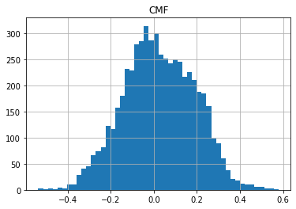

## Chaikin Money Flow (CMF)

**References**

- [fidelity.com: Chaikin Money Flow (CMF)](https://www.fidelity.com/learning-center/trading-investing/technical-analysis/technical-indicator-guide/cmf)
- [stockcharts.com: chaikin_money_flow_cmf](https://school.stockcharts.com/doku.php?id=technical_indicators:chaikin_money_flow_cmf)
- [github.com: pandas-ta cmf](https://github.com/twopirllc/pandas-ta/blob/96555b8752061405733664bb2f61d09cac9b29fd/pandas_ta/volume/cmf.py)


**Definition**

Chaikin Money Flow (CMF) developed by Marc Chaikin is a volume-weighted average of accumulation and distribution over a specified period. The standard CMF period is 21 days. The principle behind the Chaikin Money Flow is the nearer the closing price is to the high, the more accumulation has taken place. Conversely, the nearer the closing price is to the low, the more distribution has taken place. If the price action consistently closes above the bar's midpoint on increasing volume, the Chaikin Money Flow will be positive. Conversely, if the price action consistently closes below the bar's midpoint on increasing volume, the Chaikin Money Flow will be a negative value.

- A CMF value above the zero line is a sign of strength in the market, and a value below the zero line is a sign of weakness in the market.
- Wait for the CMF to confirm the breakout direction of price action through trend lines or through support and resistance lines. For example, if a price breaks upward through resistance, wait for the CMF to have a positive value to confirm the breakout direction.
- A CMF sell signal occurs when price action develops a higher high into overbought zones, with the CMF diverging with a lower high and beginning to fall.
- A CMF buy signal occurs when price action develops a lower low into oversold zones, with the CMF diverging with a higher low and beginning to rise.


**Calculation**

---

CMF = n-day Sum of [(((C - L) - (H - C)) / (H - L)) x Vol] / n-day Sum of Vol

Where:
n = number of periods, typically 21
H = high
L = low
C = close
Vol = volume

---


##### Load basic packages 


```python
import pandas as pd
import numpy as np
import os
import gc
import copy
from pathlib import Path
from datetime import datetime, timedelta, time, date
```


```python
#this package is to download equity price data from yahoo finance
#the source code of this package can be found here: https://github.com/ranaroussi/yfinance/blob/main
import yfinance as yf
```


```python
pd.options.display.max_rows = 100
pd.options.display.max_columns = 100

import warnings
warnings.filterwarnings("ignore")

import pytorch_lightning as pl
random_seed=1234
pl.seed_everything(random_seed)
```

    Global seed set to 1234
    


    1234


```python
#S&P 500 (^GSPC),  Dow Jones Industrial Average (^DJI), NASDAQ Composite (^IXIC)
#Russell 2000 (^RUT), Crude Oil Nov 21 (CL=F), Gold Dec 21 (GC=F)
#Treasury Yield 10 Years (^TNX)

#benchmark_tickers = ['^GSPC', '^DJI', '^IXIC', '^RUT',  'CL=F', 'GC=F', '^TNX']

benchmark_tickers = ['^GSPC']
tickers = benchmark_tickers + ['GSK', 'NVO', 'PFE']
```


```python
#https://github.com/ranaroussi/yfinance/blob/main/yfinance/base.py
#     def history(self, period="1mo", interval="1d",
#                 start=None, end=None, prepost=False, actions=True,
#                 auto_adjust=True, back_adjust=False,
#                 proxy=None, rounding=False, tz=None, timeout=None, **kwargs):

dfs = {}

for ticker in tickers:
    cur_data = yf.Ticker(ticker)
    hist = cur_data.history(period="max", start='2000-01-01')
    print(datetime.now(), ticker, hist.shape, hist.index.min(), hist.index.max())
    dfs[ticker] = hist
```

    2022-09-06 23:59:36.399435 ^GSPC (5707, 7) 1999-12-31 00:00:00 2022-09-06 00:00:00
    2022-09-06 23:59:36.774461 GSK (5707, 7) 1999-12-31 00:00:00 2022-09-06 00:00:00
    2022-09-06 23:59:37.120235 NVO (5707, 7) 1999-12-31 00:00:00 2022-09-06 00:00:00
    2022-09-06 23:59:37.516756 PFE (5707, 7) 1999-12-31 00:00:00 2022-09-06 00:00:00
    


```python
ticker = 'GSK'
dfs[ticker].tail(5)
```


<div>
<style scoped>
    .dataframe tbody tr th:only-of-type {
        vertical-align: middle;
    }

    .dataframe tbody tr th {
        vertical-align: top;
    }

    .dataframe thead th {
        text-align: right;
    }
</style>
<table border="1" class="dataframe">
  <thead>
    <tr style="text-align: right;">
      <th></th>
      <th>Open</th>
      <th>High</th>
      <th>Low</th>
      <th>Close</th>
      <th>Volume</th>
      <th>Dividends</th>
      <th>Stock Splits</th>
    </tr>
    <tr>
      <th>Date</th>
      <th></th>
      <th></th>
      <th></th>
      <th></th>
      <th></th>
      <th></th>
      <th></th>
    </tr>
  </thead>
  <tbody>
    <tr>
      <th>2022-08-30</th>
      <td>33.230000</td>
      <td>33.290001</td>
      <td>32.919998</td>
      <td>32.959999</td>
      <td>3994500</td>
      <td>0.0</td>
      <td>0.0</td>
    </tr>
    <tr>
      <th>2022-08-31</th>
      <td>32.790001</td>
      <td>32.880001</td>
      <td>32.459999</td>
      <td>32.480000</td>
      <td>4291800</td>
      <td>0.0</td>
      <td>0.0</td>
    </tr>
    <tr>
      <th>2022-09-01</th>
      <td>31.830000</td>
      <td>31.990000</td>
      <td>31.610001</td>
      <td>31.690001</td>
      <td>12390900</td>
      <td>0.0</td>
      <td>0.0</td>
    </tr>
    <tr>
      <th>2022-09-02</th>
      <td>31.600000</td>
      <td>31.969999</td>
      <td>31.469999</td>
      <td>31.850000</td>
      <td>8152600</td>
      <td>0.0</td>
      <td>0.0</td>
    </tr>
    <tr>
      <th>2022-09-06</th>
      <td>31.650000</td>
      <td>31.760000</td>
      <td>31.450001</td>
      <td>31.565001</td>
      <td>2282742</td>
      <td>0.0</td>
      <td>0.0</td>
    </tr>
  </tbody>
</table>
</div>


##### Define CMF calculation function

    


```python
def cal_cmf(ohlcv: pd.DataFrame, period: int = 10) -> pd.Series:
    """
    Chaikin Money Flow (CMF) developed by Marc Chaikin is a volume-weighted average of accumulation and distribution over a specified period. The standard CMF period is 21 days. The principle behind the Chaikin Money Flow is the nearer the closing price is to the high, the more accumulation has taken place. Conversely, the nearer the closing price is to the low, the more distribution has taken place. If the price action consistently closes above the bar's midpoint on increasing volume, the Chaikin Money Flow will be positive. Conversely, if the price action consistently closes below the bar's midpoint on increasing volume, the Chaikin Money Flow will be a negative value.
    
    
    """
    ohlcv = ohlcv.copy()
    ohlcv.columns = [c.lower() for c in ohlcv.columns]
    
    high = ohlcv["high"]
    low = ohlcv["low"]
    close = ohlcv["close"]
    volume = ohlcv["volume"]
    
    ad = (2*close - (high + low))*volume/(high - low)
    cmf = (ad.rolling(period, min_periods=period).sum())/(volume.rolling(period, min_periods=period).sum())
    
    return pd.Series(cmf, name='CMF')
```

##### Calculate CMF


```python
df = dfs[ticker][['Open', 'High', 'Low', 'Close', 'Volume']]
```


```python
df = df.round(2)
```


```python
help(cal_cmf)
```

    Help on function cal_cmf in module __main__:
    
    cal_cmf(ohlcv: pandas.core.frame.DataFrame, period: int = 10) -> pandas.core.series.Series
        Chaikin Money Flow (CMF) developed by Marc Chaikin is a volume-weighted average of accumulation and distribution over a specified period. The standard CMF period is 21 days. The principle behind the Chaikin Money Flow is the nearer the closing price is to the high, the more accumulation has taken place. Conversely, the nearer the closing price is to the low, the more distribution has taken place. If the price action consistently closes above the bar's midpoint on increasing volume, the Chaikin Money Flow will be positive. Conversely, if the price action consistently closes below the bar's midpoint on increasing volume, the Chaikin Money Flow will be a negative value.
    
    


```python
df_ta = cal_cmf(df, period = 21)
df = df.merge(df_ta, left_index = True, right_index = True, how='inner' )

del df_ta
gc.collect()
```


    19950


```python
from core.finta import TA
```


```python
help(TA.BBANDS)
```

    Help on function BBANDS in module core.finta:
    
    BBANDS(ohlc: pandas.core.frame.DataFrame, period: int = 20, MA: pandas.core.series.Series = None, column: str = 'close', std_multiplier: float = 2) -> pandas.core.frame.DataFrame
        Developed by John Bollinger, Bollinger Bands® are volatility bands placed above and below a moving average.
        Volatility is based on the standard deviation, which changes as volatility increases and decreases.
        The bands automatically widen when volatility increases and narrow when volatility decreases.
        
        This method allows input of some other form of moving average like EMA or KAMA around which BBAND will be formed.
        Pass desired moving average as <MA> argument. For example BBANDS(MA=TA.KAMA(20)).
    
    


```python
df_ta = TA.BBANDS(df,  period = 20, column="close", std_multiplier=1.95)
df = df.merge(df_ta, left_index = True, right_index = True, how='inner' )

del df_ta
gc.collect()
```


    42


```python
display(df.head(5))
display(df.tail(5))
```


<div>
<style scoped>
    .dataframe tbody tr th:only-of-type {
        vertical-align: middle;
    }

    .dataframe tbody tr th {
        vertical-align: top;
    }

    .dataframe thead th {
        text-align: right;
    }
</style>
<table border="1" class="dataframe">
  <thead>
    <tr style="text-align: right;">
      <th></th>
      <th>Open</th>
      <th>High</th>
      <th>Low</th>
      <th>Close</th>
      <th>Volume</th>
      <th>CMF</th>
      <th>BB_UPPER</th>
      <th>BB_MIDDLE</th>
      <th>BB_LOWER</th>
    </tr>
    <tr>
      <th>Date</th>
      <th></th>
      <th></th>
      <th></th>
      <th></th>
      <th></th>
      <th></th>
      <th></th>
      <th></th>
      <th></th>
    </tr>
  </thead>
  <tbody>
    <tr>
      <th>1999-12-31</th>
      <td>19.60</td>
      <td>19.67</td>
      <td>19.52</td>
      <td>19.56</td>
      <td>139400</td>
      <td>NaN</td>
      <td>NaN</td>
      <td>NaN</td>
      <td>NaN</td>
    </tr>
    <tr>
      <th>2000-01-03</th>
      <td>19.58</td>
      <td>19.71</td>
      <td>19.25</td>
      <td>19.45</td>
      <td>556100</td>
      <td>NaN</td>
      <td>NaN</td>
      <td>NaN</td>
      <td>NaN</td>
    </tr>
    <tr>
      <th>2000-01-04</th>
      <td>19.45</td>
      <td>19.45</td>
      <td>18.90</td>
      <td>18.95</td>
      <td>367200</td>
      <td>NaN</td>
      <td>NaN</td>
      <td>NaN</td>
      <td>NaN</td>
    </tr>
    <tr>
      <th>2000-01-05</th>
      <td>19.21</td>
      <td>19.58</td>
      <td>19.08</td>
      <td>19.58</td>
      <td>481700</td>
      <td>NaN</td>
      <td>NaN</td>
      <td>NaN</td>
      <td>NaN</td>
    </tr>
    <tr>
      <th>2000-01-06</th>
      <td>19.38</td>
      <td>19.43</td>
      <td>18.90</td>
      <td>19.30</td>
      <td>853800</td>
      <td>NaN</td>
      <td>NaN</td>
      <td>NaN</td>
      <td>NaN</td>
    </tr>
  </tbody>
</table>
</div>


<div>
<style scoped>
    .dataframe tbody tr th:only-of-type {
        vertical-align: middle;
    }

    .dataframe tbody tr th {
        vertical-align: top;
    }

    .dataframe thead th {
        text-align: right;
    }
</style>
<table border="1" class="dataframe">
  <thead>
    <tr style="text-align: right;">
      <th></th>
      <th>Open</th>
      <th>High</th>
      <th>Low</th>
      <th>Close</th>
      <th>Volume</th>
      <th>CMF</th>
      <th>BB_UPPER</th>
      <th>BB_MIDDLE</th>
      <th>BB_LOWER</th>
    </tr>
    <tr>
      <th>Date</th>
      <th></th>
      <th></th>
      <th></th>
      <th></th>
      <th></th>
      <th></th>
      <th></th>
      <th></th>
      <th></th>
    </tr>
  </thead>
  <tbody>
    <tr>
      <th>2022-08-30</th>
      <td>33.23</td>
      <td>33.29</td>
      <td>32.92</td>
      <td>32.96</td>
      <td>3994500</td>
      <td>0.132024</td>
      <td>41.099946</td>
      <td>35.7605</td>
      <td>30.421054</td>
    </tr>
    <tr>
      <th>2022-08-31</th>
      <td>32.79</td>
      <td>32.88</td>
      <td>32.46</td>
      <td>32.48</td>
      <td>4291800</td>
      <td>0.130608</td>
      <td>40.446679</td>
      <td>35.3665</td>
      <td>30.286321</td>
    </tr>
    <tr>
      <th>2022-09-01</th>
      <td>31.83</td>
      <td>31.99</td>
      <td>31.61</td>
      <td>31.69</td>
      <td>12390900</td>
      <td>0.097057</td>
      <td>39.764640</td>
      <td>34.9440</td>
      <td>30.123360</td>
    </tr>
    <tr>
      <th>2022-09-02</th>
      <td>31.60</td>
      <td>31.97</td>
      <td>31.47</td>
      <td>31.85</td>
      <td>8152600</td>
      <td>0.125980</td>
      <td>38.904860</td>
      <td>34.5310</td>
      <td>30.157140</td>
    </tr>
    <tr>
      <th>2022-09-06</th>
      <td>31.65</td>
      <td>31.76</td>
      <td>31.45</td>
      <td>31.57</td>
      <td>2282742</td>
      <td>0.109165</td>
      <td>37.926255</td>
      <td>34.1165</td>
      <td>30.306745</td>
    </tr>
  </tbody>
</table>
</div>


```python
df[['CMF']].hist(bins=50)
```


    array([[<AxesSubplot:title={'center':'CMF'}>]], dtype=object)


    

    


```python
#https://github.com/matplotlib/mplfinance
#this package help visualize financial data
import mplfinance as mpf
import matplotlib.colors as mcolors

# all_colors = list(mcolors.CSS4_COLORS.keys())#"CSS Colors"
# all_colors = list(mcolors.TABLEAU_COLORS.keys()) # "Tableau Palette",
# all_colors = list(mcolors.BASE_COLORS.keys()) #"Base Colors",
all_colors = ['dodgerblue', 'firebrick','limegreen','skyblue','lightgreen',  'navy','yellow','plum',  'yellowgreen']
#https://github.com/matplotlib/mplfinance/issues/181#issuecomment-667252575
#list of colors: https://matplotlib.org/stable/gallery/color/named_colors.html
#https://github.com/matplotlib/mplfinance/blob/master/examples/styles.ipynb

def make_3panels2(main_data, add_data, mid_panel=None, chart_type='candle', names=None, figratio=(14,9)):
    """
    main chart type: default is candle. alternatives: ohlc, line

    example:
    start = 200

    names = {'main_title': 'MAMA: MESA Adaptive Moving Average', 
             'sub_tile': 'S&P 500 (^GSPC)', 'y_tiles': ['price', 'Volume [$10^{6}$]']}


    make_candle(df.iloc[-start:, :5], df.iloc[-start:][['MAMA', 'FAMA']], names = names)
    
    """

    style = mpf.make_mpf_style(base_mpf_style='yahoo',  #charles
                               base_mpl_style = 'seaborn-whitegrid',
#                                marketcolors=mpf.make_marketcolors(up="r", down="#0000CC",inherit=True),
                               gridcolor="whitesmoke", 
                               gridstyle="--", #or None, or - for solid
                               gridaxis="both", 
                               edgecolor = 'whitesmoke',
                               facecolor = 'white', #background color within the graph edge
                               figcolor = 'white', #background color outside of the graph edge
                               y_on_right = False,
                               rc =  {'legend.fontsize': 'small',#or number
                                      #'figure.figsize': (14, 9),
                                     'axes.labelsize': 'small',
                                     'axes.titlesize':'small',
                                     'xtick.labelsize':'small',#'x-small', 'small','medium','large'
                                     'ytick.labelsize':'small'
                                     }, 
                              )   

    if (chart_type is None) or (chart_type not in ['ohlc', 'line', 'candle', 'hollow_and_filled']):
        chart_type = 'candle'
    len_dict = {'candle':2, 'ohlc':3, 'line':1, 'hollow_and_filled':2}    
        
    kwargs = dict(type=chart_type, figratio=figratio, volume=False, volume_panel=1, 
                  panel_ratios=(4,2), tight_layout=True, style=style, returnfig=True)
    
    if names is None:
        names = {'main_title': '', 'sub_tile': ''}
    


    added_plots = { }
    for name_, data_ in add_data.iteritems():
        added_plots[name_] = mpf.make_addplot(data_, panel=0, width=1, secondary_y=False)
    
    fb_bbands_ = dict(y1=add_data.iloc[:, 0].values,
                      y2=add_data.iloc[:, 1].values,color="lightskyblue",alpha=0.1,interpolate=True)
    fb_bbands_['panel'] = 0
    

    fb_bbands= [fb_bbands_]
    
    
    if mid_panel is not None:
        i = 0
        for name_, data_ in mid_panel.iteritems():
            added_plots[name_] = mpf.make_addplot(data_, panel=1, color=all_colors[i])
            i = i + 1
        fb_bbands2_ = dict(y1=-0.1*np.ones(mid_panel.shape[0]),
                      y2=0.1*np.ones(mid_panel.shape[0]),color="lightskyblue",alpha=0.1,interpolate=True)
        fb_bbands2_['panel'] = 1
        fb_bbands.append(fb_bbands2_)


    fig, axes = mpf.plot(main_data,  **kwargs,
                         addplot=list(added_plots.values()), 
                         fill_between=fb_bbands)
    # add a new suptitle
    fig.suptitle(names['main_title'], y=1.05, fontsize=12, x=0.1285)

#     axes[0].legend([None]*5)
#     handles = axes[0].get_legend().legendHandles
#     axes[0].legend(handles=handles[2:],labels=list(added_plots.keys()))
    axes[0].set_title(names['sub_tile'], fontsize=10, style='italic',  loc='left')
    

#     axes[0].set_ylabel(names['y_tiles'][0])
#     axes[2].set_ylabel(names['y_tiles'][1])
    return fig, axes
   
```


```python

start = -100
end = df.shape[0]

names = {'main_title': f'{ticker}', 
         'sub_tile': 'CMF'}


aa_, bb_ = make_3panels2(df.iloc[start:end][['Open', 'High', 'Low', 'Close', 'Volume']], 
            df.iloc[start:end][['BB_UPPER', 'BB_LOWER' ]],
            df.iloc[start:end][['CMF',]],
             chart_type='hollow_and_filled',names = names)
```


    

    

