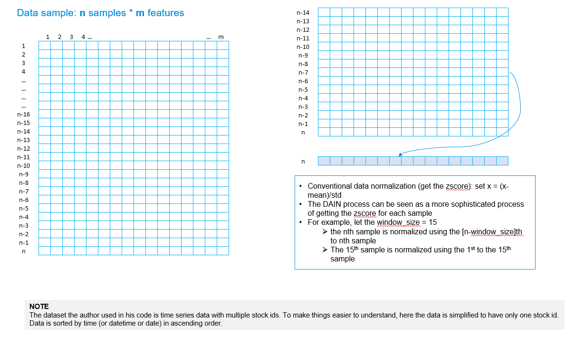
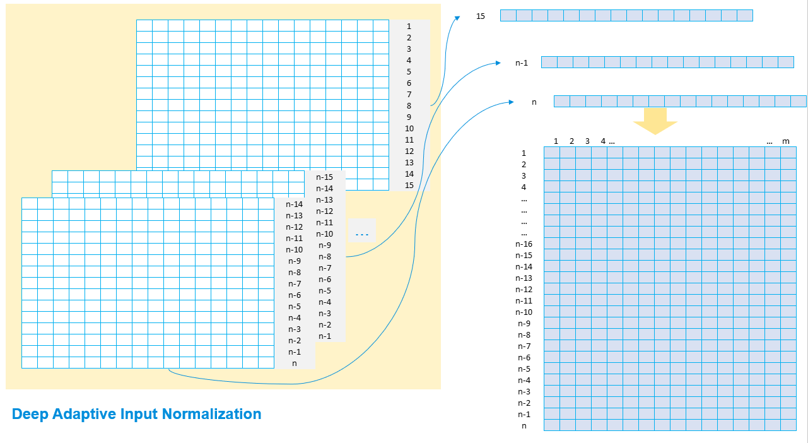
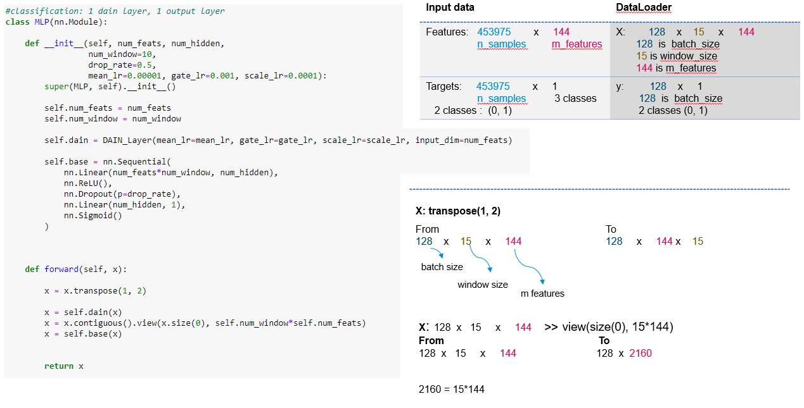

## Deep Adaptive Input Normalization for Time Series Forecasting

**References**

- [Passalis, N., Kanniainen, J., Gabbouj, M. et al. Forecasting Financial Time Series Using Robust Deep Adaptive Input Normalization. J Sign Process Syst 93, 1235–1251 (2021). https://doi.org/10.1007/s11265-020-01624-0](https://arxiv.org/pdf/1902.07892.pdf)
- [source code](https://github.com/passalis/dain)

**Notes on Paper**

- the authors of this paper proposed a data normalization layer called **deep adaptive input normalization** before the neural network learning layers to normalize data that aims to address the *non-stationary* issue of time series data.
- the architecture of the normalization layer outlines 3 steps - as is shown in the following figure:
  1. use of mean: x = x - mean
  1. use of standard deviation (std): x = x/std
  1. use of sigmoid: x = x*sigmoid
  

**Visual Explanation of DAIN process**

