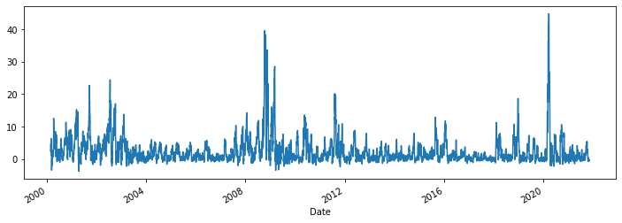
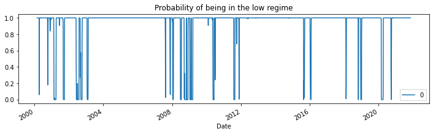
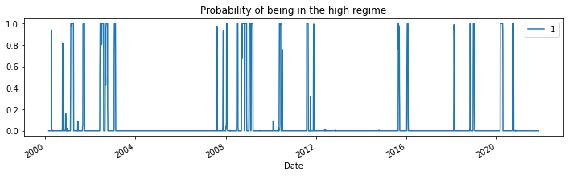
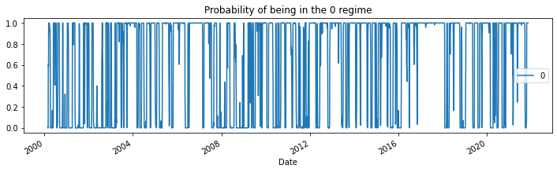
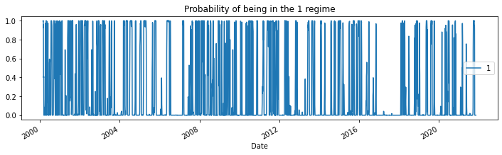
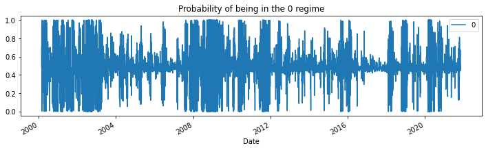
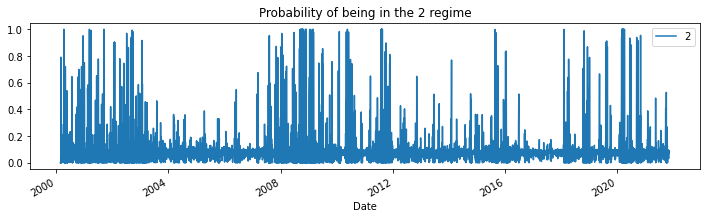
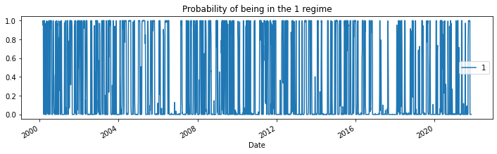

##  Markov switching dynamic regression models

### reference: 
 - example: https://www.statsmodels.org/dev/examples/notebooks/generated/markov_regression.html
 - doc: https://www.statsmodels.org/dev/generated/statsmodels.tsa.regime_switching.markov_regression.MarkovRegression.html

### Steps
1. download market data using yfinance: download S&P 500 ('^GSPC')
1. calculate return 20 day max return (i.e. target in supervised learning problem):
   - for each date (T):
    - calculate the max price change in next 20 trading dates: price_change = (max{close price in T+1 to T+20} - {close price on T})/({close price on T})
1. create exogenous variables: lagged dependent variable
    - lag 1 of target variable
    - lag 20 of target varable

### Markov switching parameters
- endog: The endogenous variable. the dependent variable (i.e. the target - 20 day max return)
- k_regimes:  The number of regimes.
- trend: Whether or not to include a trend.  Default is an intercept.
  - include an intercept: trend='c'
  - include time trend: trend='t'
  - include an intercept and time trend: trend='ct' 
  - no trend: trend='n'
- exog:exogenous regressors
- switching_trend: whether or not all trend coefficients are switching across regimes.  Default is True.
- switching_exog:whether or not all regression coefficients are switching across regimes. Default is True.
- switching_variance: Whether or not there is regime-specific heteroskedasticity, i.e. whether or not the error term has a switching variance. Default is False.

#### Summary

1. switching intercept: 2 regimes v. 5 regimes
 - set k_regimes as 2 or 5 and leave the rest as default
1. switching intercept and lagged dependent variable: 
 - k_regimes = 3
 - lag 1 and lag20 as exog variables


```python
import numpy as np
import pandas as pd
import statsmodels.api as sm

from datetime import datetime, timedelta
import yfinance as yf #to download stock price data
```

### download S&P 500 price data


```python
ticker = '^GSPC'
cur_data = yf.Ticker(ticker)
hist = cur_data.history(period="max")
print(ticker, hist.shape, hist.index.min(), hist.index.max())
```

    ^GSPC (19720, 7) 1927-12-30 00:00:00 2021-11-05 00:00:00
    


```python
df=hist[hist.index>='2000-01-01'].copy(deep=True)
df.head()
```


<div>
<style scoped>
    .dataframe tbody tr th:only-of-type {
        vertical-align: middle;
    }

    .dataframe tbody tr th {
        vertical-align: top;
    }

    .dataframe thead th {
        text-align: right;
    }
</style>
<table border="1" class="dataframe">
  <thead>
    <tr style="text-align: right;">
      <th></th>
      <th>Open</th>
      <th>High</th>
      <th>Low</th>
      <th>Close</th>
      <th>Volume</th>
      <th>Dividends</th>
      <th>Stock Splits</th>
    </tr>
    <tr>
      <th>Date</th>
      <th></th>
      <th></th>
      <th></th>
      <th></th>
      <th></th>
      <th></th>
      <th></th>
    </tr>
  </thead>
  <tbody>
    <tr>
      <th>2000-01-03</th>
      <td>1469.250000</td>
      <td>1478.000000</td>
      <td>1438.359985</td>
      <td>1455.219971</td>
      <td>931800000</td>
      <td>0</td>
      <td>0</td>
    </tr>
    <tr>
      <th>2000-01-04</th>
      <td>1455.219971</td>
      <td>1455.219971</td>
      <td>1397.430054</td>
      <td>1399.420044</td>
      <td>1009000000</td>
      <td>0</td>
      <td>0</td>
    </tr>
    <tr>
      <th>2000-01-05</th>
      <td>1399.420044</td>
      <td>1413.270020</td>
      <td>1377.680054</td>
      <td>1402.109985</td>
      <td>1085500000</td>
      <td>0</td>
      <td>0</td>
    </tr>
    <tr>
      <th>2000-01-06</th>
      <td>1402.109985</td>
      <td>1411.900024</td>
      <td>1392.099976</td>
      <td>1403.449951</td>
      <td>1092300000</td>
      <td>0</td>
      <td>0</td>
    </tr>
    <tr>
      <th>2000-01-07</th>
      <td>1403.449951</td>
      <td>1441.469971</td>
      <td>1400.729980</td>
      <td>1441.469971</td>
      <td>1225200000</td>
      <td>0</td>
      <td>0</td>
    </tr>
  </tbody>
</table>
</div>


### calcualte max return in next 20 trading days


```python
#for each stock_id, get the max close in next 20 trading days
price_col = 'Close'
roll_len=20
new_col = 'next_20day_max'
target_list = []

df.sort_index(ascending=True, inplace=True)
df.head(3)
```


<div>
<style scoped>
    .dataframe tbody tr th:only-of-type {
        vertical-align: middle;
    }

    .dataframe tbody tr th {
        vertical-align: top;
    }

    .dataframe thead th {
        text-align: right;
    }
</style>
<table border="1" class="dataframe">
  <thead>
    <tr style="text-align: right;">
      <th></th>
      <th>Open</th>
      <th>High</th>
      <th>Low</th>
      <th>Close</th>
      <th>Volume</th>
      <th>Dividends</th>
      <th>Stock Splits</th>
    </tr>
    <tr>
      <th>Date</th>
      <th></th>
      <th></th>
      <th></th>
      <th></th>
      <th></th>
      <th></th>
      <th></th>
    </tr>
  </thead>
  <tbody>
    <tr>
      <th>2000-01-03</th>
      <td>1469.250000</td>
      <td>1478.000000</td>
      <td>1438.359985</td>
      <td>1455.219971</td>
      <td>931800000</td>
      <td>0</td>
      <td>0</td>
    </tr>
    <tr>
      <th>2000-01-04</th>
      <td>1455.219971</td>
      <td>1455.219971</td>
      <td>1397.430054</td>
      <td>1399.420044</td>
      <td>1009000000</td>
      <td>0</td>
      <td>0</td>
    </tr>
    <tr>
      <th>2000-01-05</th>
      <td>1399.420044</td>
      <td>1413.270020</td>
      <td>1377.680054</td>
      <td>1402.109985</td>
      <td>1085500000</td>
      <td>0</td>
      <td>0</td>
    </tr>
  </tbody>
</table>
</div>


```python
df_next20dmax=df[[price_col]].shift(1).rolling(roll_len).max()
df_next20dmax.columns=[new_col]
df = df.merge(df_next20dmax, right_index=True, left_index=True, how='inner')

df.dropna(how='any', inplace=True)
df['target']= 100*(df[new_col]-df[price_col])/df[price_col]  
```


```python
df.head(3)
```


<div>
<style scoped>
    .dataframe tbody tr th:only-of-type {
        vertical-align: middle;
    }

    .dataframe tbody tr th {
        vertical-align: top;
    }

    .dataframe thead th {
        text-align: right;
    }
</style>
<table border="1" class="dataframe">
  <thead>
    <tr style="text-align: right;">
      <th></th>
      <th>Open</th>
      <th>High</th>
      <th>Low</th>
      <th>Close</th>
      <th>Volume</th>
      <th>Dividends</th>
      <th>Stock Splits</th>
      <th>next_20day_max</th>
      <th>target</th>
    </tr>
    <tr>
      <th>Date</th>
      <th></th>
      <th></th>
      <th></th>
      <th></th>
      <th></th>
      <th></th>
      <th></th>
      <th></th>
      <th></th>
    </tr>
  </thead>
  <tbody>
    <tr>
      <th>2000-02-01</th>
      <td>1394.459961</td>
      <td>1412.489990</td>
      <td>1384.790039</td>
      <td>1409.280029</td>
      <td>981000000</td>
      <td>0</td>
      <td>0</td>
      <td>1465.150024</td>
      <td>3.964435</td>
    </tr>
    <tr>
      <th>2000-02-02</th>
      <td>1409.280029</td>
      <td>1420.609985</td>
      <td>1403.489990</td>
      <td>1409.119995</td>
      <td>1038600000</td>
      <td>0</td>
      <td>0</td>
      <td>1465.150024</td>
      <td>3.976243</td>
    </tr>
    <tr>
      <th>2000-02-03</th>
      <td>1409.119995</td>
      <td>1425.780029</td>
      <td>1398.520020</td>
      <td>1424.969971</td>
      <td>1146500000</td>
      <td>0</td>
      <td>0</td>
      <td>1465.150024</td>
      <td>2.819712</td>
    </tr>
  </tbody>
</table>
</div>


```python
df['lag1']=df['target'].shift(1)
df['lag20']=df['target'].shift(20)
df.dropna(how='any', inplace=True)
df.head(3)
```


<div>
<style scoped>
    .dataframe tbody tr th:only-of-type {
        vertical-align: middle;
    }

    .dataframe tbody tr th {
        vertical-align: top;
    }

    .dataframe thead th {
        text-align: right;
    }
</style>
<table border="1" class="dataframe">
  <thead>
    <tr style="text-align: right;">
      <th></th>
      <th>Open</th>
      <th>High</th>
      <th>Low</th>
      <th>Close</th>
      <th>Volume</th>
      <th>Dividends</th>
      <th>Stock Splits</th>
      <th>next_20day_max</th>
      <th>target</th>
      <th>lag1</th>
      <th>lag20</th>
    </tr>
    <tr>
      <th>Date</th>
      <th></th>
      <th></th>
      <th></th>
      <th></th>
      <th></th>
      <th></th>
      <th></th>
      <th></th>
      <th></th>
      <th></th>
      <th></th>
    </tr>
  </thead>
  <tbody>
    <tr>
      <th>2000-03-01</th>
      <td>1366.420044</td>
      <td>1383.459961</td>
      <td>1366.420044</td>
      <td>1379.189941</td>
      <td>1274100000</td>
      <td>0</td>
      <td>0</td>
      <td>1441.719971</td>
      <td>4.533823</td>
      <td>5.510745</td>
      <td>3.964435</td>
    </tr>
    <tr>
      <th>2000-03-02</th>
      <td>1379.189941</td>
      <td>1386.560059</td>
      <td>1370.349976</td>
      <td>1381.760010</td>
      <td>1198600000</td>
      <td>0</td>
      <td>0</td>
      <td>1441.719971</td>
      <td>4.339390</td>
      <td>4.533823</td>
      <td>3.976243</td>
    </tr>
    <tr>
      <th>2000-03-03</th>
      <td>1381.760010</td>
      <td>1410.880005</td>
      <td>1381.760010</td>
      <td>1409.170044</td>
      <td>1150300000</td>
      <td>0</td>
      <td>0</td>
      <td>1441.719971</td>
      <td>2.309865</td>
      <td>4.339390</td>
      <td>2.819712</td>
    </tr>
  </tbody>
</table>
</div>


```python
df['target'].plot.line(figsize=(12, 4))
```


    <AxesSubplot:xlabel='Date'>


    

    


### Markov switching with switching intercept: 2 regimes

- set k_regimes=2: assuming 2 regimes
- leave the rest as default


```python
# Fit the model
# (a switching mean is the default of the MarkovRegession model)
markov_reg = sm.tsa.MarkovRegression(df['target'], k_regimes=2)
res_target = markov_reg.fit()
res_target.summary()
```

<table class="simpletable">
<caption>Markov Switching Model Results</caption>
<tr>
  <th>Dep. Variable:</th>        <td>target</td>      <th>  No. Observations:  </th>    <td>5458</td>   
</tr>
<tr>
  <th>Model:</th>           <td>MarkovRegression</td> <th>  Log Likelihood     </th> <td>-13468.861</td>
</tr>
<tr>
  <th>Date:</th>            <td>Sat, 06 Nov 2021</td> <th>  AIC                </th>  <td>26947.723</td>
</tr>
<tr>
  <th>Time:</th>                <td>21:37:15</td>     <th>  BIC                </th>  <td>26980.747</td>
</tr>
<tr>
  <th>Sample:</th>                  <td>0</td>        <th>  HQIC               </th>  <td>26959.246</td>
</tr>
<tr>
  <th></th>                      <td> - 5458</td>     <th>                     </th>      <td> </td>    
</tr>
<tr>
  <th>Covariance Type:</th>      <td>approx</td>      <th>                     </th>      <td> </td>    
</tr>
</table>
<table class="simpletable">
<caption>Regime 0 parameters</caption>
<tr>
    <td></td>       <th>coef</th>     <th>std err</th>      <th>z</th>      <th>P>|z|</th>  <th>[0.025</th>    <th>0.975]</th>  
</tr>
<tr>
  <th>const</th> <td>    1.6017</td> <td>    0.042</td> <td>   38.541</td> <td> 0.000</td> <td>    1.520</td> <td>    1.683</td>
</tr>
</table>
<table class="simpletable">
<caption>Regime 1 parameters</caption>
<tr>
    <td></td>       <th>coef</th>     <th>std err</th>      <th>z</th>      <th>P>|z|</th>  <th>[0.025</th>    <th>0.975]</th>  
</tr>
<tr>
  <th>const</th> <td>   13.3001</td> <td>    0.237</td> <td>   56.154</td> <td> 0.000</td> <td>   12.836</td> <td>   13.764</td>
</tr>
</table>
<table class="simpletable">
<caption>Non-switching parameters</caption>
<tr>
     <td></td>       <th>coef</th>     <th>std err</th>      <th>z</th>      <th>P>|z|</th>  <th>[0.025</th>    <th>0.975]</th>  
</tr>
<tr>
  <th>sigma2</th> <td>    7.5238</td> <td>    0.147</td> <td>   51.137</td> <td> 0.000</td> <td>    7.235</td> <td>    7.812</td>
</tr>
</table>
<table class="simpletable">
<caption>Regime transition parameters</caption>
<tr>
     <td></td>        <th>coef</th>     <th>std err</th>      <th>z</th>      <th>P>|z|</th>  <th>[0.025</th>    <th>0.975]</th>  
</tr>
<tr>
  <th>p[0->0]</th> <td>    0.9946</td> <td>    0.001</td> <td>  923.936</td> <td> 0.000</td> <td>    0.992</td> <td>    0.997</td>
</tr>
<tr>
  <th>p[1->0]</th> <td>    0.0701</td> <td>    0.014</td> <td>    5.182</td> <td> 0.000</td> <td>    0.044</td> <td>    0.097</td>
</tr>
</table><br/><br/>Warnings:<br/>[1] Covariance matrix calculated using numerical (complex-step) differentiation.


- note when P>|z| is not small (typically less than 0.05), we accept null hypothesis.
- From the summary output, the first regime (the “low regime”) is estimated to be 1.6 whereas in the “high regime” it is 13.3. Below we plot the smoothed probabilities of being in the high regime. 


```python
res_target.smoothed_marginal_probabilities[[0]].plot(
    title="Probability of being in the low regime", figsize=(12, 3)
)
res_target.smoothed_marginal_probabilities[[1]].plot(
    title="Probability of being in the high regime", figsize=(12, 3)
)
```


    <AxesSubplot:title={'center':'Probability of being in the high regime'}, xlabel='Date'>


    

    


    

    


- From the estimated transition matrix we can calculate the expected duration of a low regime versus a high regime.


```python
print(res_target.expected_durations)
```

    [185.00635239  14.26299654]
    

### Markov switching with switching intercept: 5 regimes

- set k_regimes=5: assuming 5 regimes
- leave the rest as default


```python
# Fit the model
# (a switching mean is the default of the MarkovRegession model)
markov_reg = sm.tsa.MarkovRegression(df['target'], k_regimes=5)
res_target = markov_reg.fit()
res_target.summary()
```


<table class="simpletable">
<caption>Markov Switching Model Results</caption>
<tr>
  <th>Dep. Variable:</th>        <td>target</td>      <th>  No. Observations:  </th>    <td>5458</td>   
</tr>
<tr>
  <th>Model:</th>           <td>MarkovRegression</td> <th>  Log Likelihood     </th> <td>-10388.194</td>
</tr>
<tr>
  <th>Date:</th>            <td>Sat, 06 Nov 2021</td> <th>  AIC                </th>  <td>20828.388</td>
</tr>
<tr>
  <th>Time:</th>                <td>21:39:57</td>     <th>  BIC                </th>  <td>21000.114</td>
</tr>
<tr>
  <th>Sample:</th>                  <td>0</td>        <th>  HQIC               </th>  <td>20888.309</td>
</tr>
<tr>
  <th></th>                      <td> - 5458</td>     <th>                     </th>      <td> </td>    
</tr>
<tr>
  <th>Covariance Type:</th>      <td>approx</td>      <th>                     </th>      <td> </td>    
</tr>
</table>
<table class="simpletable">
<caption>Regime 0 parameters</caption>
<tr>
    <td></td>       <th>coef</th>     <th>std err</th>      <th>z</th>      <th>P>|z|</th>  <th>[0.025</th>    <th>0.975]</th>  
</tr>
<tr>
  <th>const</th> <td>    0.5066</td> <td>    0.027</td> <td>   18.914</td> <td> 0.000</td> <td>    0.454</td> <td>    0.559</td>
</tr>
</table>
<table class="simpletable">
<caption>Regime 1 parameters</caption>
<tr>
    <td></td>       <th>coef</th>     <th>std err</th>      <th>z</th>      <th>P>|z|</th>  <th>[0.025</th>    <th>0.975]</th>  
</tr>
<tr>
  <th>const</th> <td>    3.5746</td> <td>    0.072</td> <td>   49.828</td> <td> 0.000</td> <td>    3.434</td> <td>    3.715</td>
</tr>
</table>
<table class="simpletable">
<caption>Regime 2 parameters</caption>
<tr>
    <td></td>       <th>coef</th>     <th>std err</th>      <th>z</th>      <th>P>|z|</th>  <th>[0.025</th>    <th>0.975]</th>  
</tr>
<tr>
  <th>const</th> <td>    7.7889</td> <td>    0.112</td> <td>   69.659</td> <td> 0.000</td> <td>    7.570</td> <td>    8.008</td>
</tr>
</table>
<table class="simpletable">
<caption>Regime 3 parameters</caption>
<tr>
    <td></td>       <th>coef</th>     <th>std err</th>      <th>z</th>      <th>P>|z|</th>  <th>[0.025</th>    <th>0.975]</th>  
</tr>
<tr>
  <th>const</th> <td>   14.8677</td> <td>    0.140</td> <td>  106.019</td> <td> 0.000</td> <td>   14.593</td> <td>   15.143</td>
</tr>
</table>
<table class="simpletable">
<caption>Regime 4 parameters</caption>
<tr>
    <td></td>       <th>coef</th>     <th>std err</th>      <th>z</th>      <th>P>|z|</th>  <th>[0.025</th>    <th>0.975]</th>  
</tr>
<tr>
  <th>const</th> <td>   30.9587</td> <td>    0.212</td> <td>  145.718</td> <td> 0.000</td> <td>   30.542</td> <td>   31.375</td>
</tr>
</table>
<table class="simpletable">
<caption>Non-switching parameters</caption>
<tr>
     <td></td>       <th>coef</th>     <th>std err</th>      <th>z</th>      <th>P>|z|</th>  <th>[0.025</th>    <th>0.975]</th>  
</tr>
<tr>
  <th>sigma2</th> <td>    1.7108</td> <td>    0.036</td> <td>   47.337</td> <td> 0.000</td> <td>    1.640</td> <td>    1.782</td>
</tr>
</table>
<table class="simpletable">
<caption>Regime transition parameters</caption>
<tr>
     <td></td>        <th>coef</th>     <th>std err</th>      <th>z</th>      <th>P>|z|</th>  <th>[0.025</th>    <th>0.975]</th>  
</tr>
<tr>
  <th>p[0->0]</th> <td>    0.9708</td> <td>      nan</td> <td>      nan</td> <td>   nan</td> <td>      nan</td> <td>      nan</td>
</tr>
<tr>
  <th>p[1->0]</th> <td>    0.0780</td> <td>    0.001</td> <td>   55.775</td> <td> 0.000</td> <td>    0.075</td> <td>    0.081</td>
</tr>
<tr>
  <th>p[2->0]</th> <td>    0.0213</td> <td>      nan</td> <td>      nan</td> <td>   nan</td> <td>      nan</td> <td>      nan</td>
</tr>
<tr>
  <th>p[3->0]</th> <td>    0.0128</td> <td>    0.012</td> <td>    1.109</td> <td> 0.268</td> <td>   -0.010</td> <td>    0.035</td>
</tr>
<tr>
  <th>p[4->0]</th> <td> 8.241e-06</td> <td>    0.000</td> <td>    0.019</td> <td> 0.985</td> <td>   -0.001</td> <td>    0.001</td>
</tr>
<tr>
  <th>p[0->1]</th> <td>    0.0278</td> <td>    0.001</td> <td>   24.099</td> <td> 0.000</td> <td>    0.026</td> <td>    0.030</td>
</tr>
<tr>
  <th>p[1->1]</th> <td>    0.8680</td> <td>    0.001</td> <td> 1313.738</td> <td> 0.000</td> <td>    0.867</td> <td>    0.869</td>
</tr>
<tr>
  <th>p[2->1]</th> <td>    0.1157</td> <td>    0.005</td> <td>   24.987</td> <td> 0.000</td> <td>    0.107</td> <td>    0.125</td>
</tr>
<tr>
  <th>p[3->1]</th> <td>    0.0137</td> <td>    0.012</td> <td>    1.183</td> <td> 0.237</td> <td>   -0.009</td> <td>    0.036</td>
</tr>
<tr>
  <th>p[4->1]</th> <td> 3.511e-06</td> <td>    0.001</td> <td>    0.004</td> <td> 0.997</td> <td>   -0.002</td> <td>    0.002</td>
</tr>
<tr>
  <th>p[0->2]</th> <td>    0.0013</td> <td>    0.002</td> <td>    0.563</td> <td> 0.574</td> <td>   -0.003</td> <td>    0.006</td>
</tr>
<tr>
  <th>p[1->2]</th> <td>    0.0540</td> <td>      nan</td> <td>      nan</td> <td>   nan</td> <td>      nan</td> <td>      nan</td>
</tr>
<tr>
  <th>p[2->2]</th> <td>    0.8007</td> <td>    0.027</td> <td>   30.029</td> <td> 0.000</td> <td>    0.748</td> <td>    0.853</td>
</tr>
<tr>
  <th>p[3->2]</th> <td>    0.1635</td> <td> 6.57e-10</td> <td> 2.49e+08</td> <td> 0.000</td> <td>    0.164</td> <td>    0.164</td>
</tr>
<tr>
  <th>p[4->2]</th> <td> 1.364e-06</td> <td>    0.000</td> <td>    0.003</td> <td> 0.998</td> <td>   -0.001</td> <td>    0.001</td>
</tr>
<tr>
  <th>p[0->3]</th> <td> 1.016e-05</td> <td>      nan</td> <td>      nan</td> <td>   nan</td> <td>      nan</td> <td>      nan</td>
</tr>
<tr>
  <th>p[1->3]</th> <td> 6.434e-05</td> <td>    0.002</td> <td>    0.028</td> <td> 0.978</td> <td>   -0.004</td> <td>    0.005</td>
</tr>
<tr>
  <th>p[2->3]</th> <td>    0.0623</td> <td> 5.27e-07</td> <td> 1.18e+05</td> <td> 0.000</td> <td>    0.062</td> <td>    0.062</td>
</tr>
<tr>
  <th>p[3->3]</th> <td>    0.8100</td> <td> 4.42e-09</td> <td> 1.83e+08</td> <td> 0.000</td> <td>    0.810</td> <td>    0.810</td>
</tr>
<tr>
  <th>p[4->3]</th> <td> 8.906e-07</td> <td> 4.43e-07</td> <td>    2.009</td> <td> 0.045</td> <td> 2.16e-08</td> <td> 1.76e-06</td>
</tr>
</table><br/><br/>Warnings:<br/>[1] Covariance matrix calculated using numerical (complex-step) differentiation.


```python
for i in range(5):
    res_target.smoothed_marginal_probabilities[[i]].plot(
        title=f"Probability of being in the {i} regime", figsize=(12, 3)
    )

```


    

    


    

    


    

    


    

    


    

    


```python
print(res_target.expected_durations)
```

    [3.42706644e+01 7.57564599e+00 5.01865546e+00 5.26380977e+00
     7.13942479e+04]
    

### Markov switching with switching intercept and exogenous variables

- set k_regimes=3: assuming 3 regimes
- lag 1 and lag20 as exogenous variables
- Because the models can be often difficult to estimate, for the 3-regime model we employ a search over starting parameters to improve results, specifying 50 random search repetitions.


```python
# Fit the model
# (a switching mean is the default of the MarkovRegession model)
markov_reg = sm.tsa.MarkovRegression(df['target'], k_regimes=3, exog=df[['lag1', 'lag20']])
res_target = markov_reg.fit()
res_target.summary()
```


<table class="simpletable">
<caption>Markov Switching Model Results</caption>
<tr>
  <th>Dep. Variable:</th>        <td>target</td>      <th>  No. Observations:  </th>   <td>5458</td>   
</tr>
<tr>
  <th>Model:</th>           <td>MarkovRegression</td> <th>  Log Likelihood     </th> <td>-8402.891</td>
</tr>
<tr>
  <th>Date:</th>            <td>Sat, 06 Nov 2021</td> <th>  AIC                </th> <td>16837.782</td>
</tr>
<tr>
  <th>Time:</th>                <td>21:40:27</td>     <th>  BIC                </th> <td>16943.459</td>
</tr>
<tr>
  <th>Sample:</th>                  <td>0</td>        <th>  HQIC               </th> <td>16874.656</td>
</tr>
<tr>
  <th></th>                      <td> - 5458</td>     <th>                     </th>     <td> </td>    
</tr>
<tr>
  <th>Covariance Type:</th>      <td>approx</td>      <th>                     </th>     <td> </td>    
</tr>
</table>
<table class="simpletable">
<caption>Regime 0 parameters</caption>
<tr>
    <td></td>       <th>coef</th>     <th>std err</th>      <th>z</th>      <th>P>|z|</th>  <th>[0.025</th>    <th>0.975]</th>  
</tr>
<tr>
  <th>const</th> <td>    0.2457</td> <td>    0.030</td> <td>    8.124</td> <td> 0.000</td> <td>    0.186</td> <td>    0.305</td>
</tr>
<tr>
  <th>x1</th>    <td>    0.7263</td> <td>    0.006</td> <td>  121.947</td> <td> 0.000</td> <td>    0.715</td> <td>    0.738</td>
</tr>
<tr>
  <th>x2</th>    <td>   -0.0624</td> <td>    0.006</td> <td>  -10.622</td> <td> 0.000</td> <td>   -0.074</td> <td>   -0.051</td>
</tr>
</table>
<table class="simpletable">
<caption>Regime 1 parameters</caption>
<tr>
    <td></td>       <th>coef</th>     <th>std err</th>      <th>z</th>      <th>P>|z|</th>  <th>[0.025</th>    <th>0.975]</th>  
</tr>
<tr>
  <th>const</th> <td>    0.0278</td> <td>    0.034</td> <td>    0.821</td> <td> 0.412</td> <td>   -0.039</td> <td>    0.094</td>
</tr>
<tr>
  <th>x1</th>    <td>    0.9996</td> <td>    0.006</td> <td>  171.072</td> <td> 0.000</td> <td>    0.988</td> <td>    1.011</td>
</tr>
<tr>
  <th>x2</th>    <td>    0.0788</td> <td>    0.008</td> <td>    9.287</td> <td> 0.000</td> <td>    0.062</td> <td>    0.095</td>
</tr>
</table>
<table class="simpletable">
<caption>Regime 2 parameters</caption>
<tr>
    <td></td>       <th>coef</th>     <th>std err</th>      <th>z</th>      <th>P>|z|</th>  <th>[0.025</th>    <th>0.975]</th>  
</tr>
<tr>
  <th>const</th> <td>    0.3858</td> <td>    0.118</td> <td>    3.274</td> <td> 0.001</td> <td>    0.155</td> <td>    0.617</td>
</tr>
<tr>
  <th>x1</th>    <td>    1.3538</td> <td>    0.014</td> <td>   98.518</td> <td> 0.000</td> <td>    1.327</td> <td>    1.381</td>
</tr>
<tr>
  <th>x2</th>    <td>    0.0428</td> <td>    0.016</td> <td>    2.653</td> <td> 0.008</td> <td>    0.011</td> <td>    0.074</td>
</tr>
</table>
<table class="simpletable">
<caption>Non-switching parameters</caption>
<tr>
     <td></td>       <th>coef</th>     <th>std err</th>      <th>z</th>      <th>P>|z|</th>  <th>[0.025</th>    <th>0.975]</th>  
</tr>
<tr>
  <th>sigma2</th> <td>    0.8872</td> <td>    0.021</td> <td>   42.126</td> <td> 0.000</td> <td>    0.846</td> <td>    0.928</td>
</tr>
</table>
<table class="simpletable">
<caption>Regime transition parameters</caption>
<tr>
     <td></td>        <th>coef</th>     <th>std err</th>      <th>z</th>      <th>P>|z|</th>  <th>[0.025</th>    <th>0.975]</th>  
</tr>
<tr>
  <th>p[0->0]</th> <td>    0.5232</td> <td>    0.039</td> <td>   13.336</td> <td> 0.000</td> <td>    0.446</td> <td>    0.600</td>
</tr>
<tr>
  <th>p[1->0]</th> <td>    0.4120</td> <td>    0.029</td> <td>   14.022</td> <td> 0.000</td> <td>    0.354</td> <td>    0.470</td>
</tr>
<tr>
  <th>p[2->0]</th> <td>    0.3652</td> <td>    0.055</td> <td>    6.611</td> <td> 0.000</td> <td>    0.257</td> <td>    0.473</td>
</tr>
<tr>
  <th>p[0->1]</th> <td>    0.4031</td> <td>    0.041</td> <td>    9.779</td> <td> 0.000</td> <td>    0.322</td> <td>    0.484</td>
</tr>
<tr>
  <th>p[1->1]</th> <td>    0.4723</td> <td>    0.034</td> <td>   14.089</td> <td> 0.000</td> <td>    0.407</td> <td>    0.538</td>
</tr>
<tr>
  <th>p[2->1]</th> <td>    0.5848</td> <td>    0.057</td> <td>   10.222</td> <td> 0.000</td> <td>    0.473</td> <td>    0.697</td>
</tr>
</table><br/><br/>Warnings:<br/>[1] Covariance matrix calculated using numerical (complex-step) differentiation.


```python
for i in range(3):
    res_target.smoothed_marginal_probabilities[[i]].plot(
        title=f"Probability of being in the {i} regime", figsize=(12, 3)
    )
```


    

    


    

    


    

    


```python
np.random.seed(5678)

markov_reg = sm.tsa.MarkovRegression(df['target'], k_regimes=3, 
                                     trend="c", #{‘n’, ‘c’, ‘t’, ‘ct’}
                                     #switching_trend=False, 
                                     #switching_exog=False,
                                     switching_variance=True, 
                                     exog=df[['lag20']]
                                    )
res_target = markov_reg.fit(search_reps=50, method='bfgs')
res_target.summary()
```


<table class="simpletable">
<caption>Markov Switching Model Results</caption>
<tr>
  <th>Dep. Variable:</th>        <td>target</td>      <th>  No. Observations:  </th>   <td>5458</td>   
</tr>
<tr>
  <th>Model:</th>           <td>MarkovRegression</td> <th>  Log Likelihood     </th> <td>-9471.406</td>
</tr>
<tr>
  <th>Date:</th>            <td>Sat, 06 Nov 2021</td> <th>  AIC                </th> <td>18972.812</td>
</tr>
<tr>
  <th>Time:</th>                <td>21:40:58</td>     <th>  BIC                </th> <td>19071.885</td>
</tr>
<tr>
  <th>Sample:</th>                  <td>0</td>        <th>  HQIC               </th> <td>19007.382</td>
</tr>
<tr>
  <th></th>                      <td> - 5458</td>     <th>                     </th>     <td> </td>    
</tr>
<tr>
  <th>Covariance Type:</th>      <td>approx</td>      <th>                     </th>     <td> </td>    
</tr>
</table>
<table class="simpletable">
<caption>Regime 0 parameters</caption>
<tr>
     <td></td>       <th>coef</th>     <th>std err</th>      <th>z</th>      <th>P>|z|</th>  <th>[0.025</th>    <th>0.975]</th>  
</tr>
<tr>
  <th>const</th>  <td>    0.2896</td> <td>    0.018</td> <td>   16.545</td> <td> 0.000</td> <td>    0.255</td> <td>    0.324</td>
</tr>
<tr>
  <th>x1</th>     <td>   -0.0239</td> <td>    0.005</td> <td>   -4.748</td> <td> 0.000</td> <td>   -0.034</td> <td>   -0.014</td>
</tr>
<tr>
  <th>sigma2</th> <td>    0.4468</td> <td>    0.018</td> <td>   25.439</td> <td> 0.000</td> <td>    0.412</td> <td>    0.481</td>
</tr>
</table>
<table class="simpletable">
<caption>Regime 1 parameters</caption>
<tr>
     <td></td>       <th>coef</th>     <th>std err</th>      <th>z</th>      <th>P>|z|</th>  <th>[0.025</th>    <th>0.975]</th>  
</tr>
<tr>
  <th>const</th>  <td>    2.9133</td> <td>    0.061</td> <td>   47.784</td> <td> 0.000</td> <td>    2.794</td> <td>    3.033</td>
</tr>
<tr>
  <th>x1</th>     <td>   -0.0071</td> <td>    0.011</td> <td>   -0.663</td> <td> 0.507</td> <td>   -0.028</td> <td>    0.014</td>
</tr>
<tr>
  <th>sigma2</th> <td>    1.7139</td> <td>    0.106</td> <td>   16.204</td> <td> 0.000</td> <td>    1.507</td> <td>    1.921</td>
</tr>
</table>
<table class="simpletable">
<caption>Regime 2 parameters</caption>
<tr>
     <td></td>       <th>coef</th>     <th>std err</th>      <th>z</th>      <th>P>|z|</th>  <th>[0.025</th>    <th>0.975]</th>  
</tr>
<tr>
  <th>const</th>  <td>    8.5583</td> <td>    0.306</td> <td>   27.989</td> <td> 0.000</td> <td>    7.959</td> <td>    9.158</td>
</tr>
<tr>
  <th>x1</th>     <td>    0.3187</td> <td>    0.043</td> <td>    7.347</td> <td> 0.000</td> <td>    0.234</td> <td>    0.404</td>
</tr>
<tr>
  <th>sigma2</th> <td>   36.3329</td> <td>    1.987</td> <td>   18.285</td> <td> 0.000</td> <td>   32.438</td> <td>   40.227</td>
</tr>
</table>
<table class="simpletable">
<caption>Regime transition parameters</caption>
<tr>
     <td></td>        <th>coef</th>     <th>std err</th>      <th>z</th>      <th>P>|z|</th>  <th>[0.025</th>    <th>0.975]</th>  
</tr>
<tr>
  <th>p[0->0]</th> <td>    0.9523</td> <td>      nan</td> <td>      nan</td> <td>   nan</td> <td>      nan</td> <td>      nan</td>
</tr>
<tr>
  <th>p[1->0]</th> <td>    0.0785</td> <td>    0.007</td> <td>   11.245</td> <td> 0.000</td> <td>    0.065</td> <td>    0.092</td>
</tr>
<tr>
  <th>p[2->0]</th> <td>    0.0029</td> <td>    0.003</td> <td>    1.114</td> <td> 0.265</td> <td>   -0.002</td> <td>    0.008</td>
</tr>
<tr>
  <th>p[0->1]</th> <td>    0.0477</td> <td>    0.002</td> <td>   30.042</td> <td> 0.000</td> <td>    0.045</td> <td>    0.051</td>
</tr>
<tr>
  <th>p[1->1]</th> <td>    0.8910</td> <td>    0.008</td> <td>  106.474</td> <td> 0.000</td> <td>    0.875</td> <td>    0.907</td>
</tr>
<tr>
  <th>p[2->1]</th> <td>    0.0673</td> <td>    0.010</td> <td>    6.811</td> <td> 0.000</td> <td>    0.048</td> <td>    0.087</td>
</tr>
</table><br/><br/>Warnings:<br/>[1] Covariance matrix calculated using numerical (complex-step) differentiation.


```python
for i in range(3):
    res_target.smoothed_marginal_probabilities[[i]].plot(
        title=f"Probability of being in the {i} regime", figsize=(12, 3)
    )
```


    

    


    

    


    

    


```python
np.random.seed(5678)

markov_reg = sm.tsa.MarkovRegression(df['target'].iloc[:-100], k_regimes=3, 
                                     trend="c", #{‘n’, ‘c’, ‘t’, ‘ct’}
                                     #switching_trend=False, 
                                     #switching_exog=False,
                                     switching_variance=True, 
                                     exog=df[['lag20']].iloc[:-100]
                                    )
res_target = markov_reg.fit(search_reps=50, method='bfgs')
res_target.summary()
```


<table class="simpletable">
<caption>Markov Switching Model Results</caption>
<tr>
  <th>Dep. Variable:</th>        <td>target</td>      <th>  No. Observations:  </th>   <td>5358</td>   
</tr>
<tr>
  <th>Model:</th>           <td>MarkovRegression</td> <th>  Log Likelihood     </th> <td>-9347.917</td>
</tr>
<tr>
  <th>Date:</th>            <td>Sat, 06 Nov 2021</td> <th>  AIC                </th> <td>18725.834</td>
</tr>
<tr>
  <th>Time:</th>                <td>21:41:29</td>     <th>  BIC                </th> <td>18824.629</td>
</tr>
<tr>
  <th>Sample:</th>                  <td>0</td>        <th>  HQIC               </th> <td>18760.339</td>
</tr>
<tr>
  <th></th>                      <td> - 5358</td>     <th>                     </th>     <td> </td>    
</tr>
<tr>
  <th>Covariance Type:</th>      <td>approx</td>      <th>                     </th>     <td> </td>    
</tr>
</table>
<table class="simpletable">
<caption>Regime 0 parameters</caption>
<tr>
     <td></td>       <th>coef</th>     <th>std err</th>      <th>z</th>      <th>P>|z|</th>  <th>[0.025</th>    <th>0.975]</th>  
</tr>
<tr>
  <th>const</th>  <td>    0.2965</td> <td>    0.018</td> <td>   16.736</td> <td> 0.000</td> <td>    0.262</td> <td>    0.331</td>
</tr>
<tr>
  <th>x1</th>     <td>   -0.0233</td> <td>    0.005</td> <td>   -4.849</td> <td> 0.000</td> <td>   -0.033</td> <td>   -0.014</td>
</tr>
<tr>
  <th>sigma2</th> <td>    0.4539</td> <td>    0.016</td> <td>   28.239</td> <td> 0.000</td> <td>    0.422</td> <td>    0.485</td>
</tr>
</table>
<table class="simpletable">
<caption>Regime 1 parameters</caption>
<tr>
     <td></td>       <th>coef</th>     <th>std err</th>      <th>z</th>      <th>P>|z|</th>  <th>[0.025</th>    <th>0.975]</th>  
</tr>
<tr>
  <th>const</th>  <td>    2.9293</td> <td>    0.064</td> <td>   46.106</td> <td> 0.000</td> <td>    2.805</td> <td>    3.054</td>
</tr>
<tr>
  <th>x1</th>     <td>   -0.0064</td> <td>    0.011</td> <td>   -0.601</td> <td> 0.548</td> <td>   -0.027</td> <td>    0.015</td>
</tr>
<tr>
  <th>sigma2</th> <td>    1.7220</td> <td>    0.111</td> <td>   15.491</td> <td> 0.000</td> <td>    1.504</td> <td>    1.940</td>
</tr>
</table>
<table class="simpletable">
<caption>Regime 2 parameters</caption>
<tr>
     <td></td>       <th>coef</th>     <th>std err</th>      <th>z</th>      <th>P>|z|</th>  <th>[0.025</th>    <th>0.975]</th>  
</tr>
<tr>
  <th>const</th>  <td>    8.5903</td> <td>    0.308</td> <td>   27.899</td> <td> 0.000</td> <td>    7.987</td> <td>    9.194</td>
</tr>
<tr>
  <th>x1</th>     <td>    0.3182</td> <td>    0.043</td> <td>    7.435</td> <td> 0.000</td> <td>    0.234</td> <td>    0.402</td>
</tr>
<tr>
  <th>sigma2</th> <td>   36.4287</td> <td>    1.965</td> <td>   18.542</td> <td> 0.000</td> <td>   32.578</td> <td>   40.279</td>
</tr>
</table>
<table class="simpletable">
<caption>Regime transition parameters</caption>
<tr>
     <td></td>        <th>coef</th>     <th>std err</th>      <th>z</th>      <th>P>|z|</th>  <th>[0.025</th>    <th>0.975]</th>  
</tr>
<tr>
  <th>p[0->0]</th> <td>    0.9522</td> <td> 3.01e-05</td> <td> 3.16e+04</td> <td> 0.000</td> <td>    0.952</td> <td>    0.952</td>
</tr>
<tr>
  <th>p[1->0]</th> <td>    0.0784</td> <td>    0.007</td> <td>   11.100</td> <td> 0.000</td> <td>    0.065</td> <td>    0.092</td>
</tr>
<tr>
  <th>p[2->0]</th> <td>    0.0029</td> <td>    0.003</td> <td>    1.146</td> <td> 0.252</td> <td>   -0.002</td> <td>    0.008</td>
</tr>
<tr>
  <th>p[0->1]</th> <td>    0.0478</td> <td> 9.76e-06</td> <td> 4895.569</td> <td> 0.000</td> <td>    0.048</td> <td>    0.048</td>
</tr>
<tr>
  <th>p[1->1]</th> <td>    0.8905</td> <td>    0.009</td> <td>  104.534</td> <td> 0.000</td> <td>    0.874</td> <td>    0.907</td>
</tr>
<tr>
  <th>p[2->1]</th> <td>    0.0675</td> <td>    0.010</td> <td>    6.828</td> <td> 0.000</td> <td>    0.048</td> <td>    0.087</td>
</tr>
</table><br/><br/>Warnings:<br/>[1] Covariance matrix calculated using numerical (complex-step) differentiation.


