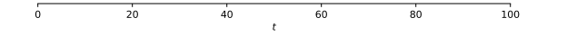
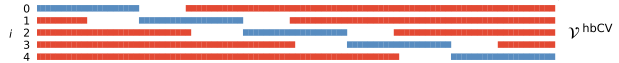

***
## A comparison of machine learning model validation schemes for non-stationary time series data

*Sep 16, 2022*

 ["A comparison of machine learning model validation schemes for non-stationary time series data," FAU Discussion Papers in Economics 11/2019, Friedrich-Alexander University Erlangen-Nuremberg, Institute for Economics.](https://www.econstor.eu/bitstream/10419/209136/1/1684440068.pdf)

- [PDF local copy](files/1684440068.pdf)

**Illustration of validation data splitting schemes**

- red: training data, blue: validation data.
- k = 5 splits except the 1st one. 

|  scheme ||
|  ------------ | ------------ |
|  last-block validation ||
|  random cross-validation   ||
|  blocked cross-validation   ||
|  h-blocked cross-validation   ||
|  rolling-origin forward-validation   ||
|  rolling-window forward-validation   ||
|  growing-window forward-validation   ||

**Conclusions**

- Generally, the choice of a suitable validation scheme depends on a number of factors, among them the sample size and model used. This is further complicated when considering time-evolving processes, as the type of dynamics plays a major role and already small perturbations of stationarity may derange validation methods to a larger extent. 

- Nevertheless, we can derive the following guidelines from our experiments: 
    - cross-validation
        - Using cross-validation for time-series applications comes at a great risk. 
        - While theoretically applicable, we find that random cross-validation often is associated with the largest bias and variance when compared to all other validation schemes. 
        - In most cases, blocked variants of cross-validation have a similar or better performance, and should therefore be preferred if cross-validation is to be used. 
    - forward-validation
        - If global stationarity is perturbed by non-periodic changes in autoregression coefficients, we find that forward-validation may be preferred over cross-validation.
        - Within forward-validation schemes, we find that rolling-origin and growing-window schemes often achieve the best performance. 
        - A closer look on the effect of the perturbation strength reveals that there exist three performance regimes: 
            - For small perturbations, cross- and forward-validation methods perform similarly. 
            - For intermediate perturbation strengths, forward-validation performs better. 
            - For still higher perturbation strengths, last-block validation performs best.
    - Consistent with results from synthetic time series with non-periodic dynamics, we find that forward-validation schemes outperform cross-validation schemes both in terms of bias and variance. 
    - Compared to typical accuracies from statistical arbitrage models, differences in the performance of validation schemes are substantial.
