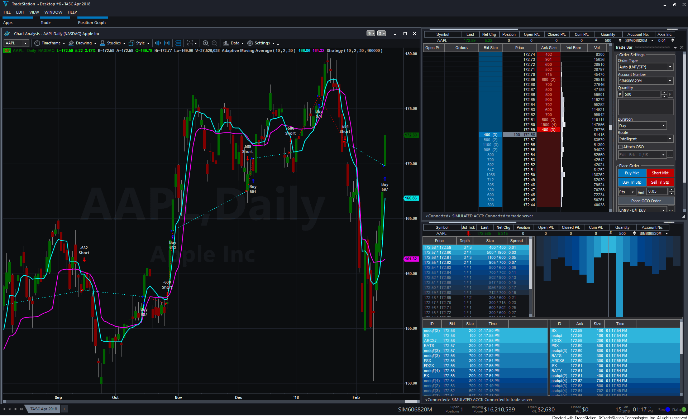
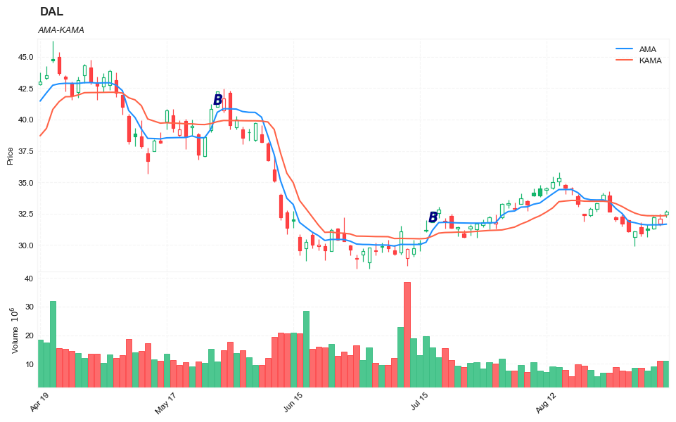

## Adaptive Moving Averages

**References**


- [traders.com: TradersTips 2018-04](https://traders.com/documentation/feedbk_docs/2018/04/traderstips.html)


**Definition**

In “Adaptive Moving Averages” in this issue, author Vitali Apirine introduces an adaptive moving average (AMA) technique based on Perry Kaufman’s KAMA (Kaufman adaptive moving average). His update to the original KAMA allows the new method to account for the location of the close relative to the high–low range. The author describes a trading system that combines the AMA and KAMA, suggesting that the combination may reduce the number of whipsaws relative to using either moving average by itself.


**█ STRATEGY**


    if  AMA  crosses over KAMA then
        Buy TradeSize shares next bar at Market
    else if  AMA  crosses under KAMA then
        Sell Short TradeSize shares next bar at Market ;
        
        
  

  

   

   

    

   

   

##### Load basic packages 


```python
import pandas as pd
import numpy as np
import os
import gc
import copy
from pathlib import Path
from datetime import datetime, timedelta, time, date
```


```python
#this package is to download equity price data from yahoo finance
#the source code of this package can be found here: https://github.com/ranaroussi/yfinance/blob/main
import yfinance as yf
```


```python
pd.options.display.max_rows = 100
pd.options.display.max_columns = 100

import warnings
warnings.filterwarnings("ignore")

import pytorch_lightning as pl
random_seed=1234
pl.seed_everything(random_seed)
```

    Global seed set to 1234
    


    1234


```python
#S&P 500 (^GSPC),  Dow Jones Industrial Average (^DJI), NASDAQ Composite (^IXIC)
#Russell 2000 (^RUT), Crude Oil Nov 21 (CL=F), Gold Dec 21 (GC=F)
#Treasury Yield 10 Years (^TNX)
#CBOE Volatility Index (^VIX) Chicago Options - Chicago Options Delayed Price. Currency in USD

#benchmark_tickers = ['^GSPC', '^DJI', '^IXIC', '^RUT',  'CL=F', 'GC=F', '^TNX']

benchmark_tickers = ['^GSPC', '^VIX']
tickers = benchmark_tickers + ['GSK', 'DAL', 'PFE']
```


```python
#https://github.com/ranaroussi/yfinance/blob/main/yfinance/base.py
#     def history(self, period="1mo", interval="1d",
#                 start=None, end=None, prepost=False, actions=True,
#                 auto_adjust=True, back_adjust=False,
#                 proxy=None, rounding=False, tz=None, timeout=None, **kwargs):

dfs = {}

for ticker in tickers:
    cur_data = yf.Ticker(ticker)
    hist = cur_data.history(period="max", start='2000-01-01')
    print(datetime.now(), ticker, hist.shape, hist.index.min(), hist.index.max())
    dfs[ticker] = hist
```

    2022-09-10 18:29:09.119977 ^GSPC (5710, 7) 1999-12-31 00:00:00 2022-09-09 00:00:00
    2022-09-10 18:29:09.377239 ^VIX (5710, 7) 1999-12-31 00:00:00 2022-09-09 00:00:00
    2022-09-10 18:29:09.603672 GSK (5710, 7) 1999-12-31 00:00:00 2022-09-09 00:00:00
    2022-09-10 18:29:09.786497 DAL (3867, 7) 2007-05-03 00:00:00 2022-09-09 00:00:00
    2022-09-10 18:29:10.163955 PFE (5710, 7) 1999-12-31 00:00:00 2022-09-09 00:00:00
    


```python
ticker = 'DAL'
dfs[ticker].tail(5)
```


<div>
<style scoped>
    .dataframe tbody tr th:only-of-type {
        vertical-align: middle;
    }

    .dataframe tbody tr th {
        vertical-align: top;
    }

    .dataframe thead th {
        text-align: right;
    }
</style>
<table border="1" class="dataframe">
  <thead>
    <tr style="text-align: right;">
      <th></th>
      <th>Open</th>
      <th>High</th>
      <th>Low</th>
      <th>Close</th>
      <th>Volume</th>
      <th>Dividends</th>
      <th>Stock Splits</th>
    </tr>
    <tr>
      <th>Date</th>
      <th></th>
      <th></th>
      <th></th>
      <th></th>
      <th></th>
      <th></th>
      <th></th>
    </tr>
  </thead>
  <tbody>
    <tr>
      <th>2022-09-02</th>
      <td>31.440001</td>
      <td>31.830000</td>
      <td>30.700001</td>
      <td>30.940001</td>
      <td>8626500</td>
      <td>0.0</td>
      <td>0</td>
    </tr>
    <tr>
      <th>2022-09-06</th>
      <td>31.340000</td>
      <td>31.650000</td>
      <td>30.660000</td>
      <td>31.190001</td>
      <td>7630800</td>
      <td>0.0</td>
      <td>0</td>
    </tr>
    <tr>
      <th>2022-09-07</th>
      <td>31.290001</td>
      <td>32.340000</td>
      <td>31.270000</td>
      <td>32.230000</td>
      <td>9035900</td>
      <td>0.0</td>
      <td>0</td>
    </tr>
    <tr>
      <th>2022-09-08</th>
      <td>31.719999</td>
      <td>32.490002</td>
      <td>31.549999</td>
      <td>32.119999</td>
      <td>11085400</td>
      <td>0.0</td>
      <td>0</td>
    </tr>
    <tr>
      <th>2022-09-09</th>
      <td>32.430000</td>
      <td>32.759998</td>
      <td>32.240002</td>
      <td>32.660000</td>
      <td>10958900</td>
      <td>0.0</td>
      <td>0</td>
    </tr>
  </tbody>
</table>
</div>


#####  TradeStation

    Indicator: Adaptive Moving Average

    // TASC APR 2018
    // Adaptive Moving Average
    // Indicator
    // Vitali Apirine

    inputs:
        Periods( 10 ),
        FastAvgLength( 2 ),
        SlowAvgLength( 30 ) ;

    variables:
        AMA( 0 ),
        KAMA( 0 ) ;

    AMA = _AMA( Periods, FastAvgLength, 
        SlowAvgLength ) ;	
    KAMA = AdaptiveMovAvg( Close, Periods, 
        FastAvgLength, SlowAvgLength ) ;	

    Plot1( AMA, "AMA", Cyan ) ;
    Plot2( KAMA, "KAMA", Magenta ) ;

    if AlertEnabled then 
    begin
        if AMA crosses over KAMA then
            Alert( "AMA crossing over KAMA" ) 
        else if AMA crosses under KAMA then
            Alert( "AMA crossing under KAMA" ) ;
    end ;


    Strategy: Adaptive Moving Average

    // TASC APR 2018
    // Adaptive Moving Average
    // Strategy
    // Vitali Apirine

    inputs:
        Periods( 10 ),
        FastAvgLength( 2 ),
        SlowAvgLength( 30 ),
        Capital( 100000 ) ;

    variables:
        AMA( 0 ),
        KAMA( 0 ),
        TradeSize( 0 ) ;

    AMA = _AMA( Periods, FastAvgLength, 
        SlowAvgLength ) ;	
    KAMA = AdaptiveMovAvg( Close, Periods, 
        FastAvgLength, SlowAvgLength ) ;	

    TradeSize = MaxList( 1, Capital / Close ) ;	

    if  AMA  crosses over KAMA then
        Buy TradeSize shares next bar at Market
    else if  AMA  crosses under KAMA then
        Sell Short TradeSize shares next bar at Market ;


    Function: _AMA

    // TASC APR 2018
    // _AMA
    // Function
    // Vitali Apirine

    inputs:
        Periods( numericsimple ),
        FastAvgLength( numericsimple ),
        SlowAvgLength( numericsimple ) ;

    variables:
        PDS( Periods + 1 ),
        FastSC( 2 / ( FastAvgLength + 1 ) ),
        SlowSC( 2 / ( SlowAvgLength + 1 ) ),
        SSC( 0 ),
        CST( 0 ),
        MLTP( 0 );	

    MLTP = AbsValue( ( Close - Lowest( Low, PDS ) ) 
        - ( Highest( High, PDS ) - Close )) 
        / ( Highest( High, PDS ) - Lowest( Low, PDS ) ) ;	

    SSC = MLTP * ( FastSC - SlowSC ) + SlowSC ;	

    CST = Square( SSC ) ;

    if CurrentBar = 1 then
        _AMA = Close[1] + CST * ( Close - Close[1] )  
    else
        _AMA = _AMA[1] + CST * ( Close - _AMA[1] ) ;	


```python
def cal_ama(ohlc: pd.DataFrame, 
              period: int = 10, 
              fast_period: int = 2, 
              slow_period: int = 30, 
             ) -> pd.Series:
    
    """
    ADAPTIVE MOVING AVERAGE. Author: Vitali Apirine, TASC April 2018
    source: https://traders.com/documentation/feedbk_docs/2018/04/traderstips.html
    
    created on: 2022-09-10

    """
    
    ohlc = ohlc.copy()
    ohlc.columns = [c.lower() for c in ohlc.columns]
    
    highest_high = ohlc["high"].rolling(center=False, window=period).max()
    lowest_low = ohlc["low"].rolling(center=False, window=period).min()
    close = ohlc["close"]
    
    pds = period + 1
    fast_sc = 2/(fast_period + 1)
    slow_sc = 2/(slow_period + 1)
    mltp = np.abs((close - lowest_low) - (highest_high - close))/(highest_high - lowest_low)
    ssc = mltp * (fast_sc - slow_sc) + slow_sc
    cst = ssc*ssc
    
    _ama = np.zeros(len(ohlc))
    for i in range(len(ohlc)):
        if i < period:
            _ama[i] = close[i-1] + cst[i] * (close[i] - close[i-1])
        else:
            _ama[i] = _ama[i-1] + cst[i] * (close[i] - _ama[i-1])
        

    return pd.Series(_ama,index=ohlc.index, name=f"AMA")    

```

##### Calculate 


```python
df = dfs[ticker][['Open', 'High', 'Low', 'Close', 'Volume']]
df = df.round(2)
```


```python
cal_ama
```


    <function __main__.cal_ama(ohlc: pandas.core.frame.DataFrame, period: int = 10, fast_period: int = 2, slow_period: int = 30) -> pandas.core.series.Series>


```python
df['AMA'] = cal_ama(df, period = 10, fast_period = 2, slow_period = 30)
```


```python
from core.finta import TA
```


```python
TA.KAMA
```


    <function core.finta.TA.KAMA(ohlc: pandas.core.frame.DataFrame, er_period: int = 10, ema_fast: int = 2, ema_slow: int = 30, period: int = 20, column: str = 'close') -> pandas.core.series.Series>


```python
df['KAMA'] = TA.KAMA(df, er_period = 10, ema_fast = 2, ema_slow=30, period=10, column='close')
```


```python
#AMA  crosses over KAMA 
df['SIGNAL'] = ((df['AMA']>=df['KAMA']) & (df['AMA'].shift(1)<df['KAMA'].shift(1))).astype(int)
df['B'] = df['SIGNAL']*(df["High"] + df["Low"])/2
```


```python
df['SIGNAL'].value_counts()
```


    0    3754
    1     113
    Name: SIGNAL, dtype: int64


```python
display(df.head(5))
display(df.tail(5))
```


<div>
<style scoped>
    .dataframe tbody tr th:only-of-type {
        vertical-align: middle;
    }

    .dataframe tbody tr th {
        vertical-align: top;
    }

    .dataframe thead th {
        text-align: right;
    }
</style>
<table border="1" class="dataframe">
  <thead>
    <tr style="text-align: right;">
      <th></th>
      <th>Open</th>
      <th>High</th>
      <th>Low</th>
      <th>Close</th>
      <th>Volume</th>
      <th>AMA</th>
      <th>KAMA</th>
      <th>SIGNAL</th>
      <th>B</th>
    </tr>
    <tr>
      <th>Date</th>
      <th></th>
      <th></th>
      <th></th>
      <th></th>
      <th></th>
      <th></th>
      <th></th>
      <th></th>
      <th></th>
    </tr>
  </thead>
  <tbody>
    <tr>
      <th>2007-05-03</th>
      <td>19.32</td>
      <td>19.50</td>
      <td>18.25</td>
      <td>18.40</td>
      <td>8052800</td>
      <td>NaN</td>
      <td>NaN</td>
      <td>0</td>
      <td>0.0</td>
    </tr>
    <tr>
      <th>2007-05-04</th>
      <td>18.88</td>
      <td>18.96</td>
      <td>18.39</td>
      <td>18.64</td>
      <td>5437300</td>
      <td>NaN</td>
      <td>NaN</td>
      <td>0</td>
      <td>0.0</td>
    </tr>
    <tr>
      <th>2007-05-07</th>
      <td>18.83</td>
      <td>18.91</td>
      <td>17.94</td>
      <td>18.08</td>
      <td>2646300</td>
      <td>NaN</td>
      <td>NaN</td>
      <td>0</td>
      <td>0.0</td>
    </tr>
    <tr>
      <th>2007-05-08</th>
      <td>17.76</td>
      <td>17.76</td>
      <td>17.14</td>
      <td>17.44</td>
      <td>4166100</td>
      <td>NaN</td>
      <td>NaN</td>
      <td>0</td>
      <td>0.0</td>
    </tr>
    <tr>
      <th>2007-05-09</th>
      <td>17.54</td>
      <td>17.94</td>
      <td>17.44</td>
      <td>17.58</td>
      <td>7541100</td>
      <td>NaN</td>
      <td>NaN</td>
      <td>0</td>
      <td>0.0</td>
    </tr>
  </tbody>
</table>
</div>


<div>
<style scoped>
    .dataframe tbody tr th:only-of-type {
        vertical-align: middle;
    }

    .dataframe tbody tr th {
        vertical-align: top;
    }

    .dataframe thead th {
        text-align: right;
    }
</style>
<table border="1" class="dataframe">
  <thead>
    <tr style="text-align: right;">
      <th></th>
      <th>Open</th>
      <th>High</th>
      <th>Low</th>
      <th>Close</th>
      <th>Volume</th>
      <th>AMA</th>
      <th>KAMA</th>
      <th>SIGNAL</th>
      <th>B</th>
    </tr>
    <tr>
      <th>Date</th>
      <th></th>
      <th></th>
      <th></th>
      <th></th>
      <th></th>
      <th></th>
      <th></th>
      <th></th>
      <th></th>
    </tr>
  </thead>
  <tbody>
    <tr>
      <th>2022-09-02</th>
      <td>31.44</td>
      <td>31.83</td>
      <td>30.70</td>
      <td>30.94</td>
      <td>8626500</td>
      <td>31.657433</td>
      <td>32.392120</td>
      <td>0</td>
      <td>0.0</td>
    </tr>
    <tr>
      <th>2022-09-06</th>
      <td>31.34</td>
      <td>31.65</td>
      <td>30.66</td>
      <td>31.19</td>
      <td>7630800</td>
      <td>31.610105</td>
      <td>32.339471</td>
      <td>0</td>
      <td>0.0</td>
    </tr>
    <tr>
      <th>2022-09-07</th>
      <td>31.29</td>
      <td>32.34</td>
      <td>31.27</td>
      <td>32.23</td>
      <td>9035900</td>
      <td>31.616398</td>
      <td>32.337489</td>
      <td>0</td>
      <td>0.0</td>
    </tr>
    <tr>
      <th>2022-09-08</th>
      <td>31.72</td>
      <td>32.49</td>
      <td>31.55</td>
      <td>32.12</td>
      <td>11085400</td>
      <td>31.618872</td>
      <td>32.328516</td>
      <td>0</td>
      <td>0.0</td>
    </tr>
    <tr>
      <th>2022-09-09</th>
      <td>32.43</td>
      <td>32.76</td>
      <td>32.24</td>
      <td>32.66</td>
      <td>10958900</td>
      <td>31.669552</td>
      <td>32.345109</td>
      <td>0</td>
      <td>0.0</td>
    </tr>
  </tbody>
</table>
</div>


```python
from core.visuals import *
```


```python
start = -100
end = df.shape[0]
df_sub = df.iloc[start:end]
# df_sub = df[(df.index<='2019-04-01') & (df.index>='2019-01-24')]
names = {'main_title': f'{ticker}'}
```


```python
lines0 = basic_lines(df_sub[['AMA', 'KAMA']], 
                     colors = [], 
                     **dict(panel=0, width=1.5, secondary_y=False))


lines2 = basic_lines(df_sub[[ 'B']],
                     colors = ['navy'], 
                     **dict(panel=0, type='scatter', marker=r'${B}$' , markersize=100, secondary_y=False))


lines_ = dict(**lines0, **lines2)

#shadows_ = basic_shadows(bands=[-0.01, 0.01], nsamples=df.iloc[start:end].shape[0], **dict(panel=1, color="lightskyblue",alpha=0.1,interpolate=True))
shadows_ = []
fig_config_ = dict(figratio=(18,10), volume=True, volume_panel=1,panel_ratios=(4,2), tight_layout=True, returnfig=True,)

ax_cfg_ = {0:dict(basic=[4, 2, ['AMA', 'KAMA']], 
                 title=dict(label = 'AMA-KAMA', fontsize=9, style='italic',  loc='left'), 
                ),
          }


names = {'main_title': f'{ticker}'}

aa_, bb_ = make_panels(main_data = df_sub[['Open', 'High', 'Low', 'Close', 'Volume']], 
                       added_plots = lines_,
                       fill_betweens = shadows_, 
                       fig_config = fig_config_, 
                       axes_config = ax_cfg_,  
                       names = names)
```


    

    


##### Simulate


```python
TRADE_CONFIG = dict(INIT_CAPITAL = 10000 ,
                    MIN_TRADE_SIZE = 100 ,
                    MAX_TRADE_SIZE = 1000 ,
                    HOLD_DAYS = 40, #max hold days
                    STOP_LOSS = 0.085, #10% drop
                    KEEP_PROFIT = 0.065, 
                    MAX_OPEN = 1, #allow only 1 open position
                    COST = 0.0035,
                   ) 
```


```python
df['SIGNAL'].value_counts()
```


    0    3754
    1     113
    Name: SIGNAL, dtype: int64


```python
trades = []
for i in range(df.shape[0]-5):
    row = df.iloc[i]
    if row['SIGNAL']>0:
        print('enter: ', i)
        row_j = df.iloc[i+1]
        item = dict(signal_date = row.name,
                    enter_date = row_j.name, 
                    enter_price = row_j['High']
                   )
        for j in range(i+2, min(i+TRADE_CONFIG['HOLD_DAYS'], df.shape[0])):
            row_j = df.iloc[j]
            price_ = row_j['Low']
            pct_chg = price_/item['enter_price']
            if (pct_chg<= (1 - TRADE_CONFIG['STOP_LOSS'])) | (pct_chg >= (1 + TRADE_CONFIG['KEEP_PROFIT'])):
                break
                
        item['exit_date'] = row_j.name
        item['exit_price'] = price_
        item['hold_days'] = j - i
        i = j 
        print('exit:', i)
        trades.append(item)
        
```

    enter:  35
    exit: 52
    enter:  76
    exit: 83
    enter:  102
    exit: 110
    enter:  138
    exit: 140
    enter:  147
    exit: 149
    enter:  176
    exit: 178
    enter:  210
    exit: 212
    enter:  304
    exit: 306
    enter:  336
    exit: 339
    enter:  368
    exit: 374
    enter:  379
    exit: 381
    enter:  397
    exit: 399
    enter:  469
    exit: 471
    enter:  525
    exit: 528
    enter:  563
    exit: 586
    enter:  572
    exit: 594
    enter:  585
    exit: 588
    enter:  592
    exit: 597
    enter:  618
    exit: 623
    enter:  636
    exit: 652
    enter:  662
    exit: 664
    enter:  703
    exit: 729
    enter:  762
    exit: 769
    enter:  804
    exit: 808
    enter:  836
    exit: 853
    enter:  899
    exit: 907
    enter:  1006
    exit: 1028
    enter:  1020
    exit: 1024
    enter:  1041
    exit: 1052
    enter:  1100
    exit: 1107
    enter:  1120
    exit: 1142
    enter:  1142
    exit: 1147
    enter:  1156
    exit: 1178
    enter:  1183
    exit: 1192
    enter:  1194
    exit: 1210
    enter:  1237
    exit: 1258
    enter:  1249
    exit: 1268
    enter:  1277
    exit: 1282
    enter:  1294
    exit: 1313
    enter:  1366
    exit: 1397
    enter:  1391
    exit: 1395
    enter:  1412
    exit: 1421
    enter:  1443
    exit: 1469
    enter:  1498
    exit: 1508
    enter:  1535
    exit: 1563
    enter:  1599
    exit: 1619
    enter:  1680
    exit: 1692
    enter:  1706
    exit: 1720
    enter:  1735
    exit: 1749
    enter:  1754
    exit: 1783
    enter:  1834
    exit: 1866
    enter:  1881
    exit: 1891
    enter:  1942
    exit: 1951
    enter:  1964
    exit: 1973
    enter:  1981
    exit: 1988
    enter:  2003
    exit: 2029
    enter:  2021
    exit: 2026
    enter:  2048
    exit: 2055
    enter:  2061
    exit: 2082
    enter:  2093
    exit: 2109
    enter:  2121
    exit: 2135
    enter:  2164
    exit: 2184
    enter:  2192
    exit: 2194
    enter:  2213
    exit: 2236
    enter:  2233
    exit: 2259
    enter:  2277
    exit: 2295
    enter:  2312
    exit: 2351
    enter:  2355
    exit: 2394
    enter:  2366
    exit: 2393
    enter:  2384
    exit: 2400
    enter:  2409
    exit: 2448
    enter:  2436
    exit: 2475
    enter:  2517
    exit: 2543
    enter:  2534
    exit: 2563
    enter:  2609
    exit: 2629
    enter:  2659
    exit: 2676
    enter:  2693
    exit: 2702
    enter:  2731
    exit: 2747
    enter:  2761
    exit: 2800
    enter:  2785
    exit: 2806
    enter:  2810
    exit: 2829
    enter:  2818
    exit: 2834
    enter:  2867
    exit: 2875
    enter:  2888
    exit: 2915
    enter:  2958
    exit: 2997
    enter:  2983
    exit: 3000
    enter:  2997
    exit: 3000
    enter:  3021
    exit: 3038
    enter:  3043
    exit: 3063
    enter:  3113
    exit: 3126
    enter:  3126
    exit: 3150
    enter:  3157
    exit: 3196
    enter:  3165
    exit: 3199
    enter:  3227
    exit: 3233
    enter:  3233
    exit: 3237
    enter:  3288
    exit: 3290
    enter:  3352
    exit: 3366
    enter:  3383
    exit: 3397
    enter:  3405
    exit: 3417
    enter:  3450
    exit: 3460
    enter:  3465
    exit: 3475
    enter:  3504
    exit: 3510
    enter:  3515
    exit: 3554
    enter:  3534
    exit: 3563
    enter:  3606
    exit: 3631
    enter:  3611
    exit: 3626
    enter:  3624
    exit: 3643
    enter:  3653
    exit: 3656
    enter:  3668
    exit: 3672
    enter:  3713
    exit: 3721
    enter:  3745
    exit: 3765
    enter:  3795
    exit: 3799
    enter:  3829
    exit: 3861
    


```python
df_trades = pd.DataFrame(data = trades)
df_trades.shape
```


    (113, 6)


```python
def cal_pnl(trade):
    shares = int(TRADE_CONFIG['INIT_CAPITAL']/trade['enter_price'])
    if shares < TRADE_CONFIG['MIN_TRADE_SIZE']:
        shares = 0
    elif shares > TRADE_CONFIG['MAX_TRADE_SIZE']:
        shares = TRADE_CONFIG['MAX_TRADE_SIZE']
    pnl = shares*(trade['exit_price'] - trade['enter_price']) - shares*trade['enter_price']*TRADE_CONFIG['COST']
    return pnl
```


```python
df_trades['pnl'] = df_trades.apply(lambda x: cal_pnl(x), axis=1)
```


```python
df_trades['pnl'].sum(), (df_trades['pnl']>0).mean()
```


    (-29470.04119500001, 0.4336283185840708)


```python
df_trades
```


<div>
<style scoped>
    .dataframe tbody tr th:only-of-type {
        vertical-align: middle;
    }

    .dataframe tbody tr th {
        vertical-align: top;
    }

    .dataframe thead th {
        text-align: right;
    }
</style>
<table border="1" class="dataframe">
  <thead>
    <tr style="text-align: right;">
      <th></th>
      <th>signal_date</th>
      <th>enter_date</th>
      <th>enter_price</th>
      <th>exit_date</th>
      <th>exit_price</th>
      <th>hold_days</th>
      <th>pnl</th>
    </tr>
  </thead>
  <tbody>
    <tr>
      <th>0</th>
      <td>2007-06-22</td>
      <td>2007-06-25</td>
      <td>17.53</td>
      <td>2007-07-18</td>
      <td>18.79</td>
      <td>17</td>
      <td>683.227650</td>
    </tr>
    <tr>
      <th>1</th>
      <td>2007-08-21</td>
      <td>2007-08-22</td>
      <td>16.57</td>
      <td>2007-08-30</td>
      <td>14.94</td>
      <td>7</td>
      <td>-1017.860985</td>
    </tr>
    <tr>
      <th>2</th>
      <td>2007-09-27</td>
      <td>2007-09-28</td>
      <td>15.95</td>
      <td>2007-10-09</td>
      <td>17.06</td>
      <td>8</td>
      <td>659.913550</td>
    </tr>
    <tr>
      <th>3</th>
      <td>2007-11-16</td>
      <td>2007-11-19</td>
      <td>17.54</td>
      <td>2007-11-20</td>
      <td>15.13</td>
      <td>2</td>
      <td>-1408.692300</td>
    </tr>
    <tr>
      <th>4</th>
      <td>2007-11-30</td>
      <td>2007-12-03</td>
      <td>17.76</td>
      <td>2007-12-04</td>
      <td>15.86</td>
      <td>2</td>
      <td>-1104.696080</td>
    </tr>
    <tr>
      <th>...</th>
      <td>...</td>
      <td>...</td>
      <td>...</td>
      <td>...</td>
      <td>...</td>
      <td>...</td>
      <td>...</td>
    </tr>
    <tr>
      <th>108</th>
      <td>2021-11-24</td>
      <td>2021-11-26</td>
      <td>36.95</td>
      <td>2021-12-01</td>
      <td>33.40</td>
      <td>4</td>
      <td>-993.417750</td>
    </tr>
    <tr>
      <th>109</th>
      <td>2022-01-31</td>
      <td>2022-02-01</td>
      <td>40.57</td>
      <td>2022-02-10</td>
      <td>43.31</td>
      <td>8</td>
      <td>639.109230</td>
    </tr>
    <tr>
      <th>110</th>
      <td>2022-03-17</td>
      <td>2022-03-18</td>
      <td>37.92</td>
      <td>2022-04-14</td>
      <td>41.33</td>
      <td>20</td>
      <td>861.924640</td>
    </tr>
    <tr>
      <th>111</th>
      <td>2022-05-27</td>
      <td>2022-05-31</td>
      <td>42.45</td>
      <td>2022-06-03</td>
      <td>38.06</td>
      <td>4</td>
      <td>-1066.565125</td>
    </tr>
    <tr>
      <th>112</th>
      <td>2022-07-19</td>
      <td>2022-07-20</td>
      <td>33.08</td>
      <td>2022-09-01</td>
      <td>29.94</td>
      <td>32</td>
      <td>-983.245560</td>
    </tr>
  </tbody>
</table>
<p>113 rows × 7 columns</p>
</div>


```python
df_trades['pnl'].hist(bins=50)
```


    <AxesSubplot:>


    

    


```python
df_trades['pnl'].cumsum().plot()
```


    <AxesSubplot:>


    

    

