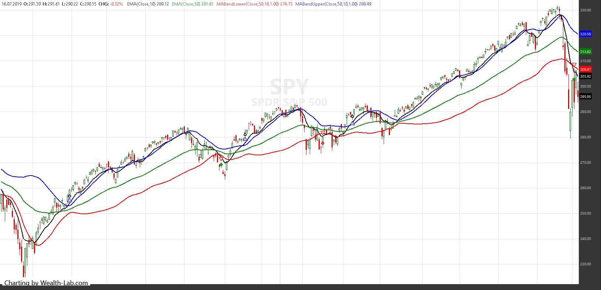
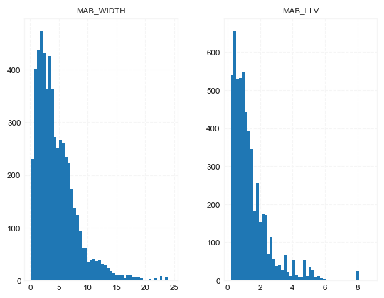

## Moving average bands (MAB) and moving average band width (MABW) 

**References**


- [traders.com: TradersTips 2021-08](https://traders.com/Documentation/FEEDbk_docs/2021/08/TradersTips.html)
- [Moving Average Bands [CC]](https://www.tradingview.com/script/EjeoPSbI-Moving-Average-Bands-CC/)
- [L1 Vitali Apirine MAB](https://www.tradingview.com/script/DxUYUZxo/)


**█ OVERVIEW**

In “Moving Average Bands” (part 1, July 2021 issue) and “Moving Average Band Width” (part 2, August 2021 issue), author Vitali Apirine explains how moving average bands (MAB) can be used as a trend-following indicator by displaying the movement of a shorter-term moving average in relation to the movement of a longer-term moving average. The distance between the bands will widen as volatility increases and will narrow as volatility decreases. 

In part 2, the moving average band width (MABW) measures the percentage difference between the bands. Changes in this difference may indicate a forthcoming move or change in the trend.


**█ STRATEGY**

- Rules 1:
    - Enter when the 10-day moving average (EMA) breaks above the upper MA band
    - Exit when the EMA crosses below the lower MA band
- Rules 2:
    - Enter when the 10-day moving average (EMA) breaks above the upper MA band, preceded by the moving average band width (MABW) making a 20-day lowest low at least once within the last 10 days
    - Exit on a trailing stop of 3 ATRs (14-day) from the trade’s highest point
    
    





##### Load basic packages 


```python
import pandas as pd
import numpy as np
import os
import gc
import copy
from pathlib import Path
from datetime import datetime, timedelta, time, date
```


```python
#this package is to download equity price data from yahoo finance
#the source code of this package can be found here: https://github.com/ranaroussi/yfinance/blob/main
import yfinance as yf
```


```python
pd.options.display.max_rows = 100
pd.options.display.max_columns = 100

import warnings
warnings.filterwarnings("ignore")

import pytorch_lightning as pl
random_seed=1234
pl.seed_everything(random_seed)
```

    Global seed set to 1234
    


    1234


##### Download data


```python
#S&P 500 (^GSPC),  Dow Jones Industrial Average (^DJI), NASDAQ Composite (^IXIC)
#Russell 2000 (^RUT), Crude Oil Nov 21 (CL=F), Gold Dec 21 (GC=F)
#Treasury Yield 10 Years (^TNX)
#CBOE Volatility Index (^VIX) Chicago Options - Chicago Options Delayed Price. Currency in USD

#benchmark_tickers = ['^GSPC', '^DJI', '^IXIC', '^RUT',  'CL=F', 'GC=F', '^TNX']

benchmark_tickers = ['^GSPC', '^VIX']
tickers = benchmark_tickers + ['GSK', 'BST', 'PFE']
```


```python
#https://github.com/ranaroussi/yfinance/blob/main/yfinance/base.py
#     def history(self, period="1mo", interval="1d",
#                 start=None, end=None, prepost=False, actions=True,
#                 auto_adjust=True, back_adjust=False,
#                 proxy=None, rounding=False, tz=None, timeout=None, **kwargs):

dfs = {}

for ticker in tickers:
    cur_data = yf.Ticker(ticker)
    hist = cur_data.history(period="max", start='2000-01-01')
    print(datetime.now(), ticker, hist.shape, hist.index.min(), hist.index.max())
    dfs[ticker] = hist
```

    2022-09-10 10:27:39.606085 ^GSPC (5710, 7) 1999-12-31 00:00:00 2022-09-09 00:00:00
    2022-09-10 10:27:39.817370 ^VIX (5710, 7) 1999-12-31 00:00:00 2022-09-09 00:00:00
    2022-09-10 10:27:40.192326 GSK (5710, 7) 1999-12-31 00:00:00 2022-09-09 00:00:00
    2022-09-10 10:27:40.423825 BST (1980, 7) 2014-10-29 00:00:00 2022-09-09 00:00:00
    2022-09-10 10:27:40.759307 PFE (5710, 7) 1999-12-31 00:00:00 2022-09-09 00:00:00
    


```python
ticker = 'GSK'
dfs[ticker].tail(5)
```


<div>
<style scoped>
    .dataframe tbody tr th:only-of-type {
        vertical-align: middle;
    }

    .dataframe tbody tr th {
        vertical-align: top;
    }

    .dataframe thead th {
        text-align: right;
    }
</style>
<table border="1" class="dataframe">
  <thead>
    <tr style="text-align: right;">
      <th></th>
      <th>Open</th>
      <th>High</th>
      <th>Low</th>
      <th>Close</th>
      <th>Volume</th>
      <th>Dividends</th>
      <th>Stock Splits</th>
    </tr>
    <tr>
      <th>Date</th>
      <th></th>
      <th></th>
      <th></th>
      <th></th>
      <th></th>
      <th></th>
      <th></th>
    </tr>
  </thead>
  <tbody>
    <tr>
      <th>2022-09-02</th>
      <td>31.600000</td>
      <td>31.969999</td>
      <td>31.469999</td>
      <td>31.850000</td>
      <td>8152600</td>
      <td>0.0</td>
      <td>0.0</td>
    </tr>
    <tr>
      <th>2022-09-06</th>
      <td>31.650000</td>
      <td>31.760000</td>
      <td>31.370001</td>
      <td>31.469999</td>
      <td>5613900</td>
      <td>0.0</td>
      <td>0.0</td>
    </tr>
    <tr>
      <th>2022-09-07</th>
      <td>31.209999</td>
      <td>31.590000</td>
      <td>31.160000</td>
      <td>31.490000</td>
      <td>4822000</td>
      <td>0.0</td>
      <td>0.0</td>
    </tr>
    <tr>
      <th>2022-09-08</th>
      <td>30.910000</td>
      <td>31.540001</td>
      <td>30.830000</td>
      <td>31.510000</td>
      <td>6620900</td>
      <td>0.0</td>
      <td>0.0</td>
    </tr>
    <tr>
      <th>2022-09-09</th>
      <td>31.950001</td>
      <td>31.969999</td>
      <td>31.730000</td>
      <td>31.889999</td>
      <td>3556800</td>
      <td>0.0</td>
      <td>0.0</td>
    </tr>
  </tbody>
</table>
</div>


##### Calculate


```python
from core.finta import TA
```


```python
df = dfs[ticker][['Open', 'High', 'Low', 'Close', 'Volume']]
df = df.round(2)
```


```python
TA.MABW
```


    <function core.finta.TA.MABW(ohlc: pandas.core.frame.DataFrame, fast_period: int = 10, slow_period: int = 50, multiplier: float = 1.0, column: str = 'close', adjust: bool = True) -> pandas.core.frame.DataFrame>


```python
df_ta = TA.MABW(df, fast_period = 10, slow_period = 50, multiplier = 1.0)
df = df.merge(df_ta, left_index = True, right_index = True, how='inner' )

del df_ta
gc.collect()
```


    24915


```python
df_ta = TA.EMA(df, period = 20, column="close")
df_ta.name='EMA'
df = df.merge(df_ta, left_index = True, right_index = True, how='inner' )

del df_ta
gc.collect()
```


    21


- Rules 1:
    - Enter when the 10-day moving average (EMA) breaks above the upper MA band
    - Exit when the EMA crosses below the lower MA band
- Rules 2:
    - Enter when the 10-day moving average (EMA) breaks above the upper MA band, preceded by the moving average band width (MABW) making a 20-day lowest low at least once within the last 10 days
    - Exit on a trailing stop of 3 ATRs (14-day) from the trade’s highest point


```python
df['SIGNAL'] = ((df['EMA']>=df['MAB_UPPER']) & (df['EMA'].shift(1)<df['MAB_UPPER'].shift(1))).astype(int)
df['B'] = df['SIGNAL']*(df["High"] + df["Low"])/2
df['SIGNAL'].value_counts()
```


    0    5675
    1      35
    Name: SIGNAL, dtype: int64


```python
df['MAB_WIDTH'].rolling(20).min()
```


    Date
    1999-12-31         NaN
    2000-01-03         NaN
    2000-01-04         NaN
    2000-01-05         NaN
    2000-01-06         NaN
                    ...   
    2022-09-02    3.225288
    2022-09-06    3.608219
    2022-09-07    4.284088
    2022-09-08    5.417958
    2022-09-09    6.731750
    Name: MAB_WIDTH, Length: 5710, dtype: float64


```python
display(df.head(5))
display(df.tail(5))
```


<div>
<style scoped>
    .dataframe tbody tr th:only-of-type {
        vertical-align: middle;
    }

    .dataframe tbody tr th {
        vertical-align: top;
    }

    .dataframe thead th {
        text-align: right;
    }
</style>
<table border="1" class="dataframe">
  <thead>
    <tr style="text-align: right;">
      <th></th>
      <th>Open</th>
      <th>High</th>
      <th>Low</th>
      <th>Close</th>
      <th>Volume</th>
      <th>MAB_UPPER</th>
      <th>MAB_MIDDLE</th>
      <th>MAB_LOWER</th>
      <th>MAB_WIDTH</th>
      <th>MAB_LLV</th>
      <th>EMA</th>
      <th>SIGNAL</th>
      <th>B</th>
    </tr>
    <tr>
      <th>Date</th>
      <th></th>
      <th></th>
      <th></th>
      <th></th>
      <th></th>
      <th></th>
      <th></th>
      <th></th>
      <th></th>
      <th></th>
      <th></th>
      <th></th>
      <th></th>
    </tr>
  </thead>
  <tbody>
    <tr>
      <th>1999-12-31</th>
      <td>19.60</td>
      <td>19.67</td>
      <td>19.52</td>
      <td>19.56</td>
      <td>139400</td>
      <td>NaN</td>
      <td>19.560000</td>
      <td>NaN</td>
      <td>NaN</td>
      <td>NaN</td>
      <td>19.560000</td>
      <td>0</td>
      <td>0.0</td>
    </tr>
    <tr>
      <th>2000-01-03</th>
      <td>19.58</td>
      <td>19.71</td>
      <td>19.25</td>
      <td>19.45</td>
      <td>556100</td>
      <td>NaN</td>
      <td>19.499500</td>
      <td>NaN</td>
      <td>NaN</td>
      <td>NaN</td>
      <td>19.502250</td>
      <td>0</td>
      <td>0.0</td>
    </tr>
    <tr>
      <th>2000-01-04</th>
      <td>19.45</td>
      <td>19.45</td>
      <td>18.90</td>
      <td>18.95</td>
      <td>367200</td>
      <td>NaN</td>
      <td>19.278605</td>
      <td>NaN</td>
      <td>NaN</td>
      <td>NaN</td>
      <td>19.299467</td>
      <td>0</td>
      <td>0.0</td>
    </tr>
    <tr>
      <th>2000-01-05</th>
      <td>19.21</td>
      <td>19.58</td>
      <td>19.08</td>
      <td>19.58</td>
      <td>481700</td>
      <td>NaN</td>
      <td>19.377901</td>
      <td>NaN</td>
      <td>NaN</td>
      <td>NaN</td>
      <td>19.380453</td>
      <td>0</td>
      <td>0.0</td>
    </tr>
    <tr>
      <th>2000-01-06</th>
      <td>19.38</td>
      <td>19.43</td>
      <td>18.90</td>
      <td>19.30</td>
      <td>853800</td>
      <td>NaN</td>
      <td>19.355538</td>
      <td>NaN</td>
      <td>NaN</td>
      <td>NaN</td>
      <td>19.360992</td>
      <td>0</td>
      <td>0.0</td>
    </tr>
  </tbody>
</table>
</div>


<div>
<style scoped>
    .dataframe tbody tr th:only-of-type {
        vertical-align: middle;
    }

    .dataframe tbody tr th {
        vertical-align: top;
    }

    .dataframe thead th {
        text-align: right;
    }
</style>
<table border="1" class="dataframe">
  <thead>
    <tr style="text-align: right;">
      <th></th>
      <th>Open</th>
      <th>High</th>
      <th>Low</th>
      <th>Close</th>
      <th>Volume</th>
      <th>MAB_UPPER</th>
      <th>MAB_MIDDLE</th>
      <th>MAB_LOWER</th>
      <th>MAB_WIDTH</th>
      <th>MAB_LLV</th>
      <th>EMA</th>
      <th>SIGNAL</th>
      <th>B</th>
    </tr>
    <tr>
      <th>Date</th>
      <th></th>
      <th></th>
      <th></th>
      <th></th>
      <th></th>
      <th></th>
      <th></th>
      <th></th>
      <th></th>
      <th></th>
      <th></th>
      <th></th>
      <th></th>
    </tr>
  </thead>
  <tbody>
    <tr>
      <th>2022-09-02</th>
      <td>31.60</td>
      <td>31.97</td>
      <td>31.47</td>
      <td>31.85</td>
      <td>8152600</td>
      <td>41.981303</td>
      <td>33.059733</td>
      <td>33.259197</td>
      <td>23.184605</td>
      <td>1.291809</td>
      <td>34.599350</td>
      <td>0</td>
      <td>0.0</td>
    </tr>
    <tr>
      <th>2022-09-06</th>
      <td>31.65</td>
      <td>31.76</td>
      <td>31.37</td>
      <td>31.47</td>
      <td>5613900</td>
      <td>41.787135</td>
      <td>32.770690</td>
      <td>32.970993</td>
      <td>23.585774</td>
      <td>1.291809</td>
      <td>34.301317</td>
      <td>0</td>
      <td>0.0</td>
    </tr>
    <tr>
      <th>2022-09-07</th>
      <td>31.21</td>
      <td>31.59</td>
      <td>31.16</td>
      <td>31.49</td>
      <td>4822000</td>
      <td>41.593738</td>
      <td>32.537838</td>
      <td>32.702503</td>
      <td>23.934548</td>
      <td>1.291809</td>
      <td>34.033572</td>
      <td>0</td>
      <td>0.0</td>
    </tr>
    <tr>
      <th>2022-09-08</th>
      <td>30.91</td>
      <td>31.54</td>
      <td>30.83</td>
      <td>31.51</td>
      <td>6620900</td>
      <td>41.399202</td>
      <td>32.350958</td>
      <td>32.454833</td>
      <td>24.221746</td>
      <td>1.291809</td>
      <td>33.793232</td>
      <td>0</td>
      <td>0.0</td>
    </tr>
    <tr>
      <th>2022-09-09</th>
      <td>31.95</td>
      <td>31.97</td>
      <td>31.73</td>
      <td>31.89</td>
      <td>3556800</td>
      <td>41.216672</td>
      <td>32.267147</td>
      <td>32.242303</td>
      <td>24.433689</td>
      <td>1.291809</td>
      <td>33.611972</td>
      <td>0</td>
      <td>0.0</td>
    </tr>
  </tbody>
</table>
</div>


```python
df[['MAB_WIDTH', 'MAB_LLV']].hist(bins=50)
```


    array([[<AxesSubplot:title={'center':'MAB_WIDTH'}>,
            <AxesSubplot:title={'center':'MAB_LLV'}>]], dtype=object)


    

    


```python
from core.visuals import *
```


```python
start = -1000
end = df.shape[0]
df_sub = df.iloc[start:end]
# df_sub = df[(df.index<='2019-04-01') & (df.index>='2019-01-24')]
names = {'main_title': f'{ticker}'}
```


```python
lines0 = basic_lines(df_sub[['MAB_UPPER', 'EMA', 'MAB_LOWER']], 
                     colors = [], 
                     **dict(panel=0, width=1.5, secondary_y=False))

lines1 = basic_lines(df_sub[['MAB_WIDTH', 'MAB_LLV']], 
                     colors = ['cadetblue'], 
                     **dict(panel=1, width=1))

lines2 = basic_lines(df_sub[[ 'B']],
                     colors = ['navy'], 
                     **dict(panel=0, type='scatter', marker=r'${B}$' , markersize=100, secondary_y=False))


lines_ = dict(**lines0, **lines1)
lines_.update(lines2)

#shadows_ = basic_shadows(bands=[-0.01, 0.01], nsamples=df.iloc[start:end].shape[0], **dict(panel=1, color="lightskyblue",alpha=0.1,interpolate=True))
shadows_ = []
fig_config_ = dict(figratio=(18,10), volume=True, volume_panel=2,panel_ratios=(4,2, 2), tight_layout=True, returnfig=True,)

ax_cfg_ = {0:dict(basic=[5, 2, ['MAB_UPPER', 'EMA', 'MAB_LOWER']], 
                 title=dict(label = 'MA', fontsize=9, style='italic',  loc='left'), 
                ),
           2:dict(basic=[2, 0, ['MAB_WIDTH', 'MAB_LLV']]
                ),
          }


names = {'main_title': f'{ticker}'}

aa_, bb_ = make_panels(main_data = df_sub[['Open', 'High', 'Low', 'Close', 'Volume']], 
                       added_plots = lines_,
                       fill_betweens = shadows_, 
                       fig_config = fig_config_, 
                       axes_config = ax_cfg_,  
                       names = names)
```


    

    

