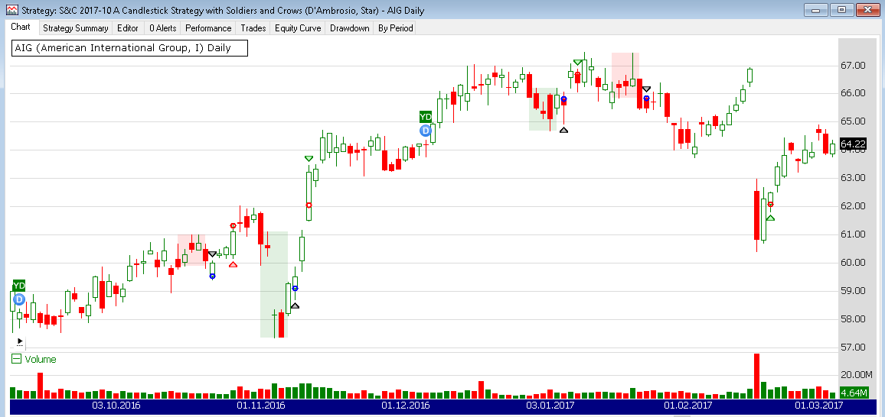

## A Candlestick Strategy With Soldiers And Crows

**References**


- [traders.com: TradersTips 2017-10](https://traders.com/Documentation/FEEDbk_docs/2017/10/TradersTips.html)


**█ OVERVIEW**


In the article “Weekly & Daily MACD” in this issue, author Vitali Apirine introduces a novel approach to using the classic MACD indicator in a way that simulates calculations based on different timeframes while using just a daily-interval chart. He describes a number of ways to use this new indicator that allows traders to adapt it to differing markets and conditions.


**█ STRATEGY**

The bullish one white soldier and bearish one black crow patterns highlighted by Jerry D’Ambrosio and Barbara Star in their article in this issue, “A Candlestick Strategy with Soldiers and Crows,” have been added to our Community Components library for easy reference in users’ strategies. Here’s the complete list of strategy rules:

- Enter long next bar at open if following conditions are met:

    - Stock price greater than $1
    - 50-day simple moving average of volume is greater than 100,000
    - Yesterday’s close was less than the day before
    - Yesterday’s close was less than its open
    - Today’s open is greater than yesterday’s close
    - Today’s close is greater than yesterday’s open
    - Today’s open is less than yesterday’s open
    - As of yesterday’s close, price had been closing lower for three days


- Sell short next bar at open if following conditions are met:

    - Stock price is greater than $10
    - 50-day simple moving average of volume is greater than 100,000
    - Yesterday’s close was higher than the close the day before
    - Yesterday’s close was greater than yesterday’s open
    - Today’s open is less than yesterday’s close
    - Today’s close is less than yesterday’s open
    - Today’s open is higher than yesterday’s open
    - As of yesterday’s close, price had been closing higher for three days.


- Exit long position if any condition is triggered:

    - Exit at market on two lower lows
    - Exit at market if either the 14-period stochastic is at or above than 80 or the 14-period RSI is at or above 70
    - Exit at a 3% stop-loss (if enabled)
    - Exit at a 5% take-profit (if enabled)


- Cover short position if any condition is triggered:

    - Exit at market on two higher highs
    - Exit at market if either the 14-period stochastic is at or below 20 or the 14-period RSI is at or below 30
    - Exit at a 3% stop-loss (if enabled)
    - Exit at a 5% take-profit (if enabled)
    




    

##### Load basic packages 


```python
import pandas as pd
import numpy as np
import os
import gc
import copy
from pathlib import Path
from datetime import datetime, timedelta, time, date
```


```python
#this package is to download equity price data from yahoo finance
#the source code of this package can be found here: https://github.com/ranaroussi/yfinance/blob/main
import yfinance as yf
```


```python
pd.options.display.max_rows = 100
pd.options.display.max_columns = 100

import warnings
warnings.filterwarnings("ignore")

import pytorch_lightning as pl
random_seed=1234
pl.seed_everything(random_seed)
```

    Global seed set to 1234
    


    1234


##### Download data


```python
##### Download data#S&P 500 (^GSPC),  Dow Jones Industrial Average (^DJI), NASDAQ Composite (^IXIC)
#Russell 2000 (^RUT), Crude Oil Nov 21 (CL=F), Gold Dec 21 (GC=F)
#Treasury Yield 10 Years (^TNX)
#CBOE Volatility Index (^VIX) Chicago Options - Chicago Options Delayed Price. Currency in USD

#benchmark_tickers = ['^GSPC', '^DJI', '^IXIC', '^RUT',  'CL=F', 'GC=F', '^TNX']

benchmark_tickers = ['^GSPC', '^VIX']
tickers = benchmark_tickers + ['GSK', 'BST', 'PFE']
```


```python
#https://github.com/ranaroussi/yfinance/blob/main/yfinance/base.py
#     def history(self, period="1mo", interval="1d",
#                 start=None, end=None, prepost=False, actions=True,
#                 auto_adjust=True, back_adjust=False,
#                 proxy=None, rounding=False, tz=None, timeout=None, **kwargs):

dfs = {}

for ticker in tickers:
    cur_data = yf.Ticker(ticker)
    hist = cur_data.history(period="max", start='2000-01-01')
    print(datetime.now(), ticker, hist.shape, hist.index.min(), hist.index.max())
    dfs[ticker] = hist
```

    2022-09-10 19:00:08.298576 ^GSPC (5710, 7) 1999-12-31 00:00:00 2022-09-09 00:00:00
    2022-09-10 19:00:08.689645 ^VIX (5710, 7) 1999-12-31 00:00:00 2022-09-09 00:00:00
    2022-09-10 19:00:09.066685 GSK (5710, 7) 1999-12-31 00:00:00 2022-09-09 00:00:00
    2022-09-10 19:00:09.381786 BST (1980, 7) 2014-10-29 00:00:00 2022-09-09 00:00:00
    2022-09-10 19:00:09.814302 PFE (5710, 7) 1999-12-31 00:00:00 2022-09-09 00:00:00
    


```python
ticker = 'PFE'
dfs[ticker].tail(5)
```


<div>
<style scoped>
    .dataframe tbody tr th:only-of-type {
        vertical-align: middle;
    }

    .dataframe tbody tr th {
        vertical-align: top;
    }

    .dataframe thead th {
        text-align: right;
    }
</style>
<table border="1" class="dataframe">
  <thead>
    <tr style="text-align: right;">
      <th></th>
      <th>Open</th>
      <th>High</th>
      <th>Low</th>
      <th>Close</th>
      <th>Volume</th>
      <th>Dividends</th>
      <th>Stock Splits</th>
    </tr>
    <tr>
      <th>Date</th>
      <th></th>
      <th></th>
      <th></th>
      <th></th>
      <th></th>
      <th></th>
      <th></th>
    </tr>
  </thead>
  <tbody>
    <tr>
      <th>2022-09-02</th>
      <td>46.740002</td>
      <td>46.799999</td>
      <td>45.529999</td>
      <td>45.700001</td>
      <td>14662700</td>
      <td>0.0</td>
      <td>0.0</td>
    </tr>
    <tr>
      <th>2022-09-06</th>
      <td>45.959999</td>
      <td>46.439999</td>
      <td>45.529999</td>
      <td>45.759998</td>
      <td>17153500</td>
      <td>0.0</td>
      <td>0.0</td>
    </tr>
    <tr>
      <th>2022-09-07</th>
      <td>45.700001</td>
      <td>46.209999</td>
      <td>45.380001</td>
      <td>46.130001</td>
      <td>15378900</td>
      <td>0.0</td>
      <td>0.0</td>
    </tr>
    <tr>
      <th>2022-09-08</th>
      <td>46.020000</td>
      <td>47.119999</td>
      <td>45.869999</td>
      <td>47.080002</td>
      <td>18271000</td>
      <td>0.0</td>
      <td>0.0</td>
    </tr>
    <tr>
      <th>2022-09-09</th>
      <td>47.200001</td>
      <td>47.990002</td>
      <td>47.099998</td>
      <td>47.840000</td>
      <td>17501700</td>
      <td>0.0</td>
      <td>0.0</td>
    </tr>
  </tbody>
</table>
</div>


##### Calculate the technical indicators and  Find signals


```python
"""
    Function: __C_Crow
    // _C_Crow Function
    // TASC OCT 2017
    // A Candlestick Strategy
    // With Soldiers and Crows
    // D'Ambrosio and Star

    _C_Crow = Close[1] > Close[2] and
            Close[1] > Open[1] and 
            Open < Close[1] and
            Close < Open[1] and 
            Open > Open[1] and
            Close[1] > Close[2] and 
            Close[2] > Close[3] ;
"""
"""
One Black Crow:
minPrice:= 10;    {minimum price}
minVol:= 100000; {minimum volume}
trend:= Sum( C > Ref(C, -1), 3) = 3; 
Ref(C > O, -1) AND O < Ref(C, -1) AND
C < Ref(O, -1) AND O > Ref(O, -1) AND
Ref(trend, -1) AND C > minPrice AND
Mov(V, 50, S) > minVol


"""
def _scan_crow(c, o):
    crow_ = True
    crow_ = crow_ & (c.shift(1)>c.shift(2)) 
    crow_ = crow_ & (c.shift(1)>o.shift(1)) 
    crow_ = crow_ & (o<c.shift(1)) 
    crow_ = crow_ & (c<o.shift(1)) 
    crow_ = crow_ & (o>o.shift(1)) 
    crow_ = crow_ & (c.shift(2)>c.shift(3))
    return crow_


"""

    Function: _C_Soldier
    // _C_Soldier Function
    // TASC OCT 2017
    // A Candlestick Strategy
    // With Soldiers and Crows
    // D'Ambrosio and Star

    _C_Soldier = Close[1] < Close[2] and
                Close[1] < Open[1] and 
                Open > Close[1] and
                Close > Open[1] and 
                Open < Open[1] and
                Close[1] < Close[2] and 
                Close[2] < Close[3] ;

"""
"""
One White Soldier:
minPrice:= 1;    {minimum price}
minVol:= 100000; {minimum volume}
trend:= Sum( C < Ref(C, -1), 3) = 3; 
Ref(C < O, -1) AND O > Ref(C, -1) AND
C > Ref(O, -1) AND O < Ref(O, -1) AND
Ref(trend, -1) AND C > minPrice AND
Mov(V, 50, S) > minVol

"""


def _scan_soldier(c, o):
    soldier_ = True
    soldier_ = soldier_ & (c.shift(1)<c.shift(2)) 
    soldier_ = soldier_ & (c.shift(1)<o.shift(1)) 
    soldier_ = soldier_ & (o>c.shift(1)) 
    soldier_ = soldier_ & (c>o.shift(1)) 
    soldier_ = soldier_ & (o<o.shift(1)) 
    soldier_ = soldier_ & (c.shift(2)<c.shift(3))
    return soldier_

```


```python
from core.finta import TA
```


```python
df = dfs[ticker][['Open', 'High', 'Low', 'Close', 'Volume']]
df = df.round(2)
```


```python
df_ref = dfs['^GSPC'][[ 'Close']]
df_ref = df_ref.round(2)
df_ref.columns = ['ref_close']

print(df.shape, df_ref.shape)
df = df.merge(df_ref, left_index=True, right_index=True, how='inner')
print(df.shape)
df.isna().sum()
```

    (5710, 5) (5710, 1)
    (5710, 6)
    


    Open         0
    High         0
    Low          0
    Close        0
    Volume       0
    ref_close    0
    dtype: int64


```python
df_ta = TA.BBANDS(df, period = 20, std_multiplier=2.2, column="close")
df = df.merge(df_ta, left_index = True, right_index = True, how='inner' )

df_ta = TA.XSII(df, slow_period = 102, fast_period = 7)
df = df.merge(df_ta, left_index = True, right_index = True, how='inner' )

df_ta = TA.RSMK(df, rsmk_period = 60, ema_period = 5, column = "close", ref_column = "ref_close")
df = df.merge(df_ta, left_index = True, right_index = True, how='inner' )

df_ta = TA.SQZMI(df, period = 20,  column = "close")
df['SQZMI'] = df_ta

del df_ta
gc.collect()
```


    38


```python
df['SOLDIER'] = _scan_soldier(df['Close'], df['Open'])
df['CROW'] = _scan_crow(df['Close'], df['Open'])
```


```python
df_ta = TA.SMA(df, period = 50, column = "volume") 
df['MAV'] = df_ta.values
```


```python
df[['SOLDIER', 'CROW', 'SQZMI']].value_counts()
```


    SOLDIER  CROW   SQZMI
    False    False  False    4865
                    True      682
    True     False  False      80
    False    True   False      63
    True     False  True       11
    False    True   True        9
    dtype: int64


```python
min_avg_volume = 100000 
df['B'] = (df['SOLDIER'] & (df['MAV']>min_avg_volume)).astype(int)*((df['High'] + df['Low'])/2)
df['S'] = (df['CROW'] & (df['MAV']>min_avg_volume)).astype(int)*((df['High'] + df['Low'])/2)
df['B2'] = (df['SOLDIER'] & (df['MAV']>min_avg_volume) & df['SQZMI']).astype(int)*((df['High'] + df['Low'])/2)
```


```python
display(df.head(5))
display(df.tail(5))
```


<div>
<style scoped>
    .dataframe tbody tr th:only-of-type {
        vertical-align: middle;
    }

    .dataframe tbody tr th {
        vertical-align: top;
    }

    .dataframe thead th {
        text-align: right;
    }
</style>
<table border="1" class="dataframe">
  <thead>
    <tr style="text-align: right;">
      <th></th>
      <th>Open</th>
      <th>High</th>
      <th>Low</th>
      <th>Close</th>
      <th>Volume</th>
      <th>ref_close</th>
      <th>BB_UPPER</th>
      <th>BB_MIDDLE</th>
      <th>BB_LOWER</th>
      <th>BBWIDTH</th>
      <th>PERCENT_B</th>
      <th>XSII1</th>
      <th>XSII2</th>
      <th>XSII3</th>
      <th>XSII4</th>
      <th>RSMK</th>
      <th>SQZMI</th>
      <th>SOLDIER</th>
      <th>CROW</th>
      <th>MAV</th>
      <th>B</th>
      <th>S</th>
      <th>B2</th>
    </tr>
    <tr>
      <th>Date</th>
      <th></th>
      <th></th>
      <th></th>
      <th></th>
      <th></th>
      <th></th>
      <th></th>
      <th></th>
      <th></th>
      <th></th>
      <th></th>
      <th></th>
      <th></th>
      <th></th>
      <th></th>
      <th></th>
      <th></th>
      <th></th>
      <th></th>
      <th></th>
      <th></th>
      <th></th>
      <th></th>
    </tr>
  </thead>
  <tbody>
    <tr>
      <th>1999-12-31</th>
      <td>14.25</td>
      <td>14.31</td>
      <td>14.11</td>
      <td>14.22</td>
      <td>5939817</td>
      <td>1469.25</td>
      <td>NaN</td>
      <td>NaN</td>
      <td>NaN</td>
      <td>NaN</td>
      <td>NaN</td>
      <td>NaN</td>
      <td>NaN</td>
      <td>15.2154</td>
      <td>13.2246</td>
      <td>NaN</td>
      <td>False</td>
      <td>False</td>
      <td>False</td>
      <td>NaN</td>
      <td>0.0</td>
      <td>0.0</td>
      <td>0.0</td>
    </tr>
    <tr>
      <th>2000-01-03</th>
      <td>14.06</td>
      <td>14.20</td>
      <td>13.87</td>
      <td>13.98</td>
      <td>12873345</td>
      <td>1455.22</td>
      <td>NaN</td>
      <td>NaN</td>
      <td>NaN</td>
      <td>NaN</td>
      <td>NaN</td>
      <td>NaN</td>
      <td>NaN</td>
      <td>14.9586</td>
      <td>13.0014</td>
      <td>NaN</td>
      <td>False</td>
      <td>False</td>
      <td>False</td>
      <td>NaN</td>
      <td>0.0</td>
      <td>0.0</td>
      <td>0.0</td>
    </tr>
    <tr>
      <th>2000-01-04</th>
      <td>13.70</td>
      <td>13.81</td>
      <td>13.16</td>
      <td>13.46</td>
      <td>14208974</td>
      <td>1399.42</td>
      <td>NaN</td>
      <td>NaN</td>
      <td>NaN</td>
      <td>NaN</td>
      <td>NaN</td>
      <td>NaN</td>
      <td>NaN</td>
      <td>14.4022</td>
      <td>12.5178</td>
      <td>NaN</td>
      <td>False</td>
      <td>False</td>
      <td>False</td>
      <td>NaN</td>
      <td>0.0</td>
      <td>0.0</td>
      <td>0.0</td>
    </tr>
    <tr>
      <th>2000-01-05</th>
      <td>13.54</td>
      <td>13.98</td>
      <td>13.51</td>
      <td>13.68</td>
      <td>12981591</td>
      <td>1402.11</td>
      <td>NaN</td>
      <td>NaN</td>
      <td>NaN</td>
      <td>NaN</td>
      <td>NaN</td>
      <td>NaN</td>
      <td>NaN</td>
      <td>14.6376</td>
      <td>12.7224</td>
      <td>NaN</td>
      <td>False</td>
      <td>False</td>
      <td>False</td>
      <td>NaN</td>
      <td>0.0</td>
      <td>0.0</td>
      <td>0.0</td>
    </tr>
    <tr>
      <th>2000-01-06</th>
      <td>13.70</td>
      <td>14.36</td>
      <td>13.68</td>
      <td>14.17</td>
      <td>11115273</td>
      <td>1403.45</td>
      <td>NaN</td>
      <td>NaN</td>
      <td>NaN</td>
      <td>NaN</td>
      <td>NaN</td>
      <td>14.17851</td>
      <td>13.62249</td>
      <td>15.1619</td>
      <td>13.1781</td>
      <td>NaN</td>
      <td>False</td>
      <td>False</td>
      <td>False</td>
      <td>NaN</td>
      <td>0.0</td>
      <td>0.0</td>
      <td>0.0</td>
    </tr>
  </tbody>
</table>
</div>


<div>
<style scoped>
    .dataframe tbody tr th:only-of-type {
        vertical-align: middle;
    }

    .dataframe tbody tr th {
        vertical-align: top;
    }

    .dataframe thead th {
        text-align: right;
    }
</style>
<table border="1" class="dataframe">
  <thead>
    <tr style="text-align: right;">
      <th></th>
      <th>Open</th>
      <th>High</th>
      <th>Low</th>
      <th>Close</th>
      <th>Volume</th>
      <th>ref_close</th>
      <th>BB_UPPER</th>
      <th>BB_MIDDLE</th>
      <th>BB_LOWER</th>
      <th>BBWIDTH</th>
      <th>PERCENT_B</th>
      <th>XSII1</th>
      <th>XSII2</th>
      <th>XSII3</th>
      <th>XSII4</th>
      <th>RSMK</th>
      <th>SQZMI</th>
      <th>SOLDIER</th>
      <th>CROW</th>
      <th>MAV</th>
      <th>B</th>
      <th>S</th>
      <th>B2</th>
    </tr>
    <tr>
      <th>Date</th>
      <th></th>
      <th></th>
      <th></th>
      <th></th>
      <th></th>
      <th></th>
      <th></th>
      <th></th>
      <th></th>
      <th></th>
      <th></th>
      <th></th>
      <th></th>
      <th></th>
      <th></th>
      <th></th>
      <th></th>
      <th></th>
      <th></th>
      <th></th>
      <th></th>
      <th></th>
      <th></th>
    </tr>
  </thead>
  <tbody>
    <tr>
      <th>2022-09-02</th>
      <td>46.74</td>
      <td>46.80</td>
      <td>45.53</td>
      <td>45.70</td>
      <td>14662700</td>
      <td>3924.26</td>
      <td>51.663455</td>
      <td>48.1505</td>
      <td>44.637545</td>
      <td>0.145916</td>
      <td>0.151220</td>
      <td>46.90878</td>
      <td>45.06922</td>
      <td>52.314323</td>
      <td>45.469459</td>
      <td>-10.218471</td>
      <td>False</td>
      <td>False</td>
      <td>False</td>
      <td>17821424.0</td>
      <td>0.0</td>
      <td>0.0</td>
      <td>0.0</td>
    </tr>
    <tr>
      <th>2022-09-06</th>
      <td>45.96</td>
      <td>46.44</td>
      <td>45.53</td>
      <td>45.76</td>
      <td>17153500</td>
      <td>3908.19</td>
      <td>51.579166</td>
      <td>47.9600</td>
      <td>44.340834</td>
      <td>0.150924</td>
      <td>0.196063</td>
      <td>46.81800</td>
      <td>44.98200</td>
      <td>52.168463</td>
      <td>45.342683</td>
      <td>-9.751431</td>
      <td>False</td>
      <td>False</td>
      <td>False</td>
      <td>17677630.0</td>
      <td>0.0</td>
      <td>0.0</td>
      <td>0.0</td>
    </tr>
    <tr>
      <th>2022-09-07</th>
      <td>45.70</td>
      <td>46.21</td>
      <td>45.38</td>
      <td>46.13</td>
      <td>15378900</td>
      <td>3979.87</td>
      <td>51.374440</td>
      <td>47.7775</td>
      <td>44.180560</td>
      <td>0.150570</td>
      <td>0.270986</td>
      <td>46.81800</td>
      <td>44.98200</td>
      <td>52.061739</td>
      <td>45.249923</td>
      <td>-9.580215</td>
      <td>False</td>
      <td>False</td>
      <td>False</td>
      <td>17662122.0</td>
      <td>0.0</td>
      <td>0.0</td>
      <td>0.0</td>
    </tr>
    <tr>
      <th>2022-09-08</th>
      <td>46.02</td>
      <td>47.12</td>
      <td>45.87</td>
      <td>47.08</td>
      <td>18271000</td>
      <td>4006.18</td>
      <td>51.062513</td>
      <td>47.6340</td>
      <td>44.205487</td>
      <td>0.143952</td>
      <td>0.419207</td>
      <td>47.08677</td>
      <td>45.24023</td>
      <td>52.031775</td>
      <td>45.223879</td>
      <td>-8.916949</td>
      <td>False</td>
      <td>False</td>
      <td>False</td>
      <td>17699184.0</td>
      <td>0.0</td>
      <td>0.0</td>
      <td>0.0</td>
    </tr>
    <tr>
      <th>2022-09-09</th>
      <td>47.20</td>
      <td>47.99</td>
      <td>47.10</td>
      <td>47.84</td>
      <td>17501700</td>
      <td>4067.36</td>
      <td>51.025194</td>
      <td>47.6115</td>
      <td>44.197806</td>
      <td>0.143398</td>
      <td>0.533468</td>
      <td>47.37849</td>
      <td>45.52051</td>
      <td>52.030341</td>
      <td>45.222633</td>
      <td>-8.579216</td>
      <td>False</td>
      <td>False</td>
      <td>False</td>
      <td>17770704.0</td>
      <td>0.0</td>
      <td>0.0</td>
      <td>0.0</td>
    </tr>
  </tbody>
</table>
</div>


```python
df.columns
```


    Index(['Open', 'High', 'Low', 'Close', 'Volume', 'ref_close', 'BB_UPPER',
           'BB_MIDDLE', 'BB_LOWER', 'BBWIDTH', 'PERCENT_B', 'XSII1', 'XSII2',
           'XSII3', 'XSII4', 'RSMK', 'SQZMI', 'SOLDIER', 'CROW', 'MAV', 'B', 'S',
           'B2'],
          dtype='object')


##### Visual


```python
from core.visuals import *
```


```python
start = -1500
end = df.shape[0]
# df_sub = df.iloc[start:end]
df_sub = df[(df.index<='2016-06-02') & (df.index>='2015-09-02')]
names = {'main_title': f'{ticker}'}
```


```python
lines0 = basic_lines(df_sub[['XSII1', 'XSII2', 'XSII3', 'XSII4']], 
                     colors = [], 
                     **dict(panel=0, width=1.5, secondary_y=False))

lines1 = basic_lines(df_sub[['RSMK']], 
                     colors = ['cadetblue'], 
                     **dict(panel=1, width=1, secondary_y=False))

lines3 = basic_lines(df_sub[[ 'S']],
                     colors = ['black'], 
                     **dict(panel=0, type='scatter', marker=r'${S}$' , markersize=100, secondary_y=False))

lines2 = basic_lines(df_sub[[ 'B', 'B2']],
                     colors = ['navy', 'red'], 
                     **dict(panel=0, type='scatter', marker=r'${B}$' , markersize=100, secondary_y=False))


lines_ = dict(**lines0, **lines1)
lines_.update(lines2)
lines_.update(lines3)

shadows_ = basic_shadows(bands=[-5, 5], nsamples=df_sub.shape[0], **dict(panel=1, color="lightskyblue",alpha=0.1,interpolate=True))

fig_config_ = dict(figratio=(18,10), volume=False, volume_panel=2,panel_ratios=(5,2), tight_layout=True, returnfig=True,)

ax_cfg_ = {0:dict(basic=[6, 2, ['XSII1', 'XSII2', 'XSII3', 'XSII4']], 
                 title=dict(label = 'XSII', fontsize=9, style='italic',  loc='left'), 
                ),
           2:dict(basic=[1, 0, ['RSMK']]
                ),
          }


names = {'main_title': f'{ticker}'}

aa_, bb_ = make_panels(main_data = df_sub[['Open', 'High', 'Low', 'Close', 'Volume']], 
                       added_plots = lines_,
                       fill_betweens = shadows_, 
                       fig_config = fig_config_, 
                       axes_config = ax_cfg_,  
                       names = names)
```


    

    

