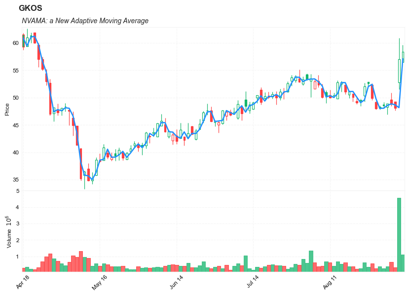

## VAMA: A New Adaptive Moving Average


#### Reference: 

- [a New Adaptive Moving Average](https://mpra.ub.uni-muenchen.de/94323/1/MPRA_paper_94323.pdf) 
    - [backup link](../pdf/MPRA_paper_94323.pdf)


**Definition**


- The separation of the trend from random fluctuations (noise) is a major objective in technical analysis
- the simple moving average and the exponential moving average are the two most used filters used to achieve this goal
- those two filters use one parameter to control this degree of separation, higher degree of separation involve smoother results but also more lag. 
- Lag is defined as the effect of a moving average to show past trends instead of new ones, this effect his unavoidable with causal filters and is a major drawback in decision timing . 
- a new adaptive moving average technical indicator (VAMA) aims to provide smooth results as well as providing fast decision timing.

---

**Calculation**


---

##### Load basic packages 


```python
import pandas as pd
import numpy as np
import os
import gc
import copy
from pathlib import Path
from datetime import datetime, timedelta, time, date
```


```python
#this package is to download equity price data from yahoo finance
#the source code of this package can be found here: https://github.com/ranaroussi/yfinance/blob/main
import yfinance as yf
```


```python
pd.options.display.max_rows = 100
pd.options.display.max_columns = 100

import warnings
warnings.filterwarnings("ignore")

import pytorch_lightning as pl
random_seed=1234
pl.seed_everything(random_seed)
```

    Global seed set to 1234
    


    1234


```python
#S&P 500 (^GSPC),  Dow Jones Industrial Average (^DJI), NASDAQ Composite (^IXIC)
#Russell 2000 (^RUT), Crude Oil Nov 21 (CL=F), Gold Dec 21 (GC=F)
#Treasury Yield 10 Years (^TNX)

#benchmark_tickers = ['^GSPC', '^DJI', '^IXIC', '^RUT',  'CL=F', 'GC=F', '^TNX']

benchmark_tickers = ['^GSPC']
tickers = benchmark_tickers + ['GSK', 'NVO', 'AROC', 'GKOS']
```


```python
#https://github.com/ranaroussi/yfinance/blob/main/yfinance/base.py
#     def history(self, period="1mo", interval="1d",
#                 start=None, end=None, prepost=False, actions=True,
#                 auto_adjust=True, back_adjust=False,
#                 proxy=None, rounding=False, tz=None, timeout=None, **kwargs):

dfs = {}

for ticker in tickers:
    cur_data = yf.Ticker(ticker)
    hist = cur_data.history(period="max", start='2000-01-01')
    print(datetime.now(), ticker, hist.shape, hist.index.min(), hist.index.max())
    dfs[ticker] = hist
```

    2022-09-09 19:39:16.539924 ^GSPC (5709, 7) 1999-12-31 00:00:00 2022-09-08 00:00:00
    2022-09-09 19:39:16.992681 GSK (5709, 7) 1999-12-31 00:00:00 2022-09-08 00:00:00
    2022-09-09 19:39:17.367706 NVO (5709, 7) 1999-12-31 00:00:00 2022-09-08 00:00:00
    2022-09-09 19:39:17.680497 AROC (3790, 7) 2007-08-21 00:00:00 2022-09-08 00:00:00
    2022-09-09 19:39:17.978139 GKOS (1815, 7) 2015-06-25 00:00:00 2022-09-08 00:00:00
    


```python
ticker = 'GKOS'
dfs[ticker].tail(5)
```


<div>
<style scoped>
    .dataframe tbody tr th:only-of-type {
        vertical-align: middle;
    }

    .dataframe tbody tr th {
        vertical-align: top;
    }

    .dataframe thead th {
        text-align: right;
    }
</style>
<table border="1" class="dataframe">
  <thead>
    <tr style="text-align: right;">
      <th></th>
      <th>Open</th>
      <th>High</th>
      <th>Low</th>
      <th>Close</th>
      <th>Volume</th>
      <th>Dividends</th>
      <th>Stock Splits</th>
    </tr>
    <tr>
      <th>Date</th>
      <th></th>
      <th></th>
      <th></th>
      <th></th>
      <th></th>
      <th></th>
      <th></th>
    </tr>
  </thead>
  <tbody>
    <tr>
      <th>2022-09-01</th>
      <td>48.209999</td>
      <td>48.919998</td>
      <td>46.900002</td>
      <td>48.840000</td>
      <td>372500</td>
      <td>0</td>
      <td>0</td>
    </tr>
    <tr>
      <th>2022-09-02</th>
      <td>49.590000</td>
      <td>50.900002</td>
      <td>48.419998</td>
      <td>48.830002</td>
      <td>650900</td>
      <td>0</td>
      <td>0</td>
    </tr>
    <tr>
      <th>2022-09-06</th>
      <td>49.200001</td>
      <td>49.200001</td>
      <td>47.630001</td>
      <td>48.099998</td>
      <td>334400</td>
      <td>0</td>
      <td>0</td>
    </tr>
    <tr>
      <th>2022-09-07</th>
      <td>52.759998</td>
      <td>60.919998</td>
      <td>51.490002</td>
      <td>57.009998</td>
      <td>4560500</td>
      <td>0</td>
      <td>0</td>
    </tr>
    <tr>
      <th>2022-09-08</th>
      <td>56.439999</td>
      <td>59.599998</td>
      <td>56.439999</td>
      <td>58.380001</td>
      <td>1106900</td>
      <td>0</td>
      <td>0</td>
    </tr>
  </tbody>
</table>
</div>


##### Define NVAMA calculation function

    //@version=2
    study("VAMA",overlay=true)
    length = input(14)
    //----
    c = sma(close,length)
    o = sma(open,length)
    h = sma(high,length)
    l = sma(low,length)
    lv = abs(c-o)/(h - l)
    //----
    ma = lv*close+(1-lv)*nz(ma[1],close)
    plot(ma,color=#FF0000,transp=0)


```python

def cal_nvama(ohlc: pd.DataFrame, period: int = 14) -> pd.Series:
        """
        A New Adaptive Moving Average: VAMA
        :period: Specifies the number of periods used for VAMA calculation
        
        based on: https://mpra.ub.uni-muenchen.de/94323/1/MPRA_paper_94323.pdf
        
        """
        ohlc = ohlc.copy(deep=True)
        ohlc.columns = [col_name.lower() for col_name in ohlc.columns]
        c = ohlc.close.rolling(period).mean()
        o = ohlc.open.rolling(period).mean()
        h = ohlc.high.rolling(period).mean()
        l = ohlc.low.rolling(period).mean()
        
        lv = abs(c - o)/(h - l)
        ma = lv*ohlc.close + (1 - lv)*ohlc.close.shift(1)


        return pd.Series(ma, index=ohlc.index, name=f"NVAMA{period}")
```

##### Calculate NVAMA


```python
df = dfs[ticker][['Open', 'High', 'Low', 'Close', 'Volume']]
```


```python
df = df.round(2)
```


```python
df_ta = cal_nvama(df, period = 14)
df = df.merge(df_ta, left_index = True, right_index = True, how='inner' )

del df_ta
gc.collect()
```


    101


```python
display(df.head(5))
display(df.tail(5))
```


<div>
<style scoped>
    .dataframe tbody tr th:only-of-type {
        vertical-align: middle;
    }

    .dataframe tbody tr th {
        vertical-align: top;
    }

    .dataframe thead th {
        text-align: right;
    }
</style>
<table border="1" class="dataframe">
  <thead>
    <tr style="text-align: right;">
      <th></th>
      <th>Open</th>
      <th>High</th>
      <th>Low</th>
      <th>Close</th>
      <th>Volume</th>
      <th>NVAMA14</th>
    </tr>
    <tr>
      <th>Date</th>
      <th></th>
      <th></th>
      <th></th>
      <th></th>
      <th></th>
      <th></th>
    </tr>
  </thead>
  <tbody>
    <tr>
      <th>2015-06-25</th>
      <td>29.11</td>
      <td>31.95</td>
      <td>28.00</td>
      <td>31.22</td>
      <td>7554700</td>
      <td>NaN</td>
    </tr>
    <tr>
      <th>2015-06-26</th>
      <td>30.39</td>
      <td>30.39</td>
      <td>27.51</td>
      <td>28.00</td>
      <td>1116500</td>
      <td>NaN</td>
    </tr>
    <tr>
      <th>2015-06-29</th>
      <td>27.70</td>
      <td>28.48</td>
      <td>27.51</td>
      <td>28.00</td>
      <td>386900</td>
      <td>NaN</td>
    </tr>
    <tr>
      <th>2015-06-30</th>
      <td>27.39</td>
      <td>29.89</td>
      <td>27.39</td>
      <td>28.98</td>
      <td>223900</td>
      <td>NaN</td>
    </tr>
    <tr>
      <th>2015-07-01</th>
      <td>28.83</td>
      <td>29.00</td>
      <td>27.87</td>
      <td>28.00</td>
      <td>150000</td>
      <td>NaN</td>
    </tr>
  </tbody>
</table>
</div>


<div>
<style scoped>
    .dataframe tbody tr th:only-of-type {
        vertical-align: middle;
    }

    .dataframe tbody tr th {
        vertical-align: top;
    }

    .dataframe thead th {
        text-align: right;
    }
</style>
<table border="1" class="dataframe">
  <thead>
    <tr style="text-align: right;">
      <th></th>
      <th>Open</th>
      <th>High</th>
      <th>Low</th>
      <th>Close</th>
      <th>Volume</th>
      <th>NVAMA14</th>
    </tr>
    <tr>
      <th>Date</th>
      <th></th>
      <th></th>
      <th></th>
      <th></th>
      <th></th>
      <th></th>
    </tr>
  </thead>
  <tbody>
    <tr>
      <th>2022-09-01</th>
      <td>48.21</td>
      <td>48.92</td>
      <td>46.90</td>
      <td>48.84</td>
      <td>372500</td>
      <td>48.553668</td>
    </tr>
    <tr>
      <th>2022-09-02</th>
      <td>49.59</td>
      <td>50.90</td>
      <td>48.42</td>
      <td>48.83</td>
      <td>650900</td>
      <td>48.838361</td>
    </tr>
    <tr>
      <th>2022-09-06</th>
      <td>49.20</td>
      <td>49.20</td>
      <td>47.63</td>
      <td>48.10</td>
      <td>334400</td>
      <td>48.667913</td>
    </tr>
    <tr>
      <th>2022-09-07</th>
      <td>52.76</td>
      <td>60.92</td>
      <td>51.49</td>
      <td>57.01</td>
      <td>4560500</td>
      <td>48.147812</td>
    </tr>
    <tr>
      <th>2022-09-08</th>
      <td>56.44</td>
      <td>59.60</td>
      <td>56.44</td>
      <td>58.38</td>
      <td>1106900</td>
      <td>57.072998</td>
    </tr>
  </tbody>
</table>
</div>


```python
#https://github.com/matplotlib/mplfinance
#this package help visualize financial data
import mplfinance as mpf
import matplotlib.colors as mcolors

# all_colors = list(mcolors.CSS4_COLORS.keys())#"CSS Colors"
all_colors = list(mcolors.TABLEAU_COLORS.keys()) # "Tableau Palette",
# all_colors = list(mcolors.BASE_COLORS.keys()) #"Base Colors",


#https://github.com/matplotlib/mplfinance/issues/181#issuecomment-667252575
#list of colors: https://matplotlib.org/stable/gallery/color/named_colors.html
#https://github.com/matplotlib/mplfinance/blob/master/examples/styles.ipynb

def plot_3panels(main_data, add_data=None, mid_panel=None, chart_type='candle', names=None, 
                  figratio=(14,9)):


    style = mpf.make_mpf_style(base_mpf_style='yahoo',  #charles
                               base_mpl_style = 'seaborn-whitegrid',
#                                marketcolors=mpf.make_marketcolors(up="r", down="#0000CC",inherit=True),
                               gridcolor="whitesmoke", 
                               gridstyle="--", #or None, or - for solid
                               gridaxis="both", 
                               edgecolor = 'whitesmoke',
                               facecolor = 'white', #background color within the graph edge
                               figcolor = 'white', #background color outside of the graph edge
                               y_on_right = False,
                               rc =  {'legend.fontsize': 'small',#or number
                                      #'figure.figsize': (14, 9),
                                     'axes.labelsize': 'small',
                                     'axes.titlesize':'small',
                                     'xtick.labelsize':'small',#'x-small', 'small','medium','large'
                                     'ytick.labelsize':'small'
                                     }, 
                              )   

    if (chart_type is None) or (chart_type not in ['ohlc', 'line', 'candle', 'hollow_and_filled']):
        chart_type = 'candle'
    len_dict = {'candle':2, 'ohlc':3, 'line':1, 'hollow_and_filled':2}    
        
    kwargs = dict(type=chart_type, figratio=figratio, volume=True, volume_panel=1, 
                  panel_ratios=(4,2), tight_layout=True, style=style, returnfig=True)
    
    if names is None:
        names = {'main_title': '', 'sub_tile': ''}
    


    added_plots = { 
  
        'NVAMA14': mpf.make_addplot(add_data['NVAMA14'], panel=0, color='dodgerblue', secondary_y=False), 
#         'AO-SIGNAL': mpf.make_addplot(mid_panel['AO']-mid_panel['SIGNAL'], type='bar',width=0.7,panel=1, color="pink",alpha=0.65,secondary_y=False),
    }

                         

    fig, axes = mpf.plot(main_data,  **kwargs,
                         addplot=list(added_plots.values()),
                        )
    # add a new suptitle
    fig.suptitle(names['main_title'], y=1.05, fontsize=12, x=0.128)

    axes[0].set_title(names['sub_tile'], fontsize=10, style='italic',  loc='left')
    
    

    
    #set legend

#     axes[0].legend([None]*6)
#     handles = axes[0].get_legend().legendHandles
#     print(handles)
#     axes[0].legend(handles=handles[4:],labels=['MAMA', 'FAMA'])
    #axes[2].set_title('AO', fontsize=10, style='italic',  loc='left')
#     axes[0].set_ylabel('MAMA')
    
    

#     axes[0].set_ylabel(names['y_tiles'][0])
    return fig, axes
   
```


```python

start = -100
end = df.shape[0]

names = {'main_title': f'{ticker}', 
         'sub_tile': 'NVAMA: a New Adaptive Moving Average'}


aa_, bb_ = plot_3panels(df.iloc[start:end][['Open', 'High', 'Low', 'Close', 'Volume']], 
             df.iloc[start:end][[ 'NVAMA14']],
             None, 
             chart_type='hollow_and_filled',
                     names = names, 
                    )
```


    

    

