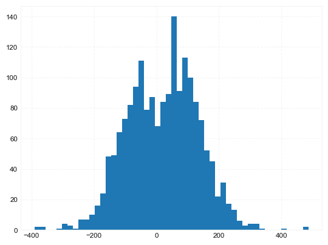

## Commodity Channel Index (CCI)

**References**

- [tradingview: Commodity Channel Index (CCI)](https://www.tradingview.com/support/solutions/43000502001-commodity-channel-index-cci/)
- [fidelity: Commodity Channel Index (CCI)](https://www.fidelity.com/learning-center/trading-investing/technical-analysis/technical-indicator-guide/cci)

**Definition**

- The Commodity Channel Index (CCI) is a momentum oscillator 
- primarily to identify overbought and oversold levels by measuring an instrument's variations away from its statistical mean.
- CCI is often used to find reversals and divergences. 


**Calculation**

---
A typical 20 Period CCI as example:

`CCI = (Typical Price  -  20 Period SMA of TP) / (.015 x Mean Deviation)`

- Typical Price (TP) = (High + Low + Close)/3
- Constant = .015
    - The Constant is set at .015 for scaling purposes. 
    - By including the constant, the majority of CCI values will fall within the 100 to -100 range. 


- There are three steps to calculating the Mean Deviation.
    - step 1: Subtract the most recent 20 Period Simple Moving from each typical price (TP) for the Period.
    - step 2: Sum absolute value of numbers from `step 1`.
    - step 3: Divide the value generated in `step 2` by the total number of Periods (20 in this case). 

---

**Read the indicator**

- The Commodity Channel Index indicator takes a security's change in price and compares that to its average change in price. 
- CCI's calculation produces positive and negative values that oscillate above and below a Zero Line. 
- Typically a value of 100 is identified as overbought and a reading of -100 is identified as being oversold. However, 
    - Actual overbought and oversold thresholds can vary depending on the financial instrument being traded. For example, a more volatile instrument may have thresholds at 200 and -200.
    - when using CCI, overbought and oversold conditions can often be a sign of strength, meaning the current trend may be strengthening and continuing.


##### Load basic packages 


```python
import pandas as pd
import numpy as np
import os
import gc
import copy
from pathlib import Path
from datetime import datetime, timedelta, time, date
```


```python
#this package is to download equity price data from yahoo finance
#the source code of this package can be found here: https://github.com/ranaroussi/yfinance/blob/main
import yfinance as yf
```


```python
pd.options.display.max_rows = 100
pd.options.display.max_columns = 100

import warnings
warnings.filterwarnings("ignore")

import pytorch_lightning as pl
random_seed=1234
pl.seed_everything(random_seed)
```

    Global seed set to 1234
    


    1234


```python
#S&P 500 (^GSPC),  Dow Jones Industrial Average (^DJI), NASDAQ Composite (^IXIC)
#Russell 2000 (^RUT), Crude Oil Nov 21 (CL=F), Gold Dec 21 (GC=F)
#Treasury Yield 10 Years (^TNX)

#benchmark_tickers = ['^GSPC', '^DJI', '^IXIC', '^RUT',  'CL=F', 'GC=F', '^TNX']

benchmark_tickers = ['^GSPC']
tickers = benchmark_tickers + ['GSK', 'NVO', 'AROC', 'GKOS']
```


```python
#https://github.com/ranaroussi/yfinance/blob/main/yfinance/base.py
#     def history(self, period="1mo", interval="1d",
#                 start=None, end=None, prepost=False, actions=True,
#                 auto_adjust=True, back_adjust=False,
#                 proxy=None, rounding=False, tz=None, timeout=None, **kwargs):

dfs = {}

for ticker in tickers:
    cur_data = yf.Ticker(ticker)
    hist = cur_data.history(period="max", start='2000-01-01')
    print(datetime.now(), ticker, hist.shape, hist.index.min(), hist.index.max())
    dfs[ticker] = hist
```

    2022-08-27 18:32:21.399573 ^GSPC (5701, 7) 1999-12-31 00:00:00 2022-08-26 00:00:00
    2022-08-27 18:32:21.790691 GSK (5701, 7) 1999-12-31 00:00:00 2022-08-26 00:00:00
    2022-08-27 18:32:22.131409 NVO (5701, 7) 1999-12-31 00:00:00 2022-08-26 00:00:00
    2022-08-27 18:32:22.407223 AROC (3782, 7) 2007-08-21 00:00:00 2022-08-26 00:00:00
    2022-08-27 18:32:22.650068 GKOS (1807, 7) 2015-06-25 00:00:00 2022-08-26 00:00:00
    


```python
ticker = 'GKOS'
dfs[ticker].tail(5)
```


<div>
<style scoped>
    .dataframe tbody tr th:only-of-type {
        vertical-align: middle;
    }

    .dataframe tbody tr th {
        vertical-align: top;
    }

    .dataframe thead th {
        text-align: right;
    }
</style>
<table border="1" class="dataframe">
  <thead>
    <tr style="text-align: right;">
      <th></th>
      <th>Open</th>
      <th>High</th>
      <th>Low</th>
      <th>Close</th>
      <th>Volume</th>
      <th>Dividends</th>
      <th>Stock Splits</th>
    </tr>
    <tr>
      <th>Date</th>
      <th></th>
      <th></th>
      <th></th>
      <th></th>
      <th></th>
      <th></th>
      <th></th>
    </tr>
  </thead>
  <tbody>
    <tr>
      <th>2022-08-22</th>
      <td>49.290001</td>
      <td>50.110001</td>
      <td>48.810001</td>
      <td>49.049999</td>
      <td>243200</td>
      <td>0</td>
      <td>0</td>
    </tr>
    <tr>
      <th>2022-08-23</th>
      <td>49.509998</td>
      <td>49.759998</td>
      <td>48.439999</td>
      <td>49.410000</td>
      <td>260300</td>
      <td>0</td>
      <td>0</td>
    </tr>
    <tr>
      <th>2022-08-24</th>
      <td>50.290001</td>
      <td>52.680000</td>
      <td>49.269001</td>
      <td>52.000000</td>
      <td>628200</td>
      <td>0</td>
      <td>0</td>
    </tr>
    <tr>
      <th>2022-08-25</th>
      <td>52.820000</td>
      <td>52.840000</td>
      <td>52.040001</td>
      <td>52.590000</td>
      <td>349400</td>
      <td>0</td>
      <td>0</td>
    </tr>
    <tr>
      <th>2022-08-26</th>
      <td>52.310001</td>
      <td>52.580002</td>
      <td>49.480000</td>
      <td>49.889999</td>
      <td>550400</td>
      <td>0</td>
      <td>0</td>
    </tr>
  </tbody>
</table>
</div>


##### Define CCI calculation function


```python

#https://github.com/peerchemist/finta/blob/af01fa594995de78f5ada5c336e61cd87c46b151/finta/finta.py
#https://www.tradingview.com/support/solutions/43000502001-commodity-channel-index-cci/

def cal_cci(ohlc: pd.DataFrame, period: int = 20, constant: float = 0.015) -> pd.Series:
    """
    Commodity Channel Index (CCI) is a versatile indicator that can be used to identify a new trend or warn of extreme conditions.
    CCI measures the current price level relative to an average price level over a given period of time.
    The CCI typically oscillates above and below a zero line. Normal oscillations will occur within the range of +100 and −100.
    Readings above +100 imply an overbought condition, while readings below −100 imply an oversold condition.
    As with other overbought/oversold indicators, this means that there is a large probability that the price will correct to more representative levels.
    source: https://stockcharts.com/school/doku.php?id=chart_school:technical_indicators:commodity_channel_index_cci


    :param pd.DataFrame ohlc: 'open, high, low, close' pandas DataFrame
    :period: int - number of periods to take into consideration
    :factor float: the constant at .015 to ensure that approximately 70 to 80 percent of CCI values would fall between -100 and +100.
    :return pd.Series: result is pandas.Series
    """
    ohlc = ohlc.copy()
    ohlc.columns = [c.lower() for c in ohlc.columns]
    tp = pd.Series((ohlc["high"] + ohlc["low"] + ohlc["close"]) / 3, name="TP")
    tp_rolling = tp.rolling(window=period, min_periods=0)
    # calculate MAD (Mean Deviation)
    # https://www.khanacademy.org/math/statistics-probability/summarizing-quantitative-data/other-measures-of-spread/a/mean-absolute-deviation-mad-review
    mad = tp_rolling.apply(lambda s: abs(s - s.mean()).mean(), raw=True)
    cci = (tp - tp_rolling.mean()) / (constant * mad)
    return pd.Series(cci, name=f"CCI{period}")
```

##### Calculate CCI


```python
df = dfs[ticker][['Open', 'High', 'Low', 'Close', 'Volume']]
```


```python
df = df.round(2)
```


```python
cal_cci
```


    <function __main__.cal_cci(ohlc: pandas.core.frame.DataFrame, period: int = 20, constant: float = 0.015) -> pandas.core.series.Series>


```python
df_ta = cal_cci(df, period = 20)
df = df.merge(df_ta, left_index = True, right_index = True, how='inner' )

del df_ta
gc.collect()
```


    41288


```python
display(df.head(5))
display(df.tail(5))
```


<div>
<style scoped>
    .dataframe tbody tr th:only-of-type {
        vertical-align: middle;
    }

    .dataframe tbody tr th {
        vertical-align: top;
    }

    .dataframe thead th {
        text-align: right;
    }
</style>
<table border="1" class="dataframe">
  <thead>
    <tr style="text-align: right;">
      <th></th>
      <th>Open</th>
      <th>High</th>
      <th>Low</th>
      <th>Close</th>
      <th>Volume</th>
      <th>CCI20</th>
    </tr>
    <tr>
      <th>Date</th>
      <th></th>
      <th></th>
      <th></th>
      <th></th>
      <th></th>
      <th></th>
    </tr>
  </thead>
  <tbody>
    <tr>
      <th>2015-06-25</th>
      <td>29.11</td>
      <td>31.95</td>
      <td>28.00</td>
      <td>31.22</td>
      <td>7554700</td>
      <td>NaN</td>
    </tr>
    <tr>
      <th>2015-06-26</th>
      <td>30.39</td>
      <td>30.39</td>
      <td>27.51</td>
      <td>28.00</td>
      <td>1116500</td>
      <td>-66.666667</td>
    </tr>
    <tr>
      <th>2015-06-29</th>
      <td>27.70</td>
      <td>28.48</td>
      <td>27.51</td>
      <td>28.00</td>
      <td>386900</td>
      <td>-73.012048</td>
    </tr>
    <tr>
      <th>2015-06-30</th>
      <td>27.39</td>
      <td>29.89</td>
      <td>27.39</td>
      <td>28.98</td>
      <td>223900</td>
      <td>-17.511521</td>
    </tr>
    <tr>
      <th>2015-07-01</th>
      <td>28.83</td>
      <td>29.00</td>
      <td>27.87</td>
      <td>28.00</td>
      <td>150000</td>
      <td>-55.226824</td>
    </tr>
  </tbody>
</table>
</div>


<div>
<style scoped>
    .dataframe tbody tr th:only-of-type {
        vertical-align: middle;
    }

    .dataframe tbody tr th {
        vertical-align: top;
    }

    .dataframe thead th {
        text-align: right;
    }
</style>
<table border="1" class="dataframe">
  <thead>
    <tr style="text-align: right;">
      <th></th>
      <th>Open</th>
      <th>High</th>
      <th>Low</th>
      <th>Close</th>
      <th>Volume</th>
      <th>CCI20</th>
    </tr>
    <tr>
      <th>Date</th>
      <th></th>
      <th></th>
      <th></th>
      <th></th>
      <th></th>
      <th></th>
    </tr>
  </thead>
  <tbody>
    <tr>
      <th>2022-08-22</th>
      <td>49.29</td>
      <td>50.11</td>
      <td>48.81</td>
      <td>49.05</td>
      <td>243200</td>
      <td>-138.051710</td>
    </tr>
    <tr>
      <th>2022-08-23</th>
      <td>49.51</td>
      <td>49.76</td>
      <td>48.44</td>
      <td>49.41</td>
      <td>260300</td>
      <td>-130.773177</td>
    </tr>
    <tr>
      <th>2022-08-24</th>
      <td>50.29</td>
      <td>52.68</td>
      <td>49.27</td>
      <td>52.00</td>
      <td>628200</td>
      <td>-18.327666</td>
    </tr>
    <tr>
      <th>2022-08-25</th>
      <td>52.82</td>
      <td>52.84</td>
      <td>52.04</td>
      <td>52.59</td>
      <td>349400</td>
      <td>46.610856</td>
    </tr>
    <tr>
      <th>2022-08-26</th>
      <td>52.31</td>
      <td>52.58</td>
      <td>49.48</td>
      <td>49.89</td>
      <td>550400</td>
      <td>-47.302901</td>
    </tr>
  </tbody>
</table>
</div>


```python
df['CCI20'].hist(bins=50)
```


    <AxesSubplot:>


    

    


```python
#https://github.com/matplotlib/mplfinance
#this package help visualize financial data
import mplfinance as mpf
import matplotlib.colors as mcolors

# all_colors = list(mcolors.CSS4_COLORS.keys())#"CSS Colors"
all_colors = list(mcolors.TABLEAU_COLORS.keys()) # "Tableau Palette",
# all_colors = list(mcolors.BASE_COLORS.keys()) #"Base Colors",


#https://github.com/matplotlib/mplfinance/issues/181#issuecomment-667252575
#list of colors: https://matplotlib.org/stable/gallery/color/named_colors.html
#https://github.com/matplotlib/mplfinance/blob/master/examples/styles.ipynb

def make_3panels2(main_data, mid_panel, chart_type='candle', names=None, 
                  figratio=(14,9), fill_weights = (0, 0)):
    """
    main chart type: default is candle. alternatives: ohlc, line

    example:
    start = 200

    names = {'main_title': 'MAMA: MESA Adaptive Moving Average', 
             'sub_tile': 'S&P 500 (^GSPC)', 'y_tiles': ['price', 'Volume [$10^{6}$]']}


    make_candle(df.iloc[-start:, :5], df.iloc[-start:][['MAMA', 'FAMA']], names = names)
    
    """

    style = mpf.make_mpf_style(base_mpf_style='yahoo',  #charles
                               base_mpl_style = 'seaborn-whitegrid',
#                                marketcolors=mpf.make_marketcolors(up="r", down="#0000CC",inherit=True),
                               gridcolor="whitesmoke", 
                               gridstyle="--", #or None, or - for solid
                               gridaxis="both", 
                               edgecolor = 'whitesmoke',
                               facecolor = 'white', #background color within the graph edge
                               figcolor = 'white', #background color outside of the graph edge
                               y_on_right = False,
                               rc =  {'legend.fontsize': 'small',#or number
                                      #'figure.figsize': (14, 9),
                                     'axes.labelsize': 'small',
                                     'axes.titlesize':'small',
                                     'xtick.labelsize':'small',#'x-small', 'small','medium','large'
                                     'ytick.labelsize':'small'
                                     }, 
                              )   

    if (chart_type is None) or (chart_type not in ['ohlc', 'line', 'candle', 'hollow_and_filled']):
        chart_type = 'candle'
    len_dict = {'candle':2, 'ohlc':3, 'line':1, 'hollow_and_filled':2}    
        
    kwargs = dict(type=chart_type, figratio=figratio, volume=True, volume_panel=2, 
                  panel_ratios=(4,2,1), tight_layout=True, style=style, returnfig=True)
    
    if names is None:
        names = {'main_title': '', 'sub_tile': ''}
    


    added_plots = { }
  
    fb_bbands2_ = dict(y1=fill_weights[0]*np.ones(mid_panel.shape[0]),
                      y2=fill_weights[1]*np.ones(mid_panel.shape[0]),color="lightskyblue",alpha=0.1,interpolate=True)
    fb_bbands2_['panel'] = 1

    fb_bbands= [fb_bbands2_]
    
    
    i = 0
    for name_, data_ in mid_panel.iteritems():
        added_plots[name_] = mpf.make_addplot(data_, panel=1, color=all_colors[i])
        i = i + 1
    

    fig, axes = mpf.plot(main_data,  **kwargs,
                         addplot=list(added_plots.values()), 
                         fill_between=fb_bbands)
    # add a new suptitle
    fig.suptitle(names['main_title'], y=1.05, fontsize=12, x=0.1285)

    axes[0].set_title(names['sub_tile'], fontsize=10, style='italic',  loc='left')
    axes[2].set_ylabel('CCI')

#     axes[0].set_ylabel(names['y_tiles'][0])
#     axes[2].set_ylabel(names['y_tiles'][1])
    return fig, axes
   
```


```python

start = -300
end = -200#df.shape[0]

names = {'main_title': f'{ticker}', 
         'sub_tile': 'CCI: reading above 100 could be overbought;reading below -100 could be oversold'}


aa_, bb_ = make_3panels2(df.iloc[start:end][['Open', 'High', 'Low', 'Close', 'Volume']], 
             df.iloc[start:end][['CCI20']], 
             chart_type='hollow_and_filled',names = names, 
                         fill_weights = (-120, 120))
```


    

    

