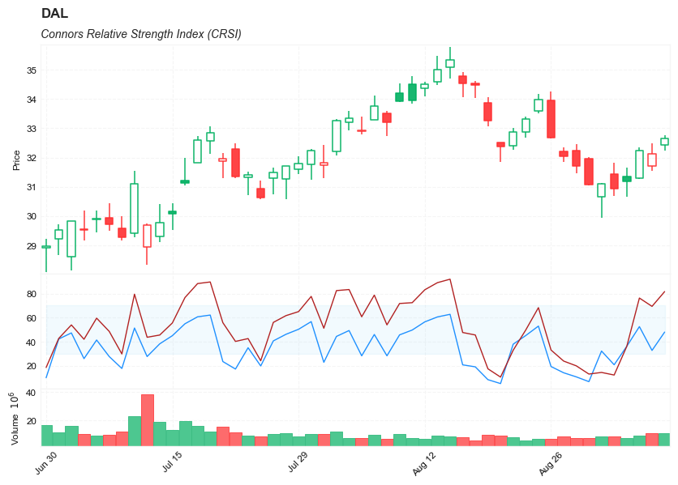

## Connors RSI (CRSI)

**References**

- [tradingview: Connors RSI (CRSI)](https://www.tradingview.com/support/solutions/43000502017-connors-rsi-crsi/)
- [traders.com: RSI Can Be Improved](http://technical.traders.com/tradersonline/display.asp?art=7175)
- [tradingview: Stochastic-Connors-RSI](https://www.tradingview.com/script/vWAPUAl9-Stochastic-Connors-RSI/)

**Definition**

- Connors RSI (CRSI) is a technical analysis indicator created by Larry Connors that is actually a composite of three separate components. 
- Connors RSI was developed by Connors Research.
- The three components; The RSI, UpDown Length, and Rate-of-Change, combine to form a momentum oscillator. Connors RSI outputs a value between 0 and 100, which is then used to identify short-term overbought and oversold conditions.


**Calculation**

---


There are three major components to Connors RSI 

- RSI = Standard RSI developed by Wilder. This is typically a short-term RSI. In this example it is a 3 Period RSI. 
- UpDown Length = The number of consecutive days that a security price has either closed up (higher than previous day) or closed down (lower than previous days). Closing up values represented in positive numbers and closing down is represented with negative numbers. If a security closes at the same price on back to back days, the UpDown Length is 0. Connors RSI then applies a short-term RSI to the UpDown Streak Value. In this example it is a 2 period RSI. 
- ROC = The Rate-of-Change. The ROC takes a user-defined look-back period and calculates a percentage of the number of values within that look back period that are below the current day price change percentage. 

The final CRSI calculation then simply finding the average value of the three components.

CRSI(3,2,100) = [ RSI(3) + RSI(UpDown Length,2) + ROC(100) ] / 3

---


**Read the indicator**

Connors RSI (CRSI) uses the above formula to generate a value between 0 and 100. This is primarily used to identify overbought and oversold levels. Connor's original definition of these levels is that a value over 90 should be considered overbought and a value under 10 should be considered oversold. On occasion, signals occur during slight corrections during a trend. For example, when the market is in an uptrend, Connors RSI might generate short term sell signals. When the market is in a downtrend, Connors RSI might generate short term buy signals.

A technical analyst should also be aware of the value of adapting or tweaking the Connor RSI. One of the issues with Connor RSI is that signals oftentimes occur early. For example, in an uptrend, a sell signal may present itself. However, the market continues to rise, thus a false signal. One potential safeguard against potential false signals would be combining the Connors RSI with additional technical analysis tools such as basic chart pattern analysis or additional indicators used to measure trend strength.

Another issue worth noting regarding the Connor RSI, is the placement of the overbought and oversold thresholds levels. For some trading instruments, the thresholds for overbought may need to be raised even higher and for oversold even lower. For example 95 and 5 respectively. These levels should generally be set after research and historical analysis. Making sure thresholds are in the proper place, should also help to cut down on false signals.


- Connors RSI is designed to define overbought and oversold levels and therefore trade signals based on those levels.
    - A bullish signal occurs when Connors RSI enters oversold territory.
    - A bearish signal occurs when Connors RSI enters overbought territory.


Connors RSI indicator is a tool that takes a well established indicator, The Relative Strength Index (RSI) and applies it to its own theories. It can be a good way to define overbought and oversold levels and identify possible trading opportunities. That being said, Connors RSI does have a tendency to produce false signals. Therefore an astute technical analyst should experiment with what parameters work best for the security being traded. Also, combining Connors RSI with additional indicators will potentially increase its efficiency.

##### Load basic packages 


```python
import pandas as pd
import numpy as np
import os
import gc
import copy
from pathlib import Path
from datetime import datetime, timedelta, time, date
```


```python
#this package is to download equity price data from yahoo finance
#the source code of this package can be found here: https://github.com/ranaroussi/yfinance/blob/main
import yfinance as yf
```


```python
pd.options.display.max_rows = 100
pd.options.display.max_columns = 100

import warnings
warnings.filterwarnings("ignore")

import pytorch_lightning as pl
random_seed=1234
pl.seed_everything(random_seed)
```

    Global seed set to 1234
    


    1234


```python
#S&P 500 (^GSPC),  Dow Jones Industrial Average (^DJI), NASDAQ Composite (^IXIC)
#Russell 2000 (^RUT), Crude Oil Nov 21 (CL=F), Gold Dec 21 (GC=F)
#Treasury Yield 10 Years (^TNX)

#benchmark_tickers = ['^GSPC', '^DJI', '^IXIC', '^RUT',  'CL=F', 'GC=F', '^TNX']

benchmark_tickers = ['^GSPC']
tickers = benchmark_tickers + ['GSK', 'NVO', 'PFE', 'DAL']
```


```python
#https://github.com/ranaroussi/yfinance/blob/main/yfinance/base.py
#     def history(self, period="1mo", interval="1d",
#                 start=None, end=None, prepost=False, actions=True,
#                 auto_adjust=True, back_adjust=False,
#                 proxy=None, rounding=False, tz=None, timeout=None, **kwargs):

dfs = {}

for ticker in tickers:
    cur_data = yf.Ticker(ticker)
    hist = cur_data.history(period="max", start='2000-01-01')
    print(datetime.now(), ticker, hist.shape, hist.index.min(), hist.index.max())
    dfs[ticker] = hist
```

    2022-09-10 23:39:47.402768 ^GSPC (5710, 7) 1999-12-31 00:00:00 2022-09-09 00:00:00
    2022-09-10 23:39:47.758161 GSK (5710, 7) 1999-12-31 00:00:00 2022-09-09 00:00:00
    2022-09-10 23:39:48.036020 NVO (5710, 7) 1999-12-31 00:00:00 2022-09-09 00:00:00
    2022-09-10 23:39:48.388309 PFE (5710, 7) 1999-12-31 00:00:00 2022-09-09 00:00:00
    2022-09-10 23:39:48.621798 DAL (3867, 7) 2007-05-03 00:00:00 2022-09-09 00:00:00
    


```python
ticker = 'DAL'
dfs[ticker].tail(5)
```


<div>
<style scoped>
    .dataframe tbody tr th:only-of-type {
        vertical-align: middle;
    }

    .dataframe tbody tr th {
        vertical-align: top;
    }

    .dataframe thead th {
        text-align: right;
    }
</style>
<table border="1" class="dataframe">
  <thead>
    <tr style="text-align: right;">
      <th></th>
      <th>Open</th>
      <th>High</th>
      <th>Low</th>
      <th>Close</th>
      <th>Volume</th>
      <th>Dividends</th>
      <th>Stock Splits</th>
    </tr>
    <tr>
      <th>Date</th>
      <th></th>
      <th></th>
      <th></th>
      <th></th>
      <th></th>
      <th></th>
      <th></th>
    </tr>
  </thead>
  <tbody>
    <tr>
      <th>2022-09-02</th>
      <td>31.440001</td>
      <td>31.830000</td>
      <td>30.700001</td>
      <td>30.940001</td>
      <td>8626500</td>
      <td>0.0</td>
      <td>0</td>
    </tr>
    <tr>
      <th>2022-09-06</th>
      <td>31.340000</td>
      <td>31.650000</td>
      <td>30.660000</td>
      <td>31.190001</td>
      <td>7630800</td>
      <td>0.0</td>
      <td>0</td>
    </tr>
    <tr>
      <th>2022-09-07</th>
      <td>31.290001</td>
      <td>32.340000</td>
      <td>31.270000</td>
      <td>32.230000</td>
      <td>9035900</td>
      <td>0.0</td>
      <td>0</td>
    </tr>
    <tr>
      <th>2022-09-08</th>
      <td>31.719999</td>
      <td>32.490002</td>
      <td>31.549999</td>
      <td>32.119999</td>
      <td>11085400</td>
      <td>0.0</td>
      <td>0</td>
    </tr>
    <tr>
      <th>2022-09-09</th>
      <td>32.430000</td>
      <td>32.759998</td>
      <td>32.240002</td>
      <td>32.660000</td>
      <td>10958900</td>
      <td>0.0</td>
      <td>0</td>
    </tr>
  </tbody>
</table>
</div>


##### Define Connors RSI (CRSI) calculation function


```python
   def cal_rsi(
        ohlc: pd.DataFrame,
        period: int = 14,
        column: str = "close",
        adjust: bool = True,
    ) -> pd.Series:


        

        ## get the price diff
        delta = ohlc[column].diff()

        ## positive gains (up) and negative gains (down) Series
        up, down = delta.copy(), delta.copy()
        up[up < 0] = 0
        down[down > 0] = 0

        # EMAs of ups and downs
        _gain = up.ewm(alpha=1.0 / period, adjust=adjust).mean()
        _loss = down.abs().ewm(alpha=1.0 / period, adjust=adjust).mean()

        RS = _gain / _loss
        return pd.Series(100 - (100 / (1 + RS)), name=f"RSI{period}")
```


```python
   def cal_crsi(
        ohlc: pd.DataFrame,
        rsi_period: int = 3, 
        updown_period: int = 2, 
        roc_period: int = 100, 
        column: str = "close",
        adjust: bool = True,
    ) -> pd.Series:

        """
        source: https://www.tradingview.com/script/iQQ4YgIY-Filtered-Connors-RSI-FCRSI/
        
        CRSI(3,2,100) = [ RSI(3) + RSI(UpDown Length,2) + ROC(100) ] / 3
        """
        
        def updown(s):
            ud = np.zeros(len(s))
            for i in range(1, len(s)):
                if s[i] > s[i-1]:
                    if ud[i-1] >= 0:
                        ud[i] = ud[i-1] + 1
                    else:
                        ud[i] = 1
                elif s[i] < s[i-1]:
                    if ud[i-1]<=0:
                        ud[i] = ud[i-1] - 1
                    else:
                        ud[i] = -1
                else:
                    ud[i] = 0
            return ud

        rsi3 = cal_rsi(ohlc, period=rsi_period, column=column, adjust=True)
        ohlc['updown'] = updown(ohlc[column])
        ud_rsi = cal_rsi(ohlc, period=updown_period, column='updown', adjust=True)
        
        roc = ohlc[column].diff() / ohlc[column].shift(1) * 100
        pct_rank = roc.rolling(window=roc_period, min_periods=roc_period).apply(lambda x: (x[:-1]<=x[-1]).sum()/roc_period)
        
        crsi = (rsi3 + ud_rsi + pct_rank)/3

        return pd.Series(crsi, name=f"CRSI")
```

##### Calculate Connors RSI (CRSI)


```python
df = dfs[ticker][['Open', 'High', 'Low', 'Close', 'Volume']]
df = df.round(2)
```


```python
cal_rsi
```


    <function __main__.cal_rsi(ohlc: pandas.core.frame.DataFrame, period: int = 14, column: str = 'close', adjust: bool = True) -> pandas.core.series.Series>


```python
cal_crsi
```


    <function __main__.cal_crsi(ohlc: pandas.core.frame.DataFrame, rsi_period: int = 3, updown_period: int = 2, roc_period: int = 100, column: str = 'close', adjust: bool = True) -> pandas.core.series.Series>


```python
df['RSI'] = cal_rsi(df, period =3, column='Close')
df['CRSI'] = cal_crsi(df, rsi_period=3, updown_period=2, roc_period=100, column="Close")
```


```python
display(df.head(5))
display(df.tail(5))
```


<div>
<style scoped>
    .dataframe tbody tr th:only-of-type {
        vertical-align: middle;
    }

    .dataframe tbody tr th {
        vertical-align: top;
    }

    .dataframe thead th {
        text-align: right;
    }
</style>
<table border="1" class="dataframe">
  <thead>
    <tr style="text-align: right;">
      <th></th>
      <th>Open</th>
      <th>High</th>
      <th>Low</th>
      <th>Close</th>
      <th>Volume</th>
      <th>RSI</th>
      <th>updown</th>
      <th>CRSI</th>
    </tr>
    <tr>
      <th>Date</th>
      <th></th>
      <th></th>
      <th></th>
      <th></th>
      <th></th>
      <th></th>
      <th></th>
      <th></th>
    </tr>
  </thead>
  <tbody>
    <tr>
      <th>2007-05-03</th>
      <td>19.32</td>
      <td>19.50</td>
      <td>18.25</td>
      <td>18.40</td>
      <td>8052800</td>
      <td>NaN</td>
      <td>0.0</td>
      <td>NaN</td>
    </tr>
    <tr>
      <th>2007-05-04</th>
      <td>18.88</td>
      <td>18.96</td>
      <td>18.39</td>
      <td>18.64</td>
      <td>5437300</td>
      <td>100.000000</td>
      <td>1.0</td>
      <td>NaN</td>
    </tr>
    <tr>
      <th>2007-05-07</th>
      <td>18.83</td>
      <td>18.91</td>
      <td>17.94</td>
      <td>18.08</td>
      <td>2646300</td>
      <td>22.222222</td>
      <td>-1.0</td>
      <td>NaN</td>
    </tr>
    <tr>
      <th>2007-05-08</th>
      <td>17.76</td>
      <td>17.76</td>
      <td>17.14</td>
      <td>17.44</td>
      <td>4166100</td>
      <td>9.523810</td>
      <td>-2.0</td>
      <td>NaN</td>
    </tr>
    <tr>
      <th>2007-05-09</th>
      <td>17.54</td>
      <td>17.94</td>
      <td>17.44</td>
      <td>17.58</td>
      <td>7541100</td>
      <td>23.809524</td>
      <td>1.0</td>
      <td>NaN</td>
    </tr>
  </tbody>
</table>
</div>


<div>
<style scoped>
    .dataframe tbody tr th:only-of-type {
        vertical-align: middle;
    }

    .dataframe tbody tr th {
        vertical-align: top;
    }

    .dataframe thead th {
        text-align: right;
    }
</style>
<table border="1" class="dataframe">
  <thead>
    <tr style="text-align: right;">
      <th></th>
      <th>Open</th>
      <th>High</th>
      <th>Low</th>
      <th>Close</th>
      <th>Volume</th>
      <th>RSI</th>
      <th>updown</th>
      <th>CRSI</th>
    </tr>
    <tr>
      <th>Date</th>
      <th></th>
      <th></th>
      <th></th>
      <th></th>
      <th></th>
      <th></th>
      <th></th>
      <th></th>
    </tr>
  </thead>
  <tbody>
    <tr>
      <th>2022-09-02</th>
      <td>31.44</td>
      <td>31.83</td>
      <td>30.70</td>
      <td>30.94</td>
      <td>8626500</td>
      <td>12.313048</td>
      <td>-1.0</td>
      <td>20.842173</td>
    </tr>
    <tr>
      <th>2022-09-06</th>
      <td>31.34</td>
      <td>31.65</td>
      <td>30.66</td>
      <td>31.19</td>
      <td>7630800</td>
      <td>36.105527</td>
      <td>1.0</td>
      <td>36.171756</td>
    </tr>
    <tr>
      <th>2022-09-07</th>
      <td>31.29</td>
      <td>32.34</td>
      <td>31.27</td>
      <td>32.23</td>
      <td>9035900</td>
      <td>76.274979</td>
      <td>2.0</td>
      <td>52.527472</td>
    </tr>
    <tr>
      <th>2022-09-08</th>
      <td>31.72</td>
      <td>32.49</td>
      <td>31.55</td>
      <td>32.12</td>
      <td>11085400</td>
      <td>69.357083</td>
      <td>-1.0</td>
      <td>32.749111</td>
    </tr>
    <tr>
      <th>2022-09-09</th>
      <td>32.43</td>
      <td>32.76</td>
      <td>32.24</td>
      <td>32.66</td>
      <td>10958900</td>
      <td>81.627385</td>
      <td>1.0</td>
      <td>47.978513</td>
    </tr>
  </tbody>
</table>
</div>


```python
df[['CRSI', 'RSI']].hist(bins=50)
```


    array([[<AxesSubplot:title={'center':'CRSI'}>,
            <AxesSubplot:title={'center':'RSI'}>]], dtype=object)


    

    


```python
#https://github.com/matplotlib/mplfinance
#this package help visualize financial data
import mplfinance as mpf
import matplotlib.colors as mcolors

# all_colors = list(mcolors.CSS4_COLORS.keys())#"CSS Colors"
# all_colors = list(mcolors.TABLEAU_COLORS.keys()) # "Tableau Palette",
all_colors = ['dodgerblue', 'firebrick','limegreen','skyblue','lightgreen',  'navy','yellow','plum',  'yellowgreen']
# all_colors = list(mcolors.BASE_COLORS.keys()) #"Base Colors",


#https://github.com/matplotlib/mplfinance/issues/181#issuecomment-667252575
#list of colors: https://matplotlib.org/stable/gallery/color/named_colors.html
#https://github.com/matplotlib/mplfinance/blob/master/examples/styles.ipynb

def make_3panels2(main_data, mid_panel, chart_type='candle', names=None, 
                  figratio=(14,9), fill_weights = (0, 0)):
    """
    main chart type: default is candle. alternatives: ohlc, line

    example:
    start = 200

    names = {'main_title': 'MAMA: MESA Adaptive Moving Average', 
             'sub_tile': 'S&P 500 (^GSPC)', 'y_tiles': ['price', 'Volume [$10^{6}$]']}


    make_candle(df.iloc[-start:, :5], df.iloc[-start:][['MAMA', 'FAMA']], names = names)
    
    """

    style = mpf.make_mpf_style(base_mpf_style='yahoo',  #charles
                               base_mpl_style = 'seaborn-whitegrid',
#                                marketcolors=mpf.make_marketcolors(up="r", down="#0000CC",inherit=True),
                               gridcolor="whitesmoke", 
                               gridstyle="--", #or None, or - for solid
                               gridaxis="both", 
                               edgecolor = 'whitesmoke',
                               facecolor = 'white', #background color within the graph edge
                               figcolor = 'white', #background color outside of the graph edge
                               y_on_right = False,
                               rc =  {'legend.fontsize': 'small',#or number
                                      #'figure.figsize': (14, 9),
                                     'axes.labelsize': 'small',
                                     'axes.titlesize':'small',
                                     'xtick.labelsize':'small',#'x-small', 'small','medium','large'
                                     'ytick.labelsize':'small'
                                     }, 
                              )   

    if (chart_type is None) or (chart_type not in ['ohlc', 'line', 'candle', 'hollow_and_filled']):
        chart_type = 'candle'
    len_dict = {'candle':2, 'ohlc':3, 'line':1, 'hollow_and_filled':2}    
        
    kwargs = dict(type=chart_type, figratio=figratio, volume=True, volume_panel=2, 
                  panel_ratios=(4,2,1), tight_layout=True, style=style, returnfig=True)
    
    if names is None:
        names = {'main_title': '', 'sub_tile': ''}
    


    added_plots = { }
  
    fb_bbands2_ = dict(y1=fill_weights[0]*np.ones(mid_panel.shape[0]),
                      y2=fill_weights[1]*np.ones(mid_panel.shape[0]),color="lightskyblue",alpha=0.1,interpolate=True)
    fb_bbands2_['panel'] = 1

    fb_bbands= [fb_bbands2_]
    
    
    i = 0
    for name_, data_ in mid_panel.iteritems():
        added_plots[name_] = mpf.make_addplot(data_, panel=1, width=1, color=all_colors[i], secondary_y=False)
        i = i + 1
    

    fig, axes = mpf.plot(main_data,  **kwargs,
                         addplot=list(added_plots.values()), 
                         fill_between=fb_bbands)
    # add a new suptitle
    fig.suptitle(names['main_title'], y=1.05, fontsize=12, x=0.1285)

    axes[0].set_title(names['sub_tile'], fontsize=10, style='italic',  loc='left')
#     axes[2].set_ylabel('WAVEPM10')

#     axes[0].set_ylabel(names['y_tiles'][0])
#     axes[2].set_ylabel(names['y_tiles'][1])
    return fig, axes
   
```


```python

start = -50
end = df.shape[0]

names = {'main_title': f'{ticker}', 
         'sub_tile': 'Connors Relative Strength Index (CRSI)'}


aa_, bb_ = make_3panels2(df.iloc[start:end][['Open', 'High', 'Low', 'Close', 'Volume']], 
             df.iloc[start:end][['CRSI', 'RSI']], 
             chart_type='hollow_and_filled',names = names, 
                         fill_weights = (30, 70))
```


    

    

