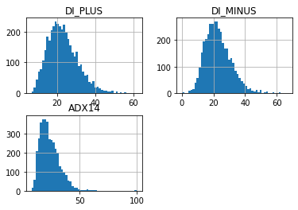
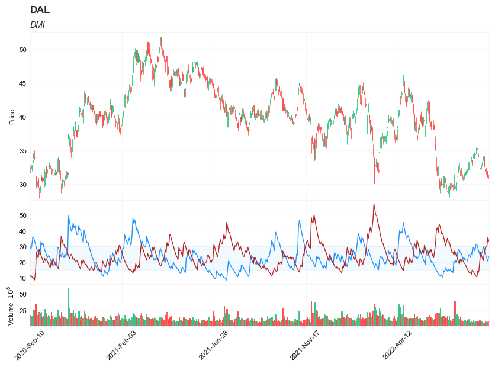

## Average Directional Index (ADX)

**References**

- [tradingview: Average Directional Index (ADX)](https://www.tradingview.com/support/solutions/43000589099-average-directional-index-adx/)
- [fidelity: Average Directional Index (ADX)](https://www.fidelity.com/learning-center/trading-investing/technical-analysis/technical-indicator-guide/adx)
-[tradingview: Rob Booker - ADX Breakout](https://www.tradingview.com/support/solutions/43000591333-rob-booker-adx-breakout/)

- [fidelity: Directional Movement (DMI)](https://www.fidelity.com/learning-center/trading-investing/technical-analysis/technical-indicator-guide/DMI)
- [tradingview: Directional Movement (DMI)](https://www.tradingview.com/support/solutions/43000502250-directional-movement-dmi/)


##### Load basic packages 


```python
import pandas as pd
import numpy as np
import os
import gc
import copy
from pathlib import Path
from datetime import datetime, timedelta, time, date
```


```python
#this package is to download equity price data from yahoo finance
#the source code of this package can be found here: https://github.com/ranaroussi/yfinance/blob/main
import yfinance as yf
```


```python
pd.options.display.max_rows = 100
pd.options.display.max_columns = 100

import warnings
warnings.filterwarnings("ignore")

import pytorch_lightning as pl
random_seed=1234
pl.seed_everything(random_seed)
```

    Global seed set to 1234
    


    1234


```python
#S&P 500 (^GSPC),  Dow Jones Industrial Average (^DJI), NASDAQ Composite (^IXIC)
#Russell 2000 (^RUT), Crude Oil Nov 21 (CL=F), Gold Dec 21 (GC=F)
#Treasury Yield 10 Years (^TNX)

#benchmark_tickers = ['^GSPC', '^DJI', '^IXIC', '^RUT',  'CL=F', 'GC=F', '^TNX']

benchmark_tickers = ['^GSPC']
tickers = benchmark_tickers + ['GSK', 'NVO', 'PFE', 'DAL']
```


```python
#https://github.com/ranaroussi/yfinance/blob/main/yfinance/base.py
#     def history(self, period="1mo", interval="1d",
#                 start=None, end=None, prepost=False, actions=True,
#                 auto_adjust=True, back_adjust=False,
#                 proxy=None, rounding=False, tz=None, timeout=None, **kwargs):

dfs = {}

for ticker in tickers:
    cur_data = yf.Ticker(ticker)
    hist = cur_data.history(period="max", start='2000-01-01')
    print(datetime.now(), ticker, hist.shape, hist.index.min(), hist.index.max())
    dfs[ticker] = hist
```

    2022-09-05 18:22:41.766268 ^GSPC (5706, 7) 1999-12-31 00:00:00 2022-09-02 00:00:00
    2022-09-05 18:22:42.143261 GSK (5706, 7) 1999-12-31 00:00:00 2022-09-02 00:00:00
    2022-09-05 18:22:42.408167 NVO (5706, 7) 1999-12-31 00:00:00 2022-09-02 00:00:00
    2022-09-05 18:22:42.813229 PFE (5706, 7) 1999-12-31 00:00:00 2022-09-02 00:00:00
    2022-09-05 18:22:43.047960 DAL (3863, 7) 2007-05-03 00:00:00 2022-09-02 00:00:00
    


```python
ticker = 'DAL'
dfs[ticker].tail(5)
```


<div>
<style scoped>
    .dataframe tbody tr th:only-of-type {
        vertical-align: middle;
    }

    .dataframe tbody tr th {
        vertical-align: top;
    }

    .dataframe thead th {
        text-align: right;
    }
</style>
<table border="1" class="dataframe">
  <thead>
    <tr style="text-align: right;">
      <th></th>
      <th>Open</th>
      <th>High</th>
      <th>Low</th>
      <th>Close</th>
      <th>Volume</th>
      <th>Dividends</th>
      <th>Stock Splits</th>
    </tr>
    <tr>
      <th>Date</th>
      <th></th>
      <th></th>
      <th></th>
      <th></th>
      <th></th>
      <th></th>
      <th></th>
    </tr>
  </thead>
  <tbody>
    <tr>
      <th>2022-08-29</th>
      <td>32.200001</td>
      <td>32.349998</td>
      <td>31.850000</td>
      <td>32.029999</td>
      <td>8758400</td>
      <td>0.0</td>
      <td>0</td>
    </tr>
    <tr>
      <th>2022-08-30</th>
      <td>32.250000</td>
      <td>32.450001</td>
      <td>31.469999</td>
      <td>31.719999</td>
      <td>7506400</td>
      <td>0.0</td>
      <td>0</td>
    </tr>
    <tr>
      <th>2022-08-31</th>
      <td>31.969999</td>
      <td>32.020000</td>
      <td>31.059999</td>
      <td>31.070000</td>
      <td>7450000</td>
      <td>0.0</td>
      <td>0</td>
    </tr>
    <tr>
      <th>2022-09-01</th>
      <td>30.650000</td>
      <td>31.139999</td>
      <td>29.940001</td>
      <td>31.090000</td>
      <td>8572700</td>
      <td>0.0</td>
      <td>0</td>
    </tr>
    <tr>
      <th>2022-09-02</th>
      <td>31.440001</td>
      <td>31.830000</td>
      <td>30.700001</td>
      <td>30.940001</td>
      <td>8626500</td>
      <td>0.0</td>
      <td>0</td>
    </tr>
  </tbody>
</table>
</div>


##### Define ADX calculation function


```python

#https://github.com/peerchemist/finta/blob/af01fa594995de78f5ada5c336e61cd87c46b151/finta/finta.py
def cal_tr(ohlc: pd.DataFrame) -> pd.Series:
    """True Range is the maximum of three price ranges.
    Most recent period's high minus the most recent period's low.
    Absolute value of the most recent period's high minus the previous close.
    Absolute value of the most recent period's low minus the previous close."""

    TR1 = pd.Series(ohlc["high"] - ohlc["low"]).abs()  # True Range = High less Low

    TR2 = pd.Series(
        ohlc["high"] - ohlc["close"].shift()
    ).abs()  # True Range = High less Previous Close

    TR3 = pd.Series(
        ohlc["close"].shift() - ohlc["low"]
    ).abs()  # True Range = Previous Close less Low

    _TR = pd.concat([TR1, TR2, TR3], axis=1)

    _TR["TR"] = _TR.max(axis=1)

    return pd.Series(_TR["TR"], name="TR")


def cal_atr(ohlc: pd.DataFrame, period: int = 14) -> pd.Series:
    """Average True Range is moving average of True Range."""

    TR = cal_tr(ohlc)
    return pd.Series(
        TR.rolling(center=False, window=period).mean(),
        name=f"ATR{period}",
    )
    

def cal_dmi(ohlc: pd.DataFrame, period: int = 14, adjust: bool = True) -> pd.DataFrame:
    """
    The directional movement indicator (also known as the directional movement index - DMI) is a valuable tool
     for assessing price direction and strength. This indicator was created in 1978 by J. Welles Wilder, who also created the popular
     relative strength index. DMI tells you when to be long or short.
     It is especially useful for trend trading strategies because it differentiates between strong and weak trends,
     allowing the trader to enter only the strongest trends.
    source: https://www.tradingview.com/wiki/Directional_Movement_(DMI)#CALCULATION

    :period: Specifies the number of Periods used for DMI calculation
    """
    ohlc = ohlc.copy(deep=True)
    ohlc.columns = [c.lower() for c in ohlc.columns]
    
    ohlc["up_move"] = ohlc["high"].diff()
    ohlc["down_move"] = -ohlc["low"].diff()
    
    atr = cal_atr(ohlc, period)

    # positive Dmi
    def _dmp(row):
        if row["up_move"] > row["down_move"] and row["up_move"] > 0:
            return row["up_move"]
        else:
            return 0

    # negative Dmi
    def _dmn(row):
        if row["down_move"] > row["up_move"] and row["down_move"] > 0:
            return row["down_move"]
        else:
            return 0

    ohlc["plus"] = ohlc.apply(_dmp, axis=1)
    ohlc["minus"] = ohlc.apply(_dmn, axis=1)

    diplus = pd.Series(
        100
        * (ohlc["plus"] / atr)
        .ewm(alpha=1 / period, adjust=adjust)
        .mean(),
        name="DI_PLUS",
    )
    diminus = pd.Series(
        100
        * (ohlc["minus"] / atr)
        .ewm(alpha=1 / period, adjust=adjust)
        .mean(),
        name="DI_MINUS",
    )

    return pd.concat([diplus, diminus], axis=1)


def cal_adx(ohlc: pd.DataFrame, period: int = 14, adjust: bool = True) -> pd.Series:
    """
    The A.D.X. is 100 * smoothed moving average of absolute value (DMI +/-) divided by (DMI+ + DMI-). ADX does not indicate trend direction or momentum,
    only trend strength. Generally, A.D.X. readings below 20 indicate trend weakness,
    and readings above 40 indicate trend strength. An extremely strong trend is indicated by readings above 50
    
    """
    ohlc = ohlc.copy(deep=True)
    ohlc.columns = [c.lower() for c in ohlc.columns]
    
    dmi = cal_dmi(ohlc, period)
    return pd.Series(
        100
        * (abs(dmi["DI_PLUS"] - dmi["DI_MINUS"]) / (dmi["DI_PLUS"] + dmi["DI_MINUS"]))
        .ewm(alpha=1 / period, adjust=adjust)
        .mean(),
        name=f"ADX{period}",
    )
```

##### Calculate ADX


```python
df = dfs[ticker][['Open', 'High', 'Low', 'Close', 'Volume']]
```


```python
df = df.round(2)
```


```python
cal_adx, cal_dmi
```


    (<function __main__.cal_adx(ohlc: pandas.core.frame.DataFrame, period: int = 14, adjust: bool = True) -> pandas.core.series.Series>,
     <function __main__.cal_dmi(ohlc: pandas.core.frame.DataFrame, period: int = 14, adjust: bool = True) -> pandas.core.frame.DataFrame>)


```python
df_ta = cal_dmi(df, period=14)
df = df.merge(df_ta, left_index = True, right_index = True, how='inner' )

df_ta = cal_adx(df, period=14)
df = df.merge(df_ta, left_index = True, right_index = True, how='inner' )

del df_ta
gc.collect()
```


    38


```python
display(df.head(5))
display(df.tail(5))
```


<div>
<style scoped>
    .dataframe tbody tr th:only-of-type {
        vertical-align: middle;
    }

    .dataframe tbody tr th {
        vertical-align: top;
    }

    .dataframe thead th {
        text-align: right;
    }
</style>
<table border="1" class="dataframe">
  <thead>
    <tr style="text-align: right;">
      <th></th>
      <th>Open</th>
      <th>High</th>
      <th>Low</th>
      <th>Close</th>
      <th>Volume</th>
      <th>DI_PLUS</th>
      <th>DI_MINUS</th>
      <th>ADX14</th>
    </tr>
    <tr>
      <th>Date</th>
      <th></th>
      <th></th>
      <th></th>
      <th></th>
      <th></th>
      <th></th>
      <th></th>
      <th></th>
    </tr>
  </thead>
  <tbody>
    <tr>
      <th>2007-05-03</th>
      <td>19.32</td>
      <td>19.50</td>
      <td>18.25</td>
      <td>18.40</td>
      <td>8052800</td>
      <td>NaN</td>
      <td>NaN</td>
      <td>NaN</td>
    </tr>
    <tr>
      <th>2007-05-04</th>
      <td>18.88</td>
      <td>18.96</td>
      <td>18.39</td>
      <td>18.64</td>
      <td>5437300</td>
      <td>NaN</td>
      <td>NaN</td>
      <td>NaN</td>
    </tr>
    <tr>
      <th>2007-05-07</th>
      <td>18.83</td>
      <td>18.91</td>
      <td>17.94</td>
      <td>18.08</td>
      <td>2646300</td>
      <td>NaN</td>
      <td>NaN</td>
      <td>NaN</td>
    </tr>
    <tr>
      <th>2007-05-08</th>
      <td>17.76</td>
      <td>17.76</td>
      <td>17.14</td>
      <td>17.44</td>
      <td>4166100</td>
      <td>NaN</td>
      <td>NaN</td>
      <td>NaN</td>
    </tr>
    <tr>
      <th>2007-05-09</th>
      <td>17.54</td>
      <td>17.94</td>
      <td>17.44</td>
      <td>17.58</td>
      <td>7541100</td>
      <td>NaN</td>
      <td>NaN</td>
      <td>NaN</td>
    </tr>
  </tbody>
</table>
</div>


<div>
<style scoped>
    .dataframe tbody tr th:only-of-type {
        vertical-align: middle;
    }

    .dataframe tbody tr th {
        vertical-align: top;
    }

    .dataframe thead th {
        text-align: right;
    }
</style>
<table border="1" class="dataframe">
  <thead>
    <tr style="text-align: right;">
      <th></th>
      <th>Open</th>
      <th>High</th>
      <th>Low</th>
      <th>Close</th>
      <th>Volume</th>
      <th>DI_PLUS</th>
      <th>DI_MINUS</th>
      <th>ADX14</th>
    </tr>
    <tr>
      <th>Date</th>
      <th></th>
      <th></th>
      <th></th>
      <th></th>
      <th></th>
      <th></th>
      <th></th>
      <th></th>
    </tr>
  </thead>
  <tbody>
    <tr>
      <th>2022-08-29</th>
      <td>32.20</td>
      <td>32.35</td>
      <td>31.85</td>
      <td>32.03</td>
      <td>8758400</td>
      <td>25.707542</td>
      <td>29.134635</td>
      <td>20.193452</td>
    </tr>
    <tr>
      <th>2022-08-30</th>
      <td>32.25</td>
      <td>32.45</td>
      <td>31.47</td>
      <td>31.72</td>
      <td>7506400</td>
      <td>23.871289</td>
      <td>29.746715</td>
      <td>19.533772</td>
    </tr>
    <tr>
      <th>2022-08-31</th>
      <td>31.97</td>
      <td>32.02</td>
      <td>31.06</td>
      <td>31.07</td>
      <td>7450000</td>
      <td>22.166197</td>
      <td>30.523578</td>
      <td>19.271466</td>
    </tr>
    <tr>
      <th>2022-09-01</th>
      <td>30.65</td>
      <td>31.14</td>
      <td>29.94</td>
      <td>31.09</td>
      <td>8572700</td>
      <td>20.582897</td>
      <td>35.967556</td>
      <td>19.838161</td>
    </tr>
    <tr>
      <th>2022-09-02</th>
      <td>31.44</td>
      <td>31.83</td>
      <td>30.70</td>
      <td>30.94</td>
      <td>8626500</td>
      <td>23.768561</td>
      <td>33.398445</td>
      <td>19.624376</td>
    </tr>
  </tbody>
</table>
</div>


```python
df[['DI_PLUS', 'DI_MINUS', 'ADX14']].hist(bins=50)
```


    array([[<AxesSubplot:title={'center':'DI_PLUS'}>,
            <AxesSubplot:title={'center':'DI_MINUS'}>],
           [<AxesSubplot:title={'center':'ADX14'}>, <AxesSubplot:>]],
          dtype=object)


    

    


```python
#https://github.com/matplotlib/mplfinance
#this package help visualize financial data
import mplfinance as mpf
import matplotlib.colors as mcolors

# all_colors = list(mcolors.CSS4_COLORS.keys())#"CSS Colors"
# all_colors = list(mcolors.TABLEAU_COLORS.keys()) # "Tableau Palette",
all_colors = ['dodgerblue', 'firebrick','limegreen','skyblue','lightgreen',  'navy','yellow','plum',  'yellowgreen']
# all_colors = list(mcolors.BASE_COLORS.keys()) #"Base Colors",


#https://github.com/matplotlib/mplfinance/issues/181#issuecomment-667252575
#list of colors: https://matplotlib.org/stable/gallery/color/named_colors.html
#https://github.com/matplotlib/mplfinance/blob/master/examples/styles.ipynb

def make_3panels2(main_data, mid_panel, chart_type='candle', names=None, 
                  figratio=(14,9), fill_weights = (0, 0)):
    """
    main chart type: default is candle. alternatives: ohlc, line

    example:
    start = 200

    names = {'main_title': 'MAMA: MESA Adaptive Moving Average', 
             'sub_tile': 'S&P 500 (^GSPC)', 'y_tiles': ['price', 'Volume [$10^{6}$]']}


    make_candle(df.iloc[-start:, :5], df.iloc[-start:][['MAMA', 'FAMA']], names = names)
    
    """

    style = mpf.make_mpf_style(base_mpf_style='yahoo',  #charles
                               base_mpl_style = 'seaborn-whitegrid',
#                                marketcolors=mpf.make_marketcolors(up="r", down="#0000CC",inherit=True),
                               gridcolor="whitesmoke", 
                               gridstyle="--", #or None, or - for solid
                               gridaxis="both", 
                               edgecolor = 'whitesmoke',
                               facecolor = 'white', #background color within the graph edge
                               figcolor = 'white', #background color outside of the graph edge
                               y_on_right = False,
                               rc =  {'legend.fontsize': 'small',#or number
                                      #'figure.figsize': (14, 9),
                                     'axes.labelsize': 'small',
                                     'axes.titlesize':'small',
                                     'xtick.labelsize':'small',#'x-small', 'small','medium','large'
                                     'ytick.labelsize':'small'
                                     }, 
                              )   

    if (chart_type is None) or (chart_type not in ['ohlc', 'line', 'candle', 'hollow_and_filled']):
        chart_type = 'candle'
    len_dict = {'candle':2, 'ohlc':3, 'line':1, 'hollow_and_filled':2}    
        
    kwargs = dict(type=chart_type, figratio=figratio, volume=True, volume_panel=2, 
                  panel_ratios=(4,2,1), tight_layout=True, style=style, returnfig=True)
    
    if names is None:
        names = {'main_title': '', 'sub_tile': ''}
    


    added_plots = { }
  
    fb_bbands2_ = dict(y1=fill_weights[0]*np.ones(mid_panel.shape[0]),
                      y2=fill_weights[1]*np.ones(mid_panel.shape[0]),color="lightskyblue",alpha=0.1,interpolate=True)
    fb_bbands2_['panel'] = 1

    fb_bbands= [fb_bbands2_]
    
    
    i = 0
    for name_, data_ in mid_panel.iteritems():
        added_plots[name_] = mpf.make_addplot(data_, panel=1, width=1, color=all_colors[i], secondary_y=False)
        i = i + 1
    

    fig, axes = mpf.plot(main_data,  **kwargs,
                         addplot=list(added_plots.values()), 
                         fill_between=fb_bbands)
    # add a new suptitle
    fig.suptitle(names['main_title'], y=1.05, fontsize=12, x=0.1285)

    axes[0].set_title(names['sub_tile'], fontsize=10, style='italic',  loc='left')
#     axes[2].set_ylabel('WAVEPM10')

#     axes[0].set_ylabel(names['y_tiles'][0])
#     axes[2].set_ylabel(names['y_tiles'][1])
    return fig, axes
   
```


```python

start = -500
end = df.shape[0]

names = {'main_title': f'{ticker}', 
         'sub_tile': 'DMI - ADX'}


aa_, bb_ = make_3panels2(df.iloc[start:end][['Open', 'High', 'Low', 'Close', 'Volume']], 
             df.iloc[start:end][['DI_PLUS', 'DI_MINUS', 'ADX14']], 
             chart_type='hollow_and_filled',names = names, 
                         fill_weights = (15, 30))
```


    

    


```python

start = -500
end = df.shape[0]

names = {'main_title': f'{ticker}', 
         'sub_tile': 'DMI'}


aa_, bb_ = make_3panels2(df.iloc[start:end][['Open', 'High', 'Low', 'Close', 'Volume']], 
             df.iloc[start:end][['DI_PLUS', 'DI_MINUS']], 
             chart_type='hollow_and_filled',names = names, 
                         fill_weights = (15, 30))
```


    

    


```python

start = -500
end = df.shape[0]

names = {'main_title': f'{ticker}', 
         'sub_tile': 'ADX'}


aa_, bb_ = make_3panels2(df.iloc[start:end][['Open', 'High', 'Low', 'Close', 'Volume']], 
             df.iloc[start:end][['ADX14']], 
             chart_type='hollow_and_filled',names = names, 
                         fill_weights = (15, 30))
```


    

    

