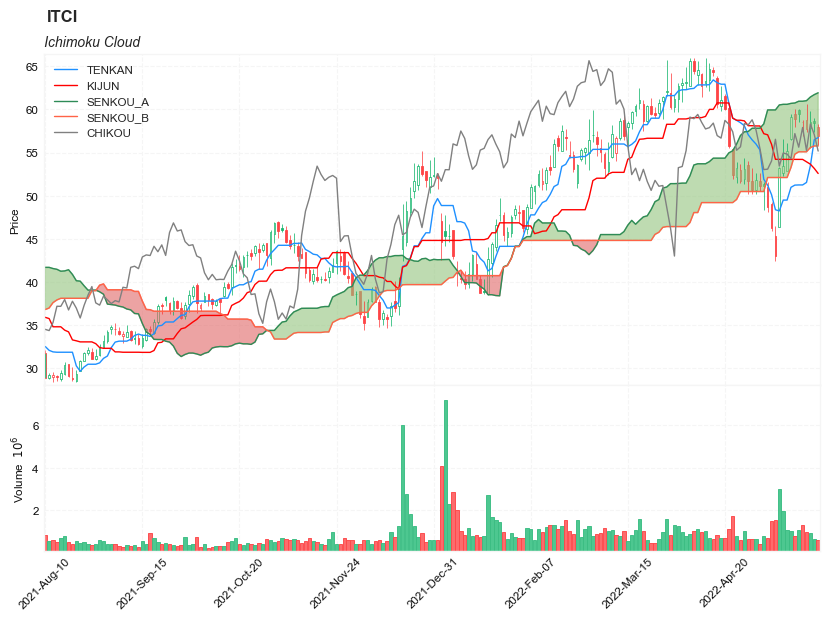

## Ichimoku Cloud

**References**

- [fidelity: Ichimoku Cloud](https://www.fidelity.com/learning-center/trading-investing/technical-analysis/technical-indicator-guide/Ichimoku-Cloud)
- [tradingview: Ichimoku Cloud](https://www.tradingview.com/support/solutions/43000589152-ichimoku-cloud/)
- [stockcharts: Ichimoku Cloud](https://school.stockcharts.com/doku.php?id=trading_strategies:ichimoku_cloud)
- [stockcharts: Ichimoku Cloud](https://school.stockcharts.com/doku.php?id=trading_strategies:ichimoku_cloud)
- [stockcharts: Ichimoku Cloud](https://school.stockcharts.com/doku.php?id=technical_indicators:ichimoku_cloud)
- [stockcharts: Ichimoku Cloud](https://stockcharts.com/h-sc/ui)

**Definition**


The Ichimoku Cloud, also called Ichimoku Kinko Hyo, is a popular and flexible indicator that displays support and resistance, momentum and trend direction for a security. It provides a clearer picture of price action at a glance. It can identify the direction of a trend, gauge momentum and signal trading opportunities based on line crossovers and where price is relative to these lines. These signals help traders to find the most optimal entry and exit points. 

TenkanSen and KijunSen are similar to moving averages and analyzed in relationship to one another. When the shorter term indicator, TenkanSen, rises above the longer term indicator, KijunSen, the securities trend is typically positive. When TenkanSen falls below KijunSen, the securities trend is typically negative. TenkanSen and KijunSen as a group are then analyzed in relationship to the Cloud, which is composed of the area between Senkou A and Senkou B.

In the late 1960s, Goichi Hosada introduced the Ichimoku Cloud. It took several years for its adoption and understanding to take off, but today it is commonly known and used as an indicator in the field of technical analysis.


**Calculation**


---


---

- PH = Period high
- PL = Period low
- CL = Conversion line


The Ichimoku Cloud can be calculated in several different ways. It depends on your timeframe, needs, and expertise in technical analysis. 

- `Tenkan-sen (Conversion Line): (9-period high + 9-period low)/2`
    - On a daily chart, this line is the midpoint of the 9-day high-low range, which is almost two weeks.

- `Kijun-sen (Base Line): (26-period high + 26-period low)/2`
    - On a daily chart, this line is the midpoint of the 26-day high-low range, which is almost one month.

- `Senkou Span A (Leading Span A): (Conversion Line + Base Line)/2` (Senkou A is shifted forward 26 bars) 
    - This is the midpoint between the Conversion Line and the Base Line. The Leading Span A forms one of the two Cloud boundaries. It is referred to as “Leading” because it is **plotted 26 periods in the future and forms the faster Cloud boundary**.

- `Senkou Span B (Leading Span B): (52-period high + 52-period low)/2` (Senkou B is shifted forward 26 bars)
    - On the daily chart, this line is the midpoint of the 52-day high-low range, which is a little less than 3 months. The default calculation setting is 52 periods, but it can be adjusted. This value is **plotted 26 periods in the future and forms the slower Cloud boundary**.

- `Chiku Span (Lagging Span): Price Close shifted back 26 bars `
    - In terms of the lagging span, go ahead and plot the closing price 26 periods in the past on your chart. 


**The differences between Span A and Span B will be visible in a different color, thus initiating the “cloud” effect:**

- the cloud is green when Leading Span A is above Leading Span B 
- the cloud is red when Leading Span B is above Leading Span A


**Read the indicator**

- How this indicator works
    - When TenkanSen and KijunSen are decidedly above the Cloud, the issue's trend is positive.
    - When TenkanSen and KijunSen are decidedly below the Cloud, the issue's trend is negative.

- Using the Cloud to determine trend:
    - When prices are above the cloud, the trend is up. When prices are below the cloud, the trend is down.
    - When Sendou A is rising and above Senkou B, the uptrend is strengthening. When Senkou A is falling and below Senkou B, the downtrend is strengthening.
    - A buy signal is reinforced when the Tenkan Sen crosses above the Kijun Sen while the Tenkan Sen, Kijun Sen, and price are all above the cloud.
    - A sell signal is reinforced when the TenKan Sen crosses below the Kijun Sen while the Tenkan Sen, Kijun Sen, and price are all below the cloud.


- Price below the cloud indicates a downward trend, whereas price above the cloud indicates an uptrend. These trend signals can strengthen if both the cloud and the price are moving in the same direction. Similarly, the signals can weaken if the cloud is moving in the opposite direction.
- Trends are high when price is above the cloud, weak when price is below the cloud, or transitioning when price is seen inside the cloud.

As was mentioned in the Calculation section above, when Leading Span A falls below Leading Span B, we can confirm a downtrend. The cloud, in this case, displays a red hue. When Leading Span A is above Leading Span B, we can confirm an uptrend. The cloud, in this case, displays a green hue.

The Ichimoku cloud can be used with other technical indicators in order to better assess risk. By looking at larger trends, with the help of multiple indicators, traders are able to see how smaller trends can fit within the general market picture as a whole.

Limitations


With all of the lines and cloud shading and data points, the chart can look a little crowded and stuffy. In order to work through this, there’s software that can hide these lines so the chart looks cleaner for traders and all the information you’d like to see is at the forefront of the chart. At TradingView, we have special features available for all our users. Anyone using our platform can pick which lines and backgrounds they’d like shown and can also customize the color, line thickness, and opacity with a simple click.

##### Load basic packages 


```python
import pandas as pd
import numpy as np
import os
import gc
import copy
from pathlib import Path
from datetime import datetime, timedelta, time, date
```


```python
#this package is to download equity price data from yahoo finance
#the source code of this package can be found here: https://github.com/ranaroussi/yfinance/blob/main
import yfinance as yf
```


```python
pd.options.display.max_rows = 100
pd.options.display.max_columns = 100

import warnings
warnings.filterwarnings("ignore")

import pytorch_lightning as pl
random_seed=1234
pl.seed_everything(random_seed)
```

    Global seed set to 1234
    


    1234


```python
#S&P 500 (^GSPC),  Dow Jones Industrial Average (^DJI), NASDAQ Composite (^IXIC)
#Russell 2000 (^RUT), Crude Oil Nov 21 (CL=F), Gold Dec 21 (GC=F)
#Treasury Yield 10 Years (^TNX)

#benchmark_tickers = ['^GSPC', '^DJI', '^IXIC', '^RUT',  'CL=F', 'GC=F', '^TNX']

benchmark_tickers = ['^GSPC']
tickers = benchmark_tickers + ['GSK', 'NVO', 'ITCI']
```


```python
#https://github.com/ranaroussi/yfinance/blob/main/yfinance/base.py
#     def history(self, period="1mo", interval="1d",
#                 start=None, end=None, prepost=False, actions=True,
#                 auto_adjust=True, back_adjust=False,
#                 proxy=None, rounding=False, tz=None, timeout=None, **kwargs):

dfs = {}

for ticker in tickers:
    cur_data = yf.Ticker(ticker)
    hist = cur_data.history(period="max", start='2000-01-01')
    print(datetime.now(), ticker, hist.shape, hist.index.min(), hist.index.max())
    dfs[ticker] = hist
```

    2022-09-10 21:55:38.020450 ^GSPC (5710, 7) 1999-12-31 00:00:00 2022-09-09 00:00:00
    2022-09-10 21:55:38.379523 GSK (5710, 7) 1999-12-31 00:00:00 2022-09-09 00:00:00
    2022-09-10 21:55:38.771370 NVO (5710, 7) 1999-12-31 00:00:00 2022-09-09 00:00:00
    2022-09-10 21:55:39.018774 ITCI (2185, 7) 2014-01-07 00:00:00 2022-09-09 00:00:00
    


```python
ticker = 'ITCI'
dfs[ticker].tail(5)
```


<div>
<style scoped>
    .dataframe tbody tr th:only-of-type {
        vertical-align: middle;
    }

    .dataframe tbody tr th {
        vertical-align: top;
    }

    .dataframe thead th {
        text-align: right;
    }
</style>
<table border="1" class="dataframe">
  <thead>
    <tr style="text-align: right;">
      <th></th>
      <th>Open</th>
      <th>High</th>
      <th>Low</th>
      <th>Close</th>
      <th>Volume</th>
      <th>Dividends</th>
      <th>Stock Splits</th>
    </tr>
    <tr>
      <th>Date</th>
      <th></th>
      <th></th>
      <th></th>
      <th></th>
      <th></th>
      <th></th>
      <th></th>
    </tr>
  </thead>
  <tbody>
    <tr>
      <th>2022-09-02</th>
      <td>50.520000</td>
      <td>51.770000</td>
      <td>49.590000</td>
      <td>51.610001</td>
      <td>687400</td>
      <td>0</td>
      <td>0</td>
    </tr>
    <tr>
      <th>2022-09-06</th>
      <td>51.529999</td>
      <td>52.200001</td>
      <td>50.279999</td>
      <td>50.779999</td>
      <td>530500</td>
      <td>0</td>
      <td>0</td>
    </tr>
    <tr>
      <th>2022-09-07</th>
      <td>50.759998</td>
      <td>52.230000</td>
      <td>50.279999</td>
      <td>52.209999</td>
      <td>696400</td>
      <td>0</td>
      <td>0</td>
    </tr>
    <tr>
      <th>2022-09-08</th>
      <td>51.790001</td>
      <td>52.750000</td>
      <td>51.110001</td>
      <td>52.250000</td>
      <td>465000</td>
      <td>0</td>
      <td>0</td>
    </tr>
    <tr>
      <th>2022-09-09</th>
      <td>52.360001</td>
      <td>53.240002</td>
      <td>51.779999</td>
      <td>52.000000</td>
      <td>569700</td>
      <td>0</td>
      <td>0</td>
    </tr>
  </tbody>
</table>
</div>


##### Define Ichimoku Cloud calculation function


```python

#https://github.com/peerchemist/finta/blob/af01fa594995de78f5ada5c336e61cd87c46b151/finta/finta.py


def cal_ichimoku(ohlc: pd.DataFrame,
                tenkan_period: int = 9,
                kijun_period: int = 26,
                senkou_period: int = 52,
                chikou_period: int = 26,
    ) -> pd.DataFrame:
    """
    The Ichimoku Cloud, also known as Ichimoku Kinko Hyo, is a versatile indicator that defines support and resistance,
    identifies trend direction, gauges momentum and provides trading signals.
    Ichimoku Kinko Hyo translates into “one look equilibrium chart”.
    
    """
    
    ohlc = ohlc.copy()
    ohlc.columns = [c.lower() for c in ohlc.columns]
    
    
    #-----replicate the last row-----------------------------
    ohlc.sort_index(ascending=True, inplace=True)
    last_date = ohlc.index[-1]
    add_data = pd.DataFrame(index = pd.date_range(start=last_date + timedelta(days=1), 
                                                  end=last_date + timedelta(days=26)),
                            data = np.nan*np.ones((kijun_period, ohlc.shape[1])), 
                            columns = ohlc.columns)
    
    ohlc = pd.concat([ohlc, add_data], axis=0)
    del add_data
    gc.collect()
    #---------------------------------------------------------
    
    
    tenkan_sen = pd.Series(
        (
            ohlc["high"].rolling(window=tenkan_period).max()
            + ohlc["low"].rolling(window=tenkan_period).min()
        )
        / 2,
        name="TENKAN",
    )  ## conversion line

    kijun_sen = pd.Series(
        (
            ohlc["high"].rolling(window=kijun_period).max()
            + ohlc["low"].rolling(window=kijun_period).min()
        )
        / 2,
        name="KIJUN",
    )  ## base line

    senkou_span_a = pd.Series(
        ((tenkan_sen + kijun_sen) / 2), name="SENKOU_A"
    ) .shift(kijun_period) ## Leading span

    senkou_span_b = pd.Series(
        (
            (
                ohlc["high"].rolling(window=senkou_period).max()
                + ohlc["low"].rolling(window=senkou_period).min()
            )
            / 2
        ),
        name="SENKOU_B",
    ).shift(kijun_period)

    chikou_span = pd.Series(
        ohlc["close"].shift(-chikou_period),
        name="CHIKOU",
    )

    return pd.concat(
        [tenkan_sen, kijun_sen, senkou_span_a, senkou_span_b, chikou_span], axis=1
    )
```

##### Calculate Ichimoku Cloud


```python
df = dfs[ticker][['Open', 'High', 'Low', 'Close', 'Volume']]
```


```python
df = df.round(2)
```


```python
cal_ichimoku
```


    <function __main__.cal_ichimoku(ohlc: pandas.core.frame.DataFrame, tenkan_period: int = 9, kijun_period: int = 26, senkou_period: int = 52, chikou_period: int = 26) -> pandas.core.frame.DataFrame>


```python
df_ta = cal_ichimoku(df, tenkan_period = 9, kijun_period= 26, senkou_period = 52, chikou_period = 26)
df = df.merge(df_ta, left_index = True, right_index = True, how='right' )

del df_ta
gc.collect()
```


    0


```python
display(df.head(5))
display(df.tail(5))
```


<div>
<style scoped>
    .dataframe tbody tr th:only-of-type {
        vertical-align: middle;
    }

    .dataframe tbody tr th {
        vertical-align: top;
    }

    .dataframe thead th {
        text-align: right;
    }
</style>
<table border="1" class="dataframe">
  <thead>
    <tr style="text-align: right;">
      <th></th>
      <th>Open</th>
      <th>High</th>
      <th>Low</th>
      <th>Close</th>
      <th>Volume</th>
      <th>TENKAN</th>
      <th>KIJUN</th>
      <th>SENKOU_A</th>
      <th>SENKOU_B</th>
      <th>CHIKOU</th>
    </tr>
  </thead>
  <tbody>
    <tr>
      <th>2014-01-07</th>
      <td>16.0</td>
      <td>17.00</td>
      <td>15.0</td>
      <td>15.0</td>
      <td>59800.0</td>
      <td>NaN</td>
      <td>NaN</td>
      <td>NaN</td>
      <td>NaN</td>
      <td>16.99</td>
    </tr>
    <tr>
      <th>2014-01-08</th>
      <td>17.5</td>
      <td>18.00</td>
      <td>16.0</td>
      <td>17.0</td>
      <td>51100.0</td>
      <td>NaN</td>
      <td>NaN</td>
      <td>NaN</td>
      <td>NaN</td>
      <td>16.80</td>
    </tr>
    <tr>
      <th>2014-01-09</th>
      <td>17.5</td>
      <td>17.75</td>
      <td>17.1</td>
      <td>17.5</td>
      <td>159900.0</td>
      <td>NaN</td>
      <td>NaN</td>
      <td>NaN</td>
      <td>NaN</td>
      <td>16.88</td>
    </tr>
    <tr>
      <th>2014-01-10</th>
      <td>17.5</td>
      <td>20.00</td>
      <td>17.5</td>
      <td>18.0</td>
      <td>157100.0</td>
      <td>NaN</td>
      <td>NaN</td>
      <td>NaN</td>
      <td>NaN</td>
      <td>16.78</td>
    </tr>
    <tr>
      <th>2014-01-13</th>
      <td>18.4</td>
      <td>18.50</td>
      <td>18.2</td>
      <td>18.2</td>
      <td>5000.0</td>
      <td>NaN</td>
      <td>NaN</td>
      <td>NaN</td>
      <td>NaN</td>
      <td>16.30</td>
    </tr>
  </tbody>
</table>
</div>


<div>
<style scoped>
    .dataframe tbody tr th:only-of-type {
        vertical-align: middle;
    }

    .dataframe tbody tr th {
        vertical-align: top;
    }

    .dataframe thead th {
        text-align: right;
    }
</style>
<table border="1" class="dataframe">
  <thead>
    <tr style="text-align: right;">
      <th></th>
      <th>Open</th>
      <th>High</th>
      <th>Low</th>
      <th>Close</th>
      <th>Volume</th>
      <th>TENKAN</th>
      <th>KIJUN</th>
      <th>SENKOU_A</th>
      <th>SENKOU_B</th>
      <th>CHIKOU</th>
    </tr>
  </thead>
  <tbody>
    <tr>
      <th>2022-10-01</th>
      <td>NaN</td>
      <td>NaN</td>
      <td>NaN</td>
      <td>NaN</td>
      <td>NaN</td>
      <td>NaN</td>
      <td>NaN</td>
      <td>52.2300</td>
      <td>54.45</td>
      <td>NaN</td>
    </tr>
    <tr>
      <th>2022-10-02</th>
      <td>NaN</td>
      <td>NaN</td>
      <td>NaN</td>
      <td>NaN</td>
      <td>NaN</td>
      <td>NaN</td>
      <td>NaN</td>
      <td>52.4800</td>
      <td>54.45</td>
      <td>NaN</td>
    </tr>
    <tr>
      <th>2022-10-03</th>
      <td>NaN</td>
      <td>NaN</td>
      <td>NaN</td>
      <td>NaN</td>
      <td>NaN</td>
      <td>NaN</td>
      <td>NaN</td>
      <td>52.4875</td>
      <td>54.45</td>
      <td>NaN</td>
    </tr>
    <tr>
      <th>2022-10-04</th>
      <td>NaN</td>
      <td>NaN</td>
      <td>NaN</td>
      <td>NaN</td>
      <td>NaN</td>
      <td>NaN</td>
      <td>NaN</td>
      <td>52.6175</td>
      <td>54.45</td>
      <td>NaN</td>
    </tr>
    <tr>
      <th>2022-10-05</th>
      <td>NaN</td>
      <td>NaN</td>
      <td>NaN</td>
      <td>NaN</td>
      <td>NaN</td>
      <td>NaN</td>
      <td>NaN</td>
      <td>52.7400</td>
      <td>54.45</td>
      <td>NaN</td>
    </tr>
  </tbody>
</table>
</div>


```python
df[['TENKAN', 'KIJUN', 'SENKOU_A', 'SENKOU_B', 'CHIKOU']].hist(bins=50)
```


    array([[<AxesSubplot:title={'center':'TENKAN'}>,
            <AxesSubplot:title={'center':'KIJUN'}>],
           [<AxesSubplot:title={'center':'SENKOU_A'}>,
            <AxesSubplot:title={'center':'SENKOU_B'}>],
           [<AxesSubplot:title={'center':'CHIKOU'}>, <AxesSubplot:>]],
          dtype=object)


    

    


```python
#https://github.com/matplotlib/mplfinance
#this package help visualize financial data
import mplfinance as mpf
import matplotlib.colors as mcolors

all_colors = list(mcolors.CSS4_COLORS.keys())#"CSS Colors"
# all_colors = list(mcolors.TABLEAU_COLORS.keys()) # "Tableau Palette",
# all_colors = list(mcolors.BASE_COLORS.keys()) #"Base Colors",


#https://github.com/matplotlib/mplfinance/issues/181#issuecomment-667252575
#list of colors: https://matplotlib.org/stable/gallery/color/named_colors.html
#https://github.com/matplotlib/mplfinance/blob/master/examples/styles.ipynb

def make_3panels2(main_data, add_data,  chart_type='candle', names=None, figratio=(14,9)):
    """
    main chart type: default is candle. alternatives: ohlc, line

    example:
    start = 200

    names = {'main_title': 'MAMA: MESA Adaptive Moving Average', 
             'sub_tile': 'S&P 500 (^GSPC)', 'y_tiles': ['price', 'Volume [$10^{6}$]']}


    make_candle(df.iloc[-start:, :5], df.iloc[-start:][['MAMA', 'FAMA']], names = names)
    
    """

    style = mpf.make_mpf_style(base_mpf_style='yahoo',  #charles
                               base_mpl_style = 'seaborn-whitegrid',
#                                marketcolors=mpf.make_marketcolors(up="r", down="#0000CC",inherit=True),
                               gridcolor="whitesmoke", 
                               gridstyle="--", #or None, or - for solid
                               gridaxis="both", 
                               edgecolor = 'whitesmoke',
                               facecolor = 'white', #background color within the graph edge
                               figcolor = 'white', #background color outside of the graph edge
                               y_on_right = False,
                               rc =  {'legend.fontsize': 'small',#or number
                                      #'figure.figsize': (14, 9),
                                     'axes.labelsize': 'small',
                                     'axes.titlesize':'small',
                                     'xtick.labelsize':'small',#'x-small', 'small','medium','large'
                                     'ytick.labelsize':'small'
                                     }, 
                              )   

    if (chart_type is None) or (chart_type not in ['ohlc', 'line', 'candle', 'hollow_and_filled']):
        chart_type = 'candle'
    len_dict = {'candle':2, 'ohlc':3, 'line':1, 'hollow_and_filled':2}    
        
    kwargs = dict(type=chart_type, figratio=figratio, volume=True, volume_panel=1, 
                  panel_ratios=(4,2), tight_layout=True, style=style, returnfig=True)
    
    if names is None:
        names = {'main_title': '', 'sub_tile': ''}
    

    added_plots = { 
        'TENKAN':  mpf.make_addplot(add_data['TENKAN'], panel=0, color='dodgerblue', width=1, secondary_y=False), 
        'KIJUN':  mpf.make_addplot(add_data['KIJUN'], panel=0, color='red', width=1, secondary_y=False), 
        'SENKOU_A':  mpf.make_addplot(add_data['SENKOU_A'], panel=0, color='seagreen', width=1, secondary_y=False), 
        'SENKOU_B':  mpf.make_addplot(add_data['SENKOU_B'], panel=0, color='tomato', width=1, secondary_y=False), 
        'CHIKOU':  mpf.make_addplot(add_data['CHIKOU'], panel=0, color='gray', width=1, secondary_y=False), 
    }

    fb_span_up = dict(y1=add_data['SENKOU_B'].values,y2=add_data['SENKOU_A'].values,where=add_data['SENKOU_A']<add_data['SENKOU_B'],color="#e06666",alpha=0.6,interpolate=True)
    fb_span_dn = dict(y1=add_data['SENKOU_A'].values,y2=add_data['SENKOU_B'].values,where=add_data['SENKOU_A']>add_data['SENKOU_B'],color="#93c47d",alpha=0.6,interpolate=True)


    fb_span_up['panel'] = 0
    fb_span_dn['panel'] = 0

    fb_bbands= [fb_span_up, fb_span_dn]
    
    
    fig, axes = mpf.plot(main_data,  **kwargs,
                         addplot=list(added_plots.values()),
                         fill_between=fb_bbands 
                         )
    # add a new suptitle
    fig.suptitle(names['main_title'], y=1.05, fontsize=12, x=0.1295)

    axes[0].legend([None]*8)
    handles = axes[0].get_legend().legendHandles
    axes[0].legend(handles=handles[2:],labels=list(added_plots.keys()))
    axes[0].set_title(names['sub_tile'], fontsize=10, style='italic',  loc='left')
    

#     axes[0].set_ylabel(names['y_tiles'][0])
#     axes[2].set_ylabel(names['y_tiles'][1])
    return fig, axes
   
```


```python

start = -300
end = -100#df.shape[0]

names = {'main_title': f'{ticker}', 
         'sub_tile': 'Ichimoku Cloud'}

aa_, bb_ = make_3panels2(df.iloc[start:end][['Open', 'High', 'Low', 'Close', 'Volume']], 
                         df.iloc[start:end][['TENKAN', 'KIJUN', 'SENKOU_A', 'SENKOU_B', 'CHIKOU']], 
                         chart_type='hollow_and_filled',
                         names = names,
                        
                        )

```


    

    


```python

start = -300
end = df.shape[0]

names = {'main_title': f'{ticker}', 
         'sub_tile': 'Ichimoku Cloud'}

aa_, bb_ = make_3panels2(df.iloc[start:end][['Open', 'High', 'Low', 'Close', 'Volume']], 
                         df.iloc[start:end][['TENKAN', 'KIJUN', 'SENKOU_A', 'SENKOU_B', 'CHIKOU']], 
                         chart_type='hollow_and_filled',
                         names = names,
                        
                        )

```


    

    

