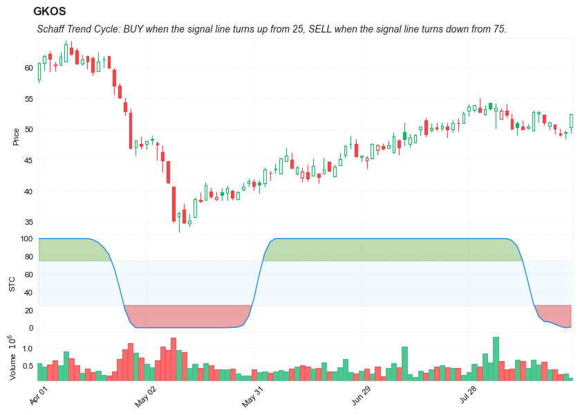

## Schaff Trend Cycle (Oscillator)

**References**

- [chrt-ti-schaff-trend-cycle](https://library.tradingtechnologies.com/trade/chrt-ti-schaff-trend-cycle.html#:~:text=The%20Schaff%20Trend%20Cycle%20(STC,75%20levels%20downward%20(sell).)
- [tradingview: Schaff Trend Cycle](https://www.tradingview.com/script/dbxXeuw2-Indicator-Schaff-Trend-Cycle-STC/)


**Definition**

- The Schaff Trend Cycle (STC) indicator is an oscillator that provides buy and sell signals for trading and identifies market trends. 
- STC detects up and down trends long before the MACD . It does this by using the same exponential moving averages (EMAs), but adds a cycle component to factor instrument cycle trends. STC gives more accuracy and reliability than the MACD .
- STC indicator generates its BUY signal when the signal line turns up from 25 (to indicate a bullish reversal is happening and signaling that it is time to go long), or turns down from 75 (to indicate a downside reversal is unfolding and so it's time for a short sale).
- This indicator was originally developed by Doug Schaff in the 1990s (published in 2008).


##### Load basic packages 


```python
import pandas as pd
import numpy as np
import os
import gc
import copy
from pathlib import Path
from datetime import datetime, timedelta, time, date
```


```python
#this package is to download equity price data from yahoo finance
#the source code of this package can be found here: https://github.com/ranaroussi/yfinance/blob/main
import yfinance as yf
```


```python
pd.options.display.max_rows = 100
pd.options.display.max_columns = 100

import warnings
warnings.filterwarnings("ignore")

import pytorch_lightning as pl
random_seed=1234
pl.seed_everything(random_seed)
```

    Global seed set to 1234
    


    1234


```python
#S&P 500 (^GSPC),  Dow Jones Industrial Average (^DJI), NASDAQ Composite (^IXIC)
#Russell 2000 (^RUT), Crude Oil Nov 21 (CL=F), Gold Dec 21 (GC=F)
#Treasury Yield 10 Years (^TNX)

#benchmark_tickers = ['^GSPC', '^DJI', '^IXIC', '^RUT',  'CL=F', 'GC=F', '^TNX']

benchmark_tickers = ['^GSPC']
tickers = benchmark_tickers + ['GSK', 'NVO', 'ITCI', 'GKOS']
```


```python
#https://github.com/ranaroussi/yfinance/blob/main/yfinance/base.py
#     def history(self, period="1mo", interval="1d",
#                 start=None, end=None, prepost=False, actions=True,
#                 auto_adjust=True, back_adjust=False,
#                 proxy=None, rounding=False, tz=None, timeout=None, **kwargs):

dfs = {}

for ticker in tickers:
    cur_data = yf.Ticker(ticker)
    hist = cur_data.history(period="max", start='2000-01-01')
    print(datetime.now(), ticker, hist.shape, hist.index.min(), hist.index.max())
    dfs[ticker] = hist
```

    2022-08-24 23:55:22.563286 ^GSPC (5699, 7) 1999-12-31 00:00:00 2022-08-24 00:00:00
    2022-08-24 23:55:22.987867 GSK (5699, 7) 1999-12-31 00:00:00 2022-08-24 00:00:00
    2022-08-24 23:55:23.316568 NVO (5699, 7) 1999-12-31 00:00:00 2022-08-24 00:00:00
    2022-08-24 23:55:23.566454 ITCI (2174, 7) 2014-01-07 00:00:00 2022-08-24 00:00:00
    2022-08-24 23:55:23.878489 GKOS (1805, 7) 2015-06-25 00:00:00 2022-08-24 00:00:00
    


```python
ticker = 'GKOS'
dfs[ticker].tail(5)
```


<div>
<style scoped>
    .dataframe tbody tr th:only-of-type {
        vertical-align: middle;
    }

    .dataframe tbody tr th {
        vertical-align: top;
    }

    .dataframe thead th {
        text-align: right;
    }
</style>
<table border="1" class="dataframe">
  <thead>
    <tr style="text-align: right;">
      <th></th>
      <th>Open</th>
      <th>High</th>
      <th>Low</th>
      <th>Close</th>
      <th>Volume</th>
      <th>Dividends</th>
      <th>Stock Splits</th>
    </tr>
    <tr>
      <th>Date</th>
      <th></th>
      <th></th>
      <th></th>
      <th></th>
      <th></th>
      <th></th>
      <th></th>
    </tr>
  </thead>
  <tbody>
    <tr>
      <th>2022-08-18</th>
      <td>50.549999</td>
      <td>51.250000</td>
      <td>49.900002</td>
      <td>51.119999</td>
      <td>398900</td>
      <td>0</td>
      <td>0</td>
    </tr>
    <tr>
      <th>2022-08-19</th>
      <td>50.730000</td>
      <td>50.730000</td>
      <td>49.250000</td>
      <td>50.080002</td>
      <td>392000</td>
      <td>0</td>
      <td>0</td>
    </tr>
    <tr>
      <th>2022-08-22</th>
      <td>49.290001</td>
      <td>50.110001</td>
      <td>48.810001</td>
      <td>49.049999</td>
      <td>243200</td>
      <td>0</td>
      <td>0</td>
    </tr>
    <tr>
      <th>2022-08-23</th>
      <td>49.509998</td>
      <td>49.759998</td>
      <td>48.439999</td>
      <td>49.410000</td>
      <td>260300</td>
      <td>0</td>
      <td>0</td>
    </tr>
    <tr>
      <th>2022-08-24</th>
      <td>50.290001</td>
      <td>52.430000</td>
      <td>49.269199</td>
      <td>52.400002</td>
      <td>157512</td>
      <td>0</td>
      <td>0</td>
    </tr>
  </tbody>
</table>
</div>


##### Define Schaff Trend Cycle (Oscillator) calculation function


```python
def cal_stc(
        ohlc: pd.DataFrame,
        fast_period: int = 23,
        slow_period: int = 50,
        k_period: int = 10,
        d_period: int = 3,
        column: str = "close",
        adjust: bool = True
    ) -> pd.Series:
        """
        The Schaff Trend Cycle (Oscillator) can be viewed as Double Smoothed
        Stochastic of the MACD.
        Schaff Trend Cycle - Three input values are used with the STC:
        – Sh: shorter-term Exponential Moving Average with a default period of 23
        – Lg: longer-term Exponential Moving Average with a default period of 50
        – Cycle, set at half the cycle length with a default value of 10. (Stoch K-period)
        - Smooth, set at smoothing at 3 (Stoch D-period)
        The STC is calculated in the following order:
        EMA1 = EMA (Close, fast_period);
        EMA2 = EMA (Close, slow_period);
        MACD = EMA1 – EMA2.
        Second, the 10-period Stochastic from the MACD values is calculated:
        STOCH_K, STOCH_D  = StochasticFull(MACD, k_period, d_period)  // Stoch of MACD
        STC =  average(STOCH_D, d_period) // second smoothed
        In case the STC indicator is decreasing, this indicates that the trend cycle
        is falling, while the price tends to stabilize or follow the cycle to the downside.
        In case the STC indicator is increasing, this indicates that the trend cycle
        is up, while the price tends to stabilize or follow the cycle to the upside.
        """
        EMA_fast = pd.Series(
            ohlc[column].ewm(ignore_na=False, span=fast_period, adjust=adjust).mean(),
            name="EMA_fast",
        )

        EMA_slow = pd.Series(
            ohlc[column].ewm(ignore_na=False, span=slow_period, adjust=adjust).mean(),
            name="EMA_slow",
        )

        MACD = pd.Series((EMA_fast - EMA_slow), name="MACD")

        STOK = pd.Series((
            (MACD - MACD.rolling(window=k_period).min())
            / (MACD.rolling(window=k_period).max() - MACD.rolling(window=k_period).min())
            ) * 100)

        STOD = STOK.rolling(window=d_period).mean()
        STOD_DoubleSmooth = STOD.rolling(window=d_period).mean()  # "double smoothed"
        return pd.Series(STOD_DoubleSmooth, name=f"STC")
```

##### Calculate Schaff Trend Cycle (Oscillator)


```python
df = dfs[ticker][['Open', 'High', 'Low', 'Close', 'Volume']]
```


```python
df = df.round(2)
```


```python
cal_stc
```


    <function __main__.cal_stc(ohlc: pandas.core.frame.DataFrame, fast_period: int = 23, slow_period: int = 50, k_period: int = 10, d_period: int = 3, column: str = 'close', adjust: bool = True) -> pandas.core.series.Series>


```python
df_ta = cal_stc(df, slow_period=50, fast_period=23, k_period=10, d_period=3, column='Close')
df = df.merge(df_ta, left_index = True, right_index = True, how='inner' )

del df_ta
gc.collect()
```


    122


```python
display(df.head(5))
display(df.tail(5))
```


<div>
<style scoped>
    .dataframe tbody tr th:only-of-type {
        vertical-align: middle;
    }

    .dataframe tbody tr th {
        vertical-align: top;
    }

    .dataframe thead th {
        text-align: right;
    }
</style>
<table border="1" class="dataframe">
  <thead>
    <tr style="text-align: right;">
      <th></th>
      <th>Open</th>
      <th>High</th>
      <th>Low</th>
      <th>Close</th>
      <th>Volume</th>
      <th>STC</th>
    </tr>
    <tr>
      <th>Date</th>
      <th></th>
      <th></th>
      <th></th>
      <th></th>
      <th></th>
      <th></th>
    </tr>
  </thead>
  <tbody>
    <tr>
      <th>2015-06-25</th>
      <td>29.11</td>
      <td>31.95</td>
      <td>28.00</td>
      <td>31.22</td>
      <td>7554700</td>
      <td>NaN</td>
    </tr>
    <tr>
      <th>2015-06-26</th>
      <td>30.39</td>
      <td>30.39</td>
      <td>27.51</td>
      <td>28.00</td>
      <td>1116500</td>
      <td>NaN</td>
    </tr>
    <tr>
      <th>2015-06-29</th>
      <td>27.70</td>
      <td>28.48</td>
      <td>27.51</td>
      <td>28.00</td>
      <td>386900</td>
      <td>NaN</td>
    </tr>
    <tr>
      <th>2015-06-30</th>
      <td>27.39</td>
      <td>29.89</td>
      <td>27.39</td>
      <td>28.98</td>
      <td>223900</td>
      <td>NaN</td>
    </tr>
    <tr>
      <th>2015-07-01</th>
      <td>28.83</td>
      <td>29.00</td>
      <td>27.87</td>
      <td>28.00</td>
      <td>150000</td>
      <td>NaN</td>
    </tr>
  </tbody>
</table>
</div>


<div>
<style scoped>
    .dataframe tbody tr th:only-of-type {
        vertical-align: middle;
    }

    .dataframe tbody tr th {
        vertical-align: top;
    }

    .dataframe thead th {
        text-align: right;
    }
</style>
<table border="1" class="dataframe">
  <thead>
    <tr style="text-align: right;">
      <th></th>
      <th>Open</th>
      <th>High</th>
      <th>Low</th>
      <th>Close</th>
      <th>Volume</th>
      <th>STC</th>
    </tr>
    <tr>
      <th>Date</th>
      <th></th>
      <th></th>
      <th></th>
      <th></th>
      <th></th>
      <th></th>
    </tr>
  </thead>
  <tbody>
    <tr>
      <th>2022-08-18</th>
      <td>50.55</td>
      <td>51.25</td>
      <td>49.90</td>
      <td>51.12</td>
      <td>398900</td>
      <td>6.333123</td>
    </tr>
    <tr>
      <th>2022-08-19</th>
      <td>50.73</td>
      <td>50.73</td>
      <td>49.25</td>
      <td>50.08</td>
      <td>392000</td>
      <td>3.932477</td>
    </tr>
    <tr>
      <th>2022-08-22</th>
      <td>49.29</td>
      <td>50.11</td>
      <td>48.81</td>
      <td>49.05</td>
      <td>243200</td>
      <td>1.531830</td>
    </tr>
    <tr>
      <th>2022-08-23</th>
      <td>49.51</td>
      <td>49.76</td>
      <td>48.44</td>
      <td>49.41</td>
      <td>260300</td>
      <td>0.000000</td>
    </tr>
    <tr>
      <th>2022-08-24</th>
      <td>50.29</td>
      <td>52.43</td>
      <td>49.27</td>
      <td>52.40</td>
      <td>157512</td>
      <td>0.763749</td>
    </tr>
  </tbody>
</table>
</div>


```python
df['STC'].hist(bins=50)
```


    <AxesSubplot:>


    

    


```python
#https://github.com/matplotlib/mplfinance
#this package help visualize financial data
import mplfinance as mpf
import matplotlib.colors as mcolors

# all_colors = list(mcolors.CSS4_COLORS.keys())#"CSS Colors"
all_colors = list(mcolors.TABLEAU_COLORS.keys()) # "Tableau Palette",
# all_colors = list(mcolors.BASE_COLORS.keys()) #"Base Colors",


#https://github.com/matplotlib/mplfinance/issues/181#issuecomment-667252575
#list of colors: https://matplotlib.org/stable/gallery/color/named_colors.html
#https://github.com/matplotlib/mplfinance/blob/master/examples/styles.ipynb

def make_3panels2(main_data, mid_panel, chart_type='candle', names=None, 
                  figratio=(14,9), fill_weights = (0, 0)):
    """
    main chart type: default is candle. alternatives: ohlc, line

    example:
    start = 200

    names = {'main_title': 'MAMA: MESA Adaptive Moving Average', 
             'sub_tile': 'S&P 500 (^GSPC)', 'y_tiles': ['price', 'Volume [$10^{6}$]']}


    make_candle(df.iloc[-start:, :5], df.iloc[-start:][['MAMA', 'FAMA']], names = names)
    
    """

    style = mpf.make_mpf_style(base_mpf_style='yahoo',  #charles
                               base_mpl_style = 'seaborn-whitegrid',
#                                marketcolors=mpf.make_marketcolors(up="r", down="#0000CC",inherit=True),
                               gridcolor="whitesmoke", 
                               gridstyle="--", #or None, or - for solid
                               gridaxis="both", 
                               edgecolor = 'whitesmoke',
                               facecolor = 'white', #background color within the graph edge
                               figcolor = 'white', #background color outside of the graph edge
                               y_on_right = False,
                               rc =  {'legend.fontsize': 'small',#or number
                                      #'figure.figsize': (14, 9),
                                     'axes.labelsize': 'small',
                                     'axes.titlesize':'small',
                                     'xtick.labelsize':'small',#'x-small', 'small','medium','large'
                                     'ytick.labelsize':'small'
                                     }, 
                              )   

    if (chart_type is None) or (chart_type not in ['ohlc', 'line', 'candle', 'hollow_and_filled']):
        chart_type = 'candle'
    len_dict = {'candle':2, 'ohlc':3, 'line':1, 'hollow_and_filled':2}    
        
    kwargs = dict(type=chart_type, figratio=figratio, volume=True, volume_panel=2, 
                  panel_ratios=(4,2,1), tight_layout=True, style=style, returnfig=True)
    
    if names is None:
        names = {'main_title': '', 'sub_tile': ''}
    


    added_plots = { 
        'STC': mpf.make_addplot(mid_panel['STC'], panel=1, color='dodgerblue', width=1, secondary_y=False), 
    
    }

    
    fb_stc_up = dict(y1=fill_weights[0]*np.ones(mid_panel.shape[0]),y2=mid_panel['STC'].values,where=mid_panel['STC']<fill_weights[0],color="#e06666",alpha=0.6,interpolate=True)
    fb_stc_dn = dict(y1=fill_weights[1]*np.ones(mid_panel.shape[0]),y2=mid_panel['STC'].values,where=mid_panel['STC']>fill_weights[1],color="#93c47d",alpha=0.6,interpolate=True)
    fb_stc_up['panel'] = 1
    fb_stc_dn['panel'] = 1    
  
    fb_stc_bbands = dict(y1=fill_weights[0]*np.ones(mid_panel.shape[0]),
                      y2=fill_weights[1]*np.ones(mid_panel.shape[0]),color="lightskyblue",alpha=0.1,interpolate=True)
    fb_stc_bbands['panel'] = 1

    fb_bbands= [fb_stc_up, fb_stc_dn, fb_stc_bbands]    


    fig, axes = mpf.plot(main_data,  **kwargs,
                         addplot=list(added_plots.values()), 
                         fill_between=fb_bbands)
    # add a new suptitle
    fig.suptitle(names['main_title'], y=1.05, fontsize=12, x=0.1285)

    axes[0].set_title(names['sub_tile'], fontsize=10, style='italic',  loc='left')
    axes[2].set_ylabel('STC')

#     axes[0].set_ylabel(names['y_tiles'][0])
#     axes[2].set_ylabel(names['y_tiles'][1])
    return fig, axes
   
```


```python

start = -100
end = df.shape[0]

names = {'main_title': f'{ticker}', 
         'sub_tile': 'Schaff Trend Cycle: BUY when the signal line turns up from 25, SELL when the signal line turns down from 75.'}


aa_, bb_ = make_3panels2(df.iloc[start:end][['Open', 'High', 'Low', 'Close', 'Volume']], 
             df.iloc[start:end][['STC']], 
             chart_type='hollow_and_filled',names = names, 
                         fill_weights = (25, 75))
```


    

    

