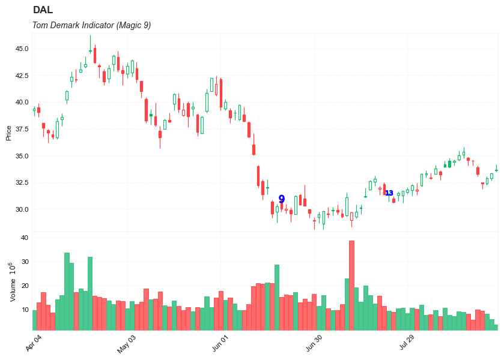

## Tom Demark Indicator (Magic 9)

**References**

- [github: TD](https://github.com/txjohnny5/Tom-Demark-Indicator)
- [traders.com: TradersTips 2011-09](http://traders.com/documentation/feedbk_docs/2011/09/traderstips.html)
- [traders.com: Tom DeMark TD Sequential 2011-08 coles](http://traders.com/Documentation/FEEDbk_docs/2011/08/Coles.html)
- [traders.com: Tom DeMark TD Sequential 2011-09 coles](http://traders.com/documentation/feedbk_docs/2011/09/Coles.html)


**Description**


Tom Demark Indicator  or TD Sequential

In his book Day Trading Options as well as in various articles, Thomas DeMark demonstrated that his TD Sequential and TD Combo bar counting techniques are equally effective on intraday charts. 

However, as Jason Perl stresses in his recent book about DeMark’s indicators, the momentum component is still important, since how the market responds to a setup determines whether it is range-bound. Each time price completes a setup, the price extremes are identified by a support and resistance line known as the TD Setup Trend (Tdst). If price fails to break through the Tdst, there is an opportunity to take a contrary position insofar as the market doesn’t have the momentum to start the countdown phase — that is, to break through the Tdst into a new distinct trend. This means that a mechanized version of the setup is capable of creating many interesting signals of its own.


##### Load basic packages 


```python
import pandas as pd
import numpy as np
import os
import gc
import copy
from pathlib import Path
from datetime import datetime, timedelta, time, date
```


```python
#this package is to download equity price data from yahoo finance
#the source code of this package can be found here: https://github.com/ranaroussi/yfinance/blob/main
import yfinance as yf
```


```python
pd.options.display.max_rows = 100
pd.options.display.max_columns = 100

import warnings
warnings.filterwarnings("ignore")

import pytorch_lightning as pl
random_seed=1234
pl.seed_everything(random_seed)
```

    Global seed set to 1234
    


    1234


```python
#S&P 500 (^GSPC),  Dow Jones Industrial Average (^DJI), NASDAQ Composite (^IXIC)
#Russell 2000 (^RUT), Crude Oil Nov 21 (CL=F), Gold Dec 21 (GC=F)
#Treasury Yield 10 Years (^TNX)

#benchmark_tickers = ['^GSPC', '^DJI', '^IXIC', '^RUT',  'CL=F', 'GC=F', '^TNX']

benchmark_tickers = ['^GSPC']
tickers = benchmark_tickers + ['GSK', 'NVO', 'AROC', 'DAL']
```


```python
#https://github.com/ranaroussi/yfinance/blob/main/yfinance/base.py
#     def history(self, period="1mo", interval="1d",
#                 start=None, end=None, prepost=False, actions=True,
#                 auto_adjust=True, back_adjust=False,
#                 proxy=None, rounding=False, tz=None, timeout=None, **kwargs):

dfs = {}

for ticker in tickers:
    cur_data = yf.Ticker(ticker)
    hist = cur_data.history(period="max", start='2000-01-01')
    print(datetime.now(), ticker, hist.shape, hist.index.min(), hist.index.max())
    dfs[ticker] = hist
```

    2022-08-26 00:33:26.599552 ^GSPC (5700, 7) 1999-12-31 00:00:00 2022-08-25 00:00:00
    2022-08-26 00:33:26.945085 GSK (5700, 7) 1999-12-31 00:00:00 2022-08-25 00:00:00
    2022-08-26 00:33:27.241054 NVO (5700, 7) 1999-12-31 00:00:00 2022-08-25 00:00:00
    2022-08-26 00:33:27.467646 AROC (3781, 7) 2007-08-21 00:00:00 2022-08-25 00:00:00
    2022-08-26 00:33:27.693080 DAL (3857, 7) 2007-05-03 00:00:00 2022-08-25 00:00:00
    


```python
ticker = 'DAL'
dfs[ticker].tail(5)
```


<div>
<style scoped>
    .dataframe tbody tr th:only-of-type {
        vertical-align: middle;
    }

    .dataframe tbody tr th {
        vertical-align: top;
    }

    .dataframe thead th {
        text-align: right;
    }
</style>
<table border="1" class="dataframe">
  <thead>
    <tr style="text-align: right;">
      <th></th>
      <th>Open</th>
      <th>High</th>
      <th>Low</th>
      <th>Close</th>
      <th>Volume</th>
      <th>Dividends</th>
      <th>Stock Splits</th>
    </tr>
    <tr>
      <th>Date</th>
      <th></th>
      <th></th>
      <th></th>
      <th></th>
      <th></th>
      <th></th>
      <th></th>
    </tr>
  </thead>
  <tbody>
    <tr>
      <th>2022-08-19</th>
      <td>33.880001</td>
      <td>34.060001</td>
      <td>33.060001</td>
      <td>33.250000</td>
      <td>9860900</td>
      <td>0.0</td>
      <td>0</td>
    </tr>
    <tr>
      <th>2022-08-22</th>
      <td>32.500000</td>
      <td>32.500000</td>
      <td>31.850000</td>
      <td>32.380001</td>
      <td>9246500</td>
      <td>0.0</td>
      <td>0</td>
    </tr>
    <tr>
      <th>2022-08-23</th>
      <td>32.389999</td>
      <td>33.020000</td>
      <td>32.270000</td>
      <td>32.869999</td>
      <td>7974300</td>
      <td>0.0</td>
      <td>0</td>
    </tr>
    <tr>
      <th>2022-08-24</th>
      <td>32.880001</td>
      <td>33.410000</td>
      <td>32.669998</td>
      <td>33.310001</td>
      <td>5739500</td>
      <td>0.0</td>
      <td>0</td>
    </tr>
    <tr>
      <th>2022-08-25</th>
      <td>33.580002</td>
      <td>34.160000</td>
      <td>33.520699</td>
      <td>33.674999</td>
      <td>3586232</td>
      <td>0.0</td>
      <td>0</td>
    </tr>
  </tbody>
</table>
</div>


##### Define Choppiness Index (CHOP) calculation function


http://traders.com/documentation/feedbk_docs/2011/09/traderstips.html


    { TASC Article, September 2011 }
    { Tom DeMark TD Sequential Setup }

    inputs:
        Price( Close ),
        DotOffsetTicks( 5 ) ;

    variables:
        MyTick( MinMove / PriceScale ),
        LongCount( 0 ),
        ShortCount( 0 ) ;

    LongCount = Iff( Price < Price[4], LongCount + 1, 0 ) ;
    ShortCount = Iff( Price > Price[4], 
     ShortCount + 1, 0 ) ;

    { Buy Setup }
    if LongCount = 9 and Price[9] > Price[13] then
        Plot1( L - DotOffsetTicks * MyTick, "TD Buy SU" )
    else
        NoPlot( 1 ) ;

    { Sell Setup }
    if ShortCount = 9 and Price[9] < Price[13] then
        Plot2( H + DotOffsetTicks * MyTick, "TD Sell SU" )
    else
        NoPlot( 2 ) ;


```python
def cal_demark(ohlc: pd.DataFrame) -> pd.DataFrame:
    ohlc = ohlc.copy(deep=True)
    ohlc.columns = [c.lower() for c in ohlc.columns]    

    o=ohlc['open']
    h=ohlc['high']
    l=ohlc['low']
    c=ohlc['close']


    #Below various arrays are generated for TD indicator values.
    #They will (and must) be the same length as any data column
    #(e.g., open, low, volume, etc.).

    #In order for the long/short count to progress beyond 0,
    #It must be preceeded by a bullish/bearish price flip.
    #In the absence of such a flip, the count, if 0,
    #remains at 0 regardless of other conditions.
    #If count > 0, a price flip is not required for the count to progress.
    shortVal=[]
    longVal =[]
    shortCount = 0
    longCount = 0
    for k in range(0,len(c)): #generate TD buy/sell setups
        if k <= 3:
            longCount = 0
            shortCount = 0
        if shortCount > 8:
            shortCount = 0
        if longCount > 8:
            longCount = 0
        if k > 3:
            if c[k] < c[k-4]:
                longCount+=1
            else:
                longCount = 0
            if c[k] > c[k-4]:
                shortCount+=1
            else:
                shortCount = 0
        longVal.append(longCount)
        shortVal.append(shortCount)

    buyVal =[]
    sellVal=[]
    buyCount=0
    sellCount=0
    for y in range(0,len(c)): #generate TD buy countdown
        if y < 11:
            buyCount = 0
        if y>= 11:
            if buyCount == 0:
                if h[y] >= l[y-3] or h[y] >= l[y-4] or h[y] >= l[y-5] or h[y] >= l[y-6] or h[y] >= l[y-7]:
                    if 8 in longVal[y-16:y] or 9 in longVal[y-15:y]:
                        if c[y] < l[y-2]:
                            buyCount += 1
            if buyVal[-1] == 13 or shortVal[y] > 8:
                buyCount = 0
            if buyCount != 0:
                if c[y] < l[y-2]:
                    buyCount += 1
                if longVal[y] == 9:
                    buyCount = 0
        buyVal.append(buyCount)

    for y in range(0,len(c)): #generate TD sell countdown
        if y < 11:
            sellCount = 0
        if y>= 11:
            if sellCount == 0:
                if l[y] <= h[y-3] or l[y] <= h[y-4] or l[y] <= h[y-5] or l[y] <= h[y-6] or l[y] <= h[y-7]:
                    if 8 in shortVal[y-16:y] or 9 in shortVal[y-15:y]:
                        if c[y] > h[y-2]:
                            sellCount = 1
            if sellVal[-1] == 13 or longVal[y] > 8:
                sellCount = 0
            if sellCount != 0:
                if c[y] > h[y-2]:
                    sellCount += 1
                if shortVal[y] == 9:
                    sellCount = 0
        sellVal.append(sellCount)

    agbuyVal =[]
    agsellVal=[]
    agbuyCount=0
    agsellCount=0
    for y in range(0,len(c)): #generate aggressive TD buy countdown
        if y < 11:
            agbuyCount = 0
        if y>= 11:
            if agbuyCount == 0:
                if h[y] >= l[y-3] or h[y] >= l[y-4] or h[y] >= l[y-5] or h[y] >= l[y-6] or h[y] >= l[y-7]:
                    if 8 in longVal[y-16:y] or 9 in longVal[y-15:y]:
                        if l[y] < l[y-2]:
                            agbuyCount += 1
            if agbuyVal[-1] == 13 or shortVal[y] > 8:
                agbuyCount = 0
            if agbuyCount != 0:
                if l[y] < l[y-2]:
                    agbuyCount += 1
                if longVal[y] == 9:
                    agbuyCount = 0
        agbuyVal.append(agbuyCount)

    for y in range(0,len(c)): #generate aggressive TD sell countdown
        if y < 11:
            agsellCount = 0
        if y>= 11:
            if agsellCount == 0:
                if l[y] <= h[y-3] or l[y] <= h[y-4] or l[y] <= h[y-5] or l[y] <= h[y-6] or l[y] <= h[y-7]:
                    if 8 in shortVal[y-16:y] or 9 in shortVal[y-15:y]:
                        if h[y] > h[y-2]:
                             agsellCount = 1
            if agsellVal[-1] == 13 or longVal[y] > 8:
                agsellCount = 0
            if agsellCount != 0:
                if h[y] > h[y-2]:
                    agsellCount += 1
                if shortVal[y] == 9:
                    agsellCount = 0
        agsellVal.append(agsellCount)

    demark_ = {'short_val': shortVal,
               'long_val': longVal,     
               'buy_val': buyVal, 
               'sell_val': sellVal,
               'agbuy_val': agbuyVal, 
               'agsell_val': agsellVal
              }
    return pd.DataFrame(data=demark_, index=ohlc.index)
          
```

##### Calculate Choppiness Index (CHOP)


```python
df = dfs[ticker][['Open', 'High', 'Low', 'Close', 'Volume']]
```


```python
df = df.round(2)
```


```python
df.shape
```


    (3857, 5)


```python
cal_demark
```


    <function __main__.cal_demark(ohlc: pandas.core.frame.DataFrame) -> pandas.core.frame.DataFrame>


```python
df_ta = cal_demark(df)
df = df.merge(df_ta, left_index = True, right_index = True, how='inner' )

del df_ta
gc.collect()
```


    143


```python
from core.finta import TA
```


```python
TA.MAMA
```


    <function core.finta.TA.MAMA(ohlc: pandas.core.frame.DataFrame, fast_limit: float = 0.5, slow_limit: float = 0.05, column: str = 'close') -> pandas.core.series.Series>


```python
df_ta = TA.MAMA(df, column='close')
df = df.merge(df_ta, left_index = True, right_index = True, how='inner' )

del df_ta
gc.collect()
```


    68


```python
display(df.head(5))
display(df.tail(5))
```


<div>
<style scoped>
    .dataframe tbody tr th:only-of-type {
        vertical-align: middle;
    }

    .dataframe tbody tr th {
        vertical-align: top;
    }

    .dataframe thead th {
        text-align: right;
    }
</style>
<table border="1" class="dataframe">
  <thead>
    <tr style="text-align: right;">
      <th></th>
      <th>Open</th>
      <th>High</th>
      <th>Low</th>
      <th>Close</th>
      <th>Volume</th>
      <th>short_val</th>
      <th>long_val</th>
      <th>buy_val</th>
      <th>sell_val</th>
      <th>agbuy_val</th>
      <th>agsell_val</th>
      <th>B4</th>
      <th>B5</th>
      <th>B9</th>
      <th>B13</th>
      <th>AB13</th>
      <th>MAMA</th>
      <th>FAMA</th>
    </tr>
    <tr>
      <th>Date</th>
      <th></th>
      <th></th>
      <th></th>
      <th></th>
      <th></th>
      <th></th>
      <th></th>
      <th></th>
      <th></th>
      <th></th>
      <th></th>
      <th></th>
      <th></th>
      <th></th>
      <th></th>
      <th></th>
      <th></th>
      <th></th>
    </tr>
  </thead>
  <tbody>
    <tr>
      <th>2007-05-03</th>
      <td>19.32</td>
      <td>19.50</td>
      <td>18.25</td>
      <td>18.40</td>
      <td>8052800</td>
      <td>0</td>
      <td>0</td>
      <td>0</td>
      <td>0</td>
      <td>0</td>
      <td>0</td>
      <td>NaN</td>
      <td>NaN</td>
      <td>NaN</td>
      <td>NaN</td>
      <td>NaN</td>
      <td>18.40</td>
      <td>18.40</td>
    </tr>
    <tr>
      <th>2007-05-04</th>
      <td>18.88</td>
      <td>18.96</td>
      <td>18.39</td>
      <td>18.64</td>
      <td>5437300</td>
      <td>0</td>
      <td>0</td>
      <td>0</td>
      <td>0</td>
      <td>0</td>
      <td>0</td>
      <td>NaN</td>
      <td>NaN</td>
      <td>NaN</td>
      <td>NaN</td>
      <td>NaN</td>
      <td>18.64</td>
      <td>18.64</td>
    </tr>
    <tr>
      <th>2007-05-07</th>
      <td>18.83</td>
      <td>18.91</td>
      <td>17.94</td>
      <td>18.08</td>
      <td>2646300</td>
      <td>0</td>
      <td>0</td>
      <td>0</td>
      <td>0</td>
      <td>0</td>
      <td>0</td>
      <td>NaN</td>
      <td>NaN</td>
      <td>NaN</td>
      <td>NaN</td>
      <td>NaN</td>
      <td>18.08</td>
      <td>18.08</td>
    </tr>
    <tr>
      <th>2007-05-08</th>
      <td>17.76</td>
      <td>17.76</td>
      <td>17.14</td>
      <td>17.44</td>
      <td>4166100</td>
      <td>0</td>
      <td>0</td>
      <td>0</td>
      <td>0</td>
      <td>0</td>
      <td>0</td>
      <td>NaN</td>
      <td>NaN</td>
      <td>NaN</td>
      <td>NaN</td>
      <td>NaN</td>
      <td>17.44</td>
      <td>17.44</td>
    </tr>
    <tr>
      <th>2007-05-09</th>
      <td>17.54</td>
      <td>17.94</td>
      <td>17.44</td>
      <td>17.58</td>
      <td>7541100</td>
      <td>0</td>
      <td>1</td>
      <td>0</td>
      <td>0</td>
      <td>0</td>
      <td>0</td>
      <td>NaN</td>
      <td>NaN</td>
      <td>NaN</td>
      <td>NaN</td>
      <td>NaN</td>
      <td>17.58</td>
      <td>17.58</td>
    </tr>
  </tbody>
</table>
</div>


<div>
<style scoped>
    .dataframe tbody tr th:only-of-type {
        vertical-align: middle;
    }

    .dataframe tbody tr th {
        vertical-align: top;
    }

    .dataframe thead th {
        text-align: right;
    }
</style>
<table border="1" class="dataframe">
  <thead>
    <tr style="text-align: right;">
      <th></th>
      <th>Open</th>
      <th>High</th>
      <th>Low</th>
      <th>Close</th>
      <th>Volume</th>
      <th>short_val</th>
      <th>long_val</th>
      <th>buy_val</th>
      <th>sell_val</th>
      <th>agbuy_val</th>
      <th>agsell_val</th>
      <th>B4</th>
      <th>B5</th>
      <th>B9</th>
      <th>B13</th>
      <th>AB13</th>
      <th>MAMA</th>
      <th>FAMA</th>
    </tr>
    <tr>
      <th>Date</th>
      <th></th>
      <th></th>
      <th></th>
      <th></th>
      <th></th>
      <th></th>
      <th></th>
      <th></th>
      <th></th>
      <th></th>
      <th></th>
      <th></th>
      <th></th>
      <th></th>
      <th></th>
      <th></th>
      <th></th>
      <th></th>
    </tr>
  </thead>
  <tbody>
    <tr>
      <th>2022-08-19</th>
      <td>33.88</td>
      <td>34.06</td>
      <td>33.06</td>
      <td>33.25</td>
      <td>9860900</td>
      <td>0</td>
      <td>2</td>
      <td>9</td>
      <td>4</td>
      <td>0</td>
      <td>7</td>
      <td>NaN</td>
      <td>NaN</td>
      <td>NaN</td>
      <td>NaN</td>
      <td>NaN</td>
      <td>33.933994</td>
      <td>34.197449</td>
    </tr>
    <tr>
      <th>2022-08-22</th>
      <td>32.50</td>
      <td>32.50</td>
      <td>31.85</td>
      <td>32.38</td>
      <td>9246500</td>
      <td>0</td>
      <td>3</td>
      <td>10</td>
      <td>4</td>
      <td>0</td>
      <td>7</td>
      <td>NaN</td>
      <td>NaN</td>
      <td>NaN</td>
      <td>NaN</td>
      <td>NaN</td>
      <td>33.156997</td>
      <td>33.937336</td>
    </tr>
    <tr>
      <th>2022-08-23</th>
      <td>32.39</td>
      <td>33.02</td>
      <td>32.27</td>
      <td>32.87</td>
      <td>7974300</td>
      <td>0</td>
      <td>4</td>
      <td>11</td>
      <td>4</td>
      <td>0</td>
      <td>7</td>
      <td>33.02</td>
      <td>NaN</td>
      <td>NaN</td>
      <td>NaN</td>
      <td>NaN</td>
      <td>33.058943</td>
      <td>33.787283</td>
    </tr>
    <tr>
      <th>2022-08-24</th>
      <td>32.88</td>
      <td>33.41</td>
      <td>32.67</td>
      <td>33.31</td>
      <td>5739500</td>
      <td>0</td>
      <td>5</td>
      <td>11</td>
      <td>5</td>
      <td>0</td>
      <td>8</td>
      <td>NaN</td>
      <td>33.41</td>
      <td>NaN</td>
      <td>NaN</td>
      <td>NaN</td>
      <td>33.184472</td>
      <td>33.636580</td>
    </tr>
    <tr>
      <th>2022-08-25</th>
      <td>33.58</td>
      <td>34.16</td>
      <td>33.52</td>
      <td>33.67</td>
      <td>3586232</td>
      <td>1</td>
      <td>0</td>
      <td>11</td>
      <td>6</td>
      <td>0</td>
      <td>9</td>
      <td>NaN</td>
      <td>NaN</td>
      <td>NaN</td>
      <td>NaN</td>
      <td>NaN</td>
      <td>33.427236</td>
      <td>33.584244</td>
    </tr>
  </tbody>
</table>
</div>


```python

signals = df['long_val'].values

B4 = np.array([np.nan]*len(signals))
B4[signals==4] = 1
B5 = np.array([np.nan]*len(signals))
B5[signals==5] = 1
B9 = np.array([np.nan]*len(signals))
B9[signals==9] = 1

signals = df['buy_val'].values
B13 = np.array([np.nan]*len(signals))
B13[signals==13] = 1

signals = df['agbuy_val'].values
AB13 = np.array([np.nan]*len(signals))
AB13[signals==13] = 1


df['B4'] = B4*df['High'] 
df['B5'] = B5*df['High'] 
df['B9'] = B9*df['High']
df['B13'] = B13*df['High'] 
df['AB13'] = AB13*df['High']

df['Demark_MAMA_BUY'] = ((df['MAMA']<df['MAMA'].shift(4)).rolling(9).sum()==9) & (df['MAMA'].shift(9)>df['MAMA'].shift(13)) 
df['Demark_MAMA_BUY'] = df['Demark_MAMA_BUY'].astype(int)
df['Demark_MAMA'] = df['Demark_MAMA_BUY']*(df['High'] + df['Low'])/2
df.loc[df['Demark_MAMA_BUY']==0, 'Demark_MAMA'] = np.nan


df['Demark_FAMA_BUY'] = ((df['FAMA']<df['FAMA'].shift(4)).rolling(9).sum()==9) & (df['FAMA'].shift(9)>df['FAMA'].shift(13)) 
df['Demark_FAMA_BUY'] = df['Demark_FAMA_BUY'].astype(int)
df['Demark_FAMA'] = df['Demark_FAMA_BUY']*(df['High'] + df['Low'])/2
df.loc[df['Demark_FAMA_BUY']==0, 'Demark_FAMA'] = np.nan
```


```python
df[[ 'short_val', 'long_val',
       'buy_val', 'sell_val', 'agbuy_val', 'agsell_val']].hist(bins=50)
```


    array([[<AxesSubplot:title={'center':'short_val'}>,
            <AxesSubplot:title={'center':'long_val'}>],
           [<AxesSubplot:title={'center':'buy_val'}>,
            <AxesSubplot:title={'center':'sell_val'}>],
           [<AxesSubplot:title={'center':'agbuy_val'}>,
            <AxesSubplot:title={'center':'agsell_val'}>]], dtype=object)


    

    


```python
#https://github.com/matplotlib/mplfinance
#this package help visualize financial data
import mplfinance as mpf
import matplotlib.colors as mcolors

# all_colors = list(mcolors.CSS4_COLORS.keys())#"CSS Colors"
all_colors = list(mcolors.TABLEAU_COLORS.keys()) # "Tableau Palette",
# all_colors = list(mcolors.BASE_COLORS.keys()) #"Base Colors",


#https://github.com/matplotlib/mplfinance/issues/181#issuecomment-667252575
#list of colors: https://matplotlib.org/stable/gallery/color/named_colors.html
#https://github.com/matplotlib/mplfinance/blob/master/examples/styles.ipynb

def make_3panels2(main_data, add_data, chart_type='candle', names=None, 
                  figratio=(14,9)):


    style = mpf.make_mpf_style(base_mpf_style='yahoo',  #charles
                               base_mpl_style = 'seaborn-whitegrid',
#                                marketcolors=mpf.make_marketcolors(up="r", down="#0000CC",inherit=True),
                               gridcolor="whitesmoke", 
                               gridstyle="--", #or None, or - for solid
                               gridaxis="both", 
                               edgecolor = 'whitesmoke',
                               facecolor = 'white', #background color within the graph edge
                               figcolor = 'white', #background color outside of the graph edge
                               y_on_right = False,
                               rc =  {'legend.fontsize': 'small',#or number
                                      #'figure.figsize': (14, 9),
                                     'axes.labelsize': 'small',
                                     'axes.titlesize':'small',
                                     'xtick.labelsize':'small',#'x-small', 'small','medium','large'
                                     'ytick.labelsize':'small'
                                     }, 
                              )   

    if (chart_type is None) or (chart_type not in ['ohlc', 'line', 'candle', 'hollow_and_filled']):
        chart_type = 'candle'
    len_dict = {'candle':2, 'ohlc':3, 'line':1, 'hollow_and_filled':2}    
        
    kwargs = dict(type=chart_type, figratio=figratio, volume=True, volume_panel=1, 
                  panel_ratios=(4,2), tight_layout=True, style=style, returnfig=True)
    
    if names is None:
        names = {'main_title': '', 'sub_tile': ''}
    


    added_plots = {     
        #'B4':  mpf.make_addplot(add_data['B4'], panel=0, color='blue', type='scatter', marker=r'${4}$' , markersize=30, secondary_y=False),   
        #'B5':  mpf.make_addplot(add_data['B5'], panel=0, color='blue', type='scatter', marker=r'${5}$' , markersize=30, secondary_y=False), 
        'B9':  mpf.make_addplot(add_data['B9'], panel=0, color='blue', type='scatter', marker=r'${9}$' , markersize=80, secondary_y=False), 
        'B13':  mpf.make_addplot(add_data['B13'], panel=0, color='blue', type='scatter', marker=r'${13}$' , markersize=80, secondary_y=False), 
        'AB13':  mpf.make_addplot(add_data['AB13'], panel=0, color='blue', type='scatter', marker=r'${13}$' , markersize=80, secondary_y=False), 

    }    

    fig, axes = mpf.plot(main_data,  **kwargs,
                         addplot=list(added_plots.values()), 
                         )
    # add a new suptitle
    fig.suptitle(names['main_title'], y=1.05, fontsize=12, x=0.1285)

    axes[0].set_title(names['sub_tile'], fontsize=10, style='italic',  loc='left')
    

#     axes[0].set_ylabel(names['y_tiles'][0])
#     axes[2].set_ylabel(names['y_tiles'][1])
    return fig, axes
   
```


```python

start = -100
end = df.shape[0]

names = {'main_title': f'{ticker}', 
         'sub_tile': 'Tom Demark Indicator (Magic 9)'}


aa_, bb_ = make_3panels2(df.iloc[start:end][['Open', 'High', 'Low', 'Close', 'Volume']], 
             df.iloc[start:end][['B13', 'AB13', 'B9']], 
             chart_type='hollow_and_filled',
                         names = names
                        )
```


    

    


```python
#https://github.com/matplotlib/mplfinance
#this package help visualize financial data
import mplfinance as mpf
import matplotlib.colors as mcolors

# all_colors = list(mcolors.CSS4_COLORS.keys())#"CSS Colors"
all_colors = list(mcolors.TABLEAU_COLORS.keys()) # "Tableau Palette",
# all_colors = list(mcolors.BASE_COLORS.keys()) #"Base Colors",


#https://github.com/matplotlib/mplfinance/issues/181#issuecomment-667252575
#list of colors: https://matplotlib.org/stable/gallery/color/named_colors.html
#https://github.com/matplotlib/mplfinance/blob/master/examples/styles.ipynb

def make_3panels2(main_data, add_data, chart_type='candle', names=None, 
                  figratio=(14,9)):


    style = mpf.make_mpf_style(base_mpf_style='yahoo',  #charles
                               base_mpl_style = 'seaborn-whitegrid',
#                                marketcolors=mpf.make_marketcolors(up="r", down="#0000CC",inherit=True),
                               gridcolor="whitesmoke", 
                               gridstyle="--", #or None, or - for solid
                               gridaxis="both", 
                               edgecolor = 'whitesmoke',
                               facecolor = 'white', #background color within the graph edge
                               figcolor = 'white', #background color outside of the graph edge
                               y_on_right = False,
                               rc =  {'legend.fontsize': 'small',#or number
                                      #'figure.figsize': (14, 9),
                                     'axes.labelsize': 'small',
                                     'axes.titlesize':'small',
                                     'xtick.labelsize':'small',#'x-small', 'small','medium','large'
                                     'ytick.labelsize':'small'
                                     }, 
                              )   

    if (chart_type is None) or (chart_type not in ['ohlc', 'line', 'candle', 'hollow_and_filled']):
        chart_type = 'candle'
    len_dict = {'candle':2, 'ohlc':3, 'line':1, 'hollow_and_filled':2}    
        
    kwargs = dict(type=chart_type, figratio=figratio, volume=True, volume_panel=1, 
                  panel_ratios=(4,2), tight_layout=True, style=style, returnfig=True)
    
    if names is None:
        names = {'main_title': '', 'sub_tile': ''}
    
    added_plots = { }
    for name_, data_ in add_data.iteritems():
        added_plots[name_] = mpf.make_addplot(data_, panel=0, color='blue', type='scatter', marker=r'${9}$' , markersize=80, secondary_y=False)    


    fig, axes = mpf.plot(main_data,  **kwargs,
                         addplot=list(added_plots.values()), 
                         )
    # add a new suptitle
    fig.suptitle(names['main_title'], y=1.05, fontsize=12, x=0.1285)

    axes[0].set_title(names['sub_tile'], fontsize=10, style='italic',  loc='left')
    

#     axes[0].set_ylabel(names['y_tiles'][0])
#     axes[2].set_ylabel(names['y_tiles'][1])
    return fig, axes
   
```


```python

start = -200
end = df.shape[0]

names = {'main_title': f'{ticker}', 
         'sub_tile': 'Tom Demark Indicator (Magic 9)'}


aa_, bb_ = make_3panels2(df.iloc[start:end][['Open', 'High', 'Low', 'Close', 'Volume']], 
             df.iloc[start:end][['B9']], 
             chart_type='hollow_and_filled',
                         names = names
                        )

```


    

    


```python

start = -200
end = df.shape[0]

names = {'main_title': f'{ticker}', 
         'sub_tile': 'Tom Demark Indicator (Magic 9)'}


aa_, bb_ = make_3panels2(df.iloc[start:end][['Open', 'High', 'Low', 'Close', 'Volume']], 
             df.iloc[start:end][['Demark_MAMA']], 
             chart_type='hollow_and_filled',
                         names = names
                        )

```


    

    


```python
start = -200
end = df.shape[0]

names = {'main_title': f'{ticker}', 
         'sub_tile': 'Tom Demark Indicator (Magic 9)'}


aa_, bb_ = make_3panels2(df.iloc[start:end][['Open', 'High', 'Low', 'Close', 'Volume']], 
             df.iloc[start:end][[ 'Demark_FAMA']], 
             chart_type='hollow_and_filled',
                         names = names
                        )
```


    

    

