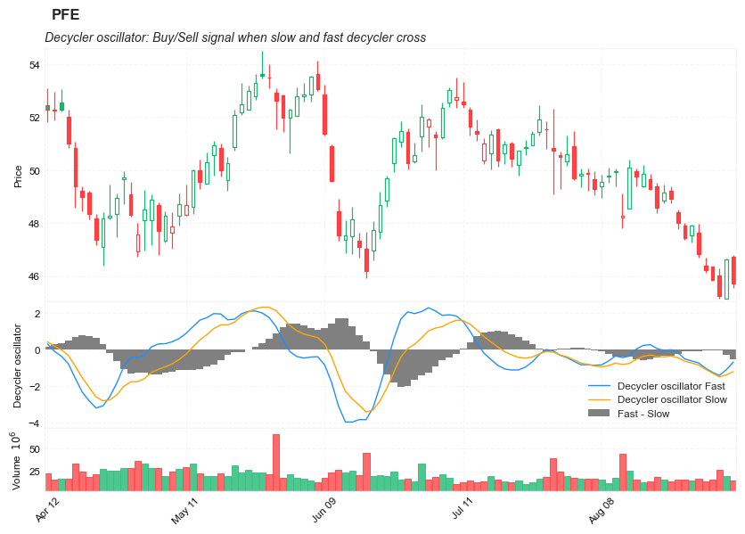

## John Ehlers's Decycler Oscillator

**References**
- [github: legitindicators](https://github.com/aticio/legitindicators/blob/main/legitindicators.py)
- [traders.com: traderstips 2015-09](https://traders.com/documentation/feedbk_docs/2015/09/traderstips.html)

**Definition**

In “Decyclers” in this issue, author John Ehlers describes a method for constructing an oscillator that can help traders detect trend reversals with almost no lag. Ehlers calls this new oscillator a decycler. The author begins the process by isolating the high-frequency components present in the input data. He then subtracts these from the input data leaving only the lower-frequency components representing the trend.

- Buy signal: Fast cross from below Slow to above it
- Sell signal: When Slow cross from below Fast to above it

---

        Strategy: Decycler Oscillator
        Fast_Val = DecyclerOscillator( Price, 100, 1.2 ) ;
        Slow_Val = DecyclerOscillator( Price, 125, 1 ) ;
        if Fast_Val crosses over Slow_Val then
            Buy next bar at Market
        else if Slow_Val crosses over Fast_Val then
            SellShort next bar at Market ;	
---            

##### Load basic packages 


```python
import pandas as pd
import numpy as np
import os
import gc
import copy
from pathlib import Path
from datetime import datetime, timedelta, time, date
```


```python
#this package is to download equity price data from yahoo finance
#the source code of this package can be found here: https://github.com/ranaroussi/yfinance/blob/main
import yfinance as yf
```


```python
pd.options.display.max_rows = 100
pd.options.display.max_columns = 100

import warnings
warnings.filterwarnings("ignore")

import pytorch_lightning as pl
random_seed=1234
pl.seed_everything(random_seed)
```

    Global seed set to 1234
    


    1234


```python
#S&P 500 (^GSPC),  Dow Jones Industrial Average (^DJI), NASDAQ Composite (^IXIC)
#Russell 2000 (^RUT), Crude Oil Nov 21 (CL=F), Gold Dec 21 (GC=F)
#Treasury Yield 10 Years (^TNX)

#benchmark_tickers = ['^GSPC', '^DJI', '^IXIC', '^RUT',  'CL=F', 'GC=F', '^TNX']

benchmark_tickers = ['^GSPC']
tickers = benchmark_tickers + ['GSK', 'NVO', 'GKOS', 'PFE']
```


```python
#https://github.com/ranaroussi/yfinance/blob/main/yfinance/base.py
#     def history(self, period="1mo", interval="1d",
#                 start=None, end=None, prepost=False, actions=True,
#                 auto_adjust=True, back_adjust=False,
#                 proxy=None, rounding=False, tz=None, timeout=None, **kwargs):

dfs = {}

for ticker in tickers:
    cur_data = yf.Ticker(ticker)
    hist = cur_data.history(period="max", start='2000-01-01')
    print(datetime.now(), ticker, hist.shape, hist.index.min(), hist.index.max())
    dfs[ticker] = hist
```

    2022-09-04 00:03:25.666336 ^GSPC (5706, 7) 1999-12-31 00:00:00 2022-09-02 00:00:00
    2022-09-04 00:03:26.040984 GSK (5706, 7) 1999-12-31 00:00:00 2022-09-02 00:00:00
    2022-09-04 00:03:26.432226 NVO (5706, 7) 1999-12-31 00:00:00 2022-09-02 00:00:00
    2022-09-04 00:03:26.680388 GKOS (1812, 7) 2015-06-25 00:00:00 2022-09-02 00:00:00
    2022-09-04 00:03:27.104517 PFE (5706, 7) 1999-12-31 00:00:00 2022-09-02 00:00:00
    


```python
ticker = 'PFE'
dfs[ticker].tail(5)
```


<div>
<style scoped>
    .dataframe tbody tr th:only-of-type {
        vertical-align: middle;
    }

    .dataframe tbody tr th {
        vertical-align: top;
    }

    .dataframe thead th {
        text-align: right;
    }
</style>
<table border="1" class="dataframe">
  <thead>
    <tr style="text-align: right;">
      <th></th>
      <th>Open</th>
      <th>High</th>
      <th>Low</th>
      <th>Close</th>
      <th>Volume</th>
      <th>Dividends</th>
      <th>Stock Splits</th>
    </tr>
    <tr>
      <th>Date</th>
      <th></th>
      <th></th>
      <th></th>
      <th></th>
      <th></th>
      <th></th>
      <th></th>
    </tr>
  </thead>
  <tbody>
    <tr>
      <th>2022-08-29</th>
      <td>46.380001</td>
      <td>46.689999</td>
      <td>46.119999</td>
      <td>46.230000</td>
      <td>13400500</td>
      <td>0.0</td>
      <td>0.0</td>
    </tr>
    <tr>
      <th>2022-08-30</th>
      <td>46.340000</td>
      <td>46.349998</td>
      <td>45.799999</td>
      <td>45.849998</td>
      <td>16303000</td>
      <td>0.0</td>
      <td>0.0</td>
    </tr>
    <tr>
      <th>2022-08-31</th>
      <td>46.009998</td>
      <td>46.290001</td>
      <td>45.130001</td>
      <td>45.230000</td>
      <td>26416800</td>
      <td>0.0</td>
      <td>0.0</td>
    </tr>
    <tr>
      <th>2022-09-01</th>
      <td>45.139999</td>
      <td>46.650002</td>
      <td>45.139999</td>
      <td>46.630001</td>
      <td>19947600</td>
      <td>0.0</td>
      <td>0.0</td>
    </tr>
    <tr>
      <th>2022-09-02</th>
      <td>46.740002</td>
      <td>46.799999</td>
      <td>45.529999</td>
      <td>45.700001</td>
      <td>14662700</td>
      <td>0.0</td>
      <td>0.0</td>
    </tr>
  </tbody>
</table>
</div>


##### Define Ehlers Decycler oscillator calculation function


```python
#https://github.com/aticio/legitindicators/blob/b500ff061bbb2211e50b23d3159731606ca5968b/legitindicators.py#L182
import math

def high_pass_filter(data: list, hp_length: int = 12, multiplier: float = 1.0) -> list:
    """Applies high pass filter to given data
    :param data: list of price data
    :type data: list or np.array
    :param hp_length: High pass length
    :type hp_length: int
    :param multiplier: multiplier
    :type multiplier: float
    :return: High pass filter applied price data
    :rtype: list
    """
    hpf = []

    alpha_arg = 2 * 3.14159 / (multiplier * hp_length * 1.414)
    alpha1 = (math.cos(alpha_arg) + math.sin(alpha_arg) - 1) / math.cos(alpha_arg)
    coef1_ = math.pow(1.0-alpha1/2.0, 2)
    coef2_ = 2*(1-alpha1)
    coef3_ =  math.pow(1-alpha1, 2)

    for i, _ in enumerate(data):
        if i < 2:
            hpf.append(0)
        else:
            hpf.append(coef1_*(data[i]-2*data[i-1]+data[i-2]) + coef2_*hpf[i-1] - coef3_*hpf[i-2])

    return hpf

def decycler_oscillator(data: list, hp_length: int = 100, k_multiplier: float = 1.2, 
                        hp_length2: int = 125, k_multiplier2: float = 1.0) -> list:
    """Python implementation of Decycler Oscillator created by John Ehlers

    :param data: list of price data
    :type data: list
    :param hp_length: High pass length for first filter
    :type hp_length: int
    :param k_multiplier: multiplier for first filter
    :type k_multiplier: float
    :param hp_length2: High pass length for second filter
    :type hp_length2: int
    :param k_multiplier2: fultiplier for second filter
    :type k_multiplier2: float
    :return: Decycler Oscillator data
    :rtype: list
    """
    hpf = high_pass_filter(data, hp_length, 1)

    dec = []
    for i, _ in enumerate(data):
        dec.append(data[i] - hpf[i])

    decosc = []
    dec_hp = high_pass_filter(dec, hp_length, 0.5)
    for i, _ in enumerate(data):
        decosc.append(100 * k_multiplier * dec_hp[i] / data[i])

    hpf2 = high_pass_filter(data, hp_length2, 1)

    dec2 = []
    for i, _ in enumerate(data):
        dec2.append(data[i] - hpf2[i])

    decosc2 = []
    dec_hp2 = high_pass_filter(dec2, hp_length2, 0.5)
    for i, _ in enumerate(data):
        decosc2.append(100 * k_multiplier2 * dec_hp2[i] / data[i])

    decosc_final = []
    for i, _ in enumerate(decosc):
        decosc_final.append(decosc2[i] - decosc[i])

    return [decosc, decosc2, decosc_final]

```

##### Calculate  Ehlers Decycler oscillator 


```python
df = dfs[ticker][['Open', 'High', 'Low', 'Close', 'Volume']]
```


```python
df = df.round(2)
```


```python
decycler_oscillator
```


    <function __main__.decycler_oscillator(data: list, hp_length: int = 100, k_multiplier: float = 1.2, hp_length2: int = 125, k_multiplier2: float = 1.0) -> list>


```python
fast_val, slow_val, diff = decycler_oscillator(df['Close'], hp_length= 42, k_multiplier = 1.2, 
                                               hp_length2 = 63, k_multiplier2 = 1.0)
```


```python
df['DO_Fast']=fast_val
df['DO_Slow']=slow_val
df['DO_FS']=diff
```


```python
df[['DO_Fast', 'DO_Slow', 'DO_FS']].hist(bins=50)
```


    array([[<AxesSubplot:title={'center':'DO_Fast'}>,
            <AxesSubplot:title={'center':'DO_Slow'}>],
           [<AxesSubplot:title={'center':'DO_FS'}>, <AxesSubplot:>]],
          dtype=object)


    

    


```python
display(df.head(5))
display(df.tail(5))
```


<div>
<style scoped>
    .dataframe tbody tr th:only-of-type {
        vertical-align: middle;
    }

    .dataframe tbody tr th {
        vertical-align: top;
    }

    .dataframe thead th {
        text-align: right;
    }
</style>
<table border="1" class="dataframe">
  <thead>
    <tr style="text-align: right;">
      <th></th>
      <th>Open</th>
      <th>High</th>
      <th>Low</th>
      <th>Close</th>
      <th>Volume</th>
      <th>DO_Fast</th>
      <th>DO_Slow</th>
      <th>DO_FS</th>
    </tr>
    <tr>
      <th>Date</th>
      <th></th>
      <th></th>
      <th></th>
      <th></th>
      <th></th>
      <th></th>
      <th></th>
      <th></th>
    </tr>
  </thead>
  <tbody>
    <tr>
      <th>1999-12-31</th>
      <td>14.25</td>
      <td>14.31</td>
      <td>14.11</td>
      <td>14.22</td>
      <td>5939817</td>
      <td>0.000000</td>
      <td>0.000000</td>
      <td>0.000000</td>
    </tr>
    <tr>
      <th>2000-01-03</th>
      <td>14.06</td>
      <td>14.20</td>
      <td>13.87</td>
      <td>13.98</td>
      <td>12873345</td>
      <td>0.000000</td>
      <td>0.000000</td>
      <td>0.000000</td>
    </tr>
    <tr>
      <th>2000-01-04</th>
      <td>13.70</td>
      <td>13.81</td>
      <td>13.16</td>
      <td>13.46</td>
      <td>14208974</td>
      <td>-0.200009</td>
      <td>-0.121581</td>
      <td>0.078428</td>
    </tr>
    <tr>
      <th>2000-01-05</th>
      <td>13.54</td>
      <td>13.98</td>
      <td>13.51</td>
      <td>13.68</td>
      <td>12981591</td>
      <td>-0.162074</td>
      <td>-0.118615</td>
      <td>0.043460</td>
    </tr>
    <tr>
      <th>2000-01-06</th>
      <td>13.70</td>
      <td>14.36</td>
      <td>13.68</td>
      <td>14.17</td>
      <td>11115273</td>
      <td>0.684983</td>
      <td>0.382175</td>
      <td>-0.302808</td>
    </tr>
  </tbody>
</table>
</div>


<div>
<style scoped>
    .dataframe tbody tr th:only-of-type {
        vertical-align: middle;
    }

    .dataframe tbody tr th {
        vertical-align: top;
    }

    .dataframe thead th {
        text-align: right;
    }
</style>
<table border="1" class="dataframe">
  <thead>
    <tr style="text-align: right;">
      <th></th>
      <th>Open</th>
      <th>High</th>
      <th>Low</th>
      <th>Close</th>
      <th>Volume</th>
      <th>DO_Fast</th>
      <th>DO_Slow</th>
      <th>DO_FS</th>
    </tr>
    <tr>
      <th>Date</th>
      <th></th>
      <th></th>
      <th></th>
      <th></th>
      <th></th>
      <th></th>
      <th></th>
      <th></th>
    </tr>
  </thead>
  <tbody>
    <tr>
      <th>2022-08-29</th>
      <td>46.38</td>
      <td>46.69</td>
      <td>46.12</td>
      <td>46.23</td>
      <td>13400500</td>
      <td>-1.035503</td>
      <td>-1.091591</td>
      <td>-0.056088</td>
    </tr>
    <tr>
      <th>2022-08-30</th>
      <td>46.34</td>
      <td>46.35</td>
      <td>45.80</td>
      <td>45.85</td>
      <td>16303000</td>
      <td>-1.256698</td>
      <td>-1.303375</td>
      <td>-0.046678</td>
    </tr>
    <tr>
      <th>2022-08-31</th>
      <td>46.01</td>
      <td>46.29</td>
      <td>45.13</td>
      <td>45.23</td>
      <td>26416800</td>
      <td>-1.429381</td>
      <td>-1.507580</td>
      <td>-0.078200</td>
    </tr>
    <tr>
      <th>2022-09-01</th>
      <td>45.14</td>
      <td>46.65</td>
      <td>45.14</td>
      <td>46.63</td>
      <td>19947600</td>
      <td>-1.116114</td>
      <td>-1.396823</td>
      <td>-0.280709</td>
    </tr>
    <tr>
      <th>2022-09-02</th>
      <td>46.74</td>
      <td>46.80</td>
      <td>45.53</td>
      <td>45.70</td>
      <td>14662700</td>
      <td>-0.704637</td>
      <td>-1.227549</td>
      <td>-0.522913</td>
    </tr>
  </tbody>
</table>
</div>


```python
#https://github.com/matplotlib/mplfinance
#this package help visualize financial data
import mplfinance as mpf
import matplotlib.colors as mcolors

# all_colors = list(mcolors.CSS4_COLORS.keys())#"CSS Colors"
all_colors = list(mcolors.TABLEAU_COLORS.keys()) # "Tableau Palette",
# all_colors = list(mcolors.BASE_COLORS.keys()) #"Base Colors",


#https://github.com/matplotlib/mplfinance/issues/181#issuecomment-667252575
#list of colors: https://matplotlib.org/stable/gallery/color/named_colors.html
#https://github.com/matplotlib/mplfinance/blob/master/examples/styles.ipynb

def make_3panels2(main_data, mid_panel, chart_type='candle', names=None, 
                  figratio=(14,9)):


    style = mpf.make_mpf_style(base_mpf_style='yahoo',  #charles
                               base_mpl_style = 'seaborn-whitegrid',
#                                marketcolors=mpf.make_marketcolors(up="r", down="#0000CC",inherit=True),
                               gridcolor="whitesmoke", 
                               gridstyle="--", #or None, or - for solid
                               gridaxis="both", 
                               edgecolor = 'whitesmoke',
                               facecolor = 'white', #background color within the graph edge
                               figcolor = 'white', #background color outside of the graph edge
                               y_on_right = False,
                               rc =  {'legend.fontsize': 'small',#or number
                                      #'figure.figsize': (14, 9),
                                     'axes.labelsize': 'small',
                                     'axes.titlesize':'small',
                                     'xtick.labelsize':'small',#'x-small', 'small','medium','large'
                                     'ytick.labelsize':'small'
                                     }, 
                              )   

    if (chart_type is None) or (chart_type not in ['ohlc', 'line', 'candle', 'hollow_and_filled']):
        chart_type = 'candle'
    len_dict = {'candle':2, 'ohlc':3, 'line':1, 'hollow_and_filled':2}    
        
    kwargs = dict(type=chart_type, figratio=figratio, volume=True, volume_panel=2, 
                  panel_ratios=(4,2,1), tight_layout=True, style=style, returnfig=True)
    
    if names is None:
        names = {'main_title': '', 'sub_tile': ''}
    


    added_plots = { 
        'Decycler oscillator Fast':  mpf.make_addplot(mid_panel['DO_Fast'], panel=1, color='dodgerblue', width=1, secondary_y=False), 
        'Decycler oscillator Slow':  mpf.make_addplot(mid_panel['DO_Slow'], panel=1, color='orange', width=1, secondary_y=False), 
        'Fast - Slow':  mpf.make_addplot(mid_panel['DO_FS'], type='bar',panel=1, color='gray', width=1, secondary_y=False), 
    }
    
#     fb_psy_up = dict(y1=50*np.ones(mid_panel.shape[0]),y2=mid_panel['fast_val'].values,where=mid_panel['fast_val'].values<50,color="#93c47d",alpha=0.6,interpolate=True)
#     fb_psy_dn = dict(y1=50*np.ones(mid_panel.shape[0]),y2=mid_panel['slow_val'].values,where=mid_panel['slow_val'].values>50,color="#e06666",alpha=0.6,interpolate=True)


#     fb_psy_up['panel'] = 1
#     fb_psy_dn['panel'] = 1

#     fb_bbands= [fb_psy_up, fb_psy_dn]
    

    fig, axes = mpf.plot(main_data,  **kwargs,
                         addplot=list(added_plots.values()),
                         #fill_between=fb_bbands
                        )
    # add a new suptitle
    fig.suptitle(names['main_title'], y=1.05, fontsize=12, x=0.135)

    axes[0].set_title(names['sub_tile'], fontsize=10, style='italic',  loc='left')
    axes[2].set_ylabel('Decycler oscillator')
    
    axes[2].legend([None]*3)
    handles = axes[2].get_legend().legendHandles
    axes[2].legend(handles=handles,labels=list(added_plots.keys()))
    

    return fig, axes
   
```


```python

start = -100
end = df.shape[0]

names = {'main_title': f'{ticker}', 
         'sub_tile': 'Decycler oscillator: Buy/Sell signal when slow and fast decycler cross'}


aa_, bb_ = make_3panels2(df.iloc[start:end][['Open', 'High', 'Low', 'Close', 'Volume']], 
                         df.iloc[start:end][['DO_Fast', 'DO_Slow', 'DO_FS']], 
                         chart_type='hollow_and_filled',
                         names = names,
                        
                        )
```


    

    

