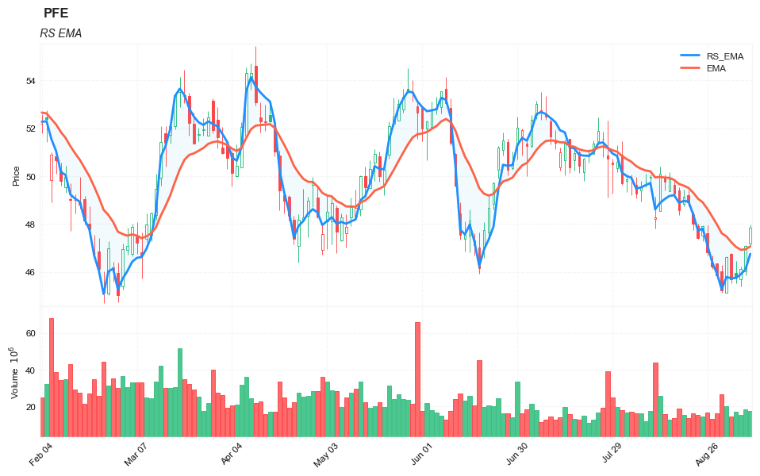

## Relative Strength Moving Averages (RS_EMA)

**References**

- [tradingview: Relative-Strength-Exponential-Moving-Average](https://www.tradingview.com/script/b3DVUyB3-TASC-2022-05-Relative-Strength-Exponential-Moving-Average/)
- [traders.com: TradersTips 2022-05](https://traders.com/Documentation/FEEDbk_docs/2022/05/TradersTips.html)


**█ OVERVIEW**

TASC's May 2022 edition Traders' Tips includes the "Relative Strength Moving Averages" article authored by Vitali Apirine. This is the code implementing the Relative Strength Exponential Moving Average (​RS EMA ) indicator introduced in this publication.


In part 1 of a three-part series focused on differences between traditional EMAs and relative strength-based EMA indicators, author Vitali Apirine introduces the relative strength exponential moving average (RS EMA). The study is designed to account for relative strength of price and is considered a trend-following indicator that can be used in combination with an EMA of the same length to identify the overall trend. RS EMAs with different lengths can define turning points and filter price movements.

**█ CONCEPTS**

RS EMA is an adaptive trend-following indicator with reduced lag characteristics. By design, this was made possible by harnessing the relative strength of price. It operates in a similar fashion to a traditional EMA , but it has an improved response to price fluctuations. In a trading strategy, ​RS EMA can be used in conjunction with an EMA of the same length to identify the overall trend (see the preview chart). Alternatively, ​RS EMAs with different lengths can define turning points and filter price movements.

RS EMA is an adaptive trend-following indicator with reduced lag characteristics. By design, this was made possible by harnessing the relative strength of price. It operates in a similar fashion to a traditional EMA , but it has an improved response to price fluctuations.

**█ CALCULATIONS**

The following steps are used in the calculation process:

- Calculate the relative strength (RS) of a given length.
- Multiply RS by a chosen coefficient (multiplier) to adapt the EMA filtering the original time series. 
- Calculate the EMA of the resulting time series.

The author recommends RS EMA (10,10,10) as typical settings, where the first parameter is the EMA length, the second parameter is the RS length, and the third parameter is the RS multiplier. Other values may be substituted depending on your trading style and goals.


##### Load basic packages 


```python
import pandas as pd
import numpy as np
import os
import gc
import copy
from pathlib import Path
from datetime import datetime, timedelta, time, date
```


```python
#this package is to download equity price data from yahoo finance
#the source code of this package can be found here: https://github.com/ranaroussi/yfinance/blob/main
import yfinance as yf
```


```python
pd.options.display.max_rows = 100
pd.options.display.max_columns = 100

import warnings
warnings.filterwarnings("ignore")

import pytorch_lightning as pl
random_seed=1234
pl.seed_everything(random_seed)
```

    Global seed set to 1234
    


    1234


```python
#S&P 500 (^GSPC),  Dow Jones Industrial Average (^DJI), NASDAQ Composite (^IXIC)
#Russell 2000 (^RUT), Crude Oil Nov 21 (CL=F), Gold Dec 21 (GC=F)
#Treasury Yield 10 Years (^TNX)

#benchmark_tickers = ['^GSPC', '^DJI', '^IXIC', '^RUT',  'CL=F', 'GC=F', '^TNX']

benchmark_tickers = ['^GSPC']
tickers = benchmark_tickers + ['GSK', 'BST', 'PFE']
```


```python
#https://github.com/ranaroussi/yfinance/blob/main/yfinance/base.py
#     def history(self, period="1mo", interval="1d",
#                 start=None, end=None, prepost=False, actions=True,
#                 auto_adjust=True, back_adjust=False,
#                 proxy=None, rounding=False, tz=None, timeout=None, **kwargs):

dfs = {}

for ticker in tickers:
    cur_data = yf.Ticker(ticker)
    hist = cur_data.history(period="max", start='2000-01-01')
    print(datetime.now(), ticker, hist.shape, hist.index.min(), hist.index.max())
    dfs[ticker] = hist
```

    2022-09-10 21:36:02.256425 ^GSPC (5710, 7) 1999-12-31 00:00:00 2022-09-09 00:00:00
    2022-09-10 21:36:02.538436 GSK (5710, 7) 1999-12-31 00:00:00 2022-09-09 00:00:00
    2022-09-10 21:36:02.724931 BST (1980, 7) 2014-10-29 00:00:00 2022-09-09 00:00:00
    2022-09-10 21:36:03.146737 PFE (5710, 7) 1999-12-31 00:00:00 2022-09-09 00:00:00
    


```python
ticker = 'PFE'
dfs[ticker].tail(5)
```


<div>
<style scoped>
    .dataframe tbody tr th:only-of-type {
        vertical-align: middle;
    }

    .dataframe tbody tr th {
        vertical-align: top;
    }

    .dataframe thead th {
        text-align: right;
    }
</style>
<table border="1" class="dataframe">
  <thead>
    <tr style="text-align: right;">
      <th></th>
      <th>Open</th>
      <th>High</th>
      <th>Low</th>
      <th>Close</th>
      <th>Volume</th>
      <th>Dividends</th>
      <th>Stock Splits</th>
    </tr>
    <tr>
      <th>Date</th>
      <th></th>
      <th></th>
      <th></th>
      <th></th>
      <th></th>
      <th></th>
      <th></th>
    </tr>
  </thead>
  <tbody>
    <tr>
      <th>2022-09-02</th>
      <td>46.740002</td>
      <td>46.799999</td>
      <td>45.529999</td>
      <td>45.700001</td>
      <td>14662700</td>
      <td>0.0</td>
      <td>0.0</td>
    </tr>
    <tr>
      <th>2022-09-06</th>
      <td>45.959999</td>
      <td>46.439999</td>
      <td>45.529999</td>
      <td>45.759998</td>
      <td>17153500</td>
      <td>0.0</td>
      <td>0.0</td>
    </tr>
    <tr>
      <th>2022-09-07</th>
      <td>45.700001</td>
      <td>46.209999</td>
      <td>45.380001</td>
      <td>46.130001</td>
      <td>15378900</td>
      <td>0.0</td>
      <td>0.0</td>
    </tr>
    <tr>
      <th>2022-09-08</th>
      <td>46.020000</td>
      <td>47.119999</td>
      <td>45.869999</td>
      <td>47.080002</td>
      <td>18271000</td>
      <td>0.0</td>
      <td>0.0</td>
    </tr>
    <tr>
      <th>2022-09-09</th>
      <td>47.200001</td>
      <td>47.990002</td>
      <td>47.099998</td>
      <td>47.840000</td>
      <td>17501700</td>
      <td>0.0</td>
      <td>0.0</td>
    </tr>
  </tbody>
</table>
</div>


##### Define Relative Strength Moving Averages (RS_EMA) calculation function


```python
def cal_rs_ema(ohlc: pd.DataFrame, 
        ema_period: int = 50,
            rs_period: int = 50,
            multiplier: float = 10.0,
            column: str = "close") -> pd.Series:
    """
    source: https://traders.com/Documentation/FEEDbk_docs/2022/05/TradersTips.html
    // This source code is subject to the terms of the Mozilla Public License 2.0 at https://mozilla.org/MPL/2.0/
    // © PineCodersTASC

    //  TASC Issue: May 2022 - Vol. 40, Issue 6
    //     Article: Relative Strength Moving Averages
    //              Part 1: The Relative Strength 
    //              Exponential Moving Average (RS EMA)
    //  Article By: Vitali Apirine
    //    Language: TradingView's Pine Script v5
    // Provided By: PineCoders, for tradingview.com

    //@version=5
    indicator('TASC 2022.05 Relative Strength EMA', 'RSEMA', true)

    float src   = input.source(close,  'Source:')
    int periods = input.int(50,    'EMA Length:', minval=14)
    int     pds = input.int(50,     'RS Length:', minval=4)
    float  mltp = input.int(10, 'RS Multiplier:', minval=0)

    rsema(float source     = close, 
     simple int emaPeriod  = 50, 
     simple int  rsPeriod  = 50, 
          float multiplier = 10.0
         ) =>
        var float mltp1 = 2.0 / (emaPeriod + 1.0)
        var float coef1 = 2.0 /  (rsPeriod + 1.0)
        var float coef2 = 1.0 - coef1
        float diff = source - nz(source[1], source)
        float cup  = diff > 0 ?          diff  : 0.0
        float cdn  = diff < 0 ? math.abs(diff) : 0.0
        float acup = na, acup := coef1 * cup + coef2 * nz(acup[1])
        float acdn = na, acdn := coef1 * cdn + coef2 * nz(acdn[1])
        float rs   = math.abs(acup - acdn) / (acup + acdn)
        float rate = mltp1 * (1.0 + nz(rs, 0.00001) * multiplier)
        float rsma = na
        rsma := rate * source + (1.0 - rate) * nz(rsma[1], source)
        rsma

    float rsema =  rsema(src, periods, pds, mltp)

    plot(rsema, title='RS EMA', color=#009900, linewidth=2)
    """
    
    
    c = ohlc[column]
    
    
    mltp1 = 2.0 / (ema_period + 1.0)
    coef1 = 2.0 /  (rs_period + 1.0)
    coef2 = 1.0 - coef1
    
    ## get the price diff
    delta = c.diff()
    delta[0] = 0 #set the 1st value as 0

    ## positive gains (up) and negative gains (down) Series
    up, down = delta.copy(), delta.copy()
    up[up < 0] = 0
    down[down > 0] = 0
    down = np.abs(down)
    
    #------
    a_up = np.zeros(len(delta))
    a_down = np.zeros(len(delta))
    for i in range(1, len(delta)):
        a_up[i] = coef1 * up[i] + coef2 * a_up[i-1]
        a_down[i] = coef1 * down[i] + coef2 * a_down[i-1]
    
    rs = np.abs(a_up-a_down)/(a_up + a_down + 0.00001)
    rate = mltp1 * (1.0 + rs * multiplier)
    
    rsma =  np.zeros(len(delta))
    rsma[0] = c[0]
    for i in range(1, len(delta)):
        rsma[i] = rate[i] * c[i] + (1.0 - rate[i]) * rsma[i-1]
        

    return pd.Series(rsma,index=ohlc.index, name=f"RS_EMA")    

```


```python
def cal_rs_ema(ohlc: pd.DataFrame, 
        ema_period: int = 50,
            rs_period: int = 50,
            multiplier: float = 10.0,
            column: str = "close",
        adjust: bool = True,) -> pd.Series:
    """
    source: https://traders.com/Documentation/FEEDbk_docs/2022/05/TradersTips.html
    inputs:
        Periods( 50 ),
        Pds( 50 ),
        Mltp( 10 );

    Mltp1 = 2 / ( Periods + 1 );
    Cup = Iff( Close > Close[1], Close - Close[1] , 0 );
    Cdwn = Iff( Close < Close[1], Close[1]-Close, 0 );
    RS = AbsValue( XAverage( CUP, Pds )- XAverage( Cdwn, Pds ) ) / 
     ( XAverage( CUP, Pds ) + XAverage( Cdwn, Pds ) + 0.00001 );

    RS = RS * Mltp;
    Rate = Mltp1 * ( 1 + RS );

    CalcValue = Iff( CurrentBar = 1, Close, CalcValue[1] + Rate *( Close - CalcValue[1] ) );

    """
    
    
    c = ohlc[column]
    
    mltp1 = 2.0 / (ema_period + 1.0)
    
    ## get the price diff
    delta = c.diff()
    delta[0] = 0 #set the 1st value as 0

    ## positive gains (up) and negative gains (down) Series
    up, down = delta.copy(), delta.copy()
    up[up < 0] = 0
    down[down > 0] = 0
    
    

    # EMAs of ups and downs
    _gain = up.ewm(span= rs_period, adjust=adjust).mean()
    _loss = down.abs().ewm(span= rs_period, adjust=adjust).mean()
    rs = (_gain - _loss)/(_gain + _loss + 0.00001 )
    rs = rs.abs()*multiplier
    rate = mltp1 * (1.0 + rs)
        
    
    rsma =  np.zeros(len(delta))
    rsma[0] = c[0]
    for i in range(1, len(delta)):
        rsma[i] = rate[i] * c[i] + (1.0 - rate[i]) * rsma[i-1]
        

    return pd.Series(rsma,index=ohlc.index, name=f"RS_EMA")    

```

##### Calculate Relative Strength Moving Averages (RS_EMA) 

Note: the 2 functions defined in previous cells render same results.


```python
df = dfs[ticker][['Open', 'High', 'Low', 'Close', 'Volume']]
```


```python
df = df.round(2)
```


```python
cal_rs_ema
```


    <function __main__.cal_rs_ema(ohlc: pandas.core.frame.DataFrame, ema_period: int = 50, rs_period: int = 50, multiplier: float = 10.0, column: str = 'close', adjust: bool = True) -> pandas.core.series.Series>


```python
df_ta = cal_rs_ema(df, ema_period=14, rs_period=14, multiplier=10, column="Close")
df = df.merge(df_ta, left_index = True, right_index = True, how='inner' )

del df_ta
gc.collect()
```


    38


```python
from core.finta import TA
```


```python
help(TA.EMA)
```

    Help on function EMA in module core.finta:
    
    EMA(ohlc: pandas.core.frame.DataFrame, period: int = 9, column: str = 'close', adjust: bool = True) -> pandas.core.series.Series
        Exponential Weighted Moving Average - Like all moving average indicators, they are much better suited for trending markets.
        When the market is in a strong and sustained uptrend, the EMA indicator line will also show an uptrend and vice-versa for a down trend.
        EMAs are commonly used in conjunction with other indicators to confirm significant market moves and to gauge their validity.
    
    


```python
df_ta = TA.EMA(df, period = 14, column="close")
df_ta.name='EMA'
df = df.merge(df_ta, left_index = True, right_index = True, how='inner' )

del df_ta
gc.collect()
```


    21


```python
display(df.head(5))
display(df.tail(5))
```


<div>
<style scoped>
    .dataframe tbody tr th:only-of-type {
        vertical-align: middle;
    }

    .dataframe tbody tr th {
        vertical-align: top;
    }

    .dataframe thead th {
        text-align: right;
    }
</style>
<table border="1" class="dataframe">
  <thead>
    <tr style="text-align: right;">
      <th></th>
      <th>Open</th>
      <th>High</th>
      <th>Low</th>
      <th>Close</th>
      <th>Volume</th>
      <th>RS_EMA</th>
      <th>EMA</th>
    </tr>
    <tr>
      <th>Date</th>
      <th></th>
      <th></th>
      <th></th>
      <th></th>
      <th></th>
      <th></th>
      <th></th>
    </tr>
  </thead>
  <tbody>
    <tr>
      <th>1999-12-31</th>
      <td>14.25</td>
      <td>14.31</td>
      <td>14.11</td>
      <td>14.22</td>
      <td>5939817</td>
      <td>14.220000</td>
      <td>14.220000</td>
    </tr>
    <tr>
      <th>2000-01-03</th>
      <td>14.06</td>
      <td>14.20</td>
      <td>13.87</td>
      <td>13.98</td>
      <td>12873345</td>
      <td>13.868025</td>
      <td>14.091429</td>
    </tr>
    <tr>
      <th>2000-01-04</th>
      <td>13.70</td>
      <td>13.81</td>
      <td>13.16</td>
      <td>13.46</td>
      <td>14208974</td>
      <td>13.269608</td>
      <td>13.850221</td>
    </tr>
    <tr>
      <th>2000-01-05</th>
      <td>13.54</td>
      <td>13.98</td>
      <td>13.51</td>
      <td>13.68</td>
      <td>12981591</td>
      <td>13.588566</td>
      <td>13.798145</td>
    </tr>
    <tr>
      <th>2000-01-06</th>
      <td>13.70</td>
      <td>14.36</td>
      <td>13.68</td>
      <td>14.17</td>
      <td>11115273</td>
      <td>13.750629</td>
      <td>13.895162</td>
    </tr>
  </tbody>
</table>
</div>


<div>
<style scoped>
    .dataframe tbody tr th:only-of-type {
        vertical-align: middle;
    }

    .dataframe tbody tr th {
        vertical-align: top;
    }

    .dataframe thead th {
        text-align: right;
    }
</style>
<table border="1" class="dataframe">
  <thead>
    <tr style="text-align: right;">
      <th></th>
      <th>Open</th>
      <th>High</th>
      <th>Low</th>
      <th>Close</th>
      <th>Volume</th>
      <th>RS_EMA</th>
      <th>EMA</th>
    </tr>
    <tr>
      <th>Date</th>
      <th></th>
      <th></th>
      <th></th>
      <th></th>
      <th></th>
      <th></th>
      <th></th>
    </tr>
  </thead>
  <tbody>
    <tr>
      <th>2022-09-02</th>
      <td>46.74</td>
      <td>46.80</td>
      <td>45.53</td>
      <td>45.70</td>
      <td>14662700</td>
      <td>45.737681</td>
      <td>47.243850</td>
    </tr>
    <tr>
      <th>2022-09-06</th>
      <td>45.96</td>
      <td>46.44</td>
      <td>45.53</td>
      <td>45.76</td>
      <td>17153500</td>
      <td>45.749729</td>
      <td>47.046004</td>
    </tr>
    <tr>
      <th>2022-09-07</th>
      <td>45.70</td>
      <td>46.21</td>
      <td>45.38</td>
      <td>46.13</td>
      <td>15378900</td>
      <td>45.901653</td>
      <td>46.923870</td>
    </tr>
    <tr>
      <th>2022-09-08</th>
      <td>46.02</td>
      <td>47.12</td>
      <td>45.87</td>
      <td>47.08</td>
      <td>18271000</td>
      <td>46.108558</td>
      <td>46.944687</td>
    </tr>
    <tr>
      <th>2022-09-09</th>
      <td>47.20</td>
      <td>47.99</td>
      <td>47.10</td>
      <td>47.84</td>
      <td>17501700</td>
      <td>46.750357</td>
      <td>47.064062</td>
    </tr>
  </tbody>
</table>
</div>


```python
df[['RS_EMA']].hist(bins=50)
```


    array([[<AxesSubplot:title={'center':'RS_EMA'}>]], dtype=object)


    

    


```python
from core.visuals import *
```


```python
start = -150
end = df.shape[0]

names = {'main_title': f'{ticker}', 
         'sub_tile': 'RS EMA'}


lines_ = basic_lines(df.iloc[start:end][['RS_EMA', 'EMA']], colors = [], **dict(panel=0, width=2, secondary_y=False))
shadows_ = basic_shadows(data = df.iloc[start:end][['RS_EMA', 'EMA']],  **dict(color="lightskyblue",alpha=0.1,interpolate=True), panel=0)

fig_config_ = dict(figratio=(18,10), volume=True, volume_panel=1,panel_ratios=(4,2), tight_layout=True, returnfig=True,)

ax_cfg_ = {0:dict(basic=[4, 2, ['RS_EMA', 'EMA']], 
                 title=dict(label = 'RS EMA', fontsize=10, style='italic',  loc='left'), 
                 
                ),
         }


aa_, bb_ = make_panels(main_data = df.iloc[start:end][['Open', 'High', 'Low', 'Close', 'Volume']], 
                       added_plots = lines_,
                       fill_betweens = shadows_, 
                       fig_config = fig_config_, 
                       axes_config = ax_cfg_,  
                       names = names)
```


    

    

