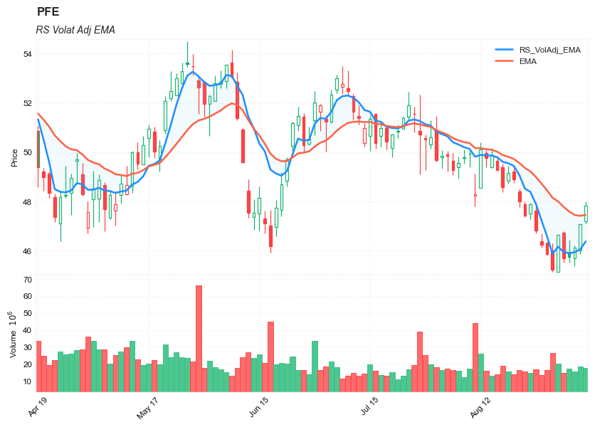

## The Relative Strength Volatility-Adjusted Exponential Moving Average (RS VolatAdj EMA)

**References**

- [tradingview: Relative-Strength-Volatility-Adjusted-EMA](https://www.tradingview.com/script/3aTtNsrv-TASC-2022-03-Relative-Strength-Volatility-Adjusted-EMA/)
- [traders.com: TradersTips 2022-03](https://traders.com/Documentation/FEEDbk_docs/2022/03/TradersTips.html)


**█ OVERVIEW**

TASC's March 2022 edition of Traders' Tips includes the "Relative Strength Moving Averages - Part 3: The Relative Strength Volatility-Adjusted Exponential Moving Average" article authored by Vitali Apirine. 


**█ CONCEPTS**

In a three-part article series, Vitaly Apirine examines ways to filter price movements and define turning points by applying the Relative Strength concept to exponential moving averages. The resulting indicator is more responsive and is intended to account for the relative strength of volatility.


**█ CALCULATIONS**

The calculation process uses the following steps:

- Select an appropriate volatility index (in our case it is VIX).
- Calculate up day volatility (UV) smoothed by a 10-day EMA .
- Calculate down day volatility ( DV ) smoothed by a 10-day EMA .
- Take the absolute value of the difference between UV and DV and divide by the sum of UV and DV . This is the Volatility Strength we need.
- Calculate a MLTP constant - the weighting multiplier for an exponential moving average .
- Combine Volatility Strength and MLTP to create an exponential moving average on current price data.


##### Load basic packages 


```python
import pandas as pd
import numpy as np
import os
import gc
import copy
from pathlib import Path
from datetime import datetime, timedelta, time, date
```


```python
#this package is to download equity price data from yahoo finance
#the source code of this package can be found here: https://github.com/ranaroussi/yfinance/blob/main
import yfinance as yf
```


```python
pd.options.display.max_rows = 100
pd.options.display.max_columns = 100

import warnings
warnings.filterwarnings("ignore")

import pytorch_lightning as pl
random_seed=1234
pl.seed_everything(random_seed)
```

    Global seed set to 1234
    


    1234


```python
#S&P 500 (^GSPC),  Dow Jones Industrial Average (^DJI), NASDAQ Composite (^IXIC)
#Russell 2000 (^RUT), Crude Oil Nov 21 (CL=F), Gold Dec 21 (GC=F)
#Treasury Yield 10 Years (^TNX)
#CBOE Volatility Index (^VIX) Chicago Options - Chicago Options Delayed Price. Currency in USD

#benchmark_tickers = ['^GSPC', '^DJI', '^IXIC', '^RUT',  'CL=F', 'GC=F', '^TNX']

benchmark_tickers = ['^GSPC', '^VIX']
tickers = benchmark_tickers + ['GSK', 'BST', 'PFE']
```


```python
#https://github.com/ranaroussi/yfinance/blob/main/yfinance/base.py
#     def history(self, period="1mo", interval="1d",
#                 start=None, end=None, prepost=False, actions=True,
#                 auto_adjust=True, back_adjust=False,
#                 proxy=None, rounding=False, tz=None, timeout=None, **kwargs):

dfs = {}

for ticker in tickers:
    cur_data = yf.Ticker(ticker)
    hist = cur_data.history(period="max", start='2000-01-01')
    print(datetime.now(), ticker, hist.shape, hist.index.min(), hist.index.max())
    dfs[ticker] = hist
```

    2022-09-10 21:37:03.429594 ^GSPC (5710, 7) 1999-12-31 00:00:00 2022-09-09 00:00:00
    2022-09-10 21:37:03.820249 ^VIX (5710, 7) 1999-12-31 00:00:00 2022-09-09 00:00:00
    2022-09-10 21:37:04.210856 GSK (5710, 7) 1999-12-31 00:00:00 2022-09-09 00:00:00
    2022-09-10 21:37:04.503963 BST (1980, 7) 2014-10-29 00:00:00 2022-09-09 00:00:00
    2022-09-10 21:37:04.911156 PFE (5710, 7) 1999-12-31 00:00:00 2022-09-09 00:00:00
    


```python
ticker = 'PFE'
dfs[ticker].tail(5)
```


<div>
<style scoped>
    .dataframe tbody tr th:only-of-type {
        vertical-align: middle;
    }

    .dataframe tbody tr th {
        vertical-align: top;
    }

    .dataframe thead th {
        text-align: right;
    }
</style>
<table border="1" class="dataframe">
  <thead>
    <tr style="text-align: right;">
      <th></th>
      <th>Open</th>
      <th>High</th>
      <th>Low</th>
      <th>Close</th>
      <th>Volume</th>
      <th>Dividends</th>
      <th>Stock Splits</th>
    </tr>
    <tr>
      <th>Date</th>
      <th></th>
      <th></th>
      <th></th>
      <th></th>
      <th></th>
      <th></th>
      <th></th>
    </tr>
  </thead>
  <tbody>
    <tr>
      <th>2022-09-02</th>
      <td>46.740002</td>
      <td>46.799999</td>
      <td>45.529999</td>
      <td>45.700001</td>
      <td>14662700</td>
      <td>0.0</td>
      <td>0.0</td>
    </tr>
    <tr>
      <th>2022-09-06</th>
      <td>45.959999</td>
      <td>46.439999</td>
      <td>45.529999</td>
      <td>45.759998</td>
      <td>17153500</td>
      <td>0.0</td>
      <td>0.0</td>
    </tr>
    <tr>
      <th>2022-09-07</th>
      <td>45.700001</td>
      <td>46.209999</td>
      <td>45.380001</td>
      <td>46.130001</td>
      <td>15378900</td>
      <td>0.0</td>
      <td>0.0</td>
    </tr>
    <tr>
      <th>2022-09-08</th>
      <td>46.020000</td>
      <td>47.119999</td>
      <td>45.869999</td>
      <td>47.080002</td>
      <td>18271000</td>
      <td>0.0</td>
      <td>0.0</td>
    </tr>
    <tr>
      <th>2022-09-09</th>
      <td>47.200001</td>
      <td>47.990002</td>
      <td>47.099998</td>
      <td>47.840000</td>
      <td>17501700</td>
      <td>0.0</td>
      <td>0.0</td>
    </tr>
  </tbody>
</table>
</div>


##### Define Relative Strength Moving Averages (RS_EMA) calculation function


```python
def cal_rs_volat_ema(ohlc: pd.DataFrame, vix: pd.Series, 
            ema_period: int = 10,
            rs_period: int = 10,
            multiplier: float = 10.0,
            column: str = "close") -> pd.Series:
    """
    source: https://traders.com/Documentation/FEEDbk_docs/2022/03/TradersTips.html
    rsvae(source, srcVIX, periodEMA, periodVolatS, multVolatS) =>
        var MULT = 2.0 / (math.max(1.0, periodEMA) + 1.0)
        var ALPH = 2.0 / (math.max(1.0, periodVolatS) + 1.0)
        var BETA = 1.0 - ALPH
        volatUp   = source > nz(source[1], source) ? srcVIX : 0.0
        volatDown = source < nz(source[1], source) ? srcVIX : 0.0
        volatUpEMA  = float(na)
        volatUpEMA :=        volatUp  * ALPH +
         nz(volatUpEMA[1],   volatUp) * BETA
        volatDnEMA  = float(na)
        volatDnEMA :=      volatDown  * ALPH +
         nz(volatDnEMA[1], volatDown) * BETA
        VolatS =  nz(math.abs(volatUpEMA - volatDnEMA) /
                             (volatUpEMA + volatDnEMA))
        rsVolatAdjEMA  = source
        lastRSVAE      = nz(rsVolatAdjEMA[1], rsVolatAdjEMA)
        rsVolatAdjEMA := lastRSVAE + (source - lastRSVAE) * MULT *
                       (1.0 +  VolatS * math.max(0.0, multVolatS))
        rsVolatAdjEMA

    """
      
    close = ohlc[column]
    
    mult = 2.0 / (np.max([1.0, ema_period]) + 1.0)
    alph = 2.0 / (np.max([1.0, rs_period]) + 1.0)
    beta = 1.0 - alph
    
    volat_up = (close>close.shift(1)).astype(int)*vix
    volat_down = (close<close.shift(1)).astype(int)*vix
    
    volat_up_ema = np.zeros(len(close))
    volat_up_ema[0] = volat_up[0]
    
    volat_down_ema = np.zeros(len(close))
    volat_down_ema[0] = volat_down[0]
    
    for i in range(1, len(close)):
        volat_up_ema[i] = volat_up[i]*alph + volat_up_ema[i-1]*beta
        volat_down_ema[i] = volat_down[i]*alph + volat_down_ema[i-1]*beta
        
    volat_s = np.abs(volat_up_ema - volat_down_ema)/(volat_up_ema + volat_down_ema)
    rs_volat_adj_ema = close
    for i in range(1, len(close)):
        rs_volat_adj_ema[i] = rs_volat_adj_ema[i-1] + (close[i] - rs_volat_adj_ema[i-1])*mult*(1+volat_s[i]*multiplier)
        
    

    return pd.Series(rs_volat_adj_ema,index=ohlc.index, name=f"RS_VolAdj_EMA")    

```


```python
def cal_rs_volat_ema(ohlc: pd.DataFrame, vix: pd.Series, 
            ema_period: int = 10,
            rs_period: int = 10,
            multiplier: float = 10.0,
            column: str = "close",
        adjust: bool = True,) -> pd.Series:
    """
    source: https://traders.com/Documentation/FEEDbk_docs/2022/03/TradersTips.html
    inputs:
        int Periods( 10 ), int Pds( 10 ),  int Mltp( 10 );

    Mltp1 = 2 / (Periods + 1);
    VolatC = Close of Data2;
    VolatUpDay = IFF(Close > Close[1], VolatC, 0);
    VolatDwnDay = IFF(C < Close[1], VolatC, 0);
    RS = AbsValue(XAverage(VolatUpDay, Pds) -
     XAverage(VolatDwnDay, Pds)) / (XAverage(VolatUpDay, Pds) +
     XAverage(VolatDwnDay, Pds) + 0.00001);
    RS = RS * Mltp;
    Rate = Mltp1 * (1 + RS);

    If CurrentBar = Periods + 1 then
        PlotValue = Close
    else
        PlotValue = PlotValue[1] + Rate * (Close - PlotValue[1]);

    """
    close = ohlc[column].copy()
    
    mltp1 = 2.0 / (ema_period + 1.0)
    volat_up = (close>close.shift(1)).astype(int)*vix
    volat_down = (close<close.shift(1)).astype(int)*vix
    
    # EMAs of ups and downs
    _gain = volat_up.ewm(span= rs_period, adjust=adjust).mean()
    _loss = volat_down.ewm(span= rs_period, adjust=adjust).mean()
    
    rs = (_gain - _loss)/(_gain + _loss + 0.00001 )
    rs = rs.abs()*multiplier
    rate = mltp1 * (1.0 + rs)    
    
    _rsma =  close
    for i in range(1, len(close)):
        _rsma[i] = _rsma[i-1] + rate[i]*(close[i] - _rsma[i-1])
            

    return pd.Series(_rsma,index=ohlc.index, name=f"RS_VolAdj_EMA")    

```

##### Calculate Relative Strength Moving Averages (RS_EMA)


```python
df = dfs[ticker][['Open', 'High', 'Low', 'Close', 'Volume']]
```


```python
df = df.round(2)
```


```python
df_vix = dfs[ '^VIX'][['Open', 'High', 'Low', 'Close', 'Volume']]
```


```python
cal_rs_volat_ema
```


    <function __main__.cal_rs_volat_ema(ohlc: pandas.core.frame.DataFrame, vix: pandas.core.series.Series, ema_period: int = 10, rs_period: int = 10, multiplier: float = 10.0, column: str = 'close', adjust: bool = True) -> pandas.core.series.Series>


```python
df_ta = cal_rs_volat_ema(df, vix = df_vix["Close"], ema_period=20, rs_period=20, multiplier=10, column="Close")
df = df.merge(df_ta, left_index = True, right_index = True, how='inner' )

del df_ta
gc.collect()
```


    38


```python
from core.finta import TA
```


```python
df_ta = TA.EMA(df, period = 20, column="close")
df_ta.name='EMA'
df = df.merge(df_ta, left_index = True, right_index = True, how='inner' )

del df_ta
gc.collect()
```


    0


```python
display(df.head(5))
display(df.tail(5))
```


<div>
<style scoped>
    .dataframe tbody tr th:only-of-type {
        vertical-align: middle;
    }

    .dataframe tbody tr th {
        vertical-align: top;
    }

    .dataframe thead th {
        text-align: right;
    }
</style>
<table border="1" class="dataframe">
  <thead>
    <tr style="text-align: right;">
      <th></th>
      <th>Open</th>
      <th>High</th>
      <th>Low</th>
      <th>Close</th>
      <th>Volume</th>
      <th>RS_VolAdj_EMA</th>
      <th>EMA</th>
    </tr>
    <tr>
      <th>Date</th>
      <th></th>
      <th></th>
      <th></th>
      <th></th>
      <th></th>
      <th></th>
      <th></th>
    </tr>
  </thead>
  <tbody>
    <tr>
      <th>1999-12-31</th>
      <td>14.25</td>
      <td>14.31</td>
      <td>14.11</td>
      <td>14.22</td>
      <td>5939817</td>
      <td>14.220000</td>
      <td>14.220000</td>
    </tr>
    <tr>
      <th>2000-01-03</th>
      <td>14.06</td>
      <td>14.20</td>
      <td>13.87</td>
      <td>13.98</td>
      <td>12873345</td>
      <td>13.968572</td>
      <td>14.094000</td>
    </tr>
    <tr>
      <th>2000-01-04</th>
      <td>13.70</td>
      <td>13.81</td>
      <td>13.16</td>
      <td>13.46</td>
      <td>14208974</td>
      <td>13.435783</td>
      <td>13.861199</td>
    </tr>
    <tr>
      <th>2000-01-05</th>
      <td>13.54</td>
      <td>13.98</td>
      <td>13.51</td>
      <td>13.68</td>
      <td>12981591</td>
      <td>13.517779</td>
      <td>13.808890</td>
    </tr>
    <tr>
      <th>2000-01-06</th>
      <td>13.70</td>
      <td>14.36</td>
      <td>13.68</td>
      <td>14.17</td>
      <td>11115273</td>
      <td>13.646287</td>
      <td>13.896239</td>
    </tr>
  </tbody>
</table>
</div>


<div>
<style scoped>
    .dataframe tbody tr th:only-of-type {
        vertical-align: middle;
    }

    .dataframe tbody tr th {
        vertical-align: top;
    }

    .dataframe thead th {
        text-align: right;
    }
</style>
<table border="1" class="dataframe">
  <thead>
    <tr style="text-align: right;">
      <th></th>
      <th>Open</th>
      <th>High</th>
      <th>Low</th>
      <th>Close</th>
      <th>Volume</th>
      <th>RS_VolAdj_EMA</th>
      <th>EMA</th>
    </tr>
    <tr>
      <th>Date</th>
      <th></th>
      <th></th>
      <th></th>
      <th></th>
      <th></th>
      <th></th>
      <th></th>
    </tr>
  </thead>
  <tbody>
    <tr>
      <th>2022-09-02</th>
      <td>46.74</td>
      <td>46.80</td>
      <td>45.53</td>
      <td>45.70</td>
      <td>14662700</td>
      <td>45.952940</td>
      <td>47.783659</td>
    </tr>
    <tr>
      <th>2022-09-06</th>
      <td>45.96</td>
      <td>46.44</td>
      <td>45.53</td>
      <td>45.76</td>
      <td>17153500</td>
      <td>45.892884</td>
      <td>47.590930</td>
    </tr>
    <tr>
      <th>2022-09-07</th>
      <td>45.70</td>
      <td>46.21</td>
      <td>45.38</td>
      <td>46.13</td>
      <td>15378900</td>
      <td>45.939431</td>
      <td>47.451794</td>
    </tr>
    <tr>
      <th>2022-09-08</th>
      <td>46.02</td>
      <td>47.12</td>
      <td>45.87</td>
      <td>47.08</td>
      <td>18271000</td>
      <td>46.049942</td>
      <td>47.416385</td>
    </tr>
    <tr>
      <th>2022-09-09</th>
      <td>47.20</td>
      <td>47.99</td>
      <td>47.10</td>
      <td>47.84</td>
      <td>17501700</td>
      <td>46.373678</td>
      <td>47.456729</td>
    </tr>
  </tbody>
</table>
</div>


```python
df[['RS_VolAdj_EMA']].hist(bins=50)
```


    array([[<AxesSubplot:title={'center':'RS_VolAdj_EMA'}>]], dtype=object)


    

    


```python
#https://github.com/matplotlib/mplfinance
#this package help visualize financial data
import mplfinance as mpf
import matplotlib.colors as mcolors

# all_colors = list(mcolors.CSS4_COLORS.keys())#"CSS Colors"
# all_colors = list(mcolors.TABLEAU_COLORS.keys()) # "Tableau Palette",
# all_colors = list(mcolors.BASE_COLORS.keys()) #"Base Colors",
all_colors = ['dodgerblue', 'firebrick','limegreen','skyblue','lightgreen',  'navy','yellow','plum',  'yellowgreen']
#https://github.com/matplotlib/mplfinance/issues/181#issuecomment-667252575
#list of colors: https://matplotlib.org/stable/gallery/color/named_colors.html
#https://github.com/matplotlib/mplfinance/blob/master/examples/styles.ipynb

def make_3panels2(main_data, add_data, mid_panel=None, chart_type='candle', names=None, figratio=(14,9)):

    style = mpf.make_mpf_style(base_mpf_style='yahoo',  #charles
                               base_mpl_style = 'seaborn-whitegrid',
#                                marketcolors=mpf.make_marketcolors(up="r", down="#0000CC",inherit=True),
                               gridcolor="whitesmoke", 
                               gridstyle="--", #or None, or - for solid
                               gridaxis="both", 
                               edgecolor = 'whitesmoke',
                               facecolor = 'white', #background color within the graph edge
                               figcolor = 'white', #background color outside of the graph edge
                               y_on_right = False,
                               rc =  {'legend.fontsize': 'small',#or number
                                      #'figure.figsize': (14, 9),
                                     'axes.labelsize': 'small',
                                     'axes.titlesize':'small',
                                     'xtick.labelsize':'small',#'x-small', 'small','medium','large'
                                     'ytick.labelsize':'small'
                                     }, 
                              )   

    if (chart_type is None) or (chart_type not in ['ohlc', 'line', 'candle', 'hollow_and_filled']):
        chart_type = 'candle'
    len_dict = {'candle':2, 'ohlc':3, 'line':1, 'hollow_and_filled':2}    
        
    kwargs = dict(type=chart_type, figratio=figratio, volume=True, volume_panel=1, 
                  panel_ratios=(4,2), tight_layout=True, style=style, returnfig=True)
    
    if names is None:
        names = {'main_title': '', 'sub_tile': ''}
    
    added_plots = { 
#         'S':  mpf.make_addplot(add_data['S'], panel=0, color='blue', type='scatter', marker=r'${S}$' , markersize=100, secondary_y=False),   
#         'B':  mpf.make_addplot(add_data['B'], panel=0, color='blue', type='scatter', marker=r'${B}$' , markersize=100, secondary_y=False), 
        
        'RS_VolAdj_EMA': mpf.make_addplot(add_data['RS_VolAdj_EMA'], panel=0, color='dodgerblue', secondary_y=False), 
        'EMA': mpf.make_addplot(add_data['EMA'], panel=0, color='tomato', secondary_y=False), 
    }

        
      
    fb_bbands_ = dict(y1=add_data.iloc[:, 0].values,
                      y2=add_data.iloc[:, 1].values,color="lightskyblue",alpha=0.1,interpolate=True)
    fb_bbands_['panel'] = 0
    

    fb_bbands= [fb_bbands_]
    
    
    if mid_panel is not None:
        i = 0
        for name_, data_ in mid_panel.iteritems():
            added_plots[name_] = mpf.make_addplot(data_, panel=1, color=all_colors[i])
            i = i + 1
        fb_bbands2_ = dict(y1=np.zeros(mid_panel.shape[0]),
                      y2=0.8+np.zeros(mid_panel.shape[0]),color="lightskyblue",alpha=0.1,interpolate=True)
        fb_bbands2_['panel'] = 1
        fb_bbands.append(fb_bbands2_)


    fig, axes = mpf.plot(main_data,  **kwargs,
                         addplot=list(added_plots.values()), 
                         fill_between=fb_bbands)
    # add a new suptitle
    fig.suptitle(names['main_title'], y=1.05, fontsize=12, x=0.1285)

    axes[0].legend([None]*4)
    handles = axes[0].get_legend().legendHandles
    axes[0].legend(handles=handles[2:],labels=['RS_VolAdj_EMA', 'EMA'])
    axes[0].set_title(names['sub_tile'], fontsize=10, style='italic',  loc='left')
    

#     axes[0].set_ylabel(names['y_tiles'][0])
#     axes[2].set_ylabel(names['y_tiles'][1])
    return fig, axes
   
```


```python

start = -100
end = df.shape[0]

names = {'main_title': f'{ticker}', 
         'sub_tile': 'RS Volat Adj EMA'}


aa_, bb_ = make_3panels2(df.iloc[start:end][['Open', 'High', 'Low', 'Close', 'Volume']], 
            df.iloc[start:end][['RS_VolAdj_EMA', 'EMA']],
             chart_type='hollow_and_filled',names = names)
```


    

    

